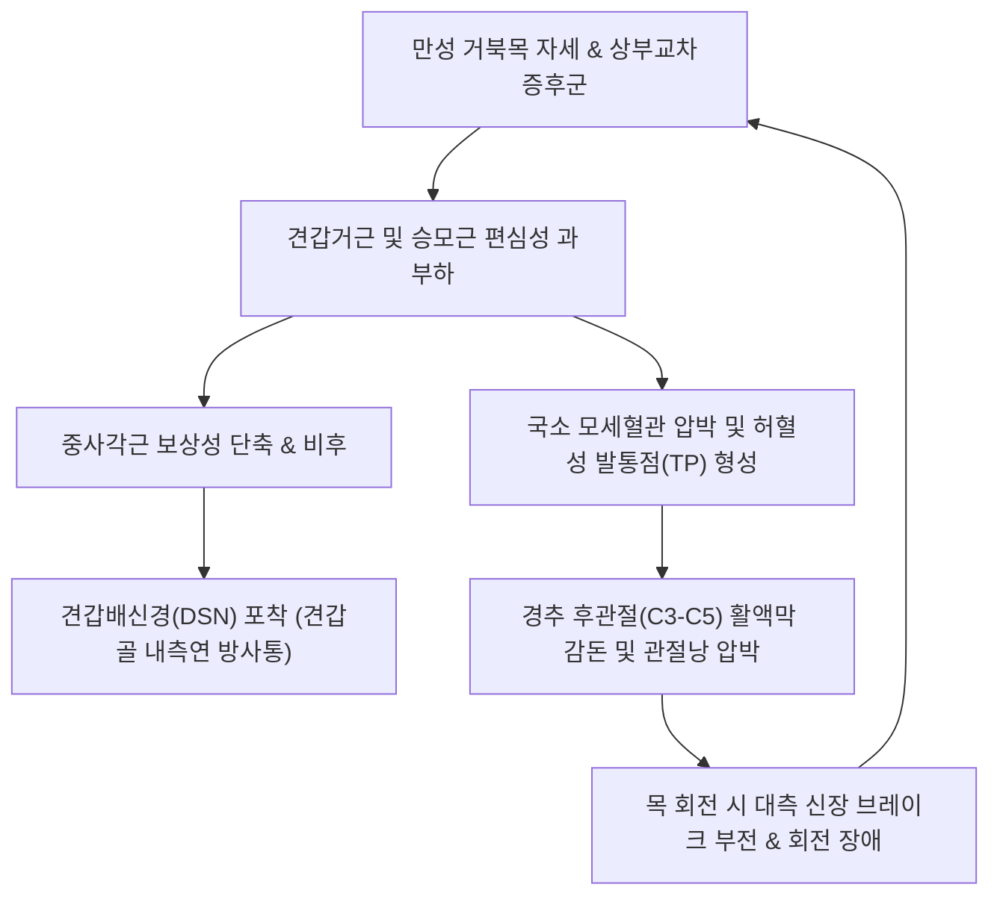

# 🩺 [[뒷목 통증]] (Neck Pain / Cervicalgia / 頸項痛, M54.2)

> **핵심 3줄 요약 (Key Summary)**:
> - 📍 병소 부위 & 해부·병태생리: 경추 후방 근막([[견갑거근]], 상부 [[승모근]], [[두판상근]])의 만성 과부하 및 [[중사각근]]을 관통하는 [[견갑배신경]] 포착, 경추 후관절낭 마모로 인해 발생하는 다빈도 임상 증후군입니다.
> - 🚩 전형적 임상 양상 & 3대 징후: 목을 회전하거나 젖힐 때의 날카로운 결림(회전 제한), 뒷목 기저부에서 견갑골 상각 및 내측연으로 뻗치는 묵직한 방사통, 아침 기상 시 급격한 가동 장애([[낙침]]).
> - 🛠️ 핵심 감별 검사 & 한·양방 다각적 치료 전략: 견갑골 수동 거상 완화 검사, 유양돌기 및 C1-C4 횡돌기 거점 자침, 낙침혈·후계혈 동기요법, 경추 JS 가동 추나 및 견갑골 유리술, [[갈근탕]]·[[회수산]] 투여.
> - ⚠️ 응급 의뢰 레드플래그 & 악화 요인: 상지 방사통 및 수부 교치성 운동 장애(단추 채우기 불가), 보행 실조를 보이는 경추 척수증(Myelopathy) 징후는 즉각적인 정밀 MRI 검사 의뢰.

---

## 📌 목차
1. [질환 개요 & 해부학적 병태생리](#1-질환-개요--해부학적-병태생리)
2. [병태생리 메커니즘 & 생체역학적 악순환 네트워크](#2-병태생리-메커니즘--생체역학적-악순환-네트워크)
3. [임상 증상 & 이학적 검사(Physical Exam) 알고리즘](#3-임상-증상--이학적-검사physical-exam-알고리즘)
4. [감별 진단 매트릭스 (Differential Diagnosis)](#4-감별-진단-매트릭스-differential-diagnosis)
5. [한의 통합 치료 프로토콜 (침·약침·추나·한약)](#5-한의-통합-치료-프로토콜-침약침추나한약)
6. [양방 치료 & 병용·의뢰 기준 (Conventional Treatment & Referral)](#6-양방-치료--병용의뢰-기준-conventional-treatment--referral)
7. [재활 운동 & 생활습관 티칭 가이드](#6-재활-운동--생활습관-티칭-가이드)
8. [💡 사용자 진료실 핵심 필기 & 임상 노하우 (Melt-In 잔여 심화 집약)](#7--사용자-진료실-핵심-필기--임상-노하우-melt-in-잔여-심화-집약)
9. [출처 및 학술 참고 문헌 (References)](#8-출처-및-학술-참고-문헌-references)

---

## 1. 질환 개요 & 해부학적 병태생리

![[Levator_scapulae_anatomy.png|350]]
> [그림 1: 경추 횡돌기(C1-C4)에서 기시하여 견갑골 상각(Superior angle)으로 주행하는 견갑거근(Levator scapulae)의 후면 해부도]

* **질환 정의**:
  * [[뒷목 통증]](Neck pain, Cervicalgia)은 경추 후방 연부조직의 만성적인 긴장, 관절 기능부전, 인대 및 신경 포착으로 인해 목덜미부터 상배부에 이르기까지 발생하는 통증과 운동 제한을 포괄합니다.
* **관련 해부학적 구조물**:
  * **골격 및 관절**: C1-C7 경추 후관절(Facet joint), C1-C4 횡돌기 후결절, 견갑골 상각, 측두골 유양돌기.
  * **근육 및 근막**: [[견갑거근]](Levator scapulae), 상부 [[승모근]](Trapezius), [[두판상근]](Splenius capitis), [[경판상근]](Splenius cervicis), [[중사각근]](Middle scalene), [[능형근]](Rhomboid), 경추 [[다열근]](Multifidus).
  * **신경 및 혈관**: [[견갑배신경]](Dorsal scapular nerve, C5), [[대후두신경]](GON), 경신경 후지 내측지, 척추동맥.

![[Trapezius_TriggerPoints.jpg|320]]
> [그림 2: 상부 승모근 발통점(TP1)과 뒷목, 유양돌기, 측두부 관자놀이로 이어지는 연관 방사통 도해]

* **뒷목 통증의 핵심 발생 기전**:
  1. **견갑거근의 허혈성 통증 기전**:
     - 머리가 전방으로 1인치 전위될 때마다 경추 후방 근육군에는 4~5kg의 추가적인 편심성 과부하가 걸립니다.
     - 고개 숙임([[거북목]]) 지속 $\rightarrow$ [[견갑거근]] 등척성 수축 $\rightarrow$ 근내 미세혈관 압박 및 국소 허혈 $\rightarrow$ ATP 고갈 및 통증 유발 물질(Substance P, 브라디키닌) 방출 $\rightarrow$ 묵직하고 쑤시는 뒷목 결림 유발.
  2. **견갑배신경(Dorsal Scapular Nerve) 포착 기전**:
     - [[견갑배신경]]은 [[상완신경총]]에서 기시하여 [[중사각근]] 근복을 관통한 뒤 [[견갑거근]] 심부를 지나 [[능형근]]으로 주행합니다.
     - 흉식호흡 및 경추 전방 전위로 [[중사각근]]이 비후되면 견갑배신경이 올가미처럼 포착되어 뒷목 기저부와 견갑골 안쪽 심부의 타는 듯한 신경병증성 통증을 초래합니다.

---

## 2. 병태생리 메커니즘 & 생체역학적 악순환 네트워크

![[Levator_scapulae_TriggerPoints.jpg|420]]
> [그림 3: 견갑거근의 발통점(상부 횡돌기 부근, 하부 견갑골 상각 부근)과 뒷목, 견갑골 내측연으로의 전형적 방사통]

### 1) 목 회전 제어 2대 해부학적 거점
* **유양돌기(Mastoid process) 거점**: [[흉쇄유돌근]](SCM), [[두판상근]].
* **경추 횡돌기(Transverse process) 거점**: [[경판상근]], [[사각근]], [[견갑거근]].

### 2) 목 회전 시의 역설적 통증 메커니즘 (대측 브레이크 부전)
* **우측 회전 시 우측 뒷목 통증 발생의 기전**:
  * 환자는 통증이 발생하는 우측 근육만 문제라고 생각하기 쉬우나, 실제로는 **좌측(반대측)의 [[흉쇄유돌근]], [[사각근]], [[견갑거근]]이 단축되어 늘어나주지 못하는 신장 브레이크 부전(Eccentric elongation failure)** 때문입니다.
  * 반대측 근육이 버티면서 회전축이 비틀리고, 회전 측(우측) 후관절과 근섬유가 과도하게 압착(Compression)되어 우측 통증이 유발됩니다.
  * 따라서 회전 제한 및 통증 치료 시에는 **반드시 반대측의 단축된 길항근과 압통점을 함께 치료**해야 즉각적인 가동역 회복이 일어납니다.

---

## 3. 임상 증상 & 이학적 검사(Physical Exam) 알고리즘

### 1) 주요 근육별 통증 양상 비교

| 근육명 | 기시 및 정착부 | 주증상 및 가동 제한 | 연관 방사통 부위 |
| :--- | :--- | :--- | :--- |
| **[[견갑거근]]** | C1-C4 횡돌기 $\rightarrow$ 견갑골 상각 | 목을 동측으로 회전하거나 굴곡할 때 극심한 통증, 목이 완전히 굳음(Stiff neck) | 뒷목 측면, 견갑골 상각 및 내측연 |
| **상부 [[승모근]]** | 후두골 항선 $\rightarrow$ 쇄골 외측 1/3 | 무겁고 짓누르는 듯한 묵직한 어깨 결림, 두통 동반 | 경추 후외측, 유양돌기 후방, 관자놀이 |
| **[[두판상근]]** | C7-T3 극돌기 $\rightarrow$ 측두골 유양돌기 | 목을 회전하거나 신전할 때 유양돌기 심부 당김 | 정수리(두정부), 안구 심부 통증 |
| **C3-C5 [[다열근]]/반극근** | 경추 관절낭 및 횡돌기 $\rightarrow$ 극돌기 | 고개를 뒤로 젖히거나 회전할 때 관절이 찝히는 듯한 국소 뼈 통증 | 경추 분절 국소 압통, 상배부 모호한 통증 |

### 2) 필수 이학적 검사법
* **경추 가동범위(CROM) 측정**:
  * 굴곡(50°), 신전(60°), 측굴(45°), 회전(80°). 제한 각도와 통증 유발 시점을 기록하여 주동근-길항근 손상 분별.
* **스펄링 검사([[스펄링 검사]])**:
  * 경추를 신전 및 환측으로 측굴·회전 후 두정부를 축성 압박하여 상지 방사통 유무 확인(신경근증 감별).
* **견갑골 거상 수기 완화 검사 (Levator Scapulae Relief Test)**:
  * 환측 팔꿈치를 술자가 위로 밀어 올려 견갑골을 수동 거상시켰을 때 뒷목 통증이 즉각 경감되면 [[견갑거근]] 연축으로 확진.

---

## 4. 감별 진단 매트릭스 (Differential Diagnosis)

| 감별 질환 | 호발 병소 및 병태 | 핵심 증상 차이점 | 특이 검사 소견 |
| :--- | :--- | :--- | :--- |
| **근막성 [[뒷목 통증]]** | [[견갑거근]], [[승모근]] 근막 발통점 | 특정 동작(회전/굴곡) 시 국소 통증, 방사통 없음 | 발통점 압통 양성, 신경학적 검사 정상 |
| **[[경추 추간판 탈출증]]** | C5-C6, C6-C7 추간판 수핵 탈출 | 상지(어깨, 팔, 손가락)로 뻗치는 전기가 통하는 듯한 방사통 | [[스펄링 검사]] 양성, 건반사 저하 |
| **경추 후관절 증후군** | C3-C5 후관절낭 비후 및 염증 | 목을 뒤로 젖히고 회전할 때 악화, 국소 관절 압통 | 경추 신전-회전 압박 검사 양성 |
| **경추 척수증(Myelopathy)** | 경추 척수관 협착으로 척수 압박 | 보행 실조, 손가락 미세동작 장애(단추 채우기 불가) | 호프만 징후(Hoffmann) 양성, 족간대(Clonus) |

### ⚠️ 적색 깃발 징후 (Red Flags)
* 상지의 근력 약화(C5 삼각근, C6 이두근/손목신전, C7 삼두근/수지굴곡).
* 수부 저림 악화 및 젓가락질 장애 등 수부 교치성 운동 장애.
* 보행 시 발을 끌거나 하체 힘이 풀리는 경추 척수증 증상.
* 발열, 야간 발한, 원인 불명의 체중 감소(경추 결핵, 척추 종양 감별).

---

## 5. 한의 통합 치료 프로토콜 (침·약침·추나·한약)

### 1) 침구 및 전침 치료
* **국소 혈자리**:
  * 풍지(風池, GB20), 천주(天柱, BL10), 견정(肩井, GB21), 견외수(肩外兪, SI14), 견중수(肩中兪, SI15).
  * 경추 C3-C5 화타협척혈: 후관절 낭 및 심부 다열근 자침.
* **원위 및 특효혈 자침**:
  * **낙침혈(落枕穴, EX-UE8)**: 제2-3 중수골두 사이 함요처 자침 후 목을 능동 회전시키는 동기요법(動氣療法) 적용 시 즉각적 가동역 회복.
  * 후계(後谿, SI3) 및 신맥(申脈, BL62): 독맥과 방광경을 소통시켜 척추 기립근 긴장 해소.
* **전침 자극**: 풍지-견외수 분절에 2Hz 연속파로 15분간 통전하여 강직된 [[견갑거근]] 근피로 유도 및 이완.

### 2) 약침 치료
* **시술 부위**:
  * 견갑골 상각 부착부(견외수 부근)의 [[견갑거근]] 정착부.
  * C1-C4 횡돌기 후결절 부착부.
  * [[중사각근]] 근복의 [[견갑배신경]] 관통 분절.
* **추천 제제**: 신바로약침, 중성어혈약침, 봉약침(만성 섬유화 및 후관절염).

### 3) 추나 요법
* **경추 앙와위 JS 신전 가동술**: 경추 만곡 회복 및 C3-C7 후관절 간격 확대.
* **경추 회전 변위 교정술**: 제한된 경추 회전 분절에 대한 고속저진폭(HVLA) 정밀 교정.
* **견갑골 가동술(Scapular Mobilization)**: 측와위에서 견갑골을 흉벽에서 들어 올려 견갑거근과 능형근의 근막 유착 분리.

### 4) 한약 치료
* [[갈근탕]](葛根湯): 급성 낙침, 뒷목과 등판이 판자처럼 뻣뻣하게 굳은 초기 경항강통.
* [[회수산]](回首散): 목을 전혀 돌리지 못하는 급성 회전성 통증의 특효 처방.
* [[서경탕]](舒經湯): 목에서 어깨, 견갑골로 뻗치는 기혈 불통성 만성 견배통.
* [[독활기생탕]](獨活寄生湯): 만성 퇴행성 경추증, 근위축 및 허증 경항통.

### 5) 양방 치료 협진 참고
* 약물 요법: NSAIDs([[아세트아미노펜]], [[록소프로펜]]), 근이완제(에페리손).
* 물리치료 및 주사: ICT, 경추 견인, 발통점 주사(TPI), 후관절 내측지 차단술(MBB).

---

## 6. 양방 치료 & 병용·의뢰 기준 (Conventional Treatment & Referral)

> 🎯 **이 섹션의 목적**: 환자가 **양방약을 이미 복용 중인 경우가 많다.** 한의원 1차 진료에서 양방 치료를 이해하고, 병용 가능·주의·금기를 판단하며, 언제 의뢰할지 결정한다.

* **약물 치료 (Medication)**:
  * 계열별 약물·용량·기간 — 국내 처방 관행 반영.
  * 작용 기전과 한의 치료와의 상호작용.
* **비약물 시술 (Procedures)**:
  * 주사·차단술·물리치료·보조기 등.
* **수술·시술 적응증 (Surgical Indication)**:
  * 언제 수술로 가는가 — 절대·상대 적응증, 수술 후 경과.
* **한의 병용 판단 (Combination Therapy)**:
  * 병용 가능 / 주의 / 금기. 복용 중 환자의 감량 타이밍·반동 현상.
* **양방·전문과 의뢰 기준 (Referral Criteria)**:
  * 응급 의뢰 트리거와 전문과 의뢰 기준(정형외과·신경외과·내과 등).

	(작성 필요)

---

## 7. 재활 운동 & 생활습관 티칭 가이드

* **견갑거근 정적 스트레칭**:
  * 의자에 앉아 한 손으로 의자 밑을 잡고 견갑골을 고정한 후, 반대편 손으로 머리를 잡고 반대측 겨드랑이 방향으로 고개를 45도 숙여 20초간 유지.
* **상부 승모근 스트레칭**:
  * 어깨를 아래로 끌어내린 상태에서 고개를 반대측 측방으로 굴곡하여 승모근을 부드럽게 신장.
* **친턱(Chin-tuck) 경부 심부 굴곡근 강화**:
  * 시선을 정면에 두고 검지손가락으로 턱을 뒤로 밀어 이중턱을 만드는 동작을 10초 유지, 10회 반복.
* **수면 자세 및 베개 높이 교정**:
  * 앙와위 수면 시 목 뒤 C자 커브를 지지하는 경추 베개 사용(높이 6~8cm), 높은 베개 절대 금지.

---

## 8. 💡 사용자 진료실 핵심 필기 & 임상 노하우 (Melt-In 잔여 심화 집약)

### 1) 회전 통증의 비밀: "아픈 쪽만 보지 말고, 반대쪽 브레이크를 풀어라"
* "오른쪽으로 고개를 돌리면 오른쪽 뒷목이 찢어지게 아파요!" 하고 내원한 환자:
  * 통증 부위인 우측 견갑거근만 치료하면 회전 각도가 10~20도밖에 안 풀립니다.
  * **반드시 왼쪽(건측/대측)의 [[흉쇄유돌근]] 하부와 [[견갑거근]], [[전사각근]]을 강하게 촉진**하십시오. 돌처럼 굳어 있는 부위를 발견하게 됩니다.
  * 좌측 길항근에 침을 놓고 가볍게 스트레칭한 뒤 다시 고개를 돌려보게 하면, "오른쪽 찝히는 통증이 절반으로 줄었다"며 즉각적인 효과를 확인합니다.

### 2) 2대 핵심 해부학적 랜드마크 자침법
* **유양돌기(Mastoid Process) 거점**:
  * 타겟: [[두판상근]], [[흉쇄유돌근]] 부착부.
  * 유양돌기 바로 아래와 뒤쪽 오목한 곳을 향해 15~20mm 직자 또는 사자하여 뼈막(Periosteum)을 가볍게 쪼아주는 자극(Pecking)으로 건막 긴장을 즉시 해제.
* **경추 횡돌기(Transverse Process) 거점**:
  * 타겟: C1-C4 횡돌기의 [[견갑거근]] 기시부.
  * 흉쇄유돌근 후연을 따라 횡돌기 후결절을 촉진하고, 전방 경동맥박동을 피해 안전하게 후외측에서 전내측으로 15mm 내외 자침.

### 3) 3분 만에 목을 푸는 낙침 동기요법(動氣療法)
* 환자를 앉힌 상태에서 건측 및 환측의 **낙침혈(落枕穴)**과 **후계(後谿)**에 40mm 호침을 15~20mm 깊이로 강자극 자침.
* 침을 꽂아둔 상태(유침)에서 환자에게 천천히 고개를 좌우로 돌리고 앞뒤로 숙였다 젖히는 동작을 10~20회 반복하도록 지시.
* 중추신경계의 통증 회피 반사를 깨뜨리며 굳었던 심부 근육이 자발적으로 풀리는 극적인 즉효성을 경험할 수 있음.

---

## 9. 출처 및 학술 참고 문헌 (References)

1. Blanpied, P. R., Gross, A. R., Elliott, J. M., Devaney, L. L., Clewley, D., Walton, D. M., Sparks, C., & Robertson, E. K. (2017). Neck Pain: Revision 2017. Clinical Practice Guidelines Linked to the International Classification of Functioning, Disability and Health From the Orthopaedic Section of the American Physical Therapy Association. *J Orthop Sports Phys Ther*, 47(7), A1-A83. [PMID: 32291214](https://pubmed.ncbi.nlm.nih.gov/28666405/)
   - `[연구 요약]` 미국물리치료학회(APTA)의 경추 통증 임상 가이드라인으로, 가동성 결손, 운동 조절 장애, 두통, 방사통을 동반한 경항통의 4대 분류 체계와 경추 도수치료 및 운동요법의 강력한 권고 근거를 제시함.
2. Trinh, K., Graham, N., Irnich, D., Cameron, I. D., & Forget, M. (2016). Acupuncture for neck disorders. *Cochrane Database Syst Rev*, (5), CD004870. [PMID: 27145001](https://pubmed.ncbi.nlm.nih.gov/27145001/)
   - `[연구 요약]` 경추 통증 질환 환자 대상 코크란 체계적 문헌고찰 연구로, 침 치료가 통상 치료나 모조 침 치료에 비해 단기 통증 완화 및 기능 개선에서 통계적으로 유의한 중등도 이상의 효과를 나타냄을 확인함.
3. Benito-de-Pedro, A. I., Becerro-de-Bengoa-Vallejo, R., Losa-Iglesias, M. E., Rodríguez-Sanz, D., Calvo-Lobo, C., & Benito-de-Pedro, M. (2023). Efficacy of Deep Dry Needling versus Percutaneous Electrolysis in Ultrasound-Guided Treatment of Active Myofascial Trigger Points of the Levator Scapulae in Short-Term: A Randomized Controlled Trial. *Life (Basel)*, 13(4), 939. [PMID: 37109468](https://pubmed.ncbi.nlm.nih.gov/37109468/)
   - `[연구 요약]` 견갑거근 활성 발통점을 지닌 비특이적 목통증 환자 대상 무작위 대조군 연구로, 초음파 유도하 심부 건침(Deep Dry Needling) 치료가 시술 직후 및 단기 추적에서 경추 가동범위(CROM)를 유의미하게 확장시키고 경추 장애지수(NDI)를 현저히 개선함을 증명함.
