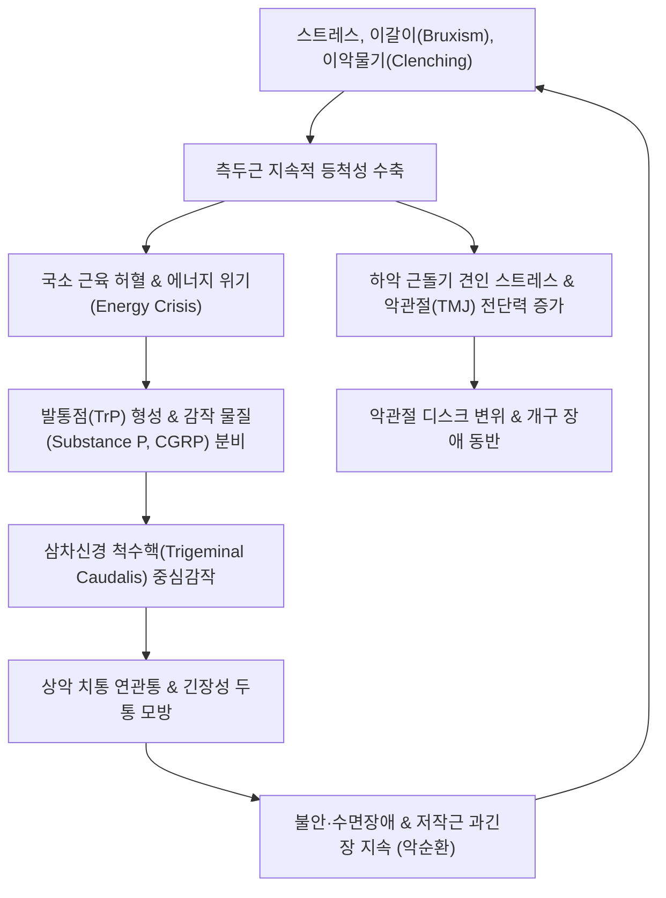

# 🩺 측두근막통증증후군

> **핵심 3줄 요약 (Key Summary)**:
> - 📍 **병소 부위 & 해부·병태생리**: [[측두근]](Temporalis muscle) 전·중·후부 섬유 및 건막 부착부(하악골 근돌기)에 발생한 발통점([[Trigger Point]])으로 인해 관자놀이, 눈썹 위, 상악 치아(어금니 및 앞니)로 방사되는 근막성 통증.
> - 🚩 **전형적 임상 양상**: 편측 또는 양측 관자놀이의 조이는 듯한 두통([[긴장성 두통]] 모방), 개구 장애, 씹을 때 관자놀이 뻐근함, 치과적 이상이 없는 상악 치통(치통 연관통).
> - 🛠️ **핵심 검사 & 치료 전략**: 측두와(temporal fossa) 및 하악 근돌기(coronoid process) 압통점 확인; [[태양혈]](EX-HN5), [[두유혈]](ST8), [[솔곡혈]](GB8), [[하관혈]](ST7) 자침 및 중성어혈약침; [[교근]]·경추부 통합 이완.
> - ⚠️ **응급 의뢰 레드플래그**: 50세 이상에서 새로 발생한 박동성 측두부 두통 및 시력 저하, 압통(측두동맥염/거대세포동맥염 의심); 개구 불능과 함께 발열 및 안면 종창 동반(심부 농양).

---

## 📌 목차
1. [질환 개요 & 해부학적 병태생리](#1-질환-개요--해부학적-병태생리)
2. [병태생리 메커니즘 & 생체역학적 악순환 네트워크](#2-병태생리-메커니즘--생체역학적-악순환-네트워크)
3. [임상 증상 & 이학적 검사(Physical Exam) 알고리즘](#3-임상-증상--이학적-검사physical-exam-알고리즘)
4. [감별 진단 매트릭스 (Differential Diagnosis)](#4-감별-진단-매트릭스-differential-diagnosis)
5. [한의 통합 치료 프로토콜 (침·약침·추나·한약)](#5-한의-통합-치료-프로토콜-침약침추나한약)
6. [양방 치료 & 병용·의뢰 기준 (Conventional Treatment & Referral)](#6-양방-치료--병용의뢰-기준-conventional-treatment--referral)
7. [재활 운동 & 생활습관 티칭 가이드](#7-재활-운동--생활습관-티칭-가이드)
8. [💡 사용자 진료실 핵심 필기 & 임상 노하우 (Melt-In 잔여 심화 집약)](#8--사용자-진료실-핵심-필기--임상-노하우-melt-in-잔여-심화-집약)
9. [출처 및 학술 참고 문헌 (References)](#9-출처-및-학술-참고-문헌-references)

---

## 1. 질환 개요 & 해부학적 병태생리

### 1) 해부학적 구조 및 지배 신경
* **기시와 정지**:
  * **기시(Origin)**: 두개골 측면의 측두와(temporal fossa) 전체 및 측두근막(temporal fascia) 심층. 부채꼴(fan-shaped) 형태로 넓게 펼쳐져 있음.
  * **정지(Insertion)**: 협골궁(zygomatic arch) 안쪽을 통과하여 하악골 근돌기(coronoid process of mandible)의 내측면 및 첨부, 하악지 전연(anterior border of mandibular ramus)에 강력한 건(tendon) 형태로 부착됨.
* **섬유 주행에 따른 기능 분화**:
  * **전부 섬유(Anterior fibers)**: 거의 수직으로 주행하며, 하악골을 강력하게 거상(elevation)시켜 치아를 맞물리게 함(폐구).
  * **중부 섬유(Middle fibers)**: 사선 방향으로 주행하며, 거상과 함께 후퇴를 보조.
  * **후부 섬유(Posterior fibers)**: 거의 수평에 가깝게 주행하여, 돌출된 하악골을 후방으로 당기는 하악 후퇴(retraction) 작용을 전담함.
* **신경 지배 및 혈액 공급**:
  * [[삼차신경]](CN V)의 제3지인 하악신경(Mandibular nerve, V3)의 전하지에서 분지하는 **심측두신경(Deep temporal nerves, anterior/posterior)**의 지배를 받음.
  * 혈류는 외경동맥(ECA)의 분지인 악동맥(maxillary artery)에서 나오는 심측두동맥(deep temporal arteries) 및 천측두동맥(superficial temporal artery)의 측두지로부터 공급받음.

### 2) 발통점(TrP) 분류와 연관통(Referred Pain) 분포
Travell & Simons 분류에 따른 측두근의 4개 대표 발통점:
1. **TrP 1 (전부 섬유)**:
   * 가장 흔하며 눈썹 상방(상안와연), 전두부 및 상악 절치(앞니) 부위로 연관통 투사.
   * "앞니가 쑤시고 이마 앞쪽이 띵하다"고 호소.
2. **TrP 2 (전-중부 섬유 중간부)**:
   * 측두와 중간부에서 발생하여 상악 견치 및 제1·2소구치로 연관통 투사. 관자놀이 중심부 통증 동반.
3. **TrP 3 (중-후부 섬유)**:
   * 상악 대구치(어금니) 및 치은 부위로 연관통 투사.
   * 치과에서 충치나 치주염이 없다는 진단을 받은 후에도 지속되는 "원인 불명의 어금니 통증"의 대표적 원인.
4. **TrP 4 (후부 섬유)**:
   * 협골궁 후방 및 귀 상방·후방 측두골 부위로 연관통 투사. 두통 및 목덜미 긴장 동반.

---

![[측두근막통증증후군_01_해부_측두근하악골.png|450]]
> [그림 1: ① 해부 구조 — 측두근(temporal muscle)과 하악골] Gray 해부학 도판으로 측두와에 부착된 측두근의 주행과 하악골 오훼돌기 부착부를 보여 준다. 측두근막통증증후군은 이 근육의 근막 통증유발점에서 관자놀이·이마로 연관통을 일으킨다. 출처: File:Gray309.png (Public domain) · Wikipedia 문서 이미지

## 2. 병태생리 메커니즘 & 생체역학적 악순환 네트워크

### 1) 미세 외상 및 이상 부하 (Microtrauma & Parafunctional Habits)
* **주간 긴장성 이악물기(Daytime clenching)**: 모니터 작업, 운전, 스트레스 집중 시 무의식적으로 위아래 치아를 맞물리는 습관(Freeway space 상실). 정상적인 휴식 시 위아래 치아는 2~3mm 떨어져 있어야 함.
* **야간 이갈이(Sleep bruxism)**: 수면 중 강력한 저작근 수축으로 측두근과 [[교근]](Masseter)에 체중의 수 배에 달하는 비정상적인 전단력이 가해짐.
* **경추 부정렬과의 연계**: [[일자목]] 및 거북목 자세(Forward head posture)는 하악골을 후하방으로 당겨 저작근의 만성적 신장성 긴장을 유도함.

### 2) 삼차신경 감각핵 중심감작 (Central Sensitization)
* 측두근에서 발생하는 지속적인 유해 자극은 삼차신경 척수핵(Trigeminal nucleus caudalis)으로 입력됨.
* 이 감각핵은 상악신경(V2)의 치아 감각 신경원과 수렴(Convergence)하므로, 대뇌 피질은 측두근의 근막 통증을 상악 치아의 급성 치수염이나 치주염 통증으로 오인하게 됨.
* 만성화 시 [[편두통]]이나 [[긴장성 두통]]의 발작 역치를 현저히 낮춤.

---

## 3. 임상 증상 & 이학적 검사(Physical Exam) 알고리즘

### 1) 주요 임상 증상
* **측두부 통증 및 조이는 두통**: 모자나 헬멧을 꽉 낀 듯한 둔통, 오후나 저녁 피로 시 악화.
* **비치성 치통(Non-odontogenic toothache)**: 상악 치아(어금니, 소구치)가 시리거나 욱신거리지만 찬물·더운물 자극에 특이 반응이 없고 치과적 병변이 없음.
* **저작 시 피로감 및 통증**: 질긴 음식(오징어, 껌, 견과류)을 씹을 때 관자놀이에 쥐가 나는 듯한 피로감.
* **개구 제한(Trismus)**: 정상 개구량(손가락 3개 세로 폭, 약 40~50mm)에 미치지 못하고 35mm 이하로 제한되거나 개구 시 편위(Deviation) 발생.

### 2) 진료실 이학적 검사 알고리즘
1. **자세 및 저작근 촉진 검사**:
   * 환자를 편안히 앉히고 치아를 꽉 깨물게 하여(clench) 측두와 전체에서 근복의 팽대와 단단한 띠(Taut band)를 관찰.
   * **측두근 전부·중부·후부 촉진**: 손가락 2~3개로 측두와 뼈를 향해 편평 압박(Flat palpation)하여 국소 연축 반응(Local twitch response) 및 방사통 재현 여부 확인.
2. **하악골 근돌기 구강내/구강외 촉진 (Coronoid Process Palpation)**:
   * 입을 반쯤 벌린 상태에서 협골궁 하방, 하악지 전연을 따라 상방으로 손가락을 밀어 넣어 근돌기 부착부 건막의 압통을 확인(측두근막염/건염의 핵심 진단점).
3. **개구 가동역(ROM) 측정**:
   * 상하악 전치 간 거리를 측정(정상 40mm 이상). 능동 개구 시 통증 유발 여부 및 편위 방향 기록.
4. **치과 질환 감별 타진 검사**:
   * 의심되는 치아를 타진기나 핀셋으로 가볍게 두드렸을 때(Percussion test) 치아 자체의 날카로운 동통이 없음을 확인.

---

![[측두근막통증증후군_02_치료_교합안정장치.jpg|450]]
> [그림 2: ② 치료 — 교합 안정장치(occlusal splint)] 치과에서 제작한 투명 교합 안정장치(나이트가드) 실사. 이갈이·이악물기에 의한 측두근 과긴장을 줄여 근막통증을 완화하는 보존적 치료다. 출처: File:Aufbissschiene.jpg (CC BY-SA 4.0) · Wikipedia 문서 이미지

![[측두근막통증증후군_03_치료_장기사용장치.jpg|450]]
> [그림 3: ② 치료 — 8년 사용한 교합장치] 장기간 착용해 마모된 교합장치의 실사. 만성 측두근막통증에서는 야간 착용을 장기간 유지하며 근긴장 재발을 관리한다. 출처: File:Knirschschiene-acht-Jahre.jpg (CC BY-SA 4.0) · Wikipedia 문서 이미지

## 4. 감별 진단 매트릭스 (Differential Diagnosis)

| 질환명 | 호발 부위 및 통증 양상 | 핵심 구별 포인트 | 필수 감별 검사 / 치료 차이점 |
| :--- | :--- | :--- | :--- |
| **측두근막통증증후군** | 측두와, 관자놀이, 상악 치아의 뻐근하고 조이는 둔통 | 측두근 압통점 촉진 시 두통 및 치통이 그대로 재현됨 | 치과 X-ray 정상, 근막 발통점 치료 시 즉각 완화 |
| **[[측두동맥염]](거대세포동맥염)** | 50세 이상, 편측 측두부의 박동성 또는 찌르는 듯한 극심한 통증 | 천측두동맥의 비후, 굴곡, 결절 및 압통; 시력 감퇴, 턱 파행(Jaw claudication) | **응급 질환**; ESR, CRP 현저한 상승, 측두동맥 생검, 고용량 스테로이드 필요 |
| **치수염 / 치주염** | 특정 상악 치아에 국한된 박동성, 날카로운 통증 | 냉온 자극에 대한 지각 과민, 치아 타진 시 심한 동통, 잇몸 종창 | 치관 방사선 촬영(치근단 X-ray)에서 치조골 흡수나 치수 병변 확인 |
| **[[긴장성 두통]]** | 양측 전두·측두·후두부를 띠로 두른 듯한 압박감 | 두경부 전반의 근 긴장 동반, 저작과의 연관성은 상대적으로 적음 | 저작근 외 판상근, 승모근 등 후경부 근육 촉진 필요 |
| **[[편두통]]** | 편측 맥박 뛰는 듯한 박동성 두통 | 오심, 구토, 빛/소리 공포증(Photophobia), 조짐(Aura) 동반 | 트리프탄(Triptan) 반응, 일상 활동에 의해 두통 현저히 악화 |
| **[[악관절 증후군]](TMJ Internal Derangement)** | 이개 전방(악관절강) 국소 통증, 관절 잡음(Clicking) | 입을 열고 닫을 때 관절음, 개구 편위, 관절낭 외측 압통 | 악관절 파노라마 또는 MRI 검사 |

---

## 5. 한의 통합 치료 프로토콜 (침·약침·추나·한약)

### 1) 침구 치료 (Acupuncture)
* **주요 혈위**:
  * [[태양혈]](EX-HN5): 측두근 전·중부 섬유의 중심점. 외안각과 눈썹 외단 중간에서 외방 1촌 함요처.
  * [[두유혈]](ST8): 이마 양측 모서리, 발제 안쪽 0.5촌. 측두근 전부 섬유 및 전두근 경계부.
  * [[솔곡혈]](GB8): 이첨(귀끝) 직상, 발제 상방 1.5촌. 측두근 중·후부 섬유의 핵심 발통점.
  * [[하관혈]](ST7): 협골궁 하연, 하악 절흔 부위. 측두근 하부 건막 및 외측익돌근 연결부.
  * 원위 취혈: [[합곡혈]](LI4), [[내관혈]](PC6), [[태충혈]](LR3) — 안면 통증 진통 및 기체(氣滯) 해소.
* **자침 기법**:
  * 측두와 부위는 두개골 골막을 향해 사자(Oblique insertion) 또는 평자(Horizontal insertion)하여 골막을 긁지 않도록 주의하며 득기(得氣) 유도.
  * 저주파 전침(2Hz, 15~20분) 적용으로 측두근 긴장 완화 및 엔도르핀 분비 촉진.

### 2) 약침 치료 (Pharmacopuncture)
* **약침 제제 선택**:
  * **중성어혈약침**: 국소 허혈 및 어혈성 두통, 찌르는 듯한 통증 양상에 1차 선택.
  * **황련해독탕 약침**: 스트레스, 상열감, 안면부 열감, 불면이 동반된 간화(肝火)·심화(心火)형 환자에 적용.
  * **BV(봉약침)**: 만성화된 근돌기 건염 및 완고한 섬유화 병변에 1:10,000~1:30,000 희석액으로 미량 주입.
* **시술 부위 및 용량**:
  * 측두와 내 가장 뚜렷한 발통점 2~3곳과 하악 근돌기 부착부에 포인트당 0.1~0.2cc씩 총 0.5~1.0cc 주입.

### 3) 추나 및 근막 이완 수기요법 (Chuna & Myofascial Release)
* **측두근 두개천골 추나기법 (Temporal Bone Decompression)**:
  * 측두골의 내외회전 제한을 평가하고, 유양돌기 부위를 부드럽게 접촉하여 측두골 이완 유도.
* **구강내 측두근 건막 직접 이완술**:
  * 술자가 위생 장갑을 착용하고 검지를 환자의 협점막 안쪽 상악 대구치 후외측으로 진입시켜 하악골 근돌기 첨부에 닿은 후 전하방으로 부드럽게 신장(Stretching) 압박.

### 4) 변증별 맞춤 한약 처방 (Herbal Medicine)
* **간담풍열 / 간화상염 (肝膽風熱 / 肝火上炎)**:
  * 증상: 스트레스 시 악화, 두통과 함께 눈 충혈, 구갈, 안면 홍조, 설홍태황, 맥현삭.
  * 처방: **[[청상견통탕]](淸上膕痛湯)** 가감 (황금, 치자, 백지, 천궁, 강활, 방풍) 또는 **용담사간탕(龍膽瀉肝湯)**.
* **기체어혈 (氣滯瘀血)**:
  * 증상: 만성적이고 고정된 측두통, 야간 악화, 찌르는 듯한 양상, 설암, 어반.
  * 처방: **[[통규활혈탕]](通竅活血湯)** 또는 **[[소풍활혈탕]](疏風活血湯)**.
* **간신음허 / 허화상충 (肝腎陰虛 / 虛火上衝)**:
  * 증상: 만성 피로, 이명, 오후 미열, 마른 체형의 이악물기 환자.
  * 처방: **기국지황탕(杞菊地黃湯)** 또는 **대보음환(大補陰丸)** 가미.

---

## 6. 양방 치료 & 병용·의뢰 기준 (Conventional Treatment & Referral)

### 1) 약물 치료 (Medication)
* **NSAIDs & 아세트아미노펜**: 통증 조절의 1차 약제 (예: Aceclofenac 100mg bid, Celecoxib 200mg qd).
* **근이완제**: 저작근 강직 완화를 위해 단기 병용 (예: Eperisone HCl 50mg tid).
* **삼환계 항우울제(TCA)**: 만성 통증 및 야간 이갈이 동반 시 취침 전 저용량 Amitriptyline(10~25mg) 처방.

### 2) 비약물적 시술 및 치과적 처치
* **스플린트(Oral Splint / Occlusal Appliance)**:
  * 치과에서 제작하는 안정 스프린트(Stabilization splint)로 상하악 치아를 분리시켜 측두근에 가해지는 과도한 수축력을 차단.
* **보툴리눔 독소 주사(Botox Injection)**:
  * 난치성 이악물기 및 측두근 비대증 환자에서 측두근 전·중부 다발에 보톡스 20~40 Unit 분할 주사.
* **발통점 주사(TPI)**:
  * 0.5% 리도카인을 이용한 근막 발통점 주사 요법.

### 3) 한의 병용 및 주의점
* 진통소염제나 근이완제 복용 중에도 한의 침·약침 치료는 병용 가능하며, 치료 반응이 나타나면 양약을 점진적으로 테이퍼링하도록 지도.
* 보톡스 시술 직후(1~2주 이내)에는 해당 부위에 강한 압박 추나나 전침 자극을 가하면 약물 확산의 위험이 있으므로 완만한 자침 위주로 접근.

### 4) 양방·전문과 의뢰 기준 (Referral Criteria)
* **즉각 응급 의뢰 (Red Flags)**:
  * 50세 이상에서 갑자기 발생한 편측 측두통, 씹을 때 턱 통증이 급격히 심해짐, 시야 흐림 동반 ➔ **측두동맥염 의심으로 류마티스내과/안과/응급실 즉시 의뢰**.
  * 개구 불능(10mm 이하)과 함께 고열, 뺨이나 목 부위 봉와직염/농양 소견 ➔ 구강악안면외과 응급 의뢰.
* **일반 전과의뢰**:
  * 심한 부정교합, 악관절 디스크의 비정복성 정위(Closed lock) 동반 ➔ 구강내과 / 치과 교정과.

---

## 7. 재활 운동 & 생활습관 티칭 가이드

### 1) 저작근 이완 스트레칭 (자가 마사지)
* **관자놀이 횡단 마사지**:
  * 양 손바닥의 수근부(손꿈치)를 측두와에 밀착시키고 원을 그리듯 부드럽게 압박하며 위쪽으로 끌어올림 (1회 30초, 하루 5회).
* **개구 신장 운동**:
  * 혀를 입천장 앞니 뒤쪽(절치유두)에 붙인 상태에서 천천히 통증이 없는 범위까지 입을 벌렸다가 닫는 동작(N-position 개구 운동)을 10회 반복.

### 2) 일상생활 습관 교정 티칭
* **"턱 힘 빼기" 훈련 (Lips together, Teeth apart)**:
  * 입술은 가볍게 다물되, 위아래 어금니는 닿지 않게 항상 2~3mm 띄워두는 감각을 인지시킴.
  * 컴퓨터 모니터나 스마트폰에 '턱에 힘 빼기' 포스트잇 부착 지도.
* **식이 관리**:
  * 증상 호전 시까지 질긴 음식(마른 오징어, 육포, 베이글), 딱딱한 음식(견과류, 얼음 깨물기), 껌 씹기 전면 금지.
* **수면 자세**:
  * 엎드려 자거나 턱을 괴는 자세는 하악골에 편측 외력을 가하므로 낮은 베개를 베고 똑바로 눕는 자세 권장.

---

## 8. 💡 사용자 진료실 핵심 필기 & 임상 노하우 (Melt-In 잔여 심화 집약)

### 1) 치과를 순회하고 온 환자의 전형적 프로필
* "치과 3곳을 갔는데 엑스레이 상 충치도 없고 잇몸도 깨끗하다고 합니다. 그런데 저는 오른쪽 윗어금니가 쑤셔서 밥을 못 먹겠습니다."
* 이 경우 의자에 앉히자마자 입안을 보지 말고, **환자의 관자놀이(측두근 TrP 3 영역)를 엄지손가락으로 3~5초간 지그시 압박**해볼 것.
* 환자가 "선생님, 바로 그 자리를 누르니까 아까 아프던 그 어금니 쪽으로 전기가 오듯 통증이 똑같이 내려갑니다!"라고 반응하면 100% 측두근막통증증후군임.

### 2) 자침 시 임상 팁: 하악 근돌기 접근법
* 관자놀이 천부 근육 자침만으로 해결되지 않는 만성 환자는 하악골 근돌기 정지부의 건막염을 반드시 타깃해야 함.
* 환자에게 입을 살짝 벌리게 한 상태에서 협골궁 바로 아래, 하악 절흔 부위에서 약간 상방을 향해 40mm 호침으로 1.5촌 정도 심자(Deep needling)하여 근돌기 건막에 닿게 하면 강력한 득기감(무거운 느낌)과 함께 안면 전체의 긴장이 풀림.

---

## 9. 출처 및 학술 참고 문헌 (References)

* Temporomandibular Disorders and Orofacial Outcomes in Subjects with Neck Pain and/or Cervicogenic Headache: A Systematic Review with Meta-Analysis. [PMID: 41517515]

* Simons DG, Travell JG, Simons LS. Travell & Simons' Myofascial Pain and Dysfunction: The Trigger Point Manual. Volume 1. Upper Half of Body. 2nd ed. Baltimore: Williams & Wilkins; 1999.

* Okeson JP. Management of Temporomandibular Disorders and Occlusion. 8th ed. St. Louis: Elsevier; 2020.

* De Leeuw R, Klasser GD. Orofacial Pain: Guidelines for Assessment, Diagnosis, and Management. 6th ed. Chicago: Quintessence Publishing; 2018.
