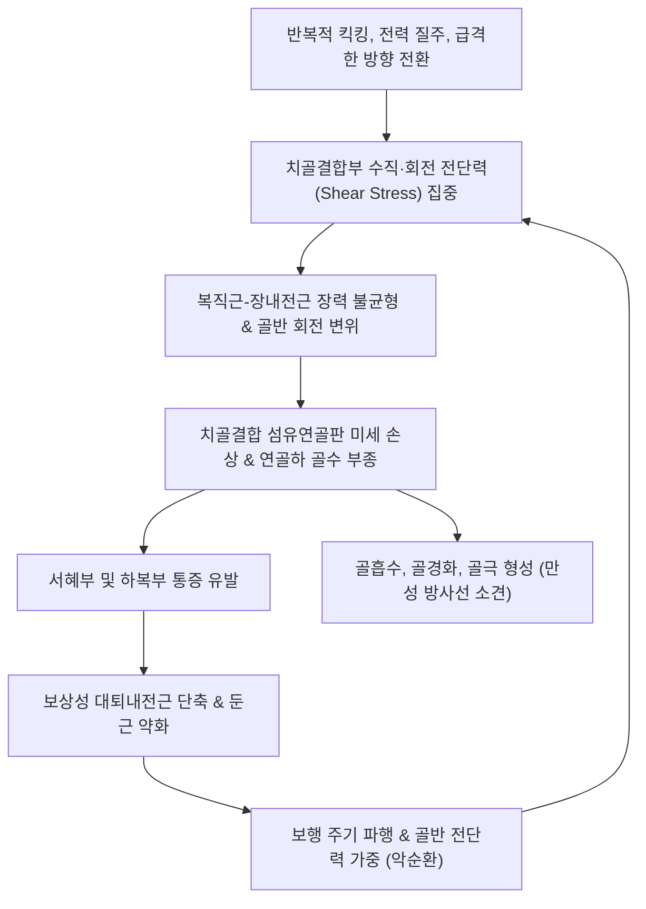

# 🩺 치골염

> **핵심 3줄 요약 (Key Summary)**:
> - 📍 **병소 부위 & 해부·병태생리**: [[치골결합]](Pubic symphysis) 섬유연골판 및 부착 건막 복합체([[복직근]]과 [[장내전근]])에 가해지는 만성적 전단력(Shear stress)으로 인한 비감염성 염증 및 연골하 골수 부종.
> - 🚩 **전형적 임상 양상**: 서혜부(사타구니) 중심부의 뻐근한 통증, 달리기·킥킹(Kicking)·방향 전환 시 악화, 계단 오르내리기 및 침대에서 돌아누울 때 골반 전면 통증.
> - 🛠️ **핵심 검사 & 치료 전략**: 치골결합 직접 압통 및 스퀴즈 검사([[Squeeze Test]]) 양성; [[곡골혈]](CV2), [[기충혈]](ST30), [[음렴혈]](LR11) 자침 및 소염약침; 골반 대칭 추나 및 내전근-복직근 밸런스 회복.
> - ⚠️ **응급 의뢰 레드플래그**: 발열, 오한, 국소 발적 및 열감을 동반한 극심한 보행 불능(감염성 치골결합염/골수염 의심); 비뇨생식기 계통의 급성 혈뇨 및 배뇨통 동반.

---

## 📌 목차
1. [질환 개요 & 해부학적 병태생리](#1-질환-개요--해부학적-병태생리)
2. [병태생리 메커니즘 & 생체역학적 악순환 네트워크](#2-병태생리-메커니즘--생체역학적-악순환-네트워크)
3. [임상 증상 & 이학적 검사(Physical Exam) 알고리즘](#3-임상-증상--이학적-검사physical-exam-알고리즘)
4. [감별 진단 매트릭스 (Differential Diagnosis)](#4-감별-진단-매트릭스-differential-diagnosis)
5. [한의 통합 치료 프로토콜 (침·약침·추나·한약)](#5-한의-통합-치료-프로토콜-침약침추나한약)
6. [양방 치료 & 병용·의뢰 기준 (Conventional Treatment & Referral)](#6-양방-치료--병용의뢰-기준-conventional-treatment--referral)
7. [재활 운동 & 생활습관 티칭 가이드](#7-재활-운동--생활습관-티칭-가이드)
8. [💡 사용자 진료실 핵심 필기 & 임상 노하우 (Melt-In 잔여 심화 집약)](#8--사용자-진료실-핵심-필기--임상-노하우-melt-in-잔여-심화-집약)
9. [출처 및 학술 참고 문헌 (References)](#9-출처-및-학술-참고-문헌-references)

---

## 1. 질환 개요 & 해부학적 병태생리

### 1) 해부학적 구조와 건막 복합체 (Aponeurosis Complex)
* **치골결합(Pubic Symphysis)**:
  * 좌우 치골체(Pubic bodies)가 만나는 무혈관성 섬유연골 관절(Amphiarthrosis). 중앙에 섬유연골간판(Interpubic disc)이 존재하며, 상치골인대(Superior pubic ligament)와 궁상치골인대(Arcuate/inferior pubic ligament)에 의해 단단히 결합됨.
* **근막-건막 교차 복합체 (Rectus Abdominis - Adductor Longus Aponeurosis)**:
  * 상방에서 주행해 내려오는 **[[복직근]](Rectus abdominis)**의 하부 건막과 하방에서 올라오는 **[[장내전근]](Adductor longus)**의 기시건이 치골결합 전면 골막에서 서로 융합되며 일종의 '해부학적 시소(Seesaw)' 구조를 형성함.
  * 복직근은 치골을 상후방으로 당기고, 내전근군은 치골을 하외측으로 당김으로써 치골결합부에 상반된 벡터의 강한 장력을 발생시킴.
* **관련 신경 및 혈관**:
  * 음부대퇴신경(Genitofemoral nerve), 장골서혜신경(Ilioinguinal nerve), 폐쇄신경(Obturator nerve)의 감각 분지가 치골 주변 감각을 담당하므로 염증 시 서혜부, 회음부 및 대퇴 내측으로 광범위한 방사통이 유발됨.

### 2) 질환의 정의 및 역학
* 치골염(Osteitis Pubis)은 치골결합 및 인접 골조직, 부착 건막에 발생하는 **비감염성 만성 염증성 질환**임.
* 축구, 럭비, 아이스하키, 마라톤 등 빠른 방향 전환, 반복적 킥킹, 편측성 과부하가 요구되는 운동선수에게 호발하며, 최근에는 출산 후 골반 관절의 불안정성을 겪는 여성 환자에서도 높은 빈도로 발생함.

---

![[치골염_01_해부_치골결합.png|450]]
> [그림 1: ① 해부 구조 — 골반과 치골결합(pubic symphysis)] 골반을 전면에서 그린 Blausen 해부 도해로 치골결합·장골·천골과 주요 근육 부착부를 표시했다. 치골염은 이 치골결합과 주변 근육 부착부의 염증·과부하로 발생하며, 내전근과 복직근 부착부에 압통이 나타난다. 출처: File:Blausen 0723 Pelvis.png (CC BY 3.0) · Wikipedia 문서 이미지

![[치골염_02_해부_골반골격.png|450]]
> [그림 2: ① 해부 구조 — 골반 골격과 치골] 골반 골격을 앞에서 그린 Gray 해부 도판. 치골과 치골결합의 형태를 확인해 방사선 판독의 기준으로 삼는다. 출처: File:Gray321.png (Public domain) · Wikipedia 문서 이미지

## 2. 병태생리 메커니즘 & 생체역학적 악순환 네트워크

### 1) 생체역학적 전단력의 발생 기전
* 보행 및 달리기 시 단하지 지지기(Single-leg stance)에서 체중 부하와 반대측 하지의 흔들림으로 인해 치골결합에는 상하 수직 전단력이 가해짐.
* 천장관절(SI joint)의 가동성 저하나 기능 부전이 동반될 경우 골반환(Pelvic ring)의 충격 흡수 능력이 저하되어 전단력이 전방 치골결합부에 집중됨.
* 축구의 인프런트 킥 동작처럼 고관절을 외전·신전했다가 급격히 내전·굴곡시킬 때 장내전근의 폭발적인 견인력이 치골골두 부착부에 가해져 미세 박리 손상(Micro-avulsion)이 발생함.

### 2) 연골하 골수 부종 및 조직학적 변화
* 급성기에는 치골결합 양측 치골체에 광범위한 연골하 골수 부종(Bone marrow edema)이 발생(MRI T2/STIR 고신호).
* 지속적인 기계적 스트레스는 연골하 골 소주(Trabeculae)의 미세 골절, 골 흡수(Cystic changes)를 초래하고, 치유 과정에서 불규칙한 골경화(Sclerosis) 및 비후성 골극을 형성함.

---

## 3. 임상 증상 & 이학적 검사(Physical Exam) 알고리즘

### 1) 주요 임상 증상
* **서혜부 및 치골부 통증**: 치골 중심부 및 사타구니 안쪽이 뻐근하게 아프며, 하복부나 회음부, 대퇴 내측으로 방사됨.
* **동작 시 통증 악화**: 달리기, 공 차기, 한 발로 서기, 계단 오르기, 침대에서 돌아누울 때(Rolling over) 찌르는 듯한 통증.
* **보행 양상 변화**: 통증으로 인해 보폭이 좁아지고 뒤뚱거리는 보행(Waddling gait)이나 파행(Limping) 관찰.
* **기침 및 재채기 시 동통**: 복압 상승 시 복직근이 긴장되며 치골 결합부를 견인하여 통증 유발.

### 2) 진료실 핵심 이학적 검사 알고리즘
1. **치골결합 직접 촉진 (Pubic Symphysis Palpation)**:
   * 환자를 앙와위로 눕히고 치골결합부 중앙 및 양측 치골 결절(Pubic tubercle)을 직접 수직 압박. 국소 압통(Point tenderness)이 확인되면 강력한 진단적 지표.
2. **스퀴즈 검사 ([[Squeeze Test]])**:
   * 환자가 누운 상태에서 무릎을 0도(완전 신전), 45도, 90도 굴곡시킨 상태에서 검사자의 주먹이나 소프트 볼을 무릎 사이에 끼움.
   * 환자에게 양 무릎을 강하게 모으도록(등척성 내전 수축) 지시했을 때 치골부 통증이 재현되면 양성.
3. **토마스 검사 ([[Thomas Test]]) 및 패트릭 검사 ([[FABER Test]])**:
   * 장요근 및 대퇴직근 구축 여부 평가(Thomas).
   * 고관절 자체 질환(관절염, FAI)을 감별하기 위해 실시. FABER 시 고관절 후방 통증이 아닌 치골부 전면 통증이 재현될 수 있음.
4. **한 발 서기 홉 검사 (Single Leg Hop Test)**:
   * 통증 측 하지로 가볍게 점프하여 착지할 때 골반 전단력 증가로 통증이 급격히 유발되는지 확인(회복기 복귀 판정용).

---

## 4. 감별 진단 매트릭스 (Differential Diagnosis)

| 질환명 | 호발 부위 및 임상 특징 | 핵심 구별 포인트 | 필수 감별 검사 / 치료 차이점 |
| :--- | :--- | :--- | :--- |
| **치골염 (Osteitis Pubis)** | 치골결합 중앙 및 양측 치골체, 서혜부 전면 | 치골결합 정중앙 직접 압통 극심, Squeeze test 양성 | 골반 X-ray(Flamingo view), 골반 MRI(골수 부종) |
| **[[스포츠 탈장]](Athletic Pubalgia)** | 서혜관 하복벽 외측, 서혜인대 직상방 | 서혜륜(Inguinal ring) 촉진 시 통증, 복근 저항 수축 시 동통 | 초음파 또는 MRI로 복벽 건막 파열/팽윤 확인 |
| **대퇴내전근 건병증 / 파열** | 대퇴 내측 근위부, 장내전근 건 주행부 | 치골체보다 내전근 건-근복 경계부 압통 우세 | 고관절 수동 외전 스트레칭 시 극심한 통증 |
| **[[대퇴비구충돌증후군]](FAI)** | 고관절 심부 외측 및 서혜부 C자형 통증 (C-sign) | FADIR 검사(굴곡·내전·내회전) 양성, 관절 내 걸림 | 고관절 X-ray(Cam/Pincer 변형), 3D CT/MRI |
| **감염성 치골결합염 (Septic Symphysitis)** | 치골부 극심한 발적, 종창, 체온 상승 | **발열, 안정 시 및 야간 극심 통증**, 전신 쇠약감 | **응급 질환**; ESR/CRP 급증, 혈액 배양, 항생제 치료 |
| **고관절 피로골절** | 대퇴경부(Femoral neck) 또는 전자간부 통증 | 뒤꿈치 타진(Heel strike) 통증, 체중 부하 불가 | MRI 또는 골스캔(Bone scan) 즉시 시행 |

---

## 5. 한의 통합 치료 프로토콜 (침·약침·추나·한약)

### 1) 침구 치료 (Acupuncture)
* **근위 취혈 (치골 주변부)**:
  * [[곡골혈]](CV2): 치골결합 상연 중앙 함요처. 복직근 부착부 긴장 완화.
  * [[기충혈]](ST30): 치골결절 외방 2촌. 서혜부 근막 긴장 완화.
  * [[음렴혈]](LR11) 및 [[오리혈]](LR10): 치골결절 하외측, 장내전근 기시부의 핵심 압통점.
* **원위 및 하지 취혈**:
  * [[혈해혈]](SP10), [[삼음교혈]](SP6), [[태충혈]](LR3): 간경·비경 경락 소통, 하초 혈류 개선.
  * [[환도혈]](GB30), [[질변혈]](BL54): 둔부 안정화 근육 및 외회전근 이완.
* **전침 요법 (Electroacupuncture)**:
  * 곡골-기충 및 음렴-오리 간 2~4Hz 연속파 또는 2/100Hz 혼합파를 15~20분간 적용하여 내전근 과긴장 억제 및 신경인성 염증 완화.

### 2) 약침 치료 (Pharmacopuncture)
* **약침 제제 선택**:
  * **신바로약침 / 소염약침**: 급성기 치골결합부 염증 반응 및 부종 억제에 1차 적용.
  * **중성어혈약침**: 만성적인 전단력으로 발생한 미세혈관 울혈 및 어혈(瘀血) 병변 해소.
  * **황련해독탕 약침**: 염증 반응이 심하고 국소 작열감이 동반된 경우 적용.
* **주입 방법**:
  * 치골결합 상연 및 전면 인대 부착부, 장내전근 부착 골막을 향해 30G 니들로 포인트당 0.1~0.2cc씩 세밀하게 분할 주입 (총 1.0~1.5cc).

### 3) 추나 및 골반 교정 수기요법 (Chuna Manual Therapy)
* **골반환(Pelvic Ring) 대칭 교정 기법**:
  * 천장관절 기능 장애(천골의 전굴/후굴, 장골의 전방/후방 회전 변위)를 진단하여 앙와위/측와위 천장관절 가동 및 교정 추나 적용.
  * 치골 전단 변위 교정: 환자를 앙와위로 눕히고 양 무릎을 굴곡시킨 상태에서 고관절 외전 저항 및 내전 저항을 이용한 근에너지기법(MET) 적용.
* **내전근 및 장요근 근막 이완(PIR / MFR)**:
  * 장내전근의 과긴장된 건막을 수근부로 압박하며 점진적 신장 유도.

### 4) 변증별 맞춤 한약 처방 (Herbal Medicine)
* **어혈조체 (瘀血阻滯) - 급·만성 외상 및 스포츠 과부하형**:
  * 증상: 찌르는 듯한 국소 서혜부 통증, 야간 악화, 보행 시 골반이 쪼개지는 느낌, 설자암, 어반.
  * 처방: **[[신통축어탕]](身痛逐瘀湯)** 가감 (도인, 홍화, 당귀, 천궁, 우슬, 천련자) 또는 **[[서경탕]](舒經湯)**.
* **간신휴손 / 근골위약 (肝腎虧損 / 筋骨痿弱) - 출산 후 골반 이완 및 만성 재발형**:
  * 증상: 골반이 헐거운 느낌, 만성 피로, 요슬산연(허리와 무릎 시림), 보행 지구력 저하.
  * 처방: **독활기생탕(獨活寄生湯)** 또는 **삼모환(三妙丸)** 합 **보중익기탕(補中益氣湯)** 가감.
* **풍한습비 (風寒濕痺) - 기후 변화 민감형**:
  * 증상: 궂은 날씨나 찬 곳에 노출 시 골반 통증 악화, 뻐근하고 무거운 둔통.
  * 처방: **[[오적산]](五積散)** 또는 **소경활혈탕(疏經活血湯)**.

---

## 6. 양방 치료 & 병용·의뢰 기준 (Conventional Treatment & Referral)

### 1) 약물 치료 (Medication)
* **경구 소염진통제(NSAIDs)**:
  * 염증 및 통증 완화를 위해 2~4주간 투여 (Celecoxib 200mg qd, Meloxicam 7.5~15mg qd).
* **단기 경구 스테로이드 요법**:
  * 극심한 급성 염증으로 보행이 불가능한 경우 Medrol dose pack 단기 처방 고려.

### 2) 비수술적 시술 (Procedures)
* **체외충격파 치료 (ESWT)**:
  * 치골 결합부 및 장내전근 부착부에 방사형/집중형 충격파 적용으로 신생 혈관 생성 및 조직 재생 촉진.
* **초음파 유도하 국소 주사**:
  * 치골결합 내 스테로이드 주사(Triamcinolone) 또는 고농도 포도당 프롤로 주사. 단, 잦은 스테로이드 주사는 섬유연골판 괴사 및 파열 위험이 있으므로 연 2~3회 이내로 엄격히 제한.

### 3) 수술적 치료 적응증 (Surgical Indication)
* **적응증**:
  * 최소 6개월 이상의 보존적 치료(한의 치료, 약물, 물리치료, 주사)에도 불구하고 일상생활 및 보행이 불가능한 난치성 치골염.
* **수술 술식**:
  * 치골결합 소파술(Curettage), 장내전근 건 절제술(Adductor tenotomy), 치골결합 유합술(Arthrodesis with plate fixation).

### 4) 양방·전문과 의뢰 기준 (Referral Criteria)
* **즉각 응급 의뢰 (Red Flags)**:
  * 38도 이상의 고열, 오한, 치골 부위의 급격한 열감과 피부 발적 동반 ➔ **화농성 치골결합염(Septic symphysitis) 또는 골수염 의심으로 정형외과/감염내과 즉시 의뢰**.
  * 급성 요폐(Urinary retention), 혈뇨, 외음부 감각 마비 동반 시 ➔ 비뇨의학과/신경외과 의뢰.
* **정밀 검사 의뢰**:
  * 4주간의 보존적 치료에도 호전이 없고 보행 불능 지속 시 골반 MRI(피로골절, FAI, 관절와순 파열 감별)를 위해 영상의학과 의뢰.

---

## 7. 재활 운동 & 생활습관 티칭 가이드

### 1) 단계별 재활 운동 프로토콜
* **1단계: 등척성 안정화 운동 (급성기)**:
  * **수건 쥐어짜기 (Towel Squeeze)**: 누운 상태에서 무릎을 90도 굽히고 무릎 사이에 수건이나 작은 쿠션을 넣은 뒤 통증이 없는 강도(최대치의 30~50%)로 5초간 가볍게 조였다가 이완 (10회, 하루 3세트).
  * **복횡근 브레이싱 (Abdominal Bracing)**: 호흡을 내쉬며 배꼽을 등 쪽으로 가볍게 당겨 복횡근을 활성화하여 골반환 전면 안정성 확보.
* **2단계: 둔근 강화 및 고관절 가동성 회복 (아급성기)**:
  * **글루트 브릿지 (Glute Bridge)**: 무릎 사이에 밴드를 걸거나 쿠션을 끼운 채 엉덩이를 들어 올려 대둔근과 코어 강화.
  * **클램쉘 (Clamshell)**: 옆으로 누워 중둔근을 강화하여 한 발 지지 시 골반의 수평 유지 능력 향상.
* **3단계: 편측 체중 부하 및 플라이오메트릭 복귀 (회복기)**:
  * 런지(Lunge), 스플릿 스쿼트, 점진적 조깅 및 사이드 스텝 훈련.

### 2) 일상생활 티칭
* **양반다리 및 다리 꼬기 금지**:
  * 고관절의 과도한 외회전이나 편측 골반 압박은 치골결합에 회전 전단력을 가하므로 바른 의자 앉기 지도.
* **운동 휴식 및 점진적 복귀**:
  * 축구, 달리기, 계단 운동은 통증이 0~1점으로 완전히 사라질 때까지 엄격히 중단.

---

## 8. 💡 사용자 진료실 핵심 필기 & 임상 노하우 (Melt-In 잔여 심화 집약)

### 1) 진료실 촉진 시 놓치기 쉬운 포인트
* 많은 임상가가 환자가 "사타구니가 아프다"고 하면 고관절이나 장요근만 만지다가 치골염을 놓침.
* 반드시 바지를 살짝 내리고 **정중앙 치골결합 상연(곡골혈 부위)을 검지 손가락 끝으로 명확하게 뼈를 향해 수직 압박**해볼 것. 환자가 펄쩍 뛸 정도로 자지러지는 압통이 나타나면 치골염으로 확진할 수 있음.

### 2) 치골결합 MET(근에너지기법)의 즉각적인 효과
* 치골결합이 상하로 미세 어긋남(Shear dysfunction)이 발생했을 때, 고관절 외전 저항 운동 후 즉시 내전 저항 운동을 강하게 3~5초간 수행(Isomteric contraction)시키면 '툭' 하는 느낌과 함께 결합부가 정렬되면서 보행 시 사타구니 통증이 드라마틱하게 50% 이상 감소하는 경우가 많음.

---

## 9. 출처 및 학술 참고 문헌 (References)

* Osteitis Pubis in Athletes in the Era of Pubic-Related Groin Pain: Contemporary Concepts in Diagnosis, Rehabilitation, and Surgical Decision-Making. [PMID: 42795959]

* Weir A, Brukner P, Delahunt E, et al. Doha agreement meeting on terminology and definitions in groin pain in athletes. Br J Sports Med. 2015;49(12):768-774.

* Hiti CJ, Stevens KJ, Jamati MK, Garza D, Matheson GO. Athletic osteitis pubis. Sports Med. 2011;41(5):361-376.

* Verrall GM, Slavotinek JP, Barnes PG, Fon GT. Clinical features and diagnostic utility of MRI in athletes with chronic groin pain. Sports Med. 2007;37(5):451-465.
