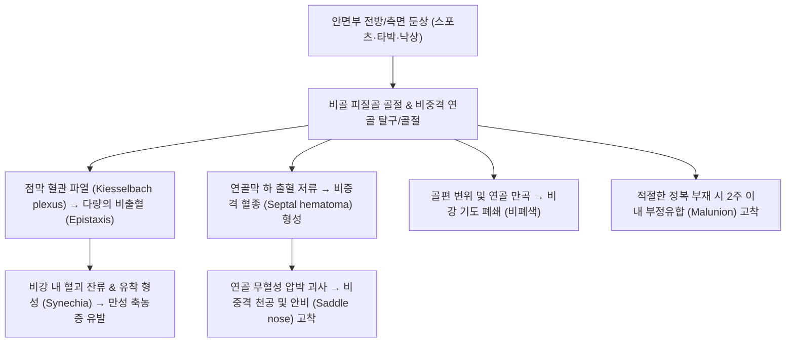

# 🩺 [[코 골절]] (Nasal Bone Fracture / 비골 골절, KCD S02.2)

> **핵심 3줄 요약 (Key Summary)**:
> - 📍 **병소 부위 & 해부·병태생리**: 안면부에서 가장 돌출되어 외상에 가장 취약한 코뼈(비골, Nasal bones) 및 연관된 비중격 연골(Septal cartilage)의 외상성 골절 및 변위.
> - 🚩 **전형적 임상 양상**: 수상 직후의 심한 [[비출혈]](Epistaxis), 비근부의 심한 부종과 피하 반상출혈, 외비의 비대칭적 변형(사비, 안비), 촉진 시 골마찰음(Crepitus) 및 유동성, 양측 또는 편측 비폐색(코막힘).
> - 🛠️ **핵심 검사 & 치료 전략**: 전방 비경 검사(비중격 혈종 유무 필수 확인!), 비골 측면 X-ray 및 안면골 3D-CT(Ren et al., 2026); 부종 완화 후 10~14일 이내 **비관혈적 도수정복술(Closed reduction)** 시행(Alvi et al., 2023); 정복 후 비강 패킹 및 외비 부목 고정; 한방 활혈지혈·소종진통([[당귀수산]], [[통규활혈탕]]) 및 정복 후 골유합 촉진 한약 투여.
> - ⚠️ **응급 의뢰 레드플래그**: **비중격 혈종(Septal hematoma)** — 방치 시 연골 허혈성 괴사로 인한 영구적 안비(Saddle nose) 변형 및 패혈증 초래(즉시 절개배농 필요); 맑은 액체가 흘러나오는 전두개저 사골 엽상판 골절 동반 **뇌척수액 비루(CSF rhinorrhea)** 확인 시 즉시 이비인후과·신경외과 응급 전원.

---

## 📌 목차
1. [질환 개요 & 해부학적 병태생리 (Disease Overview & Anatomy)](#1-질환-개요--해부학적-병태생리-disease-overview--anatomy)
2. [병태생리 메커니즘 & 임상적 악순환 (Pathophysiology & Vicious Cycle)](#2-병태생리-메커니즘--임상적-악순환-pathophysiology--vicious-cycle)
3. [임상 증상 & 이학적 검사 (Clinical Presentation & Physical Exam)](#3-임상-증상--이학적-검사-clinical-presentation--physical-exam)
4. [감별 진단 매트릭스 (Differential Diagnosis Matrix)](#4-감별-진단-매트릭스-differential-diagnosis-matrix)
5. [한의 통합 치료 프로토콜 (KMD Integrated Protocol)](#5-한의-통합-치료-프로토콜-kmd-integrated-protocol)
6. [양방 치료 & 병용·의뢰 기준 (Conventional Treatment & Referral)](#6-양방-치료--병용의뢰-기준-conventional-treatment--referral)
7. [단계별 재활 & 자가 운동 티칭 (Rehabilitation & Self-Care)](#7-단계별-재활--자가-운동-티칭-rehabilitation--self-care)
8. [💡 진료실 핵심 필기 & 임상 노하우](#8--진료실-핵심-필기--임상-노하우)
9. [출처 및 학술 참고 문헌 (References)](#9-출처-및-학술-참고-문헌-references)

---

## 1. 질환 개요 & 해부학적 병태생리 (Disease Overview & Anatomy)

![[코골절_01_환부실사_외비변형.jpg|400]]
> [그림 1: ① 환부 실사 — 안면부 둔상 후 발생한 전형적인 비골 골절 환자의 외비 사비(C자형 휨) 변형, 비근부 급성 종창 및 비출혈 — Wikipedia(CC BY-SA 3.0)]

![[코골절_01_해부도해_비강골격및비골.jpg|480]]
> [그림 2: ① 해부학적 구조 — 외비 및 비강을 지지하는 비골(Nasal bone), 비중격 서골(Vomer), 사골 수직판 및 비연골 해부도 — OpenStax Anatomy(CC BY 4.0)]

* **질환 정의 및 개요**:
  * [[코 골절]](Nasal Bone Fracture, 鼻骨骨折)은 안면부 뼈 중 가장 얇고 전방으로 돌출되어 있어 **안면 골절 중 압도적 1위(약 40~50%)**를 차지하는 다발 골절입니다.
  * 싸움, 스포츠 손상, 낙상, 교통사고 등으로 인해 발생하며, 단순 코뼈뿐만 아니라 하부의 **비중격(Nasal septum: 사골 수직판, 서골, 비중격 연골)** 손상이 흔히 동반됩니다(Kim et al., 2026).
* **해부학적 구조와 골절 유형**:
  * 비골은 상부의 두껍고 단단한 기저부(전두골 및 상악골 전두돌기 접합부)와 하부의 얇고 취약한 부위로 나뉩니다. 대부분의 골절은 얇은 하부 1/2에서 발생합니다.
  * **측면 충격(Lateral impact, 최다빈도)**: 한쪽 비골이 내측으로 함몰되고 반대측 비골이 외측으로 밀려나는 전형적인 C자형 또는 S자형 사비(Deviated nose) 변형 유발.
  * **전방 충격(Frontal impact)**: 비골 하부가 후하방으로 주저앉으며 비중격 연골이 파쇄되어 콧등이 낮아지는 안비(Saddle nose) 변형 유발.

---

## 2. 병태생리 메커니즘 & 임상적 악순환 (Pathophysiology & Vicious Cycle)

![[코골절_02_병태생리_비중격혈종_도해.png|450]]
> [그림 3: ② 병태생리 도해 — 외상 후 연골막하 출혈 저류로 인한 비중격 혈종(Septal hematoma) 형성 및 연골 무혈성 괴사 기전 — Blausen Medical(CC BY 3.0)]

![[코골절_02_병태생리_축상면_CT영상.jpg|420]]
> [그림 4: ② 영상의학적 병태 — 안면골 축상면 CT(Axial CT)에서 확인되는 양측 비골 골절선(Bilateral fracture) 및 비중격 골편 변위 — Wikimedia(CC BY-SA 3.0)]

### 1) 혈관망 손상과 비중격 혈종의 파괴적 기전
* 비강 점막은 혈관이 극도로 풍부합니다. 골절 시 점막 열상으로 비출혈이 발생하는데, 점막이 찢어지지 않고 연골막 아래로 피가 고이면 **비중격 혈종(Septal Hematoma)**이 형성됩니다.
* 비중격 연골은 자체 혈관이 없어 연골막으로부터 확산을 통해 영양을 공급받으므로, 혈종이 연골막을 박리시키면 수일 내에 연골이 무혈성 괴사(Avascular necrosis)를 일으켜 녹아내리며, 콧등이 푹 꺼지는 영구적 안비(Saddle nose) 기형을 남깁니다.

### 2) 골유합의 급속한 진행과 교정 골든타임
* 안면골은 혈류 공급이 왕성하여 골절 후 10~14일이 지나면 섬유성 가골이 형성되며 부정유합(Malunion) 단계로 급속히 진입합니다. 이 시기를 놓치면 단순 도수정복이 불가능해지고 뼈를 다시 절골해야 하는 복잡한 외비성형술(Rhinoplasty)이 필요해집니다(Alvi et al., 2023).

---

## 3. 임상 증상 & 이학적 검사 (Clinical Presentation & Physical Exam)

![[코골절_03_임상증상_비중격혈종_비경실사.jpg|450]]
> [그림 5: ③ 이학적 검사 — 전방 비경(Anterior rhinoscopy) 상 양측 비강을 폐색하고 있는 적자색의 팽륜된 비중격 혈종(Septal hematoma) 응급 소견 — Wikimedia(CC BY 4.0)]

![[코골절_03_영상의학_비골측면_Xray.jpg|450]]
> [그림 6: ③ 영상의학적 진단 — 비골 측면 단순 방사선 검사(Nasal bone lateral radiograph) 상 비골 하부 1/3 피질골의 선상 골절선(S02.2) 소견 — Wikimedia(CC BY-SA 3.0)]

### 1) 주요 임상 증상
* **비출혈 (Epistaxis)**: 수상 직후 거의 모든 환자에서 발생하며, 대개 솜 압박으로 지혈되나 비중격 심부 출혈 시 지속될 수 있음.
* **외비 변형 및 부종**: 콧등이 휘어지거나(사비), 주저앉거나, 만졌을 때 뼈 조각이 덜걱거리는 골마찰음(Crepitus) 촉진.
* **비폐색 (Nasal obstruction)**: 골편의 내측 전위, 비중격 만곡, 점막 부종으로 인한 호흡 곤란.
* **안와 주위 반상출혈**: 눈 주위에 멍이 들며 판다 눈처럼 부어오름.

### 2) 이학적 검사 알고리즘
* **전방 비경 검사 (Anterior Rhinoscopy — 필수!)**:
  * 비경을 삽입하여 비강 내 점막 열상, 출혈점, 비중격 만곡 및 특히 **비중격 혈종(Septal Hematoma — 비중격이 자줏빛으로 풍선처럼 부풀어 올라 비강을 막고 있는 소견)** 여부를 반드시 확인. 면봉으로 살짝 눌렀을 때 말랑말랑한 파동성(Fluctuance)이 있으면 즉시 천자/절개 필요.
* **방사선 검사**:
  * 비골 측면 X-ray(Nasal bone lateral view): 골절선 및 골편 전위 확인.
  * **안면골 3D-CT (Facial Bone 3D-CT)**: 연골 골절, 안와 벽 골절, 사골동 및 비중격 침범을 정밀 진단하는 골드 스탠다드(Ren et al., 2026).

---

## 4. 감별 진단 매트릭스 (Differential Diagnosis Matrix)

| 감별 질환 | 손상 부위 및 특징 | 감별 핵심 포인트 | 진단 및 처치 |
| :--- | :--- | :--- | :--- |
| **[[코 골절]]** | 비골 및 비중격 연골 | 외비 변형, 비골 마찰음, 비출혈, 비골 CT 골절선 | 비골 3D-CT, 도수정복술 |
| **단순 비부 타박상** | 외비 연부조직 단독 손상 | 붓기와 멍은 있으나 골편 전위 및 골마찰음 없음 | X-ray/CT 정상, 냉찜질 및 소염제 |
| **비포드(Le Fort) II/III 안면골 골절** | 상악골, 관골, 비골을 포함한 중앙면부 복합 골절 | 교합 부전(Malocclusion), 안면 중심부 동요(Floating palate) | 안면골 복합 CT, 악안면성형외과 개방정복 |
| **비선천성 [[비중격 만곡증]]** | 기왕증 비중격 휨 | 골절선 없음, 과거부터 지속된 만성 코막힘 병력 | 기존 비강 사진 및 환자 병력 확인 |
| **전두동/사골동 골절 (두개저 동반)** | 비골 기저부 상방 두개저 침범 | 맑은 뇌척수액 비루, 후각 소실 | 뇌/안면골 CT, 신경외과 긴급 협진 |

---

## 5. 한의 통합 치료 프로토콜 (KMD Integrated Protocol)

![[코골절_05_정복술기_기구및도수정복.png|450]]
> [그림 7: ⑤ 정복 술기 — 비관혈적 도수정복술(Closed reduction) 시 Boies elevator 및 Walsham forceps를 이용한 비골 골편 거상 및 외측 수지 압박 정렬 — SciELO(CC BY 4.0)]

![[코골절_05_정복술기_정복기구3종.png|450]]
> [그림 8: ⑤ 정복 기구 — 비골 및 비중격 정복술에 필수적인 3대 정복 기구(Asch forceps, Walsham forceps, Boies elevator) 비교 도해 — ENT Journal/Ovid]

* **치료 단계별 역할 분담**:
  * 골편의 전위가 있는 코 골절은 **이비인후과/성형외과의 도수정복술(Closed reduction)이 1차적 표준 치료**입니다. 한의 치료는 **정복 전 부종의 신속한 감압**, **정복 후 골유합 촉진 및 비강 내 혈종·유착 예방**, **외상성 비염·후각 둔마 후유증 회복**에 탁월한 시너지 효과를 냅니다.
* **침구 치료 (Acupuncture)**:
  * **주요 경혈**: [[영향]](LI20), [[상영향]](비통, EX-HN8), [[인당]](EX-HN3), [[합곡]](LI4), [[족삼리]](ST36), [[내관]](PC6).
  * **시술 방법**: 비강 점막 종창을 가라앉히기 위해 영향혈과 비통혈에 0.20×15mm 미세 호침으로 피하 사자하여 비강 혈류를 개선하고 통기(通氣)를 도모합니다. 합곡혈은 두면부 진통 및 지혈의 원위 취혈 요혈입니다.
* **약침 치료 (Pharmacopuncture)**:
  * 황련해독약침 또는 소염약침(0.3cc)을 영향혈 주변 피하에 주입하여 외비 급성 종창을 신속히 소퇴시켜 조기 정복술이 가능하도록 지원합니다.
* **한약 치료 (Herbal Medicine)**:
  * **골절 초기 (1~2주, 활혈소종·지혈·진통)**: [[당귀수산]](當歸鬚散), [[통규활혈탕]](通竅活血湯) 가감. (타박상으로 인한 안면 어혈과 부종을 신속히 제거하여 정복술 시야 확보).
  * **골절 중기 (3~4주, 접골속근·가골형성 촉진)**: [[자연동]](自然銅 — 초초하여 수비한 것), 골쇄보, 속단, 속골목을 가미한 [[산골가미방]] 또는 [[보골탕]].
  * **골절 후기 (외상성 비염 및 점막 유착 예방)**: [[신이청폐탕]](辛夷淸肺湯), [[갈근탕가천궁신이]](Lee et al., 2026).

---

## 6. 양방 치료 & 병용·의뢰 기준 (Conventional Treatment & Referral)

* **비관혈적 도수정복술 (Closed Reduction, 골든타임 5~14일)**:
  * 부종이 가장 심한 외상 직후 2~3일간은 골편 위치 파악이 어려우므로 냉찜질 후 부종이 빠지는 5~10일경(성인은 14일 이내, 소아는 7일 이내)에 국소 또는 전신마취 하에 골정복 기구(Boies elevator, Walsham forceps)를 비강 내로 넣어 전위된 골편을 들어 올리고 외측에서 손으로 압박 정복(Alvi et al., 2023).
* **정복 후 고정 및 패킹**:
  * 비강 내 Merocel 또는 바셀린 거즈 패킹(2~3일 유지)으로 지혈 및 내측 지지.
  * 외비에는 열가소성 플라스틱 부목(Aquaplast splint) 또는 석고 부목을 7~10일간 덧대어 외력으로부터 보호.
* **수술적 치료 (Open Reduction / Rhinoplasty)**:
  * 복합 분쇄 골절, 비관혈적 정복 실패, 3주 이상 방치되어 부정유합된 경우 3~6개월 후 절골술을 동반한 비성형술 시행.
* **응급 의뢰 기준 (즉시 전원)**:
  * **비중격 혈종 확인 시**: 연골 괴사를 막기 위해 24시간 이내 즉시 절개배농 및 항생제 투여 필요.
  * 대량의 비출혈이 전방 패킹으로 멈추지 않는 경우(후방 비출혈 의심).

---

## 7. 단계별 재활 & 자가 운동 티칭 (Rehabilitation & Self-Care)

* **1단계: 안경 착용 금지 및 외력 보호 (정복 후 4~6주)**:
  * 안경이나 선글라스는 비골에 직접 하중을 가하므로 정복 후 최소 4주간 착용 금지(콘택트렌즈 사용 권장).
  * 잠잘 때 엎드리거나 옆으로 자지 말고 똑바로 누워 자도록 지도.
* **2단계: 코 풀기 금지 (정복 후 2주)**:
  * 코를 세게 풀면 안와 기종(Orbital emphysema)이나 피하 기종이 발생할 수 있으며 정복된 골편이 재전위되므로 절대 금기.
* **3단계: 접촉 스포츠 제한 (최소 2~3개월)**:
  * 축구, 농구 등 구기종목 및 격투기 복귀 시 안면 보호 마스크 착용 필수.

---

## 8. 💡 진료실 핵심 필기 & 임상 노하우

* **코를 다쳤을 때 겉만 보지 말고 반드시 콧구멍 속을 들여다보라**:
  * 콧등이 멍들고 부은 것만 보고 냉찜질과 소염제만 처방해서 보내면 절대 안 됩니다. 펜라이트를 비추어 콧구멍 속 비중격을 반드시 확인하십시오. 만약 비중격이 빨갛고 팽팽하게 부풀어 올라 숨길을 막고 있다면 그것이 바로 **연골을 녹여 코를 주저앉히는 '비중격 혈종'**입니다. 발견 즉시 1초도 지체하지 말고 이비인후과로 보내 절개배농해야 환자의 평생 코 모양을 지킬 수 있습니다.
* **골절 후 정복 시기의 골든타임 설명법**:
  * "코뼈는 다른 뼈보다 혈액순환이 너무 좋아서 2주만 지나도 삐뚤어진 채로 단단하게 굳어버립니다. 부기가 살짝 빠지는 5~7일 사이에 이비인후과나 성형외과에서 맞춰야 뼈를 다시 깎는 대수술을 피할 수 있습니다"라고 환자에게 정복 타이밍을 정확히 고지해야 합니다.

---

## 9. 출처 및 학술 참고 문헌 (References)

1. **Ren W, et al. (2026)**. Correlation Between CT Manifestations and Treatment Strategy in Nasal Bone Fractures. *J Craniofac Surg*, 37(6), 1820-1825. [PMID 42682017](https://pubmed.ncbi.nlm.nih.gov/42682017/)

   - [연구 요약]: 비골 골절 환자에서 안면골 3D-CT 영상 소견(골편 전위 방향, 비중격 침범 정도)과 비관혈적 정복술 및 수술적 성형 전략 간의 상관관계 규명.
2. **Kim BY, et al. (2026)**. Modification of classification of nasal bone fracture assisted under picture archiving and communication system. *Eur Arch Otorhinolaryngol*, 283(9), 3410-3418. [PMID 42472939](https://pubmed.ncbi.nlm.nih.gov/42472939/)

   - [연구 요약]: PACS 의료영상 시스템 기반의 개정 비골 골절 분류법을 제시하여 비중격 복합 손상 예측도 및 정복 성공률 향상 검증.
3. **Lee TH, et al. (2026)**. Postoperative Nasal Synechia as a Source of Severe Delayed Epistaxis After Closed Reduction of a Nasal Bone Fracture. *J Craniofac Surg*, 37(7), e620-e623. [PMID 42766430](https://pubmed.ncbi.nlm.nih.gov/42766430/)

   - [연구 요약]: 비골 골절 비관혈적 정복술 후 발생하는 비강 내 점막 유착(Synechia) 및 지연성 재발 비출혈의 병태 합병증과 예방 관리 보고.
4. **Alvi S, et al. (2023)**. Nasal Fracture Reduction (Archived). *StatPearls*. [PMID 30855883](https://pubmed.ncbi.nlm.nih.gov/30855883/)

   - [연구 요약]: 비골 골절의 진단, 비중격 혈종 배제, 도수정복술의 적응증 및 술기 프로토콜과 외비 부목 고정 지침 제시.

---

## 관련 노트
- [[두개골 골절]]
- [[비출혈]]
- [[영향]]
- [[당귀수산]]
- [[통규활혈탕]]
