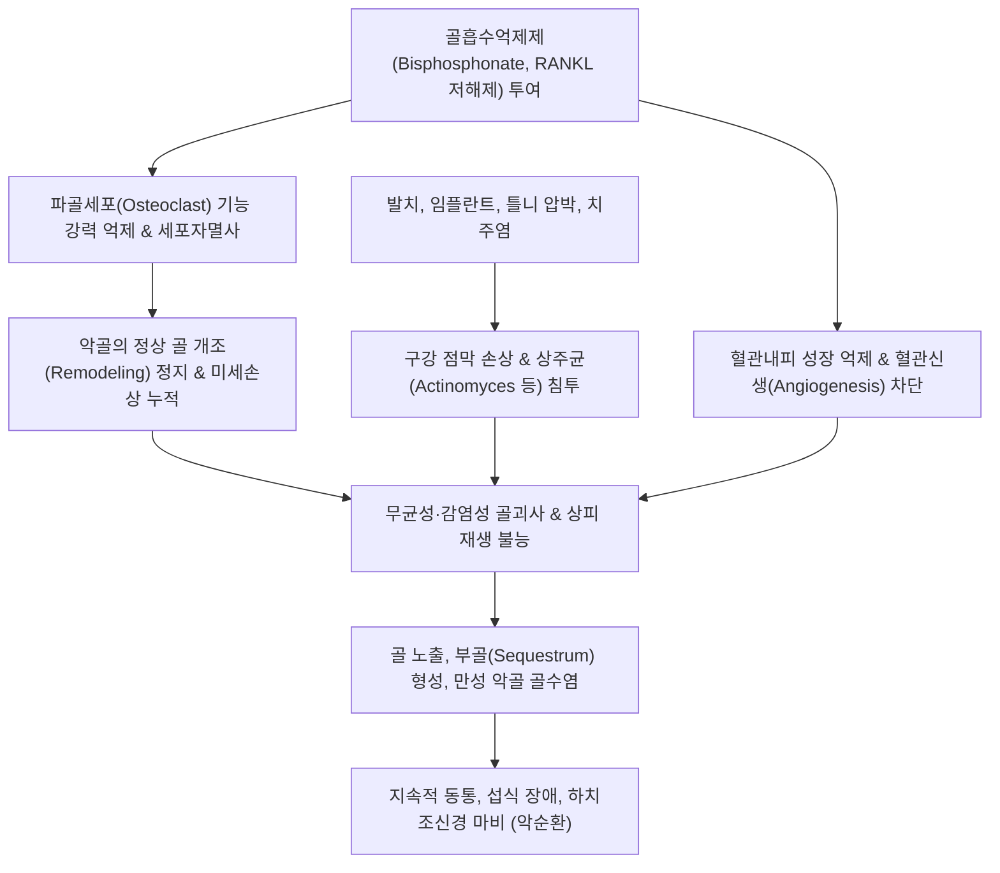

# 🩺 턱 골괴사증

> **핵심 3줄 요약 (Key Summary)**:
> - 📍 **병소 부위 & 해부·병태생리**: 비스포스포네이트([[골다공증]] 치료제) 또는 데노수맙 등 골흡수억제제·혈관형성억제제 투여 환자에서 하악골(80%) 및 상악골(20%)의 파골세포 활성 억제와 미세혈관 부전으로 인해 발생하는 악골 괴사 및 구강 점막 노출 질환([[MRONJ]]).
> - 🚩 **전형적 임상 양상**: 발치·임플란트 시술 후 치유되지 않는 8주 이상의 치조골 노출, 구강 내 악취, 턱 뼈 통증, 누공(Fistula) 형성 및 고름 배출, 하치조신경 압박에 따른 아랫입술 감각 저하.
> - 🛠️ **핵심 검사 & 치료 전략**: 악안면 파노라마 및 CBCT(골경화, 부골 분리 관찰); 클로르헥시딘 구강 소독, 보존적 항생제, 부골절제술; 한의학적 보기양혈·온양생골(補氣養血·溫陽生骨) 및 황련해독탕 구강 세정, 약제 휴약기(Drug holiday) 치과 협진.
> - ⚠️ **응급 의뢰 레드플래그**: 안면부 광범위 봉와직염, 개구 장애 및 고열 동반(악골 골수염 및 심부 경부 감염 확산); 하악골 병적 골절 의심 소견.

---

## 📌 목차
1. [질환 개요 & 해부학적 병태생리](#1-질환-개요--해부학적-병태생리)
2. [병태생리 메커니즘 & 생체역학적 악순환 네트워크](#2-병태생리-메커니즘--생체역학적-악순환-네트워크)
3. [임상 증상 & 이학적 검사(Physical Exam) 알고리즘](#3-임상-증상--이학적-검사physical-exam-알고리즘)
4. [감별 진단 매트릭스 (Differential Diagnosis)](#4-감별-진단-매트릭스-differential-diagnosis)
5. [한의 통합 치료 프로토콜 (침·약침·추나·한약)](#5-한의-통합-치료-프로토콜-침약침추나한약)
6. [양방 치료 & 병용·의뢰 기준 (Conventional Treatment & Referral)](#6-양방-치료--병용의뢰-기준-conventional-treatment--referral)
7. [재활 운동 & 생활습관 티칭 가이드](#7-재활-운동--생활습관-티칭-가이드)
8. [💡 사용자 진료실 핵심 필기 & 임상 노하우 (Melt-In 잔여 심화 집약)](#8--사용자-진료실-핵심-필기--임상-노하우-melt-in-잔여-심화-집약)
9. [출처 및 학술 참고 문헌 (References)](#9-출처-및-학술-참고-문헌-references)

---

## 1. 질환 개요 & 해부학적 병태생리

### 1) 해부학적 특수성과 호발 부위
* **악골(Jaw bones)의 독특한 환경**:
  * 하악골(Mandible)과 상악골(Maxilla)은 얇은 점막(Mucoperiosteum) 하나만으로 구강 내 미생물총과 직접 맞닿아 있는 유일한 골격 구조임.
  * 일상적인 저작 운동으로 인해 인체 내에서 골 개조율(Bone turnover rate)이 대퇴골이나 척추보다 수 배 이상 빠름.
* **호발 부위**:
  * **하악골(약 70~80%)**: 피질골(Cortical bone)이 두껍고 말초 혈액 공급이 주로 단일 혈관인 하치조동맥(Inferior alveolar artery)에 의존하여 허혈에 극히 취약함. 특히 하악 설측 융기(Lingual torus)나 하악 구치부 치조제에 호발.
  * **상악골(약 20~30%)**: 풍부한 해면골과 다원적 측부 혈류망을 갖추고 있어 하악보다 발생 빈도가 낮으나, 상악동염이나 구비강 누공으로의 파급 위험이 큼.

### 2) 질환의 정의 및 진단 기준 (AAOMS 가이드라인)
미국구강악안면외과학회(AAOMS)에 따른 약물관련 악골괴사증([[MRONJ]]) 진단 3대 요건:
1. 과거 또는 현재 골흡수억제제(Bisphosphonate, Denosumab)나 혈관형성억제제(Anti-angiogenic agent)를 투여받은 병력이 있음.
2. 악안면 영역에 두경부 방사선 치료를 받은 병력이 없음(방사선 악골괴사증 ORNJ 배제).
3. 악안면 영역의 골 노출이 존재하거나 구강 내·외 누공을 통해 뼈를 촉침할 수 있는 상태가 **8주 이상 지속**됨.

---

![[턱 골괴사증_02_해부_하악골단면.jpg|450]]
> [그림 2: ② 해부 구조 — 하악골과 주변 근육 단면] 교근·측두근·내외측 익돌근이 부착된 하악골의 단면 해부 도판. 하악골은 혈류 공급이 상대적으로 취약해 괴사가 잘 발생하며, 골 노출 후 치유가 어렵다. 출처: File:Spalteholz's Hand-Atlas of Human Anatomy (1906) Vol.1 (Public domain)

## 2. 병태생리 메커니즘 & 생체역학적 악순환 네트워크

### 1) 파골세포 억제와 골 개조 정지 (Suppression of Bone Turnover)
* 질소 함유 비스포스포네이트(Alendronate, Zoledronic acid 등)는 골 기질에 흡착되어 파골세포의 FPPS 효소를 억제하고 세포자멸사를 유도함.
* 데노수맙([[Denosumab]])은 RANKL을 표적하여 파골세포 분화와 성숙을 차단함.
* 이로 인해 오래된 뼈가 흡수되지 않고 새로운 뼈가 형성되지 못하는 '무기력 골(Adynamic bone)' 상태가 되어 저작 미세골절이 치유되지 않음.

### 2) 항혈관신생 및 구강 연조직 독성
* 약물이 혈관내피세포 성장인자(VEGF)를 억제하여 모세혈관 신생을 차단함으로써 국소 골수와 점막의 허혈을 가중시킴.
* 손상된 구강 점막이 괴사된 골 표면을 덮지 못하고 상피화가 영구적으로 지연되며 방선균(Actinomyces)을 비롯한 구강 혐기성균 감염이 만성화됨.

---

## 3. 임상 증상 & 이학적 검사(Physical Exam) 알고리즘

### 1) 주요 임상 증상 및 병기 분류 (AAOMS Staging)
* **Stage 0 (잠복기/비노출형)**:
  * 골 노출은 없으나 원인 모를 둔한 악골 통증, 치아 동요도 증가, 하치조신경 주행 부위 감각 이상.
* **Stage 1 (무증상 골 노출형)**:
  * 괴사된 뼈가 점막 밖으로 노출되어 있으나 통증이나 급성 감염 징후는 없음.
* **Stage 2 (감염·동통 동반형)**:
  * 골 노출과 함께 심한 악골 통증, 잇몸 발적, 화농성 삼출물(고름), 구취 동반.
* **Stage 3 (진행성 중증형)**:
  * 골 노출 부위가 치조골을 넘어 하악 하연이나 상악동으로 확대됨. 병적 골절, 구강외 피부 누공, 안와 파급 동반.

### 2) 진료실 이학적 검사 알고리즘
1. **구강 점막 시진 및 탐침(Probing) 검사**:
   * 구치부 발치와 부위나 의치 하방 잇몸을 멸균 설압자 및 거즈로 확인.
   * 점막 결손을 통해 회백색 또는 황갈색의 무혈관성 뼈가 노출되었는지 확인. 둔탁한 프로브로 접촉 시 단단한 노출 골 촉지.
2. **신경학적 검사 (Vincent's Sign)**:
   * 아랫입술과 턱 끝(하악신경 멘탈신경 영역)의 촉각 및 통각 저하 여부 평가. 양성 시 하치조신경관 침범 시사.
3. **악안면 영상의학적 검사 소견 대조**:
   * 치과 파노라마: 골흡수 없는 광범위 골경화증(Osteosclerosis), 치주인대강 비후(Widening of PDL space), 부골 형성(Sequestrum formation).

---

![[턱골괴사증_01_영상_MRONJ3기.jpg|450]]
> [그림 1: ① 영상 소견 — 3기 MRONJ(약물 관련 악골 괴사)] 하악골에 골 노출과 골수염 양상의 병변이 진행된 3기 MRONJ 구강 내 소견 사진. 하악골 피질골이 노출되고 주변 점막이 치유되지 않은 상태다. 출처: File:Stage 3 MRONJ.jpg (CC BY-SA 4.0)

![[턱 골괴사증_03_시술_발치.jpg|450]]
> [그림 3: ③ 시술 — 발치 시술(oral extraction)] 치과의사가 마스크·장갑을 착용하고 발치 시술을 시행하는 실제 임상 사진. MRONJ 고위험군(비스포스포네이트·데노수맙 복용자)에서는 발치 전 약물 휴지기와 골 치유 평가가 선행돼야 한다. 출처: File:A dentist conducts an oral extraction procedure.JPG (Public domain)

## 4. 감별 진단 매트릭스 (Differential Diagnosis)

| 질환명 | 호발 부위 및 임상 특징 | 핵심 구별 포인트 | 필수 감별 검사 / 치료 차이점 |
| :--- | :--- | :--- | :--- |
| **약물관련 턱 골괴사증 ([[MRONJ]])** | 하악·상악 구치부 발치 후 호발 | 비스포스포네이트/데노수맙 복용력, 방사선 치료력 없음, 8주 이상 골 노출 | 구강 병소 관찰, 투약력 확인, 보존적 괴사골 분리 유도 |
| **방사선 악골괴사증 (ORNJ)** | 두경부 방사선 조사 영역(하악 호발) | **두경부암 방사선 치료 병력** (통상 50~60 Gy 이상) | 방사선 치료 이력 확인; 고압산소치료(HBOT) 및 미세혈관 유리피판술 |
| **만성 화농성 악골 골수염** | 하악체 및 하악각 | 심한 전신 발열, 백혈구 증가, 치성 감염(충치/치주염) 기원 | 혈액 염증 수치 급상승, 광범위 항생제 및 외과적 배농 |
| **악골 악성 종양 (원발/전이암)** | 상악/하악 불규칙 팽륭 | 비정상적 연조직 종괴, 치아의 급격한 부유(Floating tooth), 악액질 | 조기 조직 생검(Biopsy) 필수, PET-CT 검사 |
| **치조골염 (Dry Socket / 건성치조와)** | 발치 3~5일 후 급성 발생 | 극심한 박동통, 악취, 부골 형성 없음, 2~3주 내 자가 치유 | 진통 소염 처치 및 생리식염수 세척으로 호전 |

---

## 5. 한의 통합 치료 프로토콜 (침·약침·추나·한약)

### 1) 침구 치료 (Acupuncture)
* **국소 혈위 (구강 주위 경락 소통)**:
  * [[하관혈]](ST7), [[협거혈]](ST6), [[대영혈]](ST5): 저작근 혈류 개선 및 하악골 주위 미세순환 촉진.
  * [[승읍혈]](ST1), [[거료혈]](ST3): 상악골 병소 시 안면 혈류 촉진.
  * [[염천혈]](CV23), [[예풍혈]](TE17): 림프 순환 및 인후·하악 울혈 해소.
* **원위 취혈**:
  * [[합곡혈]](LI4), [[내정혈]](ST44): 양명경 열독(熱毒) 청열 및 안면 통증 진통.
  * [[태계혈]](KI3), [[신수혈]](BL23): 신주골(腎主骨) 이론에 기반한 골 기질 강화 및 골 재생 보조.
* **주의사항**: 노출된 골 조직 및 활동성 농양 부위 직접 자침은 균혈증 및 부골 악화 우려로 엄격히 금기하며, 병소 주변부 2~3cm 이격 자침 실시.

### 2) 약침 치료 (Pharmacopuncture)
* **약침 제제 선택**:
  * **황련해독탕 약침**: 국소 감염, 화농성 삼출물, 급성 염증 소견 시 림프절 주위 및 원위 혈위에 소량 주입.
  * **중성어혈약침**: 미세혈관 부전으로 인한 허혈 상태를 개선하기 위해 협거·하관 혈위에 주입.
  * **신바로약침**: 만성 염증성 골흡수 억제 및 주변 골막 염증 완화.

### 3) 한약 가글 및 구강 세정 (Herbal Rinse)
* **청열해독 외용제**:
  * 황련, 황백, 금은화, 연교를 전탕한 미온 한약액으로 하루 3~4회 식후 구강을 1~2분간 부드럽게 가글하여 혐기성 세균막 형성 억제.

### 4) 변증별 맞춤 한약 처방 (Herbal Medicine)
* **신양허약 / 음저골괴 (腎陽虛弱 / 陰疽骨壞)**:
  * 병태: 오랜 골다공증 치료로 뼈가 마르고 양기가 쇠약하여 상처가 아물지 않는 상태.
  * 증상: 맑은 고름이 조금씩 나오고 통증은 은은함, 피로, 추위 탐, 설담태백, 맥침세무력.
  * 처방: **[[양화탕]](陽和湯)** 또는 **[[탁리소독음]](托裏消毒飮)** 가감 (숙지황, 녹각교, 육계, 포강, 마황, 백개자).
* **기혈양허 (氣血兩虛)**:
  * 증상: 창백한 잇몸, 육아조직 형성 부진, 골 노출 장기화, 식욕 부진.
  * 처방: **[[십전대보탕]](十全大補湯)** 또는 **보중익기탕(補中益氣湯)** 가감 (골쇄보, 속단, 황기 증량).
* **열독치성 / 골조농양 (熱毒熾盛 / 骨槽膿瘍)**:
  * 증상: 심한 턱 통증, 누런 고름 배출, 입안 악취, 변비, 설홍태황조.
  * 처방: **오미소독음(五味消毒飮)** 합 **황련해독탕(黃連解毒湯)**.

---

## 6. 양방 치료 & 병용·의뢰 기준 (Conventional Treatment & Referral)

### 1) 병기별 양방 치료 전략
* **보존적 치료 (Stage 1~2)**:
  * 0.12% 클로르헥시딘(Chlorhexidine) 구강 린스 1일 2~3회.
  * 2차 감염 동반 시 광범위 경구 항생제 투여: Amoxicillin/Clavulanate(오구멘틴 625mg tid) 또는 Clindamycin(300mg qid, 페니실린 알레르기 시).
* **외과적 치료 (Stage 2 일부 및 Stage 3)**:
  * 표재성 부골 제거술(Sequestrectomy) 및 날카로운 골연 다듬기(Smoothing of sharp bony edges).
  * 광범위 괴사 시 악골 부분 절제술 및 금속판 고정, 혈관화 비골 피판술(Fibula free flap) 재건.

### 2) 약제 휴약기(Drug Holiday)의 현대적 가이드라인
* 골다공증 환자에서 비스포스포네이트를 4년 이상 투여했거나 스테로이드 병용 등 위험 인자가 있는 경우, 치과 발치 전 2개월 전후 휴약을 상의할 수 있으나, 골다공증 골절 위험도와 비교 형량하여 내과-치과 간 다학제 협진 필수.
* 암 환자의 고용량 정맥 주사 환자는 약제 중단에 따른 종양 악화 위험이 커 휴약이 권장되지 않음.

### 3) 양방·전문과 의뢰 기준 (Referral Criteria)
* **즉각 구강악안면외과 / 대학병원 전과의뢰**:
  * 비스포스포네이트 복용 환자에서 8주 이상 치유되지 않는 골 노출 확인 즉시.
  * 안면부 봉와직염, 피부 누공 형성, 악골 병적 골절 징후 발생 시.
  * 침 치료 중 환자가 잇몸에서 뼈가 튀어나왔다고 호소하는 경우 한의 단독 진료를 지양하고 즉시 상급 치과 병원 협진 의뢰.

---

## 7. 재활 운동 & 생활습관 티칭 가이드

### 1) 구강 위생 및 자극 차단 교육
* **부드러운 구강 관리**:
  * 칫솔모가 극히 부드러운 초극세모 칫솔 사용, 골 노출 부위는 직접 문지르지 말고 거즈로 가볍게 닦아냄.
  * 알코올 성분이 함유된 자극적인 시판 구강청결제 사용 금지.
* **의치(틀니) 착용 제한**:
  * 틀니 압박으로 인한 점막 궤양이 괴사를 촉발하므로, 수면 시 반드시 틀니를 제거하고 통증 부위가 닿는 틀니는 치과에서 내면을 릴라이닝(Relining)할 때까지 착용 중지.

### 2) 영양 및 섭식 관리
* 단단하고 거친 음식(누룽지, 마른 오징어, 딱딱한 바게트빵)은 잇몸 점막을 찢을 수 있으므로 부드러운 유동식 및 연식 위주 섭취.
* 흡연은 구강 점막 혈류를 급격히 차단하므로 전면 금연 티칭.

---

## 8. 💡 사용자 진료실 핵심 필기 & 임상 노하우 (Melt-In 잔여 심화 집약)

### 1) 골다공증 약제 복용력 문진의 절대적 중요성
* 60대 이상 여성 환자가 "잇몸이 붓고 턱이 쑤신다"고 내원했을 때, 단순히 턱관절 장애나 풍치로 치부해서는 안 됨.
* 반드시 **"골다공증 주사나 먹는 약을 드신 적이 있습니까?"**를 첫 질문으로 던질 것.
* 환자들은 6개월에 한 번 맞는 프롤리아([[Prolia]], Denosumab)나 1년에 한 번 맞는 주사를 '영양제 주사'로 착각하는 경우가 흔하므로 약물 처방전이나 병원명을 구체적으로 확인해야 함.

### 2) 한의 진료실에서의 1차 안전 수칙
* MRONJ 환자가 내원했을 때 잇몸에 직접 사혈(침으로 피 빼기)을 하거나 침을 깊게 찌르는 행위는 치명적인 2차 감염과 괴사 부위 확대를 부를 수 있음.
* 악골 괴사는 '외과적 불개입(Minimally invasive, Gentle care)'이 전 세계적인 원칙이므로, 한의학적으로는 전신 기혈 보강 및 원위 취혈을 통한 면역력 지지에 집중하고 국소 처치는 전문 구강악안면외과에 맡기는 하이브리드 협진 모델을 취해야 함.

---

## 9. 출처 및 학술 참고 문헌 (References)

* Identifying incident medication-related osteonecrosis of the jaw and antiresorptive drug holidays using natural language processing on clinical notes in men and women prescribed bisphosphonates or denosumab for fracture prevention. [PMID: 42827373]

* Ruggiero SL, Dodson TB, Aghaloo T, Carlson ER, Ward BB, Kademani D. American Association of Oral and Maxillofacial Surgeons' Position Paper on Medication-Related Osteonecrosis of the Jaw-2022 Update. J Oral Maxillofac Surg. 2022;80(5):920-943.

* Nicolatou-Galitis O, Schiødt M, Mendes RA, et al. Medication-related osteonecrosis of the jaw: definition and best practice for prevention, diagnosis, and treatment. Oral Surg Oral Med Oral Pathol Oral Radiol. 2019;127(2):117-135.

* Khan AA, Morrison A, Hanley DA, et al. International Task Force on Osteonecrosis of the Jaw. Diagnosis and management of osteonecrosis of the jaw: a systematic review and international consensus. J Bone Miner Res. 2015;30(1):3-23.
