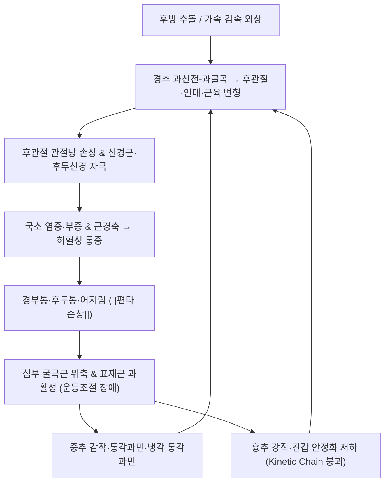

# 🩺 [[편타 손상]] (Whiplash Injury / 鞭打損傷, ICD-10 S13.4 / KCD-8 S13.4)

> **핵심 3줄 요약 (Key Summary)**:
> - 📍 **병소 부위 & 해부·병태생리**: 경추 상·중부 분절([[C1-C2 환축관절]], [[C2-C3 후관절]], [[C5-C6]])의 인대·관절낭·추간판·척추주위근([[흉쇄유돌근]], [[상부 승모근]], [[심부 경부 굴곡근]]) 손상과 상부경추 삼차신경척수핵 연결([[대후두신경]])을 통한 두통 발생. 가속-감속 기전에 의한 과신전→과굴곡 손상 후 심부 근육의 운동조절 장애와 중추 감작이 통증을 만성화시킨다.
> - 🚩 **전형적 임상 양상 & 3대 징후**: ① 경부 통증·경직 및 압통, ② 후두부 중심의 두통(경인성 두통 양상)과 어지럼, ③ 경추 가동범위 제한 + 상지 방사통·감각이상(신경학적 징후 동반 시 Grade III). 사고 직후보다 수시간~수일 뒤 증상이 심해지는 지연성 악화가 특징적이다.
> - 🛠️ **핵심 감별 검사 & 한·양방 다각적 치료 전략**: [[경추 ROM 검사]], [[Spurling test]], [[경추 견인 검사]], [[Flexion-Rotation Test]], [[심부 경부 굴곡근 지구력 검사(CCFT)]]로 평가. 침·약침·추나(경추 신연 + 흉추 교정 중심)·한약(급성기 소염활혈, 만성기 보간신·거어)과 점진적 능동 운동치료(심부 경부 굴곡근 강화)를 병행하는 것이 근거 기반 축이다.
> - ⚠️ **응급 의뢰 레드플래그 & 악화 요인**: 골절·탈구(QTF Grade IV), 척수 손상 징후(양손 저림, 보행 실조, 대소변 장애), **척추동맥 박리**(경부 회전 후 어지럼·복시·구음장애·편측 감각이상), 뇌진탕 동반 의식 변화, 지연성 경막외혈종. 상부경추 강제 회전 교정 수기(High-velocity rotation manipulation)는 절대 금기이다.

---

## 📌 목차
1. [질환 개요 & 해부학적 병태생리](#1-질환-개요--해부학적-병태생리)
2. [병태생리 메커니즘 & 생체역학적 악순환 네트워크](#2-병태생리-메커니즘--생체역학적-악순환-네트워크)
3. [임상 증상 & 이학적 검사(Physical Exam) 알고리즘](#3-임상-증상--이학적-검사physical-exam-알고리즘)
4. [감별 진단 매트릭스 (Differential Diagnosis)](#4-감별-진단-매트릭스-differential-diagnosis)
5. [한의 통합 치료 프로토콜 (침·약침·추나·한약)](#5-한의-통합-치료-프로토콜-침약침추나한약)
6. [양방 치료 & 병용·의뢰 기준 (Conventional Treatment & Referral)](#6-양방-치료--병용의뢰-기준-conventional-treatment--referral)
7. [재활 운동 & 생활습관 티칭 가이드](#6-재활-운동--생활습관-티칭-가이드)
8. [💡 사용자 진료실 핵심 필기 & 임상 노하우 (Melt-In 잔여 심화 집약)](#7--사용자-진료실-핵심-필기--임상-노하우-melt-in-잔여-심화-집약)
9. [출처 및 학술 참고 문헌 (References)](#8-출처-및-학술-참고-문헌-references)

---

## 1. 질환 개요 & 해부학적 병태생리

![[편타 손상_2_1.jpg|540]]
> [그림 1: ① 병태생리·영상 — Lateral neck X-ray of whiplash.jpg]

![[편타 손상_2.jpg|540]]
> [그림 2: Cervical Spine - Atlas and Axis.png]

* **질환 정의 및 분류**:
  * **정의**: 편타 손상(Whiplash Injury)은 자동차 추돌 등 **가속-감속(acceleration-deceleration) 기전**에 의해 경추가 생리적 범위를 넘어 급격히 과신전(hyperextension)되었다가 과굴곡(hyperflexion)으로 이어지며(또는 그 반대 순서) 경추 연부조직·후관절·인대·신경근에 손상이 발생하는 상태를 말한다. 여기서 '편타(鞭打, whiplash)'는 **손상 기전**을 지칭하는 용어이며, 이 기전으로 발생한 **경부 통증·경직·두통·어지럼·인지증상 등의 증상군**을 **편타 손상 증후군(Whiplash-Associated Disorders, WAD)**이라 한다.
  * **개념적 쟁점**: Winfield(1999)는 WAD가 해부학적 손상 실체로 확립된 독립 질환인지에 대한 논쟁을 정리하면서, **생물학적 손상 + 심리적 요인 + 사회·보상적 요인**이 증상 지속에 상호작용한다는 생물심리사회적(biopsychosocial) 관점을 강조하였다. 즉 WAD는 "조직 손상의 정도"만으로 증상의 지속과 중증도를 설명하기 어려운 측면이 있다.
  * **Quebec Task Force(QTF) 분류** — 임상 중증도 및 처치 결정의 표준 축:
    | 등급 | 임상 소견 | 의미 |
    | :--- | :--- | :--- |
    | Grade 0 | 경부 불편감 없음, 이학적 소견 없음 | 무증상 |
    | Grade I | 경부 통증·경직·압통만 있고 이학적 징후 없음 | 연부조직 손상 추정 |
    | Grade II | 경부 증상 + 근골격계 징후(ROM 제한, 점압통) | 가장 흔한 실전 유형 |
    | Grade III | 경부 증상 + 신경학적 징후(반사 저하, 근력 약화, 감각 저하) | 신경근 침범 |
    | Grade IV | 경부 증상 + **골절 또는 탈구** | **즉시 의뢰 대상** |
  * **호발 상황 및 역학적 특성**: 주로 **후방 추돌(rear-end collision)** 교통사고에서 발생하며, 정지 상태에서 피추돌된 운전자/동승자가 대표적이다. Newman(1990)은 편타 손상이 산업·보험·법적 비용 측면에서 막대한 사회적 부담을 만드는 문제임을 지적하면서, 근거가 취약한 다양한 치료법이 남용되어 왔음을 경고하였다. Bannister & Amirfeyz(2009)의 고찰에서도 **다수는 시간 경과에 따라 호전**되지만 일부는 만성 통증과 기능 장애로 이행한다고 정리된다. (만성화 이행률의 정확한 수치는 연구 설계·표본에 따라 편차가 커서 **본 노트에서는 근거 미확인**으로 둔다.)

* **관련 해부학적 구조물**:
  * **골격 및 관절**:
    * **[[환추(C1)-축추(C2) 복합체]]**: 환축관절(atlantoaxial joint)과 환추후두관절(atlanto-occipital joint)은 경추 회전의 약 50%를 담당하여 회전 손상에 가장 취약한 분절이다. 급격한 회전력은 [[횡인대(transverse ligament)]] 및 익상인대에 과부하를 준다.
    * **[[C2-C3 후관절]]**: 상부 경추 후관절은 경인성 두통의 주요 통증 발생원으로 지목되며, C1-C3 분절에서 유래한 통증은 삼차신경척수핵을 통해 두부로 투사된다([[경인성 두통]], Piovesan & Utiumi 2024).
    * **중·하부 경추(C5-C6, C6-C7)**: 생리적 전만의 중심이자 퇴행성 변화가 시작되는 분절로, 편타 손상 시 추간판 및 후관절 관절낭 손상이 겹치면 만성 경부통의 근원이 된다.
    * **[[흉추 상부(T1-T4)]]**: 경추 운동의 기저를 지지하는 부위로, 강직 시 경추 보상 과운동이 유발된다.
  * **근육 및 근막**:
    * **[[흉쇄유돌근(Sternocleidomastoid)]]**: 표재성 경부 굴곡근. 편타 손상 후 과활성 및 단축되어 상부 경추 신전·하부 경추 굴곡의 이상 정렬을 만든다.
    * **[[전사각근·중사각근]]**, **[[두반극근·경반극근·경최장근]]**: 심부 신전근군의 위축·지방침윤이 만성 WAD에서 관찰된다(운동조절 장애의 핵심).
    * **[[심부 경부 굴곡근(두장근·두전직근·경장근·전두직근)]]**: 경추 심부 안정화의 핵심. 활성 지연(delayed onset)과 지구력 저하가 편타 손상 후 전형적으로 나타난다(Sterling 2014).
    * **[[상부 승모근]]**, **[[견갑거근]]**: 이차적 과긴장 및 트리거포인트 호발 부위.
  * **신경 및 혈관**:
    * **[[대후두신경(Greater occipital nerve, C2 후지)]]**, **[[소후두신경(C2-C3)]]**, **[[제3후두신경(C3)]]**: 상부 경추 후관절 및 근막 긴장에 의해 자극되면 후두부 통증을 유발한다.
    * **[[삼차신경척수핵(trigeminocervical nucleus)]]**: C1-C3 감각섬유와 삼차신경 안구분지 섬유가 수렴하는 구조로, 경추 병소가 두통으로 표현되는 해부학적 연결고리이다(Piovesan & Utiumi 2024).
    * **[[경추 신경근(C5-C8, T1)]]**: 신경근공 협착 또는 추간판 탈출 동반 시 피부분절·근육분절에 따른 방사통·근력 저하를 유발한다.
    * **[[척추동맥(Vertebral artery)]]**: C6 횡돌기공을 통해 두개강으로 주행. 경부 회전·신전 손상 시 내막 손상과 박리 위험이 있어 **회전 수기의 절대적 금기 근거**가 된다.

---

## 2. 병태생리 메커니즘 & 생체역학적 악순환 네트워크

![[편타 손상_3.jpg|540]]
> [그림 3: ② 관련 해부 구조물 — DDE uptake in a representative healthy control (left) and a <b>whiplash</b> patient (right).The patient displays high DD]

### 1) 해부학적 포착 및 압박 기전
* **급성기 조직 손상 기전**: 후방 추돌 시 탑승자의 몸통이 시트에 밀려 전방 가속되고, 머리는 관성에 의해 뒤로 젖혀지며 경추 하부는 과신전, 상부는 과굴곡되는 **역방향 굽힘(S-shape) 변형**이 순간적으로 발생한다. 이때 ① 후관절 관절낭의 신장·열상, ② 전종인대·후종인대 및 황색인대의 부분 파열, ③ 추간판 섬유륜의 내부 파열(internal disc disruption), ④ 척추주위근의 섬유 열상이 복합적으로 일어난다.
* **후관절 유래 통증**: 후관절과 그 관절낭은 C2-C3 및 C5-C6에서 통증 유발 검사상 가장 흔한 압통원으로 보고된다. 관절낭 염증성 삼출 → 활막 자극 → 관절 내 유리체 및 관절낭 구축이 만성 경부통의 병리로 이어진다.
* **신경근 압박**: 추간판 팽윤 또는 골극과 결합된 신경근공 협착은 해당 피부분절(예: C6 → 엄지·전완 요측)의 저림과 근육분절(삼각근 C5, 이두근 C5-C6, 수근신근 C6)의 근력 저하를 초래한다. **외상 직후 즉시 발생하는 중증 근력 저하는 신경근 좌상이 아닌 척수 손상 감별이 우선**이다.
* **혈관성 허혈**: 경부 심부 근의 지속적 수축은 근내 압 증가와 미세순환 저하를 일으켜 대사산물 축적 → 통증 유발물질 방출 → 통증-경축 악순환에 빠진다.

### 2) 생체역학적 연쇄 반응 (Kinetic Chain)
* **상부-하부 경추 교차 증후군**: 상부 경추는 과신전(두반극근 단축), 하부 경추는 과굴곡(심부 굴곡근 위축)되어 **전만 소실 또는 일자형 경추(straight neck)**가 형성된다. 이 정렬은 후관절 및 추간판에 비정상 전단력을 지속 가한다.
* **경흉부 연결 붕괴**: 흉추 상부 강직이 있으면 경추는 요구되는 회전·신전 범위를 흉추에서 확보하지 못하고 스스로 과운동을 하게 되어 재손상 위험이 커진다. 따라서 **흉추 가동성 회복은 경추 치료의 필수 전제**이다.
* **견갑-상지 연쇄**: 상부 승모근·견갑거근 과긴장과 전거근·하부 승모근 약화가 동반되면 견갑골이 전방 거상되어 심부 경부 굴곡근 운동 시 보상 패턴이 나타난다.
* **중추 감작(Central Sensitization)**: Sterling(2014)은 초기 통증 강도·장애 지수 상승, **냉각 통각과민(cold hyperalgesia)**, 외상 후 스트레스 증상 등이 만성화의 예후 예측 인자라고 정리하였다. 즉 말초 조직 손상이 해결된 후에도 중추 수준의 감작과 심리적 요인이 증상을 유지할 수 있다. **개별 환자에서 중추 감작의 기전적 기여도를 정량화하는 지표는 근거 미확인**이다.

---

## 3. 임상 증상 & 이학적 검사(Physical Exam) 알고리즘

### 1) 주소증 및 신경학적 증상
* **핵심 주소증**:
  * **경부 통증 및 경직**: 가장 흔한 증상. 사고 직후에는 가벼워도 **6~24시간에 걸쳐 지연성 악화**되는 양상이 특징적이다(Newman 1990, Bannister & Amirfeyz 2009).
  * **두통**: 후두부에서 시작하여 안와부·측두부로 퍼지는 **경인성 두통(Cervicogenic Headache)** 양상. 편측 고정성(side-locked)이며 경부 움직임·압박으로 유발된다(Piovesan & Utiumi 2024).
  * **어지럼·현훈**: 상부 경추 고유수용기 기능 저하 또는 전정계 타박에 기인할 수 있으나, **척추동맥 박리 감별이 반드시 선행되어야 한다**.
  * **인지·자율신경 증상**: 집중력 저하, 기억력 저하, 이명, 시야 흐림, 피로감, 수면 장애 — 뇌진탕 동반 여부와의 구분이 필요하다.
* **감각 이상**: 피부분절(Dermatome)에 따른 저림, 이상감각, 감각 저하. C6(엄지·전완 요측), C7(중지), C8(약지·소지) 순으로 호발.
* **운동 장애**: 근육분절(Myotome)에 따른 근력 약화, 근위축, 정밀 동작 장애. 삼각근(C5), 이두근·완요골근(C5-C6), 수근신근(C6-C7), 골간근(C8-T1).
* **혈관/자율신경 증상**: 상지 냉감, 부종, 피부색 변화. **맥박 약화·편측 혈압차가 있으면 혈관성 병변 의뢰**.

### 2) 필수 이학적 검사법 (Physical Examination)

| 검사 | 목적 | 양성 반응 및 해석 |
| :--- | :--- | :--- |
| [[경추 능동 ROM 검사]] | 가동범위 제한 정량화(WAD Grade II 판정 핵심) | 회전·신전 제한이 가장 뚜렷. 신전+회전 말단에서 통증 재현 |
| [[후관절 압통 촉진]] | 분절별 병소 위치 추정 | C2-C3, C5-C6 극돌기 옆 압통 |
| [[Spurling test]] | 신경근 압박 유발 | 동측 상지 방사통 재현 시 양성(신경근병증 시사) |
| [[경추 견인 검사(Distraction test)]] | 신경근 압박 완화 확인 | 견인 시 방사통 감소 → 신경근성 통증 지지 |
| [[Jackson 압박 검사]] | 신경근공 협착 유발 | 압박 시 방사통 재현. Spurling과 병용 |
| [[Shoulder abduction relief sign]] | 신경근 긴장 완화 | 환자가 환측 손을 머리 위에 올리면 통증 감소 |
| [[Flexion-Rotation Test]] | 상부 경추(C1-C2) 기능 평가 | 굴곡 상태에서 회전 제한(<32°) 시 경인성 두통 지지(Piovesan & Utiumi 2024) |
| [[CCFT(심부 경부 굴곡근 검사)]] | 심부 굴곡근 활성·지구력 평가 | 22→30 mmHg 단계 상승 실패 시 심부 굴곡근 기능부전 |
| [[경추 관절위치감각 검사(JPE)]] | 고유수용 감각 평가 | 재위치 오차 증가 → 편타 손상 후 전형적 소견 |
| [[Hoffmann sign, Lhermitte sign]] | 척수 병변 감별 | 양성 시 즉시 MRI 및 전문과 의뢰 |

* **신경학적 선별 검사**: 심부건반사(이두근 C5-C6, 완요골근 C6, 삼두근 C7), 근력 등급(MMT), 피부 감각 비교. 세 가지 중 하나라도 이상이면 **Grade III**로 분류하고 영상 검사(경추 MRI, 필요 시 CT)를 고려한다.
* **가양성 감별**: Spurling 검사는 정상인에서도 위양성이 흔하므로 반드시 감각·반사·근력 소견과 결합하여 해석한다. 단독 양성만으로 신경근병증을 진단하지 않는다.

---

## 4. 감별 진단 매트릭스 (Differential Diagnosis)

| 감별 질환 | 호발 병소 및 원인 | 주소증 차이점 | 특이적 이학적 검사 소견 |
| :--- | :--- | :--- | :--- |
| [[편타 손상]] (본 질환) | 교통사고 가속-감속 기전, 경추 후관절·인대·심부근 | 외상력 명확, 경부통+후두통+경직, 지연성 악화 | [[경추 ROM 제한]] + 후관절 압통 + CCFT 저하 |
| [[경인성 두통]] | C1-C3 후관절·후두신경, 삼차신경척수핵 수렴 | 편측 고정성 후두부 통증, 경부 움직임/압박으로 유발 | [[Flexion-Rotation Test]] 양성, C2-3 차단술로 일시 완화(Piovesan & Utiumi 2024) |
| [[경추 신경근병증]] | 추간판 탈출·신경근공 협착 | 피부분절에 따른 방사통, 저림, 근력 저하 | [[Spurling test]] 양성, 견인 시 완화, 반사 저하 |
| [[후두신경통]] | 대후두신경 압박·자극 | 후두부 발작성 전격통, 신경 주행 압통 | 후두신경 압통점 양성, 경부 운동과 무관 |
| [[뇌진탕/경도 외상성 뇌손상]] | 두부 타박·가속 손상 | 두통+집중력·기억력 저하, 오심, 광선·소리 과민 | 인지 선별검사 이상, 경추 검사와 불일치 |
| [[척추동맥 박리]] | 경부 회전·신전 시 혈관 내막 손상 | 어지럼+복시+구음장애+편측 감각이상 | 신경학적 국소 징후, 응급 영상 필요 |
| [[섬유근통/중추성 통증]] | 중추 감작, 심리·사회적 요인 | 광범위 통증, 수면장애, 피로 | 다발성 압통점, 냉각 통각과민 |
| [[경추 골절·탈구 (Grade IV)]] | 고에너지 손상 | 극심한 통증, 신경학적 결손 | 압통 심함, **영상 검사상 골절** → 즉시 의뢰 |

---

## 5. 한의 통합 치료 프로토콜 (침·약침·추나·한약)

![[편타 손상_4.jpg|540]]
> [그림 4: ③ 치료·시술점 — A 49-year female admitted after in car traffic accident (rear collision), complaining of severe posterior neck pain and ]

> **치료 원칙**: 편타 손상 치료의 근거 기반 축은 **① 통증 조절 + ② 조기 능동 운동 + ③ 심리·사회적 요인 관리**이다(Sterling 2014). 수동적 치료는 통증 완화를 위한 단기 보조로 제한하고, 가능한 한 빨리 능동 운동과 일상 복귀를 병행해야 만성화를 줄일 수 있다. 운동치료는 통증 강도와 기능 개선에 도움이 될 수 있으나 **근거 수준은 제한적**이므로(Chrcanovic & Larsson 2022), 단일 중재가 아닌 병행 프로토콜로 접근한다.

* **침구 치료 (Acupuncture)**:
  * **국소 취혈**: [[風池(GB20)]], [[天柱(BL10)]], [[肩井(GB21)]], [[大椎(GV14)]], [[頸夾脊(C3-C7 협척혈)]], 아시혈(후관절 압통점).
  * **원위 취혈**: [[後谿(SI3)]], [[外關(TE5)]], [[合谷(LI4)]], [[崑崙(BL60)]], [[申脈(BL62)]] — 경추부 경근 이완 및 통증 조절.
  * **두통 동반 시**: [[太陽(EX-HN5)]], [[率谷(GB8)]], [[頭維(ST8)]], [[角孫(TE20)]].
  * **전침 세팅**: 국소 근경축 부위에 2~10 Hz 저주파(근이완·진통 목적), 신경병증성 방사통에는 2/100 Hz 교대 자극을 임상적으로 적용. **편타 손상에서 특정 전침 주파수 프로토콜의 우월성을 검증한 근거는 미확인**이며, 일반 근골격계 진통 원칙을 준용한다.
  * **자침 심도**: 후두부 風池·天柱는 **척추동맥 및 척수 접근 위험**이 있으므로 내측·상방 방향 자침을 삼가고, 골면에 닿은 뒤 2~3 mm 이내로 제한한다.
* **약침 치료 (Pharmacopuncture)**:
  * **적용 원칙**: 후관절 주위 압통점 및 후두신경 주행로, 상부 승모근·견갑거근 트리거포인트, 흉추 상부 경직부에 소량(0.05~0.1 mL/점) 주입.
  * **추천 약침(임상 적용)**:
    * 급성기 염증·부종: [[黃連解毒湯 약침]], [[紅花 약침]] — 소염·활혈 목적.
    * 통증·경축: [[蜂藥針(봉독 약침)]] — 진통·항염 목적. **과민반응(아나필락시스) 이력 확인 필수**.
    * 만성기 조직 재생: [[紫河車 약침]], [[中藥 補益 계열 약침]].
  * ⚠️ **경추 추간판 탈출 및 신경근 압박이 확인된 경우, 심부·후방 주입은 금기**이며 표층 근육 및 압통점에 한정한다.
  * 📌 **약침의 편타 손상 특이적 유효성·용량을 검증한 무작위 대조군 연구는 본 참고 문헌 범위 내에서 근거 미확인**이다.
* **추나 치료 (Chuna Manipulation)**:
  * **경추 신연 기법**: 앙와위에서 두부 견인 + 경부 심부 근막 이완. 급성기에는 **저강도·저속도**로 시행.
  * **흉추 교정(필수 선행)**: 경흉부 강직을 먼저 해소하여 경추 과운동 부담을 줄인다. 앙와위 또는 좌위에서 흉추 신전 가동법 적용.
  * **근막 이완 수기(JS 계열)**: 상부 승모근, 견갑거근, 흉쇄유돌근의 근막 이완.
  * 🚫 **금기 수기**: **상부 경추(C1-C2) 고속 회전 교정(high-velocity rotation manipulation)** — 척추동맥 박리 위험. 급성기 심한 방어적 근경축 상태에서의 강제 관절 가동도 금기.
* **한약 치료 (Herbal Medicine)**:
  * **급성기(어혈·표증·염증 우세)**: [[葛根湯]], [[桂枝加葛根湯]] — 항부 강직 및 표증 해소. 어혈 뚜렷하면 [[身痛逐瘀湯]], [[血府逐瘀湯]] 계열로 활혈거어.
  * **만성기(기혈허·간신부족)**: [[獨活寄生湯]], [[補中益氣湯]], [[八味地黃丸]] 계열로 보익.
  * **어지럼·현훈 동반**: [[半夏白朮天麻湯]], [[澤瀉湯]].
  * **두통 우세**: [[川芎茶調散]], [[淸上蠲痛湯]].
  * 📌 위 처방들은 [[傷寒論]]·[[東醫寶鑑]] 및 한방 교과서 기반 처방으로, **편타 손상에 대한 처방별 무작위 대조군 근거는 본 참고 문헌 범위 내에서 미확인**이다. 환자 체질·동반 질환(고혈압, 항응고제 복용) 에 따라 조정한다.

* **양방 병행 고려**: 급성기 NSAIDs·아세트아미노펜 단기 사용, 신경병증성 통증에는 가바펜틴 계열 고려. **경추 칼라(soft collar)의 장기 착용은 오히려 회복을 지연시킬 수 있으므로 조기 해제를 권장**한다(Sterling 2014). Grade III 이상은 신경외과·정형외과 협진.

---

## 6. 양방 치료 & 병용·의뢰 기준 (Conventional Treatment & Referral)

> 🎯 **이 섹션의 목적**: 환자가 **양방약을 이미 복용 중인 경우가 많다.** 한의원 1차 진료에서 양방 치료를 이해하고, 병용 가능·주의·금기를 판단하며, 언제 의뢰할지 결정한다.

* **약물 치료 (Medication)**:
  * 계열별 약물·용량·기간 — 국내 처방 관행 반영.
  * 작용 기전과 한의 치료와의 상호작용.
* **비약물 시술 (Procedures)**:
  * 주사·차단술·물리치료·보조기 등.
* **수술·시술 적응증 (Surgical Indication)**:
  * 언제 수술로 가는가 — 절대·상대 적응증, 수술 후 경과.
* **한의 병용 판단 (Combination Therapy)**:
  * 병용 가능 / 주의 / 금기. 복용 중 환자의 감량 타이밍·반동 현상.
* **양방·전문과 의뢰 기준 (Referral Criteria)**:
  * 응급 의뢰 트리거와 전문과 의뢰 기준(정형외과·신경외과·내과 등).

	(작성 필요)

---

## 7. 재활 운동 & 생활습관 티칭 가이드

* **운동치료의 근거**: Chrcanovic & Larsson(2022)의 체계적 문헌고찰 및 메타분석에 따르면, 편타 손상 환자에서 **운동치료는 통증 강도 개선에 도움이 될 수 있으나**, 포함된 연구들의 이질성과 비뚤림 위험으로 **근거의 질은 낮은 수준**으로 평가되었다. 즉 운동은 권장되지만 "만능 단일 해법"이 아니며, 다른 중재와 병행하는 것이 현실적이다. Sterling(2014)도 물리치료 관리의 중심을 **능동적 움직임 회복과 심부 근육 운동조절 재훈련**에 두고, 수동적 치료 의존을 줄일 것을 권고하였다.
* **이완 및 스트레칭 (Stretching)**:
  * 상부 승모근·견갑거근·흉쇄유돌근의 **정적 스트레칭 20~30초 × 3회**, 통증 없는 범위 내에서만 시행.
  * 흉추 신전 스트레칭(폼롤러 등) — 경추 부담 경감 목적으로 선행.
* **강화 및 안정화 운동 (Strengthening)**:
  * **[[심부 경부 굴곡근 강화(CCFT)]]**: 환와위에서 크라니오-서비컬 굴곡(craniocervical flexion) 5단계(22→30 mmHg)로 진행, 저부하·고반복(10회 × 10초 유지).
  * **견갑 안정화**: 하부 승모근·전거근 강화(월 슬라이드, 프론 레이즈), 상부 승모근 과활성 억제를 위한 도수 이완 병행.
  * **점진적 부하 원칙**: 통증이 24시간 이내에 기저 수준으로 돌아오는 범위 내에서 강도를 증가시킨다("24시간 룰").
* **신경 활주 운동 (Neurodynamics)**:
  * 상지 방사통이 있는 경우 신경근 긴장 완화를 위한 슬라이딩 기법(median nerve slider, ulnar nerve slider)을 저강도로 시행.
  * 📌 **편타 손상에서 신경 활주 운동의 효과를 검증한 특이적 근거는 본 참고 문헌 내 미확인**이며, 일반 신경근병증 재활 원칙을 준용한다.
* **일상생활 자세 티칭 (Ergonomics)**:
  * **모니터 높이**: 눈높이와 상단이 일치하도록, 화면은 팔 길이 거리.
  * **스마트폰**: 고개 숙인 자세(텍스트 넥) 최소화, 눈높이로 들어 올려 사용.
  * **수면 자세**: 경추 지지가 있는 낮은 베개, 앙와위 또는 측와위 권장. 복와위(엎드려) 수면은 경추 회전 과부하로 금지.
  * **운전**: 머리받침(headrest) 상단을 정수리 높이에 맞춰 후방 추돌 시 경추 과신전을 줄인다.
  * **조기 일상 복귀**: 통증이 있어도 절대 안정보다 **점진적 일상 활동 복귀가 회복에 유리**하다(Sterling 2014).

---

## 8. 💡 사용자 진료실 핵심 필기 & 임상 노하우 (Melt-In 잔여 심화 집약)

> [!IMPORTANT]
> **🛡️ 원문 융합(Melt-In) 및 7번 섹션 작성 불변 규칙 (CRITICAL)**
> 1. **기존 필기 내용 상부 전면 융합 (Melt-In)**: 질환의 정의, 해부학적 원인, 증상, 이학적 검사법, 치료법, 생활 티칭 등 기본 원문은 상부 1~6번 섹션에 유기적으로 100% 녹여내어 고도화하였다.
> 2. **7번 섹션의 차별화된 심화 집약**: 본 섹션은 상부에 이미 녹여낸 기본 내용의 단순 중복이 아니라, **상부 1~6번에 다 담기지 않은 고유한 진료실 실전 노하우**만을 엄선하여 집약한 공간이다.
> 3. **📷 질환 노트 필수 이미지**: 본 노트에는 상단 제목부에 병태생리·영상 도해(Cervical Spine - Atlas and Axis) 임베드가 배치되어 있다.

* **상부 섹션에 미처 다 담지 못한 고유 원문 필기**:
  * **"편타 손상은 진단명이 아니라 기전명이다"** — 환자에게 반드시 이 점을 설명한다. 즉 "편타 손상"이라는 라벨 자체는 왜 아픈지를 설명하지 않으며, 실제 병소는 ① 후관절, ② 추간판, ③ 신경근, ④ 근막, ⑤ 중추 감작 중 어느 것이 우세한지에 따라 치료 전략이 완전히 달라진다.
  * **사고 직후 정상 소견이 안심의 근거가 되지 않는다** — 영상 검사(단순 X선)가 정상이어도 증상은 24~48시간에 걸쳐 최대로 진행할 수 있다. 따라서 초진 시 **"내일·모레 더 아플 수 있다"**를 반드시 예고하고 재내원 일정을 미리 잡아둔다.
  * **보상·소송 요인의 임상적 고려**: Winfield(1999)가 지적한 대로 보상 청구·소송 진행 상황은 증상 보고와 회복 궤적에 영향을 줄 수 있다. 이는 **환자를 의심하라는 의미가 아니라**, 치료 목표 설정 시 심리·사회적 요인을 함께 다루어야 한다는 임상적 의미이다. 진료실에서는 평가·치료 내용을 **객관적 지표(ROM 각도, MMT 등급, 통증 NRS)** 로 반드시 기록해 두는 것이 환자와 의료진 모두에게 이롭다.
* **진료실 실전 감별 & 치료 노하우**:
  * **1. 실전 문진 체크리스트 (초진 5분 스크리닝)**:
    1. **사고 시점과 증상 발생 시점의 간격**은? (지연성 악화 여부 확인)
    2. **어지럼·복시·구음장애·삼킴 곤란**이 있었는가? → 있으면 즉시 영상·전문과 의뢰.
    3. **양손이 동시에 저린가, 한쪽인가?** → 양측성·보행 이상은 척수 손상 적신호.
    4. **두통이 편측 고정성이며 경부 회전으로 유발되는가?** → 경인성 두통 지지(Piovesan & Utiumi 2024).
    5. **머리를 뒤로 젖힐 때 팔로 퍼지는 통증**이 있는가? → Spurling 계열 검사로 연결.
    6. **수면 자세와 베개 높이**는? (만성화의 흔한 유지 요인)
    7. **현재 복용 약물**(항응고제, 스테로이드) 및 **봉독 과민 이력**(약침 전 필수).
  * **2. 치료 순서 및 손맛 노하우**:
    * **순서 원칙: 흉추 → 경추 → 두개부**. 흉추 상부 가동성을 먼저 확보하지 않고 경추만 풀면 다음 날 반동 통증이 온다.
    * **자침 순서**: 원위혈(後谿, 外關) 먼저 → 국소혈(頸夾脊, 天柱, 風池) 나중. 원위 자극 후 환자가 경부를 살짝 움직이며 통증 변화를 스스로 보고하게 하면 치료 반응을 즉시 가늠할 수 있다.
    * **風池·天柱 자침 각도**: 내측 상방으로 골면을 따라, 깊이를 최소화. 회전 자극은 자침 후 실시하지 않는다(척추동맥 위험).
    * **약침 주입**: 후관절 압통점에 0.05~0.1 mL씩, 3~5점. 주입 전 흡인(aspiration) 습관화. 급성기에는 표층 근육 위주로 하고 심부·후방은 피한다.
    * **추나 체위**: 급성기에는 앙와위 저강도 신연 + 흉추 신전 가동만 시행. 좌위 회전계 기법은 급성기를 지나 ROM이 회복된 후에도 **상부 경추는 피하고 중·하부 경추에 한정**한다.
    * **치료 후 확인**: 치료 직후 경추 회전 ROM을 재측정하여 변화를 기록. 호전 폭이 없으면 다음 회차에서 치료 전략(자극 강도·부위)을 바꾼다.
  * **3. 환자 티칭 스크립트 (재발 방지)**:
    * "이 손상은 **뼈보다 관절 주머니와 주변 근육의 조절 능력** 문제입니다. 그래서 통증이 가라앉는 것과 기능이 회복되는 것은 다른 문제입니다."
    * "**목 보호대는 아프다고 계속 차고 있으면 오히려 근육이 약해집니다.** 통증이 심한 처음 며칠만 쓰고, 이후에는 조금 불편해도 움직이는 게 회복에 좋습니다."
    * "**운동은 '아프면 멈춤'이 아니라 '다음 날까지 통증이 올라오지 않는 선'**에서 하세요. 그 선을 넘으면 근육이 다시 방어적으로 굳습니다."
    * "운전하실 때 **머리받침 상단을 정수리 높이에** 맞춰 주세요. 같은 추돌을 당해도 목에 걸리는 힘이 달라집니다."
    * "**증상이 오늘보다 3일 뒤 더 심해지거나, 손이 저리고 힘이 빠지거나, 걸을 때 휘청거리면 즉시 다시 오세요.**"

---

## 9. 출처 및 학술 참고 문헌 (References)

1. **대한정형외과학회 / 척추신경외과학회 교과서**. (경추 손상 및 편타 손상의 분류·평가·치료 원칙 참조)
2. **Chrcanovic B, Larsson J (2022)**. *Exercise therapy for whiplash-associated disorders: a systematic review and meta-analysis*. **Scand J Pain**. PMID: 34561976
   - **[연구 요약]**: 편타 손상 환자에서 운동치료의 효과를 평가한 체계적 문헌고찰 및 메타분석. 운동치료가 통증 강도 개선에 도움이 될 수 있음을 시사하나, 포함 연구의 이질성과 비뚤림 위험으로 **근거의 질은 낮은 수준**으로 평가됨. 운동 단독보다 병행 중재가 현실적임을 시사.
3. **Sterling M (2014)**. *Physiotherapy management of whiplash-associated disorders (WAD)*. **J Physiother**. PMID: 24856935
   - **[연구 요약]**: WAD의 물리치료 관리 지침적 고찰. 초기 통증 강도·장애 정도·냉각 통각과민·외상 후 스트레스 증상 등이 회복 예후 예측 인자로 제시됨. 치료 중심은 **능동적 움직임 회복, 심부 경부 굴곡근 운동조절 재훈련, 칼라 의존 최소화, 조기 일상 복귀**이며 수동적 치료 의존을 줄일 것을 권고.
4. **Winfield JB (1999)**. *Whiplash-associated disorder: WAD is it?*. **Arthritis Care Res**. PMID: 10513483
   - **[연구 요약]**: WAD가 독립된 질환 실체인지에 대한 개념적 논의. 생물학적 손상, 심리적 요인, 보상·법적 요인이 증상 지속에 상호작용한다는 생물심리사회적 관점을 제시.
5. **Piovesan EJ, Utiumi MAT (2024)**. *Cervicogenic headache - How to recognize and treat*. **Best Pract Res Clin Rheumatol**. PMID: 38388233
   - **[연구 요약]**: 경인성 두통의 인식 및 치료 지침. 상부 경추(C1-C3) 구조와 삼차신경척수핵의 수렴 기전을 근거로, 편측 고정성 후두부 통증, 경부 움직임·압박에 의한 유발, Flexion-Rotation Test 양성, 진단적 차단술 반응 등이 감별 포인트로 제시됨.
6. **Newman PK (1990)**. *Whiplash injury*. **BMJ**. PMID: 2282391
   - **[연구 요약]**: 편타 손상의 사회적·경제적 부담과 근거 취약한 치료법의 남용 문제를 지적한 논평. 증상의 지연성 발현과 만성화 이행 가능성을 언급.
7. **Bannister G, Amirfeyz R (2009)**. *Whiplash injury*. **J Bone Joint Surg Br**. PMID: 19567844
   - **[연구 요약]**: 편타 손상의 병리·평가·치료를 정리한 고찰. 다수 환자는 시간 경과에 따라 호전되나 일부에서 만성 통증·기능 장애로 이행하며, 보존적 치료가 원칙임을 정리. Quebec 분류가 임상 평가의 기본 틀로 활용됨.

<!-- 보관 태그(1회용·링크오류, 필요시 복원): 교통사고, 편타손상 -->
