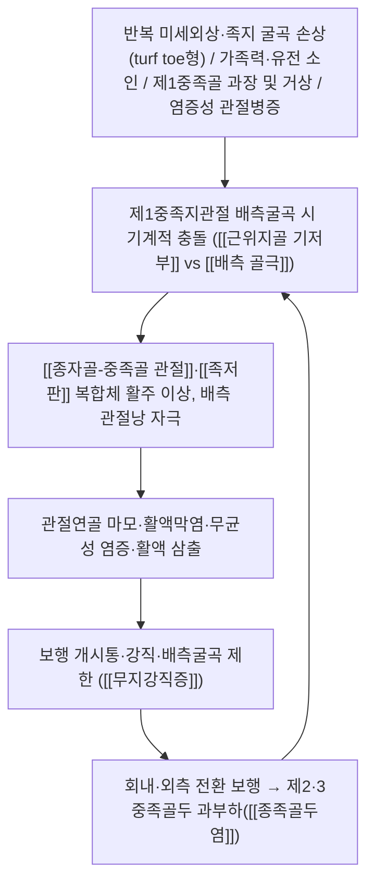

# 🩺 [[무지강직증]] (Hallux Rigidus / 拇趾強直症, ICD-10 M20.2 / KCD M20.2)

![[무지강직증_2.jpg|540]]
> [그림 1: ① 병태생리·영상 — 무지강직증_2]
![[무지강직증_4.jpg|540]]
> [그림 2: ② 관련 해부 구조물 — Radiographs showing a non-union 12 months after the fusion with 2 crossing screws in appropriate alignment.]

> **핵심 3줄 요약 (Key Summary)**:
> - 📍 **병소 부위 & 해부·병태생리**: 제1중족지관절([[제1중족지관절]], 1st MTP joint)의 퇴행성 관절염성 변화. [[제1중족골두]] 배측에 골극(cheilus, 순골)이 형성되어 근위지골 기저부와 충돌하고, 점진적으로 관절연골 전층이 마모되며 [[종자골-중족골 관절]] 및 [[족저판]] 복합체까지 이환된다. [[장모지굴근]]·[[단모지굴근]]·[[무지외전근]]·[[무지내전근]]의 건-종자골 활주 기전 이상이 동반된다.
> - 🚩 **전형적 임상 양상 & 3대 징후**: ① 보행 개시 및 계단·오르막에서 악화되는 제1중족지관절 통증, ② 배측굴곡(dorsiflexion) 제한으로 인한 **강직**, ③ 제1중족골두 배측의 골성 융기 및 국소 압통. 말기에는 제2·3중족골두 전이 통증([[종족골두염]])과 보상성 [[회내 보행]]이 나타난다.
> - 🛠️ **핵심 감별 검사 & 한·양방 다각적 치료 전략**: [[제1중족지관절 배측굴곡 검사]](Dorsal Impingement Test)와 체중부하 방사선으로 진단. 한방적으로는 [[太衝]]·[[行間]]·[[大都]]·[[公孫]]·[[八風穴]] 등 국소·원위 취혈에 [[봉약침]]·[[중성어혈약침]]을 병용하고, [[추나요법]]으로 제1중족지관절 견인·관절가동술을 시행하며, [[獨活寄生湯]]·[[身痛逐瘀湯]] 등을 변증 가미한다. 신발 교정(로커솔·Morton extension)과 활동 조절을 모든 병기에서 병행한다.
> - ⚠️ **응급 의뢰 레드플래그 & 악화 요인**: 급성 단일관절의 발열·발적·극심한 야간통(감염성 관절염·급성 [[통풍]] 발작), 외상 후 골절·탈구([[종자골 골절]] 포함), [[샤르코 관절]](당뇨 신경병증), 종양성 병변, 진행성 감각저하·족부 궤양은 즉시 양방 의뢰 대상이다. 급성 염증기에는 강한 족저 굴곡·배측 밀기 수기와 심부 열요법을 금한다.

---

## 📌 목차
1. [질환 개요 & 해부학적 병태생리](#1-질환-개요--해부학적-병태생리)
2. [병태생리 메커니즘 & 생체역학적 악순환 네트워크](#2-병태생리-메커니즘--생체역학적-악순환-네트워크)
3. [임상 증상 & 이학적 검사(Physical Exam) 알고리즘](#3-임상-증상--이학적-검사physical-exam-알고리즘)
4. [감별 진단 매트릭스 (Differential Diagnosis)](#4-감별-진단-매트릭스-differential-diagnosis)
5. [한의 통합 치료 프로토콜 (침·약침·추나·한약)](#5-한의-통합-치료-프로토콜-침약침추나한약)
6. [재활 운동 & 생활습관 티칭 가이드](#6-재활-운동--생활습관-티칭-가이드)
7. [💡 사용자 진료실 핵심 필기 & 임상 노하우 (Melt-In 잔여 심화 집약)](#7--사용자-진료실-핵심-필기--임상-노하우-melt-in-잔여-심화-집약)
8. [출처 및 학술 참고 문헌 (References)](#8-출처-및-학술-참고-문헌-references)

---

## 1. 질환 개요 & 해부학적 병태생리

> [그림 1: Diseases of bones and joints (IA diseasesofbonesj00elyl).pdf]

* **질환 정의 및 분류**:
  * **정의**: 무지강직증(Hallux Rigidus)은 **제1중족지관절(제1 MTP 관절)의 퇴행성 관절염**으로, 관절연골 소실과 배측 골극(dorsal osteophyte, cheilus) 형성을 특징으로 하며 **배측굴곡 제한**과 통증을 주소로 하는 질환이다. 명칭 자체가 "엄지발가락(hallux)의 뻣뻣함(rigidus)"을 의미하며, 한의학적으로는 足大趾 强直·足跗痛·痺證의 범주로 이해할 수 있다.
  * **의학 분류**: ICD-10 **M20.2**(Hallux rigidus) / KCD-8 **M20.2**(엄지발가락의 강직증). 무지외반증(Hallux valgus, M20.1)과는 병태가 전혀 다른 별개 질환이다.
  * **역학적 특성**: 주로 성인기에 발현하며, 인구 고령화와 함께 유병률이 증가하는 추세로 보고된다(Williams & Hunt, 2024). **양측성 이환율이 높고 가족력이 흔하게 관찰된다**는 점이 Coughlin & Shurnas의 대규모 증례 연구에서 강조되었다. 정확한 성별 우세·연령대별 유병률 수치는 제공된 논문에서 정량적으로 확인되지 않아 **근거 미확인**으로 표기한다.
  * **병기 분류**: 임상에서 가장 널리 쓰이는 것은 **Coughlin–Shurnas 분류(Grade 0~IV)**로, 통증 정도·관절운동범위·방사선 소견(골극 크기, 관절간격 협소 정도, 종자골 이환)을 종합한다. 별도로 **Hattrup–Johnson 분류(Grade I~III)**는 관절간격 보존 여부를 기준으로 단순화한 체계이다. 각 등급의 세부 방사선 수치 기준은 제공 문헌에서 원문 확인이 어려워 **근거 미확인**으로 남긴다.

| 병기 (Coughlin–Shurnas) | 통증/기능 | 방사선 소견(개략) |
| :--- | :--- | :--- |
| Grade 0 | 통증 없음, 운동범위 정상 | 방사선상 이상 소견 없음 |
| Grade I | 경미한 통증, 배측굴곡 경도 제한 | 배측 골극, 관절간격 대체로 보존 |
| Grade II | 중등도 통증, 배측굴곡 제한 | 관절간격 협소(50% 이하), 골극 확대 |
| Grade III | 심한 통증, 운동범위 현저 감소 | 관절간격 협소(50% 초과), 골극 뚜렷 |
| Grade IV | 지속통, 강직 | 골극·유리체·종자골 이환 동반 |

* **관련 해부학적 구조물**:
  * **골격 및 관절**: [[제1중족골두]](first metatarsal head), [[근위지골 기저부]](base of proximal phalanx), 그리고 제1중족골두 하방에 위치한 **두 개의 [[종자골]](내측/경골측 종자골, 외측/비골측 종자골)** 로 구성된 [[종자골-중족골 관절]]이 기능적 단위를 이룬다. 관절면은 제1중족골두의 볼록면과 근위지골 기저부의 오목면이 맞물리는 안장형에 가까운 형태이며, 정상 정렬에서는 제1중족골이 경도로 거상(elevatus)되어 있다. 병이 진행되면 배측 관절면의 연골 결손과 골극이 관절 운동을 기계적으로 차단한다.
  * **연부조직**: 배측 [[관절낭]], 내·외측 [[측부인대]], 족저의 [[족저판]](plantar plate), 종자골-중족골 인대, 종자골간 인대가 관절 안정성을 담당한다. 배측 관절낭과 [[장모지신근]] 건막은 골극과 함께 배측 충돌(impingement)의 주된 통증원이다.
  * **근육 및 근막**: 배측으로 [[전경골근]](제1중족골 거상·내번), [[장모지신근]](EHL), [[단모지신근]](EHB)이 작용하고, 족저로 [[장모지굴근]](FHL)이 종자골 사이를 지나 원위지골로 주행하며, [[단모지굴근]](FHB)은 종자골에 정지한다. [[무지외전근]](AbH)과 [[무지내전근]](AdH)은 각각 내측·외측 종자골과 내외측 측부 구조를 강화한다. 이들 근육의 단축/약화 불균형은 제1열(first ray)의 정렬과 종자골 활주를 흐트러뜨린다.
  * **신경 및 혈관**: 감각은 [[심비골신경]](deep peroneal nerve, 제1지간부)과 [[내측족저신경]] 고유지(medial plantar proper digital nerve)가 담당하며, 배측은 [[표재비골신경]] 분지가 관여한다. 혈류는 [[족배동맥]](dorsalis pedis)과 제1족배중족동맥, 내측족저동맥이 공급한다. 만성 종창 시 신경주위 유착이 통증을 증폭시킬 수 있다.

---

## 2. 병태생리 메커니즘 & 생체역학적 악순환 네트워크

### 1) 해부학적 포착 및 압박 기전
* **배측 충돌성 골극(dorsal impingement osteophyte)**: 초기 병변은 관절연골 전층 손상보다 **배측 관절연골 및 배측 관절낭의 국소적 미세손상**에서 출발한다. 이 손상이 반복되면 배측 관절연골이 섬유화되고, 반응성 연골하 골경화와 골극이 형성된다. 이 골극("cheilus")은 근위지골 기저부와 맞닿아 배측굴곡 시 기계적 걸림을 일으키며, 통증과 운동 제한의 직접적 원인이 된다(Williams & Hunt, 2024).
* **종자골–족저판 복합체 이환**: 진행기에는 종자골-중족골 관절면의 연골 마모, 종자골 비대 및 위치 변동이 발생한다. 종자골은 FHB 건 내에 매립되어 있고 FHL 건이 그 사이를 활주하므로, 이 복합체의 가동성 저하는 족저부 통증과 추진력 저하로 이어진다.
* **관절 내 유리체 및 연골하 낭종**: 말기(Grade III~IV)에는 연골편 유리체, 연골하 낭종, 활액막 비후가 동반되어 관절 자체가 "잠긴" 느낌(locking)과 야간 둔통을 유발할 수 있다.

### 2) 생체역학적 연쇄 반응 (Kinetic Chain)
* **정상 보행에서 요구되는 배측굴곡**: 평지 보행에서 제1중족지관절은 대략 35~40°의 배측굴곡이 필요하고, 계단 오르기·달리기·스포츠 동작에서는 그보다 훨씬 큰 범위가 요구되는 것으로 인용된다(제공 논문에서 직접 수치 확인은 불가하여 **일반 생체역학 참고치**로 표기). 정상 성인의 배측굴곡 총범위는 대략 65~75°, 족저굴곡은 15° 미만으로 기술된다(동일하게 일반 참고치, **근거 미확인**).
* **외측 전환 보상(lateral shift)**: 제1열의 추진 기능이 소실되면 체중이 제2·3중족골두로 전이되어 **종족골두 과부하·피로골절·모턴 신경종(Morton neuroma)** 양상의 전족부 통증이 이차적으로 발생한다.
* **회내(pronation) 보상과 근막경선**: 발의 과회내는 [[후경골근]] 과부하, [[족저근막염]], 아킬레스건 긴장도 증가로 연결되며, 근위로는 슬관절·고관절의 회전 정렬 이상까지 파급된다. 즉 무지강직증은 국소 질환이 아니라 **하지 전체 운동사슬의 문제**로 접근해야 한다.
* **감각-운동 되먹임 저하**: 통증으로 관절 가동을 회피하면 관절낭 유연성이 더 감소하고, 발바닥 내재근의 억제성 약화가 진행되어 악순환이 강화된다.

---

## 3. 임상 증상 & 이학적 검사(Physical Exam) 알고리즘

### 1) 주소증 및 신경학적 증상
* **감각 이상**: 제1중족지관절 주변의 국소 압통과 둔중한 통증이 주를 이룬다. [[심비골신경]] 또는 [[내측족저신경]] 고유지가 자극되면 제1지간부의 저림·작열감이 동반될 수 있으며, 이 경우 신경성 병변과의 감별이 필요하다.
* **운동 장애**: **배측굴곡 제한이 가장 특징적인 소견**이다. 초기에는 종창과 함께 굴곡 말기 통증이, 진행기에는 "딱딱하고 뻣뻣한" 느낌과 함께 배측굴곡이 현저히 줄어든다. 추진기(push-off) 시 힘을 못 쓰고 파행(antalgic gait)을 보인다.
* **혈관/자율신경 증상**: 만성 염증기에는 국소 열감·부종·피부 발적이 나타날 수 있다. 냉감·청색증·맥박 약화가 뚜렷하다면 말초혈관질환·당뇨병성 신경병증을 우선 의심해야 한다.

### 2) 필수 이학적 검사법 (Physical Examination)
* **[[제1중족지관절 배측굴곡 검사]] (Dorsal Impingement Test)**: 검사자가 제1중족골을 고정한 뒤 근위지골을 수동으로 최대 배측굴곡 시킨다. 관절선 배측에서 날카로운 통증과 함께 운동 제한이 재현되면 양성으로, 무지강직증의 대표적 유발 검사이다.
* **[[관절가동범위 측정]] (Goniometry)**: 배측굴곡·족저굴곡을 각도계로 측정해 반대측과 비교한다. 좌우 차이가 의미 있게 크면 편측 병변의 진단적 근거가 된다.
* **[[제1중족골두 촉진]]**: 배측 골극을 따라 촉진하면 단단한 골성 융기와 국소 압통이 확인된다. 골극의 크기와 압통 위치가 병기 판단에 도움이 된다.
* **[[종자골 압박 검사]]**: 족저부에서 종자골을 중족골두 방향으로 압박하며 통증을 확인한다. 종자골-중족골 관절 이환 여부를 시사한다.
* **[[제1중족지관절 축성 부하 검사]]**: 체중부하 상태에서 전족부 통증 위치를 재현시켜 제2·3중족골두 전이 통증과 감별한다.
* **[[보행 관찰]]**: 회내 보상, 외측 전환 보행, 추진기 단축 여부를 확인한다.
* **[[비골신경·족저신경 감각검사]]**: 제1지간부 감각 저하·Tinel 양성 여부로 신경 포착성 병변을 배제한다.
* **영상 검사**: **체중부하 전후방·측면·사면 방사선**이 기본이며, 배측 골극의 크기·관절간격 협소·종자골 위치 변동을 평가한다. 감별이나 수술 계획 시 CT/MRI가 보조적으로 사용된다(Acker & Mendes de Carvalho, 2024; Turcanu & Koehl, 2023).

---

## 4. 감별 진단 매트릭스 (Differential Diagnosis)

| 감별 질환 | 호발 병소 및 원인 | 주소증 차이점 | 특이적 이학적 검사 소견 |
| :--- | :--- | :--- | :--- |
| [[무지강직증]] (본 질환) | 제1중족지관절, 퇴행성 변화 | 배측굴곡 제한 + 보행 개시통, 골성 융기 | [[제1중족지관절 배측굴곡 검사]] 양성, 골극 촉진 |
| [[무지외반증]] (Hallux valgus, M20.1) | 제1중족지관절, 제1중족골 내전 + 무지 외측 편위 | 무지가 외측으로 편위, 배측굴곡은 상대적 보존 | 무지 외측 편위 각도 증가, 제1중족지관절 각(HVA) 증가 |
| [[급성 통풍성 관절염]] (M10) | 제1중족지관절 포함 단일 관절 | 야간 갑작스러운 극심통, 심한 발적·열감, 발작성 | 발작기 극심한 압통, 혈청 요산·CRP 상승 |
| [[류마티스관절염]] / [[혈청음성 척추관절병증]] | 다발성 소관절, 대칭성 | 아침 강직이 1시간 이상, 다관절성 | RF·anti-CCP·HLA-B27, 다발 관절 종창 |
| [[종족골두염]] (Freiberg 병, M92.7) | 제2중족골두 | 제2중족골두 국소통, 압박 시 통증 | 제2중족골두 압통, 방사선상 골단편평화 |
| [[모턴 신경종]] (G57.6) | 제3-4중족골간 신경 | 발가락으로 퍼지는 작열통, 신발 착용 시 악화 | Mulder 클릭, 중족골간 압박 시 양성 |
| [[감염성 관절염]] / [[화농성 관절염]] | 단일 관절, 세균성 | 급성 발열·전신증상, 극심한 통증 | 발열, CRP/ESR 급상승, 활액 배양 양성 |
| [[종자골 골절]] / 종자골염 | 내측·외측 종자골 | 외상력 후 국소통, 체중부하 시 악화 | 종자골 국소 압통, 방사선·MRI상 골절선 |
| [[샤르코 관절]] (당뇨 신경병증) | 제1중족지관절 포함 | 감각 저하 동반, 반복적 종창 | 진동각·10g 모노필라멘트 저하, 방사선 골파괴 |

---

## 5. 한의 통합 치료 프로토콜 (침·약침·추나·한약)

* **침구 치료 (Acupuncture)**:
  * **국소 취혈**: [[太衝]](LR3, 제1중족지관절 근위부), [[行間]](LR2), [[大都]](SP2), [[太白]](SP3), [[內庭]](ST44), [[陷谷]](ST43), [[八風穴]](EX-LE10) 및 제1중족지관절 주변 [[아시혈]].
  * **원위 취혈**: [[足三里]](ST36)로 기혈 보충 및 진통, [[陽陵泉]](GB34)로 근건 이완, [[三陰交]](SP6)로 음혈 자양, [[崑崙]](BL60)·[[申脈]](BL62)로 족부 경락 소통.
  * **전침 세팅**: 국소 아시혈-太衝 사이에 2Hz(진통·내재성 오피오이드)와 100Hz(소염·교감신경 조절)를 교대 또는 혼합 적용, 15~20분. 급성 염증기에는 자극 강도를 낮춘다.
* **약침 치료 (Pharmacopuncture)**:
  * **[[봉약침]]**: 소염·진통 작용을 목표로 제1중족지관절 배측 관절낭 주변 및 골극 주위에 소량(0.05~0.1mL) 주입. **아나필락시스 위험**이 있으므로 반드시 사전 피부반응검사와 응급 대비가 필요하며, 과민 체질에는 적용하지 않는다.
  * **[[중성어혈약침]]·[[청열약침]]**: [[紅花]]·[[川芎]]·[[威靈仙]]·[[牛膝]] 등 활혈거어·거풍습 약재 기반 약침을 관절 주위에 주입하여 국소 순환 개선과 부종 감소를 도모한다.
  * **주의**: 관절강 내 직접 주입은 감염 및 연골 손상 위험이 있어 원칙적으로 피하고, 관절낭 외부·건 주위 주입을 우선한다.
* **추나 치료 (Chuna Manipulation)**:
  * **[[제1중족지관절 견인·관절가동술]]**: 환자를 앙와위로 눕히고 검사자가 제1중족골을 고정한 상태에서 근위지골을 축 방향 견인한 뒤, 통증 역치 내에서 배측굴곡/족저굴곡을 반복 가동하여 관절낭 유연성을 회복시킨다.
  * **[[족부 근막이완(JS 수기)]]**: 족저근막과 단모지굴근·무지외전근의 긴장을 이완시키고, 종자골 주변 연부조직 유착을 부드럽게 분리한다.
  * **[[거골하·발목 관절 가동]]**: 회내 보상이 있는 경우 거골하 관절과 발목 배측굴곡 가동성을 확보해 전족부 부하를 줄인다.
  * **금기 수기**: 급성 염증·통풍 발작기, 외상 후 골절 의심, 감염성 병변, 감각 저하가 뚜렷한 당뇨발에서는 강한 밀기·교정 수기를 절대 금한다.
* **한약 치료 (Herbal Medicine)**:
  * **급성기(어혈·습열·염증)**: [[身痛逐瘀湯]], [[桃紅四物湯]] 등 [[활혈거어제]]로 어혈을 제거하고, 습열이 뚜렷하면 [[四妙散]]·[[當歸拈痛湯]]을 가미한다.
  * **만성기(간신휴손·기혈부족)**: [[獨活寄生湯]], [[大防風湯]], [[六味地黃湯]] 가미 등 [[보익제]]로 간신과 기혈을 보충하여 연골·건·인대 회복을 지원하고 재발을 억제한다.
  * **공통 가미**: [[威靈仙]]·[[木瓜]]·[[牛膝]]·[[續斷]]·[[杜仲]]으로 근골을 강건하게 하고, 통증이 심하면 [[延胡索]]·[[乳香]]·[[沒藥]]을 소량 가미한다.
* **양방 병행 전략**: 소염진통제(NSAIDs)와 신발 교정·보조기는 병기와 무관하게 기본으로 병행한다(Turcanu & Koehl, 2023; Acker & Mendes de Carvalho, 2024). 관절 내 스테로이드 주사는 단기 증상 완화 목적으로 사용되나 반복 주입은 연골 손상 위험이 있어 신중해야 하며, **Grade III~IV** 또는 보존 치료 실패 시에는 [[제1중족지관절 유리체 절제술(cheilectomy)]]·[[제1중족지관절 유합술(arthrodesis)]] 등 수술적 치료를 고려해 의뢰한다(Waizy, 2021; Coughlin & Shurnas, 2004).

---

## 6. 재활 운동 & 생활습관 티칭 가이드

* **이완 및 스트레칭 (Stretching)**:
  * **장모지굴근(FHL) 스트레칭**: 앉은 자세에서 엄지발가락을 수동으로 배측굴곡시켜 족저부 긴장을 이완, 30초 유지 × 3회.
  * **비복근·가자미근 스트레칭**: 벽 짚고 뒤꿈치를 바닥에 붙인 채 30초 유지 × 3회로 아킬레스건 긴장을 완화한다.
  * **족저근막 이완**: 테니스공 등을 이용한 족저부 자가 마사지.
* **강화 및 안정화 운동 (Strengthening)**:
  * **무지외전근 강화**: 엄지발가락을 내측으로 벌리는 등척성 수축 5초 × 10회.
  * **Short Foot Exercise**: 발바닥 아치를 들어올려 유지하는 내재근 강화 운동 10초 × 10회.
  * **타월 스크런치**: 발가락으로 타월을 끌어당기는 동작으로 단모지굴근 및 내재근 활성화.
* **신경 활주 운동 (Neurodynamics)**:
  * **심비골신경 활주**: 발목 족저굴곡 + 내번 + 발가락 굴곡 조합과 그 반대 동작을 천천히 교대.
  * **내측족저신경 활주**: 발목 배측굴곡 + 발가락 신전 조합을 통증 없는 범위에서 반복.
* **일상생활 자세 티칭 (Ergonomics)**:
  * **신발 선택**: 앞볼이 넓고 굽이 낮으며 **단단한 솔(stiff sole)** 또는 **로커솔(rocker-bottom)** 신발을 권장한다. 하이힐·얇은 밑창의 유연한 신발은 금한다.
  * **보조기**: **Morton extension**(제1열 하방을 단단하게 연장시켜 배측굴곡 부하를 줄이는 인솔), 탄소섬유 인솔, 내측 아치 지지대가 전족부 부하를 분산시킨다(Acker & Mendes de Carvalho, 2024).
  * **활동 조절**: 오르막·계단·달리기 등 배측굴곡 요구가 큰 활동을 제한하고, 초기에는 냉찜질로 급성 염증을 관리한다.
  * **체중 관리**: 체중 감량은 제1중족지관절에 가해지는 하중을 직접 줄여 증상 완화에 기여한다.

---

## 7. 💡 사용자 진료실 핵심 필기 & 임상 노하우 (Melt-In 잔여 심화 집약)

> [!IMPORTANT]
> **🛡️ 원문 융합(Melt-In) 및 7번 섹션 작성 불변 규칙 (CRITICAL)**
> 1. **기존 필기 내용 상부 전면 융합 (Melt-In)**: 질환 정의·해부학적 원인·증상·이학적 검사·치료·생활 티칭의 기본 골격은 1~6번 섹션에 전량 녹여내어 완성도를 높였다.
> 2. **7번 섹션의 차별화된 심화 집약**: 아래에는 상부에서 다루지 않은 **진료실 실전 문진·손맛·환자 설명 스크립트** 등 고유 노하우만을 압축 수록한다.
> 3. **📷 이미지 수록**: 본 노트는 ① 병태생리·영상(그림 1), ② 관련 해부 구조물(그림 2) 두 개의 학술 도해를 배치하였다. 치료·시술점 도해는 확보된 자료가 없어 수록하지 않았다.

* **상부 섹션에 미처 다 담지 못한 고유 원문 필기**:
  * **"엄지발가락이 아파서"라는 표현 뒤에 숨은 진짜 병변을 찾아라**: 환자는 "발가락 관절 통증"이라고만 표현하는 경우가 많다. 이때 실제 병소가 ① 제1중족지관절(무지강직증), ② 종자골-중족골 관절, ③ 제1지간 관절, ④ 제2·3중족골두(전이성) 중 어디인지 촉진만으로 대략 구분 가능하다. **손가락 하나를 제1중족골두 배측에 얹고 굴곡시키면 골극의 단단한 느낌이 이 질환의 "지문"** 처럼 남는다.
  * **무지외반증과의 결정적 감별 직관**: 무지외반증은 "삐뚤어짐(편위)"이 주 병리이고 무지강직증은 "뻣뻣함(강직)"이 주 병리다. 그런데 두 질환이 공존하는 경우가 적지 않으므로, **편위 교정만으로 통증이 설명되지 않으면 반드시 배측굴곡 제한을 재측정**한다.
  * **양측성·가족력 확인의 중요성**: Coughlin & Shurnas 연구에서 양측성 이환과 가족력이 강조된 만큼, 내원 시 반대측 발도 항상 함께 검진하고 "부모님 중 발가락 관절이 뻣뻣한 분이 있었는지"를 문진에 포함시킨다.

* **진료실 실전 감별 & 치료 노하우**:
  1. **실전 문진 체크리스트**:
     * "통증이 **걸음마를 뗄 때** 심한가, 아니면 **밤에 쉴 때** 심한가?" → 보행 개시통이면 무지강직증, 야간 발작통이면 통풍·감염을 우선 의심.
     * "신발을 신고 **계단을 오를 때**와 **평지를 걸을 때** 통증이 다른가?" → 계단 오르기가 더 아프면 배측굴곡 요구 증가에 따른 무지강직증의 전형.
     * "**엄지발가락을 위로 젖힐 수 있는가?**" → 자기 인지 운동범위가 이미 줄었다면 진행기 가능성.
     * "**양측**인가? 외상력(공 차기, 스포츠 중 발가락 부딪힘)이 있는가?" → 외상성·미세외상성 소인 확인.
     * "요산·류마티스 약을 복용 중인가?" → 감별질환 배제.
  2. **치료 순서 및 손맛 노하우**:
     * **자침 순서**: 원위 취혈(足三里·陽陵泉·三陰交)로 기혈을 먼저 소통시킨 뒤 국소 아시혈·太衝·行間에 자침한다. 국소 자극을 먼저 하면 환자가 긴장해 근긴장이 올라가므로 원위 → 국소 순서가 유리하다.
     * **약침 각도**: 제1중족지관절 배측 관절낭 주위는 피부가 얇고 신경이 표재성으로 주행하므로 **15~30도 얕은 각도로 천자**하고, 주입 전 흡인(aspiration)으로 혈관 내 주입을 반드시 배제한다. 봉약침은 소량부터 시작해 반응을 확인한다.
     * **추나 체위 팁**: 환자를 앙와위에서 발목을 진료대 끝에 걸치게 하여 제1열을 안정화시킨다. **견인을 먼저 충분히 준 뒤** 가동 범위를 밀어야 관절낭 손상이 없다. 통증이 3/10 이상 올라가면 즉시 강도를 낮춘다.
     * **치료 후 반응 확인**: 시술 직후 배측굴곡 각도를 재측정해 즉각적 개선이 있는지 확인하는 습관이 치료 방향 설정에 유효하다.
  3. **환자 티칭 스크립트**:
     * "이 관절은 **걸음을 내디딜 때 발가락이 위로 접히며 힘을 전달하는 문** 같은 곳입니다. 그 문이 굳어서 열리지 않으니 통증이 생긴 겁니다."
     * "굽이 높은 신발이나 딱딱하지 않은 얇은 신발은 이 문을 계속 두드리는 것과 같습니다. **단단한 솔에 앞볼이 넓은 신발**로 바꾸는 것만으로도 통증이 줄어듭니다."
     * "한 번 닳은 연골은 원래대로 돌아오지 않습니다. 하지만 **주변 근육과 관절낭을 유연하게 유지하면 통증 없이 오래 쓸 수 있습니다.** 집에서 발가락 굴곡·신전 운동을 하루 5분씩만 꾸준히 하세요."
     * "양쪽 발 모두 관리 대상입니다. 한쪽이 아프면 걸음이 바뀌어 반대쪽에도 부담이 갑니다."

---

## 8. 출처 및 학술 참고 문헌 (References)

1. **대한정형외과학회 / 대한족부족관절학회 교과서** 및 **한의학 교과서(침구학·본초학)** — 해부학적 구조물, 경혈 위치, 변증 처방의 기본 골격 참조.

2. **Williams BT, Hunt KJ (2024)**. *Hallux Rigidus: Anatomy and Pathology*. **Foot Ankle Clin**. PMID: **39068015**
   - **[연구 요약]**: 제1중족지관절의 해부학적 구조(중족골두, 근위지골, 종자골-족저판 복합체, 관절낭·인대)와 무지강직증의 병리 기전을 정리한 해부·병리 리뷰. 배측 골극 형성과 관절면 퇴행이 어떻게 배측굴곡 제한을 만드는지를 해부학적 관점에서 설명한다. → 본 노트 1·2번 섹션의 해부학 및 병태생리 서술 근거.

3. **Turcanu M, Koehl P (2023)**. *[Hallux rigidus]*. **MMW Fortschr Med**. PMID: **37016235**
   - **[연구 요약]**: 독일어권 임상 리뷰. 무지강직증의 임상 양상, 진단 접근, 보존적 및 수술적 치료 선택의 개요를 다룬다. → 3번 섹션의 임상 양상 및 5번 섹션 양방 병행 전략 근거.

4. **Acker AS, Mendes de Carvalho KA (2024)**. *Hallux Rigidus: Update on Conservative Management*. **Foot Ankle Clin**. PMID: **39068017**
   - **[연구 요약]**: 무지강직증의 **보존적 치료 최신 지견**을 정리한 업데이트 리뷰. 신발 교정(단단한 솔, 로커솔), 보조기(Morton extension, 탄소섬유 인솔), 약물 및 주사 요법, 활동 조절의 근거를 제시한다. → 6번 섹션 생활습관·보조기 지침 및 5번 섹션 병행 치료 근거.

5. **Waizy H (2021)**. *[Hallux rigidus]*. **Oper Orthop Traumatol**. PMID: **34820697**
   - **[연구 요약]**: 무지강직증의 **수술적 치료 술기**를 다룬 독일어 논문. 골극 절제(cheilectomy) 및 관절 유합(arthrodesis) 등의 적응증과 술기를 기술한다. → 5번 섹션 수술 의뢰 기준 근거.

6. **Götz J, Grifka J (2011)**. *[Hallux rigidus]*. **Orthopade**. PMID: **21858535**
   - **[연구 요약]**: 무지강직증의 원인, 진단, 치료를 개괄한 독일어 리뷰. 질환의 병태와 감별 진단의 기본 틀을 제공한다. → 1·4번 섹션의 개요 및 감별 진단 근거.

7. **Coughlin MJ, Shurnas PS (2004)**. *Hallux rigidus*. **J Bone Joint Surg Am**. PMID: **15466753**
   - **[연구 요약]**: 무지강직증의 **등급 분류 체계(Coughlin–Shurnas classification)와 장기 추시 결과**를 제시한 대표적 연구. 양측성 이환과 가족력의 중요성을 강조하고, 병기별 치료 결과를 보고하였다. → 1번 섹션 병기 분류 및 5·7번 섹션 치료·문진 전략 근거.

> [!NOTE]
> 본 노트의 수치·기전 중 제공된 6편의 논문에서 직접 확인되지 않은 항목(예: 정상 관절가동범위 수치, 병기별 세부 방사선 기준, 정확한 성별·연령별 유병률)은 본문에 **근거 미확인** 또는 **일반 참고치**로 명시하였다. 임상 적용 시 원문 확인을 권장한다.