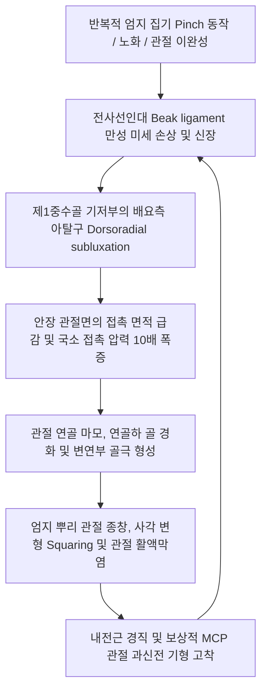

# 🖐️ [[CMC 골관절염]] (First Carpometacarpal Osteoarthritis / Rhizarthrosis)

> **핵심 3줄 요약 (Key Summary)**:
> - 📍 병소 부위 & 해부·병태생리: 엄지손가락 기저부의 **제1 수근중수관절(First CMC / Trapeziometacarpal, TMA joint)**에서 대능형골(Trapezium)과 제1중수골 기저부 사이의 안장 관절(Saddle joint) 연골 마모, 전사선인대(AOL / Beak ligament)의 이완 및 중수골 기저부의 배요측 아탈구로 발생하는 퇴행성 관절 질환.
> - 🚩 전형적 임상 양상: 병뚜껑 돌리기, 열쇠 돌리기, 집게 집기(Pinch) 시 무지 기저부의 날카로운 통증, 관절 비대로 인한 엄지 뿌리의 각진 사각 변형(Squaring of hand), 파지력 및 핀치력의 현저한 감소.
> - 🛠️ 핵심 감별 검사 & 한·양방 다각적 치료 전략: Grind Test(연삭 검사), 휠 견인 검사, Eaton-Littler X-ray 병기 분류. [[양계]](LI5)·[[태연]](LU9)·[[합곡]](LI4) 관절강 전침, 소염·신바로 약침 수력박리, 수근중수관절 견인 추나 및 무지 대립 안정화 부목(Thumb spica splint).
> - ⚠️ 응급 의뢰 레드플래그: 제1중수골 기저부의 완전 탈구, 관절 간격의 완전 소실 및 극심한 골 파괴로 인한 핀치 불능(Eaton Stage 4) $\rightarrow$ 대능형골 절제술(Trapeziectomy) 또는 관절 성형술 정형외과 의뢰.

---

## 📌 목차
1. [질환 개요 & 해부학적 병태생리](#1-질환-개요--해부학적-병태생리)
2. [병태생리 메커니즘 & 생체역학적 악순환 네트워크](#2-병태생리-메커니즘--생체역학적-악순환-네트워크)
3. [임상 증상 & 이학적 검사(Physical Exam) 알고리즘](#3-임상-증상--이학적-검사physical-exam-알고리즘)
4. [감별 진단 매트릭스 (Differential Diagnosis)](#4-감별-진단-매트릭스-differential-diagnosis)
5. [한의 통합 치료 프로토콜 (침·약침·추나·한약)](#5-한의-통합-치료-프로토콜-침약침추나한약)
6. [양방 치료 & 병용·의뢰 기준 (Conventional Treatment & Referral)](#6-양방-치료--병용의뢰-기준-conventional-treatment--referral)
7. [재활 운동 & 생활습관 티칭 가이드](#7-재활-운동--생활습관-티칭-가이드)
8. [💡 사용자 진료실 핵심 필기 & 임상 노하우 (Melt-In 잔여 심화 집약)](#8--사용자-진료실-핵심-필기--임상-노하우-melt-in-잔여-심화-집약)
9. [출처 및 학술 참고 문헌 (References)](#9-출처-및-학술-참고-문헌-references)

---

## 1. 질환 개요 & 해부학적 병태생리

![[CMC골관절염_01_Xray_수근중수관절아탈구.png|480]]
> [그림 1: ① 질환/병태생리 영상 — 제1 수근중수관절(CMC) 골관절염 X-ray] 대능형골-제1중수골 관절강 협착, 연골하 골경화증 및 제1중수골 기저부의 배요측(Dorsoradial) 아탈구 소견.

* **질환 정의 및 개념**:
  * 제1 수근중수관절 골관절염(First CMC Joint Osteoarthritis), 일명 **근위무지관절염(Rhizarthrosis)**은 엄지손가락 기저부 안장 관절의 퇴행성 마모로 인해 통증, 변형 및 기능 장애를 초래하는 상지 최다빈도 골관절염 중 하나이다.
  * 손 전체 기능의 40~50%를 담당하는 엄지의 대립(Opposition)과 집기(Pinch) 동작의 핵심 축이 무너지므로 일상생활 동작(ADL)에 막대한 지장을 초래한다([Ulusoy T, 2026](https://pubmed.ncbi.nlm.nih.gov/41500919/)).
* **해부학적 특수성과 인대 복합체**:
  * **안장 관절(Saddle / Sellar Joint)**:
    * 대능형골(Trapezium)의 오목-볼록 안장면과 제1중수골(First Metacarpal) 기저부가 맞물려 굴곡-신전, 내전-외전, 축 회전이 결합된 자유로운 3차원 운동을 허용하는 대신 본질적으로 역학적 불안정성을 내포함.
  * **전사선인대(Anterior Oblique Ligament, AOL / Beak Ligament)**:
    * 제1중수골 기저부의 배요측 아탈구를 막아주는 가장 중요한 1차 안정화 인대. 이 부척인대(Beak ligament)가 이완·파열되면서 관절염의 도미노 현상이 시작됨([Baljer B, 2026](https://pubmed.ncbi.nlm.nih.gov/42206643/)).
* **역학 및 유병 특성**:
  * 50세 이상 여성의 1/3 이상에서 방사선학적 소견이 관찰되며, 남성에 비해 여성에서 4~6배 호발 (에스트로겐 수용체 변화 및 여성 특유의 관절 이완성).

---

## 2. 병태생리 메커니즘 & 생체역학적 악순환 네트워크

![[수근부_신전건_구획_해부도해_Wrist_extensor_compartments.png|500]]
> [그림 2: ② 관련 해부 구조물 — 엄지 기저부 및 제1신전구획 해부도] CMC 관절 주변을 주행하는 단무지신근, 장무지외전근 및 장모지굴근과의 생체역학적 상호작용.

### 1) 접촉 생체역학과 압력 증폭 기전
* 집게손가락과 엄지로 가볍게 1kg의 힘으로 물건을 집을 때, 제1 CMC 관절면에 전달되는 생체역학적 압박력은 지레 작용에 의해 **12~13kg(12배 이상)**으로 폭증한다.
* 인대 이완으로 중수골이 외측으로 밀려나면 관절 접촉 면적이 정상의 1/3로 줄어들어 단위 면적당 전단 압력이 30배 이상으로 치솟아 연골 마모가 가속화된다.

---

## 3. 임상 증상 & 이학적 검사(Physical Exam) 알고리즘

![[cozens_test_step2_wrist_resistance.jpg|480]]
> [그림 3: ③ 이학적 검사 — 엄지 기저부 관절 부하 및 저항 검사] 무지 기저부 CMC 관절면에 축성 압박과 회전력을 가하여 연골 마찰통과 불안정성을 유발하는 검사.

### 1) 주요 임상 증상
* **활동 시 악화되는 기저부 통증**:
  * 병뚜껑이나 문고리 돌리기, 열쇠 돌리기, 가위질, 펜 쥐기 시 엄지 뿌리(Snuff box 원위 전방)의 찌릿한 격통.
* **사각 변형 (Squaring of Hand)**:
  * 제1중수골 기저부가 바깥으로 튀어나오고 골극이 비후되어 엄지 뿌리가 사각형 모양으로 각이 지고 튀어나옴.
* **진행성 내전 구축(Adduction contracture)**:
  * 엄지가 손바닥 안쪽으로 오그라들고 첫 번째 물갈퀴 공간(First web space)이 좁아져 큰 물건을 쥐지 못함.

### 2) 단계별 이학적 검사법
* **1단계: CMC 연삭 검사 (Grind Test)**:
  * 검사자가 환자의 제1중수골을 잡고 대능형골을 향해 축성 압박(Axial compression)을 가하면서 비틀며 회전 $\rightarrow$ 마찰음(Crepitus)과 통증 발생 시 양성.
* **2단계: 휠 견인 검사 (Traction-Shift Test)**:
  * 중수골 기저부를 잡고 전후로 흔들었을 때 인대 이완으로 인한 관절 유동성과 아탈구 평가.
* **3단계: 단순 방사선 Eaton-Littler 병기 판정**:
  * 1기: 관절 간격 정상, 경미한 인대 이완.
  * 2기: 관절 간격 협소화, 2mm 미만 골극.
  * 3기: 현저한 관절강 협착, 2mm 초과 골극, 연골하 경화.
  * 4기: 인접 STT(주상-대능형-소능형) 관절까지 파괴된 범수근관절염.

---

## 4. 감별 진단 매트릭스 (Differential Diagnosis)

| 감별 질환 | 호발 병소 및 조직 | 주요 통증 유발 동작 | 특징적 감별 포인트 |
| :--- | :--- | :--- | :--- |
| **[[CMC 골관절염]]** | 제1 수근중수관절(엄지 기저부) | 열쇠 돌리기, 병뚜껑 따기, 핀치 동작 | **Grind Test(+), 사각 변형**, X-ray 골극 |
| **[[드퀘르벵 증후군]]** | 요골 경상돌기(제1신전구획 건초) | 엄지 척측 편위, 아기 안아 올리기 | **[[핀켈스타인 검사]](+)**, 건 주행로 압통 |
| **[[수근관 증후군]]** | 수근관 내부 ([[정중신경]]) | 야간 손끝 저림, 1~3지 감각 이상 | Phalen(+), Tinel(+), 관절 운동통 없음 |
| **주상골 골절 / 불유합** | 해부학적 코담배갑(Snuff box) 바닥 | 손 짚고 넘어짐 후 지속통 | Snuff box 직상 압통, X-ray 골절선 |
| **방아쇠 수지 (Trigger Thumb)** | 무지 MCP 관절 장측 A1 도르래 | 엄지 굽혔다 펼 때 튕김 | A1 풀리 압통 결절, 탄발음(Clicking) |

---

## 5. 한의 통합 치료 프로토콜 (침·약침·추나·한약)

![[수부질환_05_수부침치료실사_수지침.jpg|480]]
> [그림 4: ④ 한의 치료 술기 실사 — 무지 기저부 침구 치료] 양계, 태연, 합곡 등 제1 CMC 관절 주변 경혈에 자침하여 관절낭 내 활액막 부종을 제거하고 인대 장력을 복원하는 술기.

### 1) 침구 치료 & 관절강 전침 요법
* **핵심 선혈 혈위**:
  * **국소 관절 혈위**: 제1 CMC 관절 틈새(양계혈 전하방 대능형골 관절면), [[양계]](LI5), [[태연]](LU9), [[어제]](LU10), [[합곡]](LI4).
  * **근막 혈위**: [[수삼리]](LI10), [[곡지]](LI11), [[열결]](LU7).
* **2Hz 관절강 전침**:
  * 제1 CMC 관절 전후 관절낭에 0.25×30mm 침을 자입하고 2Hz 저주파 통전을 15분간 시행하여 염증성 사이토카인(IL-1beta, TNF-alpha)을 억제하고 관절액 순환을 유도.

### 2) 약침 요법 (Pharmacopuncture)
* **제제 처방**:
  * 급성 활액막염: **황련해독탕 약침** 또는 **중성어혈 약침** 0.3~0.5cc 관절낭 내 주입.
  * 만성 연골 퇴행 및 인대 이완: **신바로 약침** 또는 **자하거 약침** 0.5~1.0cc를 AOL(부척인대) 부착부에 주입하여 연골 파괴 억제 및 인대 강화 유도([Kimura H, 2026](https://pubmed.ncbi.nlm.nih.gov/42647349/)).

### 3) CMC 관절 신연 및 외전 추나
* **관절 신연-외전 교정 수기**:
  * 시술자가 한 손으로 대능형골을 단단히 고정하고 다른 손으로 제1중수골을 잡고 장축 방향으로 부드럽게 견인하면서, 배요측으로 아탈구된 중수골 기저부를 장측(Palmar)으로 밀어 넣는 관절 정복 가동술 적용.

### 4) 한약물 요법 (변증 시치)
* **간신휴허·골비형(骨痺型)**: 만성 골극 형성, 조조강직, 고령 $\rightarrow$ [[독활기생탕]](獨活寄生湯), [[삼기음]](三痺飮).
* **기체어혈형(氣滯瘀血型)**: 집게 동작 시 극심한 자통 $\rightarrow$ [[당귀수산]](當歸鬚散), [[활혈통기산]](活血通氣散).
* **풍한습비형(風寒濕痺型)**: 찬물에 닿으면 관절 쑤심 $\rightarrow$ [[대강활탕]](大羌活湯), [[오적산]](五積散).

---

## 6. 양방 치료 & 병용·의뢰 기준 (Conventional Treatment & Referral)

* **보존적 치료 및 스플린트**:
  * **무지 스피카 부목 (Thumb Spica Splint)**: CMC 관절과 MCP 관절을 30도 외전위로 고정하여 관절 부하를 경감(야간 착용 및 작업 시 착용).
  * 국소 NSAIDs 겔 도포 및 경구 소염진통제 단기 투여.
* **관절강 내 주사 요법**:
  * 초음파 유도하 스테로이드 주사(CSI) 또는 히알루론산(HA) 주사가 일시적 통증 완화를 위해 시행되나, 반복적인 스테로이드 주입은 관절낭 지지 인대를 더욱 약화시킬 수 있음.
* **수술적 치료 적응증 (Surgical Indication)**:
  * 보존적 치료에 반응하지 않는 심한 3~4기 관절염 환자 대상:
    * **대능형골 절제술 및 건 이전 건성형술 (Trapeziectomy with LRTI)**: 대능형골을 제거하고 FCR 건 일부를 채취하여 빈 공간을 채워주고 인대를 재건하는 표준 술식.
    * **인공관절 치환술 (Total Joint Arthroplasty)** 또는 **관절 유합술(Arthrodesis)**([Baljer B, 2026](https://pubmed.ncbi.nlm.nih.gov/42206643/)).
* **정형외과 의뢰 기준**:
  * 핀치력 완전 상실 및 방사선상 대능형골 완전 붕괴(Eaton 4기) 소견 시.

---

## 7. 재활 운동 & 생활습관 티칭 가이드

![[CMC골관절염_07_무지대립스플린트.png|450]]
> [그림 5: ⑤ 재활 보조기 — 무지 수근중수관절 고정 스플린트(Thumb Spica Splint)] 제1 CMC 관절의 배측 탈구를 방지하고 집기 동작 시 관절면 부하를 분산시키는 보호대.

![[손목과사용증후군_07_수부스트레칭.jpg|480]]
> [그림 6: ⑥ 재활 운동 — 무지 외재근 및 내재근 협응 운동] 엄지손가락을 O자 모양(C-Grip)으로 둥글게 유지하는 근력 강화 운동.

### 1) 엄지 첫째 물갈퀴 공간(First Web Space) 유지 운동
* **C자형 쥐기 훈련 (C-Grip Exercise)**:
  * 캔이나 컵을 쥘 때 엄지와 검지 끝이 납작하게 눌리지 않고, 둥근 C자 모양을 유지하도록 의식적으로 훈련하여 CMC 관절에 걸리는 전단력을 완화.
* **제1 배측 골간근(FDI) 및 무지외전근 강화**:
  * 고무줄을 엄지와 검지에 걸고 바깥쪽으로 벌리는 등척성 외전 운동(5초 유지, 15회).

### 2) 일상생활 기구 수정 (Joint Protection Techniques)
* **손잡이가 굵은 기구 사용**: 볼펜, 식칼, 프라이팬 손잡이에 완충 실리콘 패드를 덧대어 핀치 부하 경감.
* **자동 오프너 활용**: 병뚜껑이나 캔을 맨손으로 비틀어 따지 말고 전동/지렛대 오프너 사용 티칭.

---

## 8. 💡 사용자 진료실 핵심 필기 & 임상 노하우 (Melt-In 잔여 심화 집약)

> [!TIP] **진료실 임상 진단 & 치료 노하우**
> 1. **드퀘르벵 건초염과의 흔한 오진 감별**:
>    - 엄지 뿌리가 아프다고 오면 10명 중 절반은 드퀘르벵(제1신전구획)으로 오진되어 스테로이드 주사를 맞고 온다. 엄지 손가락을 쥐고 흔드는 핀켈스타인이 아니라, 엄지 중수골을 뼈 안쪽으로 꾹 누르며 비틀어 돌리는 **Grind Test**를 해보라. 뼈가 갈리는 느낌과 함께 비명을 지르면 100% CMC 관절염이다([Ulusoy T, 2026](https://pubmed.ncbi.nlm.nih.gov/41500919/)).
> 2. **제1 CMC 관절 자침 시의 '틈새 진입' 노하우**:
>    - CMC 관절은 골극이 자라나 관절강 틈새를 찾기 어렵다. 환자에게 엄지를 손바닥 안쪽으로 가볍게 내전시키게 한 후, 검사자의 손톱으로 대능형골과 중수골 기저부 사이의 패인 홈을 촉지하고 그 틈새를 향해 0.25mm 침을 45도 각도로 부드럽게 미끄러뜨리듯 자입해야 관절강 내로 정확히 진입한다.
> 3. **무지 내전근(Adductor Pollicis) 단축 이완의 극적 효과**:
>    - CMC 관절염 환자는 엄지가 안으로 말려 들어가는 내전근(합곡혈 부위 근육)의 극심한 단축이 동반된다. 합곡혈 부위 무지내전근 뭉침을 약침과 침으로 풀어주면 엄지 외전 가동범위가 즉시 넓어지며 집기 동작 시의 관절 압박 통증이 절반으로 줄어든다.

---

## 9. 출처 및 학술 참고 문헌 (References)

1. Ulusoy T, et al. Predictive factors affecting functional outcomes following conservative treatment in trapeziometacarpal osteoarthritis: A systematic review. *J Hand Ther*. 2026;39(3):345-356. [PMID: 41500919](https://pubmed.ncbi.nlm.nih.gov/41500919/)
   - [연구 요약]: 제1 수근중수관절(CMC) 골관절염 환자에서 보존적 치료(스플린트, 물리치료, 운동 요법) 후 기능적 회복에 영향을 미치는 생체역학적 예측 인자 체계적 문헌고찰.
2. Baljer B, et al. Surgery for thumb (trapeziometacarpal joint) osteoarthritis. *Cochrane Database Syst Rev*. 2026;5(5):CD004631. [PMID: 42206643](https://pubmed.ncbi.nlm.nih.gov/42206643/)
   - [연구 요약]: 무지 수근중수관절염에 대한 다양한 수술적 기법(대능형골 절제술, 인대 재건술, 인공관절 치환술)의 장단기 임상 효과와 합병증을 분석한 코크란 메타분석.
3. Kimura H, et al. Common Fascial Abnormalities in Five Thumb Pain Conditions: A Fifteen-Point Ultrasound-Guided Fascia Hydrorelease Clinical Protocol. *J Funct Morphol Kinesiol*. 2026;11(3):142. [PMID: 42647349](https://pubmed.ncbi.nlm.nih.gov/42647349/)
   - [연구 요약]: CMC 관절염을 포함한 5대 무지 통증 질환에서 초음파 유도하 근막 수력박리술(Fascia Hydrorelease)의 임상적 유효성 및 인대-근막 유착 완화 기전 검증.
