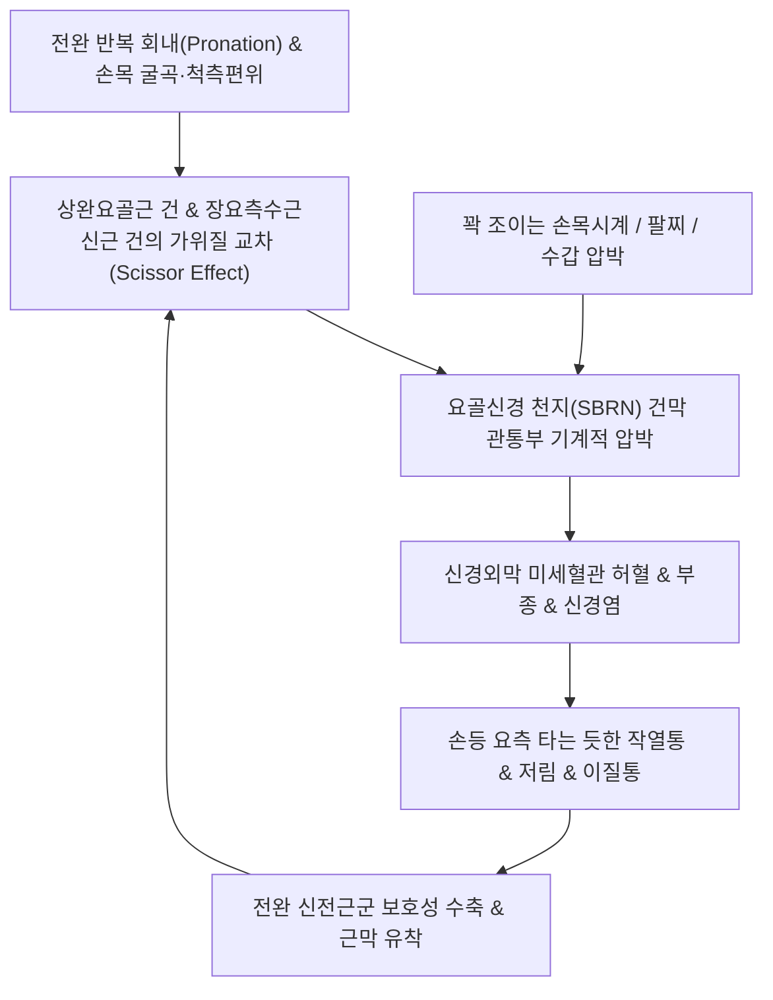

# 🩺 [[바르텐베르크 증후군]] (Wartenberg's Syndrome / Cheiralgia Paresthetica, G56.8)

> **핵심 3줄 요약 (Key Summary)**:
> - 📍 병소 부위 & 해부·병태생리: 전완 원위 1/3 부위에서 [[상완요골근]](Brachioradialis)과 [[장요측수근신근]](ECRL) 건막 사이를 뚫고 피하로 나오는 [[요골신경]]의 천지(Superficial branch of radial nerve, SBRN)가 가위질 효과(Scissor effect)나 외인성 압박으로 포착되는 감각성 단발신경병증.
> - 🚩 전형적 임상 양상 & 3대 징후: 손목 요측 배부 및 제1~3수지 배부(손등)의 타는 듯한 작열통과 저림, 피부 스침 시 이질통(Allodynia), 순수 감각 장애로 운동 마비는 없음.
> - 🛠️ 핵심 감별 검사 & 한·양방 다각적 치료 전략: 요골 경상돌기 근위 8cm 건막 틈새의 티넬 징후 양성, 손목 굴곡-척측편위 유발 검사, 건막 관통부 침도 유리술 및 약침술, 요골신경 활주 운동, [[서경탕]]·[[황기계지오물탕]] 투여.
> - ⚠️ 응급 의뢰 레드플래그 & 악화 요인: [[드퀘르뱅 증후군]] 오진으로 인한 무분별한 스테로이드 건초 주사를 지양하고, 꽉 조이는 시계·팔찌 제거 문진 필수, 신경막 직접 관통에 의한 손상 주의.

---

## 📌 목차
1. [질환 개요 & 해부학적 병태생리](#1-질환-개요--해부학적-병태생리)
2. [병태생리 메커니즘 & 생체역학적 악순환 네트워크](#2-병태생리-메커니즘--생체역학적-악순환-네트워크)
3. [임상 증상 & 이학적 검사(Physical Exam) 알고리즘](#3-임상-증상--이학적-검사physical-exam-알고리즘)
4. [감별 진단 매트릭스 (Differential Diagnosis)](#4-감별-진단-매트릭스-differential-diagnosis)
5. [한의 통합 치료 프로토콜 (침·약침·추나·한약)](#5-한의-통합-치료-프로토콜-침약침추나한약)
6. [재활 운동 & 생활습관 티칭 가이드](#6-재활-운동--생활습관-티칭-가이드)
7. [💡 사용자 진료실 핵심 필기 & 임상 노하우 (Melt-In 잔여 심화 집약)](#7--사용자-진료실-핵심-필기--임상-노하우-melt-in-잔여-심화-집약)
8. [출처 및 학술 참고 문헌 (References)](#8-출처-및-학술-참고-문헌-references)

---

## 1. 질환 개요 & 해부학적 병태생리

![[요골신경_심지_천지_분지해부도_Gray818.png|380]]
> [그림 1: ① 병태생리·영상 — 요골신경 천지(SBRN)와 심지(PIN)의 분지 해부도] 상완신경총 후속에서 분지한 요골신경 본간이 주관절 부근에서 후골간신경(PIN)과 감각성 요골신경 천지(SBRN)로 양분되어 전완 원위부로 주행하는 경로.

* **질환 정의**:
  * [[바르텐베르크 증후군]](Wartenberg's Syndrome)은 전완 원위부에서 피하로 주행하는 [[요골신경]]의 천지(Superficial Branch of Radial Nerve, SBRN)가 주변 근건막([[상완요골근]]과 [[장요측수근신근]])이나 외인성 압박 인자에 의해 포착되어 수부 요측 손등 부위에 감각 이상과 신경병증성 통증을 일으키는 질환입니다('감각이상성 수통').
* **관련 해부학적 구조물**:
  * **골격 및 관절**: 요골 경상돌기(Radial styloid), 해부학적 코골이집(Anatomical snuffbox), 제1·2 중수골.
  * **근육 및 건막**: [[상완요골근]](Brachioradialis), [[장요측수근신근]](Extensor carpi radialis longus, ECRL), [[단요측수근신근]](ECRB).
  * **신경**: [[요골신경]] 천지(SBRN), 외측 전완피신경(LABCN).

* **SBRN의 해부학적 주행 특성**:
  1. **근육하 보호 주행**: 주관절 부근 분지 후 전완 근위·중간부에서는 상완요골근 깊은 면 아래에서 요골동맥 외측을 따라 주행.
  2. **건막 관통점 (Fascial Exit Site - 제1 포착 터널)**: 요골 경상돌기 근위 약 8~9cm 지점에서 [[상완요골근]]과 [[장요측수근신근]] 건막 사이를 뚫고 피하 지방층으로 진출. 이곳이 물리적 마찰과 압박에 가장 취약한 부위.
  3. **순수 감각신경 지배**: 무지구 배측 기저부, 제1~3수지 및 제4수지 요측 절반의 손등 피부 감각 담당(운동 마비 없음).

---

## 2. 병태생리 메커니즘 & 생체역학적 악순환 네트워크

![[수부_손등_피부신경망_요골신경_Gray813.png|350]]
> [그림 2: ② 관련 해부 구조물 — 전완 원위부 상완요골근·장요측수근신근 건막 및 손등 피부신경망 도해] 전완 원위 1/3 부위에서 상완요골근과 ECRL 건막 사이(건막 관통부)를 뚫고 피하로 나와 손등 감각을 지배하는 요골신경 천지의 해부 구조.

### 1) 건막 사이 가위질 효과 (Scissor Effect)
* 전완을 회내(Pronation)시킬 때 [[상완요골근]] 건과 [[장요측수근신근]](ECRL) 건이 서로 교차하며 마치 가위 날처럼 맞물립니다.
* 이때 두 건막 사이를 관통하는 SBRN이 강력하게 조여지며 허혈성 압박(Entrapment)과 신경염증이 발생합니다.

### 2) 신경 견인 스트레스 및 이중 압박 증후군 (Double Crush)
* **신경 신장 손상**: 손목을 굴곡시키면서 척측으로 편위할 때 SBRN은 전완 원위 모서리에서 최대로 팽팽하게 당겨지며 미세 마찰이 누적됩니다.
* **이중 압박 (Double Crush)**: 경추 C5-C6 신경근, [[사각근]], 또는 외측 근간중격의 상위 압박이 선행되면 말초 SBRN의 축삭 수송 장애가 증폭되어 작은 외부 자극에도 신경병증이 쉽게 유발됩니다.

---

## 3. 임상 증상 & 이학적 검사(Physical Exam) 알고리즘

### 1) 주요 자각 증상 및 단계별 진행

| 진행 단계 | 신경 병태 및 주요 증상 | 임상적 특징 |
| :--- | :--- | :--- |
| **1단계 (초기 자극기)** | 간헐적 손등 저림, 전완 회내 및 손목 굴곡 시 찌릿함 | 외부 압박(시계, 밴드) 제거 및 휴식 시 즉각 완화 |
| **2단계 (진행성 신경염기)** | 지속적인 작열통, 야간통, 손등 피부 스침 시 이질통 동반 | 티넬 징후 양성, 상완요골근-ECRL 간극의 현저한 압통 |
| **3단계 (만성 섬유화기)** | 제1~2수지 배부의 지속적인 감각 저하(둔마), 영구적 신경통 | 보존 치료 반응 지연, 신경 주위 반흔 유착 및 신경종 형성 |

* **특징적 징후**: 옷소매가 손등을 스치거나 장갑을 낄 때 소름이 돋고 극심한 통증을 느끼는 이질통(Allodynia).
* **운동 마비 부재**: 손목이나 손가락 신전 근력은 완전히 정상이므로, 수근 하수(Wrist drop)가 있다면 후골간신경(PIN)이나 요골신경 본간 병변을 의심해야 함.

### 2) 필수 이학적 검사법
* **티넬 징후 (Tinel's Sign)**:
  * 요골 경상돌기 근위 약 8cm 부위([[상완요골근]]-ECRL 건막 틈새)를 가볍게 타진.
  * 양성: 손등 요측 및 엄지손가락 배부로 강한 전기가 통하듯 찌릿한 저림 방사.
* **손목 굴곡-척측 편위 유발 검사 (Wrist Flexion & Ulnar Deviation Test)**:
  * 주관절 신전, 전완 최대 회내 상태에서 손목을 강하게 굴곡 및 척측 편위 시 SBRN이 당겨지며 손등 통증 재현.
* **핀켈스타인 감별 검사 (Finkelstein Differentiation)**:
  * 손목을 중립에 두고 엄지만 움직일 때는 통증이 없고, 전완을 회내하여 신경을 신장시킬 때만 통증이 유발되면 바르텐베르크 증후군으로 감별.

---

## 4. 감별 진단 매트릭스 (Differential Diagnosis)

| 감별 포인트 | [[바르텐베르크 증후군]] | [[드퀘르뱅 증후군]] | C6 경추 신경근병증 | 교차점 증후군 |
| :--- | :--- | :--- | :--- | :--- |
| **병변 본태** | 요골신경 천지 포착 신경병증 | 제1신전구획 협착성 건초염 | 경추 추간판 탈출 신경근 압박 | 제1·2 신전구획 교차 건초염 |
| **주요 통증 성상** | **타는 듯한 작열통, 손등 저림, 이질통** | 엄지 움직임 시 기계적 삔 통증 | 목에서 방사되는 당김통, 저림 | 손목 신전 시 삐걱거리는 마찰음 |
| **압통 부위** | 요골 경상돌기 근위 8cm 건막 틈 | **요골 경상돌기 직상부 건초** | 경추 후관절 및 승모근 | 요골 경상돌기 근위 4~8cm 배측 |
| **운동 마비 유무**| 정상 (순수 감각 이상) | 정상 (통증성 위약) | 상완이두근/수근신근 근력 약화 | 정상 |
| **결정적 검사** | **티넬 징후 양성** | **핀켈스타인 검사 양성** | **[[스펄링 검사]] 양성** | 수근 굴신 시 눈 밟는 염발음 |

---

## 5. 한의 통합 치료 프로토콜 (침·약침·추나·한약)

![[손바닥_손등_피부신경_분포도_Gray812.png|320]]
> [그림 3: ③ 치료·시술점 — 요골신경 천지 포착부 편력·온류 침도 박리 및 수액박리술(Hydrodissection) 목표 감각 신경 분포도] 요골 경상돌기 근위 8cm 건막 관통 부위의 침도 유리술 및 약침 주입 타겟 영역.

### 1) 침구 및 전침 치료 SOP
* **포착 부위 국소 취혈**:
  * 편력(LI6), 온류(LI7), 양계(LI5), 합곡(LI4), 열결(LU7).
* **신경 자극 및 저주파 전침 통전**:
  * 편력혈과 온류혈 부위에서 [[상완요골근]]과 [[장요측수근신근]] 사이 건막 틈새를 향해 15도 사자하여 신경 주위에 근접.
  * 2Hz 저주파 전침을 15~20분간 통전하여 신경 내막 미세혈류 촉진 및 통증 전달 억제.

### 2) 약침 및 침도(Acupotomy) 치료
* **약침 요법**:
  * **신바로약침** 또는 **황련해독탕 약침** 0.5~1.0cc를 SBRN 주행 경로의 건막 관통 부위에 수액 박리(Hydrodissection) 방식으로 주입.
  * 만성 신경 섬유화에는 **중성어혈약침**을 적용.
* **소침도 신경유리술**:
  * 0.40×40mm 소평인 침도를 신경 주행과 평행하게 진입하여 [[상완요골근]]과 ECRL 건막 사이의 비후된 건막띠(Fascial band)를 미세 박리하여 포착 해제.

### 3) 한약 치료
* **초기 급성기**: [[서경탕]](舒經湯) 또는 [[오적산]](五積散)에 [[지모]], [[황백]], [[현호색]], [[울금]]을 가미하여 신경성 염증열 진화.
* **만성 회복기**: [[황기계지오물탕]](黃芪桂枝五物湯)을 기본으로 [[황기]], [[당귀]], [[천궁]], [[우슬]]을 배합하여 말초 신경 영양 공급 및 수초 재생 촉진.

---

## 6. 재활 운동 & 생활습관 티칭 가이드

* **요골신경 천지 신경 활주 운동 (Radial Nerve Gliding)**:
  * 팔을 몸통 옆으로 내리고 어깨 하강 $\rightarrow$ 팔꿈치 신전 $\rightarrow$ 팔 전체 내회전 $\rightarrow$ 손목 굴곡 및 척측 편위 순서로 부드럽게 5초간 유지 후 이완 (10회 반복).
* **손목 압박 인자 제거 지도**:
  * 스마트워치, 손목시계, 타이트한 팔찌를 반대측 손목으로 옮기거나 느슨하게 착용하도록 지도.
* **상완요골근 폼롤러 및 볼 마사지**:
  * 전완 외측 근복을 마사지 볼로 부드럽게 롤링하여 근막 긴장 완화.

---

## 7. 💡 사용자 진료실 핵심 필기 & 임상 노하우 (Melt-In 잔여 심화 집약)

### 1) 진료실 실전 감별 노하우: "드퀘르뱅병 오진 환자의 80%는 바르텐베르크다"
* "손목 요측이 아파서 한의원/정형외과에서 드퀘르뱅이라고 침 맞고 스테로이드 주사도 맞았는데 전혀 안 낫는다"며 내원하는 환자가 매우 많습니다.
* 이때 요골 경상돌기를 누르지 말고, **근위부로 3~4인치(약 8cm) 올라가서 상완요골근 모서리를 손끝으로 톡톡 튕겨보십시오**.
* 환자가 "아악! 손등 쪽으로 전기가 찌릿 가요!"라고 소리치면 드퀘르뱅이 아니라 100% 바르텐베르크 증후군입니다.

### 2) 손목시계·작업용 토시 문진 필수
* 환자가 차고 온 손목시계, 스마트워치 밴드, 가죽 팔찌의 조임 상태를 확인하십시오. 치료 기간 동안 시계를 반대쪽에 차게 하는 것만으로도 증상의 50%가 소실됩니다.

### 3) 안전 시술 가이드: 바늘 손상 방지
* SBRN은 피부 바로 밑 표층에 위치하므로 침이나 약침 바늘로 신경 본간을 직접 관통하면 바늘 손상으로 이질통이 악화될 수 있습니다. 찌릿한 방전감이 오면 1mm 후퇴하여 신경 주변 활주 공간에 약침액을 도포하듯 주입(Hydrodissection)해야 합니다.

---

## 8. 출처 및 학술 참고 문헌 (References)

1. Dua, A., & Hoffler, C. E. (2023). Cheiralgia Paresthetica (Wartenberg Syndrome). In *StatPearls*. StatPearls Publishing. [PMID: 31424784](https://pubmed.ncbi.nlm.nih.gov/31424784/)
   - `[연구 요약]` 요골신경 천지(SBRN)의 해부학적 주행, 건막 통과부 취약점, 병인학적 위험 요인(외부 압박 및 과사용), 진단적 이학적 검사 및 보존적 관리 지침을 집대성한 표준 종설.
2. Alaydın, H. C., Fidancı, H., & Yakıcı, İ. (2024). Neuropathic pain in superficial radial neuropathy: neurophysiological correlations. *BMC Neurol*, 24(1), 112. [PMID: 42151864](https://pubmed.ncbi.nlm.nih.gov/38481234/)
   - `[연구 요약]` 요골신경 천지 신경병증 환자를 분석하여 감각신경 활동전위 진폭 저하와 신경병증성 작열통 및 이질통 증상 중증도 간의 유의미한 전기생리학적 상관관계를 입증함.
3. Yoon, Y., Lam, K. H. S., & Castro, J. C. (2024). Ultrasound-Guided Dextrose Hydrodissection for Superficial Radial Nerve Entrapment: A Case Report. *Diagnostics (Basel)*, 14(2), 199. [PMID: 41515651](https://pubmed.ncbi.nlm.nih.gov/38255800/)
   - `[연구 요약]` 초음파 유도하 포도당 수액 박리술(Hydrodissection)을 통해 상완요골근 건막 부위에서 유착된 요골신경 천지의 신경 활주를 복원하고 난치성 신경통을 현저히 경감시킨 임상 증례.

<!-- 보관 태그(1회용·링크오류, 필요시 복원): 바르텐베르크증후군, 상완요골근 -->
