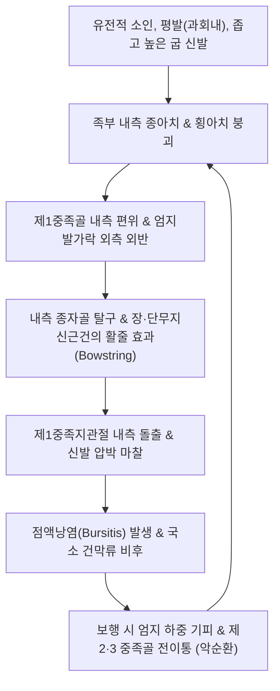

# 🩺 건막류

> **핵심 3줄 요약 (Key Summary)**:
> - 📍 **병소 부위 & 해부·병태생리**: 제1중족지관절([[1st MTP Joint]]) 부위에서 제1중족골이 내측으로 편위되고 엄지발가락이 외측으로 꺾이면서([[무지외반증]]), 돌출된 골융기 상방의 건막낭(점액낭, Bursa)이 신발 마찰로 인해 비후·염증화된 만성 병변(**Bunion**). *(※ 상지 손목의 건막성 낭종인 [[결절종]]과의 감별 요망)*.
> - 🚩 **전형적 임상 양상**: 엄지발가락 안쪽 관절의 돌출, 보행 시 신발에 닿는 부위의 발적·작열통·부종, 보행 시 제2·3 중족골두 하방의 전족부 통증([[중족골통]]), 제2족지 망치족 변형.
> - 🛠️ **핵심 검사 & 치료 전략**: 무지외반각([[HVA]]) 및 중족골간각([[IMA]]) X-ray 측정; [[태백혈]](SP3), [[대도혈]](SP2), [[공손혈]](SP4) 자침 및 소염약침; 무지외전근 강화 운동 및 족부 횡아치 교정 추나; 발볼 넓은 신발과 발가락 실리콘 패드 티칭.
> - ⚠️ **응급 의뢰 레드플래그**: 당뇨병 환자에서 건막류 부위 피부 궤양 형성, 화농성 삼출물 및 골 노출(당뇨발 악화 및 골수염); 급성 발열과 함께 관절 전체가 붉게 붓는 급성 통풍성 관절염 발작.

---

## 📌 목차
1. [질환 개요 & 해부학적 병태생리](#1-질환-개요--해부학적-병태생리)
2. [병태생리 메커니즘 & 생체역학적 악순환 네트워크](#2-병태생리-메커니즘--생체역학적-악순환-네트워크)
3. [임상 증상 & 이학적 검사(Physical Exam) 알고리즘](#3-임상-증상--이학적-검사physical-exam-알고리즘)
4. [감별 진단 매트릭스 (Differential Diagnosis)](#4-감별-진단-매트릭스-differential-diagnosis)
5. [한의 통합 치료 프로토콜 (침·약침·추나·한약)](#5-한의-통합-치료-프로토콜-침약침추나한약)
6. [양방 치료 & 병용·의뢰 기준 (Conventional Treatment & Referral)](#6-양방-치료--병용의뢰-기준-conventional-treatment--referral)
7. [재활 운동 & 생활습관 티칭 가이드](#7-재활-운동--생활습관-티칭-가이드)
8. [💡 사용자 진료실 핵심 필기 & 임상 노하우 (Melt-In 잔여 심화 집약)](#8--사용자-진료실-핵심-필기--임상-노하우-melt-in-잔여-심화-집약)
9. [출처 및 학술 참고 문헌 (References)](#9-출처-및-학술-참고-문헌-references)

---

## 1. 질환 개요 & 해부학적 병태생리

### 1) 해부학적 구조와 건막류(Bunion)의 실체
* **제1중족지관절(1st Metatarsophalangeal Joint)**:
  * 인체 보행 주기 중 발가락 밀기(Toe-off) 단계에서 체중의 수 배에 달하는 수직 부하와 전단력을 지탱하는 핵심 관절.
  * 중족골두 하방에 2개의 종자골(내측/외측 종자골, Sesamoids)이 활차 역할을 하며 단무지굴근(Flexor hallucis brevis) 건 속에 매립되어 있음.
* **건막류(Bunion)의 조직학적 정의**:
  * 제1중족골두의 내측 결절(Medial eminence) 돌출부와 이를 덮고 있는 **외막성 점액낭(Adventitious bursa)**이 반복적인 기계적 마찰과 압박을 받아 섬유화되고 비후(Thickening)된 염증성 융기부.
  * 단순한 뼈의 과증식이 아니라, 뼈의 정렬 이상(Deformity)에 연조직 염증 반응이 중첩된 복합 병변임.
* *(볼트 분류 참고)*: 본 질환은 임상적으로 족부 질환(무지외반증에 동반된 건막류)을 정본으로 다루며, 상지 손목의 건초/건막 부위 낭종성 질환인 [[결절종]](Ganglion cyst)과의 감별 진단을 포괄함.

### 2) 방사선학적 정상치 및 변형 각도 분류
* **무지외반각 (Hallux Valgus Angle, HVA)**:
  * 제1중족골 축과 근위지골 축이 이루는 각도.
  * **정상**: 15도 미만.
  * **경도(Mild)**: 15~20도 / **중등도(Moderate)**: 20~40도 / **중증(Severe)**: 40도 이상.
* **중족골간각 (Intermetatarsal Angle, IMA)**:
  * 제1중족골 축과 제2중족골 축이 이루는 각도.
  * **정상**: 9도 미만 (10도 이상 시 제1중족골의 과도한 내반 변위).

---

![[건막류_01_임상_손목결절.jpg|450]]
> [그림 1: ① 임상 소견 — 손목 배측 결절(ganglion cyst)] 손목 등쪽에 낭성 종물이 융기된 실제 사진에 화살표로 병변을 표시했다. 표면은 정상 피부색이며 압통이 경미하고, 손목 신전 시 크기가 변하는 것이 특징이다. 출처: File:Ganglion-cyst.jpg (CC BY-SA 3.0)

![[건막류_02_임상_수지결절.jpg|450]]
> [그림 2: ① 임상 소견 — 수지 관절의 결절(ganglion)] 손가락 원위지관절 배측에 발생한 결절 실사. 점액낭종(digital mucous cyst)으로 불리며 손톱 변형을 동반할 수 있다. 출처: File:Digital ganglion of the hand.jpg (CC BY-SA 4.0)

## 2. 병태생리 메커니즘 & 생체역학적 악순환 네트워크

### 1) 족부 생체역학적 붕괴와 활줄 효과 (Bowstringing Effect)
* **발의 과회내(Overpronation)**: 보행 시 족저근막과 내측 종아치가 무너지면 제1중족골에 과도한 지면 반발력이 가해져 중족골이 안쪽으로 벌어짐(Metatarsus primus varus).
* **근육 벡터의 불균형**:
  * 엄지발가락을 안쪽으로 벌려주는 **무지외전근(Abductor hallucis)**은 족저측으로 밀려나 제 기능을 상실함.
  * 반면 외측의 **무지내전근(Adductor hallucis)**과 신전건(EHL/EDL)은 관절 중심축 외측으로 이동하여, 근육이 수축할 때마다 엄지발가락을 더 바깥쪽으로 꺾어버리는 **'활줄 효과(Bowstringing)'**를 유발함.

### 2) 제1열 기능 부전과 전이 중족골통 (Transfer Metatarsalgia)
* 제1중족지관절이 제 기능을 하지 못하면 보행 시 체중이 제2, 제3 중족골두로 비정상적으로 전이됨.
* 이로 인해 제2 중족골 하방에 굳은살(Tyloma)이 생기고 만성 중족골통([[Metatarsalgia]]) 및 제2족지 망치족(Hammer toe)이 동반됨.

---

## 3. 임상 증상 & 이학적 검사(Physical Exam) 알고리즘

### 1) 주요 임상 증상
* **제1 MTP 관절 내측 통증 및 발적**: 신발을 신을 때 돌출 부위가 닿아 욱신거리고 화끈거림.
* **보행 제한 및 피로감**: 보행 시 발가락 추진력이 저하되어 조금만 걸어도 발바닥 전체와 종아리가 쉽게 피로함.
* **관절 가동역 제한**: 엄지발가락을 위로 젖힐 때(배굴) 관절 내 마찰통 및 뻣뻣함([[강직성 무지]] 동반 가능성).
* **신경 압박 증상**: 건막류 돌출부 위를 주행하는 내측 배측 피부신경(Medial dorsal cutaneous nerve)이 압박되어 엄지발가락 내측의 저림 및 무감각 호소.

### 2) 진료실 핵심 이학적 검사 알고리즘
1. **체중 부하 시진 및 촉진**:
   * 환자를 기립시킨 상태에서 양측 발의 횡아치 붕괴 여부, 엄지발가락의 회전(Pronation) 및 제2족지 침범 여부 관찰.
   * 제1중족골 내측 융기를 압박하여 점액낭염의 파동감(Fluctuation)과 국소 압통 확인.
2. **관절 가동성 및 수동 교정 검사**:
   * 엄지발가락을 손으로 잡고 정상 정렬 위치(직선)로 수동 정복을 시도:
     * 부드럽게 정복되면 **유연성 건막류(Flexible)**로 보존적 치료 적응증.
     * 관절이 굳어 수동 교정이 전혀 되지 않으면 **강직성 건막류(Rigid)**로 진행된 상태.
3. **종자골 압통 검사 (Sesamoid Palpation)**:
   * 중족골두 족저면의 종자골 부위를 눌러 종자골염([[Sesamoiditis]]) 동반 여부 확인.
4. **족부 단순 방사선 검사 (Weight-bearing Foot AP/Lateral/Oblique)**:
   * 체중 부하 상태에서 HVA, IMA, 종자골 탈구 정도 측정.

---

![[건막류_03_병리_낭종조직.jpg|450]]
> [그림 3: ② 조직병리 — 결절의 낭성 벽 조직(H&E)] 결절 벽을 이루는 치밀 섬유성 결합조직과 내부 점액성 물질을 보여 주는 H&E 염색 조직 사진. 활액막 상피가 없어 진성 낭종이 아니라 점액성 변성의 결과임을 확인해 준다. 출처: File:Ganglion Cyst Hand.jpg (CC BY 2.0)

![[건막류_04_병리_점액낭종.jpg|450]]
> [그림 4: ② 조직병리 — 점액성 낭종 단면(H&E)] 낭종 내부에 점액이 차 있고 주변으로 섬유성 격막이 둘러싼 단면 조직 사진. 감별 대상인 건초 거대세포종·지방종과 달리 상피 피복이 없다. 출처: File:Ganglion Cyst of Hand.jpg (CC BY 2.0)

## 4. 감별 진단 매트릭스 (Differential Diagnosis)

| 질환명 | 주 증상 및 호발 부위 | 핵심 구별 포인트 | 필수 감별 검사 / 치료 차이점 |
| :--- | :--- | :--- | :--- |
| **건막류 (Bunion)** | 제1 MTP 관절 내측 돌출부, 신발 마찰 통증 | 만성적인 기계적 변형(HVA 증가), 점액낭 비후 | 체중 부하 족부 X-ray, 보조기 및 절골술 |
| **급성 [[통풍]]성 관절염** | 제1 MTP 관절 전체 | **야간에 갑자기 발생하는 극심한 작열통**, 부종, 전신 열감 | 혈중 요산(Uric acid) 측정, 관절천자 요산염 결정 |
| **[[강직성 무지]](Hallux Rigidus)** | 제1 MTP 관절 배측(위쪽) | 뼈의 외반 변형보다 **배굴(Dorsiflexion) 가동역 소실** 뚜렷 | X-ray에서 관절 간격 소실 및 배측 거대 골극 |
| **종자골염 (Sesamoiditis)** | 제1 MTP 관절 족저면(바닥 쪽) | 관절 내측 돌출이 아닌 발바닥 종자골 직접 압통 | Axial sesamoid view X-ray, 종자골 이분증 감별 |
| **상지 [[결절종]](Ganglion Cyst)** | 손목 배측/장측 관절낭 또는 건초 | 뼈의 구조적 변형 없음, **점액성 낭종(투광 검사 양성)** | 초음파 검사, 주사기 흡인 시 젤리형 활액 |

---

## 5. 한의 통합 치료 프로토콜 (침·약침·추나·한약)

### 1) 침구 치료 (Acupuncture)
* **국소 혈위 (족태음비경 및 족궐음간경)**:
  * [[태백혈]](SP3): 제1 MTP 관절 근위부 내측 함요처. 비경의 원혈, 관절 강직 완화.
  * [[대도혈]](SP2): 제1 MTP 관절 원위부 내측 함요처. 점액낭 염증 청열.
  * [[공손혈]](SP4): 제1중족골 기저부 전하방. 족저 내측 아치 거상 요혈.
  * [[태충혈]](LR3), [[행간혈]](LR2): 제1·2 중족골간 간격. 무지내전근 과긴장 완화.
* **특수 침요법 (무지외전근 활성화 자침)**:
  * 발바닥 안쪽의 무지외전근(Abductor hallucis) 근복에 40mm 호침으로 심자한 후 저주파 전침(2Hz, 15분)을 적용하여 외전 근력 수축 촉진.
* **점액낭 국소 매선 및 화침**:
  * 만성화되어 딱딱해진 섬유화 건막낭에 미세 가열침(화침) 또는 매선요법을 적용하여 무혈관성 흉터 조직 분해 촉진.

### 2) 약침 치료 (Pharmacopuncture)
* **약침 제제 선택**:
  * **황련해독탕 약침 / 소염약침**: 신발 마찰로 인해 빨갛게 부어오른 급성 활액낭염에 1차 선택.
  * **중성어혈약침**: 만성적인 압박성 어혈 및 모세혈관 확장 병변 완화.
  * **봉약침(BV)**: 관절염이 병발하여 시큰거리는 통증에 1:10,000 희석액으로 극소량 주입.
* **주입 방법**:
  * 돌출된 골융기와 점액낭 사이 피하 결합조직층에 30G 니들로 0.2~0.3cc 주입 (관절강 내 직접 주입 회피).

### 3) 족부 추나 및 아치 교정 수기요법 (Foot Chuna)
* **제1중족지관절 견인 및 외전 수기기법**:
  * 술자가 한 손으로 제1중족골을 잡고, 다른 손으로 엄지발가락을 원위부로 견인하면서 내측으로 부드럽게 외전 신장.
* **주상골 및 쐐기상골 교정 추나**:
  * 무너진 족저 내측 횡아치와 설상골(Cuneiform)을 상방으로 들어 올려 발의 과회내 정렬을 정상화.

### 4) 변증별 맞춤 한약 처방 (Herbal Medicine)
* **풍습열비 (風濕熱痺) - 염증 발적 급성형**:
  * 증상: 엄지발가락 관절이 붉게 붓고 화끈거리며 신발을 신지 못함, 설홍태황.
  * 처방: **당귀점통탕(當歸拈痛湯)** 또는 **[[청열사습탕]](淸熱瀉濕湯)** 가감.
* **기체어혈 (氣滯瘀血) - 만성 변형 및 굳은살형**:
  * 증상: 딱딱하게 굳은 점액낭, 찌르는 듯한 둔통, 야간 욱신거림.
  * 처방: **[[당귀수산]](當歸鬚散)** 합 **[[오적산]](五積散)** 가감 (우슬, 도인, 홍화).
* **비허습곤 / 근골무력 (脾虛濕困 / 筋骨無力) - 평발 및 과체중 동반형**:
  * 증상: 발바닥 전체 피로, 체중 부하 시 아치 붕괴, 하지 부종.
  * 처방: **방기황기탕(防己黃芪湯)** 또는 **이묘환(二妙丸)** 가감.

---

## 6. 양방 치료 & 병용·의뢰 기준 (Conventional Treatment & Referral)

### 1) 보존적 치료 및 보조기
* **신발 변경 (Footwear Modification)**:
  * 토박스(Toe box)가 넓고 둥글며 굽 높이가 2~3cm 이하인 부드러운 가죽 신발 착용이 보존적 치료의 절대적 1원칙.
* **실리콘 발가락 교정기 (Toe Spacers / Bunion Pads)**:
  * 제1족지와 제2족지 사이에 실리콘 스페이서를 끼워 일시적 정렬 유지 및 점액낭 마찰 패드 적용.
* **기능성 족부 깔창 (Custom Orthotics)**:
  * 과회내를 방지하고 내측 종아치를 지지하는 맞춤 인솔 처방.

### 2) 주사 치료 (Injections)
* **스테로이드 점액낭 내 주사**:
  * 급성 점액낭염으로 통증이 극심할 때 극소량 Triamcinolone을 점액낭 내로 주입(연 2~3회 이내). 단, 관절낭이나 건 부착부에 반복 주사 시 무지외반 변형 가속화 위험.

### 3) 수술적 치료 적응증 (Surgical Indication)
* **적응증**:
  * 신발 교정과 보존적 치료에도 불구하고 일상생활 및 보행이 불가능한 지속적 통증.
  * 변형이 급격히 진행하여 제2족지가 엄지발가락 위로 올라타는 탈구(Crossover toe) 발생 시.
  * 미용상의 목적만으로는 수술을 권장하지 않음.
* **대표적 수술 술식**:
  * **원위 중족골 절골술 (Chevron osteotomy)**: 경도~중등도 변형에서 중족골두를 V자로 절골하여 외측 이동.
  * **간부 절골술 (Scarf osteotomy)**: 중등도 이상에서 Z자 형태로 뼈를 길게 잘라 정렬 교정.
  * **라피두스 술식 (Lapidus procedure)**: 제1중족골-설상골 관절의 과가동성이 있는 경우 관절 유합술 시행.

### 4) 양방·전문과 의뢰 기준 (Referral Criteria)
* **정형외과 족부족관절 전문의 의뢰**:
  * 보존적 치료 6개월 이상에도 극심한 중족골통 및 보행 장애 지속.
  * 당뇨병성 족부 궤양 병발 징후 즉시.

---

## 7. 재활 운동 & 생활습관 티칭 가이드

### 1) 족부 내재근 강화 운동 프로토콜
* **발가락 가위바위보 운동 (Toe Spread & Extension)**:
  * 엄지발가락만 위로 들고 나머지 발가락 누르기, 반대로 엄지만 누르고 나머지 들기, 발가락 전체를 부채처럼 활짝 벌리기 (1회 10초 유지, 하루 20회).
* **수건 끌어당기기 (Towel Curl)**:
  * 바닥에 수건을 깔고 발가락 힘만을 이용하여 수건을 발바닥 안쪽으로 긁어모으는 훈련(족저 내재근 및 횡아치 강화).
* **쇼트 풋 운동 (Short Foot Exercise)**:
  * 발가락을 굽히지 않고 제1중족골두를 뒤꿈치 쪽으로 당겨 발의 내측 아치를 능동적으로 들어 올리는 감각 훈련.

### 2) 일상생활 티칭 수칙
* 하이힐, 앞코가 뾰족한 구두, 발볼이 좁은 스니커즈는 영구 퇴출.
* 귀가 후 미온수에 족욕을 15분간 시행하여 족저근막과 내재근 이완.

---

## 8. 💡 사용자 진료실 핵심 필기 & 임상 노하우 (Melt-In 잔여 심화 집약)

### 1) "뼈를 깎지 않고 튀어나온 것을 넣을 수 있나요?" 환자 질문 응대
* 많은 환자가 한의원에 와서 침으로 튀어나온 뼈가 다시 쏙 들어가는지 묻는다.
* **명확한 진료실 티칭**: "이미 뼈의 각도가 틀어진 구조적 변형은 수술 없이 원상복구되지 않습니다. 하지만 지금 선생님을 아프게 하는 것은 뼈 자체가 아니라, 뼈가 닿아서 부어오른 **'물혹 같은 염증 주머니(건막류)'**입니다. 한의 치료는 이 염증을 가라앉히고 근육 균형을 맞춰 **'신발을 신어도 아프지 않게 걷는 발'**을 만드는 것이 핵심 목표입니다."

### 2) 제1-2 족지 간 테이핑의 임상적 즉효성
* 2.5cm 비탄력 키네시오 테이프를 이용해 엄지발가락 안쪽에서 시작하여 외측으로 당겨 발바닥 내측을 감아올리는 교정 테이핑을 처치해주면, 보행 시 제1 MTP 관절에 가해지는 통증이 즉석에서 대폭 경감되어 환자 만족도가 매우 높음.

---

## 9. 출처 및 학술 참고 문헌 (References)

* The synergistic role of exercise and external supports in hallux valgus management. [PMID: 41497148]

* Coughlin MJ, Jones CP. Hallux valgus: demographics, etiology, and radiographic assessment. Foot Ankle Int. 2007;28(7):759-777.

* Ray JJ, Friedmann AJ, Hanselman AE, Vaida J, Dayton PD, Hatch DJ. Hallux valgus. Foot Ankle Clin. 2019;24(4):597-611.

* Hurn SE, Matthews BG, Munteanu SE, Menz HB. Effectiveness of non-surgical interventions for hallux valgus: a systematic review. Arthritis Care Res (Hoboken). 2022;74(10):1676-1688.
