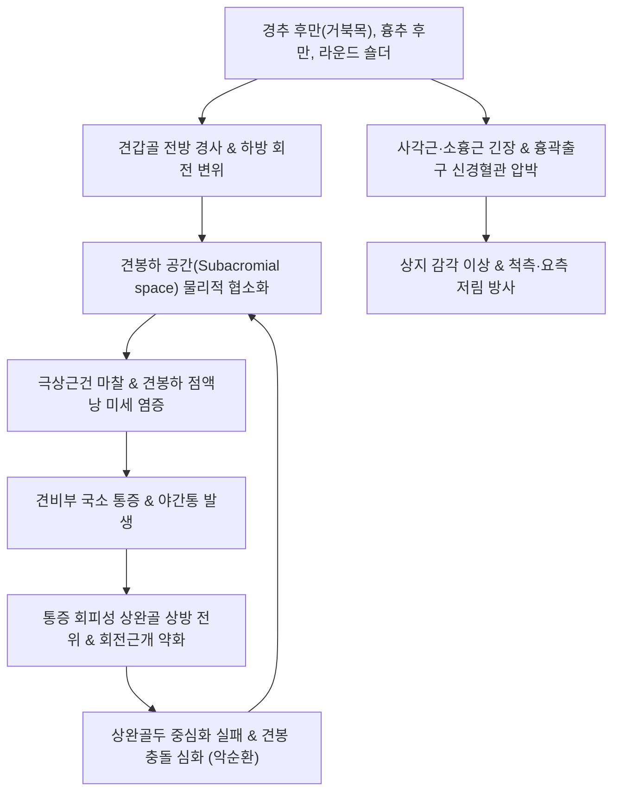

# 🩺 견비통

> **핵심 3줄 요약 (Key Summary)**:
> - 📍 **병소 부위 & 해부·병태생리**: 경추 신경근 병증(C5~C7), 견관절 복합체([[회전근개]], 견봉하 점액낭, 관절와순), 상지 말초신경 및 근막계의 기능 부전으로 인해 어깨(肩)에서 팔(臂) 및 손으로 방사되는 통증 및 운동 장애의 총칭(**肩臂痛 / Shoulder and Arm Pain**).
> - 🚩 **전형적 임상 양상**: 어깨 외측 및 상완부의 쑤시는 통증, 야간통(수면 방해), 팔을 들어 올리거나 뒤로 젖힐 때의 가동역 제한, 손가락 저림 및 근력 약화.
> - 🛠️ **핵심 검사 & 치료 전략**: 스펄링 검사([[Spurling Test]]), 스크래치 검사([[Apley Scratch Test]]), 충돌 검사([[Neer Test]]); [[견정혈]](GB21), [[견우혈]](LI15), [[천종혈]](SI11), [[곡지혈]](LI11) 자침 및 중성어혈약침/봉약침; 경추-견흉관절 통합 추나; [[서경탕]](舒經湯) 변증 투약.
> - ⚠️ **응급 의뢰 레드플래그**: 좌측 견비통과 함께 흉통, 호흡 곤란, 식은땀 동반(급성 심근경색/협심증 방사통); 외상 후 급격한 삼각근 마비 및 상지 하수(액와신경 손상/견관절 탈구); 상지 근위부의 급격한 근위축 및 마비.

---

## 📌 목차
1. [질환 개요 & 해부학적 병태생리](#1-질환-개요--해부학적-병태생리)
2. [병태생리 메커니즘 & 생체역학적 악순환 네트워크](#2-병태생리-메커니즘--생체역학적-악순환-네트워크)
3. [임상 증상 & 이학적 검사(Physical Exam) 알고리즘](#3-임상-증상--이학적-검사physical-exam-알고리즘)
4. [감별 진단 매트릭스 (Differential Diagnosis)](#4-감별-진단-매트릭스-differential-diagnosis)
5. [한의 통합 치료 프로토콜 (침·약침·추나·한약)](#5-한의-통합-치료-프로토콜-침약침추나한약)
6. [양방 치료 & 병용·의뢰 기준 (Conventional Treatment & Referral)](#6-양방-치료--병용의뢰-기준-conventional-treatment--referral)
7. [재활 운동 & 생활습관 티칭 가이드](#7-재활-운동--생활습관-티칭-가이드)
8. [💡 사용자 진료실 핵심 필기 & 임상 노하우 (Melt-In 잔여 심화 집약)](#8--사용자-진료실-핵심-필기--임상-노하우-melt-in-잔여-심화-집약)
9. [출처 및 학술 참고 문헌 (References)](#9-출처-및-학술-참고-문헌-references)

---

## 1. 질환 개요 & 해부학적 병태생리

### 1) 해부학적 복합체 (Cervicobrachial Complex)
견비통은 단일 질환명이 아니라, 경추(Cervical spine)에서 시작하여 흉곽출구(Thoracic outlet), 견갑대(Scapular girdle), 견관절(Glenohumeral joint), 그리고 상완 및 전완으로 이어지는 신경·혈관·근골격 복합체의 연쇄 기능 장애로 발생함:
* **경추 신경근 기원 (Radicular Origin)**:
  * 경추 C5, C6, C7 신경근이 추간판 탈출이나 구추관절(Luschka joint) 비후로 압박되면 삼각근, 상완이두근, 전완 외측, 수부로 방사통이 유발됨.
* **견관절 국소 복합체 (Local Joint Origin)**:
  * **[[회전근개]](Rotator Cuff)**: 극상근, 극하근, 소원근, 견갑하근이 상완골두를 관절와(Glenoid fossa)에 동적으로 안착시키는 흡입 작용(Centering/Suction) 수행.
  * **견봉하 공간(Subacromial Space)**: 견봉, 오훼견봉인대, 오훼돌기로 구성된 오훼견봉궁(Coracoacromial arch) 하방 9~10mm 간격으로 극상근건과 견봉하 점액낭이 주행.
* **견흉관절 및 척추 기립계 (Kinetic Chain)**:
  * 승모근, 능형근, 전거근이 이루는 견갑골의 동적 안정성이 무너지면 상완골 외전 시 견갑상완 리듬(Scapulohumeral rhythm)이 깨져 충돌이 가속화됨.

### 2) 한의학적 병증 인식과 경락 유주
* 한의학에서 견비통(肩臂痛)은 수삼양경(수양명대장경, 수태양소장경, 수소양삼초경)과 수태음폐경의 기혈 울체로 파악함.
* 견관절 전면 통증(대장경·폐경), 외측 통증(삼초경·담경), 후면 및 견갑간부 통증(소장경·방광경)으로 경락을 분별하여 치료혈을 구성함.

---

![[견비통_01_해부_견관절점액낭.jpg|450]]
> [그림 1: ① 해부 구조 — 견관절 주변 점액낭(bursae)] 견봉(acromion)·오구돌기(coracoid)와 함께 부위별 점액낭을 색으로 구분해 표시한 어깨 해부 도해. 견비통의 주요 병소인 견봉하·삼각근하 점액낭의 위치를 보여 준다. 출처: File:Bursae shoulder joint in normal.jpg (CC BY 3.0)

## 2. 병태생리 메커니즘 & 생체역학적 악순환 네트워크

### 1) 경추-어깨 연동 병태생리 (Double Crush 현상)
* 경추부 신경근의 경미한 압박(Level 1)이 존재하는 상태에서, 흉곽출구의 사각근 긴장이나 견관절 주위 연부조직 마찰(Level 2)이 겹치면 신경 축삭 수송(Axoplasmic flow)이 급격히 저하되어 상지 말초로의 통증과 저림이 증폭됨([[이중 압박 증후군]]).
* 일자목 및 둥근 어깨(Round shoulder)는 소흉근 단축과 전거근 약화를 초래하여 견갑골의 상방 회전을 방해함.

### 2) 염증과 섬유화의 만성화 기전
* 초기 건염 및 점액낭염 단계에서 염증성 사이토카인(IL-1β, TNF-α)과 물질 P(Substance P)가 분비되어 화학적 통증을 유발.
* 통증으로 인해 어깨 사용을 극도로 제한하면 관절낭의 섬유모세포 증식 및 콜라겐 교차결합이 촉진되어 관절낭이 수축하는 동결견([[유착성 관절낭염]])으로 진행됨.

---

## 3. 임상 증상 & 이학적 검사(Physical Exam) 알고리즘

### 1) 주요 임상 증상
* **견부 국소 동통 및 방사통**: 어깨 삼각근 부착부의 둔통이 상완 외측을 따라 주관절, 전완, 수부로 뻗침.
* **야간통(Night Pain)**: 환측으로 누워 잘 때 체중 압박으로 통증이 극심해져 잠을 깨며, 상완골두 내압 상승으로 박동성 통증 호소.
* **동작 제한**: 뒷주머니에 손 넣기(내회전 장애), 머리 빗기나 안전벨트 매기(외전 및 외회전 장애).

### 2) 진료실 핵심 이학적 검사 감별 알고리즘
1. **경추 기원 감별: 스펄링 검사 ([[Spurling Test]])**:
   * 환자의 경추를 환측으로 신전 및 외측 굴곡시킨 상태에서 두부를 수직 압박. 상지(손가락)로 찌릿한 방사통이 재현되면 경추 신경근증([[Cervical Radiculopathy]]) 양성.
2. **견관절 가동역 전수 평가 (Apley Scratch Test)**:
   * 손을 등 뒤 위쪽과 아래쪽으로 뻗어 능동/수동 ROM 측정.
   * **수동 ROM이 완전한데 능동 ROM만 제한**: 회전근개 파열 또는 점액낭염 의심.
   * **수동 및 능동 ROM이 모든 방향에서 50% 이상 감소**: 동결견([[오십견]]) 확진.
3. **충돌 증후군 검사: 니어([[Neer Test]]) & 호킨스([[Hawkins-Kennedy Test]])**:
   * 견갑골을 고정한 상태에서 상완을 강제 굴곡(Neer) 또는 90도 굴곡 상태에서 강제 내회전(Hawkins) 시 통증 유발 여부 확인.
4. **회전근개 근력 검사**:
   * 극상근(Empty Can / Jobe test), 극하근(External rotation lag sign), 견갑하근(Belly-press / Lift-off test).

---

![[견비통_02_영상_정상견관절Y투영.jpg|450]]
> [그림 2: ② 영상 — 정상 견관절 Y-투영 방사선] 견갑골 Y자 자세에서 촬영한 정상 견관절 X-ray. 견봉-오구돌기-견갑골 축과 상완골두의 정렬을 확인해 아탈구·충돌 여부를 판정하는 기본 영상이다. 출처: File:Y-projection X-ray of a normal shoulder.jpg (CC0)

![[견비통_03_영상_인공관절.jpg|450]]
> [그림 3: ② 영상 감별 — 역행성 견관절 전치환술(RSP) 후 소견] 상완골두가 제거되고 역행성 인공관절(monoblock)이 삽입된 술 후 X-ray. 보존 치료에 반응하지 않는 회전근개 관절병증에서 고려되는 수술 경로를 보여 준다. 출처: File:Right RSP Monoblock.jpg (CC BY-SA 4.0)

## 4. 감별 진단 매트릭스 (Differential Diagnosis)

| 질환명 | 주 통증 부위 및 양상 | 핵심 구별 포인트 | 필수 감별 검사 / 치료 차이점 |
| :--- | :--- | :--- | :--- |
| **견비통 (복합 근골격계)** | 견봉 외측, 상완 외측, 견갑간부의 뻐근한 통증 | 복합적 경추-견관절 이상, 특정 동작 시 악화 | 경추 및 견관절 X-ray, 이학적 검사 종합 |
| **[[경추 신경근증]](Cervical Radiculopathy)** | 목덜미에서 견갑골 내측연, 상지 및 손가락 방사통 | **스펄링 검사 양성**, 피부분절 감각 저하, 심부건반사 감약 | 경추 MRI, 근전도(EMG) 검사 |
| **[[유착성 관절낭염]](오십견 / 동결견)** | 견관절 심부 전체, 극심한 야간통 | **모든 방향의 수동적 가동역(ROM) 소실 (외회전 소실이 1차)** | 관절 조영술, 수동 유착 박리술 |
| **[[회전근개 파열]](Rotator Cuff Tear)** | 견봉 전외측, 외전 60~120도 동통호 | Drop arm sign 양성, 특정 근력 검사 시 뚜렷한 근력 약화 | 견관절 초음파, 3T 견관절 MRI |
| **[[흉곽출구증후군]](TOS)** | 쇄골하부, 액와부, 척골신경 영역(제4·5수지) 저림 | 루스 검사(Roos test), 애드슨 검사(Adson test) 양성 | 상지 혈관 초음파, 사각근 이완 |
| **내과적 연관통 (심근경색 / 담낭염)** | 좌측 어깨·턱(심장) or 우측 견갑하부(담낭) | **어깨를 움직여도 통증의 변화가 없음**, 흉통/발열 동반 | 심전도(EKG), 심근효소, 복부 초음파 (응급 감별) |

---

## 5. 한의 통합 치료 프로토콜 (침·약침·추나·한약)

### 1) 침구 치료 (Acupuncture)
* **근위 핵심 혈위 (어깨 5대 혈위)**:
  * [[견정혈]](GB21): 승모근 상부 긴장 완화, 경추-견갑 연결부 압통 해소.
  * [[견우혈]](LI15) 및 [[견료혈]](TE14): 견봉 전외측 및 후외측 함요처. 견봉하 공간 및 극상근건 직접 표적.
  * [[천종혈]](SI11): 견갑골 극하와 중앙. 극하근 발통점 해소 및 상완 방사통 완화.
  * [[비노혈]](LI14): 삼각근 부착부. 상완 외측 방사통의 핵심 치료점.
* **원위 취혈 (경락 소통)**:
  * [[곡지혈]](LI11), [[수삼리혈]](LI10): 대장경 순환 개선.
  * [[조구혈]](ST38) 투 [[승산혈]](BL57): 견비통의 특효 원위 취혈법(동씨기혈 신견혈 응용, 자침 후 어깨 능동 운동 유도).
* **전침 및 온침 요법**:
  * 견우-견료 및 천종에 2~4Hz 연속파 전침을 15분간 적용하여 관절낭 혈류 증가 유도.

### 2) 약침 치료 (Pharmacopuncture)
* **약침 제제 선택**:
  * **중성어혈약침**: 급·만성 어혈성 야간통, 찌르는 듯한 견비통에 1차 적용.
  * **신바로약침 / 소염약침**: 견봉하 점액낭염 및 활액막염이 동반된 작열통에 적용.
  * **BV(봉약침)**: 만성 퇴행성 회전근개 건병증에 1:10,000~1:30,000 희석액 주입.
* **시술 부위**:
  * 견봉하 점액낭, 극상근 부착부(대결절), 천종혈에 포인트당 0.2~0.3cc씩 총 1.0~1.5cc 주입.

### 3) 추나 및 관절 교정 수기요법 (Chuna Therapy)
* **경추 및 상부 흉추 교정 추나**:
  * 거북목 및 흉추 후만을 교정하여 견갑골의 정상 후방 경사(Posterior tilt) 유도.
* **견흉관절 가동술 (Scapulothoracic Mobilization)**:
  * 측와위에서 견갑골 내측연을 파지하고 상하 활주 및 회전 운동을 적용하여 견갑골 가동성 회복.
* **견관절 축성 견인 (GH Joint Long-axis Traction)**:
  * 견봉하 공간을 넓히고 상완골두를 하방으로 글라이딩시켜 충돌 압박 해소.

### 4) 변증별 맞춤 한약 처방 (Herbal Medicine)
* **기체어혈 (氣滯瘀血) - 야간통 극심형**:
  * 증상: 찌르는 듯한 어깨 통증, 밤에 더 아파 잠을 못 이룸, 어깨 부위를 누르면 몹시 아픔.
  * 처방: **[[서경탕]](舒經湯)** 또는 **[[신통축어탕]](身痛逐瘀湯)** 가감 (강황, 해동피, 당귀, 천궁, 적작약).
* **풍한습비 (風寒濕痺) - 기후 민감 및 시림 동반형**:
  * 증상: 비가 오거나 찬 바람을 쐬면 쑤시고 시림, 어깨가 무겁고 굳음.
  * 처방: **[[오적산]](五積散)** 또는 **소경활혈탕(疏經活血湯)** 가미 (갈근, 강활, 방풍 증량).
* **기혈양허 / 간신휴손 (氣血兩虛 / 肝腎虧損) - 만성 노인성 동결견형**:
  * 증상: 힘이 없어 팔을 들지 못함, 근위축 동반, 만성 피로, 현훈.
  * 처방: **독활기생탕(獨活寄生湯)** 또는 **[[황기계지오물탕]](黃芪桂枝五物湯)** 가감.

---

## 6. 양방 치료 & 병용·의뢰 기준 (Conventional Treatment & Referral)

### 1) 약물 요법
* **NSAIDs & 아세트아미노펜**: 통증 조절 (Aceclofenac 100mg bid 등).
* **신경병증성 통증 약물**: 경추 신경근증 동반 시 Pregabalin(75mg bid) 또는 Gabapentin 병용.

### 2) 비수술적 시술
* **견봉하 공간 스테로이드 주사 (Subacromial Injection)**:
  * 급성기 염증성 통증 완화에 탁월하나, 힘줄 약화 및 건 파열 위험이 있으므로 연 2~3회 이내로 엄격히 제한.
* **체외충격파(ESWT) 및 PDRN 주사**:
  * 만성 석회성 건염 및 퇴행성 건병증의 조직 재생 유도.

### 3) 한의 병용 판단 및 주의점
* 양방 진통소염제 복용 중에도 한의 침·약침 치료는 높은 시너지 효과를 나타냄.
* 견봉하 스테로이드 주사를 맞은 환자는 2주간 주사 부위 직접 자침을 피하고 경추 및 견갑골 주위 근막 이완 위주로 접근.

### 4) 양방·전문과 의뢰 기준 (Referral Criteria)
* **즉각 응급 의뢰 (Red Flags)**:
  * 흉통, 턱 통증, 식은땀, 호흡곤란을 동반한 좌측 어깨 통증 ➔ **급성 관상동맥 증후군 의심으로 응급실 즉시 전원**.
  * 급격한 상지 근력 저하(팔을 전혀 들어 올리지 못하는 Drop arm 또는 손목 하수) ➔ 신경외과/정형외과 정밀 검사 의뢰.
* **수술 고려 전과의뢰**:
  * 6개월 이상의 보존적 치료에도 일상생활이 불가능한 전층 회전근개 파열(Full-thickness tear).

---

## 7. 재활 운동 & 생활습관 티칭 가이드

### 1) 진자 운동 및 가동역 회복 운동 (Codman Pendulum Exercise)
* 상체를 90도 숙이고 건강한 손으로 테이블을 짚은 뒤, 환측 팔을 힘을 빼고 늘어뜨려 시계 방향, 반시계 방향으로 부드럽게 원을 그리며 회전 (어깨 관절낭 수동 이완, 하루 3회 3분씩).

### 2) 단계별 회전근개 및 견갑골 강화 훈련
* **벽 타고 오르기 (Wall Climbing)**: 손가락으로 벽을 짚고 천천히 기어 올라가며 가동역 점진적 증대.
* **전거근 및 능형근 강화**: 견갑골 모으기(Scapular retraction), 벽 푸시업 플러스(Wall push-up plus).
* **밴드 외회전 운동**: 탄성 밴드를 이용해 팔꿈치를 옆구리에 붙인 채 바깥쪽으로 벌리는 외회전 등척성 강화.

### 3) 수면 및 일상생활 교정
* 잘 때 환측 어깨가 바닥에 눌리지 않도록 똑바로 눕고, 환측 팔꿈치 아래에 작은 베개를 받쳐 어깨 관절이 후방으로 처지지 않게 유지.
* 찬 바람이나 에어컨 바람을 어깨에 직접 쐬지 않도록 보온 유지.

---

## 8. 💡 사용자 진료실 핵심 필기 & 임상 노하우 (Melt-In 잔여 심화 집약)

### 1) "어깨가 아픈데 목부터 봐야 하는 이유"
* 환자가 "어깨와 팔이 아파요"라고 호소할 때 어깨만 보고 주사나 침을 놓으면 절반은 실패함.
* **진료실 1분 감별 루틴**:
  1. 환자의 고개를 아픈 쪽으로 젖히고 눌러본다(Spurling test). 팔로 전기가 통하듯 저리면 ➔ **경추 디스크**.
  2. 팔을 의사가 잡고 위로 끝까지 올려본다(수동 거상). 끝까지 안 올라가고 걸리면 ➔ **오십견**.
  3. 팔을 올릴 때 60~120도에서만 아프다고 찡그리면 ➔ **회전근개 충돌/점액낭염**.
* 이 3단계만 구분해도 오진을 90% 이상 예방할 수 있음.

### 2) 천종혈(SI11)과 조구-승산 투자의 극적인 진통 효과
* 견비통 환자에서 천종혈(극하근)의 뚜렷한 압통점에 호침을 직자하여 득기감을 주고, 동측 조구혈에서 승산혈 방향으로 심자(2~3촌)한 상태에서 환자에게 어깨를 천천히 돌려보게 하면(동기침법), 굳어있던 어깨가 즉석에서 20~30도 이상 더 올라가는 극적인 호전을 경험할 수 있음.

---

## 9. 출처 및 학술 참고 문헌 (References)

* Management of Shoulder Pain in Primary Care: A Review. [PMID: 42606850]

* Diercks R, Bron C, Dorrestijn O, et al. Guideline for diagnosis and treatment of subacromial pain syndrome: a multidisciplinary review by the Dutch Orthopaedic Association. Acta Orthop. 2014;85(3):314-322.

* Mitchell C, Adebajo A, Hay E, Carr A. Shoulder pain: diagnosis and management in primary care. BMJ. 2005;331(7525):1124-1128.

* Simons DG, Travell JG, Simons LS. Myofascial Pain and Dysfunction: The Trigger Point Manual. Volume 1. Upper Half of Body. 2nd ed. Baltimore: Williams & Wilkins; 1999.
