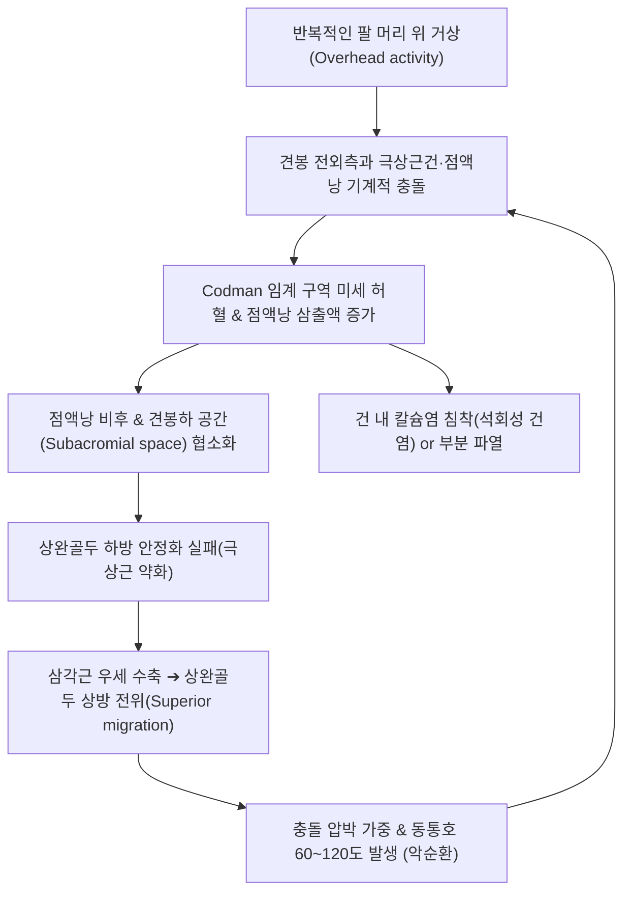

# 🩺 극상근건 점액낭염

> **핵심 3줄 요약 (Key Summary)**:
> - 📍 **병소 부위 & 해부·병태생리**: 오훼견봉궁(Coracoacromial arch) 하방의 좁은 견봉하 공간에서 **[[극상근건]](Supraspinatus tendon)**과 이를 덮고 있는 **[[견봉하 점액낭]](Subacromial bursa)**이 반복적 충돌 및 마찰을 받아 발생하는 무균성 염증 및 미세 파열.
> - 🚩 **전형적 임상 양상**: 팔을 옆으로 들어 올릴 때 60~120도 사이에서 극심한 통증([[동통호]]), 삼각근 부착부로의 연관통, 환측으로 누울 때 심해지는 수면 장애성 야간통.
> - 🛠️ **핵심 검사 & 치료 전략**: 니어 충돌 검사([[Neer Test]]), 호킨스 검사([[Hawkins-Kennedy Test]]), 잡 검사([[Empty Can Test]]); [[견우혈]](LI15), [[견료혈]](TE14), [[거골혈]](LI16) 자침 및 소염약침/신바로약침; 견봉하 공간 감압 추나; [[서경탕]](舒經湯) 처방.
> - ⚠️ **응급 의뢰 레드플래그**: 외상 직후 팔을 전혀 들어 올리지 못하고 툭 떨어지는 완전 회전근개 파열(Drop Arm Sign 양성); 어깨 관절낭의 급격한 화농성 부종 및 고열(패혈성 점액낭염).

---

## 📌 목차
1. [질환 개요 & 해부학적 병태생리](#1-질환-개요--해부학적-병태생리)
2. [병태생리 메커니즘 & 생체역학적 악순환 네트워크](#2-병태생리-메커니즘--생체역학적-악순환-네트워크)
3. [임상 증상 & 이학적 검사(Physical Exam) 알고리즘](#3-임상-증상--이학적-검사physical-exam-알고리즘)
4. [감별 진단 매트릭스 (Differential Diagnosis)](#4-감별-진단-매트릭스-differential-diagnosis)
5. [한의 통합 치료 프로토콜 (침·약침·추나·한약)](#5-한의-통합-치료-프로토콜-침약침추나한약)
6. [양방 치료 & 병용·의뢰 기준 (Conventional Treatment & Referral)](#6-양방-치료--병용의뢰-기준-conventional-treatment--referral)
7. [재활 운동 & 생활습관 티칭 가이드](#7-재활-운동--생활습관-티칭-가이드)
8. [💡 사용자 진료실 핵심 필기 & 임상 노하우 (Melt-In 잔여 심화 집약)](#8--사용자-진료실-핵심-필기--임상-노하우-melt-in-잔여-심화-집약)
9. [출처 및 학술 참고 문헌 (References)](#9-출처-및-학술-참고-문헌-references)

---

## 1. 질환 개요 & 해부학적 병태생리

### 1) 해부학적 구조와 오훼견봉궁 (Coracoacromial Arch)
* **견봉하 공간 (Subacromial Space)**:
  * 상방의 견봉(Acromion), 오훼견봉인대(Coracoacromial ligament), 오훼돌기(Coracoid process)가 단단한 천장을 이루고, 하방에는 상완골 대결절(Greater tubercle)이 위치함.
  * 정상 성인에서 이 공간의 수직 높이는 약 9~10mm이며, 6mm 이하로 협소화될 경우 충돌이 불가피함.
* **극상근건과 임계 구역 (Critical Zone of Codman)**:
  * 극상근은 견갑골 극상와에서 기시하여 견봉 하방을 지나 상완골 대결절의 상부 상관절면에 부착됨.
  * 대결절 부착부 직전 약 1cm 부위는 상완회선동맥과 견갑상동맥의 말초 문합부로, 팔을 내리고 있을 때 상완골두의 압박으로 혈류가 차단되는 **'무혈관성 임계 구역(Critical zone)'**임. 이로 인해 미세 손상 후 자연 회복력이 취약함.
* **견봉하-삼각근하 점액낭 (Subacromial-Subdeltoid Bursa)**:
  * 견봉 및 삼각근과 회전근개 건 사이의 활주를 매개하는 인체 최대의 점액낭으로, 두께가 정상 1~2mm에서 염증 시 4~5mm 이상으로 비후되어 공간을 더욱 좁힘.

### 2) 질환의 정의 및 Neer 충돌 단계
* **Stage 1 (부종 및 출혈, Edema & Hemorrhage)**: 25세 미만 과사용 운동선수, 가역적 염증.
* **Stage 2 (섬유화 및 건염, Fibrosis & Tendinitis)**: 25~40세, 반복 손상으로 점액낭 비후 및 건 섬유화.
* **Stage 3 (골극 형성 및 건 파열, Bone Spurs & Tendon Rupture)**: 40세 이상, 견봉 전하면 골극(Bigliani Type II/III) 및 회전근개 부분/전층 파열 동반.

---

![[극상근건점액낭염_01_해부_견봉하점액낭.jpg|450]]
> [그림 1: ① 해부 구조 — 견봉하·삼각근하 점액낭] 견봉과 오구돌기를 기준으로 어깨 점액낭 분포를 색으로 표시한 해부 도해. 극상근건과 견봉 사이에서 마찰을 흡수하는 견봉하 점액낭이 이 질환의 병소다. 출처: File:Bursae shoulder joint in normal.jpg (CC BY 3.0)

## 2. 병태생리 메커니즘 & 생체역학적 악순환 네트워크

### 1) 내인성 요인(Intrinsic)과 외인성 요인(Extrinsic)의 결합
* **외인성 충돌(Extrinsic Impingement)**: 견봉 형태의 구조적 이상(갈고리형 Type III acromion), 견쇄관절(AC joint) 하방 골극, 오훼견봉인대 비후로 인한 물리적 협착.
* **내인성 변성(Intrinsic Degeneration)**: 고령화에 따른 혈류 저하, 교원질 변성, 장기간의 미세 외상으로 건 실질이 먼저 약화된 후 이차적으로 점액낭염 발생.

### 2) 동적 짝힘(Force Couple)의 파탄
* 상완골두를 관절와로 당겨 하방으로 누르는 회전근개의 작용과, 상완골을 위로 들어 올리는 삼각근의 작용이 균형을 이루어야 함.
* 극상근건에 염증과 통증이 생기면 억제성 약화가 발생하여 삼각근이 단독으로 상완골두를 견봉 천장으로 끌어올리며 충돌을 영구화함.

---

## 3. 임상 증상 & 이학적 검사(Physical Exam) 알고리즘

### 1) 주요 임상 증상
* **동통호 (Painful Arc Sign)**: 팔을 옆으로 벌릴 때(외전) 0~60도까지는 통증이 없다가, 60~120도 사이에서 극심한 통증이 발생하고, 120도를 넘어가면 통증이 다시 줄어듦.
* **삼각근 부착부 연관통**: 실제 병소는 견봉 하방이지만, 통증은 상완골 외측 삼각근 조면(비노혈 부위)으로 투사되어 환자는 "팔뚝 중간이 쑤신다"고 호소.
* **야간통 및 자세 통증**: 옷을 입고 벗을 때(특히 소매에 팔을 꿸 때), 뒤로 손을 뻗어 안전벨트를 당길 때 통증 악화.

### 2) 진료실 핵심 이학적 검사 알고리즘
1. **니어 충돌 검사 ([[Neer Test]])**:
   * 환자의 견갑골을 한 손으로 눌러 회전을 고정한 상태에서, 전완을 회내(엄지가 바닥을 향함)시키고 상완을 전방 거상 끝까지 들어 올림.
   * 견봉 전하면과 대결절의 충돌로 통증이 발생하면 양성.
2. **호킨스-케네디 검사 ([[Hawkins-Kennedy Test]])**:
   * 어깨와 팔꿈치를 각각 90도 굴곡시킨 상태에서 전완을 급격히 내회전(바닥 쪽으로 회전)시킴.
   * 극상근건이 오훼견봉인대에 끼이면서 통증이 유발되면 양성 (점액낭염 진단 민감도 최고).
3. **잡 검사 ([[Empty Can Test]] / Jobe Test)**:
   * 팔을 견갑골 면(Scapular plane, 외전 30도 전방)에서 90도 외전하고 엄지를 바닥으로 내린 상태에서 하방 저항을 가함.
   * 통증 및 근력 저하 시 극상근건 병변 양성.
4. **다우반 징후 (Dawbarn's Sign)**:
   * 견봉 바로 아래를 누르면 극심한 압통이 있으나, 팔을 90도 이상 외전시키면 점액낭이 견봉 안쪽으로 미끄러져 들어가 압통이 사라지면 순수 견봉하 점액낭염 확진.

---

![[극상근건점액낭염_02_영상_초음파종단.jpg|450]]
> [그림 2: ② 영상 — 극상근건 종단 초음파] 극상근건을 세로로 스캔한 초음파 영상으로 견봉하-삼각근하 점액낭(subacromial-subdeltoid bursa)이 라벨로 표시돼 있다. 점액낭 액체 저류와 건 비후를 평가한다. 출처: File:Longitudinal US supraspinatus.jpg (CC BY-SA 4.0)

![[극상근건점액낭염_03_영상_초음파횡단.jpg|450]]
> [그림 3: ② 영상 — 극상근건 횡단 초음파] 같은 부위를 가로로 스캔한 영상으로 건 실질의 균질성과 점액낭 삼출을 종단면과 교차 확인한다. 출처: File:Transversal US supraspinatus.jpg (CC BY-SA 4.0)

## 4. 감별 진단 매트릭스 (Differential Diagnosis)

| 질환명 | 주 증상 및 호발 특징 | 핵심 구별 포인트 | 필수 감별 검사 / 치료 차이점 |
| :--- | :--- | :--- | :--- |
| **극상근건 점액낭염** | 외전 60~120도 동통호, 삼각근 부착부 방사통 | Neer/Hawkins 양성, 수동 ROM 정상, Dawbarn 양성 | 견관절 초음파(점액낭 비후 >2mm), 견봉하 감압술 |
| **[[회전근개 전층 파열]]** | 능동 외전 불능, 팔을 내릴 때 툭 떨어짐 | **Drop Arm Sign 양성**, 현저한 외전 근력 소실 | 견관절 MRI, 관절경 봉합술 |
| **[[석회성 건염]]** | **급성 발작성 극심통(응급실 방문급)**, 열감 | 화학적 석회 흡수기 통증, 환부를 스치기만 해도 비명 | 단순 방사선 X-ray에서 백색 불투명 석회 음영 |
| **[[유착성 관절낭염]](오십견)** | 전 방향 가동역 제한, 극심한 야간통 | **수동적 외회전·외전 ROM의 50% 이상 소실** | 관절 조영술, 수동 유착 박리술 |
| **[[상완이두근 장두 건염]]** | 어깨 전면 결절간구(Bicipital groove) 통증 | Speed test, Yergason test 양성 | 이두근 초음파, 결절간구 국소 치료 |

---

## 5. 한의 통합 치료 프로토콜 (침·약침·추나·한약)

### 1) 침구 치료 (Acupuncture)
* **국소 핵심 혈위**:
  * [[견우혈]](LI15): 견봉 전외측 함요처. 견봉하 점액낭 전방부 직접 도달.
  * [[견료혈]](TE14): 견봉 후외측 함요처. 극상근건 부착부 및 점액낭 후방부 표적.
  * [[거골혈]](LI16): 쇄골 견봉단과 견갑극 사이 함요처. 극상근 근복 및 견봉하 공간 상부 감압.
  * [[노수혈]](SI10): 액와 후문두 직상, 견갑극 하연. 견관절 후하방 관절낭 이완.
  * [[비노혈]](LI14): 삼각근 부착부. 연관통 방사 부위 통증 차단.
* **특수 자침 수기법 (사자 및 심자)**:
  * 환자의 팔을 가볍게 신전시킨 상태에서 견우·견료혈에서 견봉 하방을 향해 45도 사자로 1.5~2촌 자입하여 점액낭 주위 결합조직을 자극.
  * 전침(2/100Hz 혼합파, 15분) 적용으로 통증 전달 물질 억제 및 국소 미세혈류 증대.

### 2) 약침 치료 (Pharmacopuncture)
* **약침 제제 선택**:
  * **신바로약침 / 소염약침**: 견봉하 점액낭의 급성 삼출액 저류 및 활액막 부종 억제에 1차 선택.
  * **BV(봉약침)**: 만성 퇴행성 극상근 건병증 및 석회화 병변에 1:10,000~1:30,000 희석액 주입 (항염증 및 혈관 신생 유도).
  * **중성어혈약침**: 심한 야간통 및 어혈성 견관절 둔통에 적용.
* **주입 방법**:
  * 견봉 외측연 하방 1cm 지점에서 30G 니들로 수평으로 2cm 진입하여 견봉하 점액낭 내외로 포인트당 0.2~0.3cc씩 총 1.0~1.5cc 주입.

### 3) 견봉하 공간 감압 추나 (Subacromial Decompression Chuna)
* **상완골두 하방 글라이딩 기법 (Inferior Glide)**:
  * 앙와위에서 술자가 환자의 상완을 90도 외전시키고 액와부를 지지한 상태에서 상완골두를 미측(발쪽)으로 부드럽게 활주시켜 견봉하 공간 확보.
* **후방 관절낭 신장술 (Posterior Capsule Stretch)**:
  * 상완골의 전방 전위를 유발하는 단축된 후방 관절낭을 부드럽게 내전·내회전 신장.

### 4) 변증별 맞춤 한약 처방 (Herbal Medicine)
* **기체어혈 (氣滯瘀血) - 찌르는 통증 및 야간 악화형**:
  * 증상: 어깨 통증으로 환측으로 눕지 못함, 칼로 찌르는 듯함, 설자암.
  * 처방: **[[서경탕]](舒經湯)** 가감 (강황, 해동피, 당귀, 적작약, 감초) 또는 **[[당귀수산]](當歸鬚散)**.
* **풍한습비 (風寒濕痺) - 관절 강직 및 시림형**:
  * 증상: 찬 기운을 쐬면 팔이 굳고 통증 악화, 날씨가 흐리면 쑤심.
  * 처방: **[[오적산]](五積散)** 가감 (갈근, 진피, 창출, 백지).
* **간신음허 / 근막위축 (肝腎陰虛 / 筋膜萎縮) - 만성 퇴행성 건병증형**:
  * 증상: 노인성 마른 체형, 어깨에 힘이 없음, 만성적 시큰거림.
  * 처방: **독활기생탕(獨活寄生湯)** 또는 **[[보간탕]](補肝湯)** 가미 (구기자, 산수유, 속단).

---

## 6. 양방 치료 & 병용·의뢰 기준 (Conventional Treatment & Referral)

### 1) 약물 치료
* **경구 NSAIDs**: Aceclofenac 100mg bid, Celecoxib 200mg qd (2~4주).
* **근이완제**: 단기 Eperisone 병용.

### 2) 주사 치료 및 비수술 시술
* **견봉하 스테로이드 주사 (Subacromial Corticosteroid Injection)**:
  * Triamcinolone 20~40mg + 1% Lidocaine 혼합액을 초음파 유도하 견봉하 점액낭 내 정확히 주입.
  * 단기 항염증 효과는 극적이나, 반복 주사(연 3회 이상) 시 극상근건 교원질 분해 및 건 파열 위험이 크므로 주의.
* **체외충격파(ESWT)** 및 **PDRN/프롤로 주사**:
  * 만성 건병증의 건 치유 촉진.

### 3) 수술적 치료 적응증 (Surgical Indication)
* **견봉하 감압술 및 견봉성형술 (Subacromial Decompression & Acromioplasty)**:
  * 6개월 이상의 적극적 보존적 치료에도 호전이 없고, 갈고리형 견봉(Type III) 골극이 힘줄을 지속적으로 갉아먹는 경우 관절경으로 골극 절제.

### 4) 양방·전문과 의뢰 기준 (Referral Criteria)
* **정형외과 견주관절 전문의 즉시 의뢰**:
  * Drop Arm Sign 양성 및 심한 외전 근력 소실 (급성 전층 파열 ➔ 3개월 내 조기 봉합술 필요).
  * 국소 발적, 열감, 오한을 동반한 패혈성 활액낭염 의심 시 (관절액 흡인 배양 및 정맥 항생제 필요).

---

## 7. 재활 운동 & 생활습관 티칭 가이드

### 1) 급성기 진자 운동 (Codman Exercise)
* 체중을 지지하고 팔을 늘어뜨린 채 반동을 이용하여 전후, 좌우, 원형으로 부드럽게 흔들기 (하루 3회, 회당 3분). 능동 수축 없이 관절액 순환 촉진.

### 2) 회전근개 중심화 재활 훈련
* **외회전 등척성 운동**:
  * 문틀이나 수건을 끼우고 팔꿈치를 90도 굽힌 채 바깥쪽으로 5초간 힘주기 (통증 없는 범위).
* **견갑골 안정화 (벽 슬라이드 & 로우 운동)**:
  * 전거근과 하부 승모근을 강화하여 팔을 들 때 견갑골이 위로 정상적으로 돌아가도록 유도.

### 3) 일상생활 티칭
* 머리 위로 팔을 올리는 작업(도배, 형광등 갈기, 배드민턴, 수영 자유형)을 증상 소실 시까지 엄격히 금지.
* 수면 시 환측 팔 밑에 베개를 받쳐 상완골두가 후하방으로 안정되게 지지.

---

## 8. 💡 사용자 진료실 핵심 필기 & 임상 노하우 (Melt-In 잔여 심화 집약)

### 1) Neer 검사와 Hawkins 검사의 실전 적용 차이
* **Neer test**는 상완골 대결절이 견봉의 **전외측연(Anterior-inferior edge)**에 부딪히는 것을 보는 검사이고,
* **Hawkins test**는 대결절이 **오훼견봉인대(Coracoacromial ligament)** 밑으로 깊숙이 파고들며 끼이는 것을 보는 검사임.
* 임상에서 Hawkins 검사가 훨씬 더 민감하게 양성을 나타내므로, Hawkins 양성 + 외전 60~120도 동통호가 확인되면 견봉하 점액낭염으로 즉시 진단하고 약침 치료로 진입하면 됨.

### 2) 견우혈 투 견료혈 횡자 사자 테크닉
* 견우혈에서 바늘을 수직으로 찌르면 삼각근만 뚫고 뼈에 부딪힘.
* 환자에게 팔을 약간 외전시켜 견봉 아래 틈새를 벌려준 상태에서, 견우혈에서 견료혈 방향으로(전방에서 후방으로) 견봉 뼈 밑을 스치듯이 수평으로 40mm 호침을 눕혀 자입하면 견봉하 점액낭 전체를 관통하며 환자가 "어깨 속 깊은 곳이 뻐근하게 풀린다"는 강력한 득기를 느낌.

---

## 9. 출처 및 학술 참고 문헌 (References)

* Dextrose prolotherapy for chronic symptomatic rotator cuff tendinopathy and subacromial bursitis: A systematic review and meta-analysis. [PMID: 42825417]

* Neer CS 2nd. Impingement lesions. Clin Orthop Relat Res. 1983;(173):70-77.

* Harrison AK, Flatow EL. Subacromial impingement syndrome. J Am Acad Orthop Surg. 2011;19(11):701-708.

* Koester MC, George MS, Kuhn JE. Shoulder impingement syndrome. Am J Med. 2005;118(5):452-455.
