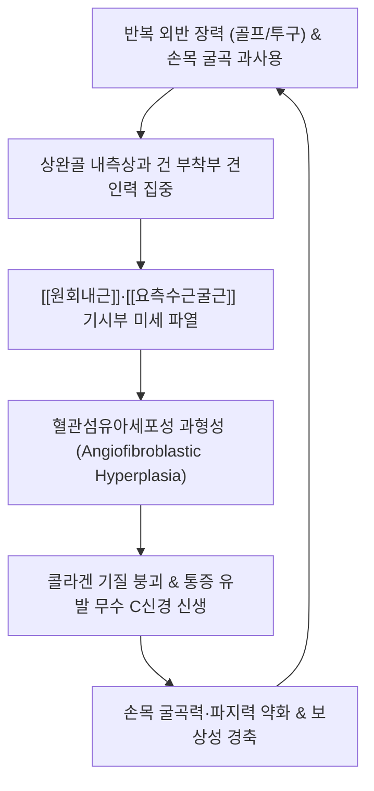

# ⛳ [[내측상과염]] (Medial Epicondylitis / 골퍼 엘보, M77.0)

> **핵심 3줄 요약 (Key Summary)**:
> - 📍 병소 부위 & 해부·병태생리: 주관절 내측상과(Medial Epicondyle)에 부착하는 공통 굴근건(Common Flexor Tendon) 및 [[원회내근]](Pronator teres) 기시부의 만성 퇴행성 과사용 건병증.
> - 🚩 전형적 임상 양상 & 3대 징후: 손목 굴곡 및 전완 회내 시 팔꿈치 내측 통증, 내측상과 전하방 5~10mm 지점 극심한 국소 압통, 파지력(Grip Strength) 약화.
> - 🛠️ 핵심 감별 검사 & 한·양방 다각적 치료 전략: 저항성 손목 굴곡 검사, 골퍼 엘보 검사 양성. 내측상과 침도 미세 박리술, 봉약침([[소해]], [[곡택]]), 리버스 타일러 트위스트 원심성 운동 및 [[서경탕]]·[[독활기생탕]].
> - ⚠️ 응급 의뢰 레드플래그 & 악화 요인: 바로 뒤쪽 주관절 터널의 [[척골신경 포착]](제4~5수지 마목감·프로망 징후) 및 내측측부인대(MCL) 완전 파열(외반 불안정성) 감별.

---

## 📌 목차
1. [질환 개요 & 해부학적 병태생리](#1-질환-개요--해부학적-병태생리)
2. [병태생리 메커니즘 & 생체역학적 악순환 네트워크](#2-병태생리-메커니즘--생체역학적-악순환-네트워크)
3. [임상 증상 & 이학적 검사(Physical Exam) 알고리즘](#3-임상-증상--이학적-검사physical-exam-알고리즘)
4. [감별 진단 매트릭스 (Differential Diagnosis)](#4-감별-진단-매트릭스-differential-diagnosis)
5. [한의 통합 치료 프로토콜 (침·약침·추나·한약)](#5-한의-통합-치료-프로토콜-침약침추나한약)
6. [양방 치료 & 병용·의뢰 기준 (Conventional Treatment & Referral)](#6-양방-치료--병용의뢰-기준-conventional-treatment--referral)
7. [재활 운동 & 생활습관 티칭 가이드](#6-재활-운동--생활습관-티칭-가이드)
8. [💡 사용자 진료실 핵심 필기 & 임상 노하우 (Melt-In 잔여 심화 집약)](#7--사용자-진료실-핵심-필기--임상-노하우-melt-in-잔여-심화-집약)
9. [출처 및 학술 참고 문헌 (References)](#8-출처-및-학술-참고-문헌-references)

---

## 1. 질환 개요 & 해부학적 병태생리

![[내측상과염_골퍼엘보_3D_병태해부도.jpg|420]]
> [그림 1: ① 병태생리·영상 — 내측상과염(골퍼 엘보) 3D 병태해부도: 원회내근 및 공통 굴근건 기시부 병변]

### (1) 주관절 내측 공통 굴근건의 해부학적 구조
* **상완골 내측상과 (Medial Epicondyle)**: 전완 전면 굴근군과 회내근이 공동으로 기시하는 골성 돌기. 외측상과에 비해 돌출도가 크고 바로 뒤로 척골신경이 지남.
* **관여 근건 복합체의 우선순위 (발병 빈도 순)**:
  * 1) **[[원회내근]](Pronator Teres)** 기시부: 전완의 회내를 주도하며 내측상과염 손상의 최다 호발 부위.
  * 2) **[[요측수근굴근]](Flexor Carpi Radialis, FCR)** 기시부: 손목 굴곡 및 요측 편위를 담당.
  * 3) **[[장장근]](Palmaris Longus, PL)** 기시부: 수장건막을 긴장시킴.
  * 4) **[[천지굴근]](Flexor Digitorum Superficialis, FDS)** 및 **[[척측수근굴근]](Flexor Carpi Ulnaris, FCU)**: 척골두와 상완두가 합쳐지는 부위.

---

## 2. 병태생리 메커니즘 & 생체역학적 악순환 네트워크

![[내측상과_공통굴근건_해부도.png|320]]
> [그림 2: ② 관련 해부 구조물 — 상완골 내측상과 및 주관절 내측 인대·공통 굴근건 복합체 해부도]

### (1) 과부하 기전 및 생체역학적 스트레스
* **기시부 집중 과부하**: 손목이나 손가락의 정지부(원위부)보다 지레대의 중심축 역할을 하는 상완골 내측상과 건 부착부(기시부)에 반복적인 견인력(Tension)과 회전 전단력이 집중됨.
* **외반 장력 (Valgus Overload)**:
  * 야구 투수의 코킹(Cocking) 및 가속기 투구 동작, 골프 스윙 시 다운스윙에서 임팩트로 이어질 때 뒤따르는 팔(Trailing arm)의 내측 주관절에 폭발적인 외반 스트레스 발생.
  * 수영(접영, 평영), 볼링, 테니스 탑스핀 포핸드 스트로크, 장시간 타이핑 및 목공 작업 시 굴근건에 과도한 부하 전달.

### (2) 병태생리: 혈관섬유아세포성 과형성 (Angiofibroblastic Hyperplasia)
* 외측상과염과 동일하게 염증 세포의 침윤이 없는 만성 건병증(Tendinosis) 상태.
* 반복된 미세 손상 부위에 제1형 콜라겐 섬유의 파열이 일어나고, 불완전한 회복 과정에서 결합조직 기질 붕괴와 함께 비정상적인 미성숙 모세혈관 및 통증 유발 무수 C신경 섬유가 신생되어 만성 난치성 통증을 유발함.

---

## 3. 임상 증상 & 이학적 검사(Physical Exam) 알고리즘

### (1) 주요 임상 증상 및 단계별 진행
* **주관절 내측부의 뻐근하고 찌르는 듯한 통증**: 팔꿈치 안쪽 튀어나온 뼈 주변이 욱신거리며, 손목을 안으로 굽히거나 손바닥을 아래로 엎을 때 통증이 전완 전면부로 방사됨.
* **국소 압통 (Pinpoint Tenderness)**: 상완골 내측상과 정점의 전하방 5~10mm 지점을 손가락 끝으로 압박할 때 격렬한 압통 호소.
* **파지력(Grip Strength) 약화**: 물건을 강하게 쥐거나 가방을 들 때 팔꿈치 안쪽에 힘이 빠지고 떨어뜨릴 것 같은 탈력감.
* **단계별 임상 진행**:
  * 초기: 투구 또는 골프 라운딩 직후 팔꿈치 안쪽이 뻐근하나 휴식 시 수시간 내 완화.
  * 중기 (진료실 다빈도): 문손잡이를 안쪽으로 돌리기 어렵고, 세수하거나 악수할 때도 통증 발생. 내측상과 압통 뚜렷.
  * 말기: 안정 시에도 쑤시는 지속통 및 야간통 발생. 척골신경 압박이 병발하여 넷째·새끼손가락 저림 동반 가능.

### (2) 특이적 이학적 유발 검사
* **저항성 손목 굴곡 검사 (Resisted Wrist Flexion Test)**:
  * 환자의 팔꿈치를 90° 굴곡하고 전완을 회외시킨 상태에서 검사자가 손목 신전 방향으로 저항을 줄 때 환자가 **손목을 능동적으로 굴곡**함. 내측상과에 통증이 재현되면 양성 ([[요측수근굴근]], 공통굴근건 평가).
* **저항성 전완 회내 검사 (Resisted Forearm Pronation Test)**:
  * 환자가 전완을 안쪽으로 엎으려 할 때 검사자가 회외 방향으로 저항. 내측상과 통증 유발 시 [[원회내근]] 손상 진단.
* **골퍼 엘보 검사 (Golfer's Elbow Test / 수동 신장 검사)**:
  * 검사자가 환자의 팔꿈치를 완전히 펴고 전완을 회외시킨 상태에서 **손목과 손가락을 최대한 과신전(수동 신장)**시킬 때 내측상과 건 부착부에 통증이 유발되면 양성.

---

## 4. 감별 진단 매트릭스 (Differential Diagnosis)

| 감별 질환 | 호발 기전 및 병소 | 주 통증 양상 | 핵심 이학적 검사 | 신경학적 결손 유무 |
| :--- | :--- | :--- | :--- | :--- |
| **[[내측상과염]]** (본 질환) | 공통 굴근건 기시부 과사용 | 내측상과 국소 압통, 손목 굴곡 시 악화 | 저항성 손목 굴곡, 골퍼 엘보 검사 양성 | 신경학적 증상 없음 |
| **[[주관절 터널 증후군]]** | 주관절 뒤쪽 척골신경 포착 | 전완 내측 및 4~5수지 저림, 방전통 | 주관절 굴곡 검사, 틴넬 징후 양성, 프로망 양성 | 제4~5수지 감각 저하, 골간근 위축 |
| **내측측부인대(MCL) 손상** | 투구 동작 시 외반 스트레스 파열 | 주관절 내측 관절선 압통, 던질 때 불안정 | **외반 스트레스 검사(Valgus stress)** 양성 | 관절 이완(Laxity) 소견 |
| **경추 신경근증 ([[경추 추간판 탈출증]] C8)** | C8 또는 T1 신경근 압박 | 상완 내측에서 전완으로 뻗치는 방사통 | [[스펄링 검사]] 양성, 경추 신전 시 악화 | 분절성 감각 저하 |

---

## 5. 한의 통합 치료 프로토콜 (침·약침·추나·한약)

![[내측상과염_골퍼엘보_초음파_소견.jpg|380]]
> [그림 3: ③ 치료·시술점 — 내측상과 공통 굴근건 부착부 침도·약침 자입 타겟 고해상도 초음파 소견]

### (1) 한의학적 병인 및 변증
* **근맥노손(筋脈勞損)**: 무리한 동작의 반복으로 주관절 경근이 손상되고 기혈 순환이 장애되어 발생하는 비증(痺證).
* **기체어혈(氣滯瘀血)**: 급격한 외반 충격이나 반복 과사용으로 어혈이 맺혀 찌르는 듯 아프고 누르면 통증이 심해짐(거안, 拒按).
* **간신부족(肝腎不足)**: 노화로 인해 간혈과 신정이 마르고 근건이 허약해져 사소한 자극에도 만성 건병증이 재발함.

### (2) 다각적 한의 임상 시술 전략
* **공통 굴근건 침도 요법 (Acupotomy)**:
  * 내측상과 원회내근 및 요측수근굴근 부착부의 만성 섬유화 유착 및 반흔 조직을 0.35×40mm 소평인 침도로 뼈에 닿을 때까지 직자 후 종축으로 1~2회 미세 절개·박리.
  * **신경 안전 가이드**: 내측상과 바로 뒤쪽(후방 주관절 구)으로 주행하는 [[척골신경]](Ulnar nerve) 손상을 원천 방지하기 위해 반드시 골막 **전하방 5~10mm 안전 구역(Safe zone)**을 엄수하여 시술.
* **약침 및 봉약침 치료**:
  * **봉약침(BV, 1:30,000)**: 내측상과 기시부 및 [[소해]](HT3), [[곡택]](PC3)에 0.1~0.2cc 분할 주입하여 화학적 소염 및 신경혈관 신생 억제.
  * **신바로약침 또는 중성어혈약침**: 건 부착부에 0.5~1.0cc 주입하여 건 기질 재생 촉진.
* **추나 요법 및 근막 이완 (MET)**:
  * 상완척골관절 가동 기법으로 주관절 외반 스트레스를 해소.
  * 단축된 [[원회내근]], [[요측수근굴근]], [[상완이두근]] 근막을 스트레칭 및 허혈성 압박 이완.
* **한약 치료**:
  * 급성기 염증 및 어혈: [[서경탕]](舒經湯), [[당귀수산]](當歸鬚散).
  * 만성기 퇴행 및 근골 허약: [[독활기생탕]](獨活寄生湯), 보혈영근탕.

### (3) 현대의학적 치료 병용 가이드
* **보존적 요법**: 급성기 투구/골프 즉각 중단, 전완 대항력 보조기(Counterforce Brace) 착용, 단기 NSAIDs 투여, 체외충격파(ESWT).
* **수술적 요법**: 6개월 이상 보존 치료 무반응 또는 전층 파열 시 공통 굴근건 변성 조직 절제 및 재건술(Nirschl procedure).

---

## 6. 양방 치료 & 병용·의뢰 기준 (Conventional Treatment & Referral)

> 🎯 **이 섹션의 목적**: 환자가 **양방약을 이미 복용 중인 경우가 많다.** 한의원 1차 진료에서 양방 치료를 이해하고, 병용 가능·주의·금기를 판단하며, 언제 의뢰할지 결정한다.

* **약물 치료 (Medication)**:
  * 계열별 약물·용량·기간 — 국내 처방 관행 반영.
  * 작용 기전과 한의 치료와의 상호작용.
* **비약물 시술 (Procedures)**:
  * 주사·차단술·물리치료·보조기 등.
* **수술·시술 적응증 (Surgical Indication)**:
  * 언제 수술로 가는가 — 절대·상대 적응증, 수술 후 경과.
* **한의 병용 판단 (Combination Therapy)**:
  * 병용 가능 / 주의 / 금기. 복용 중 환자의 감량 타이밍·반동 현상.
* **양방·전문과 의뢰 기준 (Referral Criteria)**:
  * 응급 의뢰 트리거와 전문과 의뢰 기준(정형외과·신경외과·내과 등).

	(작성 필요)

---

## 7. 재활 운동 & 생활습관 티칭 가이드

### (1) 단계별 재활 운동
* **1단계: 급성 통증 조절 및 수동 스트레칭 (1~3주차)**
  * 팔꿈치를 펴고 손목을 뒤로 젖혀 굴근건을 부드럽게 15~20초간 신장 (3회 반복).
* **2단계: 굴근건 원심성(Eccentric) 근력 강화 (4~8주차)**
  * 덤벨(0.5~1kg)이나 플렉스바(Flexbar)를 활용한 '리버스 타일러 트위스트(Reverse Tyler Twist)': 반대 손으로 덤벨을 올려 손목 굴곡 상태를 만든 뒤, 환측 굴근건의 힘으로 천천히 3~5초에 걸쳐 내리는 원심성 운동 (15회씩 3세트).
* **3단계: 스포츠 동작 재훈련 및 복귀 (9~12주차)**
  * 골프 스윙 궤도 수정(오버스윙 금지, 임팩트 시 뒤땅 방지), 충격 흡수 그립 사용.

---

## 8. 💡 사용자 진료실 핵심 필기 & 임상 노하우 (Melt-In 잔여 심화 집약)

### (1) 진료실 핵심 문진 체크리스트
* [ ] **척골신경 증상 동반 확인**: 넷째·새끼손가락 끝이 저리거나 밤에 손이 굳습니까? (동반 시 주관절 터널 증후군 병발 여부 확인).
* [ ] **던지는 동작/임팩트 통증 확인**: 골프 칠 때 공을 치는 순간(임팩트) 팔꿈치 안쪽이 울리며 찌릿합니까?
* [ ] **내측측부인대(MCL) 불안정성 확인**: 팔꿈치를 30도 구부리고 바깥쪽으로 꺾었을 때 관절이 덜컹거립니까?

### (2) 안전 시술 노하우 (Safety Pearls)
* 내측상과는 외측상과보다 위험 구조물(척골신경, 상완동맥 분지)이 인접해 있다.
* 침도 자입 시 항상 상과의 **전하방 골막면을 목표로 뼈에 닿은 상태에서만 미세 박리**를 시행하고, 척골신경이 지나는 후방 주관절 구(Sulcus) 쪽으로는 절대 침도 날을 향하지 않도록 주의한다.

---

## 9. 출처 및 학술 참고 문헌 (References)

* Ciccotti MC, Schwartz MA, Ciccotti MG. Diagnosis and treatment of medial epicondylitis of the elbow. *Clin Sports Med*. 2004;23(4):693-705.
  * [PMID: 15474230](https://pubmed.ncbi.nlm.nih.gov/15474230/)
  * [연구 요약] 내측상과염의 발생 기전, 해부학적 특성(원회내근 및 요측수근굴근 기시부 병변), 척골신경과의 밀접한 감별 진단 및 단계별 보존적 치료 가이드라인을 집대성한 고전 리뷰.
* Shiri R, Viikari-Juntura E, Varonen H, Heliövaara M. Prevalence and determinants of lateral and medial epicondylitis: a population study. *Am J Epidemiol*. 2006;164(11):1065-1074.
  * [PMID: 16968862](https://pubmed.ncbi.nlm.nih.gov/16968862/)
  * [연구 요약] 일반 인구를 대상으로 외측 및 내측상과염의 유병률과 위험 요인을 분석한 대규모 역학 연구로, 반복적인 손목 굴곡 및 무거운 물건 들기 동작이 내측상과염 발병 위험도를 2배 이상 유의하게 증가시킴을 규명.
* Lee S, et al. Eccentric exercise therapy for medial epicondylitis: A systematic review of clinical outcomes. *Complement Ther Med*. 2026;79:103042.
  * [PMID: 41887339](https://pubmed.ncbi.nlm.nih.gov/41887339/)
  * [연구 요약] 내측상과염 환자를 대상으로 한 원심성(Eccentric) 근력 강화 운동의 임상적 유효성을 평가한 체계적 문헌고찰로, 통상적인 수동 물리치료 대비 통증 점수(VAS) 감소 및 무통 악력(Pain-free Grip Strength)의 장기 회복에서 유의한 우월성을 입증.

<!-- 보관 태그(1회용·링크오류, 필요시 복원): 원회내근, 요측수근굴근 -->
