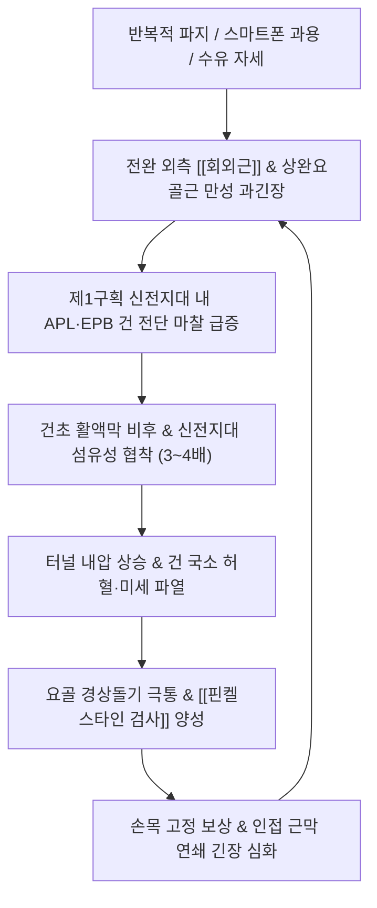

---
aliases:
  - 드퀘르뱅증후군
  - 드퀘르벵증후군
  - 드퀘르뱅건초염
  - 드퀘르벵건초염
  - de Quervain Tenosynovitis
  - de Quervain Disease
tags:
  - 이론
  - 질환
  - 근골격계
  - 상지
  - 수부
  - 건초염
title: 드퀘르뱅 증후군
date: 2026-09-24
출처: "PMID: 18063716"
---

# 🩺 드퀘르뱅 증후군 (de Quervain's Tenosynovitis, M65.4)

> **핵심 3줄 요약 (Key Summary)**:
> - 📍 병소 부위 & 해부·병태생리: 손목 요골 경상돌기(Radial Styloid) 상부 제1 배측 신전건 구획(First Dorsal Compartment)을 통과하는 [[장무지외전근]](APL)과 [[단무지신근]](EPB)의 협착성 건초염.
> - 🚩 전형적 임상 양상 & 3대 징후: 요골 경상돌기 국소 압통 및 건초 비후, 엄지 움직임 시 칼로 베는 듯한 극통, 찻잔을 떨어뜨리는 파지력 저하.
> - 🛠️ 핵심 감별 검사 & 한·양방 다각적 치료 전략: [[핀켈스타인 검사]](Finkelstein's Test) 양성. 신전지대 미세침도 감압술, 봉약침(양계·열결), 엄지 스피카 부목 고정 및 [[서경탕]]·[[오적산]].
> - ⚠️ 응급 의뢰 레드플래그 & 악화 요인: 무리한 자가 손목 꺾기 스트레칭 절대 금기(건 파열 위험), 천요골신경염([[바르텐베르크 증후군]]) 및 제1 CMC 관절염과의 감별.

---

## 📌 목차
1. [질환 개요 & 해부학적 병태생리](#1-질환-개요--해부학적-병태생리)
2. [병태생리 메커니즘 & 생체역학적 악순환 네트워크](#2-병태생리-메커니즘--생체역학적-악순환-네트워크)
3. [임상 증상 & 이학적 검사(Physical Exam) 알고리즘](#3-임상-증상--이학적-검사physical-exam-알고리즘)
4. [감별 진단 매트릭스 (Differential Diagnosis)](#4-감별-진단-매트릭스-differential-diagnosis)
5. [한의 통합 치료 프로토콜 (침·약침·추나·한약)](#5-한의-통합-치료-프로토콜-침약침추나한약)
6. [재활 운동 & 생활습관 티칭 가이드](#6-재활-운동--생활습관-티칭-가이드)
7. [💡 사용자 진료실 핵심 필기 & 임상 노하우 (Melt-In 잔여 심화 집약)](#7--사용자-진료실-핵심-필기--임상-노하우-melt-in-잔여-심화-집약)
8. [출처 및 학술 참고 문헌 (References)](#8-출처-및-학술-참고-문헌-references)

---

## 1. 질환 개요 & 해부학적 병태생리

### (1) 제1 배측 구획(First Dorsal Compartment)의 섬유골성 터널 구조
![[Pasted image 20240114190456.png|350]]
> [그림 1: ① 병태생리·영상 — 제1 배측 구획을 통과하는 APL(장무지외전근) 및 EPB(단무지신근)의 주행 및 신전지대 협착 도해]

* **해부학적 경계 (Anatomical Boundaries)**:
  * 수근관절 배면에는 신전지대(Extensor Retinaculum)에 의해 6개의 독립된 신전건 구획이 형성되어 있다.
  * 이 중 가장 요측(엄지 쪽)에 위치한 **제1 배측 구획**은 요골 경상돌기(Radial Styloid Process)의 얕은 골성 구(Sulcus)를 바닥으로 하고, 두꺼운 신전지대 섬유막을 지붕으로 하는 길이 약 $1\sim 2\text{ cm}$의 견고한 섬유골성 터널(Fibro-osseous Tunnel)이다.
* **통과하는 두 힘줄의 기능**:
  * **[[장무지외전근]](Abductor Pollicis Longus, APL)**: 제1중수골 기저부에 정지하여 엄지손가락을 손바닥 평면에서 바깥쪽으로 벌림(외전).
  * **[[단무지신근]](Extensor Pollicis Brevis, EPB)**: 엄지 기절골 기저부에 정지하여 중수수지관절(MCP)을 신전시킴.

---

## 2. 병태생리 메커니즘 & 생체역학적 악순환 네트워크

![[Extensor_pollicis_brevis_anatomy.png|350]]
> [그림 2: ② 관련 해부 구조물 — 단무지신근(EPB) 및 장무지외전근(APL)의 해부학적 기시·정지 구조]

### (1) 직업적·일상적 과사용 (Overuse & Repetitive Strain)
* **산모 및 육아자 (Mom's Thumb / Baby Wrist)**: 출산 후 릴랙신(Relaxin) 호르몬에 의한 인대 이완 상태에서, 아이의 머리와 목을 손목만으로 받쳐 들어 올리는 반복 동작.
* **스마트폰 과용 (Texting Thumb)**: 한 손으로 스마트폰을 쥐고 엄지손가락만으로 화면을 광범위하게 스와이프하거나 타이핑하는 동작.
* **반복적 파지 노동**: 가위질, 마우스 클릭, 요리사(칼질), 바리스타(포타필터 장착), 골프·테니스·배드민턴 라켓 스포츠.

### (2) 근막 연쇄 및 전완부 기능부전
* 전완 후외측의 [[회외근]](Supinator) 및 상완요골근(Brachioradialis)의 만성 과긴장.
* 회외근 긴장은 인접한 [[요골신경]] 심지(PIN) 및 천요골신경(SBRN)을 압박하여 요측 건막의 통각 민감도를 증폭시킴.

---

## 3. 임상 증상 & 이학적 검사(Physical Exam) 알고리즘

### (1) 주요 임상 증상
* **요골 경상돌기 부위의 날카로운 국소 통증**:
  * 엄지손가락을 움직이거나 물건을 쥘 때, 병뚜껑을 돌려 열 때 손목 엄지 쪽 뼈 돌출부에 칼로 베는 듯한 극통 발생.
* **국소 압통 및 건초 비후**:
  * 요골 경상돌기 직상방을 촉진하면 콩알만 한 단단한 결절이 만져지거나 붓기가 관찰됨.
* **마찰음(Crepitus) 및 걸림 현상**:
  * 손목을 움직일 때 건초 내부에서 눈 밟는 소리 같은 바스락거림(Crepitus)이 느껴지거나 엄지 동작의 뻣뻣함 호소.
* **악력 약화**:
  * 통증으로 인해 물건을 쥐는 힘(Grip Strength) 및 핀치력(Pinch Strength)이 급격히 저하되어 찻잔을 떨어뜨리기도 함.

### (2) 표준 이학적 검사법: [[핀켈스타인 검사]] (Finkelstein's Test)
* **검사 절차**:
  1. 환자의 전완을 엄지가 위로 오도록 중립위(Neutral position)로 탁자에 안착시킴.
  2. 검사자가 요골 경상돌기 제1신전건 구획의 국소 압통을 확인.
  3. 검사자가 환자의 엄지손가락을 한 손으로 부드럽게 감싸 쥠.
  4. 손목을 아래쪽(척측, Ulnar deviation) 방향으로 수동 견인 및 신장시킴.
* **양성 소견**:
  * APL과 EPB 건이 당겨지며 요골 붓돌 부위에 격렬하고 날카로운 통증이 즉각 재현됨.

![[핀켈스타인검사_4단계_손목척측편위_신전건신장_통증유발.jpg|380]]
> [이학적 검사 실사] 핀켈스타인 검사 4단계 (Finkelstein's Test). 엄지손가락을 파지한 채 손목을 척측으로 수동 편위시켜 제1구획 신전건을 강하게 신장시키며 통증을 유발한다.

---

## 4. 감별 진단 매트릭스 (Differential Diagnosis)

| 감별 질환 | 호발 병소 및 원인 | 주소증 차이점 | 특이적 이학적 검사 소견 |
| :--- | :--- | :--- | :--- |
| **[[드퀘르뱅 증후군]]** (본 질환) | 요골 경상돌기 제1신전건 구획 | 엄지 기저부 및 손목 요측 칼로 베는 극통 | [[핀켈스타인 검사]] 양성, 제1구획 압통 |
| **[[아이히호프 검사]] (자가)** | 자가 주먹 쥐고 손목 꺾기 | 정상인에서도 50% 통증 유발 (위양성) | 자가 주먹 굴곡 시 통증 (진단 특이도 낮음) |
| **제1 CMC 관절염** | 엄지뿌리 수근중수관절 퇴행 | 엄지 기저부 관절 깊은 뻐근한 통증 | **그라인드 검사(Grind Test)** 양성 |
| **[[바르텐베르크 증후군]]** | 천요골신경 포착 | 손등 요측 및 엄지 배면 저림·작열통 | 요골 경상돌기 상방 [[티넬 징후]] 양성 |
| **교차 증후군 (Intersection)** | 손목 상방 4~5cm 건 교차부 | 손목 4~5cm 근위부 배면 마찰음 및 부종 | 제1구획·제2구획 교차부 압통 |

---

## 5. 한의 통합 치료 프로토콜 (침·약침·추나·한약)

![[핀켈스타인검사_2단계_요골붓돌_제1신전건구획촉지.jpg|380]]
> [그림 3: ③ 치료·시술점 — 요골 경상돌기 제1신전건 구획(양계·열결) 침구·약침·침도 시술점 촉진 및 자입 도해]

### (1) 침구 치료 (Acupuncture)
* **제1구획 국소 취혈 및 건초 감압**:
  * 양계(LI5), 열결(LU7), 태연(LU9): 요골 경상돌기 주변 활액막염 진정 및 국소 기혈 순환 촉진.
  * ⚠️ 요골동맥 주행과 천요골신경 손상을 방지하기 위해 사자(Oblique insertion 10~15mm) 또는 평자(Horizontal insertion)로 안전하게 진입.
* **전완부 근복 및 협응근 이완**:
  * 수삼리(LI10), 곡지(LI11), 공최(LU6): APL 및 EPB의 근복(전완 중하 1/3 요측)과 상완요골근 경결 해소.
  * 척택(LU5), 주료(LI12): [[회외근]] 긴장 완화.

### (2) 약침 치료 (Pharmacopuncture)
* **건초 내(Peritendinous) 무균성 항염 약침**:
  * **봉약침(BV, Bee Venom)** 또는 황련해독탕 약침, 신바로약침 0.3~0.5cc(30G 1/2인치)를 제1구획 건초 주변 결합조직에 정밀 주입.
  * 강력한 항염증·소종 작용을 통해 비후된 활액막 부종을 신속히 가라앉히고 통증 차단.
  * ⚠️ 건 실질(Tendon Substance) 내로 직접 바늘을 찌르지 않고 건초 공간(Sheath space)에 얕게 시술하는 것이 핵심.

### (3) 미세침도 요법 (Acupotomy)
* **만성 협착성 신전지대 절개술**:
  * 2~3개월 이상 만성화되어 섬유화된 신전지대가 힘줄을 조이고 있는 경우, 소침도(0.35×40mm)를 활용하여 요골경상돌기 상부의 비후된 지대 섬유를 힘줄 주행 방향과 평행하게 종축으로 1~2mm 부분 미세 절개(감압)하여 터널 내압을 즉각 해소.

### (4) 추나 요법 (Chuna Manual Therapy)
* **수근골 및 요척관절 가동술**:
  * 주상골(Scaphoid) 및 대능형골(Trapezium)의 활주 수기법을 통해 요수근관절의 불균형 압박 해소.
  * 전완부 요골-척골 간 근막 이완(Myofascial Release) 및 상완요골근·회외근 등장성 수축 후 이완(MET).

### (5) 한약 치료 (Herbal Medicine)
* **급성기 풍한습비·어혈**: [[서경탕]](舒經湯), [[오적산]](五積散) 가미방으로 국소 건초 부종 및 어혈 완화.
* **만성기 간신부족·기혈허약 (산모 건초염)**: [[궁귀조혈음]](芎歸調血飮) 합 [[사물탕]](四物湯) 가감으로 산후 기혈 보충 및 인대 건 강화.

---

## 6. 재활 운동 & 생활습관 티칭 가이드

### (1) 보호대 적용 원칙 (Thumb Spica Splint)
* 단순 손목 밴드는 엄지 움직임을 제어하지 못해 무용지물임.
* 반드시 엄지 중수수지(MCP) 관절과 손목을 동시에 고정해주는 **엄지 스피카 부목(Thumb Spica Splint)**을 최소 1~2주간 착용하여 APL/EPB 건의 마찰을 원천 차단.

### (2) 신경근 재활 및 단계적 운동
* **급성기**: 절대적 안정(Immobilization) 및 냉찜질.
* **회복기 (통증 소퇴 후)**:
  * 엄지 고무줄 저항 외전 운동(Finger Band Abduction): 고무줄을 손가락에 끼우고 엄지를 바깥으로 벌리는 가벼운 등척성 수축.
  * 전완 회외/회내 밸런스 운동: 가벼운 해머나 막대를 쥐고 천천히 손목을 회전시키는 조절력 훈련.

### (3) 일상생활 티칭
* 스마트폰 스크롤 시 엄지손가락 대신 검지손가락을 사용하도록 습관 교정.
* 아기를 안을 때 손목만 꺾어 받치지 말고, 전완 전체와 팔꿈치 안쪽으로 아기의 체중을 지탱하도록 지도.

---

## 7. 💡 사용자 진료실 핵심 필기 & 임상 노하우 (Melt-In 잔여 심화 집약)

* **원장님 필기 핵심 융합: 회외근(Supinator)과 전완부 긴장의 숨은 연결고리**:
  * 드퀘르뱅 환자들은 손목만 아프다고 호소하지만, 전완부 외측 상완요골근과 [[회외근]](Supinator)을 만져보면 바위처럼 굳어 있는 경우가 대다수다.
  * 회외근이 과긴장되면 요골 경상돌기 쪽으로 향하는 천요골신경이 압박되어 손목 요측의 통증 역치가 현저히 낮아지며, APL/EPB 힘줄이 수축할 때 근위부 견인력이 비정상적으로 강해진다.
  * 따라서 손목 양계·열결 치료에만 머물지 않고, 수삼리 부근의 회외근 발통점을 침이나 침도로 함께 풀어주어야 건초염의 재발 고리를 완벽히 끊을 수 있다.
* **산모 환자의 티칭 및 심리적 지지**:
  * 산후 1~3개월 차 산모들은 수유와 육아로 손을 쉴 수가 없어 건초염이 극도로 악화된 상태로 내원한다.
  * 스테로이드 주사는 수유 중단 우려 및 건 파열, 피부 탈색(Depigmentation) 부작용이 크므로, 봉약침 및 무독성 소염약침 치료가 매우 안전하고 효과적인 대안이 된다.
  * "손목을 굽혀서 아이 머리를 받치지 마시고, 수유 쿠션을 높여 팔꿈치 전체로 아이 등을 감싸 안으세요"라는 실전 자세 교정이 치료 성공의 50%를 차지한다.
* **초음파 하 격막(Subcompartment) 존재 시 예후 설명**:
  * 초음파로 제1구획을 횡단 스캔했을 때 APL과 EPB 사이에 뼈 능선(Bony ridge)이나 섬유성 격막이 관찰된다면, 환자에게 "힘줄 방이 둘로 나뉘어 있어 치료 기간이 일반인보다 2배 이상 길어질 수 있습니다"라고 미리 예후를 설명하여 치료 신뢰도를 확보해야 한다.

---

## 8. 출처 및 학술 참고 문헌 (References)

* **Ilyas AM, Ast M, Schaffer AA, Thoder J. (2007)**. *De quervain tenosynovitis of the wrist*. Journal of the American Academy of Orthopaedic Surgeons, 15(12), 757-764. [PMID: 18063716](https://pubmed.ncbi.nlm.nih.gov/18063716/)
  * `[연구 요약]`: 드퀘르뱅 건초염의 해부학적 격막 변이, 병태생리, 핀켈스타인 검사 진단법 및 보존적 치료(부목, 주사 요법)와 수술적 감압술의 치료 알고리즘을 종합 정리한 미국정형외과학회(JAAOS) 공식 종설.
* **Dawson C, Mudgal CS. (2010)**. *Staged description of the Finkelstein test*. Journal of Hand Surgery (American Volume), 35(9), 1513-1515. [PMID: 20709467](https://pubmed.ncbi.nlm.nih.gov/20692781/)
  * `[연구 요약]`: 핀켈스타인 검사를 4단계 점진적 신장 프로토콜로 세분화하여, 흔히 오용되는 아이히호프 검사의 높은 위양성 문제를 극복하고 진단 특이도를 극대화한 핵심 연구.
* **Hadianfard M, Hosseinzadeh S, Shenavandeh S. (2014)**. *Efficacy of acupuncture versus local methylprednisolone acetate injection in De Quervain's tenosynovitis: a randomized controlled trial*. Journal of Acupuncture and Meridian Studies, 7(3), 115-121. [PMID: 24929455](https://pubmed.ncbi.nlm.nih.gov/24929455/)
  * `[연구 요약]`: 드퀘르뱅 건초염 환자를 대상으로 침 치료와 국소 스테로이드 주사를 비교한 무작위 대조 임상시험(RCT)으로, 침 치료군이 스테로이드 주사군과 동등한 통증 감소 및 관해율을 보이며 부작용 없는 안전한 치료법임을 입증함.
