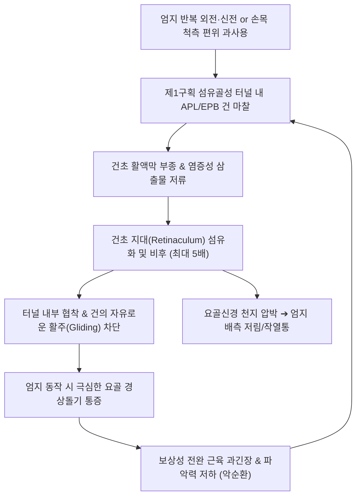
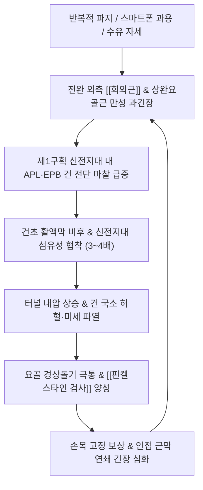

# 🩺 드퀘르벵 건초염

> **핵심 3줄 요약 (Key Summary)**:
> - 📍 **병소 부위 & 해부·병태생리**: 손목 요측(엄지손가락 쪽) 신근지대 제1신전구획(1st Extensor Compartment)을 통과하는 **[[단무지신근]]건(EPB)**과 **[[장무지외전근]]건(APL)** 및 이를 둘러싼 건초(Tendon sheath)의 반복 마찰에 의한 협착성 건초염(Stenosing Tenosynovitis).
> - 🚩 **전형적 임상 양상**: 엄지손가락을 쥐거나 비틀 때 요골 경상돌기 부위의 날카로운 통증, 물건을 쥐는 힘 약화, 젖먹이 아기를 안아 올리거나 스마트폰 타이핑 시 통증 급증.
> - 🛠️ **핵심 검사 & 치료 전략**: 핑켈스타인 검사([[Finkelstein Test]]), 아이히호프 검사([[Eichhoff Test]]) 양성; [[양계혈]](LI5), [[열결혈]](LU7), [[편력혈]](LI6) 자침 및 소염약침/봉약침; 엄지 스파이카 부목(Thumb spica) 고정; [[서경탕]](舒經湯) 가감 처방.
> - ⚠️ **응급 의뢰 레드플래그**: 요골 신경 천지(Superficial radial nerve) 손상에 따른 엄지 등쪽의 심한 작열통 및 감각 마비; 국소 발적·고열을 동반한 화농성 건초염.

---

## 📌 목차
1. [질환 개요 & 해부학적 병태생리](#1-질환-개요--해부학적-병태생리)
2. [병태생리 메커니즘 & 생체역학적 악순환 네트워크](#2-병태생리-메커니즘--생체역학적-악순환-네트워크)
3. [임상 증상 & 이학적 검사(Physical Exam) 알고리즘](#3-임상-증상--이학적-검사physical-exam-알고리즘)
4. [감별 진단 매트릭스 (Differential Diagnosis)](#4-감별-진단-매트릭스-differential-diagnosis)
5. [한의 통합 치료 프로토콜 (침·약침·추나·한약)](#5-한의-통합-치료-프로토콜-침약침추나한약)
6. [양방 치료 & 병용·의뢰 기준 (Conventional Treatment & Referral)](#6-양방-치료--병용의뢰-기준-conventional-treatment--referral)
7. [재활 운동 & 생활습관 티칭 가이드](#7-재활-운동--생활습관-티칭-가이드)
8. [💡 사용자 진료실 핵심 필기 & 임상 노하우 (Melt-In 잔여 심화 집약)](#8--사용자-진료실-핵심-필기--임상-노하우-melt-in-잔여-심화-집약)
9. [출처 및 학술 참고 문헌 (References)](#9-출처-및-학술-참고-문헌-references)

---

## 1. 질환 개요 & 해부학적 병태생리

### 1) 해부학적 구조와 제1신전구획 (1st Extensor Compartment)
* **신근지대 제1구획의 해부**:
  * 완관절 배측 요골 경상돌기(Radial styloid process) 상방을 덮고 있는 섬유골성 터널(Fibro-osseous tunnel).
  * 이 터널 내부를 **장무지외전근(Abductor Pollicis Longus, APL)**과 **단무지신근(Extensor Pollicis Brevis, EPB)**의 건이 하나의 활액낭성 건초에 싸여 통과함.
* **해부학적 변이 (Subcompartment / Septum)**:
  * 인구의 약 30~50%에서 제1구획 내부에 섬유성 격막(Septum)이 존재하여 APL과 EPB 건이 분리된 하부 구획(Subcompartment)을 가짐.
  * 또한 APL 건이 2~4가닥의 복수 건 다발(Multiple slips)로 갈라지는 변이가 흔하며, 이러한 해부학적 변이는 마찰 면적을 증가시켜 건초염 호발 및 주사 치료 실패의 주요 원인이 됨.
* **인접 신경 구조**:
  * 요골신경 천지(Superficial Branch of Radial Nerve, SBRN)가 제1구획 바로 표재층을 비스듬히 가로질러 엄지 및 검지 배측 피부 감각을 담당하므로, 염증 비후 시 신경 압박 증상이 쉽게 병발함.

![[드퀘르벵건초염_01_해부_제1신전구획.jpg|450]]
> [그림 1: ① 해부 구조 — 제1신전구획(APL·EPB 건)과 해부학적 코담배갑] 손등 실사에 장무지외전근(APL)·단무지신근(EPB) 건 경로와 요골 경상돌기, 해부학적 코담배갑(Anatomical snuffbox) 위치를 표시한 사진 — 제1구획 건초의 마찰 병소를 확인한다. 출처: File:Anatomicalsnuffbox(MG0853a).jpg (CC BY-SA 4.0)

### 2) 질환의 정의 및 역학
* 1895년 스위스 외과의사 Fritz de Quervain에 의해 최초 기술된 질환으로, 건 자체의 염증이라기보다는 건을 감싸는 **건초의 점액성 변성 및 비후로 인한 협착증(Stenosing tendovaginitis)**이 본태임.
* 30~50대 여성에서 남성보다 6~10배 호발하며, 특히 출산 후 호르몬 변화(릴랙신 감소) 및 수유기 아기를 안아 올리는 반복 동작(Mommy's wrist)에서 폭발적으로 발생함.

---

## 2. 병태생리 메커니즘 & 생체역학적 악순환 네트워크

### 1) 생체역학적 전단력 기전
* 손목을 척측으로 꺾은 상태(Ulnar deviation)에서 엄지손가락을 강하게 쥐거나 펼 때, APL과 EPB 건은 요골 경상돌기의 단단한 능선 위에서 지렛대처럼 꺾이며 최대의 마찰 압력을 받음.
* 스마트폰을 한 손으로 쥐고 엄지손가락으로 화면 전체를 스크롤하는 동작이 현대적인 주 발병 기전으로 대두됨.

### 2) 조직학적 특성: 비염증성 점액성 변성
* 초기 급성기를 지나면 염증 세포의 침윤보다는 건초 내 교원질(Collagen)의 점액성 변성(Myxoid degeneration), 혈관 증식 및 섬유연골성 화생(Fibrocartilaginous metaplasia)이 주를 이루어 조직이 두껍고 질겨짐.

---

## 3. 임상 증상 & 이학적 검사(Physical Exam) 알고리즘

### 1) 주요 임상 증상
* **요골 경상돌기 국소 통증**: 엄지손가락 쪽 손목 관절의 찌르는 듯한 통증, 압통, 종창.
* **기능적 장애**: 냄비 들기, 젖병 잡기, 문고리 돌리기, 열쇠 돌리기, 젓가락질 시 극심한 통증으로 물건을 떨어뜨림.
* **염발음 및 삐걱거림 (Crepitus)**: 엄지를 움직일 때 가죽 마찰음 같은 '사각사각' 또는 '딸깍'하는 느낌.

### 2) 진료실 핵심 이학적 검사 알고리즘
1. **핑켈스타인 검사 ([[Finkelstein Test]])**:
   * 환자의 엄지손가락을 검사자가 잡고 장축으로 가볍게 견인하면서 손목을 척측으로 빠르게 편위시킴.
   * 요골 경상돌기 부위에 찢어지는 듯한 날카로운 통증이 유발되면 양성 (오리지널 검사).
2. **아이히호프 검사 ([[Eichhoff Test]])**:
   * 환자 스스로 엄지손가락을 네 손가락 안에 넣어 주먹을 쥐게 한 뒤 손목을 척측으로 꺾음. 통증 유발 시 양성 (위양성률이 다소 높으므로 Finkelstein과 병행).
3. **WHAT 검사 (Wrist Hyperflexion and Abduction of the Thumb)**:
   * 손목을 최대로 굴곡시키고 엄지손가락을 외전시키는 방향으로 환자가 능동적으로 힘을 줄 때 검사자가 저항을 가함. 핑켈스타인보다 특이도가 높음.
4. **해부학적 코담배갑(Snuffbox) 압통 감별**:
   * 제1구획보다 원위부인 주상골 부위를 눌러 주상골 골절 여부 배제.

![[드퀘르벵건초염_02_이학검사_핑켈스타인.jpg|450]]
> [그림 2: ② 이학적 검사 — 핑켈스타인 검사(Finkelstein test)] 엄지손가락을 네 손가락으로 감싸 쥔 자세에서 손목을 척측으로 편위시켜 요골 경상돌기 통증을 유발하는 원형 검사 실사. 출처: File:Finkelsteinstest.jpg (Public domain)

![[드퀘르벵건초염_03_이학검사_핑켈스타인화살표.jpg|450]]
> [그림 3: ② 이학적 검사 — 손목 척측 편위 방향 표시] 검사자가 엄지를 잡고 손목을 척측(파란 화살표 방향)으로 꺾을 때 제1구획에 장력이 집중되어 찢어지는 통증이 재현된다. 출처: File:FinkelsteinTestArrow.jpg (Public domain)

![[드퀘르벵건초염_04_이학검사_아이히호프.jpg|450]]
> [그림 4: ② 이학적 검사 — 아이히호프 검사(Eichhoff test)] 환자 스스로 엄지를 감싸 주먹을 쥔 뒤 손목을 척측 굴곡하는 변형 검사 실사. 위양성률이 있어 핑켈스타인 검사와 병행한다. 출처: File:EichhoffstestforDeQuervainstenosynovitis.jpg (CC BY-SA 3.0)

---

## 4. 감별 진단 매트릭스 (Differential Diagnosis)

| 질환명 | 주 통증 부위 및 양상 | 핵심 구별 포인트 | 필수 감별 검사 / 치료 차이점 |
| :--- | :--- | :--- | :--- |
| **드퀘르벵 건초염** | 요골 경상돌기(제1구획) 국소 압통 및 종창 | **Finkelstein / Eichhoff 검사 양성**, 엄지 동작 시 악화 | 손목 초음파(제1구획 건초 비후 및 혈류 증가) |
| **교차 증후군 ([[Intersection Syndrome]])** | 요골 경상돌기 **근위부 4~6cm** 전완 배측 | 제1구획(APL/EPB)과 제2구획(ECRL/ECRB)의 교차부 마찰음 | 전완 배측 직접 압통, 손목 신전 시 삐걱거림 |
| **수근중수관절 관절염 ([[제1 CMC 관절염]])** | 엄지 기저부(CMC 관절) 둔통 | **Grind Test (압박 회전 검사) 양성**, 뼈의 아탈구 | 손목 X-ray에서 제1 CMC 관절 간격 협소 및 골극 |
| **[[주상골 골절]](Scaphoid Fracture)** | 해부학적 코담배갑(Anatomical Snuffbox) 심부 | **외상 병력(손 짚고 넘어짐)**, Snuffbox 바닥 직접 압통 | 손목 Scaphoid view X-ray, CT/MRI 촬영 |
| **요골신경 천지 포착증 (Wartenberg 증후군)** | 전완 원위 외측 및 엄지 배측 작열통 | Tinel sign 양성, 운동 장애 없이 **감각 이상/저림 우세** | 근전도/신경전도 검사, 손목 시계 압박 배제 |

---

## 5. 한의 통합 치료 프로토콜 (침·약침·추나·한약)

### 1) 침구 치료 (Acupuncture)
* **국소 핵심 혈위**:
  * [[양계혈]](LI5): 해부학적 코담배갑 함요처. EPB 건과 EPL 건 사이.
  * [[열결혈]](LU7): 요골 경상돌기 상방 1.5촌, 두 힘줄 사이 틈새. 폐경의 낙혈, 요골부 통증의 특효혈.
  * [[편력혈]](LI6): 양계혈 상방 3촌. 대장경의 낙혈, 제1구획 상부 근막 이완.
  * [[태연혈]](LU9): 요골동맥 박동처 외측 함요부. 맥회(脈會), 관절 영양 공급.
* **근복 자침 기법**:
  * 전완 외측 중간부의 APL 및 EPB 근복(곡지혈 하방 4~5촌)에 호침을 심자하여 근육 긴장도를 낮추고 건에 걸리는 장력을 선제적으로 해제.
* **미세 온침 및 뜸 요법**:
  * 만성화된 건초 비후 부위에 간접구(스티커뜸) 또는 온침을 적용하여 국소 순환 개선 및 교원질 정상화 유도.

### 2) 약침 치료 (Pharmacopuncture)
* **약침 제제 선택**:
  * **신바로약침 / 소염약침**: 급성기 건초 내 염증 삼출물 및 부종 억제에 1차 선택.
  * **BV(봉약침)**: 3주 이상 지속된 만성 협착성 건초염에 1:10,000~1:30,000 희석액 주입. 건초 주변 혈관 신생 및 결합조직 재형성 유도.
  * **중성어혈약침**: 산후 어혈 및 찌르는 듯한 국소 압통에 적용.
* **시술 방법**:
  * 요골 경상돌기 상방 건초 주위 결합조직에 30G 니들로 포인트당 0.1cc씩 총 0.5~1.0cc 주입 (건 실질 내 직접 주입 회피).

### 3) 추나 및 근막 이완 수기요법 (Chuna & MFR)
* **APL/EPB 근막 이완술 (Myofascial Release)**:
  * 술자의 엄지로 전완 외측 근복을 압박하면서 환자의 엄지손가락을 수동으로 굴곡-신전시켜 유착된 근막 분리.
* **요수근관절 견인 및 수근골 가동술**:
  * 주상골과 대다각골을 원위부로 견인하여 제1열 관절 간격 확보.

### 4) 변증별 맞춤 한약 처방 (Herbal Medicine)
* **기체어혈 (氣滯瘀血) - 산후 육아 과사용형**:
  * 증상: 출산 후 손목이 붓고 찌르듯 아픔, 찬물에 닿으면 시리고 통증 악화.
  * 처방: **[[당귀수산]](當歸鬚散)** 또는 **[[궁귀조혈음]](芎歸調血飮)** 가감 (생강, 대조, 익모초 증량).
* **풍한습비 (風寒濕痺) - 직업적 과사용 만성형**:
  * 증상: 손목 관절이 뻣뻣하고 무거우며 비 오는 날 쑤심.
  * 처방: **[[서경탕]](舒經湯)** 또는 **[[오적산]](五積散)** 가감 (강황, 해동피, 계지).
* **기혈허약 (氣血虛弱) - 체력 저하 만성 건초염**:
  * 증상: 손에 힘이 들어가지 않고 물건을 자주 떨어뜨림, 안색 창백.
  * 처방: **보중익기탕(補中益氣湯)** 또는 **팔진탕(八珍湯)** 가미 (속단, 우슬).

---

## 6. 양방 치료 & 병용·의뢰 기준 (Conventional Treatment & Referral)

### 1) 보존적 치료 및 고정 요법
* **엄지 스파이카 부목 (Thumb Spica Splint)**:
  * 엄지 중수지관절과 손목을 동시에 고정하는 스파이카 부목을 2~4주간 착용. 손목만 고정하고 엄지를 자유롭게 두는 일반 손목 보호대는 효과가 없음.
* **경구 약물 요법**:
  * NSAIDs (Meloxicam 7.5mg qd, Aceclofenac 100mg bid) 1~2주 단기 투여.

### 2) 주사 치료 (Corticosteroid Injection)
* **초음파 유도하 건초 내 주사**:
  * Triamcinolone 10~20mg + 1% Lidocaine을 제1구획 건초 내로 주입.
  * 단기 완치율이 70~80%에 달하나, 피부 탈색(Depigmentation), 피하지방 위축, 요골신경 천지 손상 위험이 존재함. 격막(Septum)으로 분리된 경우 EPB 구획을 놓쳐 재발하는 경우가 흔함.

### 3) 수술적 치료 적응증 (Surgical Indication)
* **제1신전구획 건초 절개술 (Release of 1st Extensor Compartment)**:
  * 6개월 이상의 보존적 치료(부목, 침구, 주사)에도 호전이 없는 난치성 환자.
  * 수술 시 서브컴파트먼트 격막을 반드시 찾아 완전 절개해야 재발하지 않음.

### 4) 양방·전문과 의뢰 기준 (Referral Criteria)
* **정형외과 수부외과 즉시 의뢰**:
  * 주사 치료 후 발생한 심한 신경병증성 통증(Wartenberg 증후군 악화).
  * 3회 이상의 보존적 치료에도 일상생활이 불가능한 심한 방아쇠 현상(Triggering of thumb).

---

## 7. 재활 운동 & 생활습관 티칭 가이드

### 1) 단계별 스트레칭 및 가동 운동
* **엄지 신전근 편심성 강화 운동 (Eccentric Exercise)**:
  * 아픈 손의 엄지를 반대 손으로 잡고 천천히 손바닥 쪽으로 당겨 15초간 유지 (하루 5회).
* **고무줄 엄지 벌리기 운동 (아급성기)**:
  * 엄지와 나머지 손가락에 고무줄을 끼우고 손가락을 부채처럼 벌리는 외전 등척성 운동.

### 2) 산모 및 일상생활 티칭 수칙
* **아기 안아 올리기 자세 교정 (Scoop Technique)**:
  * 아기를 안아 올릴 때 엄지와 검지 사이 'L'자 홈으로 아기 겨드랑이를 받치지 말고, **손바닥 전체와 전완으로 아기 엉덩이와 등을 받쳐 안아 올리도록** 지도.
* **스마트폰 사용 습관**:
  * 한 손으로 스마트폰을 쥐고 엄지로 스크롤하지 말고, 두 손으로 파지하거나 음성 입력 활용.

---

## 8. 💡 사용자 진료실 핵심 필기 & 임상 노하우 (Melt-In 잔여 심화 집약)

### 1) Thumb Spica 보호대 처방의 성패 요건
* 환자가 일반 약국에서 파는 손목 보호대를 차고 와서 "보호대를 해도 전혀 낫지 않는다"고 하는 경우가 허다함.
* 일반 보호대는 손목만 감싸고 엄지손가락을 자유롭게 움직이게 하므로, 엄지를 움직일 때마다 건이 터널 안을 긁고 지나가 염증이 악화됨.
* 반드시 **엄지 첫째 마디(중수지관절)까지 플라스틱이나 알루미늄 지지대로 꺾이지 않게 잡아주는 '엄지 스파이카(Thumb spica)'**를 착용시켜야 함.

### 2) APL 근복과 열결혈의 콤비네이션 자침
* 아픈 곳(요골 경상돌기)에만 침을 놓으면 이미 부어있는 건초에 자극을 주어 오히려 다음 날 통증이 심해질 수 있음.
* **임상 노하우**: 전완 중간부의 장무지외전근(APL) 근복을 찾아 침전기자극을 걸어 팽팽해진 힘줄의 텐션을 먼저 털어준 뒤, 열결혈 부위에 신바로약침 0.3cc를 피하층으로 부드럽게 주입하면 2~3회 치료만으로 핑켈스타인 검사가 음성으로 전환됨.

---

## 9. 출처 및 학술 참고 문헌 (References)

* The Use of Platelet-Rich Plasma for De Quervain's Tenosynovitis: A Systematic Review With Limited Meta-Analysis. [PMID: 42445748]

* Ilyas AM, Ast M, Schaffer AA, Thoder J. De Quervain tenosynovitis of the wrist. J Am Acad Orthop Surg. 2007;15(12):757-764.

* Howell ER. Conservative care of de Quervain's tenosynovitis/tendinopathy in a warehouse worker and recreational cyclist: a case report. J Can Chiropr Assoc. 2012;56(2):121-127.

* Peters-Veluthamaningal C, van der Windt DA, Winters JC, Meyboom-de Jong B. Corticosteroid injection for de Quervain's tenosynovitis: a systematic review. Br J Gen Pract. 2009;59(565):e266-e272.

## 📎 통합 이관 — 근골격계 질환/상지/드퀘르뱅 증후군

> 2026-10-08 중복 통합으로 이 노트에 흡수. 원본은 `_중복통합_백업_20261008/`에 보존.

# 🩺 드퀘르뱅 증후군 (de Quervain's Tenosynovitis, M65.4)

> **핵심 3줄 요약 (Key Summary)**:
> - 📍 병소 부위 & 해부·병태생리: 손목 요골 경상돌기(Radial Styloid) 상부 제1 배측 신전건 구획(First Dorsal Compartment)을 통과하는 [[장무지외전근]](APL)과 [[단무지신근]](EPB)의 협착성 건초염.
> - 🚩 전형적 임상 양상 & 3대 징후: 요골 경상돌기 국소 압통 및 건초 비후, 엄지 움직임 시 칼로 베는 듯한 극통, 찻잔을 떨어뜨리는 파지력 저하.
> - 🛠️ 핵심 감별 검사 & 한·양방 다각적 치료 전략: [[핀켈스타인 검사]](Finkelstein's Test) 양성. 신전지대 미세침도 감압술, 봉약침(양계·열결), 엄지 스피카 부목 고정 및 [[서경탕]]·[[오적산]].
> - ⚠️ 응급 의뢰 레드플래그 & 악화 요인: 무리한 자가 손목 꺾기 스트레칭 절대 금기(건 파열 위험), 천요골신경염([[바르텐베르크 증후군]]) 및 제1 CMC 관절염과의 감별.

---

## 📌 목차
1. [질환 개요 & 해부학적 병태생리](#1-질환-개요--해부학적-병태생리)
2. [병태생리 메커니즘 & 생체역학적 악순환 네트워크](#2-병태생리-메커니즘--생체역학적-악순환-네트워크)
3. [임상 증상 & 이학적 검사(Physical Exam) 알고리즘](#3-임상-증상--이학적-검사physical-exam-알고리즘)
4. [감별 진단 매트릭스 (Differential Diagnosis)](#4-감별-진단-매트릭스-differential-diagnosis)
5. [한의 통합 치료 프로토콜 (침·약침·추나·한약)](#5-한의-통합-치료-프로토콜-침약침추나한약)
6. [양방 치료 & 병용·의뢰 기준 (Conventional Treatment & Referral)](#6-양방-치료--병용의뢰-기준-conventional-treatment--referral)
7. [재활 운동 & 생활습관 티칭 가이드](#6-재활-운동--생활습관-티칭-가이드)
8. [💡 사용자 진료실 핵심 필기 & 임상 노하우 (Melt-In 잔여 심화 집약)](#7--사용자-진료실-핵심-필기--임상-노하우-melt-in-잔여-심화-집약)
9. [출처 및 학술 참고 문헌 (References)](#8-출처-및-학술-참고-문헌-references)

---

## 1. 질환 개요 & 해부학적 병태생리

### (1) 제1 배측 구획(First Dorsal Compartment)의 섬유골성 터널 구조
![[Pasted image 20240114190456.png|350]]
> [그림 1: ① 병태생리·영상 — 제1 배측 구획을 통과하는 APL(장무지외전근) 및 EPB(단무지신근)의 주행 및 신전지대 협착 도해]

* **해부학적 경계 (Anatomical Boundaries)**:
  * 수근관절 배면에는 신전지대(Extensor Retinaculum)에 의해 6개의 독립된 신전건 구획이 형성되어 있다.
  * 이 중 가장 요측(엄지 쪽)에 위치한 **제1 배측 구획**은 요골 경상돌기(Radial Styloid Process)의 얕은 골성 구(Sulcus)를 바닥으로 하고, 두꺼운 신전지대 섬유막을 지붕으로 하는 길이 약 $1\sim 2\text{ cm}$의 견고한 섬유골성 터널(Fibro-osseous Tunnel)이다.
* **통과하는 두 힘줄의 기능**:
  * **[[장무지외전근]](Abductor Pollicis Longus, APL)**: 제1중수골 기저부에 정지하여 엄지손가락을 손바닥 평면에서 바깥쪽으로 벌림(외전).
  * **[[단무지신근]](Extensor Pollicis Brevis, EPB)**: 엄지 기절골 기저부에 정지하여 중수수지관절(MCP)을 신전시킴.

---

## 2. 병태생리 메커니즘 & 생체역학적 악순환 네트워크

![[Extensor_pollicis_brevis_anatomy.png|350]]
> [그림 2: ② 관련 해부 구조물 — 단무지신근(EPB) 및 장무지외전근(APL)의 해부학적 기시·정지 구조]

### (1) 직업적·일상적 과사용 (Overuse & Repetitive Strain)
* **산모 및 육아자 (Mom's Thumb / Baby Wrist)**: 출산 후 릴랙신(Relaxin) 호르몬에 의한 인대 이완 상태에서, 아이의 머리와 목을 손목만으로 받쳐 들어 올리는 반복 동작.
* **스마트폰 과용 (Texting Thumb)**: 한 손으로 스마트폰을 쥐고 엄지손가락만으로 화면을 광범위하게 스와이프하거나 타이핑하는 동작.
* **반복적 파지 노동**: 가위질, 마우스 클릭, 요리사(칼질), 바리스타(포타필터 장착), 골프·테니스·배드민턴 라켓 스포츠.

### (2) 근막 연쇄 및 전완부 기능부전
* 전완 후외측의 [[회외근]](Supinator) 및 상완요골근(Brachioradialis)의 만성 과긴장.
* 회외근 긴장은 인접한 [[요골신경]] 심지(PIN) 및 천요골신경(SBRN)을 압박하여 요측 건막의 통각 민감도를 증폭시킴.

---

## 3. 임상 증상 & 이학적 검사(Physical Exam) 알고리즘

### (1) 주요 임상 증상
* **요골 경상돌기 부위의 날카로운 국소 통증**:
  * 엄지손가락을 움직이거나 물건을 쥘 때, 병뚜껑을 돌려 열 때 손목 엄지 쪽 뼈 돌출부에 칼로 베는 듯한 극통 발생.
* **국소 압통 및 건초 비후**:
  * 요골 경상돌기 직상방을 촉진하면 콩알만 한 단단한 결절이 만져지거나 붓기가 관찰됨.
* **마찰음(Crepitus) 및 걸림 현상**:
  * 손목을 움직일 때 건초 내부에서 눈 밟는 소리 같은 바스락거림(Crepitus)이 느껴지거나 엄지 동작의 뻣뻣함 호소.
* **악력 약화**:
  * 통증으로 인해 물건을 쥐는 힘(Grip Strength) 및 핀치력(Pinch Strength)이 급격히 저하되어 찻잔을 떨어뜨리기도 함.

### (2) 표준 이학적 검사법: [[핀켈스타인 검사]] (Finkelstein's Test)
* **검사 절차**:
  1. 환자의 전완을 엄지가 위로 오도록 중립위(Neutral position)로 탁자에 안착시킴.
  2. 검사자가 요골 경상돌기 제1신전건 구획의 국소 압통을 확인.
  3. 검사자가 환자의 엄지손가락을 한 손으로 부드럽게 감싸 쥠.
  4. 손목을 아래쪽(척측, Ulnar deviation) 방향으로 수동 견인 및 신장시킴.
* **양성 소견**:
  * APL과 EPB 건이 당겨지며 요골 붓돌 부위에 격렬하고 날카로운 통증이 즉각 재현됨.

![[핀켈스타인검사_4단계_손목척측편위_신전건신장_통증유발.jpg|380]]
> [이학적 검사 실사] 핀켈스타인 검사 4단계 (Finkelstein's Test). 엄지손가락을 파지한 채 손목을 척측으로 수동 편위시켜 제1구획 신전건을 강하게 신장시키며 통증을 유발한다.

---

## 4. 감별 진단 매트릭스 (Differential Diagnosis)

| 감별 질환 | 호발 병소 및 원인 | 주소증 차이점 | 특이적 이학적 검사 소견 |
| :--- | :--- | :--- | :--- |
| **[[드퀘르벵 건초염]]** (본 질환) | 요골 경상돌기 제1신전건 구획 | 엄지 기저부 및 손목 요측 칼로 베는 극통 | [[핀켈스타인 검사]] 양성, 제1구획 압통 |
| **[[아이히호프 검사]] (자가)** | 자가 주먹 쥐고 손목 꺾기 | 정상인에서도 50% 통증 유발 (위양성) | 자가 주먹 굴곡 시 통증 (진단 특이도 낮음) |
| **제1 CMC 관절염** | 엄지뿌리 수근중수관절 퇴행 | 엄지 기저부 관절 깊은 뻐근한 통증 | **그라인드 검사(Grind Test)** 양성 |
| **[[바르텐베르크 증후군]]** | 천요골신경 포착 | 손등 요측 및 엄지 배면 저림·작열통 | 요골 경상돌기 상방 [[티넬 징후]] 양성 |
| **교차 증후군 (Intersection)** | 손목 상방 4~5cm 건 교차부 | 손목 4~5cm 근위부 배면 마찰음 및 부종 | 제1구획·제2구획 교차부 압통 |

---

## 5. 한의 통합 치료 프로토콜 (침·약침·추나·한약)

![[핀켈스타인검사_2단계_요골붓돌_제1신전건구획촉지.jpg|380]]
> [그림 3: ③ 치료·시술점 — 요골 경상돌기 제1신전건 구획(양계·열결) 침구·약침·침도 시술점 촉진 및 자입 도해]

### (1) 침구 치료 (Acupuncture)
* **제1구획 국소 취혈 및 건초 감압**:
  * 양계(LI5), 열결(LU7), 태연(LU9): 요골 경상돌기 주변 활액막염 진정 및 국소 기혈 순환 촉진.
  * ⚠️ 요골동맥 주행과 천요골신경 손상을 방지하기 위해 사자(Oblique insertion 10~15mm) 또는 평자(Horizontal insertion)로 안전하게 진입.
* **전완부 근복 및 협응근 이완**:
  * 수삼리(LI10), 곡지(LI11), 공최(LU6): APL 및 EPB의 근복(전완 중하 1/3 요측)과 상완요골근 경결 해소.
  * 척택(LU5), 주료(LI12): [[회외근]] 긴장 완화.

### (2) 약침 치료 (Pharmacopuncture)
* **건초 내(Peritendinous) 무균성 항염 약침**:
  * **봉약침(BV, Bee Venom)** 또는 황련해독탕 약침, 신바로약침 0.3~0.5cc(30G 1/2인치)를 제1구획 건초 주변 결합조직에 정밀 주입.
  * 강력한 항염증·소종 작용을 통해 비후된 활액막 부종을 신속히 가라앉히고 통증 차단.
  * ⚠️ 건 실질(Tendon Substance) 내로 직접 바늘을 찌르지 않고 건초 공간(Sheath space)에 얕게 시술하는 것이 핵심.

### (3) 미세침도 요법 (Acupotomy)
* **만성 협착성 신전지대 절개술**:
  * 2~3개월 이상 만성화되어 섬유화된 신전지대가 힘줄을 조이고 있는 경우, 소침도(0.35×40mm)를 활용하여 요골경상돌기 상부의 비후된 지대 섬유를 힘줄 주행 방향과 평행하게 종축으로 1~2mm 부분 미세 절개(감압)하여 터널 내압을 즉각 해소.

### (4) 추나 요법 (Chuna Manual Therapy)
* **수근골 및 요척관절 가동술**:
  * 주상골(Scaphoid) 및 대능형골(Trapezium)의 활주 수기법을 통해 요수근관절의 불균형 압박 해소.
  * 전완부 요골-척골 간 근막 이완(Myofascial Release) 및 상완요골근·회외근 등장성 수축 후 이완(MET).

### (5) 한약 치료 (Herbal Medicine)
* **급성기 풍한습비·어혈**: [[서경탕]](舒經湯), [[오적산]](五積散) 가미방으로 국소 건초 부종 및 어혈 완화.
* **만성기 간신부족·기혈허약 (산모 건초염)**: [[궁귀조혈음]](芎歸調血飮) 합 [[사물탕]](四物湯) 가감으로 산후 기혈 보충 및 인대 건 강화.

---

## 6. 양방 치료 & 병용·의뢰 기준 (Conventional Treatment & Referral)

> 🎯 **이 섹션의 목적**: 환자가 **양방약을 이미 복용 중인 경우가 많다.** 한의원 1차 진료에서 양방 치료를 이해하고, 병용 가능·주의·금기를 판단하며, 언제 의뢰할지 결정한다.

* **약물 치료 (Medication)**:
  * 계열별 약물·용량·기간 — 국내 처방 관행 반영.
  * 작용 기전과 한의 치료와의 상호작용.
* **비약물 시술 (Procedures)**:
  * 주사·차단술·물리치료·보조기 등.
* **수술·시술 적응증 (Surgical Indication)**:
  * 언제 수술로 가는가 — 절대·상대 적응증, 수술 후 경과.
* **한의 병용 판단 (Combination Therapy)**:
  * 병용 가능 / 주의 / 금기. 복용 중 환자의 감량 타이밍·반동 현상.
* **양방·전문과 의뢰 기준 (Referral Criteria)**:
  * 응급 의뢰 트리거와 전문과 의뢰 기준(정형외과·신경외과·내과 등).

	(작성 필요)

---

## 7. 재활 운동 & 생활습관 티칭 가이드

### (1) 보호대 적용 원칙 (Thumb Spica Splint)
* 단순 손목 밴드는 엄지 움직임을 제어하지 못해 무용지물임.
* 반드시 엄지 중수수지(MCP) 관절과 손목을 동시에 고정해주는 **엄지 스피카 부목(Thumb Spica Splint)**을 최소 1~2주간 착용하여 APL/EPB 건의 마찰을 원천 차단.

### (2) 신경근 재활 및 단계적 운동
* **급성기**: 절대적 안정(Immobilization) 및 냉찜질.
* **회복기 (통증 소퇴 후)**:
  * 엄지 고무줄 저항 외전 운동(Finger Band Abduction): 고무줄을 손가락에 끼우고 엄지를 바깥으로 벌리는 가벼운 등척성 수축.
  * 전완 회외/회내 밸런스 운동: 가벼운 해머나 막대를 쥐고 천천히 손목을 회전시키는 조절력 훈련.

### (3) 일상생활 티칭
* 스마트폰 스크롤 시 엄지손가락 대신 검지손가락을 사용하도록 습관 교정.
* 아기를 안을 때 손목만 꺾어 받치지 말고, 전완 전체와 팔꿈치 안쪽으로 아기의 체중을 지탱하도록 지도.

---

## 8. 💡 사용자 진료실 핵심 필기 & 임상 노하우 (Melt-In 잔여 심화 집약)

* **원장님 필기 핵심 융합: 회외근(Supinator)과 전완부 긴장의 숨은 연결고리**:
  * 드퀘르뱅 환자들은 손목만 아프다고 호소하지만, 전완부 외측 상완요골근과 [[회외근]](Supinator)을 만져보면 바위처럼 굳어 있는 경우가 대다수다.
  * 회외근이 과긴장되면 요골 경상돌기 쪽으로 향하는 천요골신경이 압박되어 손목 요측의 통증 역치가 현저히 낮아지며, APL/EPB 힘줄이 수축할 때 근위부 견인력이 비정상적으로 강해진다.
  * 따라서 손목 양계·열결 치료에만 머물지 않고, 수삼리 부근의 회외근 발통점을 침이나 침도로 함께 풀어주어야 건초염의 재발 고리를 완벽히 끊을 수 있다.
* **산모 환자의 티칭 및 심리적 지지**:
  * 산후 1~3개월 차 산모들은 수유와 육아로 손을 쉴 수가 없어 건초염이 극도로 악화된 상태로 내원한다.
  * 스테로이드 주사는 수유 중단 우려 및 건 파열, 피부 탈색(Depigmentation) 부작용이 크므로, 봉약침 및 무독성 소염약침 치료가 매우 안전하고 효과적인 대안이 된다.
  * "손목을 굽혀서 아이 머리를 받치지 마시고, 수유 쿠션을 높여 팔꿈치 전체로 아이 등을 감싸 안으세요"라는 실전 자세 교정이 치료 성공의 50%를 차지한다.
* **초음파 하 격막(Subcompartment) 존재 시 예후 설명**:
  * 초음파로 제1구획을 횡단 스캔했을 때 APL과 EPB 사이에 뼈 능선(Bony ridge)이나 섬유성 격막이 관찰된다면, 환자에게 "힘줄 방이 둘로 나뉘어 있어 치료 기간이 일반인보다 2배 이상 길어질 수 있습니다"라고 미리 예후를 설명하여 치료 신뢰도를 확보해야 한다.

---

## 9. 출처 및 학술 참고 문헌 (References)

* **Ilyas AM, Ast M, Schaffer AA, Thoder J. (2007)**. *De quervain tenosynovitis of the wrist*. Journal of the American Academy of Orthopaedic Surgeons, 15(12), 757-764. [PMID: 18063716](https://pubmed.ncbi.nlm.nih.gov/18063716/)
  * `[연구 요약]`: 드퀘르뱅 건초염의 해부학적 격막 변이, 병태생리, 핀켈스타인 검사 진단법 및 보존적 치료(부목, 주사 요법)와 수술적 감압술의 치료 알고리즘을 종합 정리한 미국정형외과학회(JAAOS) 공식 종설.
* **Dawson C, Mudgal CS. (2010)**. *Staged description of the Finkelstein test*. Journal of Hand Surgery (American Volume), 35(9), 1513-1515. [PMID: 20709467](https://pubmed.ncbi.nlm.nih.gov/20692781/)
  * `[연구 요약]`: 핀켈스타인 검사를 4단계 점진적 신장 프로토콜로 세분화하여, 흔히 오용되는 아이히호프 검사의 높은 위양성 문제를 극복하고 진단 특이도를 극대화한 핵심 연구.
* **Hadianfard M, Hosseinzadeh S, Shenavandeh S. (2014)**. *Efficacy of acupuncture versus local methylprednisolone acetate injection in De Quervain's tenosynovitis: a randomized controlled trial*. Journal of Acupuncture and Meridian Studies, 7(3), 115-121. [PMID: 24929455](https://pubmed.ncbi.nlm.nih.gov/24929455/)
  * `[연구 요약]`: 드퀘르뱅 건초염 환자를 대상으로 침 치료와 국소 스테로이드 주사를 비교한 무작위 대조 임상시험(RCT)으로, 침 치료군이 스테로이드 주사군과 동등한 통증 감소 및 관해율을 보이며 부작용 없는 안전한 치료법임을 입증함.
