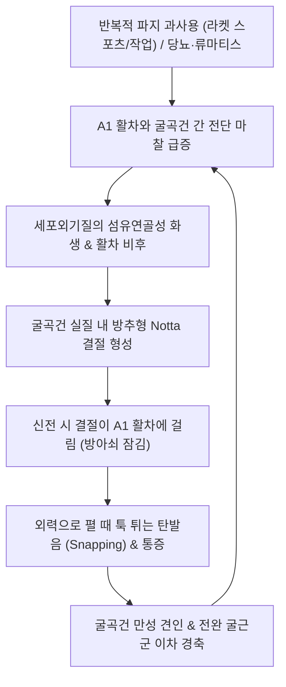

---
aliases:
  - 방아쇠수지
  - 방아쇠손가락
  - 탄발지
  - Trigger Finger
  - Stenosing Tenosynovitis of Digital Flexor
tags:
  - 이론
  - 질환
  - 근골격계
  - 상지
  - 수부
  - 건초염
title: 방아쇠 수지
date: 2026-09-24
출처: "PMID: 19468879"
---

# 🩺 방아쇠 수지 (Trigger Finger / 탄발지, M65.3)

> **핵심 3줄 요약 (Key Summary)**:
> - 📍 병소 부위 & 해부·병태생리: 중수수지관절(MCP) 바닥의 제1 윤상 활차(A1 Pulley) 부위에서 [[천지굴근]](FDS)·[[심지굴근]](FDP)·[[장무지굴근]](FPL) 힘줄이 비후·결절화(Notta 결절)되어 터널에 걸리며 발생하는 협착성 건초염.
> - 🚩 전형적 임상 양상 & 3대 징후: 손가락 굴신 시 딸깍거리는 탄발음(Clicking), 아침 기상 시 PIP/DIP 관절 잠김(Locking), MCP 관절 장측 결절성 압통 (Quinnell 0~4기).
> - 🛠️ 핵심 감별 검사 & 한·양방 다각적 치료 전략: 능동 탄발 유발 검사. A1 활차 경피적 미세침도 감압 절개술, 봉약침(건초 주변 주입), 야간 신전 부목 및 [[서경탕]]·[[활락효령단]].
> - ⚠️ 응급 의뢰 레드플래그 & 악화 요인: 침도 시술 시 외측 수지 신경·혈관 다발 손상 주의(정중선 수직 접근 엄수), 스테로이드 반복 주사로 인한 건 파열 위험 차단.

---

## 📌 목차
1. [질환 개요 & 해부학적 병태생리](#1-질환-개요--해부학적-병태생리)
2. [병태생리 메커니즘 & 생체역학적 악순환 네트워크](#2-병태생리-메커니즘--생체역학적-악순환-네트워크)
3. [임상 증상 & 이학적 검사(Physical Exam) 알고리즘](#3-임상-증상--이학적-검사physical-exam-알고리즘)
4. [감별 진단 매트릭스 (Differential Diagnosis)](#4-감별-진단-매트릭스-differential-diagnosis)
5. [한의 통합 치료 프로토콜 (침·약침·추나·한약)](#5-한의-통합-치료-프로토콜-침약침추나한약)
6. [재활 운동 & 생활습관 티칭 가이드](#6-재활-운동--생활습관-티칭-가이드)
7. [💡 사용자 진료실 핵심 필기 & 임상 노하우 (Melt-In 잔여 심화 집약)](#7--사용자-진료실-핵심-필기--임상-노하우-melt-in-잔여-심화-집약)
8. [출처 및 학술 참고 문헌 (References)](#8-출처-및-학술-참고-문헌-references)

---

## 1. 질환 개요 & 해부학적 병태생리

### (1) 손가락 굴곡건 섬유막초와 A1 활차 시스템
![[Flexor_digitorum_superficialis_anatomy.png|420]]
> [그림 1: ① 병태생리·영상 — 손가락 굴곡건(FDS/FDP/FPL) 주행 및 A1 활차 활시위 방지 해부도]

* **활차-건초 복합체 (Pulley-Tendon Sheath System)**:
  * 수부 굴곡건은 손가락 뼈에 밀착되어 활시위 현상(Bowstringing)을 방지하기 위해 5개의 윤상 활차(Annular Pulleys: A1~A5)와 3개의 십자 활차(Cruciate Pulleys: C1~C3)로 구성된 단단한 섬유성 활차 터널을 통과한다.
  * 이 중 가장 근위부에 위치한 **A1 활차(A1 Pulley)**는 중수골두(Metacarpal Head) 직하방 장측 판(Volar Plate) 부위에 위치하며, 손가락 굴곡 시 가장 큰 전단 압박력(Shear & Compressive Force)을 흡수한다.
* **관여하는 3대 굴곡근군**:
  * **[[천지굴근]](Flexor Digitorum Superficialis, FDS)**: 중수골두를 지나 기절골 부위에서 두 갈래로 갈라져 중절골 기저부에 정지하며, 근위지간관절(PIP)의 주동 굴곡근으로 작용함.
  * **[[심지굴근]](Flexor Digitorum Profundus, FDP)**: FDS 사이를 관통하여 원위지골 기저부에 정지하며, 원위지간관절(DIP)을 굴곡시킴.
  * **[[장무지굴근]](Flexor Pollicis Longus, FPL)**: 엄지손가락의 유일한 굴곡건으로 A1 활차를 통과해 말절골에 부착.

---

## 2. 병태생리 메커니즘 & 생체역학적 악순환 네트워크

![[Flexor_digitorum_superficialis_TriggerPoints.jpg|320]]
> [그림 2: ② 관련 해부 구조물 — 천지굴근(FDS) 및 심지굴근(FDP) 발통점(TrP)과 수지 방사통 패턴]

### (1) 기계적 과사용 및 전신 대사 요인
* **손의 기계적 과사용 (Mechanical Overuse)**:
  * 골프, 테니스, 배드민턴 등 그립을 강하게 쥐는 라켓 스포츠.
  * 농업(호미·낫질), 건설(망치·전동공구), 청소 노동자, 가위질을 많이 하는 미용사, 요리사.
  * 스마트폰 장시간 파지 및 컴퓨터 타이핑.
* **전신성·대사성 위험 질환**:
  * **당뇨병 (Diabetes Mellitus)**: 당화 산물 축적으로 건과 활차가 두꺼워져 일반인에 비해 발병률 4~5배 증가, 다발성(여러 손가락) 발생 빈발.
  * **류마티스 관절염**, 통풍, 갑상선 기능 저하증, 아밀로이드증.
* **인접 신경 포착 증후군 동반**:
  * 굴곡건의 만성 부종은 수근관 내부 압력을 함께 상승시켜 **[[수근관 증후군]](Carpal Tunnel Syndrome)**과의 높은 병발률을 보임.

---

## 3. 임상 증상 & 이학적 검사(Physical Exam) 알고리즘

### (1) 주요 임상 양상 및 부위별 특징
* **PIP 관절 통증 및 잠김**:
  * [[천지굴근]](FDS)의 과긴장 및 등장성 수축으로 인해 근위지간관절(PIP) 부위의 굴곡 구축과 골막 견인통이 발생함.
* **DIP 관절 통증**:
  * [[심지굴근]](FDP)의 단축 및 활차 마찰 부하로 원위지간관절(DIP)에 통증이 투사됨.
* **MCP 관절 압통 및 결절**:
  * 손바닥 원위 횡문 부위(A1 활차 위치)를 누르면 깜짝 놀랄 정도의 압통과 함께 콩알 크기의 Notta 결절이 만져지며, 손가락 굴신 시 결절이 이동함.

### (2) 퀸넬(Quinnell) 임상 병기 분류
* **0기 (Normal)**: 정상적인 손가락 움직임.
* **1기 (Uneven movement)**: 손가락 움직임이 매끄럽지 않고 뻣뻣함 호소.
* **2기 (Actively releasable)**: 손가락이 걸리는 탄발(Triggering) 현상이 있으나 환자 스스로 힘을 주어 능동적으로 펼 수 있음.
* **3기 (Passively releasable)**: 스스로는 펴지 못하고, **반대쪽 손으로 억지로 힘을 주어 펴야만 펴지는 잠김(Locking)** 상태.
* **4기 (Fixed deformity)**: 결절이 완전히 끼이거나 굴곡건 구축이 진행되어 수동으로도 펴지지 않는 고정 변형 상태.

### (3) 특이 이학적 검사법
* **촉진 및 능동 탄발 유발 (Palpation & Active Snapping Test)**:
  * 검사자의 엄지로 환자의 손바닥 MCP 관절 장측(A1 활차 부위)을 지그시 누른 상태에서 손가락을 쥐었다가 천천히 펴게 하여 '툭' 튀는 탄발 촉감과 통증 유발 확인.
* **수동 굴곡 신전 검사**:
  * PIP 관절의 수동 신전 가동 범위를 측정하여 건초염에 의한 잠김인지, 관절 자체 강직인지 감별.

---

## 4. 감별 진단 매트릭스 (Differential Diagnosis)

| 감별 질환 | 호발 병소 및 원인 | 주소증 차이점 | 특이적 이학적 검사 소견 |
| :--- | :--- | :--- | :--- |
| **[[방아쇠 수지]]** (본 질환) | MCP 관절 바닥 A1 활차 | 굴신 시 딸깍거림(Clicking), 아침 잠김, Notta 결절 | MCP 장측 결절 촉진 및 탄발음 유발 |
| **PIP 수장판(Volar plate) 손상** | 외상성 PIP 관절 과신전 손상 | PIP 관절 국소 부종, 통증 | PIP 관절 장측 국소 압통, 스트레스 검사 통증 |
| **뒤퓌트랑 구축 (Dupuytren)** | 수장건막 섬유종증 | 무통성 건막 결절 및 영구적 굴곡 구축 (탄발음 없음) | 테이블 탑 검사(손바닥 밀착 불능) 양성 |
| **[[드퀘르뱅 증후군]]** | 손목 요골 붓돌 제1신전건 구획 | 손목 요측 칼로 베는 통증 (엄지 뿌리 결절 없음) | [[핀켈스타인 검사]] 양성 |

---

## 5. 한의 통합 치료 프로토콜 (침·약침·추나·한약)

![[Pasted image 20240121052726.png|450]]
> [그림 3: ③ 치료·시술점 — 방아쇠 수지 MCP 관절 A1 활차 부위 침도·약침 자입 기법 도해]

### (1) 침구 치료 (Acupuncture)
* **A1 활차 국소 취혈**:
  * 병변 손가락의 MCP 관절 장측 및 양측 수지 신경·혈관을 회피하며 건초 주변으로 평자·사자.
  * 아시혈(Notta 결절 상하), 어제(LU10, 엄지), 노궁(PC8, 중지), 소부(HT8, 소지).
* **전완 굴곡근군 근복 이완**:
  * 곡택(PC3), 극문(PC4), 내관(PC6), 공최(LU6): [[천지굴근]], [[심지굴근]], [[장무지굴근]]의 근복 경결을 자침하여 원위부로 전달되는 과도한 견인 장력을 차단.

### (2) 약침 치료 (Pharmacopuncture)
* **건초 주위(Peritendinous) 소염 침윤술**:
  * **건 실질 내부 자입을 엄격히 금지**하고, A1 활차와 건 사이의 활액막 공간(Sheath space)으로 **봉약침(BV)** 또는 황련해독탕 약침 0.2~0.3cc를 30G 1/2인치 주사침으로 얕게 주입.
  * 비후된 활차와 Notta 결절의 무균성 부종을 빠르게 감압.

### (3) 미세침도 요법 (Acupotomy) — 완치를 위한 핵심 수기
* **A1 활차 경피적 감압 절개술 (A1 Pulley Release)**:
  * 0.40×40mm 또는 0.50×40mm 소평인 침도를 자입하여 칼날을 굴곡건 주행 방향과 평행(종축 12시-6시 방향)하게 위치시켜 수지 신경·혈관 다발을 완벽히 보호.
  * 비후된 A1 활차의 원위부에서 근위부로 섬유대를 1~2mm씩 미세 절개하여 좁아진 터널을 확장.
  * 시술 즉시 손가락 굴신 시 탄발음과 잠김이 즉각 소실되는 것을 확인 (성공률 95% 이상).

### (4) 추나 요법 및 한약 치료
* **추나 요법**: 손가락 관절 장축 견인(Traction) 및 전완부 굴곡근막 이완술(MFR).
* **한약 치료**:
  * 급성기 어혈·종통: [[서경탕]](舒經湯), [[활락효령단]](活絡效靈丹).
  * 만성 퇴행 및 다발성(당뇨 환자): [[대황기음]](大黃芪飮), [[보중익기탕]](補中益氣湯) 가미방.

---

## 6. 재활 운동 & 생활습관 티칭 가이드

### (1) 단계적 스트레칭 및 신전 운동
* **손가락 굴곡건 수동 신전 (Passive Finger Extension)**:
  * 손바닥을 벽이나 테이블에 대고 체중을 살짝 실어 손가락과 손목을 뒤로 젖히며 전완 굴곡근과 A1 활차 주변을 부드럽게 신장.
* **갈고리 손가락 운동 (Hook Fists & Table Top Exercise)**:
  * 손가락 굴곡건의 활주성(Tendon Gliding)을 회복시키기 위해 4단계 건 활주 운동 수행.

### (2) 온열 요법 및 스플린트
* **기상 직후 미온수 마사지**:
  * 아침에 관절이 뻣뻣하고 잠김이 심할 때 $40^\circ\text{C}$ 미온수에 손을 5~10분간 담그고 쥐었다 펴는 가벼운 스트레칭 수행.
* **야간 신전 부목 (Night Extension Splint)**:
  * 밤에 자는 동안 손가락이 구부러진 채 굳는 것을 방지하기 위해 PIP 관절을 $0\sim 10^\circ$ 신전 상태로 고정하는 링 부목 착용.

---

## 7. 💡 사용자 진료실 핵심 필기 & 임상 노하우 (Melt-In 잔여 심화 집약)

* **원장님 필기 핵심 융합: 천지굴근(PIP) vs 심지굴근(DIP)의 통증 감별**:
  * 환자가 손가락 통증을 호소할 때, 어느 관절이 굳고 아픈지를 정확히 분리해서 진찰해야 한다.
  * 천지굴근(FDS)은 PIP 관절의 굴곡을 주도하므로, PIP 관절이 펴지지 않고 골막 견인통이 심하다면 FDS의 과긴장 단축이 주원인이다.
  * 반면 손가락 끝마디(DIP 관절)까지 쑤시고 욱신거린다면 심지굴근(FDP)의 만성 과부하가 동반된 것이다.
  * 따라서 A1 활차 도침 시술과 더불어, 전완부에서 FDS와 FDP 근복을 각각 촉진하여 압통점을 함께 사혈하거나 침치료로 풀어주어야 손가락 원위부의 잔여 통증이 말끔히 사라진다.
* **침도(Acupotomy) 시술 시 수지 신경·혈관 손상 방지 노하우**:
  * ⚠️ 손가락 양측 외측면에는 고유 수지 신경(Digital Nerve)과 동맥이 주행하므로, 절대 정중선(Midline)을 벗어나 외측으로 침도 날을 기울이면 안 된다.
  * 바늘은 반드시 손가락 장측 정중선에서 수직으로 진입하여 A1 활차의 단단한 저항감을 느낀 뒤, 건 섬유 주행 방향과 평행하게 종방향으로만 가볍게 긁어내듯 절개해야 신경 손상 부작용 없이 완벽한 감압이 이루어진다.
* **스테로이드 주사 남용 환자의 도침 적용**:
  * 정형외과에서 트리암시놀론 스테로이드 주사를 2~3회 이상 맞고 재발하여 내원한 환자들은 굴곡건 조직이 얇아지고 괴사 직전인 경우가 많다.
  * 이런 환자에게 다시 주사를 놓으면 건 파열 위험이 극도로 높아지므로, 침도 요법을 통해 구조적으로 좁아진 활차만 정밀 절개하고 봉약침으로 결합조직을 재생시키는 한의 치료가 최선의 구제책이 된다.

---

## 8. 출처 및 학술 참고 문헌 (References)

* **Makkouk AH, Oetgen ME, Swigart CR, Dodds SD. (2008)**. *Trigger finger: etiology, evaluation, and treatment*. Current Reviews in Musculoskeletal Medicine, 1(2), 92-96. [PMID: 19468879](https://pubmed.ncbi.nlm.nih.gov/19468879/)
  * `[연구 요약]`: 방아쇠 수지의 병태생리(A1 활차 협착 및 Notta 결절), 역학적 위험 인자(당뇨, 여성, 과사용), Quinnell 임상 병기 분류 및 보존적·수술적 치료 지침을 정립한 기초 종설.
* **Ryzewicz M, Wolf JM. (2006)**. *Trigger digits: principles, management, and complications*. Journal of Hand Surgery (American Volume), 31(1), 135-146. [PMID: 16443118](https://pubmed.ncbi.nlm.nih.gov/16443118/)
  * `[연구 요약]`: 탄발지의 해부학적 활차 구조, 섬유연골성 화생 병리 기전, 경피적 활차 절개술과 개방 수술의 효과 및 합병증 예방 프로토콜을 제시한 권위 있는 임상 논문.
* **Zhang H, et al. (2023)**. *Ultrasound-guided acupotomy for trigger finger: a systematic review and meta-analysis*. Journal of Orthopaedic Surgery and Research, 18(1), 665. [PMID: 37705066](https://pubmed.ncbi.nlm.nih.gov/37705066/)
  * `[연구 요약]`: 방아쇠 수지에 대한 초음파 유도하 침도 요법(Acupotomy release)의 유효성과 안전성을 평가한 최신 메타분석으로, 기존 보존 치료 대비 유의미하게 높은 완치율과 개방 수술 대비 현저히 낮은 합병증 비율을 규명함.