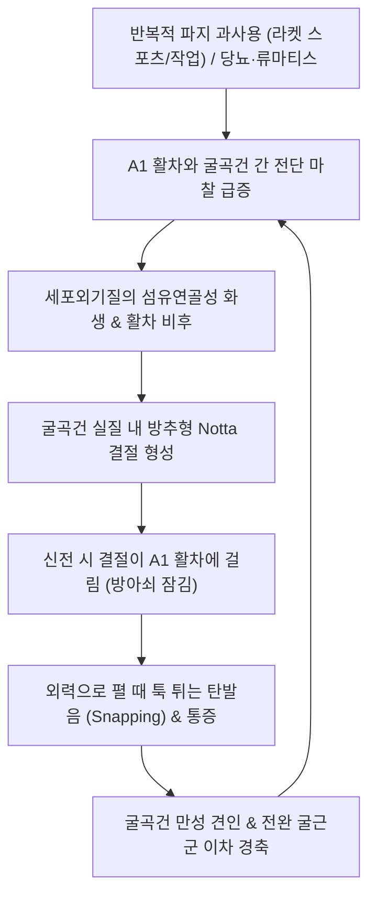

  - 방아쇠 손가락
  - 저지 손가락

# 🩺 방아쇠 수지 (Trigger Finger / 탄발지, M65.3)

> **핵심 3줄 요약 (Key Summary)**:
> - 📍 병소 부위 & 해부·병태생리: 중수수지관절(MCP) 바닥의 제1 윤상 활차(A1 Pulley) 부위에서 [[천지굴근]](FDS)·[[심지굴근]](FDP)·[[장무지굴근]](FPL) 힘줄이 비후·결절화(Notta 결절)되어 터널에 걸리며 발생하는 협착성 건초염.
> - 🚩 전형적 임상 양상 & 3대 징후: 손가락 굴신 시 딸깍거리는 탄발음(Clicking), 아침 기상 시 PIP/DIP 관절 잠김(Locking), MCP 관절 장측 결절성 압통 (Quinnell 0~4기).
> - 🛠️ 핵심 감별 검사 & 한·양방 다각적 치료 전략: 능동 탄발 유발 검사. A1 활차 경피적 미세침도 감압 절개술, 봉약침(건초 주변 주입), 야간 신전 부목 및 [[서경탕]]·[[활락효령단]].
> - <font color="#fa7e7e">⚠️ 응급 의뢰 레드플래그 & 악화 요인: 침도 시술 시 외측 수지 신경·혈관 다발 손상 주의(정중선 수직 접근 엄수), 스테로이드 반복 주사로 인한 건 파열 위험 차단.</font>

---

## 📌 목차
1. [질환 개요 & 해부학적 병태생리](#1-질환-개요--해부학적-병태생리)
2. [병태생리 메커니즘 & 생체역학적 악순환 네트워크](#2-병태생리-메커니즘--생체역학적-악순환-네트워크)
3. [임상 증상 & 이학적 검사(Physical Exam) 알고리즘](#3-임상-증상--이학적-검사physical-exam-알고리즘)
4. [감별 진단 매트릭스 (Differential Diagnosis)](#4-감별-진단-매트릭스-differential-diagnosis)
5. [한의 통합 치료 프로토콜 (침·약침·추나·한약)](#5-한의-통합-치료-프로토콜-침약침추나한약)
6. [양방 치료 & 병용·의뢰 기준 (Conventional Treatment & Referral)](#6-양방-치료--병용의뢰-기준-conventional-treatment--referral)
7. [재활 운동 & 생활습관 티칭 가이드](#6-재활-운동--생활습관-티칭-가이드)
8. [💡 사용자 진료실 핵심 필기 & 임상 노하우 (Melt-In 잔여 심화 집약)](#7--사용자-진료실-핵심-필기--임상-노하우-melt-in-잔여-심화-집약)
9. [출처 및 학술 참고 문헌 (References)](#8-출처-및-학술-참고-문헌-references)

---

## 1. 질환 개요 & 해부학적 병태생리

### (1) 손가락 굴곡건 섬유막초와 A1 활차 시스템
![[Flexor_digitorum_superficialis_anatomy.png|420]]
> [그림 1: ① 병태생리·영상 — 손가락 굴곡건(FDS/FDP/FPL) 주행 및 A1 활차 활시위 방지 해부도]

* **활차-건초 복합체 (Pulley-Tendon Sheath System)**:
  * 수부 굴곡건은 손가락 뼈에 밀착되어 활시위 현상(Bowstringing)을 방지하기 위해 5개의 윤상 활차(Annular Pulleys: A1~A5)와 3개의 십자 활차(Cruciate Pulleys: C1~C3)로 구성된 단단한 섬유성 활차 터널을 통과한다.
  * 이 중 가장 근위부에 위치한 **A1 활차(A1 Pulley)**는 중수골두(Metacarpal Head) 직하방 장측 판(Volar Plate) 부위에 위치하며, 손가락 굴곡 시 가장 큰 전단 압박력(Shear & Compressive Force)을 흡수한다.
* **관여하는 3대 굴곡근군**:
  * **[[천지굴근]](Flexor Digitorum Superficialis, FDS)**: 중수골두를 지나 기절골 부위에서 두 갈래로 갈라져 중절골 기저부에 정지하며, 근위지간관절(PIP)의 주동 굴곡근으로 작용함.
  * **[[심지굴근]](Flexor Digitorum Profundus, FDP)**: FDS 사이를 관통하여 원위지골 기저부에 정지하며, 원위지간관절(DIP)을 굴곡시킴.
  * **[[장무지굴근]](Flexor Pollicis Longus, FPL)**: 엄지손가락의 유일한 굴곡건으로 A1 활차를 통과해 말절골에 부착.

---

## 2. 병태생리 메커니즘 & 생체역학적 악순환 네트워크

![[Flexor_digitorum_superficialis_TriggerPoints.jpg|320]]
> [그림 2: ② 관련 해부 구조물 — 천지굴근(FDS) 및 심지굴근(FDP) 발통점(TrP)과 수지 방사통 패턴]


```mermaid
graph TD
    Overuse["반복적 파지 과사용 (라켓 스포츠/작업) / 당뇨·류마티스"] --> Shear["A1 활차와 굴곡건 간 전단 마찰 급증"]
    Shear --> Metaplasia["세포외기질의 섬유연골성 화생 & 활차 비후"]
    Metaplasia --> Node["굴곡건 실질 내 방추형 Notta 결절 형성"]
    Node --> Locking["신전 시 결절이 A1 활차에 걸림 (방아쇠 잠김)"]
    Locking --> Snap["외력으로 펼 때 툭 튀는 탄발음 (Snapping) & 통증"]
    Snap --> Comp["굴곡건 만성 견인 & 전완 굴근군 이차 경축"]
    Comp --> Shear
```

### (1) 기계적 과사용 및 전신 대사 요인
* **손의 기계적 과사용 (Mechanical Overuse)**:
  * 골프, 테니스, 배드민턴 등 그립을 강하게 쥐는 라켓 스포츠.
  * 농업(호미·낫질), 건설(망치·전동공구), 청소 노동자, 가위질을 많이 하는 미용사, 요리사.
  * 스마트폰 장시간 파지 및 컴퓨터 타이핑.
* **전신성·대사성 위험 질환**:
  * **당뇨병 (Diabetes Mellitus)**: 당화 산물 축적으로 건과 활차가 두꺼워져 일반인에 비해 발병률 4~5배 증가, 다발성(여러 손가락) 발생 빈발.
  * **류마티스 관절염**, 통풍, 갑상선 기능 저하증, 아밀로이드증.
* **인접 신경 포착 증후군 동반**:
  * 굴곡건의 만성 부종은 수근관 내부 압력을 함께 상승시켜 **[[수근관 증후군]](Carpal Tunnel Syndrome)**과의 높은 병발률을 보임.

---

## 3. 임상 증상 & 이학적 검사(Physical Exam) 알고리즘

### (1) 주요 임상 양상 및 부위별 특징
* **PIP 관절 통증 및 잠김**:
  * [[천지굴근]](FDS)의 과긴장 및 등장성 수축으로 인해 근위지간관절(PIP) 부위의 굴곡 구축과 골막 견인통이 발생함.
* **DIP 관절 통증**:
  * [[심지굴근]](FDP)의 단축 및 활차 마찰 부하로 원위지간관절(DIP)에 통증이 투사됨.
* **MCP 관절 압통 및 결절**:
  * 손바닥 원위 횡문 부위(A1 활차 위치)를 누르면 깜짝 놀랄 정도의 압통과 함께 콩알 크기의 Notta 결절이 만져지며, 손가락 굴신 시 결절이 이동함.

### (2) 퀸넬(Quinnell) 임상 병기 분류
* **0기 (Normal)**: 정상적인 손가락 움직임.
* **1기 (Uneven movement)**: 손가락 움직임이 매끄럽지 않고 뻣뻣함 호소.
* **2기 (Actively releasable)**: 손가락이 걸리는 탄발(Triggering) 현상이 있으나 환자 스스로 힘을 주어 능동적으로 펼 수 있음.
* **3기 (Passively releasable)**: 스스로는 펴지 못하고, **반대쪽 손으로 억지로 힘을 주어 펴야만 펴지는 잠김(Locking)** 상태.
* **4기 (Fixed deformity)**: 결절이 완전히 끼이거나 굴곡건 구축이 진행되어 수동으로도 펴지지 않는 고정 변형 상태.

### (3) 특이 이학적 검사법
* **촉진 및 능동 탄발 유발 (Palpation & Active Snapping Test)**:
  * 검사자의 엄지로 환자의 손바닥 MCP 관절 장측(A1 활차 부위)을 지그시 누른 상태에서 손가락을 쥐었다가 천천히 펴게 하여 '툭' 튀는 탄발 촉감과 통증 유발 확인.
* **수동 굴곡 신전 검사**:
  * PIP 관절의 수동 신전 가동 범위를 측정하여 건초염에 의한 잠김인지, 관절 자체 강직인지 감별.

---

## 4. 감별 진단 매트릭스 (Differential Diagnosis)

| 감별 질환 | 호발 병소 및 원인 | 주소증 차이점 | 특이적 이학적 검사 소견 |
| :--- | :--- | :--- | :--- |
| **[[방아쇠 수지]]** (본 질환) | MCP 관절 바닥 A1 활차 | 굴신 시 딸깍거림(Clicking), 아침 잠김, Notta 결절 | MCP 장측 결절 촉진 및 탄발음 유발 |
| **PIP 수장판(Volar plate) 손상** | 외상성 PIP 관절 과신전 손상 | PIP 관절 국소 부종, 통증 | PIP 관절 장측 국소 압통, 스트레스 검사 통증 |
| **뒤퓌트랑 구축 (Dupuytren)** | 수장건막 섬유종증 | 무통성 건막 결절 및 영구적 굴곡 구축 (탄발음 없음) | 테이블 탑 검사(손바닥 밀착 불능) 양성 |
| **[[드퀘르벵 건초염]]** | 손목 요골 붓돌 제1신전건 구획 | 손목 요측 칼로 베는 통증 (엄지 뿌리 결절 없음) | [[핀켈스타인 검사]] 양성 |

---

## 5. 한의 통합 치료 프로토콜 (침·약침·추나·한약)

![[Pasted image 20240121052726.png|450]]
> [그림 3: ③ 치료·시술점 — 방아쇠 수지 MCP 관절 A1 활차 부위 침도·약침 자입 기법 도해]

### (1) 침구 치료 (Acupuncture)
* **A1 활차 국소 취혈**:
  * 병변 손가락의 MCP 관절 장측 및 양측 수지 신경·혈관을 회피하며 건초 주변으로 평자·사자.
  * 아시혈(Notta 결절 상하), 어제(LU10, 엄지), 노궁(PC8, 중지), 소부(HT8, 소지).
* **전완 굴곡근군 근복 이완**:
  * 곡택(PC3), 극문(PC4), 내관(PC6), 공최(LU6): [[천지굴근]], [[심지굴근]], [[장무지굴근]]의 근복 경결을 자침하여 원위부로 전달되는 과도한 견인 장력을 차단.

### (2) 약침 치료 (Pharmacopuncture)
* **건초 주위(Peritendinous) 소염 침윤술**:
  * **건 실질 내부 자입을 엄격히 금지**하고, A1 활차와 건 사이의 활액막 공간(Sheath space)으로 **봉약침(BV)** 또는 황련해독탕 약침 0.2~0.3cc를 30G 1/2인치 주사침으로 얕게 주입.
  * 비후된 활차와 Notta 결절의 무균성 부종을 빠르게 감압.

### (3) 미세침도 요법 (Acupotomy) — 완치를 위한 핵심 수기
* **A1 활차 경피적 감압 절개술 (A1 Pulley Release)**:
  * 0.40×40mm 또는 0.50×40mm 소평인 침도를 자입하여 칼날을 굴곡건 주행 방향과 평행(종축 12시-6시 방향)하게 위치시켜 수지 신경·혈관 다발을 완벽히 보호.
  * 비후된 A1 활차의 원위부에서 근위부로 섬유대를 1~2mm씩 미세 절개하여 좁아진 터널을 확장.
  * 시술 즉시 손가락 굴신 시 탄발음과 잠김이 즉각 소실되는 것을 확인 (성공률 95% 이상).

### (4) 추나 요법 및 한약 치료
* **추나 요법**: 손가락 관절 장축 견인(Traction) 및 전완부 굴곡근막 이완술(MFR).
* **한약 치료**:
  * 급성기 어혈·종통: [[서경탕]](舒經湯), [[활락효령단]](活絡效靈丹).
  * 만성 퇴행 및 다발성(당뇨 환자): [[대황기음]](大黃芪飮), [[보중익기탕]](補中益氣湯) 가미방.

---

## 6. 양방 치료 & 병용·의뢰 기준 (Conventional Treatment & Referral)

> 🎯 **이 섹션의 목적**: 환자가 **양방약을 이미 복용 중인 경우가 많다.** 한의원 1차 진료에서 양방 치료를 이해하고, 병용 가능·주의·금기를 판단하며, 언제 의뢰할지 결정한다.

* **약물 치료 (Medication)**:
  * 계열별 약물·용량·기간 — 국내 처방 관행 반영.
  * 작용 기전과 한의 치료와의 상호작용.
* **비약물 시술 (Procedures)**:
  * 주사·차단술·물리치료·보조기 등.
* **수술·시술 적응증 (Surgical Indication)**:
  * 언제 수술로 가는가 — 절대·상대 적응증, 수술 후 경과.
* **한의 병용 판단 (Combination Therapy)**:
  * 병용 가능 / 주의 / 금기. 복용 중 환자의 감량 타이밍·반동 현상.
* **양방·전문과 의뢰 기준 (Referral Criteria)**:
  * 응급 의뢰 트리거와 전문과 의뢰 기준(정형외과·신경외과·내과 등).

	(작성 필요)

---

## 7. 재활 운동 & 생활습관 티칭 가이드

### (1) 단계적 스트레칭 및 신전 운동
* **손가락 굴곡건 수동 신전 (Passive Finger Extension)**:
  * 손바닥을 벽이나 테이블에 대고 체중을 살짝 실어 손가락과 손목을 뒤로 젖히며 전완 굴곡근과 A1 활차 주변을 부드럽게 신장.
* **갈고리 손가락 운동 (Hook Fists & Table Top Exercise)**:
  * 손가락 굴곡건의 활주성(Tendon Gliding)을 회복시키기 위해 4단계 건 활주 운동 수행.

### (2) 온열 요법 및 스플린트
* **기상 직후 미온수 마사지**:
  * 아침에 관절이 뻣뻣하고 잠김이 심할 때 $40^\circ\text{C}$ 미온수에 손을 5~10분간 담그고 쥐었다 펴는 가벼운 스트레칭 수행.
* **야간 신전 부목 (Night Extension Splint)**:
  * 밤에 자는 동안 손가락이 구부러진 채 굳는 것을 방지하기 위해 PIP 관절을 $0\sim 10^\circ$ 신전 상태로 고정하는 링 부목 착용.

---

## 8. 💡 사용자 진료실 핵심 필기 & 임상 노하우 (Melt-In 잔여 심화 집약)

* **원장님 필기 핵심 융합: 천지굴근(PIP) vs 심지굴근(DIP)의 통증 감별**:
  * 환자가 손가락 통증을 호소할 때, 어느 관절이 굳고 아픈지를 정확히 분리해서 진찰해야 한다.
  * 천지굴근(FDS)은 PIP 관절의 굴곡을 주도하므로, PIP 관절이 펴지지 않고 골막 견인통이 심하다면 FDS의 과긴장 단축이 주원인이다.
  * 반면 손가락 끝마디(DIP 관절)까지 쑤시고 욱신거린다면 심지굴근(FDP)의 만성 과부하가 동반된 것이다.
  * 따라서 A1 활차 도침 시술과 더불어, 전완부에서 FDS와 FDP 근복을 각각 촉진하여 압통점을 함께 사혈하거나 침치료로 풀어주어야 손가락 원위부의 잔여 통증이 말끔히 사라진다.
* **침도(Acupotomy) 시술 시 수지 신경·혈관 손상 방지 노하우**:
  * ⚠️ 손가락 양측 외측면에는 고유 수지 신경(Digital Nerve)과 동맥이 주행하므로, 절대 정중선(Midline)을 벗어나 외측으로 침도 날을 기울이면 안 된다.
  * 바늘은 반드시 손가락 장측 정중선에서 수직으로 진입하여 A1 활차의 단단한 저항감을 느낀 뒤, 건 섬유 주행 방향과 평행하게 종방향으로만 가볍게 긁어내듯 절개해야 신경 손상 부작용 없이 완벽한 감압이 이루어진다.
* **스테로이드 주사 남용 환자의 도침 적용**:
  * 정형외과에서 트리암시놀론 스테로이드 주사를 2~3회 이상 맞고 재발하여 내원한 환자들은 굴곡건 조직이 얇아지고 괴사 직전인 경우가 많다.
  * 이런 환자에게 다시 주사를 놓으면 건 파열 위험이 극도로 높아지므로, 침도 요법을 통해 구조적으로 좁아진 활차만 정밀 절개하고 봉약침으로 결합조직을 재생시키는 한의 치료가 최선의 구제책이 된다.

---

## 9. 출처 및 학술 참고 문헌 (References)

* **Makkouk AH, Oetgen ME, Swigart CR, Dodds SD. (2008)**. *Trigger finger: etiology, evaluation, and treatment*. Current Reviews in Musculoskeletal Medicine, 1(2), 92-96. [PMID: 19468879](https://pubmed.ncbi.nlm.nih.gov/19468879/)
  * `[연구 요약]`: 방아쇠 수지의 병태생리(A1 활차 협착 및 Notta 결절), 역학적 위험 인자(당뇨, 여성, 과사용), Quinnell 임상 병기 분류 및 보존적·수술적 치료 지침을 정립한 기초 종설.
* **Ryzewicz M, Wolf JM. (2006)**. *Trigger digits: principles, management, and complications*. Journal of Hand Surgery (American Volume), 31(1), 135-146. [PMID: 16443118](https://pubmed.ncbi.nlm.nih.gov/16443118/)
  * `[연구 요약]`: 탄발지의 해부학적 활차 구조, 섬유연골성 화생 병리 기전, 경피적 활차 절개술과 개방 수술의 효과 및 합병증 예방 프로토콜을 제시한 권위 있는 임상 논문.
* **Zhang H, et al. (2023)**. *Ultrasound-guided acupotomy for trigger finger: a systematic review and meta-analysis*. Journal of Orthopaedic Surgery and Research, 18(1), 665. [PMID: 37705066](https://pubmed.ncbi.nlm.nih.gov/37705066/)
  * `[연구 요약]`: 방아쇠 수지에 대한 초음파 유도하 침도 요법(Acupotomy release)의 유효성과 안전성을 평가한 최신 메타분석으로, 기존 보존 치료 대비 유의미하게 높은 완치율과 개방 수술 대비 현저히 낮은 합병증 비율을 규명함.

## 📎 통합 이관 — 근골격계 질환/상지/방아쇠 손가락

> 2026-10-08 중복 통합으로 이 노트에 흡수. 원본은 `_중복통합_백업_20261008/`에 보존.

# 🩺 방아쇠 손가락

> **핵심 3줄 요약 (Key Summary)**:
> - 📍 병소 부위 & 해부·병태생리: (작성 필요)
> - 🚩 전형적 임상 양상: (작성 필요)
> - 🛠️ 핵심 검사 & 치료 전략: (작성 필요)
> - <font color="#fa7e7e">⚠️ 응급 의뢰 레드플래그: (작성 필요)</font>

> 📌 **이 노트는 골격(스텁)입니다.** MSD 매뉴얼 주제 목록에서 추출했으며, 내용은 후속 배치에서 채웁니다.
> 참고: [MSD 매뉴얼 — 방아쇠 손가락](https://www.msdmanuals.com/ko/home)

---

## 📌 목차
1. [질환 개요 & 해부학적 병태생리](#1-질환-개요--해부학적-병태생리)
2. [병태생리 메커니즘 & 생체역학적 악순환 네트워크](#2-병태생리-메커니즘--생체역학적-악순환-네트워크)
3. [임상 증상 & 이학적 검사(Physical Exam) 알고리즘](#3-임상-증상--이학적-검사physical-exam-알고리즘)
4. [감별 진단 매트릭스 (Differential Diagnosis)](#4-감별-진단-매트릭스-differential-diagnosis)
5. [한의 통합 치료 프로토콜 (침·약침·추나·한약)](#5-한의-통합-치료-프로토콜-침약침추나한약)
6. [양방 치료 & 병용·의뢰 기준 (Conventional Treatment & Referral)](#6-양방-치료--병용의뢰-기준-conventional-treatment--referral)
7. [재활 운동 & 생활습관 티칭 가이드](#6-재활-운동--생활습관-티칭-가이드)
8. [💡 사용자 진료실 핵심 필기 & 임상 노하우 (Melt-In 잔여 심화 집약)](#7-💡-사용자-진료실-핵심-필기--임상-노하우-melt-in-잔여-심화-집약)
9. [출처 및 학술 참고 문헌 (References)](#8-출처-및-학술-참고-문헌-references)

---

## 1. 질환 개요 & 해부학적 병태생리

(작성 필요)

---

## 2. 병태생리 메커니즘 & 생체역학적 악순환 네트워크

(작성 필요)

---

## 3. 임상 증상 & 이학적 검사(Physical Exam) 알고리즘

(작성 필요)

---

## 4. 감별 진단 매트릭스 (Differential Diagnosis)

(작성 필요)

---

## 5. 한의 통합 치료 프로토콜 (침·약침·추나·한약)

(작성 필요)

---

## 6. 양방 치료 & 병용·의뢰 기준 (Conventional Treatment & Referral)

> 🎯 **이 섹션의 목적**: 환자가 **양방약을 이미 복용 중인 경우가 많다.** 한의원 1차 진료에서 양방 치료를 이해하고, 병용 가능·주의·금기를 판단하며, 언제 의뢰할지 결정한다.

* **약물 치료 (Medication)**:
  * 계열별 약물·용량·기간 — 국내 처방 관행 반영.
  * 작용 기전과 한의 치료와의 상호작용.
* **비약물 시술 (Procedures)**:
  * 주사·차단술·물리치료·보조기 등.
* **수술·시술 적응증 (Surgical Indication)**:
  * 언제 수술로 가는가 — 절대·상대 적응증, 수술 후 경과.
* **한의 병용 판단 (Combination Therapy)**:
  * 병용 가능 / 주의 / 금기. 복용 중 환자의 감량 타이밍·반동 현상.
* **양방·전문과 의뢰 기준 (Referral Criteria)**:
  * 응급 의뢰 트리거와 전문과 의뢰 기준(정형외과·신경외과·내과 등).

	(작성 필요)

---

## 7. 재활 운동 & 생활습관 티칭 가이드

(작성 필요)

---

## 8. 💡 사용자 진료실 핵심 필기 & 임상 노하우 (Melt-In 잔여 심화 집약)

(작성 필요)

---

## 9. 출처 및 학술 참고 문헌 (References)

(작성 필요)

---

## 관련 노트

-

## 📎 통합 이관 — 근골격계 질환/상지/저지 손가락

> 2026-10-08 중복 통합으로 이 노트에 흡수. 원본은 `_중복통합_백업_20261008/`에 보존.

# 🩺 저지 손가락 (Jersey Finger / FDP Avulsion)

> **핵심 3줄 요약 (Key Summary)**:
> - 📍 병소 부위 & 해부·병태생리: 원위지골(Distal phalanx) 기저부에 부착하는 [[심지굴근]](Flexor Digitorum Profundus, FDP) 건이 능동적 최대 굴곡 상태에서 급격한 강제 신전 외력을 받아 견열(Avulsion) 파열되는 수부 1구역(Zone 1) 손상으로, 약지(제4지)에서 75% 이상 호발한다.
> - 🚩 전형적 임상 양상: 원위지관절(DIP 관절)의 능동 굴곡 완전 소실, 수상 수지의 비정상적 신전 정렬, 건 퇴축 부위(PIP 관절 수장측 또는 손바닥)의 압통성 종괴 및 부종이 특징적이다.
> - 🛠️ 핵심 검사 & 치료 전략: PIP 관절을 고정한 채 DIP 관절만 굴곡시키는 격리 검사를 통해 확진하며, Leddy & Packer 분류(Type I~IV)에 따라 건 혈류 소실 전 7~10일 이내에 수술적 건 재부착술(Suture anchor 또는 Pull-out 봉합)을 시행해야 하는 정형외과적 준응급 질환이다.
> - <font color="#fa7e7e">⚠️ 응급 의뢰 레드플래그: DIP 관절 능동 굴곡 불능 확인 즉시 7일 이내 수술 연계를 위한 즉각적 수부외과 전원(지연 시 건 퇴축 및 괴사로 1차 봉합 영구 불가능), 개방성 상처 또는 신경혈관 손상 동반.</font>

---

## 📌 목차
1. [질환 개요 & 해부학적 병태생리](#1-질환-개요--해부학적-병태생리)
2. [병태생리 메커니즘 & 생체역학적 악순환 네트워크](#2-병태생리-메커니즘--생체역학적-악순환-네트워크)
3. [임상 증상 & 이학적 검사(Physical Exam) 알고리즘](#3-임상-증상--이학적-검사physical-exam-알고리즘)
4. [감별 진단 매트릭스 (Differential Diagnosis)](#4-감별-진단-매트릭스-differential-diagnosis)
5. [한의 통합 치료 프로토콜 (침·약침·추나·한약)](#5-한의-통합-치료-프로토콜-침약침추나한약)
6. [양방 치료 & 병용·의뢰 기준 (Conventional Treatment & Referral)](#6-양방-치료--병용의뢰-기준-conventional-treatment--referral)
7. [재활 운동 & 생활습관 티칭 가이드](#7-재활-운동--생활습관-티칭-가이드)
8. [💡 사용자 진료실 핵심 필기 & 임상 노하우 (Melt-In 잔여 심화 집약)](#8--사용자-진료실-핵심-필기--임상-노하우-melt-in-잔여-심화-집약)
9. [출처 및 학술 참고 문헌 (References)](#9-출처-및-학술-참고-문헌-references)

---

## 1. 질환 개요 & 해부학적 병태생리

저지 손가락(Jersey Finger, 축구선수 유니폼 손가락)은 수부 굴곡건 손상 중 제1구역(Zone 1)에 해당하는 질환으로, [[심지굴근]](FDP) 건이 원위지골 기저부 부착부에서 뜯겨 나가는 폐쇄성 견열 파열이다. 미식축구, 럭비, 유도 등 상대방 선수의 유니폼(Jersey)이나 옷깃을 움켜쥐고 당기는 도중 상대가 급격히 도망치면서 손가락이 강제로 펴질 때 주로 발생한다.

### 1) 해부학적 구조와 FDP 건의 역할
- **[[심지굴근]] (Flexor Digitorum Profundus, FDP)**:
  - 척골 전면 및 골간막에서 기시하여 [[천지굴근]](FDS) 건 분지 사이(Camper's chiasm)를 통과한 후, 원위지골 기저부 수장측 결절에 단단히 정지한다.
  - 수부에서 원위지관절(DIP)을 단독으로 굴곡시킬 수 있는 **유일한 근육**이다.
- **건의 혈액 공급 (Vincula System)**:
  - 장지간막(Vinculum longum)과 단지간막(Vinculum breve)을 통해 수지 동맥으로부터 혈액을 공급받는다.
  - 건이 파열되어 근위부로 얼마나 말려 올라가느냐에 따라 이 지간막의 파열 여부가 결정되며, 이는 건의 허혈성 괴사 속도를 좌우한다.

### 2) 왜 약지(제4수지)에 75% 이상 집중되는가?
- 주먹을 쥘 때 약지는 다른 손가락보다 상대적으로 독립적인 신전이 어렵고, 굴곡 시 FDP 건의 견인력이 가장 집중된다.
- 파악 동작 시 약지의 원위지골 부착부에 걸리는 생체역학적 부하가 제2, 3, 5수지에 비해 유의하게 크기 때문에 단독 파열의 압도적 다수를 차지한다.

---

## 2. 병태생리 메커니즘 & 생체역학적 악순환 네트워크

### 1) 견열 파열 및 퇴축 기전
1. **편심성 과부하(Eccentric Overload)**: FDP 근육이 최대 수축(Concentric contraction)하여 주먹을 쥐고 있는 상태에서, 상대방의 이동으로 인해 원위지골에 급격한 과신전 외력(Forced extension)이 가해진다.
2. **건-골 접합부 단열**: 건의 인장 강도를 초과하는 강력한 전단력이 발생하여 건이 원위지골 수장측 피질골 부착부에서 견열 파열된다.
3. **근위부 퇴축(Retraction)**: 전완 근복부의 탄성 수축력에 의해 단열된 건 끝부분이 근위부(손바닥 또는 전완 방향)로 딸려 올라간다.

### 2) Leddy & Packer 분류 (건 퇴축 및 혈류 손상도에 따른 4단계)
- **Type I (손바닥 퇴축)**:
  - 단열된 건이 장·단지간막을 모두 찢고 손바닥(Lumbrical 기시부 레벨)까지 완전히 말려 올라감.
  - 건으로 가는 모든 혈류가 차단되어 7~10일 이내에 비가역적 건 연화 및 괴사가 진행되므로 **최대한 빠른 응급 수술**이 요구됨.
- **Type II (PIP 관절 레벨 퇴축)**:
  - 단열된 건이 천지굴근 건 교차부(Camper's chiasm) 및 A3 도르래에 걸려 PIP 관절 수준에 머뭄.
  - 장지간막(Vinculum longum)이 온전하여 혈류가 유지되므로 수주 후에도 1차 봉합이 가능할 수 있음.
- **Type III (DIP 관절 직상부 골편 정지)**:
  - 원위지골 기저부의 큰 골편(Bony fragment)이 함께 떨어져 나와 A4 도르래에 걸려 DIP 관절 바로 근위에 멈춤.
- **Type IV (복합 파열)**:
  - 골편 견열과 함께 건 실질이 골편에서 한 번 더 파열되어 건이 손바닥으로 퇴축된 형태.

```
[최대 수지 굴곡 상태] ──> [강제적 급격한 과신전 외력 작용]
          │                                  │
          ▼                                  ▼
[원위지골 기저부 FDP 건 파열] ──> [장·단지간막(Vincula) 단열]
          │                                  │
          ▼                                  ▼
[건 근위부 퇴축 (손바닥 or PIP)] ──> [건 혈류 차단 ➔ 조기 괴사 위험]
          │
          ▼
[DIP 관절 능동 굴곡 영구 소실]
```

---

## 3. 임상 증상 & 이학적 검사(Physical Exam) 알고리즘

### 1) 전형적 임상 증상
- **DIP 관절 능동 굴곡 불능**: 주먹을 쥐라고 하면 다른 손가락과 달리 환측 손가락의 끝마디(DIP)만 꼿꼿이 펴진 채 구부러지지 않음.
- **손가락 정렬 이상 (Loss of Normal Flexion Cascade)**: 손을 편안히 힘을 뺐을 때 정상 손가락들은 검지에서 소지로 갈수록 점진적으로 더 많이 굽어지는 '굴곡 계단(Cascade)'을 이루지만, 다친 손가락만 비정상적으로 신전되어 있음.
- **수장측 압통 및 몽우리 촉지**: 건이 말려 올라간 자리(PIP 관절 수장측이나 손바닥 원위부)에 부종과 함께 뭉친 건 덩어리가 만져지며 극심한 압통을 호소.

### 2) 이학적 검사 프로토콜
1. **DIP 관절 단독 능동 굴곡 검사 (Isolated DIP Flexion Test)**:
   - 환자의 MCP 관절과 PIP 관절을 술자의 손으로 완전히 펴서 고정한다.
   - 환자에게 "손가락 끝마디만 구부려 보세요"라고 지시한다.
   - **양성**: 끝마디가 1도도 구부러지지 않거나 힘이 전혀 들어가지 않음 ➔ **FDP 단열 확진**.
2. **FDS(천지굴근) 보존 검사**:
   - 인접한 다른 손가락들을 완전히 편 채로 환측 손가락의 PIP 관절만 구부리게 하여 PIP 관절 굴곡이 가능한지 확인(FDS는 정상임을 확인).
3. **단순 방사선 검사 (X-ray AP/True Lateral)**:
   - Type III 여부를 확인하기 위해 측면상에서 원위지골 수장측 견열 골편(Avulsion fracture)의 크기와 전위 위치를 확인.
4. **근골격계 초음파 및 MRI**:
   - 단열된 건 말단이 손바닥까지 말려 올라갔는지(Type I), PIP 관절에 걸려 있는지(Type II) 건의 위치와 지간막 혈류 상태를 정확히 진단.

---

![[저지손가락_01_임상_방아쇠수지.jpg|450]]
> [그림 1: ① 임상 소견 — 방아쇠수지(Trigger finger)] 중지가 근위지관절에서 굴곡된 채 펴지지 않는 실제 환자 손 사진. A1 활차를 굴곡건이 통과하지 못해 걸리는 전형적 소견이다. 출처: File:20230326 Trigger finger - right middle finger.jpg (CC BY-SA 4.0) · Wikipedia 문서 이미지

![[저지손가락_02_시술_유리술후.jpg|450]]
> [그림 2: ② 시술 결과 — 방아쇠수지 유리술 후] A1 활차 절개(경피적 유리술) 후 손바닥 창상 부위를 보여 주는 술후 사진. 굴곡건의 활주가 회복되어 굴곡 구축이 해소된다. 출처: File:Post-operative photo of trigger finger release surgery.jpg (CC BY-SA 4.0) · Wikipedia 문서 이미지

## 4. 감별 진단 매트릭스 (Differential Diagnosis)

| 감별 질환 | 호발 기전 및 병소 | 주요 증상 및 징후 | 핵심 감별 포인트 |
| :--- | :--- | :--- | :--- |
| **저지 손가락 (Jersey Finger)** | 굴곡 상태에서 강제 신전, [[심지굴근]](FDP) 파열 | **DIP 관절 능동 굴곡 불능**, 손가락 펴짐 | 끝마디가 구부러지지 않음, 굴곡력 소실 |
| **망치수지 ([[말렛 핑거]])** | 신전 상태에서 강제 굴곡, 종지 신전건 파열 | **DIP 관절 능동 신전 불능**, 끝마디 처짐 | 끝마디가 펴지지 않고 아래로 덜렁거림, 굴곡은 정상 |
| **[[수지 건 유착증]]** | 외상/수술 후 활액초 내 유착 | 수동 ROM은 정상이나 능동 운동 제한 | 굴곡건 파열이 아닌 유착, 부분 가동성 잔존 |
| **원위지골 골절** | 직접적인 압궤 또는 타박 외상 | DIP 관절 극심한 통증 및 조하혈종 | X-ray상 명확한 골절선, 건 파열 없이도 굴곡 제한 가능 |
| **천지굴근 (FDS) 단독 파열** | 수지 관절 강제 신전 외상 | PIP 관절 능동 굴곡 약화 | DIP 굴곡은 정상이지만 PIP 단독 굴곡이 제한됨 |

---

## 5. 한의 통합 치료 프로토콜 (침·약침·추나·한약)

저지 손가락의 급성 파열기는 **외과적 건 봉합술이 절대적 적응증**이다. 한의 치료는 **수술 직후 고정기(부종 및 어혈 관리)와 수술 3~6주 후 핀/부목 제거 후 재활기(건 유착 방지, 관절 강직 해소, 신경 기능 회복)**에 집중 적용한다.

### 1) 침구 치료
- **근위 취혈**:
  - [[팔사]](EX-UE9): 수술 부위 지간 부종 흡수 및 림프 순환 촉진.
  - [[십선]](EX-UE11): 손가락 끝 정혈 자극으로 수지 신경 말단 감각 회복.
  - 아시혈: 수술 봉합 흉터 주변 건초 결합조직 피내 자침으로 반흔 연화.
- **원위 취혈**:
  - [[대릉]](PC7), [[태연]](LU9): 손목 굴곡건 주행로 기혈 순환.
  - [[곡택]](PC3), [[척택]](LU5), [[소해]](HT3): 전완 심지굴근 근복부의 연축 및 단축을 이완.
  - [[합곡]](LI4), [[외관]](TE5): 상지 전체 진통 및 신경근 흥분성 조절.
- **자침 기법**: 전완 심지굴근 근복부에 0.25mm 호침으로 심자한 후 저주파 전침(2Hz, 15분)을 적용하여 굴곡건의 미세 활주력 회복.

### 2) 약침 치료
- **건 봉합부 주변 시술 (수술 4주 이후)**:
  - 신바로약침 또는 중성어혈약침: 수술 흉터 주위 피하 결합조직에 0.2~0.3cc 주입하여 수술 후 피브린 유착 억제.
  - [[봉약침]](Sweet BV 10%): 건초 주변 미세 손상 치유 및 교원질 섬유화 리모델링 촉진.

### 3) 한의 추나 요법 (Tendon Gliding & Mobilization)
- **건 활주 수기 기법 (Tendon Gliding Technique)**:
  - 수술 4주 후 보호된 범위에서 시작: 갈고리 주먹(Hook fist), 직선 주먹(Straight fist), 완전 주먹(Full fist)으로 이어지는 단계적 수동-능동 보조 운동 적용.
- **지간 근막 이완술 (Myofascial Release)**:
  - 엄지 지복을 이용해 수술 반흔과 A4, A5 도르래 주변 피부를 횡방향으로 부드럽게 마사지하여 건-피부 유착 박리.

### 4) 한약 치료
- **수술 직후 부종·어혈기 (수술 후 1~2주)**:
  - 증상: 손가락이 검푸르게 붓고 욱신거림.
  - 처방: [[당귀수산]](當歸鬚散) 가미 (도인, 홍화, 소목, 몰약).
- **건 치유 및 근건 강화기 (수술 3주 이후)**:
  - 증상: 손가락 끝에 힘이 안 들어가고 뻣뻣함.
  - 처방: [[보양환오탕]](補陽還五湯) 합 독활기생탕(獨活寄生湯) 가감 (황기, 단삼, 우슬, 속단, 구척).

---

## 6. 양방 치료 & 병용·의뢰 기준 (Conventional Treatment & Referral)

### 1) 응급 수술적 치료 (Surgical Management)
- **수술의 골든타임**:
  - **Type I 손상**: 건이 손바닥까지 말려 올라가 혈류가 완전히 차단되므로 **7~10일 이내 응급 수술**이 필수적임. 10일이 넘어가면 건이 쪼그라들고 괴사되어 1차 봉합이 불가능하고 2차 건 이식술(Tendon graft)이 필요함.
  - **Type II & III**: 지간막 혈류가 유지되거나 골편이 걸려 있는 경우 2~3주까지 1차 봉합이 가능할 수 있으나 역시 조기 수술이 원칙.
- **수술 기법**:
  - **봉합 앵커 고정술 (Suture Anchor Fixation)**: 원위지골 기저부에 미세 나사못(Anchor)을 삽입하여 단열된 FDP 건을 골 피질에 견고하게 밀착 고정.
  - **당김 단추 봉합술 (Pull-Out Button Technique)**: 철사를 원위지골을 관통시켜 손톱 배측의 단추에 묶어 건을 뼈에 고정(4~6주 후 제거).

### 2) 수술 후 고정 프로토콜 (Duran / Kleinert Protocol)
- 배측 차단 부목(Dorsal block splint)을 적용하여 손목 30도 굴곡, MCP 50~70도 굴곡 상태로 고정하되, 고무줄을 이용한 수동 굴곡-능동 신전 조기 운동(Kleinert protocol)을 통해 건 유착을 예방.

### 3) 양방·전문과 의뢰 기준 (Referral Criteria)
- 🚨 **즉각적인 정형외과/수부외과 응급 전원**:
  1. 환자가 운동 중 손가락 끝마디를 다친 후 DIP 관절 단독 굴곡이 전혀 안 되는 경우 ➔ **한의원에서 시간을 지체하지 말고 즉시 전원**.
  2. 단순 방사선 사진상 원위지골 기저부의 견열 골절편이 관찰되는 경우.
  3. 수상 후 이미 수일이 경과한 상태로 내원한 경우 골든타임 확보를 위해 당일 정밀 의뢰.

---

## 7. 재활 운동 & 생활습관 티칭 가이드

### 1) 수술 후 단계별 재활
- **0~4주**: 배측 차단 부목 착용 하에 건 봉합 부위에 장력이 걸리지 않는 수동 굴곡 훈련만 시행. 능동 굴곡은 절대 금기(봉합사 파열 위험).
- **4~6주**: 부목 제거 후 가벼운 능동 굴곡 운동 시작(Hook fist 훈련).
- **8주 이후**: 점진적 저항 운동 시작, 퍼티(Theraputty) 쥐기 훈련.
- **12주 이후**: 스포츠 복귀 및 강한 파악 운동 허용.

### 2) 생활습관 지도
- 수술 후 6주 이전에는 물건을 집거나 주먹을 꽉 쥐는 동작을 철저히 금지(재파열 위험 최고조 시기).

---

## 8. 💡 사용자 진료실 핵심 필기 & 임상 노하우 (Melt-In 잔여 심화 집약)

- **"단순 염좌"로 오인되는 비극 방지**: 환자는 "손가락 삐끗했다"고 내원하며 외관상 멍과 붓기 외에 심한 변형이 없어 단순 염좌로 오진되기 매우 쉽다. 환자가 손가락 끝을 다쳤다고 하면 **무조건 다른 관절을 잡고 DIP 관절만 따로 구부려보게 하는 검사를 루틴으로 시행**해야 한다. 이를 놓치고 2주 이상 침 치료만 하다 건이 괴사되어 오면 의료 분쟁으로 이어질 수 있다.
- **수술 후 유착과의 싸움**: 저지 손가락 수술 후 가장 흔한 합병증은 '재파열'과 '건 유착(Tendon adhesion)'이다. 너무 안 움직이면 굴곡건이 주변 활액초와 눌어붙어 손가락이 굳고, 너무 일찍 힘을 주면 봉합 부위가 뜯어진다. 수술 후 4~6주 시점에 한의원에 내원하는 환자에게 전완 FDP 근복부 전침과 건초 주변 미세 침치료, 그리고 부드러운 건 활주 운동을 지도하면 유착 없이 완벽한 ROM 회복을 도울 수 있다.

---

## 9. 출처 및 학술 참고 문헌 (References)

* MSD 매뉴얼 전문가용: 손가락 굴곡건 손상 및 저지 손가락 (Flexor Tendon Injuries).

* StatPearls Publishing: Jersey Finger.

* Suture Anchor Fixation for Zone 1 Flexor Digitorum Profundus Avulsion Injuries: A Systematic Review of Outcomes and Complications. [PMID: 42803124]

---

## 관련 노트

- [[말렛 핑거]]
- [[수지 건 유착증]]
- [[심지굴근]]
- [[천지굴근]]
- [[당귀수산]]
- [[보양환오탕]]
- [[봉약침]]
