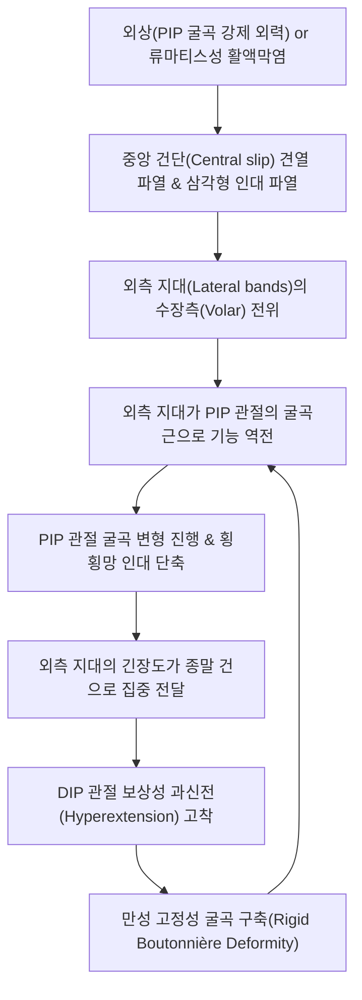

# 🩺 부또니에르 변형

> **핵심 3줄 요약 (Key Summary)**:
> - 📍 **병소 부위 & 해부·병태생리**: 수지 신전건 복합체 중 **중앙 건단(Central slip)**의 파열 또는 신장으로 인해 외측 지대(Lateral bands)가 수장측(Volar)으로 전위되면서 발생하는 **근위지관절(PIP) 굴곡 + 원위지관절(DIP) 과신전** 변형(**Boutonnière / Buttonhole Deformity**).
> - 🚩 **전형적 임상 양상**: 손가락 끝에 정면 충격을 받은 후(농구, 배구 등) PIP 관절이 굽혀진 채 능동적으로 펴지지 않음, 반면 DIP 관절은 위로 젖혀져 고정됨, 초기 치료 지연 시 고정성 굴곡 구축(Rigid contracture)으로 악화.
> - 🛠️ **핵심 검사 & 치료 전략**: 엘슨 검사([[Elson Test]]), 보이스 검사([[Boyes Test]]); 초기 급성기 **PIP 관절 완전 신전위 정적 부목(Splinting) 6주 유지(DIP는 자유 가동)**; [[팔사혈]](EX-UE9), [[십선혈]](EX-UE11) 자침 및 [[소염약침]]/[[중성어혈약침]]; 만성 구축기 관절 가동 [[추나]].
> - ⚠️ **응급 의뢰 레드플래그**: 손가락 개방성 열상에 의한 신전건 절단; PIP 관절의 수장판 파열 및 회전성 관절 탈구; [[류마티스 관절염]]에 의한 다발성 관절 붕괴.

---

## 📌 목차
1. [질환 개요 & 해부학적 병태생리](#1-질환-개요--해부학적-병태생리)
2. [병태생리 메커니즘 & 생체역학적 악순환 네트워크](#2-병태생리-메커니즘--생체역학적-악순환-네트워크)
3. [임상 증상 & 이학적 검사(Physical Exam) 알고리즘](#3-임상-증상--이학적-검사physical-exam-알고리즘)
4. [감별 진단 매트릭스 (Differential Diagnosis)](#4-감별-진단-매트릭스-differential-diagnosis)
5. [한의 통합 치료 프로토콜 (침·약침·추나·한약)](#5-한의-통합-치료-프로토콜-침약침추나한약)
6. [양방 치료 & 병용·의뢰 기준 (Conventional Treatment & Referral)](#6-양방-치료--병용의뢰-기준-conventional-treatment--referral)
7. [재활 운동 & 생활습관 티칭 가이드](#7-재활-운동--생활습관-티칭-가이드)
8. [💡 사용자 진료실 핵심 필기 & 임상 노하우 (Melt-In 잔여 심화 집약)](#8--사용자-진료실-핵심-필기--임상-노하우-melt-in-잔여-심화-집약)
9. [출처 및 학술 참고 문헌 (References)](#9-출처-및-학술-참고-문헌-references)

---

![[부또니에르변형_01_해부_신전건막.jpg|450]]
> [그림 §: ① 해부 — 신전건막(Extensor expansion)] 손등에서 손가락으로 이어지는 신전건과 건막(Extensor expansion, Dorsal expansion)을 라벨과 함께 그린 해부 도판. 중앙건이 근위지골 배측에 붙고 측부건이 갈라지는 구조가 부또니에르 변형의 병소다. 출처: File:Grant 1962 87.png (Wikimedia Commons, Grant's Atlas)

## 1. 질환 개요 & 해부학적 병태생리

### 1) 수지 신전건 복합체(Extensor Hood Mechanism)의 해부
* **중앙 건단 (Central Slip)**:
  * [[총지신근]](EDC) 건이 근위지골(Proximal phalanx) 배측에서 3개의 분지로 갈라질 때, 중앙 다발이 중절골(Middle phalanx) 기저부 결절에 부착되어 **근위지관절(PIP joint)의 신전**을 단독 전담함.
* **외측 지대 (Lateral Bands)**:
  * [[충양근]](Lumbricals) 및 [[골간근]](Interossei)의 건이 합류하여 형성된 2개의 외측 다발.
  * 중절골 부위에서 삼각형 인대(Triangular ligament)에 의해 배측에 묶여 있다가, 원위부에서 종말 건(Terminal tendon)으로 합쳐져 원위지골(Distal phalanx) 기저부에 부착되어 **원위지관절(DIP joint)의 신전**을 담당함.
* **횡횡망 인대 (Transverse Retinacular Ligament, TRL)**:
  * 외측 지대가 수장측(손바닥 쪽)으로 떨어지지 않도록 배측에서 잡아주는 지지 인대.

### 2) 질환의 정의: 왜 '단추구멍(Boutonnière)'인가?
* 중앙 건단이 파열되면 중절골 기저부 배측이 뚫리면서 일종의 '단추구멍(Buttonhole)' 틈새가 형성됨.
* PIP 관절 두부가 이 틈새를 뚫고 배측으로 솟구쳐 나오고, 양측의 외측 지대는 마치 단추구멍 양옆의 실처럼 **관절 회전 중심축보다 수장측(손바닥 쪽)으로 미끄러져 내려앉음**.
* 이로 인해 본래 신전근이어야 할 외측 지대가 PIP 관절의 **강력한 굴곡근**으로 역전 작용하게 됨.

---

## 2. 병태생리 메커니즘 & 생체역학적 악순환 네트워크

### 1) 역학적 벡터의 치명적 전도
* 정상 상태에서는 외측 지대가 PIP 관절 중심축의 배측(Dorsal)에 위치하므로 손가락 전체를 펴는 역할을 함.
* 중앙 건단 파열 후 외측 지대가 회전축 전방(Volar)으로 탈구되면, 손가락을 펴려고 힘을 줄 때마다 외측 지대가 PIP 관절을 더욱 아래로 꺾어 굴곡시키는 악순환이 발생함.
* 반면, 외측 지대에 걸린 과도한 장력은 말초의 종말 건으로 전달되어 DIP 관절을 반사적으로 위로 젖혀지게(과신전) 만듦.

### 2) 3단계 진행 과정
1. **1단계 (초기 연성 변형, Flexible)**: 외측 지대가 전위되었으나 손으로 펴면 완전 수동 신전 가능.
2. **2단계 (아급성 구축기)**: 횡횡망 인대와 수장판이 섬유화되어 수동 신전 시에도 완전 펴짐이 안 됨.
3. **3단계 (만성 강직기, Rigid Fixed Deformity)**: PIP 관절 연골 마모, 관절낭 구축, 영구적 기형.

---

## 3. 임상 증상 & 이학적 검사(Physical Exam) 알고리즘

### 1) 주요 임상 증상
* **특유의 수지 기형**: PIP 관절은 구부러져 있고(굴곡), DIP 관절은 뒤로 젖혀진(과신전) 상태.
* **수상 초기 지연성 발현**: 다친 직후에는 외측 지대가 아직 배측에 남아 있어 정상처럼 보이다가, 1~3주에 걸쳐 서서히 변형이 드러나므로 초기 오진율이 매우 높음.
* **물건 쥐기 및 타이핑 장애**: 손가락이 펴지지 않아 주머니에 손을 넣을 때 걸리고, 물건을 넓게 쥐지 못함.

### 2) 진료실 핵심 이학적 검사 알고리즘
1. **엘슨 검사 ([[Elson Test]]) — 초기 파열 진단의 Gold Standard**:
   * 환자의 손가락 PIP 관절을 테이블 모서리나 검사자의 손가락 위에서 **90도 직각으로 굽히게 함**.
   * 환자에게 중절골을 위로 펴보라고(PIP 신전) 지시하면서 검사자가 저항을 가함:
     * **정상**: 중앙 건단이 온전하여 강력한 신전 저항력이 느껴지며, 이때 DIP 관절은 힘이 빠져 덜렁거림(Flaccid).
     * **중앙 건단 파열(부또니에르)**: PIP 신전력이 현저히 약하고, 대신 외측 지대로 힘이 몰려 **DIP 관절이 뻣뻣하게 과신전됨**.
2. **보이스 검사 ([[Boyes Test]]) — 만성 외측 지대 구축 검사**:
   * PIP 관절을 수동으로 완전 신전시킨 상태에서 환자에게 DIP 관절을 능동적으로 굽혀보라고 지시.
   * 외측 지대가 수장측에 유착되어 있으면 DIP 관절의 굴곡이 불가능함.
3. **방사선 검사 (Finger AP/True Lateral)**:
   * 중절골 기저부 배측의 미세 [[견열 골절]](Avulsion fracture) 유무 확인.

---

![[부또니에르변형_02_임상_단추구멍변형.jpg|450]]
> [그림 1: ② 임상 소견 — 부또니에르 변형(단추구멍 변형)] 근위지관절(PIP)이 굴곡되고 원위지관절(DIP)이 과신전된 전형적 변형을 보이는 실제 환자 손 사진. 중앙건 파열 후 측부건이 장측으로 전위되어 나타나는 자세다. 출처: File:Boutonnière deformity.jpg (CC BY-SA 3.0)

## 4. 감별 진단 매트릭스 (Differential Diagnosis)

| 질환명 | PIP 관절 상태 | DIP 관절 상태 | 핵심 구별 포인트 / 병태 차이 |
| :--- | :--- | :--- | :--- |
| **부또니에르 변형** | **굴곡 (Flexion)** | **과신전 (Hyperextension)** | 중앙 건단(Central slip) 파열, Elson test 양성 |
| **[[백조목 변형]](Swan-Neck Deformity)** | **과신전 (Hyperextension)** | **굴곡 (Flexion)** | [[수장판]](Volar plate) 파열, 종말 건 파열, [[류마티스 관절염]] |
| **망치수지 ([[Mallet Finger]])** | 정상 | **굴곡 (Flexion)** | 종말 신전건(Terminal tendon) 단독 파열 |
| **수지 굴곡건 파열 (FDP/FDS)** | 수동 신전 가능, 능동 굴곡 불능 | 굴곡력 상실 | 손바닥 쪽 열상/외상, 쥐는 힘 완전 소실 |
| **듀피트렌 구축 ([[Dupuytren Contracture]])** | 굴곡 구축 | 굴곡 구축 | 수장 건막의 결절성 비후, 건 자체 손상 없음 |

---

## 5. 한의 통합 치료 프로토콜 (침·약침·추나·한약)

### 1) 침구 치료 (Acupuncture)
* **국소 취혈 (수지 관절부)**:
  * [[팔사혈]](EX-UE9): 중수골두 사이 함요처. 수지 신전건 복합체 혈류 개선 및 림프 부종 흡수.
  * [[십선혈]](EX-UE11): 손가락 끝 정혈(井穴). 미세 순환 촉진 및 말초 감각 이상 해소.
  * 아시혈(중절골 기저부 배측): 손상된 중앙 건단 부착부 직상방에 0.16mm 극미세 호침으로 피내자(Intradermal needling) 적용.
* **전완부 신전근 건 자침**:
  * 총지신근(EDC) 근복에 자침하여 신전건의 과도한 장력을 균등화.
* **주의사항**: 급성기(부목 고정 기간)에는 부목을 임의로 제거하고 과도한 침 치료를 시행하면 치유 중인 힘줄이 다시 벌어지므로, 부목을 유지한 상태에서 노출된 말초 혈위 및 전완부 위주로 치료.

### 2) 약침 치료 (Pharmacopuncture)
* **약침 제제 선택**:
  * **신바로약침 / 소염약침**: 급성기 PIP 관절의 염증 삼출물 및 활액막 비후 억제.
  * **중성어혈약침**: 외상성 혈종 흡수 및 미세 결합조직 혈류 개선.
* **주입 방법**:
  * PIP 관절 배외측(외측 지대 주행 부위)에 30G 니들로 0.05~0.1cc씩 극소량 분할 주입.

### 3) 수기 추나 및 관절 가동술 (Chuna & Joint Mobilization)
* **만성 구축기 PIP 관절 수동 신전 기법**:
  * 6주간의 고정 후 구축이 발생한 경우, 측부 인대와 수장판을 부드럽게 신장하며 관절 글라이딩 적용.
* **외측 지대 배측 정복 마사지**:
  * 수장측으로 떨어진 외측 지대를 손가락으로 가볍게 밀어 올려 배측으로 재배치시키는 연부조직 이완술 시행.

### 4) 변증별 맞춤 한약 처방 (Herbal Medicine)
* **기체어혈 (氣滯瘀血) - 외상 급성 손상형**:
  * 증상: 손가락이 붓고 퍼렇게 멍들며 굽혀진 채 펴지지 않음.
  * 처방: **[[당귀수산]](當歸鬚散)** 가감 (도인, 홍화, 천궁, 소목, 몰약).
* **간신휴손 / 근건위축 (肝腎虧損 / 筋腱萎縮) - 만성 구축 및 재발형**:
  * 증상: 손가락 마디가 굳어 펴지지 않고 힘이 없음, 류마티스 관절염 동반.
  * 처방: **독활기생탕(獨活寄生湯)** 또는 **[[보간탕]](補肝湯)** 가미 (속단, 골쇄보, 모과 증량).

---

## 6. 양방 치료 & 병용·의뢰 기준 (Conventional Treatment & Referral)

### 1) 보존적 치료의 절대 원칙: 정적 신전 부목 (Static PIP Extension Splint)
* **부목 적용 원칙**:
  * **PIP 관절은 0도(완전 신전위)**로 엄격히 고정.
  * **DIP 관절과 MP 관절은 반드시 자유롭게 움직이도록(Unrestricted)** 개방.
* **착용 기간**:
  * **최소 6주간 24시간 연속 착용**. 단 1초라도 부목을 풀고 PIP 관절을 구부리면 치유되던 중앙 건단이 다시 찢어져 6주 카운트가 처음부터 리셋됨.
  * 이후 2~4주간 야간 부목 및 점진적 능동 굴곡 운동 병행.
* **DIP 관절 능동 굴곡 운동의 중요성**:
  * 부목을 찬 상태에서 DIP 관절을 능동적으로 굽히는 운동을 시켜야 외측 지대가 수장측에서 배측으로 다시 끌어당겨짐.

### 2) 수술적 치료 적응증 (Surgical Indication)
* **적응증**:
  * 중절골 기저부의 큰 견열 골절편(관절면 30% 이상 침범).
  * 6주간의 완벽한 부목 치료에도 실패한 만성 구축성 변형.
  * 류마티스 관절염에 의한 광범위 건 결손.
* **수술 술식**:
  * 중앙 건단 직접 봉합술 또는 건 이전술(Lateral band mobilization), Matev 술식.
  * 만성 강직 시 PIP 관절 고정술(Arthrodesis).

### 3) 양방·전문과 의뢰 기준 (Referral Criteria)
* **정형외과 수부외과 즉시 전원**:
  * 개방성 창상이나 열상으로 건이 노출된 급성 외상.
  * 30도 이상의 심한 고정성 굴곡 구축으로 수동 신전이 전혀 불가능한 만성 환자.

---

## 7. 재활 운동 & 생활습관 티칭 가이드

### 1) 부목 착용기 필수 재활: DIP 굴곡 운동
* PIP 부목을 견고히 착용한 상태에서, 하루 50~100회씩 DIP 관절만을 끝까지 구부렸다가 펴는 운동 반복.
* 이 동작은 측부 지대를 배측으로 이동시키고 사근 지대 인대(ORL)의 단축을 방지하는 결정적 재활임.

### 2) 부목 제거 후 점진적 굴곡 운동
* 6주 경과 후 부목을 풀었을 때 갑자기 주먹을 세게 쥐면 재파열되므로, 1주차에는 30도, 2주차에는 60도로 점진적으로 굴곡 각도를 넓힘.

### 3) 일상생활 티칭 수칙
* 공놀이(농구, 배구) 복귀는 최소 3~4개월간 엄격히 금지.
* 주머니에 손을 넣을 때 손가락 끝이 걸려 꺾이지 않도록 주의.

---

## 8. 💡 사용자 진료실 핵심 필기 & 임상 노하우 (Melt-In 잔여 심화 집약)

### 1) "단순 삔 손가락"으로 오진되는 비극 방지법
* 환자가 "농구공에 손가락 끝을 맞았는데 멍만 들고 뼈는 안 부러졌대요"라며 내원했을 때, X-ray에 뼈가 멀쩡하다고 해서 단순 염좌로 진단하고 파스만 붙여주면 3주 뒤 돌이킬 수 없는 부또니에르 변형으로 진행함.
* 손가락 타박 환자가 오면 무조건 **Elson Test**를 시행할 것. 환자 손가락을 90도 굽히고 펴보라고 했을 때 힘이 없으면 즉시 **알루미늄 핑거 스플린트로 PIP 0도 신전 부목을 6주간 채워야 환자의 손가락을 살릴 수 있음**.

### 2) 부목 티칭: "절대로 혼자 풀어서 구부려보지 마세요"
* 환자들은 손가락이 낫고 있는지 확인하고 싶어서 세수할 때 부목을 풀고 손가락을 굽혀보는 치명적인 실수를 저지름.
* "이 힘줄은 젖은 종이죽처럼 약하게 붙어가고 있어서, 단 한 번이라도 구부리면 다시 찢어져 6주를 처음부터 다시 시작해야 합니다"라고 강력하게 티칭해야 순응도가 유지됨.

---

## 9. 출처 및 학술 참고 문헌 (References)

* New perspective on acute boutonniere deformity: An anatomical study with illustrative case report. [PMID: 42598551]

* Elson RA. Rupture of the central slip of the extensor expansion of the fingers. A new and simple test for early diagnosis. J Bone Joint Surg Br. 1986;68(2):229-231.

* Souter WA. The problem of boutonniere deformity. Clin Orthop Relat Res. 1974;(104):116-133.

* Geoghegan L, Wormald JC, Jain A. Boutonnière deformity. BMJ. 2019;366:l5237.
