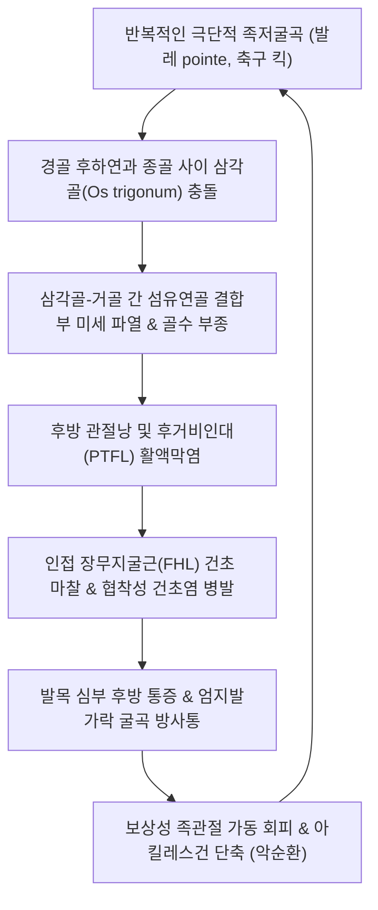

# 🩺 삼각골 증후군

> **핵심 3줄 요약 (Key Summary)**:
> - 📍 **병소 부위 & 해부·병태생리**: 족관절 후방의 거골 후외측 돌기(Stieda's process)에 존재하는 부골인 **[[삼각골]](Os trigonum)**이 발목의 과도한 족저굴곡 시 경골 후하연과 종골 사이에서 압박되어 발생하는 후방 충돌 증후군(**Posterior Ankle Impingement Syndrome**). *(※ 손목 수근골인 [[삼각골]](Triquetrum) 손상과의 해부학적 감별 요망)*.
> - 🚩 **전형적 임상 양상**: 발레 무용수의 포인트(Pointe) 자세나 축구 선수의 인스텝 킥 시 아킬레스건 심부 발목 뒤쪽의 찌르는 듯한 통증, 까치발 들기 제한, 장무지굴근건([[FHL]]) 연관성 엄지발가락 굴곡통.
> - 🛠️ **핵심 검사 & 치료 전략**: 과족저굴곡 유발 검사([[Hyperplantarflexion Test]]), FHL 저항 굴곡 검사; [[곤륜혈]](BL60), [[태계혈]](KI3), [[부류혈]](KI7) 자침 및 소염약침/신바로약침; 거퇴관절 전방 글라이딩 추나; 족저굴곡 제한 테이핑.
> - ⚠️ **응급 의뢰 레드플래그**: 아킬레스건 완전 파열(톰슨 검사 양성); 급성 거골 후돌기 골절(Shepherd 골절)로 인한 심한 전위; 비복신경 또는 경골신경 포착에 따른 족저부 급성 감각 마비.

---

## 📌 목차
1. [질환 개요 & 해부학적 병태생리](#1-질환-개요--해부학적-병태생리)
2. [병태생리 메커니즘 & 생체역학적 악순환 네트워크](#2-병태생리-메커니즘--생체역학적-악순환-네트워크)
3. [임상 증상 & 이학적 검사(Physical Exam) 알고리즘](#3-임상-증상--이학적-검사physical-exam-알고리즘)
4. [감별 진단 매트릭스 (Differential Diagnosis)](#4-감별-진단-매트릭스-differential-diagnosis)
5. [한의 통합 치료 프로토콜 (침·약침·추나·한약)](#5-한의-통합-치료-프로토콜-침약침추나한약)
6. [양방 치료 & 병용·의뢰 기준 (Conventional Treatment & Referral)](#6-양방-치료--병용의뢰-기준-conventional-treatment--referral)
7. [재활 운동 & 생활습관 티칭 가이드](#7-재활-운동--생활습관-티칭-가이드)
8. [💡 사용자 진료실 핵심 필기 & 임상 노하우 (Melt-In 잔여 심화 집약)](#8--사용자-진료실-핵심-필기--임상-노하우-melt-in-잔여-심화-집약)
9. [출처 및 학술 참고 문헌 (References)](#9-출처-및-학술-참고-문헌-references)

---

![[삼각골증후군_03_해부_삼각골표시.jpg|450]]
> [그림 §: ① 해부 — 삼각골(Triquetral bone)의 위치] 손목 골격을 후방에서 본 해부 도판으로 'Triquetral bone' 라벨과 화살표가 삼각골을 정확히 가리킨다. 삼각골은 근위 수근열의 척측에 위치해 척골과 직접 관절하며, 척측 충돌·골절의 병소다. 출처: File:RightHumanPosteriorDistalRadiusUlnaCarpals - Triquetral bone highlighted.png (Wikimedia Commons)

![[삼각골증후군_04_영상_삼각골골절X선.jpg|450]]
> [그림 §: ② 영상 — 삼각골 골절의 방사선 소견] 손목 측면 방사선 사진으로 화살표가 삼각골 부위를 가리킨다. 삼각골 골절은 단순 후전면 촬영에서 놓치기 쉬워 측면·사방 촬영과 CT가 함께 필요하다. 출처: File:TriQFracture.PNG (Wikimedia Commons)

## 1. 질환 개요 & 해부학적 병태생리

### 1) 해부학적 구조와 삼각골(Os Trigonum)의 형성
* **거골 후돌기(Posterior Process of Talus)**:
  * 내측 결절(Medial tubercle)과 외측 결절(Lateral tubercle, Stieda's process)로 구성되며, 그 사이의 고랑으로 **장무지굴근건(Flexor Hallucis Longus, FHL)**이 주행함.
* **삼각골(Os Trigonum)의 발생학**:
  * 7~13세경 거골 후외측 결절에 이차 골화 중심이 나타나며, 통상 1년 이내에 거골체와 유합됨.
  * 유합되지 않고 섬유성 연골 결합(Synchondrosis) 상태로 잔존하는 부골(Accessory bone)을 **삼각골(Os trigonum)**이라 부르며, 정상인의 약 7~14%에서 관찰됨.
* *(볼트 분류 참고)*: 본 질환은 임상적으로 족관절 후방 충돌 증후군을 정본으로 다루며, 상지 손목의 척측 수근골인 [[삼각골]](Triquetrum)의 골절 및 인대 불안정성과의 동음이의어적 구분을 명확히 함.

### 2) 질환의 정의: 호두까기 인형 현상 (Nutcracker Phenomenon)
* 발목을 최대로 아래로 꺾는 족저굴곡(Plantarflexion) 동작 시, 거골 후방과 종골 상면, 원위 경골 후하연 사이의 공간이 급격히 좁아짐.
* 이때 잔존하는 삼각골이나 비후된 Stieda 돌기가 마치 **호두까기 기구(Nutcracker)** 사이에 끼인 호두처럼 뼈와 뼈 사이에 끼어 압박과 연골하 골절, 활액막염을 일으킴.

---

![[삼각골증후군_01_해부_수근골.png|450]]
> [그림 1: ① 해부 구조 — 수근골 배열과 삼각골] 8개 수근골을 색으로 구분해 라벨한 손목 뼈 도해. 삼각골(triquetrum, D)은 근위열 척측에 위치해 척골과 직접 관절한다. 출처: File:Carpal bones.png (CC BY-SA 3.0)

## 2. 병태생리 메커니즘 & 생체역학적 악순환 네트워크

### 1) 급성 골절 vs 만성 미세 충돌
* **급성 외상 (Shepherd 골절)**: 발목의 급격한 강제 족저굴곡-내번 손상으로 비후된 Stieda 돌기가 부러지거나 삼각골 결합부가 찢어짐.
* **만성 미세 손상 (Overuse Impingement)**: 발레, 축구, 체조 등에서 반복적인 끝범위 족저굴곡 부하로 삼각골 주위의 후방 관절낭 비후, 결절종 형성, 골극 비대가 누적됨.

### 2) 장무지굴근(FHL)과의 해부학적 상호작용
* 삼각골 바로 내측 고랑을 주행하는 FHL 건은 삼각골의 염증성 부종에 의해 활주 장애를 받음.
* 이로 인해 엄지발가락을 굽힐 때 발목 뒤쪽에서 딸깍거리는 소리가 나거나 걸리는 **'후방 방아쇠 발가락(Posterior trigger toe)'** 증상이 동반됨.

---

## 3. 임상 증상 & 이학적 검사(Physical Exam) 알고리즘

### 1) 주요 임상 증상
* **발목 후방 심부 통증**: 아킬레스건보다 앞쪽, 관절 깊은 곳에서 쑤시는 통증.
* **특정 동작 시 악화**: 하이힐 착용, 내리막길 걷기, 까치발 들기, 공을 찰 때 발등을 펼 때 찌르는 통증.
* **만성 발목 염좌 후 후유증**: 발목 외측 염좌 치료 후 외측 통증은 나았으나 발목 뒤쪽 깊은 통증이 수개월간 지속됨.

### 2) 진료실 핵심 이학적 검사 알고리즘
1. **과족저굴곡 충돌 유발 검사 ([[Hyperplantarflexion Test]])**:
   * 환자를 편안히 앉히거나 엎드리게 한 상태에서, 검사자가 한 손으로 종골을 잡고 다른 손으로 전족부를 잡아 발목을 빠르고 강하게 **최대 족저굴곡**시킴.
   * 이때 발목 뒤쪽 깊은 곳에서 날카로운 통증이 유발되면 후방 충돌 증후군 양성.
2. **후외측 직접 압통 검사 (Posterolateral Palpation)**:
   * 아킬레스건과 외과(비골 외측 복사뼈) 사이의 홈을 전내측 방향으로 깊게 압박(삼각골 부위). 아킬레스건 자체의 압통이 아닌 심부 뼈 부위 압통 확인.
3. **FHL 저항 굴곡 검사 (Resisted Great Toe Flexion)**:
   * 발목을 족저굴곡시킨 상태에서 엄지발가락을 강하게 굽히게 하고 검사자가 저항을 가함. 발목 뒤쪽 통증이 재현되면 FHL 병변 동반 양성.
4. **족부 단순 방사선 검사 (Foot/Ankle Lateral View)**:
   * 측면 X-ray에서 거골 후방의 원형 또는 난원형 삼각골(Os trigonum) 존재 확인.

---

![[삼각골증후군_02_영상_수근골X선.jpg|450]]
> [그림 2: ② 영상 — 수근골 방사선 해부] 손목 골격의 방사선 사진을 해부 라벨과 함께 실은 초기 문헌 도판. 삼각골 골절·척측 충돌 판독에 필요한 정상 배열을 보여 준다. 출처: File:The anatomical record (1906) (Public domain)

## 4. 감별 진단 매트릭스 (Differential Diagnosis)

| 질환명 | 주 통증 부위 및 양상 | 핵심 구별 포인트 | 필수 감별 검사 / 치료 차이점 |
| :--- | :--- | :--- | :--- |
| **삼각골 증후군** | 발목 뒤쪽 심부, 아킬레스건 앞쪽 | **Hyperplantarflexion 검사 양성**, X-ray상 삼각골 관찰 | 발목 측면 X-ray, 발목 MRI(골수 부종) |
| **[[아킬레스건염]] / 건병증** | 아킬레스건 실질부(종골 부착부 상방 2~6cm) | 아킬레스건 자체의 방추형 비후 및 표재성 압통 | 아킬레스건 초음파, 종골 결절 마찰 |
| **[[후종골 점액낭염]](Haglund 증후군)** | 종골 후상방 결절 부위, 신발 뒤축 마찰 | 종골 후상방 골극 돌출(Haglund bump), 피부 발적 | 단순 X-ray 측면상 Haglund 기형 |
| **장무지굴근([[FHL]]) 단독 건초염** | 내과 후방 및 거골 후내측 주행부 | 엄지발가락 움직임 시 마찰음(Crepitus), 도약 시 악화 | FHL 건초 초음파 검사 |
| **상지 [[삼각골]] 골절 (Triquetrum Fx)** | **손목 척측 배측(두상골 인접부)** | 손 짚고 넘어짐 후 손목 척측 통증, 발목과 무관 | 손목 측면 X-ray(Poop chip 골절편) |

---

## 5. 한의 통합 치료 프로토콜 (침·약침·추나·한약)

### 1) 침구 치료 (Acupuncture)
* **국소 핵심 혈위 (족태양방광경 및 족소음신경)**:
  * [[곤륜혈]](BL60): 외과 첨단과 아킬레스건 사이 함요처. 거골 후외측 부위 직접 도달.
  * [[태계혈]](KI3): 내과 첨단과 아킬레스건 사이 함요처. 거골 후내측 FHL 주행부 이완.
  * [[부류혈]](KI7): 태계혈 직상 2촌. 비복근·가자미근 건막 긴장 완화.
  * [[신맥혈]](BL62), [[조해혈]](KI6): 족관절 외측 및 내측 측부 안정성 지지.
* **자침 기법**:
  * 곤륜혈에서 거골 후돌기를 향해 사선으로 1.5촌 심자하여 후방 관절낭 주위 울혈을 유도.
  * 비복근 및 가자미근 근복에 전침(2Hz, 15분)을 적용하여 족관절 후방의 신장성 긴장 완화.

### 2) 약침 치료 (Pharmacopuncture)
* **약침 제제 선택**:
  * **신바로약침 / 소염약침**: 충돌로 인한 후방 관절낭 및 FHL 건초의 급성 활액막염 부종 억제에 1차 선택.
  * **중성어혈약침**: 만성적인 결합부 미세 골절 및 골수 부종성 통증에 적용.
* **시술 방법**:
  * 아킬레스건 외측연을 통해 비복신경을 회피하며 거골 후방 공간으로 30G 니들을 진입시켜 0.1~0.2cc씩 총 1.0cc 주입.

### 3) 족관절 교정 추나 (Ankle Joint Mobilization)
* **거퇴관절 전방 글라이딩 (Talar Anterior Glide)**:
  * 환자를 복와위로 눕히고 발목을 테이블 끝에 걸친 상태에서, 술자가 종골과 거골 후방을 전방(발가락 쪽)으로 밀어내어 후방 충돌 공간 확보.
* **비복근-가자미근 근막 이완(PIR / MFR)**:
  * 단축된 후방 근막을 신장하여 족배굴곡 가동역을 정상 회복.

### 4) 변증별 맞춤 한약 처방 (Herbal Medicine)
* **기체어혈 (氣滯瘀血) - 외상 충돌 급성형**:
  * 증상: 킥킹 후 발목 뒤가 찌르듯 아픔, 발을 딛거나 뗄 때 욱신거림.
  * 처방: **[[신통축어탕]](身痛逐瘀탕)** 또는 **[[당귀수산]](當歸鬚散)** 가감 (우슬, 차전자, 천궁).
* **간신휴손 / 골비 (肝腎虧損 / 骨痺) - 무용수 만성 과사용형**:
  * 증상: 만성적인 발목 시큰거림, 뼈마디 피로감, 종아리 경련 동반.
  * 처방: **독활기생탕(獨活寄生湯)** 합 **작약감초탕(芍藥甘草湯)** 가감.

---

## 6. 양방 치료 & 병용·의뢰 기준 (Conventional Treatment & Referral)

### 1) 보존적 치료 및 족저굴곡 제한
* **활동 조절 (Activity Modification)**:
  * 발레 포인트 동작, 축구 슈팅 훈련을 최소 4~6주간 전면 중단.
* **보조기 및 테이핑**:
  * 발목이 90도 이상 아래로 꺾이지 않도록 제한하는 후방 충돌 방지 보조기나 힐 패드(Heel lift) 적용.

### 2) 주사 치료 (Injections)
* **초음파 유도하 국소 스테로이드 주사**:
  * 거골 후방 관절낭 내로 극소량 Triamcinolone 주입. 아킬레스건 내 주입을 엄격히 피해야 건 파열 합병증을 예방할 수 있음.

### 3) 수술적 치료 적응증 (Surgical Indication)
* **관절경하 삼각골 절제술 (Posterior Ankle Arthroscopic Excision)**:
  * 3~6개월 이상의 적극적 보존적 치료(한의 치료, 주사, 깁스)에도 불구하고 운동 복귀가 불가능한 프로 무용수나 운동선수.
  * 후방 관절경을 통해 삼각골을 제거하고 비후된 반흔 조직 및 FHL 건초 감압술 동시 시행.

### 4) 양방·전문과 의뢰 기준 (Referral Criteria)
* **정형외과 족부족관절 전문의 의뢰**:
  * X-ray상 큰 Shepherd 골절편의 전위가 확인된 급성 외상 환자.
  * 보존적 치료에 반응하지 않는 전문 스포츠 선수.

---

## 7. 재활 운동 & 생활습관 티칭 가이드

### 1) 족배굴곡 가동성 회복 및 종아리 스트레칭
* 경사판(Incline board)이나 벽 밀기 자세로 무릎을 펴고 굽힌 상태에서 비복근과 가자미근을 충분히 신장 (회당 30초, 하루 5회).

### 2) 족저굴곡 제한 테이핑 기법
* 발목 전면에 키네시오 테이프를 강한 텐션으로 부착하여 발목이 끝까지 펴지는 것을 물리적으로 제한.

### 3) 생활 관리 수칙
* 플랫슈즈나 굽이 전혀 없는 신발보다는 2~3cm 정도의 가벼운 굽이 있는 신발을 신어 발목 후방의 압박 장력을 완화.
* 맨발로 까치발을 들고 서 있는 습관 금지.

---

## 8. 💡 사용자 진료실 핵심 필기 & 임상 노하우 (Melt-In 잔여 심화 집약)

### 1) "아킬레스건염 치료를 3달 받았는데 안 나아요" 환자의 비밀
* 많은 1차 의료기관에서 발목 뒤쪽이 아프다고 하면 무조건 아킬레스건염으로 진단하고 체외충격파를 침.
* **진료실 감별법**: 아킬레스건을 손가락으로 집었을 때는 통증이 없고, **발목을 바닥 쪽으로 끝까지 강하게 꺾었을 때(Hyperplantarflexion) 깊은 곳에서 비명이 나온다면** 그것은 100% 삼각골 증후군임.

### 2) 곤륜혈 심자 시 감각 신경(비복신경) 주행 주의
* 곤륜혈에서 거골 후방으로 자침할 때 외과 후방을 주행하는 비복신경(Sural nerve)을 건드리면 발 외측으로 찌릿한 방전통이 발생할 수 있음.
* 아킬레스건 전방의 부드러운 지방체(Kager's fat pad) 틈새를 통해 수평보다 약간 전하방으로 완만하게 진입해야 안전함.

---

## 9. 출처 및 학술 참고 문헌 (References)

* The Effect of Flexor Hallucis Longus Morphology on Os Trigonum Syndrome. [PMID: 42016152]

* Ribbans WJ, Ribbans HA, Cruickshank JA, Wood EV. The management of posterior ankle impingement syndrome in dancers: a systematic review. Foot Ankle Surg. 2015;21(1):1-10.

* Maquirriain J. Posterior ankle impingement syndrome. J Am Acad Orthop Surg. 2005;13(6):365-376.

* van Dijk CN. Anterior and posterior ankle impingement. Foot Ankle Clin. 2006;11(3):663-683.
