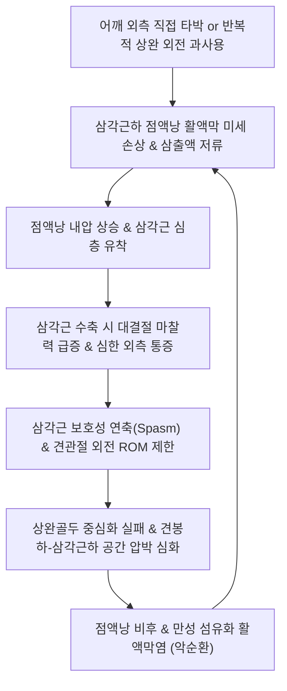

# 🩺 삼각근하 활액막염

> **핵심 3줄 요약 (Key Summary)**:
> - 📍 **병소 부위 & 해부·병태생리**: [[삼각근]](Deltoid muscle) 심층과 상완골 대결절 외측 사이에 위치하는 **견봉하-삼각근하 점액낭(Subacromial-Subdeltoid Bursa)**의 외측 부위에 발생한 삼출성 활액막염 및 활액낭 비후.
> - 🚩 **전형적 임상 양상**: 어깨 외측(삼각근 중앙부)의 뚜렷한 압통, 팔을 옆으로 벌리거나(외전) 반대편 어깨로 가져갈 때(수평 내전) 악화되는 쑤시는 통증, 삼각근 부위로 눕지 못하는 야간통.
> - 🛠️ **핵심 검사 & 치료 전략**: 삼각근하 직접 압통, 수평 내전 검사([[Cross-Body Adduction Test]]), 견관절 초음파; [[견우혈]](LI15), [[비노혈]](LI14), [[견료혈]](TE14) 자침 및 소염약침/신바로약침; 견갑상완 리듬 정상화 추나; [[서경탕]](舒經湯) 처방.
> - ⚠️ **응급 의뢰 레드플래그**: 삼각근 부위의 급격한 열감, 발적, 전신 고열을 동반한 화농성 점액낭염(Septic bursitis); 결절성 종괴의 급격한 증대(활액막 육종 등 악성 종양 의심).

---

## 📌 목차
1. [질환 개요 & 해부학적 병태생리](#1-질환-개요--해부학적-병태생리)
2. [병태생리 메커니즘 & 생체역학적 악순환 네트워크](#2-병태생리-메커니즘--생체역학적-악순환-네트워크)
3. [임상 증상 & 이학적 검사(Physical Exam) 알고리즘](#3-임상-증상--이학적-검사physical-exam-알고리즘)
4. [감별 진단 매트릭스 (Differential Diagnosis)](#4-감별-진단-매트릭스-differential-diagnosis)
5. [한의 통합 치료 프로토콜 (침·약침·추나·한약)](#5-한의-통합-치료-프로토콜-침약침추나한약)
6. [양방 치료 & 병용·의뢰 기준 (Conventional Treatment & Referral)](#6-양방-치료--병용의뢰-기준-conventional-treatment--referral)
7. [재활 운동 & 생활습관 티칭 가이드](#7-재활-운동--생활습관-티칭-가이드)
8. [💡 사용자 진료실 핵심 필기 & 임상 노하우 (Melt-In 잔여 심화 집약)](#8--사용자-진료실-핵심-필기--임상-노하우-melt-in-잔여-심화-집약)
9. [출처 및 학술 참고 문헌 (References)](#9-출처-및-학술-참고-문헌-references)

---

![[삼각근하활액막염_01_해부_견봉하점액낭.jpg|450]]
> [그림 §: ① 해부 — 어깨 관절의 점액낭 배열] 견봉(Acromion)·오구돌기(Coracoid)와 상완골두 주위에 위치한 점액낭들을 번호로 표시한 도해. 3번이 견봉하(삼각근하) 점액낭으로, 견봉과 상완골두 사이에서 충돌에 의해 염증이 생기는 자리다. 출처: File:Bursae shoulder joint normal.jpg (Wikimedia Commons)

![[삼각근하활액막염_02_해부_견관절단면.jpg|450]]
> [그림 §: ① 해부 — 어깨 관절 단면 구조] 쇄골·견갑골·상완골로 이루어진 어깨 관절을 단면으로 그린 도해. 관절강·활막·관절연골의 위치를 보여 주며, 견봉하 공간이 좁아지면 점액낭이 먼저 눌린다는 것을 이해하는 기본 구조다. 출처: File:Blausen 0797 ShoulderJoint.png (Wikimedia Commons)

## 1. 질환 개요 & 해부학적 병태생리

### 1) 해부학적 구조와 점액낭의 주행
* **견봉하-삼각근하 점액낭 복합체 (Subacromial-Subdeltoid Bursa, SASD)**:
  * 인체에서 가장 큰 활액낭 구조로, 견봉 하방의 견봉하부(Subacromial portion)와 삼각근 심층의 삼각근하부(Subdeltoid portion)가 대다수(약 95%)에서 하나의 연속된 단일 공간을 형성함.
  * 상완골 대결절의 외측면과 삼각근 내측 근막 사이에서 삼각근이 수축할 때 상완골두와의 마찰을 줄여주는 쿠션 역할을 수행함.
* **혈액 공급 및 신경 지배**:
  * 전·후상완회선동맥의 분지로부터 혈류를 공급받으며, 액와신경(Axillary nerve)과 견갑상신경(Suprascapular nerve)의 감각 신경 종말이 풍부하게 분포하여 염증 시 매우 예민한 통증을 유발함.

### 2) 질환의 정의: 견봉하 점액낭염과의 차이점
* 견봉하 점액낭염이 주로 견봉 전하면과의 기계적 충돌(Impingement)로 인해 견봉 직하방에 국한되는 반면,
* **삼각근하 활액막염(Subdeltoid Bursitis)**은 염증과 삼출액이 대결절 외측 삼각근 심부로 확장되어 **어깨 측면 삼각근 부위의 표재성 압통과 부종**이 주 증상으로 나타남.
* 견관절의 직접 타박상(Contusion)이나 삼각근의 급격한 편심성 수축 손상에 의해 단독으로 발생하는 경우도 흔함.

---

## 2. 병태생리 메커니즘 & 생체역학적 악순환 네트워크

### 1) 활액막 삼출과 팽창성 통증
* 초기에는 활액막의 충혈과 함께 활액이 과다 분비되어 점액낭이 풍선처럼 팽창함(초음파상 저에코성 체액 저류).
* 팽창된 점액낭은 삼각근 근막과 대결절 골막 사이의 좁은 공간에서 강한 압력을 받아 팔을 가만히 내리고 있어도 욱신거리는 자발통을 유발함.

### 2) 만성 유착과 섬유화
* 염증이 3주 이상 지속되면 피브린(Fibrin) 침착과 교원 섬유 증식으로 활액막 벽이 두꺼워지고 대결절 외측 골막에 달라붙는 유착성 점액낭염(Adhesive bursitis)으로 발전하여 능동/수동 외전 장애를 초래함.

---

## 3. 임상 증상 & 이학적 검사(Physical Exam) 알고리즘

### 1) 주요 임상 증상
* **어깨 외측 삼각근 부위의 극심한 압통**: 견봉 외측 2~3cm 하방 삼각근 중앙을 손가락으로 누르면 화들짝 놀랄 정도의 압통.
* **수평 내전 시 통증 (Horizontal Adduction Pain)**: 환측 팔을 반대편 가슴 쪽으로 끌어당길 때 삼각근이 신장되면서 점액낭이 압박되어 통증 유발.
* **환측 수면 불능 (Inability to Sleep on Affected Side)**: 옆으로 누울 때 체중이 삼각근하 점액낭을 직접 짓눌러 야간통 극심.

### 2) 진료실 핵심 이학적 검사 알고리즘
1. **삼각근하 점액낭 직접 촉진 검사 (Direct Palpation of Subdeltoid Bursa)**:
   * 팔을 가볍게 뒤로 신전시켜 대결절을 전외측으로 노출시킨 상태에서 삼각근 전외측 근복을 압박. 뚜렷한 표재성 압통 확인.
2. **수평 내전 검사 ([[Cross-Body Adduction Test]])**:
   * 환자의 팔을 90도 굴곡시킨 후 반대편 어깨 쪽으로 수평 내전시킴. 견쇄관절 통증 외에 삼각근 심부의 통증이 재현되면 점액낭염 양성.
3. **외전 저항 검사 (Resisted Abduction Test)**:
   * 팔을 30도 외전한 상태에서 하방 저항을 가할 때 삼각근 수축으로 인한 외측 점액낭 압박통 발생.
4. **견관절 고해상도 초음파 검사 (USG)**:
   * 삼각근하 점액낭의 두께가 2mm 이상 비후되어 있거나 낭 내부에 무에코/저에코의 삼출액 저류 확인 시 확진.

---

![[삼각근하활액막염_03_이학검사_충돌검사.jpg|450]]
> [그림 1: ③ 이학적 검사 — 충돌증후군 검사(Neer 검사·Hawkins 검사)] 어깨를 앞쪽으로 들어 올리며 통증을 유발하는 Neer 검사와, 어깨를 90도 굽히고 팔꿈치를 안쪽으로 돌려 통증을 확인하는 Hawkins 검사를 그린 도해. 삼각근하 점액낭염·충돌증후군의 핵심 검사다. 출처: 국가건강정보포털 「스포츠 손상과 안전(견관절 손상)」 도해

## 4. 감별 진단 매트릭스 (Differential Diagnosis)

| 질환명 | 주 통증 부위 및 양상 | 핵심 구별 포인트 | 필수 감별 검사 / 치료 차이점 |
| :--- | :--- | :--- | :--- |
| **삼각근하 활액막염** | 삼각근 외측 중앙부 직접 압통, 외전/수평내전 악화 | 삼각근 심층의 국소 압통 우세, 초음파상 낭 내 삼출액 | 견관절 초음파, 점액낭 감압 및 약침 |
| **[[극상근건 점액낭염]]** | 견봉 바로 아래, 외전 60~120도 동통호 | **Neer / Hawkins 충돌 검사 양성**, 대결절 상부 병소 | 충돌 유발 검사, 견봉하 공간 감압 |
| **삼각근 근막통증증후군 ([[MPS]])** | 삼각근 전·중·후부 근복 | 팽창성 점액낭 부종 없음, **단단한 띠(Taut band) 및 연축 반응** | 통증 유발점 촉진, 드라이 니들링/침구 |
| **액와신경 포착증 ([[사각공 증후군]])** | 삼각근 외측 감각 둔마, 외전 근력 약화 | 사각공(Quadrilateral space) 후방 압통, 파행성 저림 | 액와신경 전도 검사, 후방 견관절 이완 |
| **화농성 점액낭염 (Septic Bursitis)** | 삼각근 부위 국소 발적, 작열감, 심한 부종 | **체온 상승, 전신 오한**, 안정 시에도 극심한 통증 | 혈액 배양, 관절액 흡인 검사 (응급) |

---

## 5. 한의 통합 치료 프로토콜 (침·약침·추나·한약)

### 1) 침구 치료 (Acupuncture)
* **국소 취혈 (수양명대장경 및 수소양삼초경)**:
  * [[견우혈]](LI15): 삼각근 전연과 견봉 사이. 삼각근하 점액낭 전방 활액막 자극.
  * [[비노혈]](LI14): 삼각근 부착부 정점. 삼각근 긴장 해소 및 방사통 차단.
  * [[견료혈]](TE14): 삼각근 후연 함요처. 점액낭 후방 삼출액 흡수 촉진.
  * 아시혈(삼각근 외측 최압통점): 피내침 및 호침 횡자(Transverse insertion)로 점액낭 표재층 순환 유도.
* **자침 기법**:
  * 호침을 삼각근 근섬유 주행과 평행하게 사자하여 삼각근 근막을 이완시키고 점액낭의 내압을 분산시킴.
  * 저주파 전침(2Hz, 15분) 적용으로 국소 신경말단 감작 억제.

### 2) 약침 치료 (Pharmacopuncture)
* **약침 제제 선택**:
  * **신바로약침 / 소염약침**: 활액막 삼출액 저류 및 급성 염증성 부종 억제에 1차 선택.
  * **황련해독탕 약침**: 환부의 열감, 발적, 욱신거리는 작열통이 뚜렷한 경우 적용.
  * **중성어혈약침**: 외상성 타박 후 피하 혈종 및 어혈성 야간통에 적용.
* **시술 방법**:
  * 삼각근 외측 최압통 부위에서 피하층을 지나 삼각근 심층 점액낭 공간으로 30G 니들을 진입시켜 0.1~0.2cc씩 총 1.0~1.5cc 주입.

### 3) 수기 추나 요법 (Chuna Therapy)
* **삼각근 직접 근막 이완술 (Deltoid MFR)**:
  * 술자의 양 엄지 또는 수근부로 삼각근 중부 섬유를 횡방향으로 압박하며 부드럽게 신장.
* **상완골두 후하방 글라이딩 (Posterior-Inferior Glide)**:
  * 전방 및 상방으로 전위된 상완골두를 정상 해부학적 중심축으로 복원하여 점액낭 압박 해소.

### 4) 변증별 맞춤 한약 처방 (Herbal Medicine)
* **기체어혈 (氣滯瘀血) - 외상 타박 및 야간통형**:
  * 증상: 타박 후 멍들고 어깨를 건드리지도 못함, 밤에 욱신거림 극심.
  * 처방: **[[당귀수산]](當歸鬚散)** 합 **[[서경탕]](舒經湯)** 가감.
* **풍열습비 (風熱濕痺) - 관절 삼출액 급성 부종형**:
  * 증상: 어깨 외측이 화끈거리고 부어오름, 갈증, 설홍태황.
  * 처방: **당귀점통탕(當歸拈痛湯)** 또는 **[[청열사습탕]](淸熱瀉濕湯)**.
* **기혈어체 / 담음저류 (氣血瘀滯 / 痰飮沮留) - 만성 유착형**:
  * 증상: 만성적으로 무겁고 쑤심, 어깨가 굳어 올라가지 않음.
  * 처방: **[[이진탕]](二陳湯)** 합 **오적산(五積散)** 가감.

---

## 6. 양방 치료 & 병용·의뢰 기준 (Conventional Treatment & Referral)

### 1) 보존적 약물 및 주사 치료
* **경구 NSAIDs 요법**: 2주간 Celecoxib 또는 Aceclofenac 투여.
* **초음파 유도하 흡인 및 주사 (US-guided Aspiration & Injection)**:
  * 삼출액이 다량 저류된 경우 주사기로 삼출액을 흡인한 후, Triamcinolone 20mg을 점액낭 내로 주입하여 즉각적인 염증 소퇴 유도.
* **프롤로테라피 (Dextrose Prolotherapy)**:
  * 만성 이완성 점액낭염 환자에서 고농도 포도당 주사로 점액낭 벽 안정화 유도.

### 2) 수술적 치료 적응증 (Surgical Indication)
* **관절경하 점액낭 절제술 (Arthroscopic Bursectomy)**:
  * 6개월 이상의 보존적 치료에도 반복 재발하는 만성 비후성 삼각근하 활액막염.

### 3) 양방·전문과 의뢰 기준 (Referral Criteria)
* **정형외과 / 류마티스내과 즉시 의뢰**:
  * 관절 국소 열감 및 전신 발열 동반(패혈성 활액막염 의심 시 즉시 관절액 천자 배양 필요).
  * 류마티스 관절염 또는 통풍성 활액막염 의심 시.

---

## 7. 재활 운동 & 생활습관 티칭 가이드

### 1) 삼각근 등장성 스트레칭
* 통증이 가라앉은 후 환측 팔을 가슴 앞으로 교차시켜 반대 손으로 팔꿈치를 부드럽게 몸 쪽으로 당겨 삼각근 후부 섬유 및 점액낭 이완 (회당 15초, 하루 5회).

### 2) 수면 자세 교정
* 환측 어깨가 눌리지 않도록 반드시 건측으로 눕거나 바로 눕고, 환측 팔 밑에 베개를 받쳐 삼각근이 신장되지 않는 편안한 중립위 유지.

### 3) 생활 관리 수칙
* 무거운 물건을 옆으로 들어 올리는 동작(쇼핑백 들기, 옆으로 덤벨 들기) 일체 금지.
* 환부에 온찜질(만성기) 또는 냉찜질(급성기 48시간) 적용.

---

## 8. 💡 사용자 진료실 핵심 필기 & 임상 노하우 (Melt-In 잔여 심화 집약)

### 1) 견봉하 점액낭염과 삼각근하 점액낭염의 촉진 구별법
* 교과서에는 둘이 하나로 이어져 있다고 하지만, 진료실에서 환자가 짚는 아픈 자리는 명확히 다름.
* **견봉하 점액낭염** 환자는 어깨 꼭대기(견봉 바로 밑)를 짚으며 팔을 들 때 아프다고 하고,
* **삼각근하 점액낭염** 환자는 **어깨 알통 부위(삼각근 중앙, 비노혈 상방)**를 짚으며 "누가 어깨를 꽉 쥐거나 건드리기만 해도 살이 찢어지게 아프다"고 호소함.
* 후자는 삼각근을 직접 누르면 압통이 극심하므로 비노혈-견우혈 사이 아시혈 약침이 결정적 치료혈이 됨.

### 2) 비노혈 약침 주입 시 임상 팁
* 비노혈 부위에서 약침을 놓을 때는 뼈에 닿을 정도로 깊게 찌르지 말고, 삼각근 근육층을 통과하여 대결절 골막 바로 위 피하 점액낭 결합조직 틈새로 니들이 쑥 들어가는 감각(저항 소실)을 느낀 후 약액을 주입해야 통증 없이 활액막염이 즉시 가라앉음.

---

## 9. 출처 및 학술 참고 문헌 (References)

* Single Ultrasound-Guided Dextrose Prolotherapy Plus Therapeutic Exercise for Subacromial-Subdeltoid Bursitis: A Pilot Double-Blind Randomized Controlled Trial. [PMID: 42826813]

* Kennedy CA, Manno M, McGrath C, et al. Injections for subacromial bursitis and rotator cuff disease: a systematic review and meta-analysis. Clin Rehabil. 2018;32(11):1435-1448.

* Strakowski JA. Ultrasound evaluation of the shoulder. Phys Med Rehabil Clin N Am. 2010;21(3):477-507.

* Mitchell C, Adebajo A, Hay E, Carr A. Shoulder pain: diagnosis and management in primary care. BMJ. 2005;331(7525):1124-1128.
