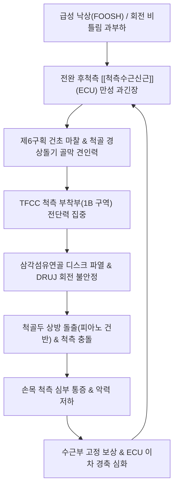

---
aliases:
  - 삼각섬유연골복합체손상
  - TFCC
  - TFCC손상
  - 삼각섬유연골파열
  - TFCC Tear
  - Triangular Fibrocartilage Complex Tear
tags:
  - 이론
  - 질환
  - 근골격계
  - 상지
  - 손목
title: 삼각섬유연골복합체 손상(TFCC 손상)
date: 2026-09-24
출처: "PMID: 2666492"
---

# 🩺 삼각섬유연골복합체 손상 (TFCC 손상, S63.5)

> **핵심 3줄 요약 (Key Summary)**:
> - 📍 병소 부위 & 해부·병태생리: 손목 척측(새끼손가락 쪽)의 완충 패드이자 원위 요척관절(DRUJ)을 안정화하는 삼각섬유연골(TFC), 반월상판, 척수근인대 복합체의 파열 및 손상.
> - 🚩 전형적 임상 양상 & 3대 징후: 손목 척측 심부 통증(비틀기/걸레짜기 시 악화), 척골 함요부(Fovea) 압통, 척골두의 덜컹거림 및 악력 저하.
> - 🛠️ 핵심 감별 검사 & 한·양방 다각적 치료 전략: 피아노 건반 검사(Piano Key Test), 척측 수근 압박 검사 양성. 원위 요척관절 정복 추나, 양곡·양지 온침, 자하거/봉약침, [[척측수근신근]](ECU) 이완 및 [[서경탕]]·[[독활기생탕]].
> - ⚠️ 응급 의뢰 레드플래그 & 악화 요인: 원위 요척관절(DRUJ)의 완전 탈구 또는 3개월 이상 보존 치료 무반응 중심부(1A) 대형 파열 시 관절경 수술 의뢰.

---

## 📌 목차
1. [질환 개요 & 해부학적 병태생리](#1-질환-개요--해부학적-병태생리)
2. [병태생리 메커니즘 & 생체역학적 악순환 네트워크](#2-병태생리-메커니즘--생체역학적-악순환-네트워크)
3. [임상 증상 & 이학적 검사(Physical Exam) 알고리즘](#3-임상-증상--이학적-검사physical-exam-알고리즘)
4. [감별 진단 매트릭스 (Differential Diagnosis)](#4-감별-진단-매트릭스-differential-diagnosis)
5. [한의 통합 치료 프로토콜 (침·약침·추나·한약)](#5-한의-통합-치료-프로토콜-침약침추나한약)
6. [재활 운동 & 생활습관 티칭 가이드](#6-재활-운동--생활습관-티칭-가이드)
7. [💡 사용자 진료실 핵심 필기 & 임상 노하우 (Melt-In 잔여 심화 집약)](#7--사용자-진료실-핵심-필기--임상-노하우-melt-in-잔여-심화-집약)
8. [출처 및 학술 참고 문헌 (References)](#8-출처-및-학술-참고-문헌-references)

---

## 1. 질환 개요 & 해부학적 병태생리

![[Pasted image 20240114192115.png|450]]
> [해부학 도해] TFCC의 구성요소 및 ECU(척측수근신근) 건초와의 해부학적 연결성. 관절 원판(Articular disc), 척월상인대, 척삼각인대, 장·배측 요척인대 및 척골두를 감싸는 ECU 건초의 유기적 복합체 구조.

### (1) TFCC(Triangular Fibrocartilage Complex)의 해부학적 복합 구조
* **손목 척측의 '반월판(Meniscus)'**:
  * 요골 원위부 척측 절흔(Sigmoid Notch)에서 시작하여 척골 경상돌기(Ulnar Styloid) 및 기저부(Fovea)에 부착되는 섬유연골-인대 복합체.
  * **삼각섬유연골 디스크 (Articular Disc / TFC proper)**: 무릎의 반월판과 유사한 섬유연골성 완충 조직.
  * **장·배측 요척인대 (Palmar & Dorsal Radioulnar Ligaments)**: 원위 요척관절(DRUJ)의 회전 안정성을 유지하는 핵심 기둥.
  * **척수근인대군**: 척월상인대(Ulnolunate), 척삼각인대(Ulnotriquetral).
  * **[[척측수근신근]](ECU) 건초 (Subsheath)**: 제6 신전건 구획의 바닥을 형성하며 TFCC의 외측 섬유와 유기적으로 융합됨.

### (2) 생체역학적 기능과 하중 분산
* **충격 흡수 (Shock Absorption)**:
  * 손목에 가해지는 체중 및 축성 압박력의 약 $80\%$는 요골이, 나머지 **$20\%$는 TFCC를 통해 척골이 흡수**한다.
  * 척골이 상대적으로 긴 **양성 척골 변위(Positive Ulnar Variance)**를 가진 환자는 척측 관절면 하중이 $40\%$ 이상으로 급증하여 퇴행성 파열 위험이 극대화된다.
* **원위 요척관절(DRUJ) 회전 안정자**:
  * 전완의 회내(Pronation) 및 회외(Supination) 동작 시 척골두를 중심으로 요골이 회전할 때 관절면이 탈구되지 않도록 팽팽하게 잡아주는 일차적 안정자 역할을 수행함.

### (3) 혈관 분포와 치유 잠재력 (Vascular Zonation)
* **외측 주변부 (Peripheral Zone, 10~20%)**: 척골동맥 분지가 풍부하게 유입되는 'Red Zone'으로 혈류 공급이 원활하여 침·약침 및 보존적 치료로 우수한 자연 치유력을 보임.
* **중심부 (Central Zone, 80%)**: 혈관이 전혀 없는 무혈관성 'White Zone'으로 단순 연골 마모나 파열 시 자연 치유가 극히 불가능함.

---

## 2. 병태생리 메커니즘 & 생체역학적 악순환 네트워크

### (1) 급성 외상성 파열 (FOOSH Mechanism)
* 손을 짚고 넘어질 때(Fall Onto Outstretched Hand, FOOSH): 손목이 과도하게 신전(Dorsiflexion)되고 회내(Pronation)되면서 체중 전체가 척측 관절원판에 순간적으로 전달되어 파열 발생.
* 라켓 스포츠나 골프 스윙 중 뒷땅을 치며 손목이 강제로 비틀릴 때 인대 부착부 견열 손상.

### (2) ECU의 힘줄견인점과 골막 자극 연쇄 파열
* **ECU 과사용 및 힘줄견인점(Tendon Traction Point) 형성**:
  * 손목을 척측으로 꺾거나 비트는 반복 작업으로 인해 전완 배측 척측의 [[척측수근신근]](ECU) 근복에 만성 과긴장과 단축이 발생함.
* **골막 자극 및 신전지대 마찰**:
  * 단축된 ECU가 등장성 수축을 반복할 때마다, 제6신전구획 신전지대(Extensor Retinaculum)와의 격렬한 마찰이 발생하고 척골 경상돌기 부착부 골막을 지속적으로 강하게 잡아당김.
* **TFCC 지지대 붕괴**:
  * ECU 건초는 TFCC의 바깥쪽 벽과 하나로 이어져 있으므로, ECU의 만성 건초염과 견인 장력은 TFCC의 척측 부착부(1B 구역)를 지속적으로 뜯어내는 전단력을 가하여 마침내 TFCC 섬유연골 복합체의 파열로 귀결됨.

![[Extensor_carpi_ulnaris_anatomy.png|280]]
> [해부학 도해] 척측수근신근(Extensor Carpi Ulnaris, ECU). 전완 후외측 상완골 외측상과에서 기시하여 제5중수골 기저부에 정지하며, 손목 척측에서 TFCC 건초와 직접 결합한다.

---

## 3. 임상 증상 & 이학적 검사(Physical Exam) 알고리즘

### (1) 주요 임상 증상
* **손목 척측의 심부 통증 (Ulnar-sided Wrist Pain)**:
  * 문손잡이 돌리기, 병뚜껑 따기, 걸레 짜기, 자동차 핸들 돌리기, 무거운 냄비 들기 등 손목을 비틀거나 척측으로 편위할 때 날카로운 찌릿함 호소.
* **탄발음(Clicking) 및 걸림 현상**:
  * 손목을 회전시킬 때 척골두 주변에서 '뚝' 하는 마찰음이나 무언가 끼었다 풀리는 듯한 불안정한 덜컹거림.
* **압통점**:
  * 척골 경상돌기와 두상골/삼각골 사이의 얕은 오목한 홈인 **척골 함요(Ulnar Fovea)**를 누를 때 날카로운 국소 압통(Fovea Sign).
* **악력 약화**:
  * 통증과 불안정성으로 인해 주먹을 꽉 쥐지 못하고 척측에 힘이 들어가지 않음.

### (2) 팔머(Palmer) 손상 분류 체계

| 분류 | 세부 유형 | 손상 병태 | 임상적 특징 및 예후 |
| :--- | :--- | :--- | :--- |
| **Class 1 (외상성)** | **1A** | 관절원판 중심부 무혈관 영역 천공 | 퇴행성 변화 동반, 보존적 치료 반응 제한적 |
| | **1B** | 척골 부착부(Fovea/Styloid) 견열 | **혈류 풍부(Red Zone), 보존 치료 및 침·약침 반응 최상** |
| | **1C** | 척수근인대(Ulnolunate/Ulnotriquetral) 파열 | 수근골 불안정성 동반 |
| | **1D** | 요골 부착부(Sigmoid notch) 박리 | 요척관절 불안정성 유발 |
| **Class 2 (퇴행성)** | 2A ~ 2E | 관절원판 마모 $\rightarrow$ 연골연화 $\rightarrow$ 천공 $\rightarrow$ 관절염 | 양성 척골 변위와 동반된 만성 척골 충돌 증후군 |

### (3) 필수 이학적 유발 검사법
* **피아노 건반 검사 (Piano Key Test / DRUJ Ballottement)**:
  * 환자의 전완을 회내시킨 상태에서 검사자가 척골두를 피아노 건반 누르듯 하방으로 압박한 뒤 놓았을 때, 척골두가 덜컹거리며 위로 솟아오르고 통증이 발생하면 DRUJ 인대 파열 및 불안정성 양성.
* **척측 수근 압박 검사 (TFCC Compression / Grind Test)**:
  * 손목을 수동으로 최대한 척측 편위(Ulnar deviation)시킨 상태에서 축성 압박력(Axial load)을 가하며 손목을 비틀 때 척측 관절면의 극심한 통증이나 연발음 발생 시 양성.
* **척골 함요 징후 (Ulnar Fovea Sign)**:
  * 척골 경상돌기와 척측수근굴근 건 사이 함요부를 강하게 압박할 때 국소 압통 재현 ($95\%$의 높은 민감도).
* **의자 밀기 검사 (Press-up Test)**:
  * 의자 팔걸이를 짚고 체중을 실어 일어설 때 손목 척측 통증으로 지탱하지 못하면 양성.

---

## 4. 감별 진단 매트릭스 (Differential Diagnosis)

| 감별 질환 | 호발 병소 및 원인 | 주소증 차이점 | 특이적 이학적 검사 소견 |
| :--- | :--- | :--- | :--- |
| **[[삼각섬유연골복합체 손상(TFCC 손상)]]** | 손목 척측 관절원판 및 DRUJ | 손목 비틀기/걸레짜기 시 척측 심부 통증 | 피아노 건반 검사, 척측 수근 압박 검사 양성 |
| **[[척측수근신근]] 건초염 (ECU)** | 제6신전건 구획 건초 | 척골두 바로 위 표재성 압통 및 마찰음 | ECU 저항성 신전 검사 통증 재현 |
| **[[가이온관 증후군]]** | 손목 두상골-유구골 사이 | 제4·5수지 수장측 저림, 근위축 | [[프로멘트 검사]], 가이온관 티넬 양성 |
| **척골 충돌 증후군** | 양성 척골 변위 (척골 과신장) | 체중 부하 시 만성 둔통, 관절염성 | X-ray상 양성 척골 변위, 월상골 경화 |
| **삼각골 골절 / 불유합** | 수근골 배측 손상 (낙상) | 삼각골 국소 타진통, 손목 굴곡통 | 삼각골 압통, 사위상 X-ray 골절선 |

---

## 5. 한의 통합 치료 프로토콜 (침·약침·추나·한약)

![[Extensor_carpi_ulnaris_TriggerPoints.jpg|320]]
> [그림 3: ③ 치료·시술점 — 척측수근신근(ECU) 발통점 및 손목 척측(양곡·양지·완골) 침구·약침 자입 도해]

### (1) 침구 치료 (Acupuncture)
* **손목 척측 국소 관절강 취혈**:
  * 양지(TE4), 양곡(SI5), 완골(SI4): TFCC 관절낭 주변 및 척골두 주위 활액막염 진정 (0.25×30mm 호침으로 10~15mm 사자).
  * 중저(TE3), 후계(SI3): 수부 척측 경락 기혈 순환 촉진.
* **ECU 근복 이완 (핵심 치료점)**:
  * 지구(TE6), 소해(SI8): 전완 후척측의 [[척측수근신근]](ECU) 근복 발통점에 0.30×40mm 호침으로 20~25mm 깊이 자침하여 과긴장된 톤을 떨어뜨리고, 건 정지부로 전달되는 골막 견인력을 차단.

### (2) 약침 및 화침(온침) 요법
* **인대강화 및 혈관 증식 약침**:
  * 척골 함요(Ulnar Fovea) 및 척월상/척삼각인대 주변(Red zone)으로 자하거 약침 또는 신바로약침 0.5~1.0cc(30G 1/2인치)를 정밀 주입하여 손상된 섬유 결합조직의 재생과 미세혈류 증식을 촉진.
* **봉약침(BV) 및 소염약침**:
  * 급성 부종 및 열감기에는 고농도 봉약침(1:30,000 희석액) 0.1~0.2cc를 양곡·양지혈 주변 피내에 구진(Wheal) 형성 기법으로 자입하여 삼출액 흡수 촉진.
* **화침(온침) 요법**:
  * 혈류 공급이 취약한 백색 섬유연골 복합체 특성상, 침체를 가열하는 화침 또는 온침(溫針)을 양곡·양지혈 부위에 적용하여 심부 온열 자극을 가함으로써 섬유아세포 활성화 및 국소 미세혈류 순환을 극대화.

### (3) 추나 요법 (Chuna Manual Therapy)
* **원위 요척관절(DRUJ) 정복 가동술**:
  * 배측으로 전위된 척골두를 손바닥 방향(장측)으로 부드럽게 글라이딩하며 요수근관절의 미세 변위 교정.
* **전완부 골간막 및 ECU 근막 이완 (MET)**:
  * 요골-척골 간 회전 밸런스를 바로잡고 척측수근신근을 수동 신장하는 근에너지기법 적용.

### (4) 한약 치료 (Herbal Medicine)
* **급성 외상성 파열 (어혈·염증)**: [[서경탕]](舒經湯), [[당귀수산]](當歸鬚散) 가미방.
* **만성 퇴행성 파열 (연골 마모·기혈허약)**: [[독활기생탕]](獨活寄生湯), 신통축어탕(身痛逐瘀湯) 가미방.

---

## 6. 재활 운동 & 생활습관 티칭 가이드

### (1) 초기 고정 원칙 (Wrist & Forearm Immobilization)
* 단순 손목 밴드는 전완의 회전(회내/회외)을 막지 못해 TFCC를 계속 비틀리게 만듦.
* 급성 파열기(첫 3~4주)에는 주관절까지 포함하거나 상·하 요척관절을 동시에 잡아주는 **TFCC 전용 스트랩(Ulnar Wrist Brace / WristWidget)**을 착용하여 전완 회전을 철저히 제한해야 함.

### (2) 등척성 강화 및 고유수용감각 재활
* **통증 소퇴 후 (4주 이후)**:
  * 전완 회내/회외 등척성 운동: 통증이 없는 중립위에서 손목을 고정하고 가벼운 등척성 저항 훈련.
  * 회전근개 및 견갑골 안정화: 상지 근위부의 불안정성으로 인해 손목에 과도한 비틀림 부하가 집중되지 않도록 견갑배근 강화 병행.

### (3) 일상생활 금기 동작
* 손바닥으로 바닥 짚고 일어나기 금지 (주먹을 쥐고 너클 부위로 짚거나 팔꿈치 이용).
* 걸레나 수건을 쥐어짜는 비틀림 동작 금지.
* 벤치프레스, 푸시업 시 손목이 뒤로 꺾이지 않도록 손목 랩(Wrist Wrap) 착용 필수.

---

## 7. 💡 사용자 진료실 핵심 필기 & 임상 노하우 (Melt-In 잔여 심화 집약)

* **원장님 필기 핵심 융합: ECU 건막염과 TFCC 파열의 닭과 달걀 관계**:
  * 환자가 손목 척측이 아프다고 오면 대부분 TFCC 파열만 의심하지만, 실제로 초음파나 촉진을 해보면 그보다 1~2cm 위쪽의 [[척측수근신근]](ECU) 건초염이 80% 이상 동반되어 있다.
  * ECU 건의 활차 마찰과 과긴장 단축을 방치한 채 TFCC 부위에만 약침을 놓으면 일시적으로만 덜 아플 뿐, 손목을 돌릴 때마다 다시 뜯기며 재발한다.
  * 따라서 반드시 팔꿈치 아래 ECU 근복을 꼼꼼히 촉진하여 단단한 밴드를 풀어주고, ECU 힘줄이 척골 고랑을 부드럽게 미끄러지도록 만들어주는 것이 TFCC 보존 치료 완치의 핵심 열쇠다.
* **수술(봉합술) 의뢰의 절대적 레드플래그**:
  * 모든 TFCC 손상이 한의 보존 치료 대상인 것은 아니다.
  * 환자의 척골두가 육안으로도 툭 튀어나와 있고, 피아노 건반 검사 시 뼈가 덜렁거리며 요척관절의 완전 탈구가 관찰되는 경우(Complete DRUJ Dislocation), 또는 3개월 이상의 철저한 고정 및 한의 복합 치료에도 극심한 통증으로 일상생활이 불가능한 1A 중심부 대형 파열은 지체 없이 수부 정형외과 관절경 봉합술/절제술을 의뢰해야 한다.
* **헬스/골프 동호인 환자 설명법**:
  * "환자분, 손목 안쪽의 삼각섬유연골은 자동차 바퀴의 쇼바(완충장치)와 같습니다. 바닥을 손바닥으로 짚거나 덤벨을 쥘 때 손목이 뒤로 꺾이면 척골 뼈가 이 연골을 맷돌처럼 짓이깁니다. 치료 기간 중에는 바닥을 짚지 마시고, 덤벨을 쥘 때는 손목을 반듯하게 11자로 세우는 중립 그립을 유지하셔야 연골이 아물 수 있습니다."

---

## 8. 출처 및 학술 참고 문헌 (References)

* **Palmer AK. (1989)**. *Triangular fibrocartilage complex lesions: a classification*. The Journal of Hand Surgery (American Volume), 14(4), 594-606. [PMID: 2666492](https://pubmed.ncbi.nlm.nih.gov/2666492/)
  * `[연구 요약]`: 삼각섬유연골복합체(TFCC) 파열을 외상성(Class 1A~1D)과 퇴행성(Class 2A~2E)으로 명확히 구분하고, 해부학적 파열 위치와 척골 변위에 따른 병태생리 및 치료 지침을 최초로 정립한 전 세계 공인 표준 분류 논문.
* **Skalski MR, et al. (2016)**. *The Traumatized TFCC: An Illustrated Review of the Anatomy and Injury Patterns of the Triangular Fibrocartilage Complex*. Current Problems in Diagnostic Radiology, 45(1), 39-50. [PMID: 26117527](https://pubmed.ncbi.nlm.nih.gov/26117527/)
  * `[연구 요약]`: TFCC의 3차원 해부 구조, 척수근인대와 ECU 건초의 상호 연결성, 외상성 손상 기전 및 고해상도 MRI 영상 판독 가이드를 일러스트와 함께 총정리한 종설.
* **Andersson JK, et al. (2023)**. *A structured non-operative treatment program for traumatic triangular fibrocartilage complex tear: A quasi-experimental study*. Hand Surgery and Rehabilitation, 42(5), 415-422. [PMID: 37494879](https://pubmed.ncbi.nlm.nih.gov/37494879/)
  * `[연구 요약]`: 외상성 TFCC 파열 환자를 대상으로 한 5단계 체계적 비수술 보존 치료 및 재활 프로토콜의 임상 연구로, 80% 이상의 환자에서 수술 없이 통증 감소, 악력 회복 및 DRUJ 안정화가 달성됨을 입증함.

<!-- 보관 태그(1회용·링크오류, 필요시 복원): 연골손상 -->
