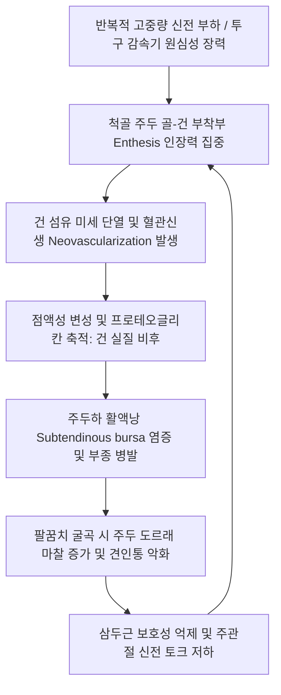

# 🖐️ [[삼두건염]] (Triceps Tendinopathy / Triceps Tendinitis)

> **핵심 3줄 요약 (Key Summary)**:
> - 📍 병소 부위 & 해부·병태생리: 상완 후면의 [[상완삼두근]](Triceps brachii) 건이 척골 주두(Olecranon process)에 부착하는 골-건 부착부(Enthesis)에 반복적 저항 주관절 신전 및 감속 부하로 인해 미세 파열, 콜라겐 변성, 석회화 및 무균성 건염이 발생하는 질환.
> - 🚩 전형적 임상 양상: 팔꿈치 후면 주두 끝 부착부의 국소 압통, 팔굽혀펴기, 벤치프레스, 투구 동작이나 밀기 시 팔꿈치 뒤쪽의 찌릿한 통증, 주관절 완전 수동 굴곡 시 견인통 및 저항 신전 시 악화.
> - 🛠️ 핵심 감별 검사 & 한·양방 다각적 치료 전략: 저항 주관절 신전 검사, 주두 건 부착부 촉진, 초음파 건 비후 및 파열 평가. [[천정]](TE10)·[[청랭연]](TE11)·[[소해]](SI8) 침구 치료, 주두 건 부착부 신바로·소염약침 수력박리, 삼두근 원심성 수축 운동 및 주관절 신전 제한 테이핑.
> - ⚠️ 응급 의뢰 레드플래그: 주두 부착부의 갑작스러운 팝 소리와 함께 주관절 능동 신전 완전 불능, 주두 상방의 건 결손 함몰(Palpable defect) $\rightarrow$ 삼두근건 완전 파열(Rupture) 즉시 정형외과 응급 수술 의뢰.

---

## 📌 목차
1. [질환 개요 & 해부학적 병태생리](#1-질환-개요--해부학적-병태생리)
2. [병태생리 메커니즘 & 생체역학적 악순환 네트워크](#2-병태생리-메커니즘--생체역학적-악순환-네트워크)
3. [임상 증상 & 이학적 검사(Physical Exam) 알고리즘](#3-임상-증상--이학적-검사physical-exam-알고리즘)
4. [감별 진단 매트릭스 (Differential Diagnosis)](#4-감별-진단-매트릭스-differential-diagnosis)
5. [한의 통합 치료 프로토콜 (침·약침·추나·한약)](#5-한의-통합-치료-프로토콜-침약침추나한약)
6. [양방 치료 & 병용·의뢰 기준 (Conventional Treatment & Referral)](#6-양방-치료--병용의뢰-기준-conventional-treatment--referral)
7. [재활 운동 & 생활습관 티칭 가이드](#7-재활-운동--생활습관-티칭-가이드)
8. [💡 사용자 진료실 핵심 필기 & 임상 노하우 (Melt-In 잔여 심화 집약)](#8--사용자-진료실-핵심-필기--임상-노하우-melt-in-잔여-심화-집약)
9. [출처 및 학술 참고 문헌 (References)](#9-출처-및-학술-참고-문헌-references)

---

## 1. 질환 개요 & 해부학적 병태생리

![[삼두건염_01_주두부착부_석회및종창_Xray.jpg|480]]
> [그림 1: ① 질환/병태생리 영상 — 삼두근건 주두 부착부 석회성 건염 및 연부조직 종창] 단순 방사선 측면상에서 관찰되는 척골 주두(Olecranon) 상방 삼두근건 부착부의 석회 침착과 골극 소견.

* **질환 정의 및 개념**:
  * 삼두건염(Triceps Tendinitis / Tendinopathy)은 상완 후면의 주된 신전근인 [[상완삼두근]](Triceps Brachii)의 건 실질 또는 척골 주두 부착부에 만성 과부하 및 미세 손상으로 인해 퇴행성 건병증과 염증이 발생하는 질환이다.
  * 상완골 외측상과염(테니스 엘보)이나 내측상과염(골퍼 엘보)에 비해 빈도는 낮으나, 웨이트 트레이닝 인구 증가 및 투구 스포츠 활동으로 인해 최근 다빈도로 관찰된다([Manske RC, 2025](https://pubmed.ncbi.nlm.nih.gov/40469652/)).
* **해부학적 구조와 부착부 특성**:
  * **삼두근 3두의 구성**:
    * 장두(Long head): 견갑골 관절하결절에서 기시 (이관절 근육).
    * 외측두(Lateral head) 및 내측두(Medial head): 상완골 후면에서 기시.
  * **공통 삼두근건 부착부 (Insertion)**:
    * 척골 주두의 후상방 골면에 넓은 돔 형태로 부착.
    * 건 심부와 주두 골면 사이에는 마찰을 줄이기 위한 **주두하 삼두근 활액낭(Subtendinous olecranon bursa)**이 위치하며, 건염과 함께 활액낭염이 흔히 동반됨.
* **호발 역학 및 유발 기전**:
  * 벤치프레스, 딥스(Dips), 밀리터리 프레스 등 고중량 푸시 운동.
  * 야구 투수, 미식축구 쿼터백의 던지기 동작 중 주관절 신전 감속기(Deceleration phase)의 원심성 과부하.

---

## 2. 병태생리 메커니즘 & 생체역학적 악순환 네트워크

![[삼두건염_02_삼두근건_MRI_시상면.jpg|480]]
> [그림 2: ② 관련 해부 구조물 — 정상 및 손상 삼두근건 시상면 MRI] 주두 골막에 부착하는 삼두근건의 건 실질 연속성과 건-골 부착부(Enthesis)의 해부학적 두께.

### 1) 부착부 건병증(Enthesopathy)의 특성
* 건이 뼈에 부착하는 부위는 섬유연골성 전이대(Fibrocartilaginous zone)를 거치며 혈류가 매우 취약하다.
* 만성적인 당김 자극이 지속되면 견인성 골극(Traction spur)이 주두 끝에 자라나며 건 실질 내부로 칼슘이 침착되는 석회성 건염(Calcific tendinitis)으로 발전한다.

---

## 3. 임상 증상 & 이학적 검사(Physical Exam) 알고리즘

![[Triceps_brachii_TriggerPoints.jpg|450]]
> [그림 3: ③ 이학적 검사 및 근막 통증점 — 상완삼두근 압통점 도해] 상완삼두근 근복부 및 주두 부착부에 형성되는 트리거 포인트와 팔꿈치 후면 방사통 경로.

### 1) 주요 임상 증상
* **주두 직상방 국소 압통**:
  * 팔꿈치 맨 끝 뾰족한 뼈(주두) 바로 1~2cm 상방의 삼두근건 부착부를 누를 때 날카로운 압통.
* **저항 신전통**:
  * 문을 밀거나 팔굽혀펴기를 할 때 팔꿈치 뒤쪽이 찌릿하게 끊어질 듯한 통증.
* **수동 굴곡 견인통**:
  * 팔꿈치를 끝까지 완전히 구부릴 때 팽팽해진 삼두근건이 당겨지며 발생하는 통증.

### 2) 단계별 이학적 검사 알고리즘
* **1단계: 주두 부착부 정밀 촉진**:
  * 팔꿈치를 90도 굴곡한 상태에서 주두 상단을 촉진하여 피하 주두낭염과 구별되는 심부 건 부착부 통증 확인.
* **2단계: 저항 주관절 신전 검사 (Resisted Elbow Extension)**:
  * 환자가 굴곡된 팔꿈치를 펴려고 할 때 검사자가 전완을 잡고 강하게 저항 $\rightarrow$ 주두 부착부 통증 유발 시 양성.
* **3단계: 변형 톰슨 검사 (Modified Thompson / Squeeze Test)**:
  * 환자의 팔을 침대 밖으로 늘어뜨린 후 삼두근 근복부를 강하게 쥐어짤 때 주관절의 불수의적 신전 여부 확인 (신전이 일어나지 않으면 완전 파열).

---

## 4. 감별 진단 매트릭스 (Differential Diagnosis)

| 감별 질환 | 호발 병소 | 통증 특성 및 차이점 | 결정적 감별점 |
| :--- | :--- | :--- | :--- |
| **[[삼두건염]]** | 척골 주두 부착부(건 실질) | 저항 주관절 신전통, 수동 완전 굴곡통 | 주두 상방 건 부착부 압통, 부종 경미 |
| **주두 점액낭염 (Olecranon Bursitis)** | 주두 후방 피하낭 (Bursa) | 주두 끝에 물혹처럼 불룩 튀어나옴 | 만져지는 물렁한 종창, 신전통 없음 |
| **주두 피로 골절** | 척골 주두 골단판/피질골 | 던지기 동작 시 뼈 자체의 심한 둔통 | 골 타진통 양성, X-ray/MRI 골절선 |
| **주관절 후방 충돌 증후군** | 주두와(Olecranon fossa) | 팔꿈치 완전 신전 시 후방 뼈 충돌통 | 과신전 유발통(Posterior impingement test+) |
| **경추 C7 신경근병증** | 경추 추간공 ([[경추신경근]]) | 삼두근 반사 저하, 중지 방사통 | 목 움직임 시 악화, Spurling(+) |

---

## 5. 한의 통합 치료 프로토콜 (침·약침·추나·한약)

![[삼두건염_05_술기실사_상지_전침치료.jpg|480]]
> [그림 4: ④ 한의 치료 술기 실사 — 상완삼두근 및 주관절 주변 경혈 전침 치료] 천정(TE10)·청랭연(TE11) 등 주관절 주변 경혈에 자침 후 저주파 전침을 인가하여 건-골 부착부 미세순환 복원 및 조직 재생을 유도하는 임상 술기 — Wikimedia Commons / US Navy / Lt. O. Cabrera

### 1) 침구 치료 & 건 부착부 전침
* **핵심 선혈 혈위**:
  * **국소 혈위**: [[천정]](TE10, 주두 상방 1촌 오목한 곳), [[청랭연]](TE11), [[소해]](SI8), [[소해]](HT3).
  * **삼두근 근복 발통점**: 상완 후면 외측두 및 내측두 트리거포인트.
* **2Hz 저주파 전침**:
  * 천정(TE10) - 청랭연(TE11)에 전침을 연결하고 **2Hz 저주파 연속파**를 15분간 인가하여 건-골 부착부 혈관내피성장인자(VEGF) 분비를 유도.

### 2) 약침 치료 (Pharmacopuncture)
* **제제 처방**:
  * 급성 건염 및 활액낭 부종: **황련해독탕 약침** 또는 **중성어혈 약침** 0.5cc.
  * 만성 석회화 및 건 퇴행: **신바로 약침** 또는 **자하거 약침** 1.0cc.
* **초음파 유도하 시술 지침**:
  * 건 실질 관통을 피하고 주두하 활액낭 및 건 주위 결합조직에 얕게 주입([Novotný T, 2025](https://pubmed.ncbi.nlm.nih.gov/40878600/)).

### 3) 상완삼두근 근막이완 추나
* **삼두근 횡단 마찰 수기 (Cross-Friction Manipulation)**:
  * 주관절을 약간 굴곡시켜 건을 긴장시킨 상태에서 주두 바로 상방 건 섬유와 직각 방향으로 엄지손가락 마찰 마사지를 적용하여 비생리적 반흔 유착 박리.

### 4) 한약물 요법
* **어혈응체형(瘀血凝滯型)**: 운동 손상 후 찌르는 듯한 국소통 $\rightarrow$ [[당귀수산]](當歸鬚散), [[활혈통기산]](活血通氣散).
* **풍한습비형(風寒濕痺型)**: 팔꿈치가 굳고 찬 바람 맞으면 쑤심 $\rightarrow$ [[오적산]](五積散), [[대강활탕]](大羌活湯).
* **간신부족형(肝腎不足型)**: 건의 만성 퇴행, 힘빠짐, 고령 $\rightarrow$ [[독활기생탕]](獨活寄生湯).

---

## 6. 양방 치료 & 병용·의뢰 기준 (Conventional Treatment & Referral)

* **보존적 치료**:
  * 급성기 냉찜질 및 경구 소염진통제(NSAIDs) 1~2주 단기 투여.
  * 주관절 30도 굴곡 제한 테이핑 또는 보조기 착용.
* **체외충격파 치료 (ESWT)**:
  * 주두 부착부 석회성 침착물 분해 및 건 혈류 개선을 위해 집중형 충격파(Focused ESWT) 2,000타 주 1회 시행.
* **국소 스테로이드 주사의 절대 주의점**:
  * 주두 건 부착부에 스테로이드 주사를 직접 놓을 경우 삼두근건의 급성 파열 위험이 현저히 높아지므로 1차 치료로 권장되지 않음([Novotný T, 2025](https://pubmed.ncbi.nlm.nih.gov/40878600/)).
* **수술적 치료 적응증 (Surgical Indication)**:
  * 6개월 이상 보존 치료에 반응하지 않는 심한 건 파열(>50%) 또는 주두 골극 제거술.
  * **완전 파열 시 즉시 관혈적 건 재부착술(Direct repair to bone)** 시행.
* **양방 의뢰 기준**:
  * 주관절 신전력 완전 상실 및 주두 상단 함몰 징후 확인 시 정형외과 응급 의뢰.

---

## 7. 재활 운동 & 생활습관 티칭 가이드

![[손목과사용증후군_07_손목신전스트레칭.jpg|480]]
> [그림 5: ⑤ 재활 운동 — 삼두근 신장 스트레칭] 팔을 머리 위로 올려 팔꿈치를 굽힌 후 반대 손으로 팔꿈치를 뒤로 당겨 상완삼두근을 신장하는 방법.

![[Triceps_brachii_heads.jpg|450]]
> [그림 6: ⑥ 재활 운동 — 상완삼두근 3두 해부 구조] 삼두근 장두, 외측두, 내측두의 선택적 원심성 수축 훈련을 위한 근육 배치도.

### 1) 단계별 자가 재활 운동
* **삼두근 원심성 신장 운동 (Eccentric Triceps Training)**:
  * 가벼운 덤벨을 쥐고 두 손으로 머리 위로 올린 후, 아픈 팔만 사용하여 5초에 걸쳐 천천히 팔꿈치를 굽히며 저항을 버티는 원심성 수축 훈련(10회 3세트).
* **주관절 신전근 등척성 운동**:
  * 통증이 없는 각도에서 벽을 손바닥으로 밀어내는 등척성 힘주기(5초 유지, 10회).

### 2) 헬스 트레이닝 수정 수칙
* **딥스(Dips) 및 프렌치 프레스 일시 중단**: 주관절이 90도 이상 과도하게 굴곡되며 주두 부착부에 최대 인장력이 걸리는 운동 전면 제한.
* **벤치프레스 그립 너비 조절**: 너무 좁은 그립(Close-grip)은 삼두근에 부하를 집중시키므로 어깨너비보다 약간 넓은 그립으로 전환.

---

## 8. 💡 사용자 진료실 핵심 필기 & 임상 노하우 (Melt-In 잔여 심화 집약)

> [!TIP] **진료실 임상 진단 & 치료 노하우**
> 1. **주두 점액낭염(물혹)과의 흔한 혼동 주의**:
>    - 팔꿈치 뒤쪽이 아프다고 올 때 주두 위에 물이 찬 주두 점액낭염(Bursitis)과 뼈에 붙은 힘줄이 찢어진 삼두건염을 혼동하기 쉽다. 점액낭염은 뼈 위 피하에 물렁한 주머니가 만져지지만, 삼두건염은 겉보기에 큰 혹이 없으면서 주두 뼈 상단을 뼈 방향으로 깊게 눌렀을 때만 날카로운 비명 압통이 있다([Savoie FH, 2025](https://pubmed.ncbi.nlm.nih.gov/40980223/)).
> 2. **헬스인의 '딥스(Dips)' 운동 금지령**:
>    - 삼두건염으로 내원하는 20~40대 남성의 90%는 헬스장에서 딥스(Dips)나 스컬 크러셔(Skull crusher)를 고중량으로 하다가 다친 환자들이다. 치료 기간 동안 딥스는 절대 금지시켜야 하며, 이를 어기면 아무리 침과 약침을 맞아도 주두 뼈 부착부가 계속 뜯겨나간다.
> 3. **천정(TE10)혈 사자(Slanted) 자침 노하우**:
>    - 천정혈에 침을 놓을 때 주두 뼈를 향해 직자로 깊게 찔러 넣으면 건 실질을 관통하여 통증이 심해질 수 있다. 주관절을 60도 정도 가볍게 굽힌 상태에서 주두 상방 1촌에서 침첨을 주두 골막 방향으로 30~45도 비스듬히 사자하여 건초 외막을 타고 미끄러지듯 자입해야 득기감이 부드럽고 건 손상이 없다.

---

## 9. 출처 및 학술 참고 문헌 (References)

1. Savoie FH, et al. Arthroscopic Repair of Distal Triceps Tendon Rupture Provides Excellent Functional Outcomes With Minimal Complications. *Arthrosc Sports Med Rehabil*. 2025;7(4):e101124. [PMID: 40980223](https://pubmed.ncbi.nlm.nih.gov/40980223/)

   - [연구 요약]: 상완삼두근 건병증의 악화로 인한 원위부 파열 환자에서 관절경하 봉합술의 우수한 기능 회복과 합병증 분석.

2. Novotný T, et al. [Ultrasound-Guided Interventions for the Elbow]. *Acta Chir Orthop Traumatol Cech*. 2025;92(4):215-224. [PMID: 40878600](https://pubmed.ncbi.nlm.nih.gov/40878600/)

   - [연구 요약]: 주관절 주변 건병증(외측상과염, 내측상과염, 삼두건염)에서 초음파 유도하 보존적 중재술의 안전한 자입 궤적과 합병증 회피 전략 분석.
