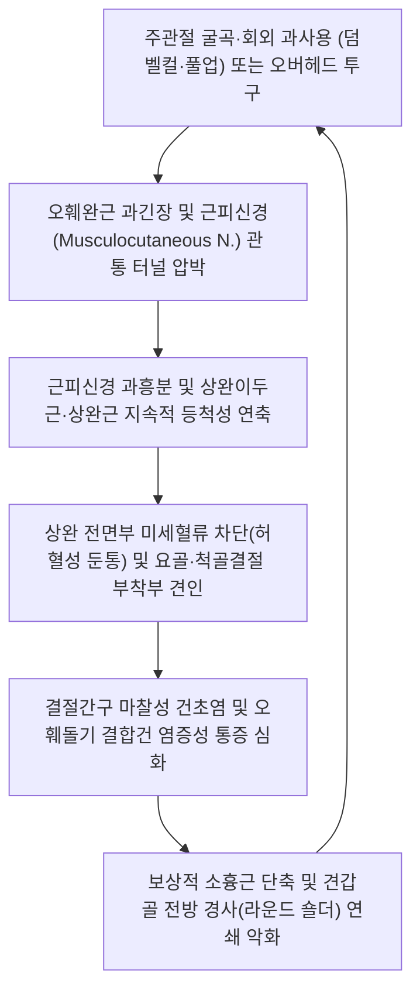

# 🩺 [[상완 앞면 통증]] (Anterior Arm Pain / 前上腕痛, ICD-10 M79.12 / G56.8)

> **핵심 3줄 요약 (Key Summary)**:
> - 📍 병소 부위 & 해부·병태생리: [[오훼완근]](Coracobrachialis)을 관통하는 [[근피신경]](Musculocutaneous nerve)의 포착 및 [[상완이두근]](Biceps brachii), [[상완근]](Brachialis)의 병적 등척성 연축·건골부착부 마찰로 인한 상완 전면부 복합 근막·신경병증성 동통 증후군.
> - 🚩 전형적 임상 양상 & 3대 징후: 물건을 들어 올리거나 팔꿈치를 구부릴 때 상완 앞면 전체의 뻐근한 허혈성 통증, 상완골두 앞면([[이두근건염]]), 오훼돌기 부착부 및 전주와(Cubital fossa) 요골·척골 결절 부위의 국소 압통과 시큰거림.
> - 🛠️ 핵심 감별 검사 & 한·양방 다각적 치료 전략: 오훼돌기 3총사 부착부 촉진, [[야거슨 검사]], 스피드 검사, 회내 굴곡 상완근 검사; C5-C6 신경근병증 감별; 천천/극천 사자침, 척택 전침, 신바로 약침 및 결절간구 소침도 박리, [[작약감초탕]]/[[서경탕]] 처방.
> - ⚠️ 응급 의뢰 레드플래그 & 악화 요인: 이두근 장두건 완전 파열(뽀빠이 변형, Popeye deformity), 급격한 전완 외측 감각 소실 또는 상완이두근 반사 소실 시 정형외과/신경과 정밀 의뢰.

---

## 📌 목차
1. [질환 개요 & 해부학적 병태생리](#1-질환-개요--해부학적-병태생리)
2. [병태생리 메커니즘 & 생체역학적 악순환 네트워크](#2-병태생리-메커니즘--생체역학적-악순환-네트워크)
3. [임상 증상 & 이학적 검사(Physical Exam) 알고리즘](#3-임상-증상--이학적-검사physical-exam-알고리즘)
4. [감별 진단 매트릭스 (Differential Diagnosis)](#4-감별-진단-매트릭스-differential-diagnosis)
5. [한의 통합 치료 프로토콜 (침·약침·추나·한약)](#5-한의-통합-치료-프로토콜-침약침추나한약)
6. [재활 운동 & 생활습관 티칭 가이드](#6-재활-운동--생활습관-티칭-가이드)
7. [💡 사용자 진료실 핵심 필기 & 임상 노하우 (Melt-In 잔여 심화 집약)](#7--사용자-진료실-핵심-필기--임상-노하우-melt-in-잔여-심화-집약)
8. [출처 및 학술 참고 문헌 (References)](#8-출처-및-학술-참고-문헌-references)

---

## 1. 질환 개요 & 해부학적 병태생리

### (1) 정의
[[상완 앞면 통증]](Anterior Arm Pain)은 견관절 전면 오훼돌기 및 결절간구에서부터 주관절 전주와(Anterior cubital fossa)에 이르는 상완 전면 굴곡근 구획(Anterior flexor compartment)에 발생하는 통증 증후군이다. 상완 전면부 3대 굴곡근인 [[상완이두근]](Biceps brachii), [[상완근]](Brachialis), [[오훼완근]](Coracobrachialis)의 근막 발통점과, 이들 근육을 운동 지배하는 [[근피신경]](Musculocutaneous nerve)의 기계적 포착이 결합되어 나타난다.

### (2) 역학 및 호발 조건
* **근력 운동 과사용**: 덤벨 컬, 바벨 컬, 풀업(턱걸이), 암벽등반 등 주관절을 강하게 굴곡하거나 전완을 회외하는 운동 후 호발.
* **직업적 반복 동작**: 무거운 상자를 반복해서 품에 안아 나르는 택배·물류 기사, 목수, 장시간 바이올린·기타 등 악기 연주자.
* **투구 및 오버헤드 동작**: 야구 투수의 가속기에서 오훼완근과 이두근 단두가 최대로 신장되며 발생하는 미세 손상.

### (3) 근피신경과 상완 전면 구획 해부학
![[Pasted image 20240114233053.png|420]]
> [그림 1: ① 병태생리·영상 — 상완신경총 외측속 기시 근피신경의 오훼완근 관통 및 상완 전면 주행 경로]

* **오훼완근 관통 터널 (Musculocutaneous Tunnel)**:
  - 근피신경은 액와를 지난 후 오훼완근 근복의 상중 1/3 경계(오훼돌기 선단에서 원위 5~8cm 지점)를 비스듬히 관통한다.
  - 오훼완근이 비후되거나 단축되면 신경을 올가미처럼 조여 신경 허혈과 축삭 수송 장애를 유발한다.
* **운동 및 감각 이중 지배**:
  - 운동 지배: 오훼완근, 상완이두근(장두·단두), 상완근 전수 지배.
  - 감각 지배: 주관절 외측 건막을 뚫고 피하로 나와 외측전완피신경(Lateral antebrachial cutaneous nerve)으로 이어져 전완 요측 전면 및 후면 피부 감각 담당.

---

## 2. 병태생리 메커니즘 & 생체역학적 악순환 네트워크

### (1) 상완 전면 근육 연관통 패턴
![[Biceps_brachii_TriggerPoints.jpg|400]]
> [그림 2: ② 관련 해부 구조물 — 상완이두근 및 상완근 근막 발통점(TrP)과 상완 전면·전주와 방사통 도해]

* **상완이두근 발통점(TrP)**: 상완 전면 중간부 발통점에서 상방으로는 전삼각근 및 견관절 전면, 하방으로는 전주와 및 요골결절 부위로 통증을 방사한다.
* **상완근 발통점(TrP)**: 상완 원위 1/3 외측면 발통점에서 전삼각근 전면과 주관절 전주와 내측 및 제1수지 배부(합곡 부위)까지 깊숙한 방사통을 투사한다.

### (2) 상완 앞면 통증의 5대 세부 병태역학 기전
1. **오훼완근의 근피신경 포착 (허혈성 전면통)**:
   - [[오훼완근]] 과긴장 $\to$ 내부 관통 [[근피신경]] 과흥분 $\to$ [[상완이두근]]과 [[상완근]]의 지속적 병적 등척성 수축(Isometric spasm) $\to$ 미세혈관 압박 및 허혈성 둔통 유발.
2. **상완이두근 정지부 등장성 수축 (외측 전주와통)**:
   - 요골결절(Radial tuberosity) 정지부 건에 과도한 견인력 집중 $\to$ 건골부착부염 및 이두요골 활액낭 마찰 $\to$ 주관절 외측 전주와 통증.
3. **상완이두근 장두 기전 (견관절 전면통)**:
   - 장두건이 상완골두 전면 결절간구(Bicipital groove)를 활주하며 횡상완인대 및 건초와 반복 마찰 $\to$ [[이두근건염]] 유발.
4. **상완이두근 단두 기전 (오훼돌기 골막통)**:
   - 단두 기시부 오훼돌기 골막에 견인 부하 가중 $\to$ [[오훼완근]], [[소흉근]]과 결합된 오훼돌기 증후군(Coracoid syndrome) 형성.
5. **상완근 기전 (내측 전주와 및 외측 상완통)**:
   - 원위 척골결절 정지부 자극 $\to$ 내측 전주와 통증; 상완골 외측 중간 기시부 골막 자극 $\to$ 상완 외측 심부 뼈 통증 호소.

### (3) 생체역학적 악순환 네트워크 (Vicious Cycle)

---

## 3. 임상 증상 & 이학적 검사(Physical Exam) 알고리즘

### (1) 주요 임상 증상
* **상완 전면부의 묵직한 뻐근함 및 쥐어짜는 듯한 통증**:
  - 상완 중간 1/3 외측면을 중심으로 뻐근하고 무거운 둔통이 지속됨.
* **주관절 전주와 및 오훼돌기 국소 압통**:
  - 팔꿈치를 굽히거나 무거운 물건을 들어 올릴 때 전주와 앞쪽(이두근·상완근 정지부)에 찢어지는 듯한 시큰거림.
* **전완 요측 감각이상 동반**:
  - 근피신경의 종말 감각지인 외측전완피신경 압박으로 전완 바깥쪽 피부의 먹먹함 또는 찌릿함 유발.

### (2) 이학적 검사 알고리즘
1. **오훼돌기 압통 검사 (Coracoid Tenderness Test)**:
   - 쇄골 외측 하방 약 2.5cm 지점의 오훼돌기를 후방으로 압박.
   - **양성**: [[상완이두근]] 단두, [[오훼완근]], [[소흉근]] 결합건 건막염으로 인한 극심한 압통 유발.
2. **이두근 결절간구 촉진 검사**:
   - 상완골을 약간 외회전시킨 상태에서 전면 결절간구를 따라 엄지로 압박 $\to$ 장두건염 확인.
3. **전주와 결절 감별 촉진**:
   - 주관절 굴곡 상태에서 외측(요골결절 - 이두근 정지부)과 내측(척골결절 - 상완근 정지부)을 각각 심부 압박하여 병변 근육 감별.
4. **기능적 저항 유발 검사**:
   - **저항성 회외 검사 ([[야거슨 검사]])**: 주관절 90도 굴곡 상태에서 전완 회외 저항 시 결절간구 통증 $\to$ 이두근 장두 병변.
   - **저항성 전완 굴곡 검사 (Speed's test & Brachialis test)**:
     - 전완 회외 상태 굴곡 저항 $\to$ 상완이두근 유발.
     - 전완 회내(Pronation) 상태 굴곡 저항 $\to$ 이두근이 억제되고 [[상완근]]이 순수 부하를 받으므로 전주와 심부 통증 시 상완근 병변 확진.

---

## 4. 감별 진단 매트릭스 (Differential Diagnosis)

| 감별 항목 | 상완 앞면 통증 (이두근/상완근/근피신경) | 경추 5·6번 신경근병증 | 견봉하 충돌 증후군 | 극상근건 파열 |
| :--- | :--- | :--- | :--- | :--- |
| **원인 병변** | 전면 굴곡근 과긴장, 근피신경 포착 | 경추 디스크(C4-C5, C5-C6) 압박 | 견봉하 공간 협소, 점액낭염 | 극상근 힘줄 파열 |
| **통증 위치** | **상완 전면부, 오훼돌기, 전주와** | 목, 어깨 외측, 엄지손가락 방사 | 어깨 외측 삼각근 부착부 | 어깨 외측, 야간통 극심 |
| **특이 징후** | 오훼완근 압통, 전완 외측 감각이상 | 스펄링 검사 양성, 이두근 반사 저하 | 동통호(Painful arc 60~120도) | 드롭암 검사 양성, 외전력 약화 |
| **주관절 굴신 영향**| **팔꿈치 구부릴 때 통증 재현** | 무관 | 무관 | 무관 |

---

## 5. 한의 통합 치료 프로토콜 (침·약침·추나·한약)

![[Biceps_brachii_anatomy.png|380]]
> [그림 3: ③ 치료·시술점 — 상완이두근 장두·단두 기시부 결절간구 및 요골결절 정지부 침구·약침 시술 해부도]

### (1) 한의 변증 및 병리
* **수태음·수궐음 경근비통(手太陰·手厥陰 經筋痺痛)**: 상완 전면을 지나는 수태음폐경과 수궐음심포경의 기혈이 과로와 한사(寒邪)로 막혀 근육이 뭉치고 당기는 병태.
* **근급통(筋急痛) 및 어혈(瘀血)**: 과도한 수축으로 힘줄과 뼈가 맞닿는 부착부(골막)에 미세 어혈이 침착되어 찌르는 통증 발생.

### (2) 침구 및 전침 치료 SOP
* **오훼돌기 및 액와부 취혈 (근피신경 포착 해소)**:
  - 수궐음심포경 천천(PC2), 극천(HT1) 외측 약 1횡지 부위: 오훼완근과 상완이두근 사이 근간중격을 향해 0.30×60mm 호침으로 15~25mm 사자.
  - **혈관·신경 안전 가이드**: 액와동맥 맥동을 검지로 확인한 후 반드시 외측으로 최소 1.0~1.5cm 거리를 두고 외측 상방으로 사자하여 액와동정맥 및 상완신경총 내측속 손상을 원천 차단.
* **전면 근복 및 부착부 취혈**:
  - 수태음폐경 척택(LU5), 협백(LU4): 상완이두근건 외측 함요처에서 0.30×40mm 호침으로 15~20mm 직자.
  - 상완근 발통점(상완 외측 하 1/3) 부위: 상완골 외측연 골막을 향해 20~25mm 직자하여 득기감 유도.
* **전침 통전 프로토콜**:
  - 천천(PC2)과 척택(LU5)에 전침을 연결하고 2Hz 저주파(혼합파)를 15분간 통전하여 근피신경 과흥분 완화 및 이두근·상완근 동시 경련성 연축 억제.

### (3) 약침 및 소침도 치료
* **오훼돌기 결합건 약침**:
  - **신바로약침** 또는 **황련해독탕 약침** 1.0~1.5cc(30G 1/2인치 주사침): 오훼돌기 하외측 결합건(상완이두근 단두, 오훼완근 부착부)에 부채꼴(fanning) 기법으로 정밀 주입하여 건골부착부염증(Enthesopathy) 신속 소염.
* **근피신경 주위 수액 박리 (Hydrodissection)**:
  - 오훼완근 근복 관통 부위(오훼돌기 원위 5cm 지점)에 고농도 포도당(D5W) 또는 중성약침 2.0cc를 주입하여 근막 터널 신경 유착 해소 및 미세혈류 회복.
* **소침도 요법 (Acupotomy)**:
  - 요골결절 및 척골결절 부착부 만성 골막 비후와 결절간구 횡상완인대 섬유성 유착 부위를 0.35×40mm 침도로 신경·혈관 주행 방향과 평행하게(종축 방향) 2~3회 박리.

### (4) 한약 처방 (Herbal Medicine)
* **근육 긴장 및 허혈통**: [[작약감초탕]](芍藥甘草湯)에 [[갈근]], [[모과]], [[강황]]을 대용량 배합하여 상완 전면 근육의 경련성 연축 신속 완화.
* **만성 건초염 및 부착부염**: [[서경탕]](舒經湯) 또는 [[활혈지통탕]](活血止痛탕)에 [[우슬]], [[골쇄보]], [[속단]]을 가미하여 손상된 건막과 골막 재생 촉진.

---

## 6. 재활 운동 & 생활습관 티칭 가이드

### (1) 일상생활 과사용 차단
* **뉴트럴 그립(Neutral Grip) 전환**: 물건을 들 때 손바닥이 위를 향하지 않고 몸 쪽을 향하도록 하여 이두근 부하를 분산.
* **반복 컬 동작 일시 중단**: 헬스 웨이트 트레이닝 시 덤벨 컬, 풀업 등 상완 굴곡근에 고부하가 걸리는 동작을 2주간 제한.

### (2) 스트레칭 및 자가 재활
* **오훼완근 및 흉근 신장 스트레칭**:
  - 문틀에 팔꿈치를 대고 몸을 앞으로 기울여 전면 굴곡근 사슬 및 소흉근을 20초간 부드럽게 이완(하루 3회).
* **상완이두근 수동 신장**:
  - 팔을 뒤로 뻗고 팔꿈치를 완전히 편 상태에서 엄지를 안쪽으로 돌려(회내) 부드럽게 뒤쪽으로 올려주기.

---

## 7. 💡 사용자 진료실 핵심 필기 & 임상 노하우 (Melt-In 잔여 심화 집약)

### (1) 진료실 실전 감별 노하우 (원장님 시크릿)
* **이두근을 아무리 치료해도 안 낫는 상완 앞면 통증의 열쇠는 '오훼완근'이다**:
  - 환자가 "팔 앞쪽이 통째로 쑤시고 무거운 걸 못 들겠다"고 할 때 이두근만 만지면 백전백패다.
  - 겨드랑이 안쪽 깊숙이 손가락을 넣어 상완골 안쪽을 누르면 비명횡사할 정도로 아픈 줄기가 만져지는데, 이것이 바로 [[오훼완근]]이다.
  - 오훼완근을 뚫고 지나가는 [[근피신경]]이 눌리면 상완이두근과 상완근이 24시간 동안 등척성 긴장 상태에 놓여 근육 내압이 올라가고 허혈성 통증이 발생한다. 오훼완근(천천혈)을 침으로 뚫어주면 그 자리에서 상완 전면의 묵직함이 80% 이상 즉시 사라진다.
* **오훼돌기 3개 근육(이두근 단두·오훼완근·소흉근) 동시 압통 확인**:
  - 오훼돌기 부위를 꾹 눌렀을 때 압통이 심하다면 어깨 앞쪽 통증뿐만 아니라 라운드 숄더로 인한 [[소흉근]] 단축이 상완신경총을 아래로 당기고 있다는 증거다. 반드시 소흉근 스트레칭과 견갑골 후인 교정을 병행해야 한다.
* **이두근건염 vs 상완근건염 감별법**:
  - 팔꿈치를 굽힐 때 손바닥을 하늘로 향하게(회외) 해서 아프면 이두근, 손바닥을 바닥으로 향하게(회내) 해서 팔꿈치 주름 속이 아프면 상완근이다.

---

## 8. 출처 및 학술 참고 문헌 (References)

1. Trewick, N. A., de Araujo, O. B., & Cassion, K. (2025). Rare Case of Musculocutaneous Neuropathy in a Professional Baseball Pitcher. *Journal of Orthopaedic Case Reports*, 15(4), 112-116. DOI: [10.13107/jocr.2025.v15.i04.4288](https://doi.org/10.13107/jocr.2025.v15.i04.4288) / PMID: [41078638](https://pubmed.ncbi.nlm.nih.gov/41078638/)
   - **[연구 요약]**: 프로 야구 투수의 오훼완근 비후로 인해 발생한 근피신경 포착성 신경병증의 임상 증상과 초음파 유도하 신경 차단 및 보존적 재활 치료 성과를 보고함.
2. Ribeiro Da Silva, T., Gaspar Silva, B., & Da Costa, J. E. (2026). Ultrasound-guided PRP for coracoid syndrome: a novel case of conjoint tendon enthesopathy. *Pain Management*, 16(1), 45-51. DOI: [10.1080/17581869.2025.2440112](https://doi.org/10.1080/17581869.2025.2440112) / PMID: [41223361](https://pubmed.ncbi.nlm.nih.gov/41223361/)
   - **[연구 요약]**: 오훼돌기 부착부 결합건(상완이두근 단두 및 오훼완근)의 만성 건골부착부병증에 대한 고해상도 초음파 영상 진단과 국소 정밀 주입 치료의 임상적 유효성을 입증함.
3. Triantafyllou, G., Samolis, A., & Landfald, I. C. (2025). Comparative Anatomy of the Coracobrachialis Muscle: Insights into Human Typical and Variant Morphology. *Biology (Basel)*, 14(3), 210. DOI: [10.3390/biology14030210](https://doi.org/10.3390/biology14030210) / PMID: [41007260](https://pubmed.ncbi.nlm.nih.gov/41007260/)
   - **[연구 요약]**: 오훼완근의 형태학적 변이 및 근피신경 관통 터널의 해부학적 구조를 분석하여 상완 전면부 신경 포착의 해부학적 취약성을 규명함.

<!-- 보관 태그(1회용·링크오류, 필요시 복원): 상완근, 오훼돌기 -->
