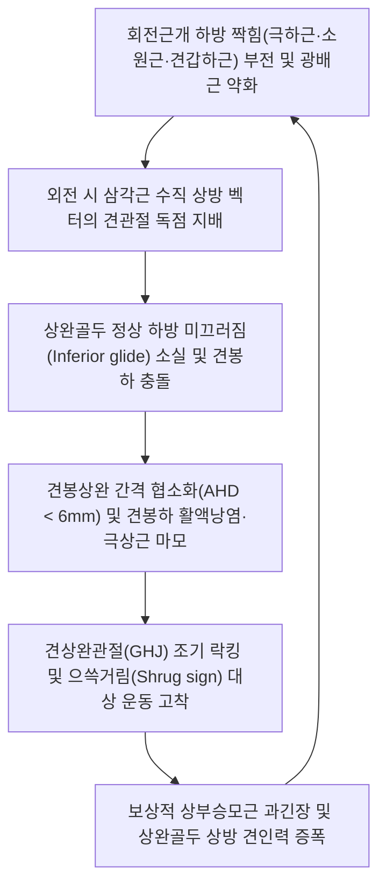

# 🩺 [[상완골 상방 활주 증후군]] (Humeral Superior Glide Syndrome / 上腕骨上方滑走症候群)

> **핵심 3줄 요약 (Key Summary)**:
> - 📍 병소 부위 & 해부·병태생리: 팔을 외전·굴곡할 때 상완골두가 관절와 내에서 하방 활주(Inferior glide)하지 못하고, [[삼각근]](Deltoid)의 과활성과 회전근개 하방 짝힘(극하근·소원근·견갑하근) 부전으로 상완골두가 견봉 쪽으로 과도하게 치솟아 발생하는 셜먼(Sahrmann) 운동손상증후군.
> - 🚩 전형적 임상 양상 & 3대 징후: 견관절 전방위적 움직임 시 견봉하 상완 전상방의 찝히는 날카로운 충돌통, 상완 외측 삼각근 부착부 둔통, 외전 60도 이상 시 견상완관절 굳어짐을 보상하기 위한 흉견갑관절(TSJ)의 기형적 어깨 으쓱임(Shrug Sign).
> - 🛠️ 핵심 감별 검사 & 한·양방 다각적 치료 전략: 수동 견갑골 상방회전 보조 검사(보조 시 불변 $\to$ 상방 활주 확진), [[니어 검사]], [[호킨스 검사]]; 삼각근 억제 자침, 노유/천종 하방 근육군 전침, 신바로 약침 및 JS 견관절 하방 활주 추나, [[서경탕]]/[[대방풍탕]] 처방.
> - ⚠️ 응급 의뢰 레드플래그 & 악화 요인: 만성 방치 시 극상근건 전층 파열 및 상완골두-견봉 골성 충돌(드롭암 양성)로 이행하므로 의자 팔걸이에 턱을 괴듯 기대는 상방 압박 불량 자세를 즉시 금지.

---

## 📌 목차
1. [질환 개요 & 해부학적 병태생리](#1-질환-개요--해부학적-병태생리)
2. [병태생리 메커니즘 & 생체역학적 악순환 네트워크](#2-병태생리-메커니즘--생체역학적-악순환-네트워크)
3. [임상 증상 & 이학적 검사(Physical Exam) 알고리즘](#3-임상-증상--이학적-검사physical-exam-알고리즘)
4. [감별 진단 매트릭스 (Differential Diagnosis)](#4-감별-진단-매트릭스-differential-diagnosis)
5. [한의 통합 치료 프로토콜 (침·약침·추나·한약)](#5-한의-통합-치료-프로토콜-침약침추나한약)
6. [양방 치료 & 병용·의뢰 기준 (Conventional Treatment & Referral)](#6-양방-치료--병용의뢰-기준-conventional-treatment--referral)
7. [재활 운동 & 생활습관 티칭 가이드](#6-재활-운동--생활습관-티칭-가이드)
8. [💡 사용자 진료실 핵심 필기 & 임상 노하우 (Melt-In 잔여 심화 집약)](#7--사용자-진료실-핵심-필기--임상-노하우-melt-in-잔여-심화-집약)
9. [출처 및 학술 참고 문헌 (References)](#8-출처-및-학술-참고-문헌-references)

---

## 1. 질환 개요 & 해부학적 병태생리

### (1) 정의
[[상완골 상방 활주 증후군]](Humeral Superior Glide Syndrome)은 물리치료학의 대가 셜먼(Shirley Sahrmann)이 체계화한 견관절 운동손상증후군(Movement System Impairment) 중 하나이다. 팔을 들어 올릴 때 정상적인 견관절(GHJ)에서는 상완골두가 구르기(Roll)와 동시에 아래쪽으로 미끄러져(Inferior glide) 견봉하 공간(Subacromial space)을 확보해야 하나, 이 하방 활주 기전이 실패하여 상완골두가 위쪽으로 비정상 거상되어 견봉, 오훼견봉인대, 견봉하 활액낭 및 [[극상근]]건을 지속적으로 압박·손상시키는 병태역학적 증후군이다.

### (2) 역학 및 호발 조건
* **호발 체형 및 자세**:
  - 라운드 숄더(Round shoulder) 및 흉추 후만, 거북목([[거북목]]) 체형에서 견갑골이 전방 경사(Anterior tilt)되고 하강되어 있는 환자.
  - 책상이나 의자 팔걸이에 팔꿈치를 대고 체중을 실어 턱을 괴는 만성 습관 보유자.
* **근력 불균형 환자군**:
  - 헬스장에서 숄더프레스나 레터럴 레이즈로 [[삼각근]]만 과도하게 단련하고 회전근개와 등 근육을 방치한 운동인.
  - 중장년층에서 회전근개 퇴행성 건병증으로 인해 상완골두를 아래로 눌러주는 하방 짝힘(Force couple)이 붕괴된 환자.

### (3) 견봉하 공간과 오훼견봉궁 해부학
![[견봉하충돌_및_극상근파열_MRI.jpg|380]]
> [그림 1: ① 병태생리·영상 — 견관절 관상면 MRI: 상완골두 상방 활주로 인한 견봉하 공간 소실 및 극상근건 충돌 소견]

* **견봉하 공간(Subacromial Space)의 협소성**:
  - 정상 견봉상완 간격(AHD: Acromiohumeral distance)은 9~10mm이다.
  - 상완골 상방 활주 시 이 거리가 6~7mm 이하로 좁아지며, 그 사이에 위치한 견봉하 활액낭과 [[극상근]]건, [[상완이두근]] 장두건이 으깨지는 충돌(Impingement)이 일어난다.

---

## 2. 병태생리 메커니즘 & 생체역학적 악순환 네트워크

### (1) 삼각근 과활성과 회전근개 하방 짝힘 부전
![[Deltoid_TriggerPoints.jpg|400]]
> [그림 2: ② 관련 해부 구조물 — 삼각근(Deltoid) 발통점과 상방 견인 벡터 메커니즘]

1. **상하 짝힘(Force Couple)의 불균형**:
   - **상방 견인력**: [[삼각근]]이 수축하면 상완골 간부를 위로 끌어올리는 강력한 상방 지렛대 힘이 발생한다.
   - **하방 누름력**: 정상 상태에서는 회전근개 하방 복합체인 [[극하근]], [[소원근]], [[견갑하근]]이 상완골두를 관절와 아래쪽으로 강력하게 내리누르고, [[극상근]]이 상완골두를 관절와 중앙에 압박(Centering)한다.
   - 회전근개가 약화되거나 억제되면 삼각근의 상방 벡터가 견관절을 독점 지배하여 상완골두가 견봉 밑바닥을 강타하게 된다.
2. **하방 활주 유도 근육([[광배근]])의 약화**:
   - [[광배근]](Latissimus dorsi)과 [[대원근]], [[대흉근]] 하부 섬유는 상완골을 강력하게 하방으로 끌어내리는 브레이크 역할을 한다. 이들 근육이 불활성화되면 상방 전위가 가속화된다.

### (2) 흉견갑관절(TSJ)의 보상 작용 (상완골-견갑골 일체화)
* **GHJ 제한과 TSJ 과운동성**:
  - 상완골두의 하방 미끄러짐이 결여되면 견상완관절(GHJ)은 30~60도 외전 이후 기계적 락킹(Locking)에 걸려 더 이상 독립적으로 움직이지 못한다.
  - 이를 보상하기 위해 인체는 흉견갑관절(TSJ)을 과도하게 동원하여, 상완골을 올릴 때 어깨와 견갑골 전체를 통째로 으쓱(Shrugging)하며 들어 올리는 비정상적인 대상 운동(Compensatory movement)을 보인다.

### (3) 생체역학적 악순환 네트워크 (Vicious Cycle)

---

## 3. 임상 증상 & 이학적 검사(Physical Exam) 알고리즘

### (1) 주요 임상 증상
* **모든 궤적에서의 상완 전상방 날카로운 통증**:
  - 팔을 외전(옆으로 들기), 굴곡(앞으로 들기), 외회전, 내회전할 때마다 상완골두 전면과 견봉 바로 밑에서 찝히는 날카로운 통증 발생(전방위적 운동통).
* **기형적 으쓱거림 (Hitch / Shrug Sign)**:
  - 팔을 60도 이상 들어 올릴 때 자연스러운 GHJ 움직임 대신 승모근을 수축하며 어깨 전체를 귀 쪽으로 치켜올림.
* **삼각근 부착부 방사통**:
  - 통증의 진원지는 견봉하 상방 충돌 부위이나, 환자는 상완 외측 중간의 삼각근 정지부(Deltoid tuberosity)가 뻐근하고 부서질 것 같다고 호소.
* **관절 가동 시 염발음**:
  - 팔을 올리거나 내릴 때 견봉 아래에서 우두둑거리는 염발음(Crepitus) 청진.

### (2) 단계별 임상 진행
| 진행 단계 | 병태역학 소견 | 주요 임상 양상 |
| :--- | :--- | :--- |
| **1단계 (기능성 상방활주기)**| 관절 연골 손상 없음, 삼각근 과우세, 회전근개 억제 | 팔을 들 때만 뻐근함, 동통호(Painful arc 60~120도), 휴식 시 통증 없음 |
| **2단계 (활액낭염·건병증기)**| 견봉하 점액낭 비후, 극상근건 부종, AHD 6~7mm 축소 | 야간통 발생, 팔을 뒤로 젖힐 때 극심한 통증, 지속적인 으쓱거림 보상 |
| **3단계 (회전근개 전층 파열기)**| 극상근건 완전 파열, 상완골두-견봉 골성 접촉 | 팔을 스스로 90도 이상 들지 못함(드롭암), 만성 퇴행성 관절증 병발 |

### (3) 이학적 검사 알고리즘
1. **수동 견갑골 보정 검사 (Scapular Upward Rotation Test - 결정적 감별)**:
   - 환자에게 팔을 외전·굴곡시켜 통증이 발생하는 각도를 확인한 후 검사자가 견갑골 하각을 잡고 수동으로 상방회전을 보조하며 재평가.
   - **판정**: 보조 시 통증이 소실되면 '견갑골 하방회전 증후군', **보조에도 불구하고 통증과 찝힘이 불변이면 상완골두 자체가 치솟아 있는 [[상완골 상방 활주 증후군]] 확진**.
2. **주관절 굴신 변형 검사 (다관절 근육 영향 배제)**:
   - 팔을 90~180도 굴곡한 상태에서 주관절을 구부렸을 때 통증이 감소하면 [[상완이두근]] 장두건 장력이 완화되어 골두 상방 압박이 줄어든 것임을 시사.
3. **특이적 이학적 검사법**:
   - [[니어 검사]](Neer test): 견갑골 하방 고정 후 상완 내회전 강제 굴곡 시 견봉 전외측 통증 $\to$ 양성.
   - [[호킨스 검사]](Hawkins-Kennedy test): 90도 굴곡 및 주관절 90도 상태에서 내회전 강제 시 충돌 통증 $\to$ 양성.

---

## 4. 감별 진단 매트릭스 (Differential Diagnosis)

| 감별 포인트 | 상완골 상방 활주 증후군 | 상완골 전방 활주 증후군 | 견갑골 하방회전 증후군 | 유착성 관절낭염 (오십견) |
| :--- | :--- | :--- | :--- | :--- |
| **병태 본태** | 상완골두의 비정상적 거상 | 상완골두의 비정상적 전방 돌출 | 견갑골 상방회전 부족 | 관절낭 전반의 염증성 섬유화 |
| **주요 통증 위치** | **견봉 직하방, 외측 삼각근 부위** | 상완골 전면 결절간구 | 견갑골 내측연, 상부 승모근 | 견관절 심부 전체 |
| **수동 보정 반응** | **견갑골 상방회전 보조 시 불변** | 상완골두 후방 활주 보조 시 호전| **견갑골 상방회전 보조 시 즉각 호전** | 수동 보정해도 전 방향 관절 구축 |
| **수동 ROM** | 외전 제한 (상방 걸림) | 신전·수평외전 제한 | 상방 가동역 보조 시 정상 | **전 방향 영구적 수동 구축** |

---

## 5. 한의 통합 치료 프로토콜 (침·약침·추나·한약)

![[다발성근육통_견봉하점액낭_해부도해.jpg|380]]
> [그림 3: ③ 치료·시술점 — 견봉하 활액낭 및 극상근건 부착부 약침 주입점과 견우·견료 취혈 해부도]

### (1) 한의 변증 및 병리
* **견비통(肩臂痛) 및 기혈어체(氣血瘀滯)**: 어깨 관절의 지속적인 기계적 마찰로 인해 수양명대장경, 수소양삼초경의 경락 맥락이 파손되어 어혈이 맺힘.
* **간신휴손(肝腎虧損) 및 근위(筋痿)**: 근골을 주관하는 간신 음혈이 마르고 힘줄이 탄력을 잃어 회전근개가 굳고 위축되어 상완골두를 지탱하지 못함.

### (2) 침구 및 전침 치료 SOP
* **삼각근 억제 취혈**:
  - 비노(LI14), 견우(LI15), 견료(TE14)에 자침하되 0.30×40mm 호침으로 15~20mm 사자하여 근육의 비정상적 연축 긴장을 이완시키는 사법(瀉法) 적용.
* **하방 활주 근육군 촉진 취혈**:
  - [[광배근]] 및 [[대원근]]: 견정(SI9), 천종(SI11), 액하 부위 취혈.
  - 회전근개 하방 섬유([[극하근]], [[소원근]]): 천종(SI11), 노유(SI10)에 0.30×60mm 심자 후 2~4Hz 저주파 전침 통전으로 하방 짝힘 근육 수축력 각성.
* **전침 치료 프로토콜**:
  - 천종(SI11)과 견정(SI9)에 전침을 걸고 2Hz 저주파 15분 통전하여 극하근·소원근·대원근의 지속적 활성도를 높여 상완골두 하방 안착 유도.

### (3) 약침 및 추나 치료
* **견봉하 관절강 약침**:
  - **신바로약침** 또는 **황련해독탕 약침** 1.5cc(30G 1인치 주사침): 견봉 후외측 각(Posterolateral acromial corner) 하방 1cm 지점에서 견봉 밑 공간으로 전내측을 향해 수평 진입하여 견봉하 활액낭 및 극상근건 점액낭면에 침투시켜 무균성 마찰성 염증 신속 소염.
* **추나 관절가동기법 (JS 견관절 하방 활주 기법)**:
  - 앙와위에서 검사자가 한 손으로 환자의 상완골 근위부를 감싸 쥐고, 다른 손으로 주관절을 지지한 상태에서 미측(Caudad, 발 방향)으로 45도 견인력을 유지하며 **상완골두 하방 활주(Inferior Glide Mobilization Grade III~IV)**를 10~15회 율동적으로 유도하여 하부 관절낭 구축을 신장.

### (4) 한약 처방 (Herbal Medicine)
* **초기 마찰통 및 활액낭염**: [[서경탕]](舒經湯)에 [[강황]], [[해동피]], [[적작약]], [[도인]]을 가미하여 관절강 내 삼출액 배출 및 어혈 제거.
* **만성 회전근개 건증 및 근위축**: [[대방풍탕]](大防風湯), [[독활기생탕]](獨活寄生湯)에 [[녹용]], [[골쇄보]], [[속단]]을 배합하여 힘줄 기질 재생 촉진.

---

## 6. 양방 치료 & 병용·의뢰 기준 (Conventional Treatment & Referral)

> 🎯 **이 섹션의 목적**: 환자가 **양방약을 이미 복용 중인 경우가 많다.** 한의원 1차 진료에서 양방 치료를 이해하고, 병용 가능·주의·금기를 판단하며, 언제 의뢰할지 결정한다.

* **약물 치료 (Medication)**:
  * 계열별 약물·용량·기간 — 국내 처방 관행 반영.
  * 작용 기전과 한의 치료와의 상호작용.
* **비약물 시술 (Procedures)**:
  * 주사·차단술·물리치료·보조기 등.
* **수술·시술 적응증 (Surgical Indication)**:
  * 언제 수술로 가는가 — 절대·상대 적응증, 수술 후 경과.
* **한의 병용 판단 (Combination Therapy)**:
  * 병용 가능 / 주의 / 금기. 복용 중 환자의 감량 타이밍·반동 현상.
* **양방·전문과 의뢰 기준 (Referral Criteria)**:
  * 응급 의뢰 트리거와 전문과 의뢰 기준(정형외과·신경외과·내과 등).

	(작성 필요)

---

## 7. 재활 운동 & 생활습관 티칭 가이드

### (1) 삼각근 차단 회전근개 단독 강화 운동
* **누운 자세 외회전 운동 (Sidelying External Rotation)**:
  - 서서 아령을 들면 중력으로 삼각근이 먼저 수축하여 상완골을 위로 쳐올리므로, 반드시 **바닥에 옆으로 누운 자세**에서 팔꿈치를 옆구리에 붙이고 전완만 바깥으로 돌리는 외회전 훈련 수행(15회씩 3세트).

### (2) 광배근 하방 활주 등척성 운동
* **팔꿈치 하방 누르기**:
  - 팔꿈치를 90도 구부린 상태에서 팔꿈치 뒤쪽에 벽이나 손을 대고, 뒤쪽 아래 방향으로 지그시 밀어내는 등척성 신전을 통해 상완골두를 아래로 당기는 광배근 기전 활성화.

### (3) 절대 금기 자세 지도
* **팔걸이 턱괴기 금지**:
  - 의자 팔걸이나 책상에 팔꿈치를 짚고 체중을 실어 턱을 괴는 자세는 상완골두를 견봉으로 강제 압박하므로 엄격히 금지.

---

## 8. 💡 사용자 진료실 핵심 필기 & 임상 노하우 (Melt-In 잔여 심화 집약)

### (1) 진료실 실전 감별 노하우 (원장님 시크릿)
* **삼각근이 아프다고 삼각근에 침 놓지 말라**:
  - 환자가 "어깨 가쪽 삼각근이 찢어지게 아파요"라고 호소할 때 삼각근은 죄가 없다.
  - 삼각근이 아픈 이유는 회전근개가 일을 안 해서 삼각근 혼자 상완골을 억지로 끌어올리다 탈이 난 것이다.
  - 치료의 핵심은 **삼각근의 과활성을 끄고(Inhibition), 잠자고 있는 회전근개 하방 누름 근육과 [[광배근]]을 깨우는 것(Activation)**이다.
* **견갑 하방회전 vs 상완골 상방 활주의 원포인트 감별**:
  - 환자가 팔을 못 올릴 때 뒤에서 견갑골 아래쪽을 잡고 위로 돌려주어라.
  - 견갑골을 돌려줬더니 "어? 원장님 팔이 쑥 올라가요!" 하면 견갑골 문제이고,
  - 견갑골을 아무리 잘 돌려줘도 "아니요, 여전히 어깨 뼈 속에서 딱 걸려서 똑같이 아파요" 하면 100% 상완골 상방 활주 증후군이다.

---

## 9. 출처 및 학술 참고 문헌 (References)

1. Payne, L. Z., Deng, X. H., Craig, E. V., et al. (1997). The combined dynamic and static contributions to subacromial impingement. A biomechanical analysis. *The American Journal of Sports Medicine*, 25(6), 801-808. DOI: [10.1177/036354659702500612](https://doi.org/10.1177/036354659702500612) / PMID: [9397268](https://pubmed.ncbi.nlm.nih.gov/9397268/)
   - **[연구 요약]**: 삼각근의 상방 견인 벡터와 회전근개의 하방 짝힘(Force couple) 불균형이 상완골두의 비정상적 상방 전위 및 견봉하 충돌을 유발함을 카다버 생체역학 실험을 통해 규명한 기념비적 연구.
2. Arráez-Aybar, L. A., García-de-Pereda-Notario, C. M., Palomeque-Del-Cerro, L., et al. (2026). Multilevel Determinants of Acromiohumeral Distance Within a Systems-Based Functional Morphology Framework and Their Implications for Personalized Neuromusculoskeletal Modelling. *Journal of Functional Morphology and Kinesiology*, 11(1), 32. DOI: [10.3390/jfmk11010032](https://doi.org/10.3390/jfmk11010032) / PMID: [42647356](https://pubmed.ncbi.nlm.nih.gov/42647356/)
   - **[연구 요약]**: 견봉상완 거리(AHD)의 다수준 형태학적 결정 요인을 분석하여 상완골두 상방 이동과 견봉하 충돌 및 회전근개 마모 위험도의 정량적 상관관계를 입증함.
3. Baek, C. H., Kim, B. T., & Phuc, H. N. (2026). Outcomes of lower trapezius tendon transfer in patients with superior humeral migration: Comparable results between acromiohumeral distance ≥6 mm and <6 mm. *Journal of Orthopaedics*, 50, 112-118. DOI: [10.1016/j.jor.2025.12.015](https://doi.org/10.1016/j.jor.2025.12.015) / PMID: [42179369](https://pubmed.ncbi.nlm.nih.gov/42179369/)
   - **[연구 요약]**: 상완골 상방 전위(Superior humeral migration)를 보이는 회전근개 부전 환자에서 견봉상완 간격 감소와 하방 안정성 회복을 위한 근기능 재교육 및 건 재건술의 임상 효과를 비교 분석함.

<!-- 보관 태그(1회용·링크오류, 필요시 복원): 상완골상방활주증후군, 삼각근, 광배근 -->
