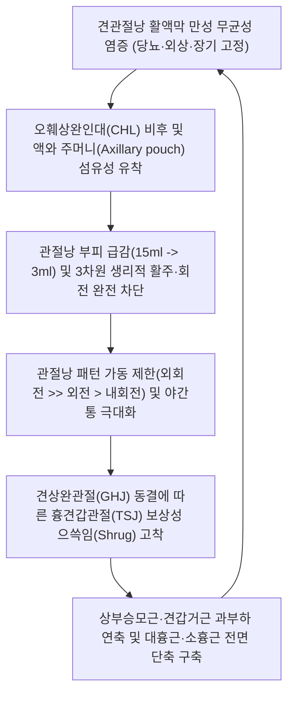

# 🩺 [[상완골 저운동성 증후군]] (Humeral Hypomobility Syndrome / 上腕骨低運動性症候群, ICD-10 M75.0)

> **핵심 3줄 요약 (Key Summary)**:
> - 📍 병소 부위 & 해부·병태생리: 견관절낭(Glenohumeral joint capsule) 및 오훼상완인대(CHL)의 만성 무균성 염증과 섬유화·유착으로 상완골두의 3차원 활주(Glide)와 회전(Roll)이 전 방위에서 기계적으로 차단되는 셜먼(Sahrmann) 운동손상증후군([[유착성 관절낭염]]/동결견).
> - 🚩 전형적 임상 양상 & 3대 징후: 능동 및 수동 관절 가동범위(ROM) 90도 이하 동결, 사이리악스 관절낭 패턴(외회전 제한 >> 외전 제한 > 내회전 제한), 환측 어깨가 눌릴 때의 극심한 야간통.
> - 🛠️ 핵심 감별 검사 & 한·양방 다각적 치료 전략: 능동 vs 수동 가동범위 동시 제한 검사(수동 시에도 벽에 걸린 듯 불변 $\to$ 회전근개 단독 파열과 감별); 견우/견료 심부 자침, 중부/견정 2차 긴장근 이완, 신바로 약침 및 관절강 수액 확장술(Hydrodilatation), [[서경탕]]/[[대방풍탕]] 처방.
> - ⚠️ 응급 의뢰 레드플래그 & 악화 요인: 당뇨병 환자에서 양측성·난치성 진행 빈발하므로 철저한 혈당 조절 병행, 급성기에 무리한 도수강제조작(HVLA) 적용 시 상완골 골절 및 관절와순 파열 위험 주의.

---

## 📌 목차
1. [질환 개요 & 해부학적 병태생리](#1-질환-개요--해부학적-병태생리)
2. [병태생리 메커니즘 & 생체역학적 악순환 네트워크](#2-병태생리-메커니즘--생체역학적-악순환-네트워크)
3. [임상 증상 & 이학적 검사(Physical Exam) 알고리즘](#3-임상-증상--이학적-검사physical-exam-알고리즘)
4. [감별 진단 매트릭스 (Differential Diagnosis)](#4-감별-진단-매트릭스-differential-diagnosis)
5. [한의 통합 치료 프로토콜 (침·약침·추나·한약)](#5-한의-통합-치료-프로토콜-침약침추나한약)
6. [재활 운동 & 생활습관 티칭 가이드](#6-재활-운동--생활습관-티칭-가이드)
7. [💡 사용자 진료실 핵심 필기 & 임상 노하우 (Melt-In 잔여 심화 집약)](#7--사용자-진료실-핵심-필기--임상-노하우-melt-in-잔여-심화-집약)
8. [출처 및 학술 참고 문헌 (References)](#8-출처-및-학술-참고-문헌-references)

---

## 1. 질환 개요 & 해부학적 병태생리

### (1) 정의
[[상완골 저운동성 증후군]](Humeral Hypomobility Syndrome)은 견상완관절(GHJ)의 연부조직(관절낭, 활액막, 주위 인대 및 건)이 병적으로 수축·비후되어 상완골두의 생리적 관절 내 활주(Intra-articular accessory motion)가 전 방향에서 소실된 상태를 의미한다. 정형외과학적인 [[유착성 관절낭염]](Adhesive Capsulitis, 오십견, 동결견)의 병태역학적 운동계 손상 분류에 해당한다.

### (2) 역학 및 호발 조건
* **호발 성별 및 연령**:
  - 남성보다 여성에서 약 2~4배 높게 발생하며, 주로 40~70대 중장년층에서 호발한다.
* **내분비 및 대사 질환 동반**:
  - **당뇨병(Diabetes Mellitus)** 환자는 일반인에 비해 유병률이 5배 이상 높고(20~30%), 양측성 침범 및 난치성으로 진행하는 경향이 뚜렷하다. 고혈당으로 인한 콜라겐의 최종당화산물(AGEs) 교차결합 침착이 주원인이다.
* **근육량 및 이전 손상 병력**:
  - 근육이 큰 체형의 환자에서 상완골두의 활주 부족이 조기에 기계적 마찰을 심화시키며, [[상완골 전방 활주 증후군]]이나 [[상완골 상방 활주 증후군]], 회전근개 건염 후 장기간 관절을 고정·방치한 경우 속발성으로 발생한다.

### (3) 견관절낭 및 오훼상완인대 복합체 해부학
![[유착성관절낭염_견관절_MRI_관절낭비후.jpg|380]]
> [그림 1: ① 병태생리·영상 — 유착성 관절낭염 환자의 견관절 MRA 관상면: 하관절낭 액와 주머니 유착 및 관절낭 비후]

* **관절낭의 섬유성 구축 (Capsular Contracture)**:
  - 활액막의 만성 무균성 염증(Synovitis)에 이어 섬유아세포 증식 및 제3형 콜라겐 섬유 침착이 일어나며, 헐렁하던 관절낭 부피가 정상 15~20ml에서 3~5ml 이하로 급감한다.
* **오훼상완인대(CHL)의 동결**:
  - 오훼돌기 기저부에서 대결절과 소결절로 뻗어나가는 CHL이 마치 가죽띠처럼 굳어져 상완골두가 외회전되는 궤적을 완전히 봉쇄한다.

---

## 2. 병태생리 메커니즘 & 생체역학적 악순환 네트워크

### (1) 관절낭 해부학 및 액와 주머니 소실
![[관절낭패턴_견관절_관절낭_및_오훼상완인대_해부도해.png|400]]
> [그림 2: ② 관련 해부 구조물 — 견관절낭과 오훼상완인대(CHL) 및 회전근개 간극 해부도]

* **액와 주머니(Axillary Pouch) 소실**:
  - 정상적인 팔 외전 시 상완골두를 담아내는 아래쪽 여유 공간인 액와 주머니가 섬유성 유착으로 맞붙어(Obliteration) 하방 활주가 불가능해지고 90도 이상의 거상이 차단된다.

### (2) 흉견갑관절(TSJ) 보상과 근막 사슬 왜곡
1. **상완골-견갑골 일체화 운동 (Humero-Scapular Coupling)**:
   - 견상완관절(GHJ)의 자체 회전이 정지되면, 뇌는 팔을 들기 위해 견갑골을 억지로 치켜올리는(Shrugging) 보상 기전을 켠다.
2. **후방 상지대 근육의 2차 피로성 연축**:
   - 어깨를 하루 종일 으쓱하며 보상하므로 [[상부승모근]](Upper trapezius), [[견갑거근]](Levator scapulae), [[능형근]](Rhomboids)이 만성 과부하에 노출되어 심한 뒷목·어깨 통증과 두통을 유발한다.
3. **전면 굴곡근 단축 사슬**:
   - 통증으로 팔을 쓰지 않고 안으로 모으고 다니므로 [[대흉근]](Pectoralis major)과 [[소흉근]](Pectoralis minor)이 단축되어 견갑골이 전방 경사(Anterior tilt) 및 하방회전 상태로 고착된다.

### (3) 생체역학적 악순환 네트워크 (Vicious Cycle)

---

## 3. 임상 증상 & 이학적 검사(Physical Exam) 알고리즘

### (1) 주요 임상 증상
* **전 방위 관절 가동범위(ROM) 90도 제한**:
  - 팔을 앞으로도(굴곡), 옆으로도(외전), 뒤로도(신전) 들지 못하며 90도 선에서 뼈가 벽에 부딪히는 단단한 끝느낌(Hard end-feel) 발생.
* **관절낭 패턴 (Capsular Pattern)**:
  - 사이리악스(Cyriax)가 정립한 법칙에 따라, **외회전(External rotation) 제한이 가장 심하고 > 그 다음 외전(Abduction) > 내회전(Internal rotation)** 순으로 제한됨.
* **수면 장애 및 야간통**:
  - 밤에 통증이 극심해져 잠을 이루지 못하며, 자다가 뒤척여 환측 어깨가 매트리스에 깔리면 벼락 치듯 통증이 발생하여 깬다.

### (2) 전형적 3단계 진행 과정
| 진행 단계 | 병리 상태 | 기간 | 주요 임상 양상 |
| :--- | :--- | :--- | :--- |
| **1단계: 결빙기 (Freezing, 염증기)** | 관절낭 급성 활막염, 심한 삼출 | 2~9개월 | **통증이 주증상**, 휴식 시 통증, 야간통 극심, 점진적 가동역 감소 시작 |
| **2단계: 동결기 (Frozen, 유착기)** | 섬유화 진행, 혈관 감소, 유착 | 4~12개월 | 통증은 둔화되나 **관절 구축이 극대화**, ROM 90도 이하 동결, 보상성 으쓱임 |
| **3단계: 해빙기 (Thawing, 회복기)** | 콜라겐 재형성, 섬유성 유착 완화 | 5~26개월 | 가동범위가 점진적으로 회복되나 적극적 치료 없이는 영구적 후유증 잔존 |

### (3) 이학적 검사 알고리즘
1. **능동 vs 수동 가동범위 동시 제한 검사 (결정적 진단)**:
   - 환자가 스스로 팔을 들어 올릴 때(능동 ROM) 90도에서 멈춘다.
   - 검사자가 환자의 팔을 잡고 힘을 빼게 한 후 위로 올려본다(수동 ROM).
   - **판정**:
     - **회전근개 파열**: 수동으로는 통증을 참고 올리면 끝까지 다 올라감.
     - **상완골 저운동성 증후군**: **검사자가 아무리 용을 써서 밀어 올려도 90도에서 벽에 부딪힌 듯 결코 올라가지 않음(능동·수동 ROM 일치 소실)**.
2. **흉견갑관절(TSJ) 보상 관찰**:
   - 뒤에서 환자가 양팔을 벌려 올리게 할 때, 환측 어깨가 30도 외전 직후부터 상부 승모근을 과도하게 수축하며 귀 쪽으로 으쓱(Hitch sign) 올라가는 비정상적 견갑골 운동 패턴 확인.

---

## 4. 감별 진단 매트릭스 (Differential Diagnosis)

| 감별 포인트 | 상완골 저운동성 증후군 | 회전근개 전층 파열 | 견봉하 충돌 증후군 | 경추 5번 신경근병증 |
| :--- | :--- | :--- | :--- | :--- |
| **수동 ROM** | **전 방향 영구적 구축 (Hard block)**| **수동으로는 정상 범위 도달 가능** | 통증호(60~120도) 외 수동 정상 | 전 방향 정상 |
| **관절낭 패턴** | **외회전 >> 외전 > 내회전 제한** | 특정 운동(외전/외회전) 근력 저하 | 특정 각도 찝힘 | 가동 제한 없음 |
| **야간 압박통** | **어깨 깔릴 때 극심한 통증** | 눕기만 해도 쑤심 | 환측으로 누울 때 뻐근함 | 경추 자세 따라 변동 |
| **방사선 소견** | 관절 간격 보존, MRA 액와낭 소실 | MRI 상 힘줄 단절 및 지방변성 | 견봉하 골극, AHD 정상 또는 감소| 경추공 협착 |

---

## 5. 한의 통합 치료 프로토콜 (침·약침·추나·한약)

![[견관절낭_해부도_인대구조.png|380]]
> [그림 3: ③ 치료·시술점 — 견관절낭 인대 복합체 및 관절강 침구·약침(수액확장술) 자입 경로 도해]

### (1) 한의 변증 및 병리
* **견응증(肩凝症) 및 누견풍(漏肩風)**: 50세를 전후하여 기혈이 쇠약해진 틈을 타 풍한습 사기가 관절 깊숙이 침범하여 기혈 순환이 얼어붙듯 정체된 병증.
* **담어교결(痰瘀膠結)**: 만성 염증으로 진액이 졸아들어 담음이 되고 어혈과 끈적하게 엉겨 붙어 관절막이 풀로 붙인 듯 굳어버린 상태.

### (2) 침구 및 전침 치료 SOP
* **관절강 심부 취혈 (관절낭 유착 이완)**:
  - 견우(LI15), 견료(TE14), 견정(SI9), 노유(SI10).
  - 0.35×60mm 장침으로 견우·견료혈에서 관절강 내강을 향해 깊숙이(35~50mm) 사자하여 관절낭 내압 감압 및 미세 순환 촉진.
* **2차 보상 긴장근 이완 취혈**:
  - 견정(GB21), 풍지(GB20), 천료(TE15) - 상부 승모근 및 견갑거근 연축 해소.
  - 중부(LU1), 운문(LU2) - 대흉근·소흉근 단축 해소.
* **전침 통전**:
  - 견우와 견료, 천종에 연결하여 2~4Hz 저주파를 20분간 통전하여 내인성 엔도르핀 분비 및 근육 이완 유도.

### (3) 약침 및 관절강 하이드로다이섹션 (Hydrodissection)
* **약침 처방**:
  - 염증기(1단계): **신바로약침** 또는 **황련해독탕 약침** 2.0~3.0cc를 견봉하 공간 및 후관절낭에 대용량 주입하여 활막염을 급속 제어.
  - 유착기(2단계): **중성어혈약침**을 사용하여 섬유화된 관절낭 조직의 미세 혈류를 개선.
* **수액 확장 기법 (Hydrodilatation)**:
  - 멸균 생리식염수 15~20cc와 신바로약침 2cc를 관절강 후방 접근법(Posterior approach)으로 주입하여 수압으로 맞붙은 액와 주머니를 박리하는 한의 수액 확장술 적용.

### (4) 한약 처방 (Herbal Medicine)
* **초기 급성 통증 및 야간통**: [[서경탕]](舒經湯) 또는 [[오적산]](五적산)에 [[강황]], [[해동피]], [[계지]], [[방풍]]을 대용량 가미하여 한사를 흩뜨리고 경락 순환을 촉진.
* **동결기 및 만성 유착기**: [[대방풍탕]](大防風湯), [[독활기생탕]](獨活寄生湯)에 [[당귀]], [[단삼]], [[녹용]], [[속단]]을 배합하여 관절 연부조직의 기혈을 보하고 섬유성 기질의 유연성을 복원.

---

## 6. 재활 운동 & 생활습관 티칭 가이드

### (1) 문지방 외회전 신장 운동 (Doorway Stretch)
* **방법**:
  - 문지방 모서리에 환측 팔꿈치를 90도 구부리고 어깨를 90도 외전하여 올려놓는다.
  - 몸통을 환측 반대 방향으로 천천히 밀고 나가며 상완골 전면 관절낭과 대흉근의 수평 외회전을 유도.
  - 15~20초간 지그시 유지하며 하루 3회 이상 반복.

### (2) 앙와위 단계별 가동 운동
* **서서 하지 말고 누워서**:
  - 서서 팔을 올리게 하면 중력과 통증 반사로 승모근이 먼저 긴장하므로, 반드시 **침대에 앙와위로 누운 상태에서 외전 45도부터 시작하여 점진적으로 가동 범위를 확장**.

---

## 7. 💡 사용자 진료실 핵심 필기 & 임상 노하우 (Melt-In 잔여 심화 집약)

### (1) 진료실 실전 감별 노하우 (원장님 시크릿)
* **어깨 치료 전 '목-등-가슴 근육'을 먼저 청소하라**:
  - 저운동성 증후군 환자는 팔이 굳어서 못 움직이는 동안 [[상부승모근]], [[견갑거근]], [[능형근]]이 견갑골을 억지로 끌어올리느라 돌덩이처럼 뭉쳐 있다.
  - 또한 가슴의 [[대흉근]]과 [[소흉근]]이 쪼그라들어 견갑골을 앞쪽 아래로 단단히 묶어두고 있다.
  - 굳어버린 어깨 관절낭만 억지로 찢으려 하지 말고, **앞가슴(중부·운문)과 뒷목·등(견정·견외유)을 먼저 침과 약침으로 부드럽게 풀어주면**, 견갑골 가동성이 살아나면서 그 자리에서 팔이 15~20도 더 올라간다.
* **수동 가동 운동 지도 시 주의사항**:
  - 서서 팔을 올리게 하면 중력과 통증 반사 때문에 승모근이 먼저 긴장한다.
  - 반드시 **환자를 침대에 편안히 앙와위로 눕힌 상태에서 외전 45도부터 시작하여 점진적으로 수평 내전·외전 범위를 넓혀가야** 방어성 연축 없이 관절낭을 신장시킬 수 있다.

---

## 8. 출처 및 학술 참고 문헌 (References)

1. Rundquist, P. J., Anderson, D. D., Guanche, C. A., et al. (2003). Shoulder kinematics in subjects with frozen shoulder. *Archives of Physical Medicine and Rehabilitation*, 84(10), 1473-1479. DOI: [10.1016/s0003-9993(03)00359-9](https://doi.org/10.1016/s0003-9993(03)00359-9) / PMID: [14586914](https://pubmed.ncbi.nlm.nih.gov/14586914/)
   - **[연구 요약]**: 동결견(상완골 저운동성) 환자의 3차원 견관절 운동형상학을 분석하여 상완골두의 하방 및 후방 활주 결핍과 흉견갑관절의 비정상적 보상 거상 패턴을 정량화함.
2. Khan, A. H., Bhuiyan, M. S. H., Kabir, M. F., et al. (2025). Effectiveness of proprioceptive neuromuscular facilitation pattern on upper extremity and scapula in patients with adhesive capsulitis: a single-centre assessor-blinded randomised controlled trial (RCT). *Trials*, 26(1), 142. DOI: [10.1186/s13063-025-08812-7](https://doi.org/10.1186/s13063-025-08812-7) / PMID: [40317031](https://pubmed.ncbi.nlm.nih.gov/40317031/)
   - **[연구 요약]**: 견관절 저운동성 및 유착성 관절낭염 환자에서 고유수용성 신경근 촉진법(PNF)과 견갑골 패턴 운동이 관절 가동역 회복 및 상지 통증 감소에 미치는 우수한 임상 효과를 무작위 대조군 시험으로 규명함.
3. Cho, C. H., Bae, K. C., & Kim, D. H. (2023). Treatment Strategy for Frozen Shoulder. *Clinics in Orthopedic Surgery*, 15(5), 685-694. DOI: [10.4055/cios23088](https://doi.org/10.4055/cios23088) / PMID: [37801107](https://pubmed.ncbi.nlm.nih.gov/37801107/)
   - **[연구 요약]**: 동결견의 병기별(염증기, 유착기, 회복기) 병태생리 기전과 관절강 수액 확장술, 관절낭 이완 운동 및 보존적 치료 전략을 체계화한 종설.

<!-- 보관 태그(1회용·링크오류, 필요시 복원): 상완골저운동성증후군, 동결견, 상부승모근 -->
