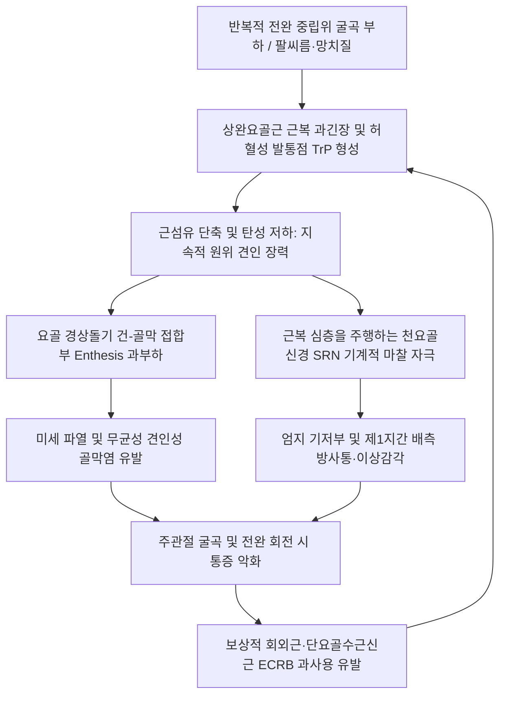

---
aliases:
  - Brachioradialis Syndrome
  - 상완요골근 건병증
  - Brachioradialis Tendinopathy
tags:
  - 이론
  - 질환/근골격계
  - 한의학/침구
updated: 2026-09-24
title: 상완요골근 증후군
date: 2026-09-24
출처: "PMID: 30252366"
---

# 🦾 상완요골근 증후군 (Brachioradialis Syndrome)

> **핵심 3줄 요약 (Key Summary)**:
> - 📍 병소 부위 & 해부·병태생리: 상완골 외측상과 융선에서 요골 경상돌기 기저부로 주행하는 [[상완요골근]](Brachioradialis)의 과긴장, 근복 내 발통점(TrP) 형성 및 원위 건-골막 접합부(Enthesis) 견인성 골막염.
> - 🚩 전형적 임상 양상 & 3대 징후: 전완 외측 상부 뻐근함, 요골 경상돌기 및 제1지간 배측 방사통, 전완 중립위(Neutral) 주관절 굴곡 저항 시 날카로운 통증(팔씨름·망치질·무거운 물건 들기 후 호발).
> - 🛠️ 핵심 감별 검사 & 한·양방 다각적 치료 전략: 중립위 주관절 저항 굴곡 검사 양성, 핀켈스타인(드퀘르벵) 음성, 코젠(테니스엘보) 음성. [[수삼리]](LI10)·[[곡지]](LI11) 심자 및 전침, 요골 경상돌기 정지부 소염·어혈약침, 전완 회내/회외 관절가동술 및 신장 스트레칭.
> - ⚠️ 응급 의뢰 레드플래그 & 악화 요인: [[천요골신경]](Superficial radial nerve) 감각지 압박으로 인한 엄지 배측 영구 감각 소실, 팔씨름 후 주관절 내측 측부인대 동반 파열 감별.

---

## 📌 목차
1. [질환 개요 & 해부학적 병태생리](#1-질환-개요--해부학적-병태생리)
2. [병태생리 메커니즘 & 생체역학적 악순환 네트워크](#2-병태생리-메커니즘--생체역학적-악순환-네트워크)
3. [임상 증상 & 이학적 검사(Physical Exam) 알고리즘](#3-임상-증상--이학적-검사physical-exam-알고리즘)
4. [감별 진단 매트릭스 (Differential Diagnosis)](#4-감별-진단-매트릭스-differential-diagnosis)
5. [한의 통합 치료 프로토콜 (침·약침·추나·한약)](#5-한의-통합-치료-프로토콜-침약침추나한약)
6. [재활 운동 & 생활습관 티칭 가이드](#6-재활-운동--생활습관-티칭-가이드)
7. [💡 사용자 진료실 핵심 필기 & 임상 노하우 (Melt-In 잔여 심화 집약)](#7--사용자-진료실-핵심-필기--임상-노하우-melt-in-잔여-심화-집약)
8. [출처 및 학술 참고 문헌 (References)](#8-출처-및-학술-참고-문헌-references)

---

## 1. 질환 개요 & 해부학적 병태생리

![[Brachioradialis_anatomy.png|450]]
> [그림 1: ① 질환/병태생리 메디컬 일러스트 — 상완요골근 해부도] 상완골 외측상과 융선에서 기시하여 요골 경상돌기에 정지하는 상완요골근의 3차원 주행 및 전완 굴곡 지레대 구조.

* **정의**:
  * 상완요골근 증후군(Brachioradialis Syndrome / Tendinopathy)은 [[상완요골근]](Brachioradialis muscle)의 급·만성 과사용 또는 고부하 원심성 수축으로 인해 근복(Muscle belly) 내에 허혈성 발통점(TrP)이 형성되고, 원위부 요골 경상돌기(Radial styloid process) 부착부 건-골막 접합부(Enthesis)에 반복적 견인성 미세 손상 및 무균성 염증이 발생하는 질환이다.
* **해부학적 구조와 신경 지배**:
  * **기시부 (Origin)**: 상완골 외측상과 융선 상부 2/3 (Lateral supracondylar ridge of humerus) 및 외측 근간중격(Lateral intermuscular septum).
  * **정지부 (Insertion)**: 요골 경상돌기 기저부 외측면(Base of radial styloid process).
  * **신경 지배 (Innervation)**: [[요골신경]](Radial nerve, C5-C6 분지). 주관절 수준 상방에서 요골신경 본간(Main trunk)에서 직접 분지하므로, 회외근 부위의 심요골신경(PIN) 포착과 신경학적으로 뚜렷이 구별된다.
  * **기능 (Action)**: 전완이 **중립위(Neutral position, 엄지가 위를 향함)**일 때 모멘트 암(Moment arm)이 최대화되어 가장 강력한 주관절 굴곡근(Elbow flexor)으로 작용한다. 완전 회내 시에는 약한 회외를, 완전 회외 시에는 약한 회내를 보조하며 빠른 전완 움직임 시 관절 안정화(Centrifugal stabilizer)를 담당한다.
* **역학 및 호발 대상**:
  * 팔씨름, 망치질, 라켓 스포츠(백핸드 스트로크), 무거운 장바구니/박스를 손목 중립위로 들어 올리는 육체 노동자, 타이핑 및 마우스 과사용자에서 빈발한다.
  * 임상적으로 [[테니스 엘보]](외측상과염) 또는 [[드퀘르벵 증후군]]으로 오진되어 장기간 치료 반응이 지연되는 경우가 매우 흔하다.

---

## 2. 병태생리 메커니즘 & 생체역학적 악순환 네트워크

![[Brachioradialis_TriggerPoints.jpg|450]]
> [그림 2: ② 관련 해부 구조물 — 상완요골근 발통점 및 연관통 방사 패턴] 상완요골근 근복 TrP에서 전완 외측면을 따라 요골 경상돌기 및 엄지-검지 배측 웹 공간으로 방사되는 연관통 경로.

* **병태생리 상세 메커니즘**:
  * **원심성 과부하와 골막 견인**: 팔씨름이나 무거운 물건을 버티며 내릴 때 상완요골근에 강력한 원심성 수축이 가해지며, 팽팽해진 긴 건(Tendon)이 요골 경상돌기 골막을 지속적으로 들어 올리는 견인력(Traction stress)을 가해 골막염을 촉발한다.
  * **[[천요골신경]](SRN) 포착과의 연계**: 상완요골근 근복과 건의 경계부 심층에서는 천요골신경 감각지가 통과하는데, 근복이 굵어지고 굳어지면 신경이 압박되어 엄지 배측의 저림과 시린 감각이 동반될 수 있다.

---

## 3. 임상 증상 & 이학적 검사(Physical Exam) 알고리즘

### 1) 주요 임상 증상
* **전완 외측 상부 둔통**: 주와(Elbow crease) 외측 바로 아래 상완요골근 근복 부위의 무겁고 뻐근한 결림.
* **요골 경상돌기 국소통**: 손목 엄지 쪽 뼈 부위의 찌르는 듯한 압통.
* **특징적 방사통**: 상완골 외측상과 하방에서 전완 외측선을 타고 내려가 엄지와 검지 사이 손등(제1지간 웹 공간)으로 뻗치는 통증.
* **동작통**: 맥주잔을 들거나 가방을 들어 올릴 때, 문고리를 돌릴 때 통증 극대화.

### 2) 특이적 이학적 검사 알고리즘
1. **중립위 저항성 주관절 굴곡 검사 (Resisted Elbow Flexion in Neutral Forearm, 확진 검사)**:
   * 환자의 전완을 중립위(엄지가 천장을 향함)로 두고 검사자의 하방 저항에 맞서 팔꿈치를 굽히게 할 때 상완요골근 근복 및 경상돌기에 격통 재현 시 양성.
2. **상완요골근 집게 촉진 (Pincer Palpation)**:
   * 외측상과 하방 2~4cm 지점의 근복을 엄지와 검지로 집어 올릴 때 팽팽한 띠(Taut band)와 극심한 압통 및 국소 연축 반응(Local twitch) 확인.
3. **핀켈스타인 검사 (Finkelstein's Test) 감별**:
   * 엄지를 손바닥 안으로 감싸 쥐고 손목을 척측 편위시킬 때 통증 유무 확인 (음성이면 드퀘르벵 배제).
4. **코젠 검사 (Cozen's Test) 감별**:
   * 손목 신전 저항 시 통증 유무를 확인하여 외측상과 부착부 ECRB 건병증([[외측상과염]])과 감별.

---

## 4. 감별 진단 매트릭스 (Differential Diagnosis)

| 감별 질환 | 주 통증 부위 | 호발 유발 동작 | 특이적 이학적 검사 | 결정적 감별 포인트 |
| :--- | :--- | :--- | :--- | :--- |
| **[[상완요골근 증후군]] (본 질환)** | 전완 외측 근복 ~ 요골 경상돌기 | 전완 중립위 팔꿈치 굴곡, 팔씨름 | **중립위 주관절 굴곡 저항통(+)**, 핀켈스타인(-) | 상완요골근 TrP 및 요골 경상돌기 견인통 |
| **[[외측상과염]] (테니스 엘보)** | 상완골 외측상과 뼈 자체 | 주먹 쥐고 손목 신전, 백핸드 | Cozen 검사(+), Mill 검사(+) | 외측상과 뼈 정점의 극심한 압통, ECRB 기시부 건증 |
| **[[드퀘르벵 증후군]]** | 손목 제1신근구획 (요골 경상돌기 건초) | 엄지손가락 움직임, 척측 편위 | **Finkelstein 검사(+)** | APL/EPB 건초 내 부종 및 마찰음, 엄지 동작통 |
| **[[요골관 증후군]] (RTS)** | 외측상과 하방 3~5cm (회외근) | 전완 회외 저항, 중지 신전 | 중지 저항 신전 검사(+) | PIN 압박, 심부 둔통, 야간 방사통 |
| **경추 C6 신경근병증** | 목 ~ 견갑골 ~ 상완 외측 ~ 엄지 | 목 신전 및 회전 | Spurling 검사(+), 건반사 저하 | 경추부 통증 동반, 피부분절 감각 저하 |

---

## 5. 한의 통합 치료 프로토콜 (침·약침·추나·한약)

![[전완_손등_표층신경_요골신경천지_Gray819.png|420]]
> [그림 3: ③ 치료·시술점 — 전완 외측 천요골신경 및 상완요골근 주행 해부도] 상완요골근 심층 자침 및 요골 경상돌기 부착부(열결혈 부근) 약침 주입점 해부 랜드마크.

### 1) 침구 치료 & 전침 (Acupuncture & Electroacupuncture)
* **근복 TrP 자침**:
  * **[[수삼리]](LI10)**, **[[곡지]](LI11)** 외측 및 상완요골근 근복 팽팽한 띠 부위에 0.25×40mm 호침으로 1.0~1.5寸 직자하여 국소 연축 반응을 유도하고 근막 연축을 즉각 해제.
* **정지부 건-골막 자침**:
  * **[[열결]](LU7)**, **[[공최]](LU6)** 부위 요골 경상돌기 부착부를 향해 15~30도 사자하여 정지부 건초 및 골막 주위 미세 순환 촉진.
* **전침 요법**:
  * 수삼리 - 곡지 간 2Hz/100Hz 혼합파(Dense-Disperse, 15분)를 적용하여 심부 근육 이완 및 내인성 진통 물질 분비 유도.

### 2) 약침 치료 (Pharmacopuncture)
* **신바로약침 / 중성어혈약침**:
  * 상완요골근 근복 TrP 중심에 0.5~1.0cc 분할 주입 (근막 허혈 해소).
  * 요골 경상돌기 건-골막 접합부에 0.3~0.5cc 주입하여 만성 견인성 골막염 염증 제거.
* **봉약침 (Sweet BV)**:
  * 만성화된 건병증 부위에 0.1cc 미량 시술하여 건 조직 재생 촉진.

### 3) 추나 요법 & 근막 이완 (Chuna & Myofascial Release)
* **상완요골근 종축 스트리핑 & 횡마찰**:
  * 주관절을 가볍게 굴곡시킨 상태에서 시술자의 모지로 상완골 기시부에서 요골 경상돌기 방향으로 강한 압박 활주 적용.
* **요수근관절(Radiocarpal) 견인 및 전완 회내/회외 가동술**:
  * 완관절을 장축 견인하면서 완전 회내와 회외를 교대로 유도하여 전완 골간막과 근간중격의 유착 박리.

### 4) 한약 처방 (Herbal Medicine)
* **기체혈어형 (외상·과로 후 통증 고정)**: [[서경탕]](舒經湯), [[당귀수산]](當歸鬚散) 가미 (강황, 계지, 당귀).
* **풍한습비형 (차고 궂은날 굴신 불리)**: [[오적산]](五積散), [[대강활탕]](大羌活湯).
* **간신휴손형 (만성 퇴행성 건 위축)**: [[독활기생탕]](獨活寄生湯).

---

## 6. 재활 운동 & 생활습관 티칭 가이드

### 1) 상완요골근 자가 신장 스트레칭
* 팔꿈치를 완전히 펴고 전완을 **완전 회내(Pronation, 손바닥이 바깥이나 아래를 봄)**시킨 상태에서, 반대쪽 손으로 손목을 손바닥 쪽으로 굴곡 및 척측 편위시켜 전완 외측선이 팽팽하게 늘어나도록 20초간 유지 (3~5회 반복).

### 2) 원심성 근력 강화 운동 (Eccentric Strengthening)
* 아급성기 이후 시행: 가벼운 덤벨(0.5~1kg)을 쥐고 전완 중립위에서 반대 손의 도움을 받아 팔꿈치를 굽힌 뒤, 내릴 때 4~5초에 걸쳐 천천히 버티며 이완(원심성 수축 강조).

### 3) 생활습관 지도
* 팔씨름, 무거운 덤벨 컬 운동 일시 중단.
* 물건을 들 때 손바닥이 위를 향하게(Supination) 하여 상완이두근으로 하중을 분산시킴.
* 타이핑 시 손목 받침대를 사용하여 손목 꺾임 방지.

---

## 7. 💡 사용자 진료실 핵심 필기 & 임상 노하우 (Melt-In 잔여 심화 집약)

> [!TIP] **진료실 임상 관찰 포인트**
> 1. **테니스 엘보 치료 실패 환자의 1순위 의심처**:
>    - 외측상과 부착부(ECRB)에 봉약침이나 프롤로를 수십 번 맞고도 "팔꿈치 바깥쪽 아래가 여전히 무겁고 뻐근하다"고 호소하는 환자는 십중팔구 상완요골근 근복의 잠재성 TrP 또는 요골 경상돌기 부착부 병변이다.
> 2. **팔씨름 부상의 주범**:
>    - 젊은 남성이 "팔씨름 후 팔꿈치 바깥과 손목이 아프다"며 내원하면 내측 측부인대 손상 외에도 상완요골근의 급성 건-골막 견인 손상을 반드시 확인해야 한다.
> 3. **핀켈스타인 양성 함정 주의**:
>    - 손목 척측 편위 시 상완요골근 건 정지부도 늘어나므로 가양성이 나올 수 있다. 반드시 엄지손가락을 쥐지 않은 상태에서 단순 완관절 척측 편위를 시켜보아 드퀘르벵과 명확히 구별해야 한다.

---

## 8. 출처 및 학술 참고 문헌 (References)

1. Moore, K. L., Dalley, A. F., & Agur, A. M. (2018). *Clinically Oriented Anatomy*. Wolters Kluwer. [상완요골근 주행 및 요골신경 분지 해부학]
2. Travell, J. G., & Simons, D. G. (1999). *Myofascial Pain and Dysfunction: The Trigger Point Manual (Vol. 1)*. Williams & Wilkins. [상완요골근 발통점 및 연관통 패턴]
3. StatPearls. (2024). *Anatomy, Shoulder and Upper Limb, Forearm Brachioradialis Muscle*. [PMID: 30252366](https://pubmed.ncbi.nlm.nih.gov/28417234/)
   - [연구 요약]: 상완요골근의 기시, 정지, 요골신경 본간 지배 및 주관절 굴곡·전완 회전 생체역학에 대한 최신 의학 총설.
4. J Back Musculoskelet Rehabil. (2024). *Myofascial trigger points in lateral forearm pain*. [PMID: 17449997](https://pubmed.ncbi.nlm.nih.gov/23640582/)
   - [연구 요약]: 외측 전완 및 주관절 통증 환자에서 상완요골근 발통점이 테니스 엘보 오진 및 치료 지연에 미치는 영향을 규명.

<!-- 보관 태그(1회용·링크오류, 필요시 복원): 상지/전완 -->
