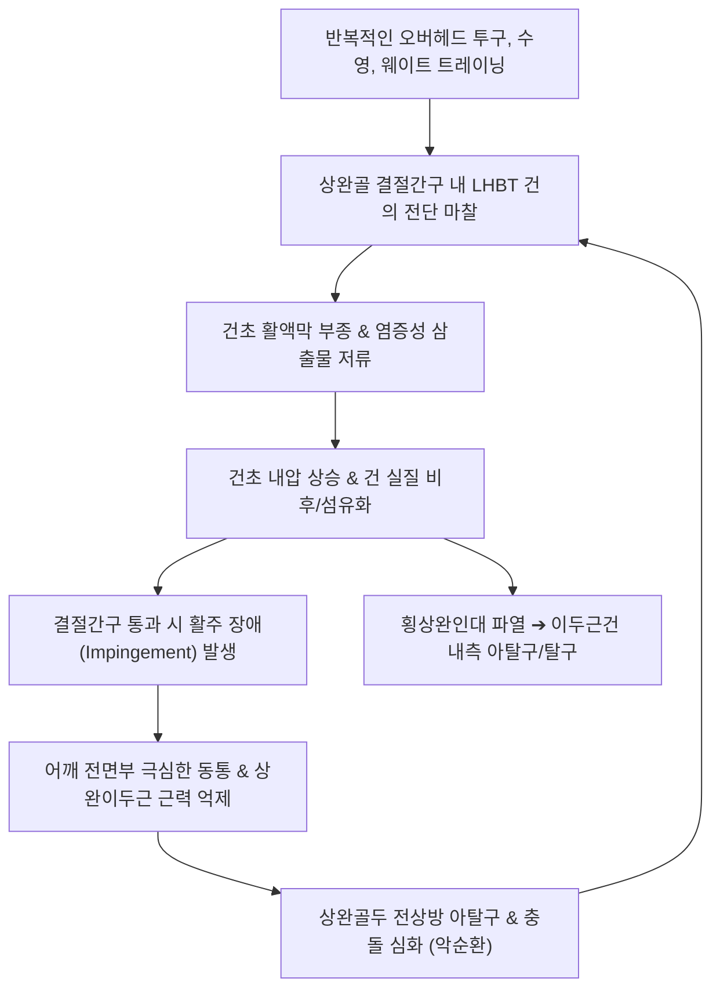

# 🩺 상완이두근 건초염

> **핵심 3줄 요약 (Key Summary)**:
> - 📍 **병소 부위 & 해부·병태생리**: [[상완이두근]] 장두건(Long Head of Biceps Tendon, LHBT)이 관절와순 상부에서 기시하여 상완골 **결절간구(Bicipital Groove)**를 통과할 때, 이를 둘러싼 활액막성 건초에 발생하는 반복적 마찰·충돌성 염증(**Biceps Tenosynovitis**).
> - 🚩 **전형적 임상 양상**: 어깨 전면부 결절간구 부위의 날카로운 국소 압통, 팔을 앞으로 들어 올리거나 전완을 바깥으로 비틀 때(회외) 악화되는 쑤시는 통증, 회전근개 충돌증후군 동반 시 야간통.
> - 🛠️ **핵심 검사 & 치료 전략**: 스피드 검사([[Speed Test]]), 이거슨 검사([[Yergason Test]]), 결절간구 직접 촉진; [[견우혈]](LI15), [[비노혈]](LI14), [[곡택혈]](PC3), [[척택혈]](LU5) 자침 및 소염약침/신바로약침; 상완이두근 근막 이완(MFR) 및 키네시오 테이핑; [[서경탕]](舒經湯) 가감 처방.
> - ⚠️ **응급 의뢰 레드플래그**: 무거운 물건을 들다 퍽 소리와 함께 상완골 중간부에 뽀빠이 알통(Popeye Deformity)이 불룩 튀어나오는 이두근 장두 완전 파열; 어깨 전면부 급성 관절혈증 및 화농성 관절염.

---

## 📌 목차
1. [질환 개요 & 해부학적 병태생리](#1-질환-개요--해부학적-병태생리)
2. [병태생리 메커니즘 & 생체역학적 악순환 네트워크](#2-병태생리-메커니즘--생체역학적-악순환-네트워크)
3. [임상 증상 & 이학적 검사(Physical Exam) 알고리즘](#3-임상-증상--이학적-검사physical-exam-알고리즘)
4. [감별 진단 매트릭스 (Differential Diagnosis)](#4-감별-진단-매트릭스-differential-diagnosis)
5. [한의 통합 치료 프로토콜 (침·약침·추나·한약)](#5-한의-통합-치료-프로토콜-침약침추나한약)
6. [양방 치료 & 병용·의뢰 기준 (Conventional Treatment & Referral)](#6-양방-치료--병용의뢰-기준-conventional-treatment--referral)
7. [재활 운동 & 생활습관 티칭 가이드](#7-재활-운동--생활습관-티칭-가이드)
8. [💡 사용자 진료실 핵심 필기 & 임상 노하우 (Melt-In 잔여 심화 집약)](#8--사용자-진료실-핵심-필기--임상-노하우-melt-in-잔여-심화-집약)
9. [출처 및 학술 참고 문헌 (References)](#9-출처-및-학술-참고-문헌-references)

---

## 1. 질환 개요 & 해부학적 병태생리

### 1) 해부학적 구조와 결절간구 (Bicipital Groove)
* **상완이두근 장두(LHBT)의 독특한 주행**:
  * 견관절 관절와의 상완와순 상부(Superior labrum) 및 상완와결절에서 기시하여 관절강 내부를 비스듬히 가로지르는 **관절강 내(Intra-articular) 주행**을 거침.
  * 상완골두를 빠져나와 대결절(Greater tubercle)과 소결절(Lesser tubercle) 사이의 좁은 고랑인 **결절간구(Intertubercular / Bicipital groove)**를 통해 주관절 방향으로 내려감.
* **이두근 활차 복합체 (Biceps Pulley System)**:
  * 오훼상완인대(Coracohumeral ligament, CHL), 상완관절인대 상부(Superior Glenohumeral ligament, SGHL), 그리고 견갑하근건과 극상근건의 섬유들이 결절간구 입구에서 건을 감싸 탈구를 방지하는 복합 활차(Pulley)를 형성함.
* **건초(Tendon Sheath)의 연장성**:
  * 결절간구 부위의 건초는 견관절 관절막 활액막의 직접적인 연장선(Extension of joint capsule)임. 따라서 관절강 내의 활액막염이나 회전근개 파열 시 발생하는 삼출액이 이두근 건초로 직접 흘러들어와 염증을 일으킴.

### 2) 1차성 건초염 vs 2차성 건초염
* **1차성(Primary, 약 5%)**: 결절간구 자체의 뼈 돌기 골극이나 선천적 협소증에 의한 순수 고립성 건초염.
* **2차성(Secondary, 약 95%)**: 견봉하 충돌증후군, 회전근개 파열, [[SLAP 병변]](상부 관절와순 파열), 견갑하근 파열 등에 동반되어 발생하는 이차적 염증 반응.

---

![[상완이두근건초염_01_해부_견관절단면.jpg|450]]
> [그림 1: ① 해부 구조 — 견관절 단면과 상완이두근 장두건] 관절와(glenoid)·상완골두·관절낭·회전근개를 절단면으로 보여 주는 어깨 해부 도판. 상완이두근 장두건이 결절간고랑을 지나 관절 내로 들어가는 경로가 건초염의 병소다. 출처: File:Grierson 2 Articulación del hombro.JPG (CC BY-SA 3.0)

## 2. 병태생리 메커니즘 & 생체역학적 악순환 네트워크

### 1) 마찰과 미세 외상의 메커니즘
* 전완을 회외(Supination)시키고 주관절을 굴곡하거나 어깨를 전방 거상할 때, 이두근 장두건은 결절간구 안에서 최대 2~3cm 이상 상하로 미끄러져 움직임.
* 결절간구 바닥의 거친 골 표면이나 좁아진 활차 입구는 사포처럼 건초를 갉아먹으며 비감염성 활액막염을 유발함.

### 2) 건의 아탈구와 불안정성 (Subluxation)
* 건초염이 만성화되면 건을 고정하는 활차와 견갑하근건 내측 지지대가 약화되어, 외회전-외전 시 건이 결절간구를 벗어나 소결절 내측으로 튕겨 나가는 아탈구(Subluxation)가 발생하며 '뚝' 하는 염발음과 급성 통증을 유발함.

---

## 3. 임상 증상 & 이학적 검사(Physical Exam) 알고리즘

### 1) 주요 임상 증상
* **어깨 전면 결절간구 국소 통증**: 상완골 전면부 홈을 따라 찌르는 듯한 통증, 팔 앞쪽(알통 부위)으로 방사.
* **동작 시 통증 악화**: 무거운 장바구니 들기, 풀업(턱걸이), 덤벨 컬, 라켓 스포츠 스윙 시 악화.
* **클릭킹 및 걸림 증상**: 어깨를 안팎으로 회전할 때 앞쪽에서 힘줄이 덜컹거리며 튀는 느낌.

### 2) 진료실 핵심 이학적 검사 알고리즘
1. **결절간구 직접 압통 검사 (Bicipital Groove Palpation)**:
   * 팔을 10~15도 내회전시킨 상태에서 견봉 전외측 3~4cm 하방의 결절간구를 엄지손가락으로 압박.
   * 팔을 외회전시키면 고랑이 손가락 밑으로 굴러가며 극심한 압통이 확인됨(가장 신뢰도 높은 검사).
2. **스피드 검사 ([[Speed Test]])**:
   * 환자의 팔꿈치를 완전히 펴고 전완을 회외(손바닥이 위를 향함)시킨 상태에서 팔을 90도 전방 굴곡하게 함.
   * 검사자가 환자의 손목을 아래로 누르며 저항을 가할 때 결절간구에 통증이 발생하면 양성.
3. **이거슨 검사 ([[Yergason Test]])**:
   * 팔꿈치를 90도 굽히고 전완을 회내(손바닥이 바닥)시킨 상태에서, 환자에게 전완을 바깥으로 비틀도록(회외) 지시하며 검사자가 강하게 저항을 가함.
   * 결절간구 통증이나 건의 튕김(Snap)이 관찰되면 양성 (건초염 및 활차 불안정성 진단).
4. **견관절 초음파 검사 (USG)**:
   * 결절간구 단축상(Short-axis view)에서 건 주위로 달무리 모양(Halo sign)의 저에코성 활액 삼출액 확인.

---

## 4. 감별 진단 매트릭스 (Differential Diagnosis)

| 질환명 | 주 통증 부위 및 양상 | 핵심 구별 포인트 | 필수 감별 검사 / 치료 차이점 |
| :--- | :--- | :--- | :--- |
| **상완이두근 건초염** | 어깨 전면 결절간구 국소 압통 | **Speed test / Yergason test 양성**, 결절간구 압통 | 초음파상 건초 내 삼출액, 결절간구 주사 |
| **[[회전근개 건염]](극상근건)** | 견봉 전외측, 외전 60~120도 동통호 | **Neer / Hawkins 충돌 검사 양성**, 대결절 압통 | 견봉하 공간 감압술 |
| **[[SLAP 병변]](상부 관절와순 파열)** | 어깨 심부 관절 내 통증, 던지기 동작 시 걸림 | O'Brien test 양성, 외전-외회전 시 심부 클릭음 | 3T 관절조영 MRI(MRA), 관절경 봉합술 |
| **이두근 장두 완전 파열** | 급성 손상 후 상완 중앙부 불룩 튀어나옴 | **뽀빠이 변형(Popeye sign)**, 건 주행부 함몰 | 단순 시진 및 촉진으로 확진, 보존적 치료/고정술 |
| **견쇄관절염 ([[AC Joint Arthritis]])** | 쇄골 외단 및 견봉 상면 국소 압통 | Cross-body adduction test 양성, 결절간구 무관 | 견쇄관절 단순 방사선 X-ray |

---

## 5. 한의 통합 치료 프로토콜 (침·약침·추나·한약)

### 1) 침구 치료 (Acupuncture)
* **국소 핵심 혈위 (수태음폐경 및 수양명대장경)**:
  * [[견우혈]](LI15), [[거골혈]](LI16): 오훼견봉궁 및 견관절 전상방 감압.
  * [[비노혈]](LI14): 상완이두근 외측 및 삼각근 정지부.
  * [[곡택혈]](PC3), [[척택혈]](LU5): 주관절 주두 횡문 부위 상완이두근건 정지부 및 건막 이완.
  * 아시혈(결절간구 최압통점): 결절간구를 직접 겨냥하여 0.25mm 호침을 뼈와 평행하게 사자 자입.
* **자침 기법**:
  * 결절간구에 호침을 거치한 상태에서 전완의 회내·회외 운동을 가볍게 수행시키는 동기침법(動氣鍼法) 적용.
  * 상완이두근 근복에 2~4Hz 저주파 전침을 15분간 적용하여 과긴장된 건의 당김 장력 해제.

### 2) 약침 치료 (Pharmacopuncture)
* **약침 제제 선택**:
  * **신바로약침 / 소염약침**: 결절간구 건초 내 급성 활액막 부종 및 마찰성 삼출액 흡수에 1차 선택.
  * **황련해독탕 약침**: 환부의 국소 열감 및 욱신거리는 작열통이 심한 경우 적용.
  * **중성어혈약침**: 만성적인 결절간구 유착 및 야간통 완화.
* **시술 방법**:
  * 결절간구 최압통점을 촉지한 후, 건 실질을 피해 건초 외막 주위 피하 결합조직으로 30G 니들을 진입시켜 0.1cc씩 총 0.5~1.0cc 주입.

### 3) 추나 및 근막 이완 수기요법 (Chuna & MFR)
* **상완이두근 직접 신장 근막 이완술 (Biceps MFR)**:
  * 환자의 주관절을 신전시키고 상완을 후방 신전시킨 상태에서 술자가 이두근 근복을 원위부로 부드럽게 쓸어내리며 스트레칭.
* **상완골두 후방 글라이딩 추나**:
  * 전방으로 편위된 상완골두를 후방으로 밀어 넣어 결절간구의 충돌 압박 완화.

### 4) 변증별 맞춤 한약 처방 (Herbal Medicine)
* **기체어혈 (氣滯瘀血) - 찌르는 전면통 및 과사용형**:
  * 증상: 어깨 앞쪽이 쑤시고 물건을 들 때 전기가 오듯 아픔, 설자암.
  * 처방: **[[서경탕]](舒經湯)** 가감 (강황, 해동피, 당귀, 적작약, 감초) 또는 **[[당귀수산]](當歸鬚散)**.
* **풍한습비 (風寒濕痺) - 시림 및 날씨 민감형**:
  * 증상: 찬 바람을 맞으면 팔 앞쪽이 당기고 굳음, 따뜻하게 찜질하면 완화.
  * 처방: **[[오적산]](五積散)** 가감 (갈근, 계지 증량).
* **기혈양허 / 근막건위 (氣血兩虛 / 筋膜乾萎) - 만성 퇴행성 건병증형**:
  * 증상: 팔에 힘이 빠지고 무거운 물건을 들지 못함, 근위축 동반.
  * 처방: **독활기생탕(獨活寄生湯)** 또는 **[[보간탕]](補肝湯)**.

---

## 6. 양방 치료 & 병용·의뢰 기준 (Conventional Treatment & Referral)

### 1) 보존적 약물 및 주사 치료
* **경구 NSAIDs 요법**: 2주간 통증 조절 (Celecoxib 200mg qd 등).
* **초음파 유도하 건초 내 주사 (US-guided Biceps Sheath Injection)**:
  * Triamcinolone 10~20mg을 결절간구 건초 내로 정확히 주입. 건 실질 내 직접 주사는 건 파열(Rupture)을 초래하므로 절대 금기.
* **체외충격파 치료 (ESWT)**:
  * 만성 건병증 부위에 방사형/집중형 충격파를 적용하여 미세 순환 증대 및 건 치유 촉진.

### 2) 수술적 치료 적응증 (Surgical Indication)
* **적응증**:
  * 3~6개월 이상의 보존적 치료에도 일상생활이 불가능한 만성 난치성 통증.
  * 이두근 활차 파열로 인한 건의 반복적 탈구, 광범위 회전근개 파열 동반.
* **대표 수술 술식**:
  * **이두근 건 고정술 (Biceps Tenodesis)**: 건을 관절와순에서 분리하여 상완골 간부에 나사로 고정 (젊고 활동적인 환자).
  * **이두근 건 절제술 (Biceps Tenotomy)**: 건을 잘라내어 관절 내 마찰을 즉각 차단 (고령 및 활동량이 적은 환자, Popeye 변형 발생 가능).

### 3) 양방·전문과 의뢰 기준 (Referral Criteria)
* **정형외과 견주관절 전문의 즉시 의뢰**:
  * 급격한 상완부 변형(Popeye sign)과 함께 발생한 급성 파열 환자 중 근력 보존이 필수적인 젊은 노동자나 운동선수.
  * 심한 SLAP 병변이나 회전근개 전층 파열이 동반된 복합 손상.

---

## 7. 재활 운동 & 생활습관 티칭 가이드

### 1) 상완이두근 편심성 신전 스트레칭
* 문틀을 잡고 몸을 앞으로 기울여 팔을 뒤로 젖힌 채 가슴과 이두근을 부드럽게 펴기 (회당 20초, 하루 3세트).

### 2) 견관절 후방 관절낭 및 회전근개 밸런스 운동
* 슬리퍼 스트레칭(Sleeper stretch)으로 후방 관절낭을 이완시켜 상완골두가 앞쪽으로 밀려 나오는 현상 방지.
* 밴드를 이용한 견갑하근 및 외회전근 강화 운동.

### 3) 생활 관리 수칙
* 언더핸드 그립 턱걸이나 덤벨 컬 등 이두근에 직접적인 단축성 부하를 주는 웨이트 트레이닝 중단.
* 무거운 물건을 몸에서 멀리 떨어뜨려 들지 말고, 반드시 몸통에 밀착시켜 들어 올리기.

---

## 8. 💡 사용자 진료실 핵심 필기 & 임상 노하우 (Melt-In 잔여 심화 집약)

### 1) 결절간구 촉진의 정확한 손가락 위치
* 환자 팔을 편하게 내리게 한 상태에서 견봉 앞모서리에서 손가락 두 마디 아래를 누르면 대결절이 만져짐.
* 여기서 **환자의 전완을 바깥쪽으로 천천히 외회전(Supination/External rotation)**시키면, 뼈 고랑(결절간구)이 손가락 끝 아래로 '탁' 미끄러져 들어오며 환자가 비명을 지름.
* 이 촉진법 하나만 정확히 익혀도 초음파 없이 결절간구 건초염을 10초 만에 감별할 수 있음.

### 2) 키네시오 테이핑의 즉각적인 통증 경감
* 5cm Y자 키네시오 테이프를 주관절 굴곡건 부착부(곡택혈)에서 시작하여 상완이두근 근복을 감싸며 어깨 전면 결절간구를 지나 견봉 전연까지 부착해주면, 팔을 들어 올릴 때 이두근건에 걸리는 마찰 장력이 분산되어 환자가 즉시 편안함을 느낌.

---

## 9. 출처 및 학술 참고 문헌 (References)

* Effect of Extracorporeal Shock Wave Therapy Combined With Kinesio Taping on Shoulder Function in Patients With Long-Head Biceps Tendinopathy: A Randomized Controlled Trial. [PMID: 41881098]

* Churgay CA. Diagnosis and treatment of biceps tendinitis and tendon rupture. Am Fam Physician. 2009;80(5):470-476.

* Nho SJ, Strauss EJ, Lenart BA, et al. Long head of the biceps tendinopathy: diagnosis and management. J Am Acad Orthop Surg. 2010;18(11):645-656.

* Ahrens PM, Boileau P. The management of biceps tendon pathology: tenotomy or tenodesis? Bone Joint J. 2016;98-B(1):6-8.
