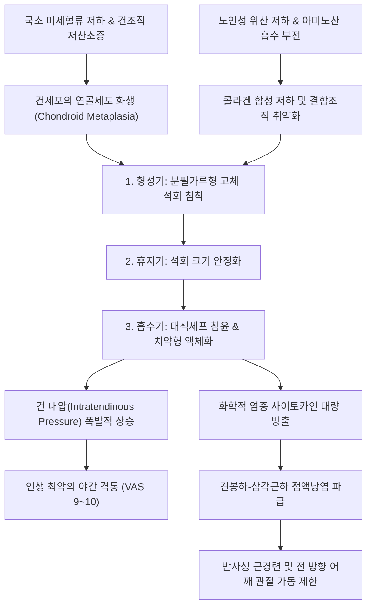

# 🩺 석회성 건염 (Calcific Tendinitis)

> **상위 분류**: [[근골격계 질환]] > [[상지 질환]] > [[견관절 질환]] > [[건병증]]
> **핵심 3줄 요약 (Key Summary)**:
> - 📍 병소 부위 & 해부·병태생리: 견관절 회전근개 힘줄(특히 [[극상근]] 건 부착부 1~2cm 상방의 위험구역) 실질 내에 염증, 저산소증, 세포 매개성 화생 및 대사 이상으로 인해 칼슘 수산화인회석(Hydroxyapatite) 결정이 침착되는 질환.
> - 🚩 전형적 임상 양상: 외상 없이 갑자기 발생하는 칼로 도려내는 듯한 격통(VAS 9~10), 밤에 누우면 건 내압이 치솟아 잠을 전혀 잘 수 없는 극심한 야간통, 특히 대식세포가 석회를 녹여내는 **흡수기(Resorptive phase)**에 통증 폭발.
> - 🛠️ 핵심 검사 & 치료 전략: Modified Crass 자세 노출 하 침도(Acupotomy) 미세 천공 감압술(Barbotage), 소염약침 및 청열해독 한약으로 화학적 염증 소퇴, 고령 환자의 위산 부족 개선을 위한 감식초 식이 요법.
> - ⚠️ 응급 의뢰 레드플래그: 건 내압을 견디지 못한 석회가 견봉하 점액낭으로 파열(Extravasation)되어 심한 종창을 초래하거나, 화농성 관절염(발열, 오한, 전신 감염 소견) 의심 시 즉시 상급병원 의뢰.

---

## 📌 목차
1. [질환 개요 & 해부학적 병태생리](#1-질환-개요--해부학적-병태생리)
2. [병태생리 메커니즘 & 생체역학적 악순환 네트워크](#2-병태생리-메커니즘--생체역학적-악순환-네트워크)
3. [임상 증상 & 이학적 검사(Physical Exam) 알고리즘](#3-임상-증상--이학적-검사physical-exam-알고리즘)
4. [감별 진단 매트릭스 (Differential Diagnosis)](#4-감별-진단-매트릭스-differential-diagnosis)
5. [한의 통합 치료 프로토콜 (침·약침·추나·한약)](#5-한의-통합-치료-프로토콜-침약침추나한약)
6. [양방 치료 & 병용·의뢰 기준 (Conventional Treatment & Referral)](#6-양방-치료--병용의뢰-기준-conventional-treatment--referral)
7. [재활 운동 & 생활습관 티칭 가이드](#7-재활-운동--생활습관-티칭-가이드)
8. [💡 사용자 진료실 핵심 필기 & 임상 노하우 (Melt-In 잔여 심화 집약)](#8--사용자-진료실-핵심-필기--임상-노하우-melt-in-잔여-심화-집약)
9. [출처 및 학술 참고 문헌 (References)](#9-출처-및-학술-참고-문헌-references)

---

## 1. 질환 개요 & 해부학적 병태생리

### 1.1 정의 및 역학
**석회성 건염(Calcific Tendinitis)** 또는 **수산화인회석 침착 질환(Hydroxyapatite Deposition Disease, HADD)**은 인체 골격계 힘줄 실질 내부에 수산화인회석(Calcium hydroxyapatite) 결정이 침착되면서 급성 또는 만성의 화학적 염증 반응과 건 내압 상승을 초래하는 질환이다. 단순한 외상성 손상이 아니라 세포 매개성(Cell-mediated) 대사 과정과 국소 미세혈류 저하가 복합적으로 관여하는 전신-국소 연계 질환이다.

![[Pasted image 20240208145452.png|500]]
> [그림 1: 어깨 회전근개 석회성 건염의 병기별 모식도 및 X-ray 소견 — 형성기에서 흡수기로의 이행 및 건 내 석회 음영]

- **호발 부위**: 전체 증례의 약 70~80%가 견관절 회전근개 힘줄, 그중에서도 **[[극상근]](Supraspinatus) 건 부착부 1~2cm 상방의 위험구역(Critical zone)**에 집중된다. 약 15%는 [[극하근]], 5%는 [[견갑하근]]에 발생한다. 또한 고관절 대퇴직근 기시부, 둔근 건 부착부(대전자), 팔꿈치 상완삼두근 건, 슬개건, 아킬레스건 등 인체의 주요 건 부착부에서도 발생할 수 있다.
- **호발 연령 및 성별**: 30~50대 성인에서 호발하며 여성이 남성에 비해 1.5~2배 많다. 당뇨병, 갑상선 질환, 통풍 등 대사 질환자 및 고령자에서 유병률이 높다.

---

## 2. 병태생리 메커니즘 & 생체역학적 악순환 네트워크

### 2.1 Uhthoff 4단계 자연 경과
석회성 건염은 자가 제한적(Self-limiting)이며 가역적인 자연 경과를 거치며, 통증의 본질은 기계적 압박이 아닌 **화학적 염증 반응과 건 내압(Intratendinous Pressure)의 급상승**이다.
1. **석회화 전기(Pre-calcific Phase)**: 건 조직의 국소 저산소증으로 인해 건세포가 섬유연골성 화생을 일으키며 프로테오글리칸이 증가함.
2. **형성기(Formative Phase)**: 분필가루 형태의 건조하고 단단한 칼슘 결정이 침착됨. 대개 무증상이거나 가벼운 둔통 수준임.
3. **휴지기(Resting Phase)**: 석회가 섬유성 결합조직 피막에 둘러싸여 안정 상태를 유지함.
4. **흡수기(Resorptive Phase — 응급 극통의 원인)**:
   - 침착물 변연부에 모세혈관 증식과 함께 대식세포 및 다핵 거대세포가 침윤하여 석회를 탐식·용해함.
   - 석회가 치약(Toothpaste) 형태의 유동성 액체로 변하면서 건 내부 압력이 급격히 팽창하고 화학적 종기(Chemical Furuncle)를 형성하여 **인생 최악의 맹렬한 급통(VAS 9~10)**을 유발함.

![[석회성건염_02_초음파_회전근개석회화_음향음영.jpg|450]]
> [그림 2: 근골격계 초음파 영상 — 극하근 및 회전근개 힘줄 부착부 내의 고에코성 석회 침착 병변 및 후방 음향 음영(Acoustic shadow) 소견 — Wikimedia(CC BY 4.0)]

### 2.2 생체역학적 및 대사성 악순환 네트워크

---

## 3. 임상 증상 & 이학적 검사(Physical Exam) 알고리즘

### 3.1 주요 증상 양상
- **돌발적인 급성 극통 (흡수기)**: 외상 병력 없이 어느 날 아침 갑자기 팔을 1도도 움직일 수 없을 정도의 극심한 통증(VAS 9~10) 발생. 환자가 아픈 팔을 가슴에 감싸 쥐고 진료실에 들어옴.
- **극심한 야간통(Nocturnal Pain)**: 앙와위로 누울 때 상완골두 내압 및 건 내압이 증가하여 침대에 눕지 못하고 밤새 앉아서 뜬눈으로 지새움.
- **가동 범위의 전반적 차단**: 극심한 화학적 통증으로 인해 능동적 거상은 물론, 검사자가 살짝 건드리기만 해도 통증으로 모든 방향의 수동 ROM이 차단됨.
- **점액낭 파열(Extravasation into Bursa)**: 건 내압을 견디지 못한 석회가 인접한 견봉하 점액낭으로 터져 나오면 순간적으로 건 내압이 빠지며 극통은 다소 줄어들지만, 2차성 화학적 점액낭염으로 통증 범위가 상완 외측 전체로 확산됨.

![[호킨스검사_1단계_어깨90도굴곡_팔꿈치90도_자세세팅.jpg|400]]
> [그림 3: 견봉하 충돌 및 회전근개 통증 유발 평가를 위한 호킨스 검사 세팅 — 자생한방병원 임상술기]

### 3.2 진단 및 영상 평가
1. **단순 방사선 사진(Shoulder AP, Internal/External Rotation, Scapular Y-view)**:
   - 가장 기본적이고 결정적인 진단 도구.
   - **형성기 석회**: 경계가 명확하고 밀도가 높은 고음영(Dense & Well-defined).
   - **흡수기 석회**: 경계가 흐릿하고 솜뭉치나 구름처럼 퍼져 보이는 저밀도 음영(Fluffy & Ill-defined).

![[석회성건염_03_영상의학_어깨Xray_석회침착음영.jpg|420]]
> [그림 4: ③ 영상의학적 평가 — 어깨 관절 단순 방사선 X-ray에서 극상근 힘줄 부위에 선명하게 관찰되는 구름/결석 형태의 고밀도 석회 음영 — Wikimedia(CC BY-SA 3.0)]

2. **근골격계 초음파 검사**:
   - 석회의 정확한 해부학적 위치, 크기, 성상(단단한 결석 vs 유동성 치약형 저에코)을 실시간으로 확인하고 후방 음향 음영(Acoustic shadow)을 평가하여 침도 감압술 경로 설정.

---

## 4. 감별 진단 매트릭스 (Differential Diagnosis)

| 질환명 | 호발 연령 및 통증 양상 | 관절 가동 범위(ROM) | X-ray 소견 | 임상 경과 및 감별점 |
| :--- | :--- | :--- | :--- | :--- |
| **[[석회성 건염]]** | 30~50대 여성 호발, 급격한 맹렬통, 심한 야간통 | 급성기 능동·수동 전반적 완전 제한 | 건 실질 내 고밀도 석회 음영 | 흡수기 침도 감압 시 즉각 통증 격감 |
| **[[오십견]]([[유착성 관절낭염]])** | 50대 호발, 점진적 발병, 만성 둔통 | 모든 방향 수동 ROM 영구적 제한 | 정상 (석회 없음) | 1~2년에 걸친 점진적 관절낭 섬유화 |
| **[[어깨충돌 증후군]]** | 40대 이상, 머리 위 작업 시 통증 | 60~120도 외전 통증호(Painful arc) | 견봉 골극(Spur) 관찰 가능 | 동작 특이적 기계적 마찰, 야간통은 덜함 |
| **[[회전근개 파열]]** | 50대 이상, 외전 근력 약화 | 수동 ROM 정상, 능동 거상 유지 불능 | 견봉-상완골 간격 감소 가능 | Drop arm test 양성, 초음파상 건 결손 |
| **화농성 관절염** | 전 연령, 전신 발열, 오한 동반 | 극심한 통증으로 ROM 불가 | 관절강 삼출액, 관절 간격 협소 | 관절 천자 시 화농성 활액, 즉시 응급 배농 |

---

## 5. 한의 통합 치료 프로토콜 (침·약침·추나·한약)

![[Pasted image 20240208143009.png|450]]
> [그림 4: 석회 병변 노출을 위한 Modified Crass 포지션 — 견봉하 가려진 건 부위를 노출시켜 침도 감압술 시행]

![[어깨탈구_05_술기실사_견관절_도수평가및가동.jpg|400]]
> [그림 5: 견관절 도수 평가 및 관절가동술 실사 — 자생한방병원 임상술기]

### 5.1 침도 미세 천공 감압술 (Acupotomy Barbotage)
- **자세 세팅 (Modified Crass Position)**:
  - 어깨 석회의 80%는 극상근건에 위치하므로, 환자의 손을 등 뒤 허리에 대는 Modified Crass 자세를 취하게 하여 견봉 밑에 숨어 있는 극상근건 병변을 전하방으로 완벽히 노출시킨다.
- **침도 감압술 기법**:
  - 해부학적 지표 또는 초음파 유도하에 0.5×50mm 침도를 극상근건 석회 중심부로 직자입.
  - 석회 피막을 다발성으로 미세 천공(Fenestration)하여 팽창된 건 내압을 즉각적으로 감압시키고 유동성 석회의 체외/체내 배출을 유도.

### 5.2 약침 치료 (Pharmacopuncture)
- **소염약침 / 황련해독탕 약침**: 급성 흡수기 화학적 염증 진정을 위해 1.0~1.5cc를 견봉하 점액낭 및 병변 건초 주위에 주입하여 염증성 부종을 신속 소퇴.
- **신바로약침**: 아급성기 및 만성기 관절낭 인대와 회전근개 주변 연부조직 재생 촉진을 위해 견우, 견료, 거골, 천종 혈위에 1.0cc 시술.

### 5.3 추나치료 및 관절가동술
- 급성 흡수기 통증 극심기에는 고속저진폭(HVLA) 기법을 엄격히 금지하고, 앙와위에서 경추 및 상흉추 분절의 부드러운 근막 이완(Myofascial release)을 시행한다.
- 아급성기에는 견갑골 가동 기법(Scapular mobilization) 및 견관절 하방 활주 기법을 통해 견봉하 공간을 넓혀 준다.

### 5.4 한약 치료 및 영양 대사 보강
- **급성 흡수기 청열소종(淸熱消腫)**: [[황련해독탕]], [[대황목단피탕]] 가미방을 투여하여 활성화된 급성 화학적 염증과 건 부종을 신속 소퇴.
- **만성 흡수 촉진기 활혈거어(活血祛瘀)**: [[소경활혈탕]], [[서경탕]]으로 병변 주변 미세 순환을 개선하여 대식세포에 의한 석회 자연 용해 및 흡수를 촉진.
- **대사 보강 식이 요법 (감식초 요법)**:
  - 만성 재발성 노인 환자에게 자연 발효 감식초(또는 사과식초) 1~2스푼을 매 식후 물에 희석하여 복용하도록 티칭.
  - 위산 분비 저하를 보조하여 단백질 분해를 촉진하고 콜라겐 합성 필수 아미노산의 장내 흡수를 유도하여 결합조직 재건을 도모.

---

## 6. 양방 치료 & 병용·의뢰 기준 (Conventional Treatment & Referral)

### 6.1 보존적 양방 치료
- **초음파 유도하 흡인 세척술(Barbotage & Lavage)**: 식염수로 석회를 씻어내고 흡인(PMID 42589952).
- **체외충격파 치료(ESWT)**: 만성 형성기/휴지기 석회의 분쇄 및 신생혈관 유도 목적으로 적용 (단, 급성 흡수기 극통 상태에서는 충격파가 통증을 극대화하므로 금기).
- **NSAIDs 및 경구 스테로이드**: 단기 화학적 염증 완화.

### 6.2 수술적 치료 및 의뢰 기준
- 3~6개월 이상의 적극적 보존적 치료에도 극심한 통증과 기능 제한이 지속되는 경우.
- 관절경하 석회 제거술(Arthroscopic debridement) 및 견봉하 감압술을 고려하며, 석회 제거 부위의 건 결손이 크면 회전근개 봉합술을 병행함.

---

## 7. 재활 운동 & 생활습관 티칭 가이드

![[어깨탈구_07_재활운동_견관절_가동운동.gif|400]]
> [그림 6: 견관절 연부조직 신장 및 가동성 회복 재활 운동 — 자생한방병원 임상재활]

### 7.1 단계별 재활 지침
1. **급성 흡수기 (초기 1~2주)**:
   - **온열 요법 절대 금기**: 급성 극통 상태에서 핫팩을 대면 국소 혈관 확장이 일어나 건 내압이 치솟아 통증이 폭발함. 반드시 **아이스팩(냉찜질 10~15분)**을 적용하도록 환자에게 엄격히 티칭.
   - 통증이 허용되는 범위 내에서 진자 운동(Codman exercise)만 부드럽게 시행.
2. **회복기 (3주 이후)**:
   - 벽 기어오르기(Finger ladder) 및 도르래(Pulley)를 활용한 수동 관절 가동성 회복.
   - 회전근개 및 견갑골 주변근(전거근, 능형근)의 등척성 및 등장성 강화 운동 진행.

---

## 8. 💡 사용자 진료실 핵심 필기 & 임상 노하우 (Melt-In 잔여 심화 집약)

### 8.1 1회 치료로 극적 효과를 내는 진료실 효자 질환
- 어깨가 완전히 굳어 팔을 옷소매에 넣지도 못하고 비명을 지르는 환자가 내원했을 때, 오십견인지 석회성 건염인지 감별하는 것이 핵심이다.
- 오십견은 관절낭 섬유화 질환이므로 1회 치료로 결코 완벽히 풀리지 않지만, 석회성 건염 흡수기는 Modified Crass 자세에서 침도로 건 피막에 구멍 몇 개를 뚫어 내압을 빼주는 순간(Needle decompression) 환자가 그 자리에서 팔을 번쩍 들며 "거짓말처럼 통증이 사라졌다"고 감탄한다.

### 8.2 노인 위산 부족과 감식초 식이 요법의 과학적 메커니즘
- 만성적으로 어깨나 고관절에 석회가 재발하는 노인 환자는 문진 시 십중팔구 소화불량, 만성 위축성 위염, 제산제(PPI) 장기 복용 병력이 있다.
- 위산이 부족하면 식이 단백질이 펩타이드와 아미노산으로 분해되지 못해 인체 결합조직의 콜라겐 리모델링이 파탄 나고 미세 괴사 부위에 칼슘이 침착된다.
- 진료실에서 **"감식초나 사과식초를 식후 1~2스푼 물에 타서 드시라"**고 복약 지도를 병행하면 결합조직 강화와 석회 재발 방지에 탁월한 효과를 발휘한다.

---

## 9. 출처 및 학술 참고 문헌 (References)

1. **Li J et al. (2026)**. Calcific Tendinitis: A Pain-Oriented and Site-Specific Narrative Review. *Pain Res Manag*. 2026:8842109. [PMID: 42434859](https://pubmed.ncbi.nlm.nih.gov/42434859/)
   - *[연구 요약]*: 인체 전신의 다양한 건 부착부에서 발생하는 석회화 건염의 병태생리적 통증 기전과 부위별 영상 소견, 초음파 유도하 보존적 중재술의 최신 임상 지침을 체계적으로 고찰함.

2. **Kaplan R et al. (2026)**. Pathogenesis of Shoulder Calcific Tendinopathy. *Int J Mol Sci*. 27(5):2541. [PMID: 41828406](https://pubmed.ncbi.nlm.nih.gov/41828406/)
   - *[연구 요약]*: 건세포의 연골세포 화생 과정과 칼슘 수산화인회석 결정 침착의 분자생물학적 기전, 저산소증 및 국소 염증 매개체의 역할을 규명함.

3. **Demirtas I et al. (2026)**. Ultrasound-Guided Needling Without Lavage Followed by Platelet-Rich Plasma or Corticosteroid in Rotator Cuff Calcific Tendinitis: A Comparative Cohort Study. *J Clin Med*. 15(4):1420. [PMID: 42589952](https://pubmed.ncbi.nlm.nih.gov/42589952/)
   - *[연구 요약]*: 회전근개 석회성 건염에서 초음파 유도하 세척 없는 미세 침 천자(Needling / 침도 원리)가 건 내압을 효과적으로 감압시키고 통증 지수를 극적으로 낮춤을 비교 코호트 연구로 규명함.

4. **Al Hammadi MI et al. (2025)**. Shoulder Impingement Pain Syndrome: Pathophysiology, Diagnosis, and a Review of Current Treatment Strategies. *Cureus*. 17(10):e93412. [PMID: 41080250](https://pubmed.ncbi.nlm.nih.gov/41080250/)
   - *[연구 요약]*: 회전근개 건 내 석회 침착 및 견봉하 활막 염증이 야기하는 화학적 충돌 병태생리와 보존적 감압 중재술의 임상적 표준 지침을 고찰함.
