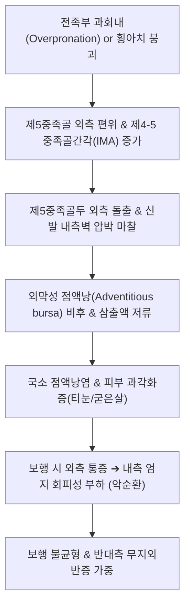

# 🩺 소지측 건막염

> **핵심 3줄 요약 (Key Summary)**:
> - 📍 **병소 부위 & 해부·병태생리**: 제5중족지관절([[5th MTP Joint]]) 외측 부위에서 제5중족골두가 바깥쪽으로 돌출되거나 제4-5 중족골간각이 증가하면서, 외측 결절 상방의 외막성 점액낭이 신발 마찰을 받아 비후·염증화된 질환(**Bunionette / Tailor's Bunion / 재봉사 건막류**). *(※ 수지 새끼손가락 척측의 건막·건초 질환과의 감별 요망)*.
> - 🚩 **전형적 임상 양상**: 새끼발가락 외측 돌출부의 발적, 작열감, 굳은살([[Callus]]) 형성, 좁은 신발을 신거나 양반다리로 바닥에 앉을 때 발생하는 심한 마찰성 외측 족부 통증.
> - 🛠️ **핵심 검사 & 치료 전략**: 체중 부하 족부 X-ray(제4-5 중족골간각 [[IMA 4-5]] 및 외반각 측정); [[통곡혈]](BL66), [[속골혈]](BL65), [[지음혈]](BL67) 자침 및 소염약침; 전족부 횡아치 교정 추나; 토박스가 넓은 신발과 외측 실리콘 패드 티칭.
> - ⚠️ **응급 의뢰 레드플래그**: 당뇨병 환자에서 제5중족골두 외측의 피부 궤양 형성 및 심부 감염(당뇨발 괴사 및 골수염 위험); 급성 화농성 관절염.

---

## 📌 목차
1. [질환 개요 & 해부학적 병태생리](#1-질환-개요--해부학적-병태생리)
2. [병태생리 메커니즘 & 생체역학적 악순환 네트워크](#2-병태생리-메커니즘--생체역학적-악순환-네트워크)
3. [임상 증상 & 이학적 검사(Physical Exam) 알고리즘](#3-임상-증상--이학적-검사physical-exam-알고리즘)
4. [감별 진단 매트릭스 (Differential Diagnosis)](#4-감별-진단-매트릭스-differential-diagnosis)
5. [한의 통합 치료 프로토콜 (침·약침·추나·한약)](#5-한의-통합-치료-프로토콜-침약침추나한약)
6. [양방 치료 & 병용·의뢰 기준 (Conventional Treatment & Referral)](#6-양방-치료--병용의뢰-기준-conventional-treatment--referral)
7. [재활 운동 & 생활습관 티칭 가이드](#7-재활-운동--생활습관-티칭-가이드)
8. [💡 사용자 진료실 핵심 필기 & 임상 노하우 (Melt-In 잔여 심화 집약)](#8--사용자-진료실-핵심-필기--임상-노하우-melt-in-잔여-심화-집약)
9. [출처 및 학술 참고 문헌 (References)](#9-출처-및-학술-참고-문헌-references)

---

## 1. 질환 개요 & 해부학적 병태생리

### 1) 해부학적 구조와 '재봉사 건막류(Tailor's Bunion)'의 어원
* **제5중족지관절 (5th Metatarsophalangeal Joint)**:
  * 발의 외측 종아치(Lateral longitudinal arch)와 횡아치(Transverse arch)의 외측 지지점을 구성하며, 보행 시 발의 외측 체중 부하를 담당함.
* **어원 (Tailor's Bunion)**:
  * 과거 재봉사들이 바닥에 양반다리(Cross-legged sitting)를 하고 장시간 앉아 바느질을 할 때, 양쪽 새끼발가락 외측이 바닥에 지속적으로 닿아 마찰을 받아 점액낭염이 호발한 데서 유래함.
* *(볼트 분류 참고)*: 본 질환은 족부의 Bunionette(소지 건막류)를 정본으로 다루며, 상지 손목 및 수지 제5지(새끼손가락) 척측의 건초염이나 건막성 낭종과의 동음이의어적 구분을 명확히 함.

### 2) 방사선학적 분류 (Coughlin Classification)
체중 부하 족부 전후면(AP) X-ray 소견에 따른 3가지 아형:
* **Type 1 (비후된 제5중족골두, Hypertrophic 5th Metatarsal Head, 약 30%)**:
  * 중족골 각도는 정상이나 제5중족골두 외측 결절 자체만 국소적으로 비대해진 형태.
* **Type 2 (제5중족골 외측 만곡, Lateral Bowing, 약 15%)**:
  * 제5중족골 간부가 바깥쪽으로 활처럼 휘어져 골두가 외측으로 돌출된 형태.
* **Type 3 (제4-5 중족골간각 증가, Widened 4-5 IMA, 약 55%)**:
  * 제4중족골과 제5중족골 사이의 벌어짐 각도(IMA 4-5)가 병적으로 증가한 형태. 정상은 6~8도 이하이며, 10~12도 이상 시 병적 변형으로 진단.

---

![[소지측건막염_01_병태_감염성건막염.jpg|450]]
> [그림 1: ① 병태 — 감염성 건막염의 건 유착 기전] 건막 내 감염이 건의 유착과 활주 장애를 일으켜 관절운동 소실·괴사로 진행하는 과정을 그린 국가건강정보포털 도해. 소지측 건막염은 굴곡건초의 화농성 감염으로 손 불구를 초래할 수 있어 조기 배농이 원칙이다. 출처: 국가건강정보포털 「건막염(감염성 건막염)」 도해

## 2. 병태생리 메커니즘 & 생체역학적 악순환 네트워크

### 1) 신발 압박과 점액낭 형성 기전
* 볼이 좁고 뾰족한 구두를 신으면 제1열은 안쪽으로, 제5열은 바깥쪽으로 압박받아 발의 외측 폭이 좁아지는 힘을 받음.
* 제5중족골두 외측의 연조직은 두께가 얇기 때문에, 반복적인 전단 응력(Shear stress)이 가해지면 인체는 방어 기전으로 외막성 점액낭(Adventitious bursa)을 형성하고 피부를 두껍게 만들어 굳은살(Tyloma)이나 티눈(Heloma durum)을 형성함.

### 2) 무지외반증과의 흔한 동반성
* 소지측 건막염 환자의 약 40~50%는 반대편 엄지발가락의 [[무지외반증]](Hallux valgus)을 동반하고 있음.
* 발의 횡아치가 평평하게 무너지는 편평족(Splayfoot) 환자에서 제1열과 제5열이 양쪽으로 동시에 벌어지면서 전족부 전체 폭이 넓어지는 것이 근본적 병태생리임.

---

## 3. 임상 증상 & 이학적 검사(Physical Exam) 알고리즘

### 1) 주요 임상 증상
* **새끼발가락 외측 돌출부 통증**: 신발을 신었을 때 제5 MTP 관절 외측이 눌려 화끈거리고 욱신거림.
* **굳은살 및 티눈 병발**: 돌출부 정점이나 제5족지 족저 외측에 단단한 각질이 형성되어 보행 시 찌르는 듯한 통증.
* **관절 종창 및 발적**: 신발을 벗은 후에도 빨갛게 부어있고 열감이 지속됨.

### 2) 진료실 핵심 이학적 검사 알고리즘
1. **제5 MTP 관절 외측 직접 촉진 (Direct Palpation)**:
   * 제5중족골두 외측을 엄지손가락으로 눌러 점액낭의 파동감 및 압통 유발 확인.
2. **신발 착용 시뮬레이션 및 마찰 부위 확인**:
   * 환자가 평소 신는 신발의 외측 마모도와 환부의 위치 일치 여부 확인.
3. **체중 부하 족부 방사선 검사 (Weight-bearing Foot AP/Lateral)**:
   * **제4-5 중족골간각 (IMA 4-5)**: 정상 6~8도 미만 (10도 이상 시 Type 3 건막류).
   * **소지외반각 (5th MTP Angle)**: 제5중족골 축과 근위지골 축의 각도 (정상 10도 미만, 16도 이상 시 병적 변형).
4. **혈류 및 신경학적 평가**:
   * 족배동맥(Dorsalis pedis) 박동 및 당뇨병성 말초신경병증 동반 여부 확인.

---

![[소지측건막염_02_임상_수지종창.jpg|450]]
> [그림 2: ② 임상 소견 — 굴곡건초의 종창] 손가락 관절이 부어오르고 붉게 충혈된 실제 사진. 굴곡건초에 염증이 생기면 건을 따라 부종과 압통이 나타나며, 손가락을 펴고 굽힐 때 통증이 심해진다. 출처: File:Tenosynovitis-3.JPG (CC BY-SA 3.0) · Wikipedia 문서 이미지

## 4. 감별 진단 매트릭스 (Differential Diagnosis)

| 질환명 | 주 통증 부위 및 양상 | 핵심 구별 포인트 | 필수 감별 검사 / 치료 차이점 |
| :--- | :--- | :--- | :--- |
| **소지측 건막염 (Bunionette)** | 제5중족골두 외측 돌출부, 신발 마찰통 | 제5중족골두의 구조적 변형, 점액낭 비후 | 체중 부하 X-ray(IMA 4-5 증가), 패드/절골술 |
| **단순 티눈 / 굳은살 (Heloma Durum)** | 피부 표재성 각질 중심핵 | 뼈의 구조적 변형 없음, 각질 제거 시 일시 완화 | 각질 삭제술, 티눈 패드 |
| **제5중족골 기저부 골절 (Jones / Pseudo-Jones)** | 제5중족골 **기저부(몸쪽 5cm 지점)** | **급성 발목 접질림 외상력**, 기저부 국소 압통 | 족부 사위(Oblique) X-ray |
| **소지 지간 신경종 ([[Morton Neuroma]])** | 제4-5 발가락 사이 족저부 찌릿함 | Mulder's click 검사 양성, 발가락 감각 저하 | 초음파 검사, 신경종 주사 치료 |
| **수지 소지 척측 건초염 (상지 감별)** | **새끼손가락 손바닥 쪽 관절** | 손가락 굴곡 시 방아쇠 현상, 발과 무관 | 수부 이학적 검사 |

---

## 5. 한의 통합 치료 프로토콜 (침·약침·추나·한약)

### 1) 침구 치료 (Acupuncture)
* **국소 핵심 혈위 (족태양방광경 및 족소양담경)**:
  * [[통곡혈]](BL66): 제5 MTP 관절 원위부 전하방 함요처. 국소 열감 및 부종 청열.
  * [[속골혈]](BL65): 제5중족골두 근위부 후하방 함요처. 방광경의 유혈, 외측 관절통 특효혈.
  * [[지음혈]](BL67): 새끼발가락 외측 조갑근각. 말초 미세순환 촉진.
  * [[임읍혈]](GB41), [[협계혈]](GB43): 제4·5 중족골간 공간 이완 및 횡아치 압박 분산.
* **특수 침요법 (아시혈 피내자 및 온침)**:
  * 점액낭 외측 융기부 주변 결합조직에 0.16mm 미세 호침을 횡자하여 점액낭 내압 분산.
  * 만성 각화 병변 부위에 간접구(스티커뜸)를 부착하여 비후된 각질 연화 촉진.

### 2) 약침 치료 (Pharmacopuncture)
* **약침 제제 선택**:
  * **신바로약침 / 소염약침**: 신발 마찰로 인해 붉게 부어오른 급성 점액낭염에 1차 선택.
  * **중성어혈약침**: 만성적인 압박성 허혈 및 티눈 주변 어혈 병변 완화.
* **주입 방법**:
  * 제5중족골두 외측 결절과 점액낭 사이 피하 결합조직층에 30G 니들로 0.1~0.2cc 주입 (골막 직접 접촉 회피).

### 3) 전족부 횡아치 교정 추나 (Foot Chuna)
* **제5중족골 내측 압박 가동술**:
  * 술자가 양 손바닥으로 제1열과 제5열을 감싸 쥐고, 벌어진 중족골두를 중앙으로 모아주는 방향으로 부드럽게 횡방향 압박 가동 적용.
* **입방골(Cuboid) 교정 추나**:
  * 외측 종아치의 키스톤인 입방골의 하방 변위를 상방으로 들어 올려 발의 외측 지지력 정상화.

### 4) 변증별 맞춤 한약 처방 (Herbal Medicine)
* **풍습열비 (風濕熱痺) - 점액낭 발적 및 작열통 급성형**:
  * 증상: 새끼발가락 외측이 빨갛게 붓고 신발을 신지 못함, 설홍태황.
  * 처방: **당귀점통탕(當歸拈痛湯)** 또는 **[[청열사습탕]](淸熱瀉濕湯)** 가감.
* **기체어혈 (氣滯瘀血) - 굳은살 및 만성 둔통형**:
  * 증상: 딱딱하게 굳은 각질, 걸을 때마다 찌르는 듯함.
  * 처방: **[[당귀수산]](當歸鬚散)** 합 **[[오적산]](五積散)** 가감 (우슬, 도인, 홍화).
* **간신음허 / 근막위약 (肝腎陰虛 / 筋膜萎弱) - 평발 동반 노인성형**:
  * 증상: 발 전체가 피로하고 아치가 완전히 무너짐.
  * 처방: **독활기생탕(獨活寄生湯)** 가미.

---

## 6. 양방 치료 & 병용·의뢰 기준 (Conventional Treatment & Referral)

### 1) 보존적 치료 및 보조기
* **신발 변경 (Footwear Modification)**:
  * 앞코가 넓은 와이드 토박스(Wide toe box) 신발 착용이 치료의 90%를 좌우함.
* **실리콘 패드 및 스페이서**:
  * 도넛 형태의 실리콘 건막류 패드를 부착하여 신발 내측벽과의 직접 마찰 차단.
* **맞춤 인솔**:
  * 외측 종아치를 지지하고 횡아치를 거상하는 메타타살 패드(Metatarsal pad) 장착.

### 2) 주사 치료 (Injections)
* 급성 점액낭염에 한해 국소 소량 Triamcinolone 주입 고려 (연 1~2회 이내, 피하지방 위축 주의).

### 3) 수술적 치료 적응증 (Surgical Indication)
* **적응증**:
  * 6개월 이상의 보존적 치료에도 일상생활 및 보행이 불가능한 지속적 통증.
* **대표 수술 술식**:
  * **외측 결절 절제술 (Bumpectomy / Silver procedure)**: Type 1에서 돌출된 뼈만 다듬기.
  * **원위 제5중족골 절골술 (Chevron / S兵carf osteotomy)**: 골두를 내측으로 3~5mm 이동.
  * **최소침습 수술 (MIS / Minimally Invasive Surgery)**: 경피적 핀 삽입 및 미세 절골술.

### 4) 양방·전문과 의뢰 기준 (Referral Criteria)
* **정형외과 족부족관절 전문의 의뢰**:
  * 보존적 치료에 반응하지 않는 심한 Type 3 변형.
  * 당뇨병 환자에서 궤양 및 골 노출 징후 발생 시 즉시 대학병원 감염내과/족부정형외과 의뢰.

---

## 7. 재활 운동 & 생활습관 티칭 가이드

### 1) 전족부 횡아치 강화 운동
* **수건 끌어당기기 (Towel Curl)**: 발가락 전체를 이용하여 바닥의 수건을 쥐어짜듯 끌어모으기.
* **발가락 부채꼴 벌리기**: 새끼발가락을 바깥쪽으로 능동적으로 벌리는 감각 훈련.

### 2) 생활 관리 및 착화 지도
* 폭이 좁은 구두, 하이힐, 뾰족구두는 절대 금지.
* 바닥에 양반다리로 앉는 좌식 생활을 피하고, 의자 생활 권장.

---

## 8. 💡 사용자 진료실 핵심 필기 & 임상 노하우 (Melt-In 잔여 심화 집약)

### 1) 티눈 치료를 반복해도 계속 재발하는 이유
* 환자가 "피부과에서 티눈을 3번이나 레이저로 뺐는데 계속 다시 생겨요"라고 할 때, 발을 보면 십중팔구 제5중족골두가 바깥으로 튀어나온 소지측 건막염임.
* 피부의 각질(티눈)은 뼈가 신발에 부딪히며 생기는 '결과물'일 뿐이므로, 뼈의 마찰을 줄여주지 않으면 평생 재발함.
* 환자에게 신발 볼을 넓히고 도넛 패드를 대어 뼈의 압박을 없애주면 티눈은 저절로 사라짐.

### 2) 속골혈-통곡혈 자침의 즉효성
* 속골혈과 통곡혈은 족태양방광경의 수혈과 형혈로서, 제5중족지관절의 부종과 열감을 내리는 데 가장 탁월함.
* 30G 30mm 호침으로 속골혈에서 전하방으로 사자하여 관절낭 외측벽에 가볍게 닿게 하면 마찰로 욱신거리던 열감이 10분 만에 시원하게 가라앉음.

---

## 9. 출처 및 학술 참고 문헌 (References)

* Minimally Invasive Surgery For Management of Bunionette Deformity (Tailor's Bunion) Using Fifth Metatarsal Osteotomies: A Systematic Review and Meta-Analysis. [PMID: 39086382]

* Coughlin MJ. Etiology and evaluation of bunionette deformity. Foot Ankle Int. 1995;16(5):249-257.

* Ajis A, Koti M, Maffulli N. Tailor's bunion: a review. J Foot Ankle Surg. 2005;44(3):236-245.

* Cohen BE. Bunionettes. Foot Ankle Clin. 2011;16(2):339-346.
