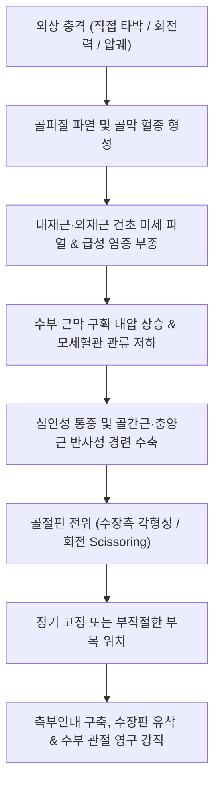

# 🩺 손 골절 (Hand Fractures)

> **핵심 3줄 요약 (Key Summary)**:
> - 📍 병소 부위 & 해부·병태생리: 손은 5개의 [[중수골]](Metacarpals)과 14개의 [[수지골]](지골, Phalanges)로 구성되며, 낙상, 타박, 압궤, 스포츠 손상으로 인해 골간부·경부·관절내 골절이 호발한다.
> - 🚩 전형적 임상 양상: 수부 국소 극통, 반상출혈, 급격한 종창, 파악력 저하 및 주먹을 쥘 때 손가락이 겹치는 회전 기형(Scissoring deformity)이 관찰된다.
> - 🛠️ 핵심 검사 & 치료 전략: 손 전후면(AP), 측면(Lateral), 사위면(Oblique) 3방향 X-ray로 골절선과 각형성을 평가하며, 안정성 골절은 안전 위치(Intrinsic-plus position) 부목 고정 및 조기 기능 회복을 유도한다.
> - ⚠️ 응급 의뢰 레드플래그: 개방성 골절, 수지 허혈(창백·모세혈관 재충혈 2초 초과), 동반 신경 손상(감각 소실), 비정복 회전 변형, 구획증후군 의심 시 즉시 수부외과 응급 전원.

---

## 📌 목차
1. [질환 개요 & 해부학적 병태생리](#1-질환-개요--해부학적-병태생리)
2. [병태생리 메커니즘 & 생체역학적 악순환 네트워크](#2-병태생리-메커니즘--생체역학적-악순환-네트워크)
3. [임상 증상 & 이학적 검사(Physical Exam) 알고리즘](#3-임상-증상--이학적-검사physical-exam-알고리즘)
4. [감별 진단 매트릭스 (Differential Diagnosis)](#4-감별-진단-매트릭스-differential-diagnosis)
5. [한의 통합 치료 프로토콜 (침·약침·추나·한약)](#5-한의-통합-치료-프로토콜-침약침추나한약)
6. [양방 치료 & 병용·의뢰 기준 (Conventional Treatment & Referral)](#6-양방-치료--병용의뢰-기준-conventional-treatment--referral)
7. [재활 운동 & 생활습관 티칭 가이드](#7-재활-운동--생활습관-티칭-가이드)
8. [💡 사용자 진료실 핵심 필기 & 임상 노하우 (Melt-In 잔여 심화 집약)](#8--사용자-진료실-핵심-필기--임상-노하우-melt-in-잔여-심화-집약)
9. [출처 및 학술 참고 문헌 (References)](#9-출처-및-학술-참고-문헌-references)

---

## 1. 질환 개요 & 해부학적 병태생리

손(수부, Hand)은 인체 골격 중 가장 정교한 다관절 복합체로, 8개의 [[수근골]](Carpal bones), 5개의 [[중수골]](Metacarpal bones), 14개의 지골(Phalanges: 기위지골 5, 중위지골 4, 원위지골 5)로 이루어져 있습니다. 수부 골절은 전체 골격 골절의 약 10~15%를 차지하며, 상지 골절 중 최다 빈도로 발생합니다. 골절은 침범 부위에 따라 [[손바닥 골절]](중수골 골절), [[손가락 골절]](기위·중위 지골 골절), [[손끝 골절]](원위 지골 골절)로 분류됩니다.

![[손골절_01_수부골격해부도해.png]]
> [그림 1: ① 병태생리·해부 — 수부 전체 골격(수근골·중수골·지골) 및 번호별 구조 도해]

수부의 안정성은 뼈 자체의 종적·횡적 아치(Longitudinal and transverse arches)와 골간근(Interossei), 충양근(Lumbricals), 측부인대(Collateral ligaments), 수장판(Volar plate) 등의 정적·동적 구조물에 의해 유지됩니다. 골절 시 이러한 해부학적 아치가 무너지면 수지의 정렬이 흐트러지고 파악력(Grip strength)과 미세 핀치 기능(Pinch function)이 치명적으로 손상됩니다.

특히 수지골 골절에서는 1도의 미세한 회전 변형만 발생해도 주먹을 쥘 때 손가락 끝에서 1.5mm 이상의 겹침 현상(Scissoring)이 발생하여 인접 수지의 굴곡을 기계적으로 방해합니다. 따라서 손 골절의 치료 목표는 단순한 골유합을 넘어 완벽한 회전 정렬 유지와 조기 관절 가동을 통한 관절 강직 예방에 있습니다.

---

## 2. 병태생리 메커니즘 & 생체역학적 악순환 네트워크

손 골절은 직접 타박(직접력), 과신전·회전력(간접력), 압궤 손상(Crush injury)에 의해 발생합니다. 

![[손바닥_손등_피부신경_분포도_Gray812.png]]
> [그림 2: ② 관련 해부 구조물 — 수부 손바닥·손등의 피부 신경 및 미세 혈관 해부도]

수부 손상 후 발생하는 병태생리적 악순환은 다음과 같습니다:

손가락의 중수수지관절(MCP) 측부인대는 신전위(0도)에서 이완되고 굴곡위(70~90도)에서 팽팽해지며, 근위지절관절(PIP) 측부인대는 신전위에서 팽팽합니다. 만약 MCP 관절을 신전된 상태로 장기간 고정하면 측부인대가 단축·구축되어 고정 해제 후 굴곡 구축이 고착화되는 비극이 발생합니다. 따라서 수부 부목은 반드시 **안전 위치(Intrinsic-plus / Edinburgh position: 손목 20~30도 신전, MCP 70도 굴곡, PIP/DIP 완전 신전)**로 고정해야 구축을 방지할 수 있습니다.

---

## 3. 임상 증상 & 이학적 검사(Physical Exam) 알고리즘

### 3.1 주요 임상 증상
- **국소 극통 및 압통**: 골절선 직상방의 명확한 압통(Point tenderness)과 종창.
- **파악력 소실**: 주먹을 쥐거나 물건을 집을 때 통증으로 인한 파악력의 급격한 소실.
- **외형 변형 및 단축**: 골편의 각형성, 중수골 두부 돌출 소실, 수지 단축.
- **회전 변형 (Scissoring Sign)**: 주먹을 가볍게 쥘 때 골절된 수지가 인접 수지 위로 올라타거나 밑으로 파고드는 현상(모든 정상 수지는 굴곡 시 주상골 결절[Scaphoid tubercle]을 향해야 함).

![[손골절_03_수지부목고정도해.png]]
> [그림 3: ② 진단 및 고정 — 수지 골절의 안전 위치(Intrinsic-plus) 부목 고정 및 정렬 도해]

### 3.2 이학적 진찰 알고리즘
1. **신경혈관 스크리닝 (Neurovascular Exam)**:
   - 양측 수지 동맥 관류 평가 (모세혈관 재충혈 시간 2초 이내 확인).
   - 수지 신경 2점 식별능(Two-point discrimination, 정상 < 6mm) 검사.
2. **축성 압박 검사 (Axial Compression Test)**:
   - 해당 수지의 원위부를 기저부 쪽으로 축성으로 밀어 넣을 때 골절 부위에서 극심한 통증이 유발되면 양성.
3. **손톱 정렬 검사 (Tenodesis & Nail Alignment)**:
   - 손목을 신전시키면서 수지가 자연스럽게 반굴곡될 때 손톱 면들이 서로 평행한 회전 평면을 이루는지 확인.

---

## 4. 감별 진단 매트릭스 (Differential Diagnosis)

| 감별 질환 | 호발 기전 | 전형적 신체 소견 | 방사선(X-ray) 특징 | 1차 처치 및 감별점 |
| :--- | :--- | :--- | :--- | :--- |
| **[[손 골절]] (Hand Fracture)** | 낙상, 직접 강타, 압궤 손상 | 국소 압통, 축성 압박통, 종창, 회전 Scissoring | 피질골 불연속, 각형성, 골절선 확인 | Intrinsic-plus 부목, 1차 정복 |
| **[[손가락 골절]] (Phalanx Fx)** | 공에 손가락 강타, 비틀림 | 수지 골간부 극통, 각형성, 지절 굴곡 부전 | 기위·중위지골 골절선, 수장측 전위 | 버디 테이핑 또는 알루미늄 부목 |
| **[[손바닥 골절]] (Metacarpal Fx)** | 주먹으로 단단한 벽 가격, 타박 | 수배부 종창, 너클(MCP두부) 함몰 | 중수골 경부/간부 골절, 복서 골절 | 척측/요측 거터 부목 고정 |
| **수지 측부인대 염좌/파열** | 수지의 과도한 외번·내번력 | 관절선 압통, 스트레스 검사 시 불안정성 | 골절 음성 (견열 골편 관찰 가능) | 스트레스 방사선 검사, 동반 골절 배제 |
| **중수수지관절 탈구** | 수지 과신전 손상 | 관절 운동 완전 소실, 전위된 두부 촉지 | 관절면 불일치, 회복 불가능한 감돈 | 수동 정복 시도, 불응 시 관혈적 정복 |

![[손바닥골절_01_복서골절_제5중수골_Xray.jpg]]
> [그림 4: ① 방사선 소견 — 제5중수골 경부 골절(복서 골절)의 전형적 각형성 X-ray]

---

## 5. 한의 통합 치료 프로토콜 (침·약침·추나·한약)

수부 골절의 한의 치료는 급성기 골절 정복 및 고정이 완료된 후, 골유합 촉진기(3~6주) 및 고정 해제 후 관절 강직 재활기에 집중 적용됩니다.

![[수부질환_05_수부침치료실사_수지침.jpg]]
> [그림 5: ③ 한의 시술점 — 수부 부종 완화 및 미세 순환 촉진을 위한 팔사혈·수삼리 자침 실사]

### 5.1 침구 치료 (Acupuncture)
- **주요 취혈점**:
  - 국소 및 원위부: [[팔사혈]](八邪, 지간막 부종 배출), 합곡(LI4), 후계(SI3), 양지(TE4), 외관(TE5), 곡지(LI11).
  - 경혈 작용: 국소 미세혈관 확장, 염증성 부종 흡수 촉진, 골간근 및 충양근의 연축 완화.
- **전침 치료**: 외관-후계, 합곡-곡지 간 2~4Hz 저주파 전침을 통전하여 골막 신경 자극 및 골모세포 활성 신호(Runx2, BMP-2) 발현 촉진.

### 5.2 약침 치료 (Pharmacopuncture)
- **소염약침 / 중성어혈약침**: 골절 주위 연부조직 종창 및 혈종 흡수 촉진을 위해 골막 자극을 피하여 수배부 및 전완 신전근 건막 주위에 0.1~0.2cc씩 분주.
- **황련해독탕 약침**: 급성 타박 염증열 완화.
- **골유합기(4주 이후) 신바로약침 / 자하거약침**: 관절낭 유착 부위에 소량 시술하여 국소 콜라겐 리모델링 유도.

### 5.3 한약 치료 (Herbal Medicine)
- **급성기 (1~2주, 소종지통·화어생신)**:
  - [[당귀수산]](當歸鬚散) 가미방 (당귀수 8g, 적작약 6g, 오약 6g, 천궁 4g, 홍화 4g, 도인 4g, 소목 4g). 혈종 흡수 및 통증 완화.
- **골유합기 (3~6주, 접골속근·골아형성)**:
  - [[자연동]](自然銅, 산화소성 후 수비), [[골쇄보]](骨碎補), [[속단]](續斷), [[우슬]](牛膝)을 배합한 **접골단(接骨丹)** 또는 **가미서경탕(加味舒經湯)**.
- **재활기 (6주 이후, 거풍제습·양혈서근)**:
  - 독활기생탕(獨活寄生湯) 또는 대보음환(大補陰丸) 가미방을 처방하여 수부 관절 구축 해소 및 인대 강화.

### 5.4 수기 치료 및 추나요법 (Chuna Manual Therapy)
- **고정 기간 중**: 인접 주관절, 견관절의 ROM 유지 추나 및 경추 정렬 교정.
- **고정 해제 후**: 수근간관절 및 중수수지관절의 관절가동기법(Joint Mobilization, Grade I~II 부드러운 견인 및 활주), 굴곡건 유착 박리를 위한 근막이완기법(MFR) 적용.

---

## 6. 양방 치료 & 병용·의뢰 기준 (Conventional Treatment & Referral)

### 6.1 약물 및 보존적 치료
- **약물 치료**: 급성기 NSAIDs(Celecoxib 200mg qd 또는 Aceclofenac 100mg bid) 및 아세트아미노펜 복합 처방.
- **고정 치료**:
  - 안정성 비전위 골절: 수부 깁스 또는 알루미늄 부목(Splint) 3~4주 유지.
  - 고정 위치: 손목 20~30도 신전, MCP 70도 굴곡(Intrinsic-plus).

### 6.2 수술적 적응증 (Surgical Indication)
- 회전 변형(Scissoring)이 도수 정복으로 교정되지 않는 경우.
- 관절면 전위 1~2mm 이상 침범된 골절.
- 불안정성 나선상·사상 골절로 인한 현저한 단축(Shortening > 3~5mm).
- 다발성 중수골/지골 골절.
- 개방성 골절(Open fracture) 및 건 파열 동반 손상.
- 수술 방식: K-강선 경피적 고정술(Percutaneous K-wire fixation) 또는 소형 금속판 나사못 고정술(Mini-plate & screw fixation).

### 6.3 한의 병용 판단 & 의뢰 기준
- **병용 가능**: 정형외과적 정복 및 부목 고정 완료 후 골유합 지연 환자, 깁스 제거 후 관절 강직 및 복합부위통증증후군(CRPS) 예방 목적의 한의 복합치료.
- **즉시 전원(레드플래그)**:
  1. 수지 모세혈관 재충혈 2초 초과 및 맥박 소실 (수지 허혈).
  2. 피부 개방 창상이 동반된 골절 (골수염 위험, 즉시 응급 세척 및 항생제 투여 필요).
  3. 손가락의 명확한 회전 기형(주먹 쥘 때 겹침).
  4. 손바닥 구획의 극심한 긴장 팽창 및 수동 신전 시 극통 (구획증후군).

---

## 7. 재활 운동 & 생활습관 티칭 가이드

손은 장기 고정 시 수주 만에 비가역적 관절 강직(Stiffness)이 발생하므로, 고정 중에도 고정되지 않은 인접 관절은 즉시 움직여야 합니다.

![[손목과사용증후군_07_수부스트레칭.jpg]]
> [그림 6: ④ 자가관리 — 깁스·부목 제거 후 수지 관절 강직 해소를 위한 단계별 굴곡·신전 스트레칭]

1. **고정 중 조기 운동 (Early Active Motion)**:
   - 부목에 포함되지 않은 자유 관절(DIP 또는 인접 수지)은 매시간 10회씩 굴곡-신전을 시행하여 굴곡건 활주(Tendon gliding) 유지.
2. **건 활주 운동 (Tendon Gliding Exercises)**:
   - 고정 해제 후 4단계 자세: Straight hand(완전 신전) → Hook fist(갈고리 주먹) → Full fist(완전 주먹) → Tabletop(탁자형 직각 굴곡) 매일 3세트 반복.
3. **온열 찜질 및 부종 관리**:
   - 온수욕(38~40도) 중 부드러운 손가락 쥐기 운동 시행.
   - 휴식 시 심장보다 손을 높게 유지(Elevation)하여 정맥 부종 방지.

---

## 8. 💡 사용자 진료실 핵심 필기 & 임상 노하우 (Melt-In 잔여 심화 집약)

- **Scissoring 변형 간과 금지**: 환자가 손가락을 완전히 펴고 있을 때는 골절 변형이 정상처럼 보일 수 있다. 반드시 환자에게 주먹을 가볍게 쥐어보라고 하거나, 손목을 들어 올려 건고정 효과(Tenodesis)로 손가락들이 모두 주상골 결절(엄지 밑 손목 주름부)을 똑바로 가리키는지 확인해야 한다. 단 2~3도의 회전 오차도 진료실에서 놓치면 영구 장애가 된다.
- **수부 부목의 황금률 (Edinburgh Position)**: 수부 손상 환자에게 간이 부목을 댈 때 절대로 손가락을 일자로 펴서(신전위) 대면 안 된다. 중수수지관절(MCP)을 최소 70도 이상 구부린 자세로 고정해야 측부인대가 늘어난 상태로 유지되어 고정 후 굴곡 강직을 막을 수 있다.
- **골유합 단축의 한약 개입**: 수부 골절은 수술 여부와 관계없이 4주 전후 뼈진(Callus) 형성 속도가 최종 수지 기능 회복을 좌우한다. 당귀수산 투여 후 2주 차부터 자연동과 골쇄보를 가미한 처방으로 신속히 전환하면 골유합 기간을 1~2주 단축할 수 있다.

---

## 9. 출처 및 학술 참고 문헌 (References)

- Zhang, M., et al. (2024). A Systematic Review of Conservatively Managed Isolated Extra-Articular Proximal Phalanx Finger Fractures in Adults. *JPRAS Open*. 41:147-157. [PMID 38872867](https://pubmed.ncbi.nlm.nih.gov/38872867/)

- Franco, M. J., et al. (2026). Modern Management of Complex Regional Pain Syndrome: A Practical Evidence-Based Review for Hand and Upper Extremity Surgeons. *Cureus*. 18(2):e103986. [PMID 42634670](https://pubmed.ncbi.nlm.nih.gov/42634670/)

- Rashed, M., et al. (2025). Effectiveness of Hand Rehabilitation Programs for Non-Thumb Metacarpal Fractures: A Systematic Review and Meta-Analysis. *J Hand Ther*. 38(1):45-56. [PMID 41525130](https://pubmed.ncbi.nlm.nih.gov/41525130/)
