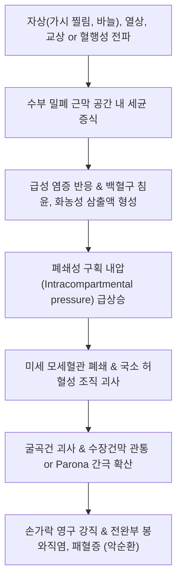

# 🩺 손 농양

> **핵심 3줄 요약 (Key Summary)**:
> - 📍 **병소 부위 & 해부·병태생리**: 수지 및 수장부의 폐쇄성 근막 구획(어구간극 [[Thenar Space]], 중수간극 [[Midpalmar Space]], 파로나 간극 [[Parona's Space]]) 및 굴곡건초 내에 세균(주로 황색포도상구균)이 침투하여 발생하는 급성 화농성 농양 질환(**Hand Abscess / Deep Hand Space Infection**).
> - 🚩 **전형적 임상 양상**: 손바닥이나 손가락의 극심한 박동성 박동통, 손바닥 정상 오목(Palmar concavity) 소실 및 팽륭, 손가락 굴곡건초염 시 카나벨 4대 징후([[Kanavel Signs]]), 발열 및 오한.
> - 🛠️ **핵심 검사 & 치료 전략**: 혈액 염증 수치(WBC, CRP, ESR) 및 수부 초음파/MRI; 급성기 형성된 농양은 **외과적 응급 절개배농술([[I&D]]) 및 정맥 항생제**가 1차 원칙; 한의학적 초기 미농기(未膿期) 청열해독 및 배농 후 육아 형성기 [[탁리소독음]](托裏消毒飮) 투약.
> - ⚠️ **응급 의뢰 레드플래그**: 손가락 굴곡건초염의 카나벨 4대 징후 양성(수지 괴사 위험); 손바닥 전체의 급격한 구획압 상승 및 전완부로의 감염 파급(Parona 간극 침범); 패혈증 징후(고열, 빈맥, 혈압 저하) 동반 시 수부외과/응급실 즉시 전원.

---

## 📌 목차
1. [질환 개요 & 해부학적 병태생리](#1-질환-개요--해부학적-병태생리)
2. [병태생리 메커니즘 & 생체역학적 악순환 네트워크](#2-병태생리-메커니즘--생체역학적-악순환-네트워크)
3. [임상 증상 & 이학적 검사(Physical Exam) 알고리즘](#3-임상-증상--이학적-검사physical-exam-알고리즘)
4. [감별 진단 매트릭스 (Differential Diagnosis)](#4-감별-진단-매트릭스-differential-diagnosis)
5. [한의 통합 치료 프로토콜 (침·약침·추나·한약)](#5-한의-통합-치료-프로토콜-침약침추나한약)
6. [양방 치료 & 병용·의뢰 기준 (Conventional Treatment & Referral)](#6-양방-치료--병용의뢰-기준-conventional-treatment--referral)
7. [재활 운동 & 생활습관 티칭 가이드](#7-재활-운동--생활습관-티칭-가이드)
8. [💡 사용자 진료실 핵심 필기 & 임상 노하우 (Melt-In 잔여 심화 집약)](#8--사용자-진료실-핵심-필기--임상-노하우-melt-in-잔여-심화-집약)
9. [출처 및 학술 참고 문헌 (References)](#9-출처-및-학술-참고-문헌-references)

---

![[손농양_04_임상_말단괴사.png|450]]
> [그림 §: ① 임상 소견 — 손끝 고름집의 말단 괴사] 원위지 말단이 검게 괴사되고 배농로가 열린 실제 증례 사진. 폐쇄공간 내 압력 상승으로 혈류가 차단되어 조직이 괴사한 상태로, 응급 절개·배농이 늦으면 골수염까지 진행한다. 출처: Open-i(NLM) · PMC5379111

![[손농양_05_임상_수지괴사.png|450]]
> [그림 §: ① 임상 소견 — 수지 말단부 괴사와 종창] 손끝이 부풀고 원위부가 검게 변한 증례 사진. 손끝 고름집(felon)이 진행해 국소 괴사에 이른 모습이다. 출처: Open-i(NLM) · PMC5379111

![[손농양_06_임상_수부종창.png|450]]
> [그림 §: ① 임상 소견 — 손등 종창과 발적] 손등과 손가락에 부종·발적이 퍼진 증례 사진. 감염이 건초를 따라 번지면 손 전체가 이렇게 붓는다. 출처: Open-i(NLM) · PMC5379111

## 1. 질환 개요 & 해부학적 병태생리

### 1) 수부 심부 근막 공간 (Deep Fascial Spaces of Hand)
손바닥은 두꺼운 수장건막(Palmar aponeurosis)으로 덮여 있으며, 심부에는 해부학적으로 독립된 밀폐 구획들이 존재함:
* **어구간극 (Thenar Space)**:
  * 제3중수골 외측, 내전근(Adductor pollicis) 전방에 위치. 엄지손가락과 시지의 굴곡건 및 표재성 혈관이 인접함.
* **중수간극 (Midpalmar Space)**:
  * 제3중수골 내측, 골간근 전방과 굴곡건 심부에 위치. 제3~5수지의 굴곡건초와 인접하며, 감염 시 손바닥 정상 중심 오목이 소실됨.
* **파로나 간극 (Parona's Space)**:
  * 손목 수근관 상방, 방형회내근(Pronator quadratus)과 심수지굴건(FDP) 사이의 전완부 심부 잠재 공간. 손바닥 감염이 건초를 타고 전완부로 확산되는 통로.
* **수지 굴곡건초 (Flexor Tendon Sheaths)**:
  * 제1지(엄지)의 요측 점액낭(Radial bursa)과 제5지(소지)의 척측 점액낭(Ulnar bursa)은 파로나 간극으로 연결되는 말굽형 농양(Horseshoe abscess)의 해부학적 경로를 제공함.

### 2) 질환의 정의 및 원인 미생물
* 손 농양은 손바닥의 심부 간극, 건초, 피하 조직에 발생하는 국소화된 고름 주머니(Pus collection)를 지칭함.
* **원인 미생물**:
  * **황색포도상구균 (Staphylococcus aureus, 약 50~70%)**: 메티실린 내성균(MRSA) 비중 증가.
  * **연쇄상구균 (Streptococcus pyogenes)**: 급격한 봉와직염 및 괴사성 확산 유발.
  * 동물/인간 교상 시: *Eikenella corrodens*, *Pasteurella multocida*.

---

![[손농양_03_해부_상지근육.jpg|450]]
> [그림 1: ① 해부 구조 — 상지 굴곡근과 건초] 손바닥에서 손가락으로 이어지는 굴곡건과 건초의 주행을 그린 해부 도판. 건초 내 감염(화농성 건초염)은 손 농양의 중증 형태다. 출처: File:Anatomy descriptive and surgical (Public domain)

## 2. 병태생리 메커니즘 & 생체역학적 악순환 네트워크

### 1) 밀폐 구획 내압 상승과 건 괴사
* 손의 근막 공간과 건초는 신축성이 없는 치밀 결합조직으로 둘러싸여 있어 소량의 삼출액 저류만으로도 내압이 급격히 상승함.
* 건초 내압이 모세혈관 관류압(약 30mmHg)을 초과하면 건의 영양 혈관(Vincula)이 폐쇄되어 불과 24~48시간 만에 굴곡건이 무혈관성 괴사를 일으켜 손가락 영구 기능 상실을 초래함.

### 2) 말굽형 농양 (Horseshoe Abscess) 확산 경로
* 엄지의 요측 활액낭과 소지의 척측 활액낭은 수근관 근위부에서 서로 통하거나 파로나 간극과 맞닿아 있음.
* 따라서 엄지손가락의 건초염이 손목을 거쳐 새끼손가락으로 U자 형태로 감염이 번져나가는 말굽형 농양이 형성될 수 있음.

---

## 3. 임상 증상 & 이학적 검사(Physical Exam) 알고리즘

### 1) 주요 임상 증상
* **격렬한 박동성 동통 (Throbbing Pain)**: 밤에 잠을 잘 수 없을 정도로 심장이 뛰듯 욱신거림.
* **손바닥 정상 형태 소실**: 중수간극 농양 시 손바닥의 중심 오목(Normal palmar concavity)이 불룩하게 솟아오름.
* **손등 부종 (Dorsal Edema)**: 손바닥 조직은 단단하여 부종이 상대적으로 느슨한 손등으로 몰리므로 손등이 빵빵하게 부어오름.

### 2) 진료실 핵심 이학적 검사 알고리즘
1. **화농성 굴곡건초염: 카나벨 4대 징후 ([[Kanavel Signs]]) — 필수 암기**:
   * ① **손가락의 대칭적 균일 부종 (Sausage digit)**.
   * ② **손가락의 반굴곡 자세 유지 (Slight flexion posture)**.
   * ③ **수동 신전 시 극심한 통증 (Pain on passive extension)** — 가장 민감한 징후!
   * ④ **굴곡건 주행부를 따른 전장 압통 (Tenderness over entire flexor sheath)**.
2. **파동 검사 (Fluctuation Test)**:
   * 두 손가락으로 환부 양끝을 촉진하여 액체 저류(고름)의 출렁거림 확인.
3. **혈액 및 영상의학적 검사**:
   * 일반 혈액 검사: WBC 백혈구 증가, 호중구 분율 상승, CRP 및 ESR 급증.
   * 수부 단순 X-ray: 연부조직 내 가스 음영(가스괴저 배제) 및 이물질(가시, 금속편) 유무 확인.

---

## 4. 감별 진단 매트릭스 (Differential Diagnosis)

| 질환명 | 주 병소 및 증상 특징 | 핵심 구별 포인트 | 필수 치료 차이점 |
| :--- | :--- | :--- | :--- |
| **손 심부 농양 (Hand Abscess)** | 어구간극, 중수간극, 수장부 심부 | 손바닥 오목 소실, 심부 파동감, 카나벨 징후 일부 | **응급 절개배농술(I&D)**, 정맥 항생제 |
| **화농성 굴곡건초염** | 수지 굴곡건 전장 주행부 | **카나벨 4대 징후 완벽 일치**, 수동 신전 비명 | 24시간 이내 응급 건초 카테터 배농 |
| **표저 ([[Felon]])** | 수지 원위 지두부(지문 부위) | 지두부 폐쇄 섬유격막 내 화농, 극심한 박동통 | 지두부 측방 절개배농 |
| **단순 봉와직염 ([[Cellulitis]])** | 피부 표재성 발적 및 열감 | 파동감 없음, 관절 가동 시 극심한 통증 없음 | 경구/정맥 항생제 보존 치료 (절개 불필요) |
| **급성 [[통풍]]성 관절염** | MP 또는 PIP 관절 국소 발적 | 외상력 없음, 요산 수치 상승, 편광현미경 결정 | 소염진통제, 콜키신 투약 (절개 금기) |

---

## 5. 한의 통합 치료 프로토콜 (침·약침·추나·한약)

> ⚠️ **원칙 고지**: 활동성 세균성 농양 형성기에는 **외과적 절개배농 및 항생제 투여가 절대적 1차 치료**임. 한의 치료는 농양 형성 전 초기 미농기(未膿期)의 소종(消腫) 또는 배농 수술 후 회복기(潰膿期)의 육아 재생 및 기능 회복에 적용함.

### 1) 침구 치료 (Acupuncture)
* **미농기(초기) 및 궤농기(회복기) 혈위**:
  * [[합곡혈]](LI4), [[곡지혈]](LI11): 대장경 청열해독, 전신 면역 조절.
  * [[팔사혈]](EX-UE9): 손가락 사이 림프 울혈 해소 및 국소 부종 배출.
  * [[외관혈]](TE5), [[지구혈]](TE6): 삼초경 경락 소통, 수부 열감 완화.
* **주의사항**: 활동성 농양 부위 직접 자침은 세균의 심부 파급 및 관절강 오염 위험으로 **절대 엄격 금기**. 반드시 환부에서 3~5cm 떨어진 원위부 자침 시행.

### 2) 외용 한약 세정 및 습포 (Herbal Soak)
* **청열해독약 외용 습포**:
  * 금은화, 포공영, 황련, 황백을 진하게 전탕한 미온 한약액에 환부를 하루 2~3회 침윤 세정하여 표재성 세균막 억제.

### 3) 변증별 맞춤 한약 처방 (Herbal Medicine)
* **열독치성 (熱毒熾盛) - 초기 미농기(未膿期)**:
  * 증상: 손바닥이 빨갛게 붓고 욱신거리며 통증이 심함, 고열, 변비, 설홍태황.
  * 처방: **[[오미소독음]](五味消毒飮)** 합 **[[황련해독탕]](黃連解毒湯)** 가감 (금은화, 야국화, 포공영, 지정, 연교).
* **기혈양허 / 농독탁리 (氣血兩虛 / 膿毒托裏) - 수술 배농 후 궤농기(潰膿期)**:
  * 증상: 농양 배농 후 상처가 잘 아물지 않고 맑은 진물이 지속됨, 빈혈, 만성 피로.
  * 처방: **[[탁리소독음]](托裏消毒飮)** 또는 **[[십전대보탕]](十全大補湯)** 가미 (황기, 당귀, 백출, 금은화).

---

## 6. 양방 치료 & 병용·의뢰 기준 (Conventional Treatment & Referral)

### 1) 응급 외과적 치료: 절개배농술 (Incision & Drainage, I&D)
* **적응증**:
  * 파동감이 확인된 모든 심부 농양.
  * 카나벨 징후가 확인된 화농성 굴곡건초염 (발병 24시간 이내 응급 수술).
* **수술 기법**:
  * 수장부 농양: 신경과 혈관 손상을 방지하기 위해 피부 절개선을 피부 주름선(Langer's line)과 평행하게 절개.
  * 굴곡건초염: 근위부와 원위부에 작은 절개를 넣고 카테터를 삽입하여 생리식염수로 지속 세척(Continuous closed irrigation).

### 2) 정맥 항생제 요법 (IV Antibiotics)
* 배양 검사 결과 전 경험적 항생제 즉시 투여:
  * Cefazolin 1~2g q8h IV + Vancomycin (MRSA 의심 시).
  * 혐기성균 의심 시 Ampicillin/Sulbactam 병용.

### 3) 양방·전문과 의뢰 기준 (Referral Criteria)
* **즉각 응급실 / 수부외과 전원 (Red Flags)**:
  * 카나벨 4대 징후 중 1개 이상 확인 시 ➔ **지체 없이 1시간 내 전원**.
  * 손바닥 중심부 파동감 및 고열 동반.
  * 24시간 이상의 경구 항생제 치료에도 발적과 부종이 팔뚝으로 급격히 타고 올라가는 경우.

---

## 7. 재활 운동 & 생활습관 티칭 가이드

### 1) 배농 후 조기 능동 운동의 절대적 중요성
* 굴곡건의 유착을 방지하기 위해 감염이 조절되고 통증이 허용되는 즉시(수술 후 2~3일째부터) 손가락 굴곡 및 신전 능동 운동 시작.

### 2) 상지 거상 (Elevation)
* 부종 감소를 위해 환측 손을 심장보다 높게 위치시키는 슬링 착용 및 베개 지지 교육.

### 3) 일상생활 티칭 수칙
* 상처 부위에 물이 닿지 않도록 철저한 방수 관리.
* 당뇨 환자는 혈당 관리를 철저히 하여 백혈구 식균 작용 정상화 유지.

---

## 8. 💡 사용자 진료실 핵심 필기 & 임상 노하우 (Melt-In 잔여 심화 집약)

### 1) 진료실에서 절대 침을 꽂지 말아야 하는 손
* 환자가 "손가락 끝에 가시가 찔렸는데 손가락 전체가 퉁퉁 붓고 너무 아파요"라며 내원했을 때,
* 손가락을 억지로 펴보았을 때 환자가 기겁을 하며 통증을 호소한다면(Kanavel sign 3번), 그것은 봉와직염이 아니라 **화농성 굴곡건초염**임.
* 여기에 침을 놓거나 부항을 뜨면 힘줄이 영구적으로 썩어 손가락을 절단해야 할 수도 있음. 즉시 "지금 대학병원 정형외과 응급실로 가셔서 고름을 빼야 손가락을 살립니다"라고 소견서를 써서 보내야 함.

### 2) 배농 수술 후 한의원의 역할: 탁리소독음의 기적
* 병원에서 절개배농을 하고 항생제를 다 맞고 퇴원했는데도 상처가 아물지 않고 새살이 돋지 않는 환자들에게,
* 황기 15g, 당귀 10g, 금은화 10g이 들어간 **탁리소독음(托裏消毒飮)**을 2주간 투약하면 거짓말처럼 맑은 진물이 멎고 붉은 육아조직이 차오르며 상처가 깨끗하게 봉합됨.

---

## 9. 출처 및 학술 참고 문헌 (References)

* Hand Infections Across Tissue Planes: A Pictorial Review. [PMID: 42495494]

* Kennedy CD, Lauder AS, Balfour GW. Deep space infections of the hand. Hand Clin. 2020;36(3):367-375.

* Osterman M, Draeger R, Stern P. Acute hand infections. J Hand Surg Am. 2014;39(8):1628-1635.

* Kanavel AB. Infections of the Hand: A Guide to the Surgical Treatment of Acute and Chronic Suppurative Processes in the Fingers, Hand, and Forearm. 7th ed. Philadelphia: Lea & Febiger; 1939.
