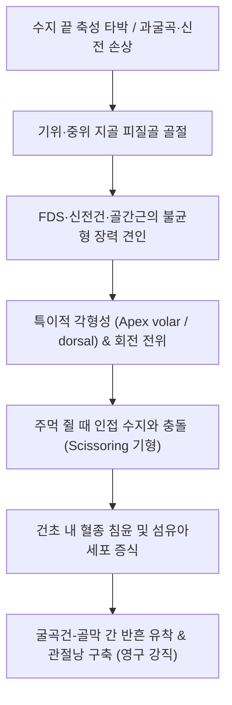

# 🩺 손가락 골절 (Phalangeal Fractures of the Hand)

> **핵심 3줄 요약 (Key Summary)**:
> - 📍 병소 부위 & 해부·병태생리: 손가락의 기위지골(Proximal phalanx) 및 중위지골(Middle phalanx) 골절로, 골간근·충양근 및 표재지굴근(FDS)·신전건의 견인력 차이에 의해 골절편이 전형적인 수장측 또는 배측 각형성을 이룬다.
> - 🚩 전형적 임상 양상: 해당 수지의 심한 국소 압통, 종창, 파악력 저하와 함께 주먹을 쥘 때 손가락이 인접 손가락과 겹치거나 뒤틀리는 회전 기형(Scissoring sign)이 관찰된다.
> - 🛠️ 핵심 검사 & 치료 전략: 손가락 전용 순수 측면(True lateral) 및 전후면(AP) X-ray로 각형성과 회전을 확인하며, 비전위 골절은 버디 테이핑(Buddy taping)이나 알루미늄 부목으로 3주 이내 고정 후 조기 관절운동을 시행한다.
> - ⚠️ 응급 의뢰 레드플래그: 회전 변형 미정복, 관절면 25% 이상 침범 골절, 개방성 골절, 수지 신경혈관 손상(모세혈관 재충혈 지연, 감각 마비) 시 즉시 수부외과 수술 의뢰.

---

## 📌 목차
1. [질환 개요 & 해부학적 병태생리](#1-질환-개요--해부학적-병태생리)
2. [병태생리 메커니즘 & 생체역학적 악순환 네트워크](#2-병태생리-메커니즘--생체역학적-악순환-네트워크)
3. [임상 증상 & 이학적 검사(Physical Exam) 알고리즘](#3-임상-증상--이학적-검사physical-exam-알고리즘)
4. [감별 진단 매트릭스 (Differential Diagnosis)](#4-감별-진단-매트릭스-differential-diagnosis)
5. [한의 통합 치료 프로토콜 (침·약침·추나·한약)](#5-한의-통합-치료-프로토콜-침약침추나한약)
6. [양방 치료 & 병용·의뢰 기준 (Conventional Treatment & Referral)](#6-양방-치료--병용의뢰-기준-conventional-treatment--referral)
7. [재활 운동 & 생활습관 티칭 가이드](#7-재활-운동--생활습관-티칭-가이드)
8. [💡 사용자 진료실 핵심 필기 & 임상 노하우 (Melt-In 잔여 심화 집약)](#8--사용자-진료실-핵심-필기--임상-노하우-melt-in-잔여-심화-집약)
9. [출처 및 학술 참고 문헌 (References)](#9-출처-및-학술-참고-문헌-references)

---

## 1. 질환 개요 & 해부학적 병태생리

손가락 골절(수지골 골절, Phalangeal fractures)은 손에서 발생하는 가장 흔한 골절 중 하나로, 수부 골절 전체의 절반 이상을 차지합니다. 주로 성인에서는 작업장 압궤 손상이나 기계 끼임, 스포츠 중 공에 손가락 끝이 강타당하는 수상 기전으로 호발합니다. 해부학적으로 엄지를 제외한 제2~5수지는 기위지골(Proximal phalanx), 중위지골(Middle phalanx), [[손끝 골절]]이 발생하는 원위지골(Distal phalanx)의 3개 분절로 이루어져 있습니다.

![[손골절_01_수부골격해부도해.png]]
> [그림 1: ① 병태생리·해부 — 손가락 지골(기위·중위·원위 지골) 및 관절 구조 도해]

지골은 두께가 얇은 원통형 골피질을 지니며, 배측으로는 얇은 신전건 복합체(Extensor apparatus), 수장측으로는 강한 활차(Pulley system: A1~A5)와 굴곡건(FDS, FDP)이 밀착되어 주행합니다. 이러한 해부학적 특성 때문에 골절 부위에 미세한 가골 형성이나 건막 유착이 발생하더라도 굴곡건의 활주가 저해되어 심각한 수지 굴곡 구축(Joint stiffness)이 초래됩니다.

특히 기위지골은 골간부 주위에 보호해 줄 근육 조직이 없어 외력에 취약하며, 골절 시 신전건 중앙대(Central slip)와 내재근건의 장력 불균형으로 인해 전형적인 **수장측 정점 각형성(Apex-volar angulation)**을 보입니다. 반면 중위지골은 표재지굴근건(FDS) 부착부를 기준으로 기저부 골절은 배측 각형성, 원위부 골절은 수장측 각형성을 나타냅니다.

---

## 2. 병태생리 메커니즘 & 생체역학적 악순환 네트워크

손가락 골절에서 골절편의 전위 방향은 순수하게 해당 뼈에 부착된 건과 근육의 생체역학적 장력 벡터에 의해 결정됩니다.

![[Lumbricales_hand_anatomy.png]]
> [그림 2: ② 관련 해부 구조물 — 수지 굴곡·신전을 조절하는 충양근(Lumbricales) 및 건막 해부도]

### 2.1 생체역학적 변형 기전
1. **기위지골 골절 (Proximal Phalanx Fracture)**:
   - 기저부 골편: 골간근(Interossei) 부착부에 의해 굴곡됨.
   - 원위부 골편: 신전건(Central slip)에 의해 신전 견인됨.
   - 결과: **수장측 볼록 각형성(Apex volar / 배측 함몰)**이 발생하여 신전건이 늘어나고 손가락 신전 지연(Extensor lag)이 유발됨.
2. **중위지골 골절 (Middle Phalanx Fracture)**:
   - FDS 건 부착부 근위부 골절: 중앙 신전건에 의해 기저 골편이 신전되어 **배측 볼록 각형성(Apex dorsal)** 발생.
   - FDS 건 부착부 원위부 골절: FDS 건이 기저 골편을 수장측으로 강하게 굴곡시켜 **수장측 볼록 각형성(Apex volar)** 발생.

---

## 3. 임상 증상 & 이학적 검사(Physical Exam) 알고리즘

### 3.1 임상 징후
- **국소 부종 및 방추상 비대 (Fusiform swelling)**: 골절 수지 전체가 소시지 모양으로 팽대됨.
- **가동역 소실**: 통증과 건 활주 제한으로 완전 굴곡 및 완전 신전 불가.
- **압통 및 반상출혈**: 골절선 주위의 극심한 압통과 수장측 피하 출혈.

![[손가락이탈징후_1단계_양수전방거상_수지내전_실사.png]]
> [그림 3: ② 진단 및 이학검사 — 양측 수지 전방 거상 및 능동 내전 시 회전 편위 평가 실사]

### 3.2 필수 이학적 검사
1. **회전 정렬 검사 (Rotational Alignment & Scissoring)**:
   - 환자에게 손가락을 가볍게 구부리게 하여 각 손가락의 축이 주상골 결절(Scaphoid tubercle)을 향하는지 점검.
   - 손톱 면들이 계단식 평행선을 이루는지 확인 (손톱의 회전 편위는 골절편 회전을 의미).
2. **건 일체성 검사 (Tendon Integrity Test)**:
   - FDS 검사: 인접 손가락들을 완전히 편 상태로 고정한 후 대상 수지의 PIP 관절 능동 굴곡 확인.
   - FDP 검사: PIP 관절을 편 상태로 고정하고 DIP 관절의 단독 굴곡 가능 여부 확인.
3. **수장판(Volar Plate) 및 측부인대 안정성 검사**:
   - PIP 관절 30도 굴곡위에서 외반/내반 스트레스 검사(측부인대) 및 과신전 저항(수장판 파열 동반 배제).

---

## 4. 감별 진단 매트릭스 (Differential Diagnosis)

| 감별 질환 | 손상 기전 | 핵심 신체 소견 | 방사선(X-ray) 특징 | 치료 방향 |
| :--- | :--- | :--- | :--- | :--- |
| **[[손가락 골절]] (기위/중위지골)** | 직접 타박, 회전력 | 골간부 압통, 축성 압박통, 각형성, Scissoring | 피질골 불연속, 골간단/간부 골절선 | 3주 이내 부목 고정 후 조기 운동 |
| **[[손끝 골절]] (원위지골)** | 문틈 압궤, 망치 타박 | 조하혈종, 손끝 팽창, DIP 신전 부전 | 원위지골 조면(Tuft) 파열, 건 견열편 | 조하혈종 배액, 스태프 부목 |
| **[[손바닥 골절]] (중수골)** | 주먹 가격, 직접 타격 | 수배부 종창, 너클 돌출 소실 | 중수골 경부/간부 골절 | 거터 부목 고정, 도수 정복 |
| **PIP 관절 수장판 견열 골절** | 손가락 과신전 손상 | PIP 관절 수장측 국소 압통, 부종 | 중위지골 기저부 수장측 소골편 (<20%) | 배측 차단 부목(Dorsal extension block) |
| **수지 측부인대 파열** | 측방 꺾임 손상 | 관절선 압통, 스트레스 시 20도 이상 외번 | 골절 음성 (외측 견열편 관찰 가능) | 버디 테이핑 4주 |

![[손가락골절_02_버디테이핑_인접수지고정.png]]
> [그림 4: ② 고정 치료 — 안정성 지골 골절의 인접 수지 동반 고정(Buddy Taping) 실사]

---

## 5. 한의 통합 치료 프로토콜 (침·약침·추나·한약)

손가락 골절의 한의 치료는 급성기 부종 경감 및 유합기 가골 형성 촉진, 그리고 깁스/부목 제거 후 건 유착 방지에 주안점을 둡니다.

![[수부질환_05_수부침치료실사_수지침.jpg]]
> [그림 5: ③ 한의 시술점 — 수지 골절 후기 순환 개선 및 관절 구축 완화를 위한 팔사혈 자침 실사]

### 5.1 침구 치료 (Acupuncture)
- **혈위**: [[팔사혈]](八邪, 골절 수지 양측 지간막), [[합곡]](LI4), [[외관]](TE5), [[곡지]](LI11), [[후계]](SI3), [[양지]](TE4), [[중저]](TE3).
- **시술법**: 골절선 직접 자극을 피하고 인접 지간막 및 배측 피하에 사자(斜刺)하여 국소 정맥 림프 순환을 촉진하고 통증 전달 물질(Substance P)을 억제.
- **전침 요법**: 2Hz 연속파를 인접 경혈에 15분간 통전하여 [[골절]] 치유 신호와 조골세포 활성을 촉진.

### 5.2 약침 치료 (Pharmacopuncture)
- **소염약침 / 중성어혈약침**: 건막 유착 및 지간 관절낭 비후 부위에 0.05~0.1cc씩 극소량 점자 주입.
- **[[봉약침]] / 황련해독탕 약침**: 급성 타박 염증 부종 완화 및 인대 회복 촉진, 국소 혈류 개선.

### 5.3 한약 치료 (Herbal Medicine)
- **초기 (1~2주, 활혈거어·소종지통)**:
  - [[당귀수산]](當歸鬚散) 가미방: 골절 수지의 피하 혈종 흡수 및 통증 완화.
- **중기 (3~5주, 접골속근·골질강화)**:
  - [[자연동]](自然銅, 산화 소성 수비), [[골쇄보]](骨碎補), [[속단]](續斷), [[우슬]](牛膝)을 배합한 접골산 또는 가미영선제통음: 가골 형성을 가속화하여 고정 기간 단축 유도.
- **후기 (6주 이후, 서근활락·구축방지)**:
  - [[독활기생탕]](獨活寄生湯) 또는 서경탕(舒經湯) 가미방: 관절 뻣뻣함 해소 및 미세 수지 굴신력 회복.

### 5.4 추나요법 및 수기 관절가동술 (Chuna Manual Therapy)
- **고정 해제 후 3주 차부터 적용**:
  - 지간관절 수동 견인 및 전후방 활주(Grade I~II Joint Play [[추나요법]]).
  - 지골 수장측 및 배측 건막에 대한 미세 근막이완술(MFR)로 건-골막 간 반흔 박리.

---

## 6. 양방 치료 & 병용·의뢰 기준 (Conventional Treatment & Referral)

### 6.1 보존적 치료 적응증 및 방법
- **적응증**: 비전위 골절, 회전 변형 없음, 단축 2mm 미만, 각형성 10도 미만의 안정성 골절. 고령 환자의 [[골다공증]] 동반 시 추가 골편 함몰 주의.
- **치료법**:
  - **버디 테이핑(Buddy Taping)**: 인접 정상 수지를 부목 삼아 반창고로 고정. 조기 능동 운동 가능(안정성 골절의 최우선 표준).
  - **알루미늄 폼 부목(Aluminum foam splint)**: MCP 70도 굴곡, PIP 완전 신전 위치에서 3주간 유지. 고정 기간이 3주를 초과하면 관절 강직 발생 위험이 급증하므로 엄격히 제한.

### 6.2 수술적 치료 적응증 (Surgical Indication)
- 회전 변형이 1도 이상 잔존하는 경우 (Scissoring).
- 도수 정복 후 유지되지 않는 불안정성 사상·나선상 골절.
- 관절면의 25% 이상을 침범하고 전위가 1mm 이상인 관절내 골절.
- 개방성 골절 및 신전/굴곡건 단열 동반 골절.
- 수술 방식: 경피적 K-강선 고정술(CRIF with K-wire) 또는 최소 절개 미니 플레이트 나사 고정술(ORIF with mini-plate).

### 6.3 의뢰 및 병용 판단
- **응급 의뢰**: [[요골신경]], [[정중신경]], [[척골신경]] 분지 손상(수지 신경 마비, 감각 소실), 수지 동맥 혈류 차단(창백, 냉감), 개방성 상처, 수부 [[구획증후군]] 의심 시 즉시 상급 병원 수부외과 전원.
- **한의 병용 시기**: 부목 고정 기간 중 부종 완화 및 골유합 촉진을 위해 한약·침 치료 병용, 고정 해제 직후 관절구축 및 [[반사성 교감신경 위축증]] 예방을 위한 한의 복합치료 진행.

---

## 7. 재활 운동 & 생활습관 티칭 가이드

손가락 골절의 치료 성패는 뼈가 붙는 것보다 **손가락이 완전히 구부러지고 펴지는가**에 달려 있습니다.

![[손가락골절_01_수지부목_알루미늄폼스플린트.jpg]]
> [그림 6: ④ 자가관리 — 알루미늄 폼 부목 착용 상태 및 PIP/DIP 조기 관절 가동 운동]

1. **3주 고정 원칙 준수**: 지골 골절은 3주면 임상적 유합(Clinical union)이 이루어지므로, 통증이 없으면 3주 차부터 주간에는 부목을 풀고 능동 관절운동을 시작합니다.
2. **능동 건 활주 운동 (Tendon Gliding Exercise)**:
   - Hook fist(갈고리 주먹: FDS/FDP 최대 활주).
   - Table top(탁자 손모양: 골간근 및 충양근 활주).
   - Straight fist & Full fist(완전 주먹).
   - 하루 5회, 매회 10회씩 부드럽게 반복.
3. **블록 운동 (Blocking Exercise)**:
   - 한 손으로 골절된 뼈의 바로 아래 분절을 잡고, 원위부 관절만 단독으로 구부렸다 펴는 훈련으로 유착된 굴곡건을 분리.

---

## 8. 💡 사용자 진료실 핵심 필기 & 임상 노하우 (Melt-In 잔여 심화 집약)

- **알루미늄 부목은 3주를 절대 넘기지 마라**: 손가락 지골 골절 환자에게 부목을 4~6주 이상 채워두면 뼈는 예쁘게 붙을지언정 PIP 관절이 영구적으로 굳어 평생 손가락이 펴지지도 구부러지지도 않는 장애를 겪게 된다. 3주가 되면 X-ray상 골절선이 보여도 임상적 안정성이 확보되므로 과감하게 버디 테이핑으로 전환하고 능동 운동을 시켜야 한다.
- **버디 테이핑 시 피부 짓무름 방지**: 손가락 2개를 테이프로 감아줄 때는 반드시 손가락 사이에 얇은 거즈 한 장을 끼워 넣어야 한다. 땀이 차서 피부가 짓무르거나 접촉성 피부염이 발생하는 것을 방지하는 필수 임상 팁이다.
- **회전 변형은 방사선 사진으로 못 본다**: X-ray에서 아무리 골절선이 일직선으로 잘 맞아 보여도 5도 정도 비틀려 돌아간 회전 기형은 방사선으로 판별할 수 없다. 오직 환자 손을 쥐어보게 하는 이학적 진찰(Scissoring 확인)로만 잡아낼 수 있으므로 의무기록에 반드시 회전 변형 유무를 기록해야 한다.

---

## 9. 출처 및 학술 참고 문헌 (References)

- Zhang, M., et al. (2024). A Systematic Review of Conservatively Managed Isolated Extra-Articular Proximal Phalanx Finger Fractures in Adults. *JPRAS Open*. 41:147-157. [PMID 38872867](https://pubmed.ncbi.nlm.nih.gov/38872867/)

- Wang, H., et al. (2024). Comparison of splinting immobilization and K-wire fixation in children with type II phalange neck fracture. *J Pediatr Orthop B*. 33(3):288-294. [PMID 37401488](https://pubmed.ncbi.nlm.nih.gov/37401488/)

- Chaljub, C., et al. (2026). Double Dislocation of Proximal and Distal Interphalangeal Joints With Volar Plate Avulsion Fracture in the Fifth Digit of an Elderly Female: Successful Conservative Management. *Cureus*. 18(3):e104512. [PMID 42725335](https://pubmed.ncbi.nlm.nih.gov/42725335/)
