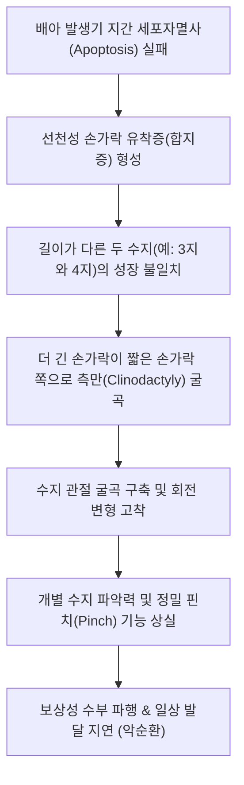

# 🩺 손가락 유착증

> **핵심 3줄 요약 (Key Summary)**:
> - 📍 **병소 부위 & 해부·병태생리**: 배아 발생 6~8주경 수지 간격 형성 과정에서 세포자멸사(Apoptosis)의 부전으로 인해 두 개 이상의 인접 손가락이 피부, 연조직 또는 골격으로 유착되어 분리되지 않는 선천성 기형(**합지증 / Syndactyly**). *(※ 외상·화상·건 봉합 후 발생하는 후천성 [[건 유착증]](Tendon Adhesion)과의 감별 요망)*.
> - 🚩 **전형적 임상 양상**: 출생 시부터 제3-4 수지(약 50%)를 중심으로 손가락이 물갈퀴처럼 붙어 있음, 손가락의 독립적 개별 굴곡·신전 장애, 성장에 따른 수지 변형 및 회전 변형 유발.
> - 🛠️ **핵심 검사 & 치료 전략**: 수부 방사선 단순 X-ray(단순형 vs 복합형 골 유합 감별); 양방 수술적 분리술(Z-성형술 및 지간 피판술, 전층 식피술 FTSG); 수술 후 비후성 반흔 억제를 위한 [[팔사혈]](EX-UE9) 자침, 소염약침 및 실리콘 젤 시트 압박 티칭.
> - ⚠️ **응급 의뢰 레드플래그**: 제1지간(엄지와 검지 사이) 유착으로 엄지의 대립 기능 및 파악력이 심각하게 저해되는 경우(생후 6개월 내 조기 수술 필요); 수술 후 말초 혈류 부전 및 청색증(괴사 위험).

---

## 📌 목차
1. [질환 개요 & 해부학적 병태생리](#1-질환-개요--해부학적-병태생리)
2. [병태생리 메커니즘 & 생체역학적 악순환 네트워크](#2-병태생리-메커니즘--생체역학적-악순환-네트워크)
3. [임상 증상 & 이학적 검사(Physical Exam) 알고리즘](#3-임상-증상--이학적-검사physical-exam-알고리즘)
4. [감별 진단 매트릭스 (Differential Diagnosis)](#4-감별-진단-매트릭스-differential-diagnosis)
5. [한의 통합 치료 프로토콜 (침·약침·추나·한약)](#5-한의-통합-치료-프로토콜-침약침추나한약)
6. [양방 치료 & 병용·의뢰 기준 (Conventional Treatment & Referral)](#6-양방-치료--병용의뢰-기준-conventional-treatment--referral)
7. [재활 운동 & 생활습관 티칭 가이드](#7-재활-운동--생활습관-티칭-가이드)
8. [💡 사용자 진료실 핵심 필기 & 임상 노하우 (Melt-In 잔여 심화 집약)](#8--사용자-진료실-핵심-필기--임상-노하우-melt-in-잔여-심화-집약)
9. [출처 및 학술 참고 문헌 (References)](#9-출처-및-학술-참고-문헌-references)

---

## 1. 질환 개요 & 해부학적 병태생리

### 1) 발생학적 기전과 해부학적 구조
* **배아 발생 과정 (Embryology)**:
  * 임신 6주경 원시 지판(Hand plate)에서 핑거 레이(Digital rays)가 형성된 후, 지간 조직의 예정된 프로그램 세포자멸사(Programmed cell death / Apoptosis)에 의해 손가락이 서로 분리됨.
  * BMP(Bone Morphogenetic Protein) 신호 전달 체계의 결함이나 유전적 이상으로 자멸사가 실패하면 손가락 간격이 분리되지 않고 영구 유착됨.
* **호발 부위**:
  * **제3수지간(중지와 약지 사이)**: 전체의 약 50%로 가장 흔함.
  * **제4수지간(약지와 소지 사이)**: 약 30%.
  * **제2수지간(검지와 중지 사이)**: 약 15%.
  * **제1수지간(엄지와 검지 사이)**: 약 5%로 드물지만 엄지 기능 상실로 인해 가장 조기 치료를 요함.
* **신경 및 혈관의 해부학적 변이**:
  * 인접한 두 손가락이 단일 고유수장수지동맥(Common digital artery)과 신경을 공유하거나 원위부에서 비정상적으로 분지하는 경우가 많아, 수술적 분리 시 편측 혈류 손상 위험에 유의해야 함.

### 2) 분류 체계 (Classification)
* **결합 조직 형태에 따른 분류**:
  * **단순 합지증 (Simple Syndactyly)**: 피부 및 연조직만 유착되어 있고 뼈는 정상적으로 분리된 형태.
  * **복합 합지증 (Complex Syndactyly)**: 지골(Phalanges)의 골 유합(Synostosis)이 동반된 형태.
  * **복잡 합지증 (Complicated Syndactyly)**: 부지증(Polydactyly), 건 기형, 신경혈관 이상 등이 복합 동반된 증후군성 형태(Apert 증후군, Poland 증후군 등).
* **유착 범위에 따른 분류**:
  * **완전형 (Complete)**: 손톱(Nail fold) 끝까지 완전히 유착된 형태.
  * **불완전형 (Incomplete)**: 지간 기저부 일부만 부분적으로 연결된 형태.

---

## 2. 병태생리 메커니즘 & 생체역학적 악순환 네트워크

### 1) 성장 불일치에 따른 2차 변형 (Tethering Effect)
* 손가락마다 고유한 성장 속도와 길이가 다름(제3지가 제4지나 제2지보다 김).
* 길이가 다른 손가락이 유착되어 있으면, 더 빨리 자라는 긴 손가락이 짧은 손가락에 묶여 활처럼 휘어지는 측만 변형(Angulation) 및 회전 변형(Rotational deformity)이 발생함.
* 따라서 손가락 길이 차이가 큰 제1지간(엄지-검지)과 제4지간(약지-소지)은 성장 변형을 막기 위해 조기 수술이 필수적임.

### 2) 후천성 건 유착증(Tendon Adhesion)과의 비교 병태
* 수지 굴곡건([[천지굴근]], [[심지굴근]]) 파열 봉합 후 건과 주변 활액건초(Tendon sheath) 사이의 염증성 피브린 침착과 섬유모세포 증식으로 발생하는 후천성 유착은 수동 ROM은 정상이나 능동 ROM이 차단되는 임상적 특징을 가짐.
* 손바닥 내재근인 [[충양근]] 및 [[골간근]]의 운동성 저하와 지간 신경인 [[정중신경]] 및 [[척골신경]] 지배 영역의 감각 변화를 동반 감별해야 함.

---

## 3. 임상 증상 & 이학적 검사(Physical Exam) 알고리즘

### 1) 주요 임상 증상
* **물갈퀴 손가락 외형**: 두 개 이상의 손가락이 피부막이나 단일 손톱으로 연결되어 있음.
* **독립 가동성 결여**: 한 손가락을 굽히면 붙어있는 옆 손가락이 원치 않게 강제로 함께 굽혀짐.
* **피부 및 손톱 기형**: 완전 합지증의 경우 공동 손톱(Synonychia)이 형성되어 손톱 골짜기에서 감염이나 염증 호발.

### 2) 진료실 핵심 이학적 검사 알고리즘
1. **유착 범위 및 유연성 평가**:
   * 유착이 지간 주름 어디까지 올라와 있는지 측정(기저부, PIP, DIP, 조상).
   * 피부의 여유도를 확인하고 손가락을 수동으로 벌려보아 당김 정도 평가.
2. **신경 및 혈류 검사 (Allen Test for Digits)**:
   * 수지 동맥의 박동 및 모세혈관 재충혈 시간(Capillary refill time, <2초) 확인.
3. **수부 단순 방사선 검사 (Hand AP/Lateral/Oblique)**:
   * 지골 간의 골성 연결 유무 확인(복합형 합지증 배제).
   * 관절의 정렬 이상 및 골격 변형, 이차성 [[관절염]] 유발 여부 확인.

---

![[손가락유착증_01_임상_선천성굴곡지.jpg|450]]
> [그림 1: ① 임상 소견 — 선천성 굴곡지(camptodactyly)] 손가락이 근위지관절에서 굽어진 채 펴지지 않는 실제 사진. 굴곡건의 단축이나 신전건 중앙건 결손으로 생기며, 관절 자체는 정상 구조인 것이 특징이다. 출처: File:Congenital kamptodaktyly.jpg (CC BY-SA 3.0) · Wikipedia 문서 이미지

## 4. 감별 진단 매트릭스 (Differential Diagnosis)

| 질환명 | 발생 기전 및 양상 | 핵심 구별 포인트 | 필수 감별 검사 / 치료 차이점 |
| :--- | :--- | :--- | :--- |
| **선천성 손가락 유착증 ([[합지증]])** | 발생기 세포자멸사 부전 | **선천적 물갈퀴 손가락 외형**, 골/피부 유합 | 수부 X-ray, 지간 분리술 및 식피술 |
| **후천성 [[수지 건 유착증]]** | 외상, 화상, 건 봉합 수술 후 반흔 | 외관상 손가락 분리 정상, **능동 굴곡/신전만 차단** | 초음파 건 활주 검사, 건 박리술(Tenolysis) |
| **[[다지증]](Polydactyly)** | 손가락 개수가 6개 이상 | 잉여 손가락 존재(모지 다지증, 소지 다지증) | 단순 X-ray, 잉여지 절제 및 재건술 |
| **선천성 수축륜 증후군 (Amniotic Band)** | 양막 띠에 의한 자궁 내 압박 | 손가락 둘레를 파고드는 깊은 고리 모양 홈, 원위부 절단 | 수축륜 절제 및 Z-성형술 |
| **[[화상 반흔 구축]]** | 심재성 화상 치유 후 비후성 반흔 | 과거 화상 병력, 두꺼운 반흔판으로 수지 굴곡 고착 | 흉터 구축 해제술, 전층 식피술 |

---

## 5. 한의 통합 치료 프로토콜 (침·약침·추나·한약)

> ⚠️ **원칙 고지**: 선천성 합지증의 근본 치료는 **외과적 지간 분리술(Surgical Release)이 유일**함. 한의 치료는 수술 전 조직 유연성 확보, 수술 후 발생하는 비후성 반흔 억제, 림프 부종 흡수, 지간 감각 및 관절 가동역 회복에 집중함.

### 1) 침구 치료 (Acupuncture)
* **국소 및 지간 혈위**:
  * [[팔사혈]](EX-UE9): 손가락 갈퀴 사이 함요처. 수술 후 지간 반흔 조직 연화 및 림프 순환 촉진.
  * [[십선혈]](EX-UE11): 손가락 끝 정혈. 말초 감각 신경 재생 촉진.
  * [[상양]](LI1), [[소택]](SI1): 수지 말단 경혈 순환 촉진.
  * [[합곡혈]](LI4), [[외관혈]](TE5): 수부 전반의 기혈 소통 및 부종 흡수.
* **자침 기법**:
  * 수술 흉터 주변에 0.16mm 미세 호침을 얕게 피내 사자하여 비후성 반흔의 교원질 재배열 유도.
  * 미세 저주파 전침(2Hz, 15분)으로 지간 신경의 감각 둔마 개선.

### 2) 약침 치료 (Pharmacopuncture)
* **약침 제제 선택**:
  * **신바로약침 / 중성어혈약침**: 수술 후 만성 피하 섬유화 및 단단해진 수술 자국 연화.
  * [[봉약침]]: 잔여 염증 및 조직 리모델링 촉진을 위해 저농도 미량 시술.
* **시술 방법**:
  * 흉터 구축선 외측 피하 결합조직에 30G 니들로 포인트당 0.05cc씩 소량 미세 주입.

### 3) 수기 추나 및 반흔 마사지 (Chuna & Scar Mobilization)
* **지간 웹 스페이스 신장 추나**:
  * 분리된 손가락 사이 지간 피판 부위를 부드럽게 원형으로 마사지하며 피부 신장성 유지.
* **관절 수동 가동술**:
  * 구축되었던 PIP 및 DIP 관절을 정상 가동역으로 점진적 신장.

### 4) 변증별 맞춤 한약 처방 (Herbal Medicine)
* **기체어혈 / 반흔구축 (氣滯瘀血 / 瘢痕拘攣) - 수술 후 회복기**:
  * 증상: 수술 흉터가 빨갛고 단단하게 솟아오름, 흉터 당김으로 손가락 펴기 제한.
  * 처방: **[[도홍사물탕]](桃紅四物湯)** 또는 **[[당귀수산]](當歸鬚散)** 가감 (단삼, 천궁, 지모, 계지, 몰약).
* **기혈양허 / 근맥위약 (氣血兩虛 / 筋脈萎弱) - 수지 발달 지연형**:
  * 증상: 손가락에 힘이 없고 성장이 더딤, 마른 체구.
  * 처방: **보중익기탕(補中益氣湯)** 또는 **[[육미지황탕]](六味地黃湯)** 가감 (녹용, 구기자).

---

## 6. 양방 치료 & 병용·의뢰 기준 (Conventional Treatment & Referral)

### 1) 수술적 지간 분리술 (Syndactyly Release)의 시기
* **원칙적인 수술 시기**:
  * **조기 수술 (생후 6~12개월)**: 엄지-검지(제1지간) 유착, 약지-소지(제4지간) 유착, 복합 골 유합 등 성장 불일치 변형 위험이 큰 경우.
  * **통상 수술 (만 1~2세 경)**: 중지-약지(제3지간)의 단순 합지증은 마취 위험이 낮아지고 해부학적 구조가 커지는 18~24개월경 시행.
* **인접 지간 동시 수술 금기 (One web space at a time)**:
  * 한 손가락의 양쪽을 한 번에 동시에 수술하면 양측 수지 동맥이 모두 손상되어 손가락이 괴사될 수 있으므로, 인접한 두 지간은 최소 3~6개월 간격을 두고 순차 수술함.

### 2) 수술 술식 (Surgical Technique)
* **Z-성형술 (Zig-zag Incision)**:
  * 일자형 절개는 직선형 반흔 구축(Linear scar contracture)을 유발하므로 지그재그 절개선 적용.
* **삼각형 배측 피판 (Dorsal Flap)**: 지간 기저부(Web space)의 경사를 재건.
* **전층 피부 이식 (Full-Thickness Skin Graft, FTSG)**: 서혜부(Groin) 등에서 피부를 채취하여 피부 결손 부위 피복.

### 3) 양방·전문과 의뢰 기준 (Referral Criteria)
* **소아 수부 성형외과 / 소아정형외과 즉시 의뢰**:
  * 출생 직후 합지증 확인 시 부모 상담 및 수술 로드맵 수립을 위해 100일 전후 조기 전원.
  * 수술 후 수지 끝 청색증이나 모세혈관 재충혈 지연 발생 시 응급실 즉시 의뢰.

---

## 7. 재활 운동 & 생활습관 티칭 가이드

### 1) 수술 후 실리콘 압박 및 스플린트 티칭
* **웹 스페이서(Web Spacer) 착용**:
  * 수술 후 지간이 다시 붙어 올라오는 웹 크립(Web creep)을 방지하기 위해 실리콘 폼이나 커스텀 스플린트를 최소 6개월~1년간 야간 착용.
* **실리콘 젤 시트(Silicone Gel Sheet)**: 비후성 흉터 예방을 위해 흉터 부위에 24시간 밀착 부착.

### 2) 능동 수지 개별화 훈련
* 물건 쥐기, 피아노 건반 누르기, 찰흙 주무르기 등을 통해 두 손가락이 따로 움직이는 뇌 신경학적 맵핑 훈련 지도.

---

## 8. 💡 사용자 진료실 핵심 필기 & 임상 노하우 (Melt-In 잔여 심화 집약)

### 1) 부모의 죄책감 완화와 수술 로드맵 상담
* 아이가 손가락이 붙어 태어나면 부모는 "임신 중 내가 무엇을 잘못했나"라며 극심한 자책감을 느낌.
* 진료실에서 "이것은 유전이나 산모의 잘못이 아니라 배아기 발생 과정에서 누구나 겪는 손가락 분리 단계의 일시적 정지일 뿐이며, 현대 수부 성형외과 수술로 정상 손가락과 다름없이 완벽히 분리될 수 있습니다"라고 안심시키고 적절한 수술 시기(돌 전후)를 가이드해주는 것이 1차 의료인의 핵심 역할임.

### 2) 수술 후 흉터 구축(Web Creep) 방지 팁
* 수술이 아무리 잘 되어도 아이가 자라면서 흉터가 오그라들어 물갈퀴가 다시 올라오는 'Web creep' 현상이 10~20%에서 발생함.
* 수술 후 실밥을 뽑은 직후부터 팔사혈 부위에 실리콘 압박 패드를 철저히 대어주고 도홍사물탕 계열 한약과 약침으로 반흔을 부드럽게 풀어주면 재수술률을 획기적으로 낮출 수 있음.

---

## 9. 출처 및 학술 참고 문헌 (References)

* Long-Term Patient-Centered Outcomes After Congenital Syndactyly Reconstruction: Aesthetic, Functional, and Psychosocial Assessment. [PMID: 42355982]

* Flatt AE. The Care of Congenital Hand Anomalies. 2nd ed. St. Louis: Quality Medical Publishing; 1994.

* Lumenta DB, Kitzinger HB, Beck H, Frey M. Long-term outcomes of web creep, scar quality, and function after simple syndactyly release in children. J Hand Surg Am. 2010;35(8):1323-1329.

* Goldfarb CA, Chia B, Manske PR. Web creep after syndactyly release. J Hand Surg Am. 2012;37(4):668-673.
