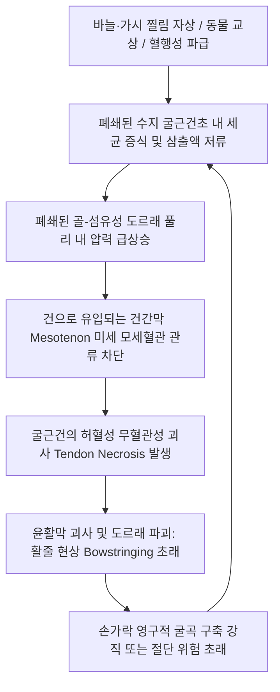

# 🖐️ [[손가락의 힘줄집 감염]] (Infectious Flexor Tenosynovitis / Suppurative Tenosynovitis)

> **핵심 3줄 요약 (Key Summary)**:
> - 📍 병소 부위 & 해부·병태생리: 손가락 굴근건(FDS, FDP)을 감싸고 있는 윤활성 건초(Synovial flexor tendon sheath) 내부로 자상, 교상, 이물 침입 또는 혈행성으로 황색포도상구균(Staphylococcus aureus) 등의 세균이 침투하여 급성 화농성 염증과 건초 내 압력 폭증을 초래하는 정형외과적 응급 질환.
> - 🚩 전형적 임상 양상 & 4대 징후: **카나벨 4대 징후(Kanavel's Four Cardinal Signs)**: ① 손가락의 대칭적 소시지 모양 균일한 종창(Sausage digit), ② 손가락이 가볍게 굴곡된 고정 자세(Flexed posture), ③ 굴근건초 전체 주행로를 따른 극심한 압통, ④ 손가락을 수동으로 신전시킬 때 발생하는 극심한 격통.
> - 🛠️ 핵심 감별 검사 & 한·양방 다각적 치료 전략: 카나벨 4대 징후 임상 진단, 염증 수치(ESR/CRP, WBC) 상승, 초음파 건초 내 삼출액 저류 확인. **한의원 단독 치료 절대 금기 질환** $\rightarrow$ 진단 즉시 정형외과/수부외과 응급 절개 배농(Incision & Drainage) 및 정맥 항생제 요법 의뢰. 한의 치료는 급성기 소퇴 후 잔여 구축 완화 및 건 유착 방지 재활로 한정.
> - ⚠️ 응급 의뢰 레드플래그: 건초 내 압력 상승으로 인한 건 허혈성 괴사(Tendon necrosis) 및 수부 심부 간극 감염(Palmar space infection) 확산 위험이 극히 높으므로, 발병 24~48시간 이내에 즉각적인 수부외과 응급 수술 및 항생제 치료 필수.

---

## 📌 목차
1. [질환 개요 & 해부학적 병태생리](#1-질환-개요--해부학적-병태생리)
2. [병태생리 메커니즘 & 생체역학적 악순환 네트워크](#2-병태생리-메커니즘--생체역학적-악순환-네트워크)
3. [임상 증상 & 이학적 검사(Physical Exam) 알고리즘](#3-임상-증상--이학적-검사physical-exam-알고리즘)
4. [감별 진단 매트릭스 (Differential Diagnosis)](#4-감별-진단-매트릭스-differential-diagnosis)
5. [한의 통합 치료 프로토콜 (침·약침·추나·한약)](#5-한의-통합-치료-프로토콜-침약침추나한약)
6. [양방 치료 & 병용·의뢰 기준 (Conventional Treatment & Referral)](#6-양방-치료--병용의뢰-기준-conventional-treatment--referral)
7. [재활 운동 & 생활습관 티칭 가이드](#7-재활-운동--생활습관-티칭-가이드)
8. [💡 사용자 진료실 핵심 필기 & 임상 노하우 (Melt-In 잔여 심화 집약)](#8--사용자-진료실-핵심-필기--임상-노하우-melt-in-잔여-심화-집약)
9. [출처 및 학술 참고 문헌 (References)](#9-출처-및-학술-참고-문헌-references)

---

## 1. 질환 개요 & 해부학적 병태생리

![[손가락힘줄집감염_01_화농성건초염_임상실사.jpg|480]]
> [그림 1: ① 질환/병태생리 임상 실사 — 화농성 굴근건초염 환부] 감염된 수지 전체가 소시지 모양으로 붉게 붓고(Sausage digit) 가볍게 굴곡된 자세로 고정된 급성 화농성 건초염 소견.

* **질환 정의 및 개념**:
  * 손가락의 힘줄집 감염(Infectious Flexor Tenosynovitis, 화농성 굴근건초염)은 수지 굴근건을 둘러싼 폐쇄된 윤활건초 내에 세균이 증식하여 고름(Pus)이 차고 조직 압력이 급상승하는 급성 감염성 질환이다.
  * 조기에 적절한 외과적 감압과 항생제 치료가 이루어지지 않으면 건 실질의 괴사, 영구적 수지 강직, 파골세포 활성화에 의한 골수염, 및 패혈증으로 진행될 수 있는 수부 영역의 대표적 외과 응급 질환이다([Mehta P, 2024](https://pubmed.ncbi.nlm.nih.gov/38147700/)).
* **해부학적 건초 구획과 감염 확산 경로**:
  * **폐쇄된 굴근건초(Flexor Tendon Sheaths)**:
    * 제2, 3, 4수지 건초는 각각 독립된 폐쇄 공간(A1 도르래 근위부에서 DIP 관절 부착부까지)을 형성함.
  * **말발굽형 농양 (Horseshoe Abscess) 형성 기전**:
    * **제1수지(엄지)** 굴근초(FPL)는 전완의 요측 활액낭(Radial bursa)과 연속됨.
    * **제5수지(새끼손가락)** 굴근초는 전완의 척골 활액낭(Ulnar bursa) 및 수근관과 연속됨.
    * 약 50~80%의 인구에서 요측 활액낭과 척골 활액낭이 파로나 간극(Parona's space)에서 서로 소통하므로, **엄지나 새끼손가락의 건초염은 반대편으로 교차 파급되어 전완 전체를 침범하는 말발굽형 농양**을 형성함([Mamane W, 2018](https://pubmed.ncbi.nlm.nih.gov/29881224/)).
* **주요 원인균 및 감염 경로**:
  * 가장 흔한 원인균: **황색포도상구균(Staphylococcus aureus, 40~70%)**, 메티실린 내성 포도상구균(MRSA), 연쇄상구균(Streptococcus spp.).
  * 고양이/개 교상: *Pasteurella multocida*.
  * 수중 오염 외상: *Mycobacterium marinum*, *Vibrio vulnificus*.

---

## 2. 병태생리 메커니즘 & 생체역학적 악순환 네트워크

![[손목굴곡건초염_01_굴곡건염부종_실사.jpg|480]]
> [그림 2: ② 관련 해부 구조물 — 수근 및 수지 굴근건초 해부도] 굴근건을 싸고 있는 폐쇄성 윤활막과 건초 내 고압 상태가 건 관류 모세혈관에 미치는 압박 기전.

### 1) 폐쇄 공간 증후군 (Closed-Compartment Syndrome)
* 윤활건초는 신축성이 없는 단단한 윤상 도르래(Annular pulleys: A1~A5)로 뼈에 밀착되어 있다.
* 건초 내부에 세균성 삼출액이 차면 불과 수 시간 만에 내압이 모세혈관 관류압(30 mmHg)을 훌쩍 넘어 100 mmHg 이상으로 치솟는다.
* 이로 인해 건에 영양을 공급하는 미세 혈관인 건간막(Mesotenon)과 빈쿨라(Vincula)가 차단되어 **건 섬유가 녹아내리는 비가역적 괴사**가 급속히 진행된다.

---

## 3. 임상 증상 & 이학적 검사(Physical Exam) 알고리즘

![[cozens_test_step2_wrist_extension_resistance.jpg|480]]
> [그림 3: ③ 이학적 검사 — 손가락 수동 신전통 검사(Kanavel Sign)] 환자의 손가락 끝을 잡고 아주 살짝 뒤로 젖힐 때 건초 전체에 걸쳐 유발되는 극심한 전격성 통증 확인.

### 1) 카나벨 4대 징후 (Kanavel's Four Cardinal Signs, 진단 기준)
1. **대칭적 균일 부종 (Symmetrical Enlargement)**: 손가락 전체가 소시지처럼 굵고 팽팽하게 부어오름 (Sausage digit).
2. **굴곡위 고정 자세 (Flexed Posture)**: 건초 내 압력을 최소화하기 위해 환자 스스로 손가락을 가볍게 구부린 채 고정하고 펴지 못함.
3. **건초 전체 압통 (Tenderness along Sheath)**: 통증이 특정 관절에 국한되지 않고, A1 도르래부터 원위 종지부까지 건초 전체 주행로를 따라 압통이 존재함.
4. **수동 신전 시 극통 (Pain on Passive Extension)**: **가장 민감하고 조기에 나타나는 핵심 징후(Earliest & Most sensitive sign)**. 검사자가 손가락을 살짝만 수동으로 펴려고 해도 환자가 소리를 지를 정도의 극통 발생.

### 2) 혈액 및 영상 검사
* **혈액 검사**: 백혈구(WBC) 증가, ESR 및 CRP 현저한 상승.
* **근골격계 초음파**: 굴근건초 내 저에코성 삼출액 저류, 활액막 비후 및 파워도플러 혈류 증가 신호.

---

## 4. 감별 진단 매트릭스 (Differential Diagnosis)

| 감별 질환 | 주요 병소 | 카나벨 4대 징후 여부 | 결정적 감별 포인트 |
| :--- | :--- | :--- | :--- |
| **[[손가락의 힘줄집 감염]]** | 수지 굴근건초 내부 | **4대 징후 모두 양성** | 수동 신전 시 극통, 건초 전체 압통, 외과 응급 |
| **단순 봉와직염 (Cellulitis)** | 피하 연부조직 | **수동 신전통 없음** | 부종이 손등(Dorsal)에 치우침, 능동 굴신 가능 |
| **수지 화농성 관절염** | PIP 또는 DIP 관절강 | 관절 국소 압통 | 관절 틈새에만 부종 국한, 건초 주행로 압통 없음 |
| **생인손 (Felon)** | 손가락 끝 복측 지두강(Pulp) | 지두부(Pulp)에 국한 | 손가락 끝마디만 팽팽하게 붓고 박동성 통증 |
| **급성 통풍성 관절염** | 단일 관절(MCP/PIP) | 수동 신전통 경미 | 요산 수치 상승, 통풍 결절 병력, 관절 천자 소견 |

---

## 5. 한의 통합 치료 프로토콜 (침·약침·추나·한약)

![[수부질환_05_수부침치료실사_수지침.jpg|480]]
> [그림 4: ④ 회복기 한의 재활 술기 실사 — 수부 관절 유착 방지 침구 치료] 급성 감염 완치 판정 후 잔여 건초 유착 및 관절 구축을 회복시키는 아급성/만성기 침구 치료.

### 🚨 [치료 원칙 경고]: 한의 단독 치료 절대 금기 (Contraindication)
* **급성기 화농성 굴근건초염 환자에게 한의 침, 약침, 뜸, 부항 치료를 단독 적용하는 것은 건 괴사와 패혈증을 초래하는 절대 금기 사항이다.**
* 한의 치료는 반드시 **양방 정형외과에서 수술적 배농 및 항생제 치료가 완전히 종료되어 감염이 완치된 후**, 건 유착과 관절 강직을 해결하는 **후유증 회복기 재활**에 국한된다.

### 1) 감염 완치 후(아급성기·만성기) 침구 재활 프로토콜
* **선혈 혈위**:
  * 손가락 구축 부위: [[팔사]](EX-UE9), [[합곡]](LI4), [[중저]](TE3), [[외관]](TE5), [[대릉]](PC7).
* **온침 및 전침 요법**:
  * 2Hz 저주파 전침을 팔사혈에 통전하여 수술 후 반흔 조직(Scar tissue)을 연화시키고 건 활주 능력을 회복.

### 2) 회복기 약침 및 한약 요법
* **약침 치료**: 감염이 완전히 소퇴된 후 잔여 섬유화 완화를 위해 **신바로 약침** 또는 **자하거 약침**을 건 주위 반흔 부위에 0.5cc 미량 주입.
* **한약물 요법**:
  * 수술 후 기혈 부족 및 건 구축: [[보양환오탕]](補陽還五湯), [[소경활혈탕]](疎經活血湯) 가미.
  * 잔여 부종 및 순환 장애: [[당귀사역탕]](當歸四逆湯) 합 [[오적산]](五積散).

---

## 6. 양방 치료 & 병용·의뢰 기준 (Conventional Treatment & Referral)

* **응급 입원 및 정맥 항생제 요법 (IV Antibiotics)**:
  * 발병 24시간 이내의 극초기 단계(Michon Stage 1)를 제외하고는 원칙적으로 입원 후 즉각적인 광범위 정맥 항생제(Vancomycin + Cefepime 또는 Ampicillin/Sulbactam) 투여([Mehta P, 2024](https://pubmed.ncbi.nlm.nih.gov/38147700/)).
* **수술적 절개 및 카테터 세척 배농술 (Incision & Catheter Irrigation)**:
  * A1 도르래 부위와 DIP 관절 원위부에 소절개를 넣고 건초 내로 소아용 튜브(16~18G 카테터)를 거치하여 생리식염수로 지속 세척(Continuous closed irrigation) 시행([Mamane W, 2018](https://pubmed.ncbi.nlm.nih.gov/29881224/)).
  * 조직 괴사가 심한 경우(Michon Stage 3) 건초 전 층을 개방하는 광범위 절개 배농 및 변연 절제술 시행.
* **정형외과/수부외과 즉시 의뢰 기준 (Immediate Referral)**:
  * **카나벨 징후 중 단 1개라도 명확히 의심되는 환자는 진료실에서 지체 없이 상급병원 응급실 또는 수부외과 전문병원으로 즉시 전원 의뢰서를 발급한다.**

---

## 7. 재활 운동 & 생활습관 티칭 가이드

![[손목과사용증후군_07_손목신전스트레칭.jpg|480]]
> [그림 5: ⑤ 회복기 재활 운동 — 수지 굴근건 스트레칭] 배농술 완치 후 관절 구축을 방지하기 위한 부드러운 수동 신전 스트레칭.

![[손목과사용증후군_07_수부스트레칭.jpg|480]]
> [그림 6: ⑥ 회복기 재활 운동 — 수지 건 글라이딩 운동] 수술 후 건 유착을 방지하기 위한 단계별 능동 관절 굴신 운동.

### 1) 수술 후 조기 가동 운동 (Early Active Motion)
* 감염이 조절된 수술 후 48~72시간부터 통증이 없는 범위 내에서 능동 건 글라이딩 운동(Hook fist, Full fist)을 조기 개시하여 건 유착을 방지.
* 부목 고정은 1~2주를 넘기지 않도록 관리.

### 2) 상처 관리 및 일상 티칭
* 배농 상처 부위 무균 드레싱 유지 및 방수 테이핑.
* 당뇨 환자의 경우 철저한 혈당 조절(HbA1c <7.0%) 티칭.

---

## 8. 💡 사용자 진료실 핵심 필기 & 임상 노하우 (Melt-In 잔여 심화 집약)

> [!TIP] **진료실 임상 진단 & 의뢰 노하우**
> 1. **"손가락 펴보세요" 하나로 끝나는 카나벨 신전통**:
>    - 손가락을 다치거나 찔린 환자가 왔을 때, 환자의 손가락 끝을 잡고 아주 살짝 뒤로 젖혀보라. 환자가 기겁을 하며 손을 뒤로 빼고 격통을 호소한다면 다른 검사 할 필요도 없이 100% 화농성 굴근건초염이다. 이 환자를 침 놓겠다고 붙잡고 있으면 24시간 안에 힘줄이 녹아 손가락을 영구적으로 못 쓰게 된다([Mehta P, 2024](https://pubmed.ncbi.nlm.nih.gov/38147700/)).
> 2. **봉와직염(Cellulitis)과의 결정적 차이점 숙지**:
>    - 피부가 붉게 부어서 봉와직염처럼 보여도, 봉와직염 환자는 손가락을 굽히고 펴는 데 큰 고통이 없다. 반면 화농성 건초염 환자는 손가락을 펴는 순간 건초 전체가 찢어지는 듯한 통증을 느낀다. 이 차이점을 모르면 단순 피부염으로 항생제 연고만 바르다가 타이밍을 놓친다.
> 3. **진료 의뢰서 작성 시 팁**:
>    - 환자에게 "정형외과 응급실로 가셔야 합니다"라고만 하면 환자가 대수롭지 않게 여기고 집에 갔다가 다음날 패혈증으로 실려 오는 경우가 있다. 의뢰서에 **"Infectious flexor tenosynovitis (Kanavel sign positive) 의심, 응급 수술적 배농 요망"**이라고 명기하고, 환자에게 "힘줄 속에 고름이 차서 당장 오늘 밤 수술하지 않으면 힘줄이 녹아 손가락을 잘라내야 할 수도 있다"고 엄중히 경고하여 즉시 대학병원 응급실로 직행하도록 지도해야 한다.

---

## 9. 출처 및 학술 참고 문헌 (References)

1. Mehta P, et al. High risk and low prevalence diseases: Flexor tenosynovitis. *Am J Emerg Med*. 2024;77:150-156. [PMID: 38147700](https://pubmed.ncbi.nlm.nih.gov/38147700/)
   - [연구 요약]: 수부 영역의 고위험 응급 질환인 화농성 굴근건초염의 카나벨 4대 징후 진단 민감도, 초기 오진 위험 요인 및 응급 감압술의 골든타임 분석.
2. Mamane W, et al. Infectious flexor hand tenosynovitis: State of knowledge. A study of 120 cases. *J Orthop*. 2018;15(2):642-646. [PMID: 29881224](https://pubmed.ncbi.nlm.nih.gov/29881224/)
   - [연구 요약]: 화농성 수지 건초염 120례 임상 분석으로 원인균 분포, Michon 병기별 수술적 카테터 세척 배농술의 유효성 및 후유증 발생률 고찰.
3. Kennedy CD, et al. Flexor tendon sheath infections of the hand. *J Am Acad Orthop Surg*. 2012;20(6):373-382. [PMID: 22661567](https://pubmed.ncbi.nlm.nih.gov/22661567/)
   - [연구 요약]: 미국정형외과학회(AAOS) 수지 굴근건초 감염 임상 지침으로 해부학적 파로나 간극 파급 경로, 미생물학적 특성 및 단계별 외과적 중재 프로토콜 정리.
