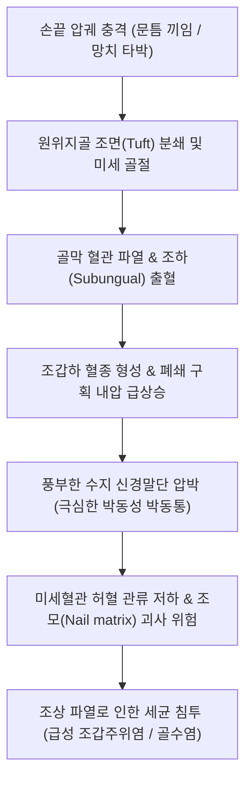

# 🩺 손끝 골절 (Distal Phalanx & Fingertip Fractures)

> **핵심 3줄 요약 (Key Summary)**:
> - 📍 병소 부위 & 해부·병태생리: 손가락 가장 끝 분절인 [[원위지골]](Distal phalanx)의 골절로, 문틈 끼임이나 망치 타박 등 압궤 손상에 의한 지골 조면(Tuft) 골절과 신전건 견열에 의한 골성 말렛 핑거(Bony mallet finger)가 대표적이다.
> - 🚩 전형적 임상 양상: 손끝의 극심한 박동성 통증, 연부조직 팽창, 조하혈종(Subungual hematoma), 원위지절관절(DIP)의 능동 신전 불능(DIP extensor lag)이 나타난다.
> - 🛠️ 핵심 검사 & 치료 전략: 손가락 전후면 및 순수 측면 X-ray로 관절 침범 여부와 조면 분쇄를 평가하며, 조하혈종이 조갑 면적의 50%를 넘고 통증이 심하면 천공배액술(Trephination)을 시행하고 DIP 부목을 적용한다.
> - ⚠️ 응급 의뢰 레드플래그: 소아의 손톱 기저부 파열을 동반한 시모어 골절(Seymour fracture, 개방성 골단판 골절로 골수염 위험 극상), 원위부 혈류 차단, 관절면 30% 이상 침범 시 즉시 수부외과 응급 전원.

---

## 📌 목차
1. [질환 개요 & 해부학적 병태생리](#1-질환-개요--해부학적-병태생리)
2. [병태생리 메커니즘 & 생체역학적 악순환 네트워크](#2-병태생리-메커니즘--생체역학적-악순환-네트워크)
3. [임상 증상 & 이학적 검사(Physical Exam) 알고리즘](#3-임상-증상--이학적-검사physical-exam-알고리즘)
4. [감별 진단 매트릭스 (Differential Diagnosis)](#4-감별-진단-매트릭스-differential-diagnosis)
5. [한의 통합 치료 프로토콜 (침·약침·추나·한약)](#5-한의-통합-치료-프로토콜-침약침추나한약)
6. [양방 치료 & 병용·의뢰 기준 (Conventional Treatment & Referral)](#6-양방-치료--병용의뢰-기준-conventional-treatment--referral)
7. [재활 운동 & 생활습관 티칭 가이드](#7-재활-운동--생활습관-티칭-가이드)
8. [💡 사용자 진료실 핵심 필기 & 임상 노하우 (Melt-In 잔여 심화 집약)](#8--사용자-진료실-핵심-필기--임상-노하우-melt-in-잔여-심화-집약)
9. [출처 및 학술 참고 문헌 (References)](#9-출처-및-학술-참고-문헌-references)

---

## 1. 질환 개요 & 해부학적 병태생리

손끝 골절(원위지골 골절, Distal phalanx fracture)은 수부 골절 중 가장 빈번하게 응급실과 1차 진료실을 찾는 손상입니다. 성인에서는 문틈 끼임, 무거운 물체에 의한 압궤 손상(Crush injury), 목공 및 공구 작업 중 망치 타박으로 호발하며, 스포츠 활동 중 날아오는 공에 손끝을 정면으로 맞아 발생하는 신전건 견열 골절도 흔합니다.

![[손끝골절_01_말렛골절_원위지골견열_Xray.jpg]]
> [그림 1: ① 병태생리·방사선 — 원위지골 기저부 배측의 신전건 견열 골절(골성 말렛 핑거) 측면 X-ray]

해부학적으로 원위지골은 크게 세 부위로 나뉩니다:
1. **지골 조면(Tuft)**: 손끝 지문 부위의 주걱 모양 확장부로, 두꺼운 섬유성 격막(Fibrous septa)에 의해 손가락 패드 피부와 조상(Nail bed)에 단단히 고정되어 있습니다. 압궤 손상 시 분쇄 골절이 호발하나 주변 격막이 골편을 잡아주어 전위는 심하지 않습니다.
2. **원위지골 간부(Shaft)**: 횡상 또는 사상 골절이 발생하며, 조하혈종과 함께 골편 전위가 유발될 수 있습니다.
3. **원위지골 기저부(Base, 관절내)**: 배측에는 종말 신전건(Terminal extensor tendon)이, 수장측에는 심지굴근건(FDP)이 부착됩니다. 배측 견열 골절은 **골성 말렛 핑거(Bony mallet finger)**를 형성하고, 수장측 견열 골절은 **저지 핑거(Jersey finger)**를 초래합니다.

또한 원위지골 배측은 조모(Nail matrix) 및 조상(Nail bed)과 1mm 미만의 극히 얇은 연부조직으로 밀착되어 있어, 손끝의 폐쇄성 골절이라도 조상 파열이 동반되면 임상적으로 **개방성 골절(Open fracture)**에 준하여 치료해야 합니다.

---

## 2. 병태생리 메커니즘 & 생체역학적 악순환 네트워크

손끝의 손가락 패드(Pulp)는 수많은 미세 신경 종말(메르켈 세포, 마이스너 소체, 파치니 소체)과 풍부한 동정맥 문합망(Glomus body)이 밀집된 폐쇄된 구획(Closed compartment)입니다.

![[손바닥_손등_피부신경_분포도_Gray812.png]]
> [그림 2: ② 관련 해부 구조물 — 손끝의 조상 혈관망 및 수지 고유신경 종말 해부도]

손끝 압궤 손상 후 발생하는 병태생리 악순환은 다음과 같습니다:

특히 소아에서는 골단판이 아직 닫히지 않은 상태에서 손끝이 굴곡력에 의해 끼일 때, 조모 기저부가 골단판 골절선 사이로 말려 들어가 끼이는 **시모어 골절(Seymour fracture)**이 발생합니다. 이는 외관상 단순한 말렛 핑거처럼 보이지만 실제로는 손톱 뿌리가 탈구된 고위험 개방성 Salter-Harris I/II형 골절로, 조기 발견하지 못하면 화농성 [[골수염]]과 영구적 조갑 기형을 초래합니다.

---

## 3. 임상 증상 & 이학적 검사(Physical Exam) 알고리즘

### 3.1 주요 임상 징후
- **박동성 극통 (Throbbing pain)**: 심장 박동에 맞춰 손끝이 터질 것 같은 극심한 통증.
- **조하혈종 (Subungual Hematoma)**: 손톱 밑에 검붉거나 보라색의 혈액이 고임.
- **손끝 팽창 및 긴장 (Tense pulp)**: 지두 연부조직이 팽팽하게 부풀어 오름.
- **DIP 관절 신전 지연 (Extensor Lag)**: 말렛 골절 동반 시 환자가 원위지절을 스스로 펴지 못하고 20~40도 구부러진 상태로 처짐.

![[손가락힘줄집감염_01_화농성건초염_임상실사.jpg]]
> [그림 3: ② 진단 및 합병증 감별 — 손끝 외상 후 세균 감염으로 인한 조갑주위염 및 농포 감별 실사]

### 3.2 진찰 및 평가 단계
1. **조상 손상 스크리닝 (Nail Bed Inspection)**:
   - 혈종 크기가 손톱 면적의 50% 이상인지 확인.
   - 손톱 테두리(Eponychium) 및 조갑주름에 열창이나 손톱 뿌리 탈구가 있는지 세밀히 촉진.
2. **DIP 능동/수동 관절가동 검사**:
   - 수동적으로는 DIP 관절이 완전히 펴지나 능동적으로 펴지 못하면 신전건 손상(Mallet finger) 확진.
   - DIP 관절의 능동 굴곡이 불가능하면 FDP 건 견열(Jersey finger) 의심.
3. **수지 신경 2점 식별능(Two-point discrimination)**:
   - 손끝 양측 패드의 감각을 캘리퍼나 클립으로 측정하여 6mm 이하인지 확인(수지신경 손상 배제).

---

## 4. 감별 진단 매트릭스 (Differential Diagnosis)

| 감별 질환 | 호발 기전 | 주요 신체 소견 | X-ray 소견 | 핵심 치료 전략 |
| :--- | :--- | :--- | :--- | :--- |
| **[[손끝 골절]] (Tuft Fx)** | 문틈 압궤 손상, 타박 | 지두 팽창, 조하혈종, 국소 압통 | 원위지골 조면 성상 분쇄 골절 | 알루미늄 보호 부목 2~3주, 혈종 배액 |
| **골성 말렛 핑거 (Bony Mallet)** | 날아오는 공에 손끝 강타 | DIP 관절 능동 신전 불능, 배측 압통 | 원위지골 기저부 배측 삼각 골편 | DIP 과신전 스택 부목(Stack splint) 6~8주 |
| **저지 핑거 (Jersey Finger)** | 럭비/유도 경기 중 옷깃 파지 | DIP 관절 능동 굴곡 불능, 수장측 압통 | 원위지골 수장측 견열편 (FDP 견인) | 조기 수술적 건 봉합 및 골편 고정 |
| **시모어 골절 (Seymour Fx)** | 소아 손끝 과굴곡 압궤 | 손톱 기저부 아탈구, 가성 말렛 변형 | 원위지골 골단판(Salter I/II) 골절선 | 응급 세척, 조모 정복, 항생제 투여 |
| **단순 조하혈종** | 경미한 손끝 타박 | 손톱 밑 혈종, 골절 부위 압통 경미 | 원위지골 피질골 완전 정상 | 50% 이상 시 천공배액술 |

![[손끝골절_01_말렛골절_원위지골견열_Xray.jpg]]
> [그림 4: ① 방사선 감별 — 단순 조면 골절과 감별되는 관절내 말렛 골절 측면 X-ray]

---

## 5. 한의 통합 치료 프로토콜 (침·약침·추나·한약)

손끝은 기혈(氣血)의 순환이 끝나는 십이정혈(十二井穴)이 위치한 부위로, 골절 초기 어혈 배출과 혈종 압력 완화, 후기 신경통 및 감각 과민 완화에 한의 치료가 탁월한 효과를 발휘합니다.

![[수부질환_05_수부침치료실사_수지침.jpg]]
> [그림 5: ③ 한의 시술점 — 손끝 혈종 감압 및 미세 순환 촉진을 위한 정혈 점자출혈 및 팔사혈 자침 실사]

### 5.1 침구 치료 및 점자출혈 (Acupuncture & Bloodletting)
- **정혈 점자출혈법 (井穴 點刺出血)**:
  - 손끝 골절 후 조하혈종 및 연부조직 내압이 극심하여 박동통이 심할 때, 손상된 수지의 정혈([[소상]] LU11, [[상양]] LI1, [[중충]] PC9, [[관충]] TE1, [[소택]] SI1, [[소충]] HT9) 및 십선혈(十宣穴)을 삼릉침으로 점자하여 3~5방울 어혈을 배출.
  - 내압 급강하로 즉각적인 통증 경감 및 모세혈관 순환 재개.
- **원위 및 인접 취혈**:
  - [[팔사혈]](八邪), [[합곡]](LI4), [[외관]](TE5), [[양지]](TE4), [[후계]](SI3), [[곡지]](LI11). 손끝으로의 정맥 환류를 촉진하여 부종 흡수 유도.
- **전침 요법**: 2Hz 저주파를 통전하여 [[골절]] 치유 촉진 및 신경 손상 재생 유도.

### 5.2 약침 치료 (Pharmacopuncture)
- **소염약침 / 중성어혈약침**: 원위지절 배측 및 수장측 피하에 0.05cc 미만 극소량 주입.
- 손끝 패드 부위는 구획 내압 상승 위험이 있으므로 직접 주입을 피하고, 근위부인 PIP 관절 주위 및 지간막에 분주하여 혈종 흡수 유도.
- **[[봉약침]] / 황련해독탕 약침**: 만성 신경통 완화 및 국소 염증 제어.

### 5.3 한약 치료 (Herbal Medicine)
- **급성기 (1~2주, 활혈거어·행기지통)**:
  - [[당귀수산]](當歸鬚散) 가미방: 도인, 홍화, 소목, 천궁을 증량하여 손끝 미세혈관의 혈전 용해 및 혈종 흡수 촉진.
- **유합기 (3~4주, 익기활혈·접골속근)**:
  - 가미서경탕(加味舒經湯)에 [[자연동]](自然銅), [[골쇄보]](骨碎補), [[속단]](續斷), [[우슬]](牛膝)을 배합하여 손끝 골조면 재생 및 관절낭 연화.
- **후기 신경감각 과민기 (5주 이후, 자음양혈·진경지통)**:
  - [[사물탕]](四物湯) 또는 [[독활기생탕]](獨活寄生湯) 가미방: 손끝 신경 손상으로 인한 이상 감각(Paresthesia), 시림증, 통각 과민 개선.

### 5.4 수기 치료 및 추나요법 (Chuna Manual Therapy)
- 부목 제거 후 3주 차부터 DIP 관절의 섬세한 수동 신전/굴곡 가동기법([[추나요법]]).
- 손가락 패드 부위의 점진적 탈감작 마사지(Desensitization technique)로 신경종 형성과 과민성 통증 차단.

---

## 6. 양방 치료 & 병용·의뢰 기준 (Conventional Treatment & Referral)

### 6.1 보존적 치료 및 조하혈종 천공배액술
- **조하혈종 천공배액술 (Nail Trephination)**:
  - 조갑하 혈종이 조갑 면적의 50% 이상이거나 극심한 박동통이 동반될 때 적응.
  - 18G 주삿바늘을 회전시키거나 전기 소작기(Micro-cautery)로 손톱에 1~2mm 구멍을 뚫어 혈종을 배출. 즉시 통증이 극적으로 소실됨.
- **고정 치료**:
  - 단순 조면(Tuft) 골절: 알루미늄 보호 부목(Finger cot 또는 U-shaped splint)으로 손끝만 2~3주간 보호. PIP 관절은 완전히 자유롭게 움직이도록 함. 고령 환자의 [[골다공증]] 기저 질환 유무 점검.
  - 골성 말렛 핑거: 스택 부목(Stack splint) 또는 알루미늄 배측 부목으로 DIP 관절을 경도 과신전(0~5도) 상태로 6~8주간 절대 굴곡 금지 상태 유지.

### 6.2 수술적 치료 적응증
- 말렛 핑거 골절편이 관절면의 30% 이상을 침범하고 전방 아탈구가 동반된 경우 (Ishiguro 신전 차단 핀 고정술).
- 저지 핑거 (FDP 파열 견열 골절, 7~10일 이내 응급 재건 필요).
- 시모어 골절 (소아 개방성 골단판 골절).
- 조상이 심하게 찢겨 손톱 밖으로 노출된 경우 (조상 봉합술).

### 6.3 의뢰 및 병용 판단
- **응급 의뢰**: 손끝 패드가 창백하고 차가우며 모세혈관 재충혈이 전혀 없는 경우(수지 동맥 절단), 소아에서 손톱 뿌리가 피부 밖으로 빠져나온 시모어 골절, 수부 [[구획증후군]] 의심 시 즉시 상급 병원 수부외과 전원.
- **한의 병용 시기**: 부목 고정 중 혈종 제거 후 한약 복용, 깁스 제거 후 손끝 시림증 및 복합부위통증증후군([[반사성 교감신경 위축증]]) 예방을 위한 침구·약침 치료.

---

## 7. 재활 운동 & 생활습관 티칭 가이드

손끝 골절 환자는 손끝을 다쳤음에도 불구하고 손 전체를 쓰지 않아 손가락 전체 관절이 굳어버리는 실수를 범하기 쉽습니다.

![[손가락골절_01_수지부목_알루미늄폼스플린트.jpg]]
> [그림 6: ④ 자가관리 — PIP 관절을 자유롭게 유지하는 원위지절 전용 부목 착용 및 근위 관절 굴신 운동]

1. **PIP/MCP 관절 즉각 가동**: 부목은 반드시 DIP 관절과 손끝만 감싸야 하며, PIP 관절과 MCP 관절은 다친 당일부터 완전히 쥐었다 펴는 운동을 매시간 10회씩 시행합니다.
2. **말렛 부목 착용 시 절대 주의사항**: 말렛 골절로 스택 부목을 착용한 환자는 6주 동안 단 1초도 DIP 관절이 아래로 구부러지면 안 됩니다. 부목을 교체하거나 세척할 때도 반드시 책상 위에 손끝을 납작하게 대어 신전 상태를 유지해야 하며, 한 번이라도 구부러지면 6주 카운트가 처음부터 다시 시작됩니다.
3. **손끝 탈감작 훈련 (Desensitization)**:
   - 3주 차부터 부드러운 솜 → 거즈 → 벨벳 → 쌀알 순서로 손끝을 문지르는 자극 훈련을 하루 3회 5분씩 시행하여 신경 과민을 해소합니다.

---

## 8. 💡 사용자 진료실 핵심 필기 & 임상 노하우 (Melt-In 잔여 심화 집약)

- **손톱 밑 혈종의 압력 방출은 가장 확실한 진통제다**: 손끝을 찧어서 밤새 울며 내원한 환자에게 진통소염제를 주는 것보다, 18G 주삿바늘 끝을 살짝 비틀어 손톱 중앙에 0.5초 만에 미세 구멍을 뚫어 검은 피를 짜내주는 것이 비교할 수 없이 빠르고 강력한 진통 효과를 낸다. 혈종이 분출되는 순간 박동통이 거짓말처럼 멈춘다.
- **소아의 손끝 골절은 무조건 손톱 뿌리를 뒤집어보라**: 소아 환자가 손끝이 부어서 오면 X-ray상 Salter-Harris 골절선이 아주 미세하게 보일 수 있다. 이때 손톱 밑을 살짝 들어 eponychium(조갑상피) 밑에 손톱 뿌리가 빠져나와 걸쳐있는지 확인해야 한다(Seymour 골절). 이를 단순 타박이나 말렛 핑거로 알고 부목만 대주면 골수염으로 손가락 끝 뼈가 녹아내려 의료소송으로 이어진다.
- **골성 말렛 핑거는 뼈가 붙어도 신전 지연이 남을 수 있다**: 환자에게 처음부터 "골유합이 완벽히 끝나도 5도 안팎의 처짐(Extensor lag)이나 손등 쪽 뼈 튀어나옴(Bony bump)이 남을 수 있으나 일상생활 기능에는 전혀 지장이 없다"고 사전에 티칭해야 불필요한 불만을 방지할 수 있다.

---

## 9. 출처 및 학술 참고 문헌 (References)

- Gottschalk, H. P., et al. (2025). It's Just a Fingertip! Yet Controversy Exists: Standardizing a Treatment Pathway for Pediatric Fingertip Injuries. *J Pediatr Soc North Am*. 7(2):100142. [PMID 40432862](https://pubmed.ncbi.nlm.nih.gov/40432862/)

- Ross, S. J., et al. (2026). Seymour Fractures Revisited: Recognition and Management of an Open Physeal Distal Phalanx Injury. *J Pediatr Soc North Am*. 8(1):100189. [PMID 42434507](https://pubmed.ncbi.nlm.nih.gov/42434507/)

- Sıvacıoğlu, S., et al. (2025). Extension Block Kirschner Wire Fixation for Acute Bony Mallet Finger: A Retrospective Analysis. *Ulus Travma Acil Cerrahi Derg*. 31(4):345-352. [PMID 40788078](https://pubmed.ncbi.nlm.nih.gov/40788078/)
