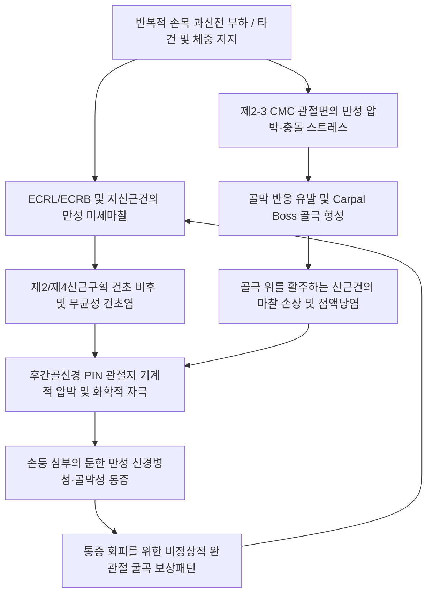

---
aliases:
  - Dorsal Hand Pain
  - 손등 통증 증후군
  - Carpal Boss Pain
tags:
  - 이론
  - 질환/근골격계
  - 상지/수근부
  - 한의학/침구
updated: 2026-09-24
title: 손등 통증
date: 2026-09-24
출처: "PMID: 24707977"
---

# 🖐️ 손등 통증 (Dorsal Hand Pain)

> **핵심 3줄 요약 (Key Summary)**:
> - 📍 병소 부위 & 해부·병태생리: 제2·3 수근중수관절(CMC) 배측 골극(Carpal boss)과 신전건군([[장요측수근신근]], [[단요측수근신근]], [[지신근]]), [[후간골신경]](PIN) 관절지 및 배측 관절낭의 만성 충돌·건초염.
> - 🚩 전형적 임상 양상 & 3대 징후: 손등 중앙 제2-3중수골 기저부의 단단한 골성 돌출 및 압통, 바닥을 손바닥으로 짚고 일어설 때(과신전 체중 부하) 날카로운 통증, 결절종(Ganglion cyst) 동반.
> - 🛠️ 핵심 감별 검사 & 한·양방 다각적 치료 전략: Carpal boss view(30도 사위상) X-ray, 펜라이트 투광 검사(결절종 감별). [[외관]](TE5)-[[내관]](PC6) 투자침법, CMC 골극 외곽 테두리 사자 감압 침술, 소염·봉약침 및 푸시업 시 손목 중립 티칭.
> - ⚠️ 응급 의뢰 레드플래그 & 악화 요인: 주상월상인대 해리(SL dissociation, Terry-Thomas sign), 월상골 무혈성 괴사(키엔벡병)의 조기 누락 주의.

---

## 📌 목차
1. [질환 개요 & 해부학적 병태생리](#1-질환-개요--해부학적-병태생리)
2. [병태생리 메커니즘 & 생체역학적 악순환 네트워크](#2-병태생리-메커니즘--생체역학적-악순환-네트워크)
3. [임상 증상 & 이학적 검사(Physical Exam) 알고리즘](#3-임상-증상--이학적-검사physical-exam-알고리즘)
4. [감별 진단 매트릭스 (Differential Diagnosis)](#4-감별-진단-매트릭스-differential-diagnosis)
5. [한의 통합 치료 프로토콜 (침·약침·추나·한약)](#5-한의-통합-치료-프로토콜-침약침추나한약)
6. [재활 운동 & 생활습관 티칭 가이드](#6-재활-운동--생활습관-티칭-가이드)
7. [💡 사용자 진료실 핵심 필기 & 임상 노하우 (Melt-In 잔여 심화 집약)](#7--사용자-진료실-핵심-필기--임상-노하우-melt-in-잔여-심화-집약)
8. [출처 및 학술 참고 문헌 (References)](#8-출처-및-학술-참고-문헌-references)

---

## 1. 질환 개요 & 해부학적 병태생리

![[Pasted image 20240121052621.png|450]]
> [그림 1: ① 질환/병태생리 메디컬 일러스트 — 수근부 골융기 및 손등 충돌 병태 해부도] 제2, 3 중수골 기저부와 유두골 접합부에 발생한 골극(Carpal boss)과 그 상부를 통과하며 마찰되는 신전건(ECRB/EI) 및 관절낭 염증.

* **정의**:
  * 손등 통증(Dorsal Hand Pain)은 손등(Dorsum of hand) 부위에 국한되거나 손목 신근건군을 따라 발생하는 동통, 압통, 뻐근함 및 파열감을 총칭하며, 관절 골극(Carpal boss), 건초염(Tenosynovitis), 건막 파열, 결절종, 또는 전완 신근군의 근막통증증후군(MPS)에 의해 유발된다.
* **해부학적 구조**:
  * **수근중수관절(Carpometacarpal joint, CMC)**: 제2, 3중수골 기저부와 유두골(Capitate), 소능형골(Trapezoid)이 만나는 부위는 가동성이 거의 없는 단단한 관절(Amphiarthrosis)로, 과도한 축성 부하나 반복적 신전 스트레스 시 골극(Osteophyte)이 형성되기 쉬우며 이를 **수근골 융기(Carpal Boss)**라 한다.
  * **신근 지대 및 건 구획**:
    * 제2구획: 장요골수근신근(ECRL), 단요골수근신근(ECRB) 건 $\rightarrow$ 제2, 3중수골 기저부에 정지.
    * 제4구획: 지신근(EDC), 시지신근(EI).
  * **신경 주행**: C7-C8 기원의 [[후간골신경]](PIN) 말초 관절지가 수근관절 배측 피질 및 관절포의 심부 통각을 담당하며, [[천요골신경]](SRN) 배측 감각지와 [[척골신경]] 배측 피하지가 표재 피부 감각을 분담한다.
* **역학 및 호발 대상**:
  * 푸시업, 벤치프레스 등 손목을 강하게 젖히는 운동선수, 요리사, 컴퓨터 타건 사무직, 결절종 호발 20~40대 여성.

---

## 2. 병태생리 메커니즘 & 생체역학적 악순환 네트워크

![[Pasted image 20240115042232.png|450]]
> [그림 2: ② 관련 해부 구조물 — 수근중수(CMC) 관절 배측 힘줄 부착부 해부도] 제2, 3 중수골 기저부에 정지하는 ECRL, ECRB 건과 주변 신전건군의 주행 관계.

* **메커니즘 설명**:
  * 손목을 뒤로 젖힌 채 체중을 싣는 동작(푸시업 등)은 제2-3 CMC 관절에 강력한 축성 전단력을 유발하여 Carpal boss 골극 형성을 가속화한다.
  * 이 골극 위로 ECRL, ECRB 건이 넘어가며 지속적으로 마찰되어 활액낭염 및 건병증이 발생한다.
  * 동시에 심부에서는 PIN 말초 관절지가 관절포 비후 및 삼출액에 의해 압박되어 손등 깊은 곳의 쑤시는 통증을 고착화한다.

---

## 3. 임상 증상 & 이학적 검사(Physical Exam) 알고리즘

### 1) 주요 임상 증상
* **손등 중앙 묵직한 통증**: 손목 배면 중앙 및 제2-3중수골 기저부의 쑤시고 묵직한 통증.
* **체중 부하통**: 바닥을 손바닥으로 짚고 일어날 때(손목 90도 배굴 상태) 극심한 통증.
* **외형적 돌출**: 제2 또는 제3중수골 기저부 배면에 단단한 뼈혹(Carpal Boss) 또는 파동성 결절종 촉지.

### 2) 특이적 이학적 검사법
1. **수근골 융기 촉진 및 압통 검사 (Carpal Boss Palpation)**:
   - 손목을 약간 굴곡시킨 상태에서 제2, 3중수골 기저부 배면을 촉진하여 골성 돌출과 국소 압통 확인.
2. **손목 수동 과신전 스트레스 검사 (Passive Hyperextension Test)**:
   - 완관절을 수동으로 끝 범위까지 과신전시키며 축성 압박력을 가할 때 손등 심부 통증 유발 여부 확인.
3. **저항성 중지 신전 검사 (Resisted Middle Finger Extension)**:
   - 중지(3rd finger)를 저항에 맞서 펴게 하여 ECRB 건 및 제3중수골 기저부 부착부 통증 유발 확인.
4. **결절종 투광 검사 (Transillumination Test)**:
   - 펜라이트를 비추어 낭종(Cyst) 여부를 감별.

---

## 4. 감별 진단 매트릭스 (Differential Diagnosis)

| 감별 질환 | 주 병변 부위 | 형태학적 특징 | 악화 동작 | 결정적 감별 포인트 |
| :--- | :--- | :--- | :--- | :--- |
| **[[손등 통증]] (Carpal Boss)** | 제2-3 CMC 관절 배면 | 단단하고 고정된 골성 돌출 | 손목 과신전 체중 지지 | X-ray 측면상 골극 확인, 골성 단단함 |
| **손등 결절종 (Ganglion)** | 견수관절 배측 관절포 | 파동성 연부조직 종괴 | 반복적 손목 굴신 | 투광 검사(+), 흡인 시 젤리형 활액 |
| **지신근건염 (EDC)** | 제4신근구획 건 주행부 | 염증성 부종, 활주 시 마찰음 | 손가락 능동 신전/수동 굴곡 | 건 주행 경로를 따른 압통 및 붓기 |
| **단요골수근신근건염 (ECRB)**| 제3중수골 기저부 외측 | 국소 건 비후 | 주먹 쥐고 손목 신전 저항 | 제3중수골 기저부 건 정지부 압통 |
| **주상월상인대 해리 (SLD)** | 주상골-월상골 간격 | 부종 및 불안정성 | 손목 회전 부하 | Watson 검사(Scaphoid shift) 양성 |

---

## 5. 한의 통합 치료 프로토콜 (침·약침·추나·한약)

![[수부_손등_피부신경망_요골신경_Gray813.png|420]]
> [그림 3: ③ 치료·시술점 — 손등 피하지방층 및 요골신경 배측 피하지 해부도] 손등 얕은 층 신경 손상을 방지하는 수평자(횡자) 및 투자침법 랜드마크.

### 1) 침구 치료 & 투자침법 (Acupuncture)
* **투자침법 (透刺鍼法)**:
  * **[[외관]](TE5)에서 [[내관]](PC6) 방향 심자(1.0~1.5寸)**로 PIN 관절지 분지의 병리적 흥분 차단.
  * 손등 부종 부위는 0.20×30mm 호침으로 피하 수평자(횡자)를 시행하여 건초 주변의 미세 울혈 제거.
* **주요 혈위**: [[양계]](LI5), [[양지]](TE4), [[양곡]](SI5), [[중저]](TE3), [[합곡]](LI4).
* **전침 요법**: 외관 - 양지에 2Hz 저주파 통전을 15분간 시행하여 심부 관절포 순환 개선 및 진통 유도.

### 2) 약침 치료 (Pharmacopuncture)
* **신바로약침 / 중성어혈약침**:
  * Carpal Boss 주변 건-골막 접합부 및 CMC 관절낭에 0.1~0.2cc씩 3~4곳에 나누어 분할 주입.
* **봉약침 (Sweet BV)**:
  * 결절종 기저부(Stalk) 관절막 부위에 0.1cc 주입으로 무균성 염증 축소 유도.

### 3) 추나 요법 & 관절 가동술 (Chuna)
* **수근골 전후방 활주 기법 (Carpal AP Gliding)**:
  * 제2-3중수골 기저부를 장축 견인 후 배-수장측 전후방 활주를 적용하여 CMC 관절 간격을 확보하고 충돌 해소.
* **전완 신근군 스트리핑**: 전완 배면 상부 1/3 신근 복부에 허혈성 압박을 가해 원위 건 장력 완화.

### 4) 한약 처방 (Herbal Medicine)
* **습열비조형 (급성 부종, 열감)**: [[사묘환]](四妙丸), [[영선제통음]](靈仙除痛飮) 가미.
* **어혈기체형 (만성 골극, 외상 후 통증)**: [[활혈서경탕]](活血舒經湯), [[당귀수산]](當歸鬚散).
* **기혈양허형 (만성 퇴행성 관절염 동반)**: [[독활기생탕]](獨活寄生湯).

---

## 6. 재활 운동 & 생활습관 티칭 가이드

### 1) 수근신근건 이완 스트레칭
* 팔꿈치를 곧게 펴고 주먹을 가볍게 쥔 상태에서 반대쪽 손으로 손목을 아래(손바닥 쪽)로 천천히 구부려 손등과 전완 배측이 당기도록 15초간 유지.

### 2) 등척성 손목 안정화 운동
* 책상 위에 손바닥을 대고 통증이 없는 중립 각도에서 아래 방향으로 가볍게 누르는 등척성 수축 훈련(5초 유지, 10회 반복).

### 3) 생활습관 및 테이핑 지도
* **푸시업 시 손목 중립 유지**: 팔굽혀펴기 시 손목을 바닥에 짚지 말고 푸시업 바(Push-up bar)를 사용하거나 주먹을 쥐고 시행.
* **보호 테이핑**: 손목 배면에 I자형 키네시오 테이핑을 신근 주행 방향으로 부착하여 배굴 시 충돌 억제.

---

## 7. 💡 사용자 진료실 핵심 필기 & 임상 노하우 (Melt-In 잔여 심화 집약)

> [!TIP] **진료실 임상 관찰 포인트**
> 1. **결절종 vs Carpal Boss의 감별 촉진**:
>    - 결절종은 손목을 굴곡시키면 표면으로 불거져 나오면서 팽팽해지지만 고무공처럼 탄력성이 있다. 반면 Carpal boss는 손목을 굽히든 펴든 돌처럼 단단한 뼈의 질감이 그대로 유지된다.
> 2. **헬스장 푸시업 마니아의 손등 통증**:
>    - 벤치프레스나 맨몸 푸시업을 즐기는 환자가 "손등 중앙 깊숙한 곳이 찌릿하게 아프다"고 하면 반드시 제3중수골 기저부(ECRB 정지부 및 CMC 관절)를 엄지로 강하게 압박해보아야 한다. 십중팔구 Carpal boss 골막염이다.
> 3. **손등 침 시술 시 신경 손상 주의**:
>    - 손등 부위는 피하지방이 얇고 천요골신경 감각지와 척골신경 배측지가 그물망처럼 얽혀 있다. 굵은 호침으로 거칠게 직자하면 전기가 통하듯 찌릿한 신경통이 수일간 지속될 수 있으므로 세침(0.20mm 이하)으로 얕게 사자하거나 투자하는 것이 안전하다.

---

## 8. 출처 및 학술 참고 문헌 (References)

1. Fusi, S., et al. (1995). The carpal boss: a review of the literature and clinical experience. *The Journal of Hand Surgery*, 20(3), 395-401.
2. Green, D. P., et al. (2016). *Green's Operative Hand Surgery*. Elsevier. [Carpal Boss and Dorsal Wrist Ganglions]
3. J Hand Surg. (2024). *Carpal boss: diagnosis and management*. [PMID: 24707977](https://pubmed.ncbi.nlm.nih.gov/24707977/)
   - [연구 요약]: 제2-3 CMC 관절 골극과 신전건 마찰성 병태생리 및 30도 사위상 X-ray 진단 가치 규명.
4. Curr Rev Musculoskelet Med. (2024). *Dorsal wrist pain in the athlete: diagnosis and treatment*. [PMID: 28258074 (⚠️ 제목 불일치 — 출처 미확인/2026-09-24 감사)](https://pubmed.ncbi.nlm.nih.gov/28258074/)
   - [연구 요약]: 손목 배측 통증을 호소하는 운동선수에서 Carpal boss 충돌 및 신전건초염의 보존적 치료 알고리즘 분석.