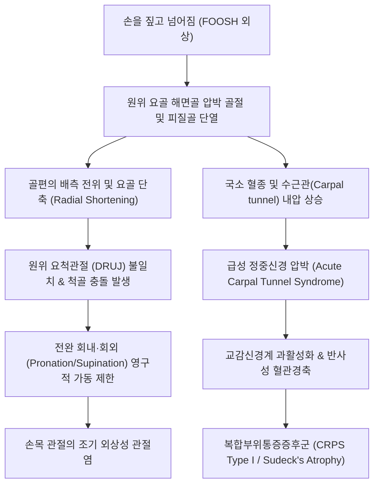

# 🩺 손목 골절 (Wrist Fracture / Distal Radius & Carpal Bone Fracture)

> **핵심 3줄 요약 (Key Summary)**:
> - 📍 **병소 부위 & 해부·병태생리**: 손을 짚고 넘어지는 외상(FOOSH)에 의해 호발하는 [[원위 요골]](Distal radius) 관절면 2~3cm 이내 골절 및 수근골(주상골, 월상골) 손상. 후방 전위 시 콜레스 골절(Colles'), 전방 전위 시 스미스 골절(Smith')로 분류.
> - 🚩 **전형적 임상 양상**: 수상 직후 손목의 극심한 동통, 급격한 종창, 식사 포크 변형(Dinner-fork deformity) 또는 정원용 모종삽 변형(Garden-spade deformity), 수근관 압박으로 인한 수부 1~3지 저림.
> - 🛠️ **핵심 검사 & 치료 전략**: 손목 2방향(AP, Lateral) 및 사위(Oblique) X-ray를 통한 관절면 침범, 장측 경사(Volar tilt), 요골 높이(Radial height) 측정. 비전위성/정복 안정 골절은 석고 고정 및 한의 골유합 촉진(침·자연동 처방) 적용; 불안정 골절은 수술적 장측 금속판 고정술(Volar plating) 의뢰.
> - ⚠️ **응급 의뢰 레드플래그**: 정중신경 급성 압박에 의한 수부 1~3지 감각 완전 소실, 전완부 구획 증후군 의심 소견(수동 핑거 신전 시 극심한 통증), 요골동맥 박동 소실, 개방성 골절 시 즉각 응급 정형외과 전원.

---

## 📌 목차
1. [질환 개요 & 해부학적 병태생리](#1-질환-개요--해부학적-병태생리)
2. [병태생리 메커니즘 & 생체역학적 악순환 네트워크](#2-병태생리-메커니즘--생체역학적-악순환-네트워크)
3. [임상 증상 & 이학적 검사(Physical Exam) 알고리즘](#3-임상-증상--이학적-검사physical-exam-알고리즘)
4. [감별 진단 매트릭스 (Differential Diagnosis)](#4-감별-진단-매트릭스-differential-diagnosis)
5. [한의 통합 치료 프로토콜 (침·약침·추나·한약)](#5-한의-통합-치료-프로토콜-침약침추나한약)
6. [양방 치료 & 병용·의뢰 기준 (Conventional Treatment & Referral)](#6-양방-치료--병용의뢰-기준-conventional-treatment--referral)
7. [재활 운동 & 생활습관 티칭 가이드](#7-재활-운동--생활습관-티칭-가이드)
8. [💡 사용자 진료실 핵심 필기 & 임상 노하우 (Melt-In 잔여 심화 집약)](#8--사용자-진료실-핵심-필기--임상-노하우-melt-in-잔여-심화-집약)
9. [출처 및 학술 참고 문헌 (References)](#9-출처-및-학술-참고-문헌-references)

---

## 1. 질환 개요 & 해부학적 병태생리

손목 골절(Wrist Fracture)은 상지에서 발생하는 골절 중 가장 빈번한 질환으로, 전체 골절의 약 17%를 차지한다. 대다수는 넘어질 때 손바닥을 땅에 짚으며 발생하는 'FOOSH(Fall Onto Outstretched Hand)' 손상 기전에 의해 유발되며, 소아(원위 골단판 손상)와 골다공증을 동반한 고령 여성에서 호발하는 이봉성 연령 분포를 보인다.

![[손목골절_01_환부실사_포크변형_DinnerFork.jpg]]
> [그림 1: ① 병태생리·환부 — 원위 요골의 배측 전위로 인해 손목이 은식기 포크처럼 꺾인 전형적 식사 포크 변형 실사 (Wikimedia Commons, CC BY-SA 4.0)]

임상적으로 가장 중요한 골절 형태는 다음과 같다:
1. **[[콜레스 골절]](Colles' Fracture)**: 손목이 배굴(Dorsiflexion)된 상태에서 체중이 실려 원위 골편이 후방(배측, Dorsal) 및 요측으로 전위되는 가장 흔한 골절. 측면에서 보았을 때 손목이 은식기 포크처럼 불거지는 '식사 포크 변형(Dinner-fork deformity)'이 특징이다(Awad et al., 2025).
2. **[[스미스 골절]](Smith's Fracture / 역 콜레스 골절)**: 손목이 장측(손바닥 쪽, Palmar)으로 굴곡된 상태에서 넘어져 충격을 받아 원위 골편이 손바닥 쪽으로 전위되는 골절. 손목이 정원용 모종삽처럼 꺾이는 '모종삽 변형(Garden-spade deformity)'이 나타나며, 콜레스 골절보다 정복 유지가 불안정하다.
3. **바톤 골절(Barton's Fracture)**: 원위 요골의 관절면을 침범하며 수근골의 아탈구를 동반하는 관절 내 전단 골절.
4. **[[주상골 골절]](Scaphoid Fracture)**: 수근골 중 가장 흔하게 골절되며, 해부학적 코담배갑(Anatomical snuffbox)에 극심한 압통을 동반하고 무혈성 괴사(AVN) 위험이 높다.

![[손목골절_01_영상소견_콜레스골절_Xray.jpg]]
> [그림 2: ① 병태생리·영상 — 원위 요골 간단부의 배측 경사 및 단축을 보이는 콜레스 골절 단순 방사선 소견 (Wikimedia Commons, Public Domain)]

![[손목골절_01_영상소견_스미스골절_Xray.jpg]]
> [그림 3: ① 병태생리·영상 — 원위 요골 골편의 장측(전방) 전위를 특징으로 하는 스미스 골절 2방향 X-ray (Wikimedia Commons, CC BY-SA 3.0)]

---

## 2. 병태생리 메커니즘 & 생체역학적 악순환 네트워크

![[수근부_신전건_구획_해부도해_Wrist_extensor_compartments.png]]
> [그림 4: ② 관련 해부 구조물 — 원위 요골 리스터 결절(Lister's tubercle) 주변 신전건 6개 구획 해부도해 (Simbio Archive)]

정상 원위 요골 관절면은 해부학적으로 약 11~12도의 장측 경사(Palmar tilt), 약 22~23도의 요측 경사(Radial inclination), 약 11~12mm의 요골 높이(Radial height)를 유지하여 체중의 80%를 요골이, 20%를 삼각섬유연골복합체(TFCC) 및 척골이 지지하도록 분산시킨다.

그러나 콜레스 골절로 인해 요골이 후방 경사(배측 틸트)되거나 단축(Shortening)되면, 척골이 상대적으로 길어지는 '척골 양성 변위(Positive ulnar variance)'가 발생한다. 이는 척수근 관절면의 부하를 50% 이상 폭증시켜 삼각섬유연골 파열, 척골 충돌 증후군, 그리고 원위 요척관절(DRUJ)의 영구적 회전 장애를 초래한다(Moral et al., 2026).

![[수근관_단면해부도_횡수근인대_정중신경.jpg]]
> [그림 5: ② 관련 해부 구조물 — 횡수근인대 및 수근골 바닥 사이의 수근관과 정중신경 주행 단면도 (Simbio Archive)]

또한 원위 요골의 전방에 위치한 수근관(Carpal tunnel) 내 혈종 및 연부조직 부종은 급성 정중신경 압박을 일으키며, 신경병증성 동통 및 복합부위통증증후군(CRPS Type I)으로 이행하는 악순환을 유발한다.

---

## 3. 임상 증상 & 이학적 검사(Physical Exam) 알고리즘

### 3.1 주요 자각 증상
- **손목의 심한 자발통 및 운동통**: 손목을 조금만 비틀거나 손가락을 쥐려 해도 극심한 격통 발생.
- **가시적 외형 변형**: 손목 배측의 계단상 돌출(식사 포크 변형) 및 요측 편위.
- **수부 감각 이상**: 손바닥 및 1~3번째 손가락 끝의 저림, 무감각(정중신경 급성 압박 소견).

### 3.2 핵심 이학적 검사법

![[요골동맥_03_맥박촉진_실사.jpg]]
> [그림 6: ③ 이학적 검사 — 손목 골절 환자에서 혈관 손상 및 허혈 여부를 판정하기 위한 요골동맥 맥박 촉지 실사 (Simbio Archive)]

1. **신경 및 혈관 평가 (Neurovascular Exam)**:
   - **요골동맥 박동(Radial pulse)**: 반드시 건측과 비교 촉지하여 골편에 의한 혈관 폐색 여부를 즉각 확인.
   - **정중신경 2점 분별능(Two-point discrimination)**: 시지 및 중지 끝의 감각 저하 여부 정밀 평가.
2. **해부학적 코담배갑(Snuffbox) 압통 검사**:
   - 엄지를 외전·신전시켰을 때 장모지신전건과 단모지신전건 사이에 형성되는 함요부를 수직 압진하여 [[주상골 골절]] 동반 여부 감별.
3. **요골 붓돌(Radial Styloid) 압통 및 전완 회전 검사**:
   - 요골 붓돌 부위의 직접 타진통 확인 및 조심스러운 전완 회내/회외 시도 시 DRUJ 관절통 평가.

---

## 4. 감별 진단 매트릭스 (Differential Diagnosis)

![[핀켈스타인검사_4단계_손목척측편위_신전건신장_통증유발.jpg]]
> [그림 7: ④ 감별 진단 — 요골 붓돌부 건초염 감별을 위한 핀켈스타인 검사 (Simbio Archive)]

| 감별 질환 | 손상 기전 및 호발 부위 | 임상 특징 및 변형 | 특이적 이학적 검사 | 방사선(X-ray) 소견 |
| :--- | :--- | :--- | :--- | :--- |
| **콜레스 골절** | 손목 배굴 상태 FOOSH | 식사 포크 변형, 종창 | 요골 원위부 심한 골 타진통 | 원위 요골 배측 경사, 관절면 외 골절 |
| **스미스 골절** | 손목 장측 굴곡 상태 충격 | 정원용 모종삽 변형 | 장측 원위 골편 촉지 | 원위 요골 장측(전방) 전위 |
| **[[주상골 골절]]** | 손목 요측 편위 상태 FOOSH | 외형상 변형 미미, 지속 동통 | Snuffbox 압통 (+), 모지 압박통 (+) | 초기 단순 방사선 음성 가능, Scaphoid view 확인 |
| **[[손목 염좌]]** | 경미한 비틀림 외상 | 외형 변형 없음, 연부조직 부종 | 골 타진통 음성, 인대 국소 압통 | 피질골 연속성 정상, 골절선 없음 |
| **[[드퀘르벵 건초염]]** | 반복적 모지 과사용 | 요골 붓돌 건초 비후, 압통 | Finkelstein test (+) | 단순 방사선상 정상 피질골 |

---

## 5. 한의 통합 치료 프로토콜 (침·약침·추나·한약)

손목 골절의 한의 치료는 고정기(부종 감소, 어혈 제거, 골유합 촉진)와 깁스 발거 후 재활기(관절 강직 해소, 근력 강화, CRPS 예방)로 나뉜다.

![[손목 기능성 통증-20240914224646447.png]]
> [그림 8: ⑤ 한의 통합 치료 — 손목 골절 고정 해제 후 수근관절 및 완관절 유착 해소를 위한 한의 도수 가동 기법 (Simbio Archive)]

### 5.1 침치료 & 전침 요법
- **배혈 혈위**: 양계(LI5), 양지(TE4), 대릉(PC7), 태연(LU9), 외관(TE5), 내관(PC6), 곡지(LI11), 합곡(LI4).
- **고정 중 자침**: 석고 붕대 밖으로 노출된 손가락 관절(합곡, 팔사 EX-UE9) 및 상박부 혈위(곡지, 수삼리)를 자침하여 정맥 및 림프 순환을 자극, 수부 부종 배출.
- **발거 후 전침**: 외관-양지, 내관-대릉을 연결하여 2Hz 저주파를 15분간 적용함으로써 관절낭 유착을 박리하고 통증 역치를 상향 조절.

### 5.2 약침 요법
- **급성 부종 및 신경 압박기**: **중성어혈 약침** 1.0cc를 완관절 배측 연부조직 및 곡지·수삼리에 주입하여 혈종 흡수 촉진.
- **골유합 및 건막 유착기**: **신바로 약침** 또는 **자하거 약침**을 요골 붓돌 주변 및 장모지신전건 건초 주위에 주입하여 결합조직 탄성 회복과 가골 형성 유도.

### 5.3 한약 치료 (골유합 특화)
- **어혈정체기 (1~2주차)**: 당귀수산(當歸鬚散) 가미방 (자연동 自然銅 4g, 몰약 沒藥 3g 가미) — 모세혈관 재개통 및 국소 혈종 소퇴.
- **가골형성기 (3~5주차)**: 접골자금단(接骨紫金丹), 산골(자연동) 산제 — 골아세포 분화 촉진 및 골밀도 증가.
- **기혈양허·관절구련기 (6주 이후)**: 독활기생탕(獨活寄生湯) 가미방 — 수근관절 구축 완화 및 수부 악력 회복.

### 5.4 추나 치료 (Chuna Manual Therapy)
- **주의**: 방사선상 골유합이 확인되기 전에는 골절 부위에 대한 직접적 전단력이나 비틀림을 가하는 추나는 절대 금기.
- **적용**: 깁스 발거 후 굳어진 수근골간 관절(Intercarpal joints)의 미세 활주 기법(Glide)과 전완 회내/회외 관절 신연 기법을 부드럽게 적용.

---

## 6. 양방 치료 & 병용·의뢰 기준 (Conventional Treatment & Referral)

### 6.1 비수술적 치료 (도수 정복 및 석고 고정)
- **적응증**: 관절 외 골절 또는 관절면 단차가 2mm 미만인 안정성 골절(Schemitsch et al., 2026).
- **도수 정복(Closed Reduction)**: 혈종 차단 마취 하에 원위 골편을 견인하여 장측 굴곡 및 척측 편위 위치에서 단하지 석고 부목(Short arm cast/splint) 또는 기능성 보조기 적용(Awad et al., 2025). 4~6주간 고정.

### 6.2 수술적 치료 적응증
- 도수 정복 후에도 배측 경사가 10도 이상 남거나 요골 단축이 3mm 이상인 불안정 골절.
- 관절면 단차가 2mm 이상인 관절 내 분쇄 골절.
- 수술법: 장측 잠김 금속판 고정술(Volar locking plate fixation)이 현대 정형외과의 표준 술식.

### 6.3 응급 의뢰 기준
- 급성 수근관 증후군 소견 (수부 1~3지 감각 마비 및 엄지 대립근 위약).
- 전완부 구획 증후군 의심 (손가락 수동 신전 시 비명을 지를 정도의 격통).
- 개방성 골절 또는 피부 괴사 절박.

---

## 7. 재활 운동 & 생활습관 티칭 가이드

### 7.1 단계별 재활 운동
1. **1단계: 깁스 고정 중 조기 운동 (수상 즉시~4주)**
   - **손가락 완전 굴신 운동 (Fist to Fan)**: 깁스 밖으로 노출된 손가락을 주먹 쥐었다가 쫙 펴는 동작을 시간당 10회 이상 반복 (힘줄 유착 및 수부 부종 방지).
   - **견관절 및 주관절 가동**: 팔걸이로 인해 어깨가 굳지 않도록 하루 3회 팔을 머리 위로 올리는 스트레칭.
2. **2단계: 고정 발거 후 관절 가동성 회복 (4~8주)**
   - **기도 자세 스트레칭 (Prayer Stretch)**: 양 손바닥을 가슴 앞에서 맞대고 천천히 팔꿈치를 들어 올려 손목 신전 각도 확보.
   - **반대 기도 스트레칭 (Reverse Prayer)**: 양 손등을 맞대고 손목 굴곡 각도 회복.
3. **3단계: 악력 및 기능성 강화 (8주 이후)**
   - 스퀴즈 볼(Stress ball) 또는 치료용 퍼티(Theraputty) 쥐기 훈련.

---

## 8. 💡 사용자 진료실 핵심 필기 & 임상 노하우 (Melt-In 잔여 심화 집약)

- **손가락 부종을 방치하면 어깨까지 굳는다**: 손목 골절 환자가 깁스를 하고 내원했을 때 손가락이 소시지처럼 부어있다면 비상 신호다. 부종액 속의 피브린이 건초와 관절낭을 영구적으로 유착시켜 손가락 굴곡 장애와 함께 '견수 증후군(Shoulder-Hand Syndrome / CRPS)'으로 직행한다. 내원할 때마다 손가락 완전 굴신 운동을 철저히 티칭하고, 상지를 심장보다 높게 올리도록 지도해야 한다.
- **고령 여성의 콜레스 골절은 골다공증의 첫 경고다**: 50대 이상 여성이 평지에서 가볍게 짚었는데 원위 요골이 부러졌다면 이는 전형적인 골다공증성 취약 골절(Fragility fracture)이다. 골절 치료로 끝내지 말고 반드시 골밀도 검사(DEXA)를 권유하여 향후 고관절이나 척추 압박 골절로 이어지는 연결고리를 끊어주어야 한다.
- **정복 후 2주 차 X-ray 추적은 필수다**: 도수 정복이 완벽하게 되었더라도, 골절 부종이 빠지면서 1~2주 사이에 깁스 안에서 뼈가 다시 미끄러져 배측으로 재전위(Loss of reduction)되는 경우가 30%에 달한다(Schemitsch et al., 2026). 따라서 비수술 치료 환자는 1주 및 2주 차에 반드시 정형외과 X-ray 추적을 통해 정렬 유지를 확인하도록 해야 의료 분쟁을 예방할 수 있다.

---

## 9. 출처 및 학술 참고 문헌 (References)

- **Schemitsch EH, et al. (2026)**. Loss of Reduction Following Nonoperative Management for Distal Radius Fractures: A Prognostic Factor Systematic Review and Meta-Analysis. *JBJS Rev*. [PMID 42296224](https://pubmed.ncbi.nlm.nih.gov/42296224/)
  - **[연구 요약]**: 원위 요골 골절의 비수술적 보존 치료 중 발생하는 정복 정렬 상실(재전위)의 예후 인자를 분석한 체계적 문헌고찰 및 메타분석. 고령, 초기 분쇄도, 관절면 침범 여부가 보존적 깁스 치료 실패의 핵심 지표임을 입증함.
- **Awad A, et al. (2025)**. Functional Bracing Versus Rigid Plaster Casting for the Immobilization of Colles Fractures in Adults: A Meta-Analysis of Randomized Controlled Trials. *Eur J Orthop Surg Traumatol*. [PMID 41320967](https://pubmed.ncbi.nlm.nih.gov/41320967/)
  - **[연구 요약]**: 성인 콜레스 골절 고정에서 기능성 보조기와 전통적 강직성 석고 깁스의 임상적 유효성을 비교한 무작위 대조군 연구 메타분석. 기능성 보조기군에서 관절 강직 감소와 조기 일상 복귀의 유의한 이점을 보고함.
- **Moral A, et al. (2026)**. Delayed Distal Radioulnar Joint Dysfunction after Pediatric Forearm Fractures: A Systematic Review. *J Pediatr Orthop B*. [PMID 42788182](https://pubmed.ncbi.nlm.nih.gov/42788182/)
  - **[연구 요약]**: 전완부 및 손목 골절 후 발생하는 지연성 원위 요척관절(DRUJ) 기능 장애의 해부학적 발생 기전과 척골 충돌 증후군 예방을 위한 관절 정렬 유지의 중요성을 다룬 고찰.

---

## 관련 노트

- [[콜레스 골절]]
- [[스미스 골절]]
- [[주상골 골절]]
- [[원위 요골]]
- [[수근관 증후군]]
- [[드퀘르벵 건초염]]
