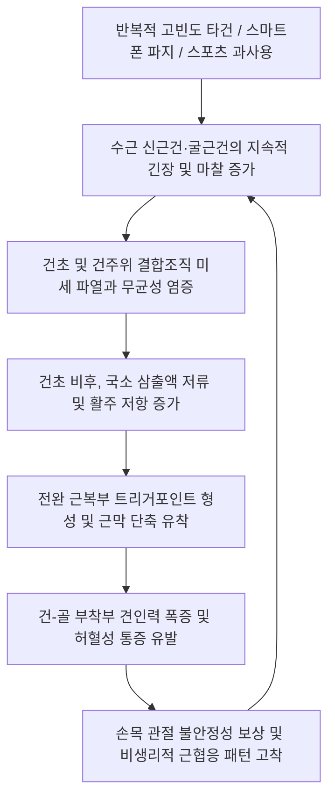

# 🖐️ [[손목 과사용 증후군]] (Wrist Overuse Syndrome / Repetitive Strain Injury)

> **핵심 3줄 요약 (Key Summary)**:
> - 📍 병소 부위 & 해부·병태생리: 반복적 키보드·마우스 타건, 스마트폰 파지, 수작업 및 스포츠 동작으로 인해 전완 수근 신근·굴근건군(ECRL/ECRB, EDC, FCR, FCU) 및 [[완횡근]](Brachioradialis), 신전건 구획 교차 부위(Intersection)에 미세 파열과 만성 무균성 건초염·근막 유착이 누적되는 누적외상성 장애(Cumulative Trauma Disorder, CTD).
> - 🚩 전형적 임상 양상: 손목 배측 및 요·척측의 묵직한 뻐근함, 타건 시 심화되는 피로통, 악력 저하 및 컵 들기 시 힘빠짐, 수근 신전건 교차부에서의 마찰음(Crepitus) 및 전완 근복부 트리거 포인트 압통.
> - 🛠️ 핵심 감별 검사 & 한·양방 다각적 치료 전략: 저항 수근 신전·굴곡 검사, Cozen 검사, 교차증후군 유발검사, 전완 근막 긴장도 촉진. [[곡지]](LI11)·[[수삼리]](LI10)·[[외관]](TE5)·[[양계]](LI5) 전침(2/100Hz 혼합파), 소염약침(황련해독·신바로) 근건 접합부 주입, 전완 근막이완 추나 및 인체공학적 중립위 보호대 처방.
> - ⚠️ 응급 의뢰 레드플래그: 주상골 골절 의심 무지구 기저부(Snuff box) 극심한 압통, 불응성 신경 압박(정중·척골신경 마비로 인한 지속적 감각 소실), 급격한 수부 종창 및 국소 열감 동반 감염성 건초염 징후.

---

## 📌 목차
1. [질환 개요 & 해부학적 병태생리](#1-질환-개요--해부학적-병태생리)
2. [병태생리 메커니즘 & 생체역학적 악순환 네트워크](#2-병태생리-메커니즘--생체역학적-악순환-네트워크)
3. [임상 증상 & 이학적 검사(Physical Exam) 알고리즘](#3-임상-증상--이학적-검사physical-exam-알고리즘)
4. [감별 진단 매트릭스 (Differential Diagnosis)](#4-감별-진단-매트릭스-differential-diagnosis)
5. [한의 통합 치료 프로토콜 (침·약침·추나·한약)](#5-한의-통합-치료-프로토콜-침약침추나한약)
6. [양방 치료 & 병용·의뢰 기준 (Conventional Treatment & Referral)](#6-양방-치료--병용의뢰-기준-conventional-treatment--referral)
7. [재활 운동 & 생활습관 티칭 가이드](#7-재활-운동--생활습관-티칭-가이드)
8. [💡 사용자 진료실 핵심 필기 & 임상 노하우 (Melt-In 잔여 심화 집약)](#8--사용자-진료실-핵심-필기--임상-노하우-melt-in-잔여-심화-집약)
9. [출처 및 학술 참고 문헌 (References)](#9-출처-및-학술-참고-문헌-references)

---

## 1. 질환 개요 & 해부학적 병태생리

![[손목건초염_01_환부실사_Tenosynovitis.jpg|480]]
> [그림 1: ① 질환/병태생리 임상 실사 — 수근부 건초염 및 과사용 병변] 과도한 반복 파지 및 손목 신전 동작으로 유발된 수근 배측 건초의 국소 종창과 염증성 비후 소견.

* **질환 정의 및 개념**:
  * 손목 과사용 증후군(Wrist Overuse Syndrome)은 독립된 단일 해부학적 질환이라기보다, 손목과 전완부 건(Tendon), 건초(Tenosynovium), 근막(Fascia)에 반복적이고 지속적인 기계적 부하(Microtrauma)가 한계치를 초과하여 발생하는 복합적 과사용 손상 증후군이다.
  * 광의의 **반복염좌손상(Repetitive Strain Injury, RSI)** 또는 **누적외상성 장애(Cumulative Trauma Disorder, CTD)**의 수근부 발현 양상으로, 사무직 컴퓨터 작업자, 프로그래머, 조리사, 악기 연주자, 골프·테니스 동호인에게서 폭넓게 관찰된다([Prasad N, 2025](https://pubmed.ncbi.nlm.nih.gov/39745557/)).
* **해부학적 취약 부위 및 주요 구조물**:
  * **수근 신전건 6개 구획 (Extensor Compartments)**:
    * 제1구획: [[단무지신근]](EPB) & [[장무지외전근]](APL) $\rightarrow$ [[드퀘르벵 증후군]](De Quervain's Tenosynovitis).
    * 제2구획: [[장요측수근신근]](ECRL) & [[단요측수근신근]](ECRB) $\rightarrow$ 마우스 파지 시 지속적 등척성 긴장 부하.
    * 교차 부위(Intersection zone): 수관절 근위부 약 4~6cm 지점에서 제1구획 근육군이 제2구획 건 상부를 사선으로 가로지르는 마찰 호발점([[교차 증후군]], Intersection syndrome)([Stavros D, 2026](https://pubmed.ncbi.nlm.nih.gov/40785355/)).
  * **전완 굴근건군 및 상완요골근**:
    * [[요측수근굴근]](FCR), [[척측수근굴근]](FCU), [[심지굴근]](FDP), [[천지굴근]](FDS).
    * [[완횡근]](Brachioradialis): 전완 중립위에서 주관절 굴곡 및 손목 안정화에 기여하며, 과사용 시 전완 요측 통증의 주원인이 됨([Kim KH, 2026](https://pubmed.ncbi.nlm.nih.gov/41423326/)).
* **역학 및 위험 인자**:
  * 장시간(일 6시간 이상) 비인체공학적 키보드·마우스 사용(손목 과신전 및 척측 편위 자세).
  * 스마트폰 장시간 한 손 파지(엄지 과사용에 따른 전완 근막 부하).
  * 진동 공구 조작 및 무거운 주방 조리기구 반복 조작.

---

## 2. 병태생리 메커니즘 & 생체역학적 악순환 네트워크

![[수근부_신전건_구획_해부도해_Wrist_extensor_compartments.png|500]]
> [그림 2: ② 관련 해부 구조물 — 수근 신전건 구획 해부도] 수근 배측 지대 아래를 통과하는 신전건 구획과 마찰 및 과사용이 집중되는 교차 해부 구조.

### 1) 미세 손상과 불완전 회복의 연속 (Overuse Cascade)
* **건병증(Tendinopathy)의 단계적 진행**:
  1. **반응성 건병증(Reactive Tendinopathy)**: 급격한 과부하 직후 건세포 활성화 및 비염증성 프로테오글리칸 기질 증식으로 일시적 건 비후 발생.
  2. **건 실패 단계(Tendon Dysrepair)**: 과부하 지속 시 콜라겐 섬유의 배열 분리 및 혈관신생(Neovascularization), 무균성 신경 섬유 증식으로 안정 시에도 지속적인 쑤심 유발.
  3. **퇴행성 건병증(Degenerative Tendinopathy)**: 기질 괴사와 미세 파열이 고착화되어 악력 상실 및 탄성 회복력 결여.
* **근막 연쇄의 긴장 전달**:
  * 전완 신근군([[단요측수근신근]], [[지신근]])의 만성 과긴장은 외측상과 부착부 장력을 높여 테니스 엘보와 수근부 통증을 동시에 유발하는 이중 장애 패턴을 형성함.

---

## 3. 임상 증상 & 이학적 검사(Physical Exam) 알고리즘

![[cozens_test_step2_wrist_extension_resistance.jpg|480]]
> [그림 3: ③ 이학적 검사 — 저항 수근 신전 검사(Cozen Test)] 검사자의 저항에 맞서 손목을 신전·요편위시킬 때 단요측수근신근 및 수근 신전건군 부착부의 통증 유발 확인.

### 1) 전형적 임상 증상
* **동통 특성**: 손목 배측, 요측 또는 수근관절 전반에 걸쳐 나타나는 묵직한 뻐근함(Dull aching pain). 작업 중 및 작업 직후 심화되며, 휴식 시 완화되나 만성화되면 야간통으로 발전.
* **마찰음 및 걸림감(Crepitus)**: 교차증후군(Intersection syndrome) 동반 시 손목을 움직일 때 가죽 마찰음 같은 '뿌드득' 소리와 삐걱거림 감지.
* **기능적 악력 저하**: 컵이나 프라이팬을 들 때 손목에 힘이 빠지는 현상, 병뚜껑 돌리기나 걸레 짜기 동작에서의 급성 통증.

### 2) 이학적 검사 단계별 프로토콜
* **1단계: 시진 및 국소 촉진 (Inspection & Palpation)**:
  * 수근 배측 건초 주위 미세 부종, 리스터 결절(Lister's tubercle) 주변 및 근위 4~6cm 교차 부위 압통점 촉진.
  * 전완 신근·굴근 근복부의 단단한 긴장 띠(Taut band) 및 압통 유발점(TrP) 확인.
* **2단계: 저항 관절 가동 검사 (Resisted Isometric Tests)**:
  * **저항 수근 신전 검사(Cozen Test)**: 환자의 주관절을 굴곡한 상태에서 검사자의 저항에 맞서 주먹을 쥐고 손목을 강하게 신전시킬 때 수근 배측 및 외측상과 통증 유발.
  * **저항 수근 굴곡 검사**: 손목을 굴곡시킬 때 저항을 주어 [[요측수근굴근]](FCR) 및 [[척측수근굴근]](FCU) 병변 감별.
* **3단계: 특수 유발 검사**:
  * **Finkelstein Test**: 제1구획 건초염([[드퀘르벵 증후군]]) 동반 여부 감별.
  * **Phalen & Tinel Test**: [[수근관 증후군]] 합병 여부 배제.

---

## 4. 감별 진단 매트릭스 (Differential Diagnosis)

| 감별 질환 | 호발 부위 및 핵심 병소 | 주요 유발 동작 및 임상 징후 | 결정적 이학적 검사 및 감별점 |
| :--- | :--- | :--- | :--- |
| **[[손목 과사용 증후군]]** | 수근 배측 전반, 전완 신근·굴근건 | 반복 타건, 장시간 마우스 파지 시 뻐근함 | 저항 수근 신전통, 교차부 마찰음, 신경학적 결손 없음 |
| **[[드퀘르벵 증후군]]** | 요골 경상돌기(제1신전구획) | 엄지 외전 및 척측 편위 시 날카로운 통증 | **[[핀켈스타인 검사]](Finkelstein) 양성**, 요골 경상돌기 국소 압통 |
| **[[교차 증후군]]** | 리스터 결절 근위 4~6cm 배측 요측 | 손목 신전-굴곡 시 명확한 마찰음(Squeaking) | 제1구획과 제2구획 교차부 국소 열감 및 부종 |
| **[[수근관 증후군]]** | 수근관 내부, 제1~3수지 장측 | 야간 작열통, 손끝 저림, 감각 둔마 | **[[팔렌 검사]], [[티넬 징후]] 양성**, 신경전도검사 이상 |
| **[[삼각섬유연골복합체 손상]](TFCC)** | 손목 척측(두상골-척골두 사이) | 짚고 일어나기, 걸레 짜기, 척측 편위 부하 | **TFCC 압박 부하 검사(Fovea sign) 양성**, 딸깍거림 |

---

## 5. 한의 통합 치료 프로토콜 (침·약침·추나·한약)

![[수부질환_05_수부침치료실사_수지침.jpg|480]]
> [그림 4: ④ 한의 치료 술기 실사 — 수부 및 수근부 침치료] 수근관절 및 전완부 경혈에 자침하여 국소 미세혈류를 개선하고 건초 유착을 완화하는 임상 술기.

### 1) 침구 치료 & 전침 자극 프로토콜
* **주요 취혈점**:
  * **국소 혈위**: [[양계]](LI5), [[양지]](TE4), [[양곡]](SI5), [[대릉]](PC7), [[태연]](LU9), [[외관]](TE5), [[내관]](PC6).
  * **전완 근막 혈위**: [[수삼리]](LI10), [[곡지]](LI11), [[척택]](LU5), [[소해]](HT3), [[사독]](TE9).
* **전침(Electroacupuncture) 파형 세팅**:
  * 양계(LI5) - 외관(TE5) 및 수삼리(LI10) - 곡지(LI11) 쌍에 전극 연결.
  * **저주파-고주파 혼합파(2/100 Hz dense-disperse wave)**를 15~20분간 인가하여 엔도르핀 방출을 통한 진통 효과와 과긴장된 전완 근육의 즉각적 근이완 유도.

### 2) 약침 치료 (Pharmacopuncture)
* **제제 선택**:
  * 급성 부종 및 염증기: **황련해독탕 약침** 또는 **중성어혈 약침** 0.5~1.0cc.
  * 만성 건병증 및 유착기: **신바로 약침** 또는 **자하거(인태반) 약침** 1.0cc를 건초 주변 및 전완 근건 접합부에 분할 주입.
* **주입 기법**: 건 실질 내부의 직접 주입은 피하고, 건초 주변 결합조직 및 근막 간질에 주입하여 수력박리(Hydrodissection) 효과 도모.

### 3) 근막이완 추나 및 관절가동술
* **전완 근막 글라이딩 기법**: 무지구근, 상완요골근, 지신근의 긴장 띠를 직각 방향으로 탄발(Plucking) 및 장축 방향 스트리핑 기법 적용.
* **수근골 관절가동술(Carpal Mobilization)**: 주상골-월상골 및 유두골 사이의 미세 가동성을 회복시켜 손목 굴신 시 수근골 간 비정상적 충돌 완화.

### 4) 한약 치료 (변증 시치)
* **기체어혈형(氣滯瘀血型)**: 반복 작업 후 찌르는 듯한 국소 통증 $\rightarrow$ [[활혈통기산]](活血通氣散), [[당귀수산]](當歸鬚散).
* **풍한습비형(風寒濕痺型)**: 날씨가 흐리거나 차가울 때 손목이 시리고 굳는 증상 $\rightarrow$ [[오적산]](五積散), [[대강활탕]](大羌活湯).
* **기혈양허·간신부족형(氣血兩虛型)**: 만성 피로, 악력 저하 및 건 조직 탄력 저하 $\rightarrow$ [[보중익기탕]](補中益氣湯), [[독활기생탕]](獨活寄生湯).

---

## 6. 양방 치료 & 병용·의뢰 기준 (Conventional Treatment & Referral)

* **보존적 약물 요법**:
  * NSAIDs(Celecoxib 200mg qd 또는 Aceclofenac 100mg bid) 1~2주 단기 투여로 급성 통증 조절.
  * 소화기 장애 환자의 경우 외용 소염진통 패치(Flurbiprofen, Ketoprofen) 병용.
* **국소 스테로이드 주사(CSI)의 득과 실**:
  * 심한 건초염에 대해 트리암시놀론(Triamcinolone) 주사가 시행되나, 건 실질 내 오주입 시 건 괴사 및 자연 파열 위험이 있으므로 초음파 유도하 시술이 필수적이며 반복 주사는 엄격히 제한됨.
* **수술적 치료 적응증**:
  * 보존적 치료에 반응하지 않는 만성 불응성 교차증후군 또는 건초 유착에 대해 건초 절개술(Tenosynovectomy) 고려.
* **양방·전문과 의뢰 기준**:
  * Snuff box 부위 압통 시 주상골(Scaphoid) 불유합 및 무혈성 괴사 배제를 위한 단순 방사선 및 MRI 의뢰.
  * 손가락 마비 및 저림이 동반되는 정중/척골신경 포착 징후 의뢰.

---

## 7. 재활 운동 & 생활습관 티칭 가이드

![[손목과사용증후군_07_손목신전스트레칭.jpg|480]]
> [그림 5: ⑤ 재활 운동 — 수근 굴근 및 신근 자가 스트레칭] 팔꿈치를 편 상태에서 반대 손으로 손목을 부드럽게 신전·굴곡시켜 전완 근막과 건을 신장하는 방법.

![[손목과사용증후군_07_수부스트레칭.jpg|480]]
> [그림 6: ⑥ 재활 운동 — 수부 내재근 및 지신근 이완 스트레칭] 손가락과 손바닥을 펼쳐 수근관 및 신전건 구획의 내압을 낮추는 이완 동작.

### 1) 단계별 스트레칭 & 근력 강화 프로토콜
* **전완 신근·굴근 정적 스트레칭 (Static Stretching)**:
  * 팔꿈치를 완전히 신전한 상태에서 반대 손으로 수근부를 잡고 손등 방향(굴곡) 및 손바닥 방향(신전)으로 15초간 지그시 신장, 3세트 반복.
* **등척성 수근 안정화 운동 (Isometric Strengthening)**:
  * 통증이 없는 범위에서 책상 바닥을 손등으로 밀어올리거나(신전) 손바닥으로 누르는(굴곡) 등척성 운동을 5초 유지, 점진적으로 가벼운 덤벨(0.5~1kg) 편심성 운동으로 진행.

### 2) 인체공학적 작업 환경 교정 (Ergonomics)
* **키보드 및 마우스 세팅**:
  * 손목 꺾임(Dorsiflexion >15°)을 방지하는 팜레스트(손목 받침대) 사용.
  * 전완 회내를 줄여주는 **버티컬 마우스(Vertical Mouse)** 도입 적극 권장.
* **스마트폰 사용 습관**:
  * 한 손 엄지 입력 제한, 거치대 사용 및 두 손 분산 조작.

---

## 8. 💡 사용자 진료실 핵심 필기 & 임상 노하우 (Melt-In 잔여 심화 집약)

> [!TIP] **진료실 임상 진단 & 티칭 노하우**
> 1. **통증 부위에 따른 '숨은 근육' 찾기**:
>    - 손목 요측이 아프다고 오면 10명 중 8명은 드퀘르벵을 의심하지만, 상완요골근([[완횡근]])의 발통점을 만져보면 깜짝 놀랄 정도로 심한 압통이 있다. 주관절 바로 아래 상완요골근 복부를 자침하거나 약침을 놓아주면 손목 요측 통증이 그 자리에서 절반 이상 줄어든다([Kim KH, 2026](https://pubmed.ncbi.nlm.nih.gov/41423326/)).
> 2. **마우스 사용자 특유의 '신전건 피로' 감별**:
>    - 마우스를 잡고 검지/중지를 공중에 띄워 대기하는 자세(Floating finger)는 [[단요측수근신근]](ECRB)과 [[지신근]](EDC)에 끊임없는 등척성 수축을 강요한다. 환자에게 마우스 클릭하지 않을 때는 손가락을 완전히 마우스 위에 얹어 쉬도록 교육해야 재발을 막을 수 있다.
> 3. **손목 보호대 착용의 양날의 검**:
>    - 손목 과사용 환자에게 보호대는 급성 통증기(1~2주)에만 낮 시간 작업 시 착용하도록 제한해야 한다. 보호대를 24시간 장기 착용하면 전완 근육의 폐용성 위축과 관절 강직이 초래되어 보호대를 풀었을 때 통증이 더 심해진다.

---

## 9. 출처 및 학술 참고 문헌 (References)

1. Prasad N. Tendinitis Around the Wrist and Hand. *Instr Course Lect*. 2025;74:361-372. [PMID: 39745557](https://pubmed.ncbi.nlm.nih.gov/39745557/)
   - [연구 요약]: 수부 및 수근부 주변 건초염의 최신 진단 분류, 생체역학적 과사용 기전, 비수술적 중재와 수술적 적응증을 종합 정리한 미국정형외과학회 교육 강좌 총설.
2. Stavros D, et al. Dynamic Ultrasound Imaging of Extensor Pollicis Brevis Hypertrophy in Proximal Intersection Syndrome: A Case Report and Literature Review. *J Clin Ultrasound*. 2026;54(1):88-94. [PMID: 40785355](https://pubmed.ncbi.nlm.nih.gov/40785355/)
   - [연구 요약]: 수근 과사용 증후군의 대표적 아형인 근위부 교차증후군에서 동적 초음파를 통한 제1·제2구획 건의 마찰 및 단무지신근 비후 영상 진단 소견과 보존적 관리 지침 제시.
3. Kim KH. Brachioradialis muscle pain: a common source of underdiagnosed or misdiagnosed forearm pain. *Korean J Pain*. 2026;39(1):15-24. [PMID: 41423326](https://pubmed.ncbi.nlm.nih.gov/41423326/)
   - [연구 요약]: 전완 및 손목 통증으로 내원하는 환자 중 간과되기 쉬운 상완요골근의 해부학적 특성과 발통점 기전, 근막 주사 및 한의 침 치료적 접근의 유효성 검증.
