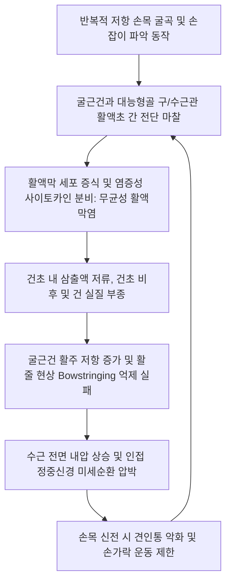

# 🖐️ [[손목 굴곡건초염]] (Wrist Flexor Tenosynovitis)

> **핵심 3줄 요약 (Key Summary)**:
> - 📍 병소 부위 & 해부·병태생리: 손목 전면(Volar wrist)을 주행하는 굴근건군—특히 [[요측수근굴근]](FCR), [[척측수근굴근]](FCU), [[장모지굴근]](FPL) 및 [[천지굴근]](FDS)·[[심지굴근]](FDP)의 윤활건초(Synovial sheath)에 반복적 저항 굴곡 및 마찰로 무균성 염증과 삼출액 저류가 발생하는 질환.
> - 🚩 전형적 임상 양상: 수근 전면 횡문 부근의 국소 압통 및 붓기, 손목을 뒤로 젖힐 때(수동 신전)의 견인통, 저항 수근 굴곡 시 악화되는 날카로운 통증, 진행 시 굴근 활주 제한 및 아침 기상 시 뻣뻣함.
> - 🛠️ 핵심 감별 검사 & 한·양방 다각적 치료 전략: 저항 수근 굴곡·요/척편위 검사, Golfer's Elbow Test, 초음파 건초 삼출액 및 파워도플러 신호 평가. [[태연]](LU9)·[[대릉]](PC7)·[[신문]](HT7)·[[내관]](PC6) 전침, 소염약침(황련해독·신바로) 초음파 유도하 건초주위 주입, 굴근건 활주 추나 및 중립위 야간 부목.
> - ⚠️ 응급 의뢰 레드플래그: 카나벨 4대 징후(Kanavel's four cardinal signs)를 동반한 화농성 굴근건초염(손가락 굴곡위 고정, 대칭적 소시지모양 종창, 굴근초 전체 극심한 압통, 수동 신전 시 극통) $\rightarrow$ 응급 외과적 배농 의뢰.

---

## 📌 목차
1. [질환 개요 & 해부학적 병태생리](#1-질환-개요--해부학적-병태생리)
2. [병태생리 메커니즘 & 생체역학적 악순환 네트워크](#2-병태생리-메커니즘--생체역학적-악순환-네트워크)
3. [임상 증상 & 이학적 검사(Physical Exam) 알고리즘](#3-임상-증상--이학적-검사physical-exam-알고리즘)
4. [감별 진단 매트릭스 (Differential Diagnosis)](#4-감별-진단-매트릭스-differential-diagnosis)
5. [한의 통합 치료 프로토콜 (침·약침·추나·한약)](#5-한의-통합-치료-프로토콜-침약침추나한약)
6. [양방 치료 & 병용·의뢰 기준 (Conventional Treatment & Referral)](#6-양방-치료--병용의뢰-기준-conventional-treatment--referral)
7. [재활 운동 & 생활습관 티칭 가이드](#7-재활-운동--생활습관-티칭-가이드)
8. [💡 사용자 진료실 핵심 필기 & 임상 노하우 (Melt-In 잔여 심화 집약)](#8--사용자-진료실-핵심-필기--임상-노하우-melt-in-잔여-심화-집약)
9. [출처 및 학술 참고 문헌 (References)](#9-출처-및-학술-참고-문헌-references)

---

## 1. 질환 개요 & 해부학적 병태생리

![[손목굴곡건초염_01_굴곡건염부종_실사.jpg|480]]
> [그림 1: ① 질환/병태생리 임상 실사 — 수근 굴근건초염 환부] 손목 전면(Volar wrist) 굴근건 주행로를 따라 발생한 염증성 종창과 건초 비후 소견.

* **질환 정의 및 개요**:
  * 손목 굴곡건초염(Wrist Flexor Tenosynovitis)은 전완 전면에서 기시하여 수근골 및 중수골 기저부로 부착하는 수근 굴근건군(FCR, FCU) 및 수지 굴근건군(FDS, FDP, FPL)을 둘러싼 윤활막성 건초에 만성 마찰과 기계적 부하로 인해 삼출액 저류, 활액막 비후 및 통증이 유발되는 질환이다.
  * 배측에 발생하는 [[드퀘르벵 증후군]]에 비해 간과되기 쉬우나, 수근부 전면 통증의 주요 원인이며 수근관 내압을 상승시켜 2차적 정중신경 포착을 유발할 수 있다.
* **해부학적 구조와 세부 주행 경로**:
  * **[[요측수근굴근]](Flexor Carpi Radialis, FCR)**:
    * 상완골 내측상과에서 기시하여 전완을 비스듬히 가로질러 주상골 결절 부근을 지나 제2·3중수골 기저부 바닥에 부착.
    * 대능형골(Trapezium)의 좁은 섬유-골성 터널(Trapezium groove)을 통과하므로 이 부위에서 마찰과 건 파열 위험이 가장 높음([Bouredoucen H, 2026](https://pubmed.ncbi.nlm.nih.gov/42696839/)).
  * **[[척측수근굴근]](Flexor Carpi Ulnaris, FCU)**:
    * 두상골(Pisiform)에 종지하고 유두골 및 제5중수골로 인대를 뻗음. 윤활건초가 없으나 두상골 부착부 건병증 및 석회성 건염 호발.
  * **수지 굴근건 및 방사골/척골 활액낭 (Radial & Ulnar Bursae)**:
    * FPL 건은 요측 활액낭, FDS/FDP 건은 척골 활액낭에 싸여 수근관을 통과하며, 과사용 시 건초염이 수근관 내부를 직접 압박함.
* **호발 역학 및 유발 요인**:
  * 손목을 강하게 굴곡하고 비트는 작업(골프, 라켓 스포츠, 목공, 주방 조리, 배관 작업).
  * 류마티스 관절염, 통풍, 당뇨병 및 갑상선 질환 환자에서 호발.

---

## 2. 병태생리 메커니즘 & 생체역학적 악순환 네트워크

![[내측상과_공통굴근건_해부도.png|500]]
> [그림 2: ② 관련 해부 구조물 — 전완 굴근건 및 기시부 해부도] 상완골 내측상과에서 시작하여 전완 전면을 주행하는 공통 굴근건의 해부학적 배치와 역학적 연결.

### 1) 마찰 유발성 활액막염 및 퇴행 과정
* **건-활액초 복합체의 역학적 한계**:
  * FCR 건은 대능형골 능선(Trapezial ridge) 위를 지나갈 때 각도가 꺾이면서 국소 접촉압이 급증한다.
  * 반복 굴곡 시 건초 내 압력이 상승하여 활액막의 미세 순환이 저하되고 허혈성 삼출액이 생성된다.
* **수근관 내 굴근건 비후의 연쇄 반응**:
  * FDS/FDP 건초의 만성 비후는 수근관 내부 부피를 잠식하여 [[수근관 증후군]]을 유발하는 가장 흔한 선행 기전이 된다.

---

## 3. 임상 증상 & 이학적 검사(Physical Exam) 알고리즘

![[golfers_elbow_test_step2_wrist_flexion_resistance.jpg|480]]
> [그림 3: ③ 이학적 검사 — 저항 수근 굴곡 검사] 검사자의 저항에 대항하여 손목을 굴곡시킬 때 전완 굴근건 및 수근 전면 건초 부위 통증 유발 확인.

### 1) 주요 임상 증상
* **국소 압통 및 붓기**:
  * FCR 건초염: 손목 요측 전면(태연혈 근위부), 주상골 및 대능형골 능선 부위의 명확한 압통.
  * FCU 건염: 손목 척측 전면 두상골 바로 근위부 압통.
* **운동 유발통**:
  * **수동 신전통**: 손목을 뒤로 젖힐 때 병변 건이 팽팽하게 늘어나면서 심한 견인통 발생.
  * **저항 굴곡통**: 주먹을 쥐고 손목을 강하게 구부릴 때 건초 부위에 날카로운 통증.
* **활주 걸림 및 마찰음**: 손가락을 쥐었다 펼 때 건초의 협착으로 인한 삐걱거림 감지.

### 2) 단계별 이학적 검사 알고리즘
* **1단계: 해부학적 건 주행로 촉진**:
  * 환자에게 손목을 가볍게 굴곡시키고 엄지와 소지를 맞대게 하여(대립 동작) 도드라지는 장장근건(PL) 외측의 FCR 건, 내측의 FCU 건을 따라 압통 확인.
* **2단계: 저항 수근 굴곡 및 편위 검사 (Resisted Wrist Flexion & Deviation)**:
  * 요측 편위 저항 굴곡 $\rightarrow$ FCR 건초염 양성.
  * 척측 편위 저항 굴곡 $\rightarrow$ FCU 건초염 양성.
* **3단계: 감염성 건초염 배제 (Kanavel Sign 검사)**:
  * 전신 발열, 백혈구 증가, 수지 전체의 대칭적 부종 동반 여부 반드시 확인.

---

## 4. 감별 진단 매트릭스 (Differential Diagnosis)

| 감별 질환 | 주요 통증 부위 | 결정적 유발 동작 | 특징적 감별 포인트 |
| :--- | :--- | :--- | :--- |
| **[[손목 굴곡건초염]]** | 손목 전면(요측/척측 횡문) | 저항 수근 굴곡, 수동 손목 신전 | FCR/FCU 건 주행로 국소 압통, 손끝 저림 없음 |
| **[[수근관 증후군]]** | 손바닥 및 제1~3수지 장측 | 야간 수면 중 저림, 손 털기 | **[[팔렌 검사]], [[티넬 징후]] 양성**, 감각 저하 |
| **[[드퀘르벵 증후군]]** | 손목 요골 경상돌기(배측) | 엄지 외전/신전, 척측 편위 | **[[핀켈스타인 검사]] 양성**, 제1신전구획 병변 |
| **주상골 골절 / 관절염** | 해부학적 코담배갑(Snuff box) | 엄지 축 압박, 손목 배굴 | X-ray 골절선 또는 STT 관절 퇴행 변화 |
| **화농성 굴근건초염** | 수지 및 수근 전면 전반 | 경미한 수동 신전에도 극통 | **카나벨 4대 징후**, 발열, 응급 배농 필요 |

---

## 5. 한의 통합 치료 프로토콜 (침·약침·추나·한약)

![[수부질환_05_수부침치료실사_수지침.jpg|480]]
> [그림 4: ④ 한의 치료 술기 실사 — 전완 및 수근 전면 침구 치료] 대릉·태연·내관 등 수근 전면 경혈에 자침하여 건초 주변의 미세혈류 순환을 촉진하고 염증을 흡수시키는 임상 술기.

### 1) 침구 치료 및 전침 요법
* **선혈 프로토콜**:
  * **FCR 병변**: [[태연]](LU9), [[열결]](LU7), [[척택]](LU5), [[공최]](LU6).
  * **수근관/수지굴근 병변**: [[대릉]](PC7), [[내관]](PC6), [[곡택]](PC3), [[노궁]](PC8).
  * **FCU 병변**: [[신문]](HT7), [[영도]](HT4), [[소해]](HT3).
* **전침 자극 파형**:
  * 태연(LU9) - 척택(LU5) 또는 대릉(PC7) - 내관(PC6)에 연결.
  * **2Hz 저주파 연속파**로 15~20분간 자극하여 염증 조직의 부종 배출과 건초 활주 개선 유도.

### 2) 약침 치료 (Pharmacopuncture)
* **제제 처방**:
  * 급성 삼출성 염증기: **황련해독탕 약침** 또는 **중성어혈 약침** 0.5~1.0cc.
  * 만성 협착·유착기: **신바로 약침** 또는 **태반(자하거) 약침** 1.0cc.
* **시술 방법**:
  * 건 실질 내 자입을 피하고 건초 외막 주변 결합조직에 얕게 분할 주입하여 수력박리(Hydrorelease)를 유도함([Kimura H, 2026](https://pubmed.ncbi.nlm.nih.gov/42647349/)).

### 3) 수근 굴근건 이완 추나
* **전완 굴근군 스트리핑 기법**: 내측상과에서 수근 전면으로 이어지는 근복부의 팽팽한 긴장 띠를 따라 무지 압박 및 신장 테크닉 적용.
* **수근간 관절(Intercarpal joint) 신연 교정**: 두상골, 주상골의 외측 유동성을 증가시켜 굴근건이 통과하는 터널의 기계적 협착 완화.

### 4) 한약 치료 (변증 시치)
* **습열조체형(濕熱阻滯型)**: 국소 열감, 종창, 붉어짐 $\rightarrow$ [[사묘환]](四妙丸), [[당귀염통탕]](當歸拈痛湯).
* **어혈응체형(瘀血凝滯型)**: 찌르는 듯한 고정 통증, 야간 심화 $\rightarrow$ [[활혈통기산]](活血通氣散), [[도인승기탕]](桃仁承氣湯) 가감.
* **기혈허약형(氣血虛弱型)**: 만성 건초염, 손에 힘이 안 들어감 $\rightarrow$ [[보중익기탕]](補中益氣湯), [[대방풍탕]](大防風湯).

---

## 6. 양방 치료 & 병용·의뢰 기준 (Conventional Treatment & Referral)

* **보존적 치료**:
  * 경구 NSAIDs 투여 및 단기 안정 고정.
* **초음파 유도하 건초 내 스테로이드 주사(US-guided CSI)**:
  * FCR 건염에서 초음파 가이드 없이 맹검 주사 시 정중신경 수장피하지 손상 또는 FCR 건 파열 위험이 높으므로 반드시 정밀 초음파 유도하에 시행되어야 함([Park SH, 2026](https://pubmed.ncbi.nlm.nih.gov/42351449/)).
* **수술적 유리술 (Tenosynovectomy & Release)**:
  * 대능형골 구 내에서 지속적인 건 마찰로 건 부분 파열이 우려되거나 6개월 이상 보존적 요법에 반응하지 않는 경우 건초 절제 및 감압술 시행.
* **응급 외과 의뢰 기준**:
  * 감염성 활액막염(Kanavel 징후 양성) 확인 즉시 3차 정형외과 응급실 전원.

---

## 7. 재활 운동 & 생활습관 티칭 가이드

![[손목과사용증후군_07_손목신전스트레칭.jpg|480]]
> [그림 5: ⑤ 재활 운동 — 수근 굴근 자가 신장 운동] 팔꿈치를 완전히 펴고 손바닥을 전방으로 향하게 한 뒤 반대 손으로 손가락을 당겨 굴근건을 이완시키는 동작.

![[손목과사용증후군_07_수부스트레칭.jpg|480]]
> [그림 6: ⑥ 재활 운동 — 건 활주 및 내재근 운동] 손가락 마디를 단계별로 굽히고 펴는 굴근건 글라이딩(Tendon gliding)을 통해 유착 방지.

### 1) 굴근건 자가 스트레칭 프로토콜
* **벽 밀기 손목 신전 스트레칭**:
  * 벽에 손바닥을 대고 손가락이 아래를 향하도록 한 상태에서 팔꿈치를 펴고 서서히 체중을 실어 전완 굴근을 15초간 신장, 3회 반복.
* **FDS & FDP 건 활주 운동 (Tendon Gliding)**:
  * Hook fist $\rightarrow$ Full fist $\rightarrow$ Straight fist 순서로 움직여 천지굴근과 심지굴근이 건초 내에서 매끄럽게 교차 활주하도록 훈련.

### 2) 생활 관리 수칙
* **파악 동작 수정**: 두꺼운 손잡이 도구 사용, 악기나 운동 기구 손잡이에 완충 그립 테이프 감기.
* **온습포 요법**: 만성 유착기에는 일 2회 15분 온찜질로 국소 혈류 개선.

---

## 8. 💡 사용자 진료실 핵심 필기 & 임상 노하우 (Melt-In 잔여 심화 집약)

> [!TIP] **진료실 임상 진단 & 감별 노하우**
> 1. **FCR 건초염과 STT 관절염의 결정적 감별법**:
>    - 손목 요측 전면이 아플 때 주상-대능형-소능형(STT) 관절염과 FCR 건초염은 위치가 거의 겹친다. 감별 포인트는 **저항 손목 굴곡**이다. STT 관절염은 손목을 비틀거나 누를 때 아프지만, 저항을 준 상태에서 손목을 구부릴 때 명확한 통증이 재현된다면 FCR 건초염이 주원인이다([Bouredoucen H, 2026](https://pubmed.ncbi.nlm.nih.gov/42696839/)).
> 2. **수근관 증후군과의 '원인-결과' 관계 인식**:
>    - 손가락이 저리다고 내원한 환자 중 수근관 내 굴근건초염이 근본 원인인 경우가 대단히 많다. 횡수근인대만 풀려고 하지 말고, 전완 굴근건의 압통점을 찾아 자침과 약침으로 건초 부종을 가라앉혀 주면 수근관 내압이 극적으로 떨어지며 저림이 소실된다.
> 3. **골프 엘보(내측상과염)와의 동반 치료**:
>    - 손목 굴근건초염 환자는 십중팔구 상완골 내측상과의 공통굴근건 기시부에도 만성 병변을 갖고 있다. 손목만 치료하면 며칠 뒤 다시 재발하므로, 반드시 내측상과 부착부(소해, 곡택 주변)를 함께 자침하고 이완해 주어야 근본적 치료가 된다.

---

## 9. 출처 및 학술 참고 문헌 (References)

1. Bouredoucen H, et al. Anatomy, Variants, and Multimodality Imaging of Flexor Carpi Radialis Tendon Pathology and Post-Therapeutic Evaluation. *Eur J Radiol*. 2026;191:112318. [PMID: 42696839](https://pubmed.ncbi.nlm.nih.gov/42696839/)
   - [연구 요약]: 요측수근굴근(FCR)의 대능형골 구 통과 해부학적 특성, 파열 및 건초염의 초음파·MRI 다중 영상 소견과 비수술적·수술적 치료 후 예후 평가 지침.
2. Kimura H, et al. Common Fascial Abnormalities in Five Thumb Pain Conditions: A Fifteen-Point Ultrasound-Guided Fascia Hydrorelease Clinical Protocol. *J Funct Morphol Kinesiol*. 2026;11(3):142. [PMID: 42647349](https://pubmed.ncbi.nlm.nih.gov/42647349/)
   - [연구 요약]: 수근부 및 무지 통증 질환에서 초음파 유도하 근막 수력박리술(Fascia Hydrorelease)의 15개 임상 포인트 프로토콜과 건초-근막 유착 완화 기전 입증.
3. Park SH, et al. An Ultrasonographic Study of the Superficial Radial Nerve in Healthy Subjects: Suggesting a Safe Zone for Wrist Extensor Compartment Injections. *Diagnostics (Basel)*. 2026;16(12):1854. [PMID: 42351449](https://pubmed.ncbi.nlm.nih.gov/42351449/)
   - [연구 요약]: 수근부 주사 및 침구 시술 시 천부 신경(천요골신경 및 정중신경 피하지) 손상을 회피하기 위한 초음파 해부학적 안전 구역(Safe zone) 기준 설정.
