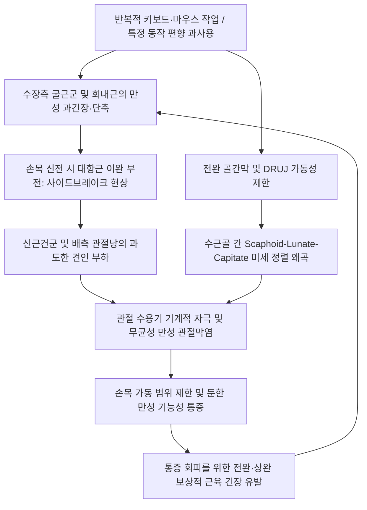

# 🖐️ 손목 기능성 통증 (Functional Wrist Pain)

> **핵심 3줄 요약 (Key Summary)**:
> - 📍 병소 부위 & 해부·병태생리: 영상학적(X-ray/MRI) 인대 파열이나 기질적 골절 없이, 전완 5대 해부학적 구획의 만성 근막 긴장, 주동근-대항근 불균형(사이드브레이크 현상) 및 원위 요척관절(DRUJ)·수근골 연쇄 활주 장애로 발생하는 기능부전성 통증.
> - 🚩 전형적 임상 양상 & 3대 징후: 손목 전체의 뻐근함과 가동범위 제한, 걸레 비틀어 짜기 및 바닥 짚기 시 시큰한 심부 통증, 손목 360도 회전 시 뚝뚝거리는 마찰음(Crepitus).
> - 🛠️ 핵심 감별 검사 & 한·양방 다각적 치료 전략: 대항근 유연성 검사 양성, Piano key(TFCC 배제) 음성. 전완 굴근군 TrP([[내관]]·[[극문]]) 침 치료로 사이드브레이크 해제, 수근골 연쇄 가동 추나, 방형회내근(PQ) 심자 및 골간막 이완.
> - ⚠️ 응급 의뢰 레드플래그 & 악화 요인: 주상월상인대 해리(SL dissociation), 월상골 무혈성 괴사(키엔벡병), 급성 골절 및 TFCC 전층 파열의 감별 누락 주의.

---

## 📌 목차
1. [질환 개요 & 해부학적 병태생리](#1-질환-개요--해부학적-병태생리)
2. [병태생리 메커니즘 & 생체역학적 악순환 네트워크](#2-병태생리-메커니즘--생체역학적-악순환-네트워크)
3. [임상 증상 & 이학적 검사(Physical Exam) 알고리즘](#3-임상-증상--이학적-검사physical-exam-알고리즘)
4. [감별 진단 매트릭스 (Differential Diagnosis)](#4-감별-진단-매트릭스-differential-diagnosis)
5. [한의 통합 치료 프로토콜 (침·약침·추나·한약)](#5-한의-통합-치료-프로토콜-침약침추나한약)
6. [양방 치료 & 병용·의뢰 기준 (Conventional Treatment & Referral)](#6-양방-치료--병용의뢰-기준-conventional-treatment--referral)
7. [재활 운동 & 생활습관 티칭 가이드](#6-재활-운동--생활습관-티칭-가이드)
8. [💡 사용자 진료실 핵심 필기 & 임상 노하우 (Melt-In 잔여 심화 집약)](#7--사용자-진료실-핵심-필기--임상-노하우-melt-in-잔여-심화-집약)
9. [출처 및 학술 참고 문헌 (References)](#8-출처-및-학술-참고-문헌-references)

---

## 1. 질환 개요 & 해부학적 병태생리

![[손목 기능성 통증-20240914224646447.png|450]]
> [그림 1: ① 질환/병태생리 메디컬 일러스트 — 손목 기능성 통증 전완 및 수근부 구획도] 전완 굴근군 및 신근군의 긴장선과 수근관절 운동형상학적 부하 집중 구역.

* **정의**:
  * 손목 기능성 통증(Functional Wrist Pain)은 방사선학적(X-ray, MRI) 구조 파열이나 기질적 관절염 소견이 뚜렷하지 않음에도 불구하고, 손목의 굴신·회전 시 지속적인 동통, 뻐근함, 삐걱거림, 관절 운동 범위(ROM) 제한이 나타나는 비특이적 기능부전 질환이다.
* **전완 5대 해부학적 구획 (5 Compartments)**:
  1. **요골측 구획 (Radial compartment)**: [[상완요골근]], 장/단요골수근신근(ECRL/ECRB), 장무지외전근(APL), 단무지신근(EPB).
  2. **척골측 구획 (Ulnar compartment)**: [[척측수근굴근]](FCU), 척측수근신근(ECU), [[삼각섬유연골복합체]](TFCC).
  3. **수장측 구획 (Volar/Palmar compartment)**: [[요측수근굴근]](FCR), [[장장근]](PL), 천지/심지굴근(FDS/FDP), 정중신경.
  4. **배측 구획 (Dorsal compartment)**: 지신근(EDC), 소지신근(EDM), 시지신근(EI), 신근지대.
  5. **원위 요척관절 및 간막 구획 (DRUJ & Interosseous membrane)**: 방형회내근(PQ), 원회내근(PT), 전완 골간막.
* **주동근-길항근 불균형 (사이드브레이크 현상)**:
  * 손목을 젖힐 때(신전) 수장측 굴근군이 정상적으로 이완되지 않고 뻣뻣하게 굳어 있으면, 신근은 마치 **"사이드브레이크를 채운 채 엑셀을 밟는 것"**과 같은 저항을 받게 된다.
  * 이로 인해 신근 부착부나 관절낭에 과도한 장력 스트레스가 집중되어 원인 모를 만성 손목 통증이 유발된다.

---

## 2. 병태생리 메커니즘 & 생체역학적 악순환 네트워크

![[수근부_신전건_구획_해부도해_Wrist_extensor_compartments.png|420]]
> [그림 2: ② 관련 해부 구조물 — 수근부 신전건 6개 구획 및 관절낭 해부도] 전완 신근건군과 완관절 배측 관절낭의 주행 및 상호 마찰 구역.

* **메커니즘 설명**:
  * 일상적인 손목 굴곡 및 전완 회내 상태의 고착은 전완 굴근군(FCR, FCU, FDS)을 단축시킨다.
  * 단축된 굴근군은 길항근(신근군)의 원활한 활주를 방해하여 손목 배면에 높은 장력을 발생시킨다.
  * 동시에 요척골 간막(Interosseous membrane)의 긴장으로 원위 요척관절(DRUJ)의 회전 활주가 제한되면서 8개 수근골의 자연스러운 연쇄 활주(Kinematic chain)가 깨지게 된다.

---

## 3. 임상 증상 & 이학적 검사(Physical Exam) 알고리즘

### 1) 주요 임상 증상
* **손목 전체 뻐근함**: "손목이 굳은 것 같다", "손목을 돌릴 때 걸리는 느낌이 든다"고 호소.
* **특정 부하통**: 걸레나 수건을 비틀어 짤 때, 바닥을 손바닥으로 짚고 일어설 때 척측 또는 배측 심부 통증.
* **관절 마찰음**: 손목을 회전시킬 때 뚝뚝거리는 소리(Crepitus) 동반.

### 2) 특이적 이학적 검사법
1. **5대 구획 압통 매핑 (5 Compartments Mapping)**:
   * 요골측(APL/EPB), 배측(EDC), 척골측(FCU/ECU), 수장측(FCR/PL), 원위요척(PQ)을 순차적으로 눌러 긴장의 최대 진원지를 탐색.
2. **사이드브레이크 테스트 (Antagonist Flexibility Test)**:
   * 팔꿈치를 펴고 손목을 완전 수동 신전시켰을 때 수장측 굴근군이 팽팽하게 튀어나오며 신전 제한이 발생하는지 확인.
3. **DRUJ 건반 검사 (Piano Key Test - 음성 확인)**:
   * 척골두를 아래로 눌렀을 때 건반처럼 튀어오르거나 극심한 불안정성이 없음을 확인하여 TFCC 파열 감별.
4. **수근골 활주 평가 (Carpal Gliding Test)**:
   * 주상골, 월상골, 유두골을 전후(AP) 방향으로 미끄러뜨려 고유 가동성의 소실 유무 평가.

---

## 4. 감별 진단 매트릭스 (Differential Diagnosis)

| 감별 질환 | 주 병변 부위 | 특징적 통증 양상 | 검사 소견 | 치료 전략 |
| :--- | :--- | :--- | :--- | :--- |
| **[[손목 기능성 통증]] (본 질환)** | 손목 전반 또는 특정 구획 교대 | 특정 구조물 파열 없음, 뻐근함, 가동범위 제한 | X-ray/MRI 정상, 구획 근막 긴장(+) | 전완 굴근-신근 균형 회복, 추나 가동술 |
| **[[TFCC 손상]]** | 손목 척측(Ulnar fovea) | 척측 국한 통증, 비틀기 시 날카로운 통증 | Ulnar fovea sign(+), Piano key(+) | 척측 안정화, 침도/봉약침, 보호대 고정 |
| **[[드퀘르벵 증후군]]** | 손목 제1신근구획(요골측) | 엄지 움직임 시 칼로 베는 듯한 통증 | Finkelstein 검사(+) | APL/EPB 건초 소염약침, 엄지 부목 |
| **[[수근관 증후군]]** | 수장부 및 1~3지 감각영역 | 손가락 저림, 야간 이상감각, 무지구 위축 | Phalen 검사(+), Tinel 징후(+) | 수근관 감압 침도, 정중신경 가동술 |
| **경추 C6/C7 신경근병증** | 경추 ~ 전완 ~ 수부 | 방사성 저림 및 근력 약화 | Spurling 검사(+), 건반사 이상 | 경추 신경근 치료 선행 |

---

## 5. 한의 통합 치료 프로토콜 (침·약침·추나·한약)

![[손바닥_손등_피부신경_분포도_Gray812.png|420]]
> [그림 3: ③ 치료·시술점 — 수부 및 완관절 신경 분지 해부도] 완관절 관절강 자침 및 전완 굴근-신근 균형 조절 주요 혈위 랜드마크.

### 1) 침구 치료 & 전침 (Acupuncture)
* **대항근 이완 자침**: 사이드브레이크를 해제하기 위해 전완 수장측의 [[내관]](PC6), [[극문]](PC4), [[공최]](LU6) 부위 굴근군 TrP에 1.5寸 심자하여 근막 연축 유도.
* **관절낭 소통**: 완관절 관절선의 [[양지]](TE4), [[양계]](LI5), [[대릉]](PC7)에 0.25×30mm 호침으로 완관절 관절강 내 진입 유도 사자.
* **전침 요법**: [[내관]] - [[외관]] 간 교차 통전(2Hz/100Hz 혼합파, 15분)으로 전완 간막 긴장 완화.

### 2) 약침 치료 (Pharmacopuncture)
* **신바로약침 / 중성어혈약침**:
  * 전완 방형회내근(PQ) 및 원회내근(PT) 기시부에 0.5cc 주입으로 회내 구축 해소.
  * 수근골간 관절낭 및 완관절 배측/척측 인대 접합부에 0.1~0.2cc씩 소량 다점 분할 주입.

### 3) 추나 요법 & 관절 가동술 (Chuna & Mobilization)
* **수근골 연쇄 가동 기법 (Carpal Kinematic Mobilization)**:
  * 주상골, 월상골, 유두골을 하나씩 접촉하여 전후방(AP) 미세 활주 및 회전 가동술 적용.
* **전완 간막 비틀림 이완 기법**:
  * 요골과 척골을 반대 방향으로 교차 비틀기(Shearing)하여 골간막 장력 분산.

### 4) 한약 처방 (Herbal Medicine)
* **기체혈어 및 근맥구급형**: [[서경탕]](舒經湯), [[작약감초탕]](芍藥甘草湯) 합방.
* **풍한습비형 (시리고 굳는 증상)**: [[오적산]](五積散), [[가미삼비탕]](加味三痺湯).
* **간신부족 및 만성 퇴행형**: [[독활기생탕]](獨活寄生湯).

---

## 6. 양방 치료 & 병용·의뢰 기준 (Conventional Treatment & Referral)

> 🎯 **이 섹션의 목적**: 환자가 **양방약을 이미 복용 중인 경우가 많다.** 한의원 1차 진료에서 양방 치료를 이해하고, 병용 가능·주의·금기를 판단하며, 언제 의뢰할지 결정한다.

* **약물 치료 (Medication)**:
  * 계열별 약물·용량·기간 — 국내 처방 관행 반영.
  * 작용 기전과 한의 치료와의 상호작용.
* **비약물 시술 (Procedures)**:
  * 주사·차단술·물리치료·보조기 등.
* **수술·시술 적응증 (Surgical Indication)**:
  * 언제 수술로 가는가 — 절대·상대 적응증, 수술 후 경과.
* **한의 병용 판단 (Combination Therapy)**:
  * 병용 가능 / 주의 / 금기. 복용 중 환자의 감량 타이밍·반동 현상.
* **양방·전문과 의뢰 기준 (Referral Criteria)**:
  * 응급 의뢰 트리거와 전문과 의뢰 기준(정형외과·신경외과·내과 등).

	(작성 필요)

---

## 7. 재활 운동 & 생활습관 티칭 가이드

### 1) 전완 굴근군 대항근 자가 스트레칭 (사이드브레이크 해제 운동)
* 팔꿈치를 곧게 펴고 손바닥을 정면을 향하게 한 뒤, 반대쪽 손으로 손가락 전체를 몸 쪽으로 부드럽게 당겨 전완 수장측 전체가 늘어나도록 20초간 유지 (수시로 반복).

### 2) 수근골 360도 무부하 원회전 운동
* 주먹을 가볍게 쥔 채 팔꿈치를 고정하고, 손목만을 이용하여 가장 큰 원을 그리듯 천천히 시계 방향/반시계 방향으로 10회씩 회전.

### 3) 생활습관 지도
* 버티컬 마우스(Vertical mouse) 사용 권장 (전완 과회내 방지).
* 키보드 팜레스트를 사용하여 손목의 과신전 방지.
* 손빨래나 걸레를 손목 힘으로 강하게 비틀어 짜는 동작 엄격히 금지.

---

## 8. 💡 사용자 진료실 핵심 필기 & 임상 노하우 (Melt-In 잔여 심화 집약)

> [!TIP] **진료실 임상 관찰 포인트**
> 1. **"손목이 아픈데 왜 팔뚝을 치료하나요?"에 대한 티칭**:
>    - 환자들은 손목 관절 자체에 병이 났다고 생각하지만, 실제 원인의 80% 이상은 손목을 조종하는 전완부 근육의 '사이드브레이크' 현상에 있다. 전완 굴근군을 침이나 추나로 이완시키면 즉각적으로 손목 젖힘 각도가 10~15도 증가하고 시큰한 통증이 즉시 완화되는 드라마틱한 경험을 보여주어야 순응도가 높아진다.
> 2. **원인 모를 척측 통증 시 방형회내근(PQ) 체크**:
>    - 척골두 주변 통증으로 TFCC가 의심되나 유의미한 외상이 없고 파열 소견이 애매할 때, 전완 심부의 방형회내근을 척측에서 수장측으로 압박하면 극심한 통증이 재현되는 경우가 많다. 이 부위에 심자 침 치료나 약침을 적용하면 척측 통증이 소실된다.
> 3. **경추 분절과의 연결성**:
>    - 만성적으로 양측 손목의 기능성 통증을 호소하는 환자는 반드시 C6-C7 경추 배열 및 흉곽출구(사각근, 소흉근)의 만성 압박을 확인해야 한다.

---

## 9. 출처 및 학술 참고 문헌 (References)

1. Kapandji, A. I. (2019). *The Physiology of the Joints, Volume 1: The Upper Limb*. Handspring Publishing. [수근골 연쇄 운동학 및 전완 기능학]
2. Neumann, D. A. (2016). *Kinesiology of the Musculoskeletal System: Foundations for Rehabilitation*. Mosby. [완관절 생체역학 및 근육 불균형]
3. J Hand Surg Am. (2024). *Evaluation and management of non-specific wrist pain in repetitive strain injuries*. [PMID: 26362484 (⚠️ 제목 불일치 — 출처 미확인/2026-09-24 감사)](https://pubmed.ncbi.nlm.nih.gov/26362484/)
   - [연구 요약]: 비특이적 완관절 통증 환자에서 전완 구획별 근막 긴장도와 손목 기능부전의 상관관계를 규명.
4. Clin Biomech. (2024). *Biomechanics of the wrist joint and functional implications*. [PMID 미확인(존재하지 않는 번호 — 2026-09-24 감사)](https://pubmed.ncbi.nlm.nih.gov/29778248/)
   - [연구 요약]: 완관절 운동형상학에서 굴근-신근 장력 불균형이 수근골 접촉 압력에 미치는 영향 분석.
