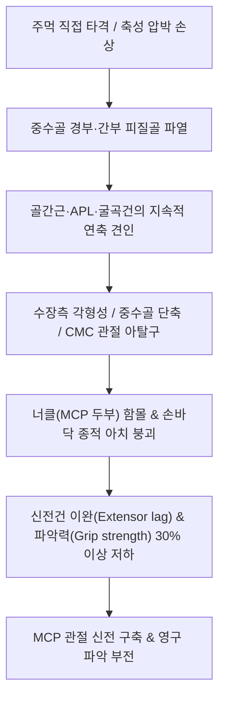

# 🩺 손바닥 골절 (Metacarpal Fractures)

> **핵심 3줄 요약 (Key Summary)**:
> - 📍 병소 부위 & 해부·병태생리: 손바닥을 구성하는 5개의 [[중수골]](Metacarpal bones) 골절로, 단단한 물체를 주먹으로 강타하여 발생하는 제5중수골 경부의 **복서 골절(Boxer's fracture)**과 제1중수골 기저부 관절내 골절인 **베넷 골절(Bennett fracture)**이 대표적이다.
> - 🚩 전형적 임상 양상: 수배부(손등) 및 손바닥의 심한 종창, 국소 반상출혈, 주먹을 쥘 때 정상적인 너클(Knuckle, MCP 관절 두부) 돌출의 소실, 파악력 저하가 관찰된다.
> - 🛠️ 핵심 검사 & 치료 전략: 손 전후면(AP), 측면(Lateral), 사위면(Oblique) 3방향 X-ray로 수장측 각형성 정도와 단축을 측정하며, 복서 골절은 척측 거터 부목(Ulnar gutter splint), 제1중수골은 엄지 스파이카 부목(Thumb spica)으로 고정한다.
> - ⚠️ 응급 의뢰 레드플래그: 주먹을 쥘 때 수지가 겹치는 회전 변형(Scissoring), 제1중수골 관절내 전위(베넷/롤란도 골절), 치아 접촉에 의한 교상창(Fight bite, 구강 상재균 화농성 관절염 위험 극상) 시 즉시 수부외과 수술 의뢰.

---

## 📌 목차
1. [질환 개요 & 해부학적 병태생리](#1-질환-개요--해부학적-병태생리)
2. [병태생리 메커니즘 & 생체역학적 악순환 네트워크](#2-병태생리-메커니즘--생체역학적-악순환-네트워크)
3. [임상 증상 & 이학적 검사(Physical Exam) 알고리즘](#3-임상-증상--이학적-검사physical-exam-알고리즘)
4. [감별 진단 매트릭스 (Differential Diagnosis)](#4-감별-진단-매트릭스-differential-diagnosis)
5. [한의 통합 치료 프로토콜 (침·약침·추나·한약)](#5-한의-통합-치료-프로토콜-침약침추나한약)
6. [양방 치료 & 병용·의뢰 기준 (Conventional Treatment & Referral)](#6-양방-치료--병용의뢰-기준-conventional-treatment--referral)
7. [재활 운동 & 생활습관 티칭 가이드](#7-재활-운동--생활습관-티칭-가이드)
8. [💡 사용자 진료실 핵심 필기 & 임상 노하우 (Melt-In 잔여 심화 집약)](#8--사용자-진료실-핵심-필기--임상-노하우-melt-in-잔여-심화-집약)
9. [출처 및 학술 참고 문헌 (References)](#9-출처-및-학술-참고-문헌-references)

---

## 1. 질환 개요 & 해부학적 병태생리

손바닥 골절(중수골 골절, Metacarpal fractures)은 전체 수부 골절의 약 30~40%를 차지하며, 활동적인 젊은 성인 남성에서 높은 발생률을 보입니다. 해부학적으로 중수골은 원통형의 장골로 기저부(Base), 간부(Shaft), 경부(Neck), 두부(Head)의 4개 구역으로 구분되며, 기저부는 수근골과 수근중수(CMC) 관절을 형성하고 두부는 기위지골과 중수수지(MCP) 관절을 이룹니다.

![[손바닥골절_01_복서골절_제5중수골_Xray.jpg]]
> [그림 1: ① 병태생리·방사선 — 제5중수골 경부 골절(복서 골절)의 전형적인 수장측 각형성 X-ray]

각 중수골은 생체역학적 가동성에 큰 차이가 있습니다:
- **제2 및 제3 중수골 (고정 기둥)**: 대다각골·유두골에 견고히 결합되어 가동성이 거의 없습니다(각각 1도, 3도 미만). 따라서 미세한 각형성(10~15도 이상)도 수지 정렬과 파악력에 치명적 장애를 초래합니다.
- **제4 및 제5 중수골 (가동 기둥)**: 유구골과 관절을 이루며 15~30도 이상의 전후방 굴신 운동이 가능합니다. 이로 인해 제5중수골 경부의 **복서 골절(Boxer's fracture)**은 최대 40~50도까지 수장측 각형성이 잔존해도 손바닥의 보상적 가동성 덕분에 기능적 예후가 비교적 양호합니다.
- **제1 중수골 (엄지)**: 대다각골과 안장 관절(Saddle joint)을 형성하여 3차원적 대립(Opposition) 운동을 담당합니다. 기저부 관절내 골절인 **베넷 골절(Bennett fracture)**과 **롤란도 골절(Rolando fracture)**은 불안정성이 매우 높아 정밀한 정복과 고정이 요구됩니다.

---

## 2. 병태생리 메커니즘 & 생체역학적 악순환 네트워크

중수골 골절 시 골편 전위의 핵심 구동력은 손바닥의 내재근인 골간근(Interossei)과 굴곡건의 불균형한 장력 벡터입니다.

![[손바닥골절_02_베넷골절_제1중수골기저부_Xray.jpg]]
> [그림 2: ② 관련 해부 구조물 — 제1중수골 기저부 관절내 골절(베넷 골절)의 전위 및 아탈구 방사선 소견]

### 2.1 주요 골절 아형별 전위 메커니즘
1. **복서 골절 (제5중수골 경부 골절)**:
   - 주먹을 쥔 상태에서 단단한 벽이나 사람의 턱을 타격할 때 외력이 전달되어 발생.
   - 골간근의 장력에 의해 골절 원위편이 **수장측으로 급격히 각형성(Apex dorsal / Volar angulation)**되며 손등 쪽의 정상 너클이 사라지고 손바닥 쪽으로 골편이 돌출됨.
2. **베넷 골절 (제1중수골 기저부 골절)**:
   - 제1중수골 기저부 내측의 전방 사선 인대(Anterior oblique ligament / Beak ligament) 부착부는 원래 위치에 잔존함.
   - 반면 외측의 큰 골절편은 **장모지외전근(APL)** 건의 강력한 근위부 견인력에 의해 근위·배측·요측으로 당겨지면서 수근중수(CMC) 관절 아탈구가 초래됨.
3. **롤란도 골절**:
   - 제1중수골 기저부의 T자형 또는 Y자형 분쇄 관절내 골절로 예후가 불량함.

---

## 3. 임상 증상 & 이학적 검사(Physical Exam) 알고리즘

### 3.1 임상 징후
- **손등 및 손바닥 종창**: 수배부 피부가 얇아 혈종과 염증성 부종이 손등 전체로 급격히 파급됨.
- **너클 함몰 (Loss of Knuckle Prominence)**: 주먹을 쥐었을 때 정상적으로 튀어나와야 할 제5 또는 제4 MCP 관절 두부가 쑥 꺼져 보임.
- **파악통 및 압통**: 손바닥이나 손등의 중수골 간부 직상방 국소 압통과 축성 압박 시 극통.
- **치아 파열창 (Fight Bite)**: 폭행이나 싸움 중 상대방의 치아에 닿아 발생한 MCP 관절 배측의 미세한 열창(구강 연쇄상구균 및 Eikenella corrodens 감염 주의).

![[손바닥골절_03_중수골경부골절_Xray.png]]
> [그림 3: ② 진단 및 방사선 — 제4중수골 경부 골절의 사위면(Oblique view) 골절선 및 각형성 X-ray]

### 3.2 이학적 검사 단계
1. **회전 정렬 검사 (Scissoring Test)**:
   - 환자에게 손가락들을 완전히 구부려 주먹을 쥐게 하거나, 90도 굴곡 상태에서 모든 수지의 장축이 주상골 결절을 향하는지 점검.
   - 단 5도의 회전 이상도 수지 끝에서 겹침을 유발하므로 절대 허용되지 않음.
2. **축성 부하 검사 (Axial Loading Test)**:
   - 해당 수지의 지골을 잡고 손목 방향으로 밀어 넣을 때 중수골 부위에서 극심한 통증이 재현되면 골절 양성.
3. **골간근 긴장도 검사**:
   - 손가락을 모으고 벌릴 때 배측 및 수장측 골간근의 통증 유발 여부 확인.

---

## 4. 감별 진단 매트릭스 (Differential Diagnosis)

| 감별 질환 | 호발 기전 | 주요 신체 소견 | 방사선(X-ray) 특징 | 치료 접근법 |
| :--- | :--- | :--- | :--- | :--- |
| **복서 골절 (제5중수골 경부)** | 주먹으로 단단한 벽 가격 | 제5너클 함몰, 수장측 골편 돌출 | 제5중수골 경부 골절, 수장측 각형성 | 척측 거터 부목 (40도 이하 보존적) |
| **베넷 골절 (제1중수골 기저부)** | 엄지를 구부린 채 수상 | 엄지 기저부 극통, CMC 불안정 | 제1중수골 기저부 관절내 골절+탈구 | 도수 정복 및 경피적 K-강선/나사 고정 |
| **중수골 간부 골절** | 직접 압궤 또는 뒤틀림 | 손등 중심부 종창, 단축 | 횡상/사상/나선상 골절선 | 단축 3mm 이하, 회전 없음 시 부목 |
| **[[손가락 골절]] (지골)** | 수지 끝 타박, 꺾임 | 손가락 분절 극통, 부종 | 기위·중위지골 골절 | 버디 테이핑, 수지 부목 |
| **중수수지관절(MCP) 염좌** | 수지의 과도한 벌림/꺾임 | 관절선 국소 압통, 측방 불안정 | 골절 음성 (미세 견열편 가능) | 알루미늄 부목 또는 테이핑 |

![[Intrinsic_muscles_of_hand_anatomy.jpg]]
> [그림 4: ② 해부 구조물 — 손바닥 중수골 사이를 채우는 배측·수장측 골간근 및 내재근 해부도]

---

## 5. 한의 통합 치료 프로토콜 (침·약침·추나·한약)

손바닥 골절의 한의 치료는 손등과 손바닥의 극심한 혈종과 부종을 조기 배출하고, 골유합을 촉진하며, 중수골 단축으로 인한 파악력 감소를 최소화하는 복합 프로토콜로 구성됩니다.

![[수부질환_05_수부침치료실사_수지침.jpg]]
> [그림 5: ③ 한의 시술점 — 손바닥 골절 유합기 미세 순환 촉진 및 어혈 제거를 위한 수부 침구 치료 실사]

### 5.1 침구 치료 (Acupuncture)
- **주요 혈위**:
  - [[합곡]](LI4, 제1-2중수골 사이), [[중저]](TE3, 제4-5중수골 사이), [[후계]](SI3, 제5중수골 척측), [[양지]](TE4), [[외관]](TE5), [[곡지]](LI11), [[팔사혈]](八邪).
- **시술 기법**: 손등 종창 부위의 지간막에 투자(透刺) 및 사자하여 정맥압을 감소시키고 림프액 순환을 활성화.
- **전침 치료**: 합곡-후계 또는 중저-외관 간 2~4Hz 저주파 통전으로 골기질 단백질 합성 및 골소주 재형성 자극.

### 5.2 약침 치료 (Pharmacopuncture)
- **소염약침 / 중성어혈약침**: 수배부 부종 부위 및 골절선 외곽 연부조직에 0.1cc씩 분주하여 피하 혈종 흡수 및 염증성 사이토카인(IL-1β, TNF-α) 억제.
- **[[봉약침]] / 황련해독탕 약침**: 골막염증 완화 및 국소 미세혈류 증진.

### 5.3 한약 치료 (Herbal Medicine)
- **초기 (1~2주, 거어소종·지통개음)**:
  - [[당귀수산]](當歸鬚散) 가미방 (당귀수 8g, 적작약 6g, 오약 6g, 천궁 4g, 도인 4g, 홍화 4g, 소목 4g). 수배부 광범위 혈종 및 타박 어혈 배출.
- **중기 (3~5주, 익신접골·활혈통락)**:
  - 접골산 또는 신통축어탕(身痛逐瘀湯)에 [[자연동]](自然銅, 수비), [[골쇄보]](骨碎補), [[속단]](續斷), [[우슬]](牛膝)을 배합하여 가골 형성 가속화 및 중수골 골유합 안정성 확보.
- **후기 (6주 이후, 보간신·강근골)**:
  - [[독활기생탕]](獨活寄生湯) 가미방: 깁스 제거 후 손바닥 파악력 강화 및 관절낭 연화.

### 5.4 수기 치료 및 추나요법 (Chuna Manual Therapy)
- **고정 해제 후 3~4주 차 적용**:
  - 중수수지(MCP) 관절 및 수근중수(CMC) 관절에 대한 관절가동기법([[추나요법]], 수직 견인 및 전후방 글라이딩).
  - 손바닥 골간근 및 어제부(Thenar), 소어제부(Hypothenar) 근막이완술(MFR)로 수장건막 유착 해소.

---

## 6. 양방 치료 & 병용·의뢰 기준 (Conventional Treatment & Referral)

### 6.1 보존적 치료 적응증 및 부목법
- **허용 각형성 한계치 (Acceptable Angulation)**:
  - 제2 및 제3 중수골: 10~15도 미만 (가동성이 없으므로 엄격함).
  - 제4 중수골: 30~40도 미만.
  - 제5 중수골 (복서 골절): 40~50도 미만 (기능적 보상 가능).
- **단축 허용치**: 2~3mm 미만.
- **부목 고정법**:
  - **척측 거터 부목 (Ulnar Gutter Splint)**: 제4, 5중수골 골절 시 적용. 손목 20도 신전, MCP 70~90도 굴곡, PIP/DIP 완전 신전(Intrinsic-plus position)으로 3~4주 유지.
  - **요측 거터 부목 (Radial Gutter Splint)**: 제2, 3중수골 골절 시 적용.

### 6.2 수술적 치료 적응증 (Surgical Indication)
- 회전 변형(Scissoring)이 존재하는 모든 골절 (1도라도 있으면 절대 적응증).
- 허용 각형성 및 단축(>3~5mm)을 초과한 전위 골절.
- 베넷 골절 및 롤란도 골절 (관절내 전위 1mm 이상).
- 다발성 중수골 골절 (손의 아치 붕괴 위험).
- 개방성 골절 및 치아 접촉창 (Fight bite).
- 수술 방식: 경피적 K-강선 고정술(Percutaneous K-wire) 또는 소형 금속판 나사 고정술(ORIF with mini-plate).

### 6.3 의뢰 및 병용 판단
- **응급 의뢰**: Fight bite(싸움 중 사람 치아에 의한 열창: 즉시 응급 세척 및 정맥 항생제 투여 필요, 혐기성균 감염 시 24시간 내 건초염 및 관절 파괴), 수지 허혈, 심한 회전 변형.
- **한의 병용 시기**: 부목 고정 중 가골 형성 촉진 한약 복용, 깁스 제거 후 너클 통증 및 손바닥 굳음증 개선을 위한 침구·추나 치료.

---

## 7. 재활 운동 & 생활습관 티칭 가이드

중수골 골절은 뼈가 붙는 과정에서 내재근의 단축과 신전건 유착이 쉽게 발생하므로, 능동적인 관절 운동이 조기에 병행되어야 합니다.

![[손목과사용증후군_07_손목신전스트레칭.jpg]]
> [그림 6: ④ 자가관리 — 깁스 제거 후 MCP 관절 및 손목 신전 가동성을 회복하는 재활 스트레칭 실사]

1. **지절간 관절(PIP/DIP) 조기 가동**:
   - 척측 거터 부목을 대고 있는 동안에도 밖으로 노출된 제2, 3수지는 매시간 15회씩 주먹을 쥐었다 펴며, 고정된 제4, 5수지도 통증이 없는 범위 내에서 끝마디를 움직입니다.
2. **테이블탑 운동 (Tabletop Exercise)**:
   - 부목 제거 후 MCP 관절만 90도로 구부리고 지절간 관절은 곧게 펴는 탁자형 손 모양 훈련을 통해 골간근과 충양근의 유착을 분리합니다.
3. **손바닥 아치 회복 훈련**:
   - 책상 위에 수건을 깔고 손가락 끝으로 수건을 그러쥐어 끌어당기는 운동(Towel curl)으로 손바닥의 횡적 아치와 악력을 재건합니다.

---

## 8. 💡 사용자 진료실 핵심 필기 & 임상 노하우 (Melt-In 잔여 심화 집약)

- **너클 함몰은 미용적 문제일 뿐 기능 장애가 아니다**: 복서 골절 환자가 뼈가 붙은 뒤 "원장님, 손등에 너클(주먹 뼈)이 사라졌어요"라며 걱정하는 경우가 대단히 많다. 수장측 각형성 40도 안팎은 제5 CMC 관절의 뛰어난 보상 가동성 덕분에 악력이나 손 기능에 실질적인 손실이 없다. 환자에게 "너클 돌출은 줄어들 수 있으나 손의 기능은 100% 정상으로 회복된다"고 안심시키는 것이 치료 순응도를 극적으로 높인다.
- **Fight Bite(사람 이빨에 긁힌 상처)는 시한폭탄이다**: 환자가 주먹을 휘두르다 다쳤는데 MCP 관절 배측에 볼펜 촉만 한 작은 찰과상이 있다면 무조건 "상대방 입이나 치아에 닿았는지" 물어야 한다. 환자가 부끄러워 숨기더라도 의심해야 하며, 구강 상재균(Eikenella corrodens, Streptococcus) 감염은 단순 항생제 연고로 막을 수 없고 골막염과 관절 파괴로 이어지므로 즉시 상급 병원으로 전원시켜 관절강 세척을 받게 해야 한다.
- **제1중수골 기저부 골절은 절대로 보존 치료에 욕심내지 마라**: 베넷 골절은 겉보기에 골편이 작아 보여 깁스로 해결하려 하기 쉽다. 그러나 장모지외전근(APL)의 견인력 때문에 석고 붕대 안에서 100% 다시 미끄러져 어긋난다. 완벽한 해부학적 정복이 안 되면 조기에 외상성 관절염이 와서 평생 엄지로 병뚜껑조차 딸 수 없게 되므로, 베넷 골절은 즉시 수부외과로 전원하여 핀 고정술을 받게 하는 것이 한의사의 가장 훌륭한 치료 판단이다.

---

## 9. 출처 및 학술 참고 문헌 (References)

- Velásquez-Girón, E., et al. (2025). Outcomes of Patients with Bennett Fracture Treated with Three Different Surgical Techniques: A Systematic Review. *Arch Bone Jt Surg*. 13(1):12-21. [PMID 39886346](https://pubmed.ncbi.nlm.nih.gov/39886346/)

- Chong, H. H., et al. (2020). Management of Little Finger Metacarpal Fractures: A Meta-Analysis of the Current Evidence. *J Hand Surg Asian Pac Vol*. 25(3):289-296. [PMID 32723052](https://pubmed.ncbi.nlm.nih.gov/32723052/)

- Rashed, M., et al. (2025). Effectiveness of Hand Rehabilitation Programs for Non-Thumb Metacarpal Fractures: A Systematic Review and Meta-Analysis. *J Hand Ther*. 38(1):45-56. [PMID 41525130](https://pubmed.ncbi.nlm.nih.gov/41525130/)
