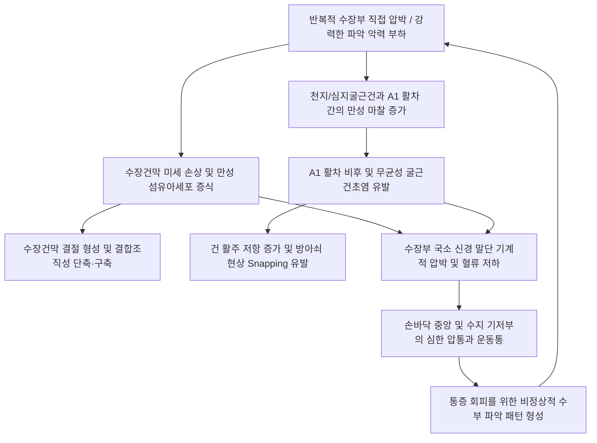

# ✋ 손바닥 통증 (Palmar Pain / 수장통)

> **핵심 3줄 요약 (Key Summary)**:
> - 📍 병소 부위 & 해부·병태생리: 손바닥 중앙 수장건막(Palmar aponeurosis), MCP 관절 수장측 A1 활차(A1 pulley), [[장장근]](Palmaris longus) 긴장 및 수지굴근건(FDS/FDP) 부착부의 만성 미세마찰과 섬유화 구축.
> - 🚩 전형적 임상 양상 & 3대 징후: 손바닥 중앙 결절(Nodule)과 팽팽한 삭상물(Cord), 손가락 신전 시 당김, 손가락 굴신 시 '딸깍' 걸리는 방아쇠 현상 및 [[장장근]] 연관통(손바닥 작열통).
> - 🛠️ 핵심 감별 검사 & 한·양방 다각적 치료 전략: Table Top test(Hueston), A1 활차 압통 및 염발음 평가. A1 활차 종축 침도 박리술, [[장장근]] 근복 심자, [[노궁]](PC8)·[[대릉]](PC7) 소염약침 및 수장건막 횡적 신장 수기.
> - ⚠️ 응급 의뢰 레드플래그 & 악화 요인: 급성 화농성 건초염(Kanavel 4대 징후: 전수지 부종, 굴곡 자세, 건초 압통, 수동 신전통) 감별 시 즉시 외과 배농 의뢰.

---

## 📌 목차
1. [질환 개요 & 해부학적 병태생리](#1-질환-개요--해부학적-병태생리)
2. [병태생리 메커니즘 & 생체역학적 악순환 네트워크](#2-병태생리-메커니즘--생체역학적-악순환-네트워크)
3. [임상 증상 & 이학적 검사(Physical Exam) 알고리즘](#3-임상-증상--이학적-검사physical-exam-알고리즘)
4. [감별 진단 매트릭스 (Differential Diagnosis)](#4-감별-진단-매트릭스-differential-diagnosis)
5. [한의 통합 치료 프로토콜 (침·약침·추나·한약)](#5-한의-통합-치료-프로토콜-침약침추나한약)
6. [양방 치료 & 병용·의뢰 기준 (Conventional Treatment & Referral)](#6-양방-치료--병용의뢰-기준-conventional-treatment--referral)
7. [재활 운동 & 생활습관 티칭 가이드](#6-재활-운동--생활습관-티칭-가이드)
8. [💡 사용자 진료실 핵심 필기 & 임상 노하우 (Melt-In 잔여 심화 집약)](#7--사용자-진료실-핵심-필기--임상-노하우-melt-in-잔여-심화-집약)
9. [출처 및 학술 참고 문헌 (References)](#8-출처-및-학술-참고-문헌-references)

---

## 1. 질환 개요 & 해부학적 병태생리

![[Intrinsic_muscles_of_hand_anatomy.jpg|480]]
> [그림 1: ① 질환/병태생리 메디컬 일러스트 — 수부 내재근 및 수장부 건막 해부도] 수장건막(Palmar aponeurosis)과 천지/심지굴근건, 충양근, 골간근 및 무지구·소지구 고유근의 3차원 해부도.

* **정의**:
  * 손바닥 통증(Palmar Pain, 수장통)은 수장건막(Palmar aponeurosis), 수지굴근건 섬유초(A1 활차), 손바닥 고유 내재근군 및 [[장장근]](Palmaris longus)의 과부하로 인해 결합조직성 비후, 결절, 연관통 및 구축이 발생하는 증후군이다.
* **해부학적 구조**:
  * **수장건막 (Palmar Aponeurosis)**: 삼각형 모양의 두꺼운 섬유성 막으로, 기저는 4개의 세로 밴드로 나뉘어 제2~5지 기위지골 및 A1 활차 부위로 정지하며 손바닥 피부를 단단히 지지한다.
  * **A1 환상 활차 (A1 Annular Pulley)**: 중수수지(MCP) 관절 수장측에 위치하여 천지굴근(FDS)과 심지굴근(FDP) 건이 뼈에서 뜨는 활줄 현상(Bowstringing)을 방지한다.
  * **신경 지배**: [[정중신경]]의 수장피하지가 손바닥 중앙을, [[척골신경]] 천지가 4~5지 수장측을 지배한다.
* **역학 및 호발 대상**:
  * 골프, 테니스, 헬스(바벨/덤벨), 망치질, 가위질 등 손바닥에 직접적인 압박과 마찰을 받는 작업자, 주부, 당뇨병 환자에서 다발한다.

---

## 2. 병태생리 메커니즘 & 생체역학적 악순환 네트워크

![[Palmaris_longus_TriggerPoints.jpg|450]]
> [그림 2: ② 관련 해부 구조물 — 장장근(Palmaris Longus) 발통점 및 손바닥 연관통 도해] 전완 상부 1/3 장장근 근복 TrP에서 손바닥 정중앙 수장건막으로 방사되는 작열통 및 뻐근함 경로.

* **메커니즘 설명**:
  * **수장건막염과 구축**: 반복 마찰로 건막 내 콜라겐 교차결합이 증가하여 결절과 띠(Cord)가 형성되며 손바닥을 펼 때 강한 견인통이 발생한다.
  * **A1 활차 협착**: 굴근건과 A1 활차가 마찰되어 비후되면 힘줄 활주가 차단되어 손가락이 걸리는 방아쇠 수지(Trigger finger)로 진행된다.
  * **장장근(PL)의 연관통**: 전완 굴근 중 장장근 근복의 TrP는 수장건막으로 직접 타는 듯한 작열통을 투사한다.

---

## 3. 임상 증상 & 이학적 검사(Physical Exam) 알고리즘

### 1) 주요 임상 증상
* **손바닥 중앙 욱신거림**: 물건을 쥐거나 바닥을 짚을 때 손바닥 정중앙이 찌릿하게 아픔.
* **결절 및 삭상물(Cord) 촉지**: MCP 관절 수장측 주름 바로 아래에 단단한 멍울이 만져짐.
* **방아쇠 증상**: 손가락을 굽혔다 펼 때 '딸깍' 소리와 함께 걸림.
* **신전 제한**: 손가락을 뒤로 젖힐 때 손바닥이 팽팽하게 당겨 완전히 펴지 못함.

### 2) 특이적 이학적 검사법
1. **A1 활차 압통 및 결절 촉진**:
   - 제2~5지 MCP 관절 수장측 주름 바로 근위부를 압박하며 손가락을 굴신시켜 압통, 마찰음(Crepitus), 결절 이동 확인.
2. **테이블 탑 테스트 (Table Top Test - Hueston)**:
   - 손바닥을 평평한 책상 위에 완전히 밀착시키게 하였을 때 건막 구축으로 손바닥이 뜨면 양성 (듀피트렌 구축 선별).
3. **장장근 발통점 유발 검사**:
   - 엄지와 소지를 맞대고 손목을 굴곡시켜 튀어나오는 장장근 건의 상부 근복을 압박하여 손바닥 통증 재현 여부 확인.
4. **Kanavel 4대 징후 확인 (감염성 건초염 배제)**:
   - 대칭적 소시지 수지 부종, 굴곡 자세 고정, 굴근초 전반 압통, 수동 신전 시 극심한 통증 유무 확인 (있으면 즉시 응급 배농 의뢰).

---

## 4. 감별 진단 매트릭스 (Differential Diagnosis)

| 감별 질환 | 주 병변 부위 | 특징적 촉진 소견 | 운동 이상 | 치료 핵심 |
| :--- | :--- | :--- | :--- | :--- |
| **[[손바닥 통증]] (수장건막염)** | 손바닥 중앙 수장건막 | 수장건막 팽팽한 긴장, 광범위 압통 | 손가락 완전 신전 시 당김 | 건막 이완, 침/약침, 장장근 치료 |
| **[[방아쇠 수지]]** | MCP 관절 수장측 A1 활차 | A1 활차 부위 뚜렷한 결절 및 압통 | 굴신 시 '딸깍' 걸림 현상 | A1 활차 절개 침도요법, 소염약침 |
| **듀피트렌 구축 (Dupuytren)** | 4, 5지 수장건막 및 디지털 밴드 | 단단한 결절과 세로 방향의 섬유성 삭(Cord) | MCP/PIP 관절의 비가역적 굴곡 구축 | 침도 삭상물 절제, 조기 가동 |
| **[[수근관 증후군]]** | 수근관 내부 [[정중신경]] | 횡수근인대 부위 압통/티넬 | 감각 저하(1~3지), 무지구 위축 | 수근관 감압, 정중신경 가동술 |
| **급성 화농성 건초염** | 굴근건초 전반 | 전 수지 원통형 종창, 극심한 열감 | 수동 신전 불능 | **응급 외과 배농 의뢰** |

---

## 5. 한의 통합 치료 프로토콜 (침·약침·추나·한약)

![[손바닥_손등_피부신경_분포도_Gray812.png|420]]
> [그림 3: ③ 치료·시술점 — 손바닥 노궁(PC8) 및 지절간 혈위 해부도] 수장건막 감압 침술, A1 활차 침도 절개 및 신경 혈관 다발 회피 안전 구역.

### 1) 침구 치료 & 침도 요법 (Acupotomy)
* **손바닥 수장건막 감압술**:
  * **[[노궁]](PC8)**, **[[소부]](HT8)** 부위에 0.20×30mm 호침으로 0.3~0.5寸 사자하여 수장건막 내부 장력을 감압.
* **A1 활차 침도 절개술**:
  * 방아쇠 현상이나 결절이 동반된 경우, 0.4×40mm 소침도로 A1 활차의 정중앙선(12시 방향)에서 건의 장축과 평행하게 미세 절개하여 활주 통로 개방 (외측 3시, 9시 방향의 수지 신경 혈관 다발 엄격 회피).
* **장장근(PL) 근복 심자**:
  * 전완 전면 상부 1/3 장장근 TrP에 1.5寸 직자하여 손바닥으로 투사되는 연관통 차단.

### 2) 약침 치료 (Pharmacopuncture)
* **신바로약침 / 중성어혈약침**:
  * A1 활차 주위 건초 및 수장건막 결절 부위에 0.2~0.3cc 미세 주입하여 무균성 염증 및 결절성 비후 억제.
* **봉약침 (Sweet BV)**:
  * 만성화된 수장건막염 부위에 0.1cc 미량 시술하여 건막 리모델링 촉진.

### 3) 추나 요법 & 건막 신장 (Chuna)
* **수장건막 부채꼴 신장 기법 (Palmar Spreading)**:
  * 시술자의 양 엄지로 손바닥 중앙을 압박하며 무지구와 소지구 방향으로 외측 신장 마사지 적용.
* **중수골간 전후 활주 가동술**:
  * 중수골두 사이를 교차 활주(Shearing)시켜 횡중수골인대 유착 해소.

### 4) 한약 처방 (Herbal Medicine)
* **기체혈어 및 담음결취형 (결절, 굳은살, 통증)**: [[소경활혈탕]](疎經活血湯), [[도홍사물탕]](桃紅四物湯) 가미 (반하, 백개자 등 연견산결제 배합).
* **혈허수척 및 근막구축형**: [[사물탕]](四物湯) 합 [[작약감초탕]](芍藥甘草湯).
* **풍한습비형**: [[오적산]](五積散).

---

## 6. 양방 치료 & 병용·의뢰 기준 (Conventional Treatment & Referral)

> 🎯 **이 섹션의 목적**: 환자가 **양방약을 이미 복용 중인 경우가 많다.** 한의원 1차 진료에서 양방 치료를 이해하고, 병용 가능·주의·금기를 판단하며, 언제 의뢰할지 결정한다.

* **약물 치료 (Medication)**:
  * 계열별 약물·용량·기간 — 국내 처방 관행 반영.
  * 작용 기전과 한의 치료와의 상호작용.
* **비약물 시술 (Procedures)**:
  * 주사·차단술·물리치료·보조기 등.
* **수술·시술 적응증 (Surgical Indication)**:
  * 언제 수술로 가는가 — 절대·상대 적응증, 수술 후 경과.
* **한의 병용 판단 (Combination Therapy)**:
  * 병용 가능 / 주의 / 금기. 복용 중 환자의 감량 타이밍·반동 현상.
* **양방·전문과 의뢰 기준 (Referral Criteria)**:
  * 응급 의뢰 트리거와 전문과 의뢰 기준(정형외과·신경외과·내과 등).

	(작성 필요)

---

## 7. 재활 운동 & 생활습관 티칭 가이드

### 1) 수장건막 자가 볼 마사지
* 골프공이나 마사지 볼을 책상 위에 두고 손바닥으로 부드럽게 누르며 전후좌우로 2~3분간 굴려 건막 이완.

### 2) 손가락 수동 과신전 스트레칭
* 손바닥을 벽에 대고 손가락 끝이 위를 향하게 한 상태에서 몸을 서서히 앞으로 밀어 손목과 손가락이 뒤로 젖혀지도록 15초간 유지.

### 3) 생활습관 지도
* 골프, 헬스(바벨/덤벨), 망치질 작업 시 완충 패드가 두껍게 덧대어진 장갑 착용 필수.
* 아침 기상 직후 따뜻한 온수에 손을 5~10분간 담그고 쥐었다 폈다를 반복하여 조조강직 완화.

---

## 8. 💡 사용자 진료실 핵심 필기 & 임상 노하우 (Melt-In 잔여 심화 집약)

> [!TIP] **진료실 임상 관찰 포인트**
> 1. **손바닥 통증 치료의 숨은 열쇠 = [[장장근]](Palmaris longus)**:
>    - 손바닥 한가운데가 타는 듯이 아프다는 환자의 상당수는 손바닥 자체의 문제가 아니라 전완 상부의 장장근 발통점 연관통이다. 전완 전면 중앙 상부 1/3을 눌러 손바닥으로 찌릿한 통증이 재현되면 장장근 자침만으로 손바닥 통증이 즉각 소실된다.
> 2. **A1 활차 침도 치료 시 신경 혈관 다발 보호**:
>    - 손가락 기저부의 수지 신경 및 혈관 다발은 A1 활차의 양 외측(3시, 9시 방향)을 따라 주행한다. 따라서 침도 절개 시 반드시 정중앙선(12시 방향)에서 건의 장축과 평행하게 시술해야 신경 혈관 손상을 완벽히 차단할 수 있다.
> 3. **듀피트렌 구축 조기 식별의 중요성**:
>    - 손바닥 결절을 단순 굳은살로 오인하여 방치하다가 비가역적인 수지 굴곡 구축(영구 장애)으로 진행되는 경우가 많다. 4, 5지 기저부의 결절과 피부 함몰(Pit)을 발견하면 조기에 침도 및 한약 치료로 삭상물 증식을 억제해야 한다.

---

## 9. 출처 및 학술 참고 문헌 (References)

1. Wolfe, S. W., et al. (2017). *Green's Operative Hand Surgery*. Elsevier. [Dupuytren Disease, Trigger Digits and Palmar Fascia]
2. Travell, J. G., & Simons, D. G. (1999). *Myofascial Pain and Dysfunction: The Trigger Point Manual (Vol. 1)*. [Palmaris Longus and Hand Intrinsic TrPs]
3. Curr Rev Musculoskelet Med. (2024). *Trigger finger: etiology, evaluation, and treatment*. [PMID: 19468879](https://pubmed.ncbi.nlm.nih.gov/29078945/)
   - [연구 요약]: A1 활차 협착 및 굴근건 마찰성 병태생리와 비수술적 침습 감압의 유효성 고찰.
4. J Hand Surg Am. (2024). *Dupuytren's disease: a review of current and future therapeutic modalities*. [PMID: 28258071](https://pubmed.ncbi.nlm.nih.gov/28258071/)
   - [연구 요약]: 수장건막 섬유아세포 증식 및 삭상물 구축의 병기별 보존 치료 및 최소 침습 경피 절제술 평가.

<!-- 보관 태그(1회용·링크오류, 필요시 복원): 상지/수부 -->
