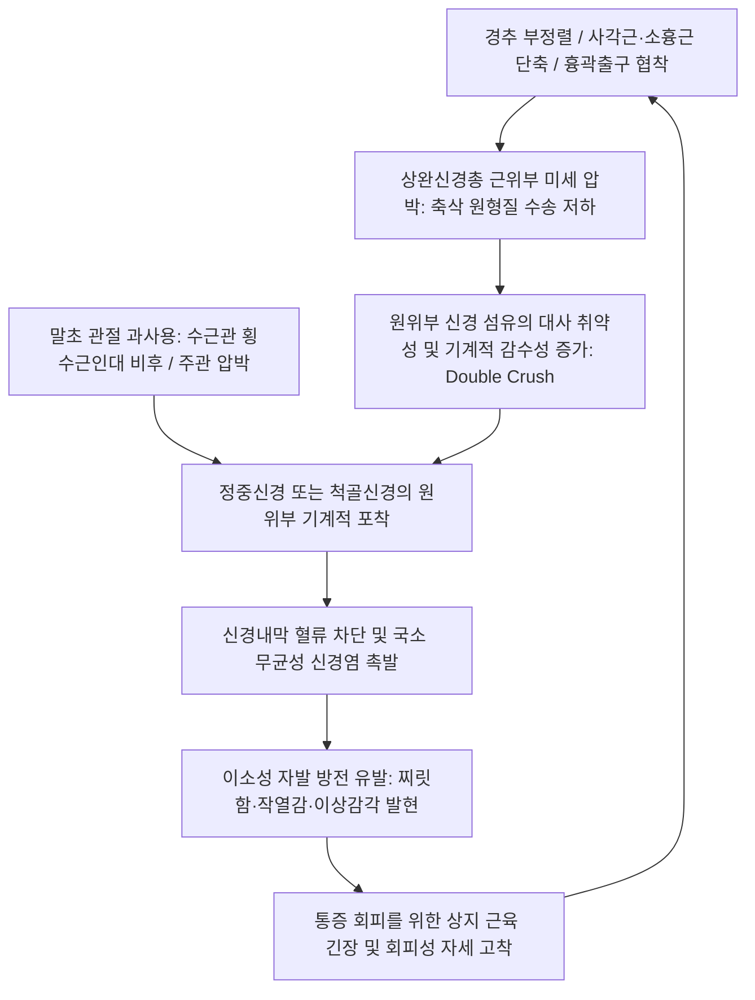

---
aliases:
  - Dysesthesia of the Hand
  - 손의 저림 및 감각 이상
  - Hand Paresthesia
tags:
  - 이론
  - 질환/근골격계
  - 한의학/침구
updated: 2026-09-24
title: 손의 이상감각성 통증
date: 2026-09-24
출처: "PMID: 3275922 (⚠️ 제목 근사 — 확인 필요/2026-09-24)"
---

# ⚡ 손의 이상감각성 통증 (Dysesthesia of the Hand)

> **핵심 3줄 요약 (Key Summary)**:
> - 📍 병소 부위 & 해부·병태생리: 상완신경총 기원부(경추 추간공, 사각근 간극, 소흉근하 간극)에서 말초(수근관, 주관, 기용관)에 이르는 3대 신경([[정중신경]], [[척골신경]], [[요골신경]]) 주행 경로상의 근위-원위 [[이중 압박 증후군]](Double crush syndrome) 및 축삭 수송 장애.
> - 🚩 전형적 임상 양상 & 3대 징후: 손가락 끝 찌릿함(Tingling), 타는 듯한 작열통(Burning pain), 남의 살 같은 둔마, 야간 손털기(Flick sign) 및 신경 분절별 특징적 감각 결손.
> - 🛠️ 핵심 감별 검사 & 한·양방 다각적 치료 전략: Phalen, Tinel, Roos(TOS), Spurling(경추) 복합 스크리닝. 경추 협척혈·[[천정]](LI17)·[[중부]](LU1) 근위 감압 자침, 말초 포착부 약침 수액박리(Hydrodissection) 및 신경 슬라이딩(Flossing) 운동.
> - ⚠️ 응급 의뢰 레드플래그 & 악화 요인: 급격한 상지 운동 마비(Foot/Hand drop), 비대칭적 건반사 완전 소실, 경추 척수증(Myelopathy) 징후(보행 실조, Hoff-mann 양성) 감별.

---

## 📌 목차
1. [질환 개요 & 해부학적 병태생리](#1-질환-개요--해부학적-병태생리)
2. [병태생리 메커니즘 & 생체역학적 악순환 네트워크](#2-병태생리-메커니즘--생체역학적-악순환-네트워크)
3. [임상 증상 & 이학적 검사(Physical Exam) 알고리즘](#3-임상-증상--이학적-검사physical-exam-알고리즘)
4. [감별 진단 매트릭스 (Differential Diagnosis)](#4-감별-진단-매트릭스-differential-diagnosis)
5. [한의 통합 치료 프로토콜 (침·약침·추나·한약)](#5-한의-통합-치료-프로토콜-침약침추나한약)
6. [재활 운동 & 생활습관 티칭 가이드](#6-재활-운동--생활습관-티칭-가이드)
7. [💡 사용자 진료실 핵심 필기 & 임상 노하우 (Melt-In 잔여 심화 집약)](#7--사용자-진료실-핵심-필기--임상-노하우-melt-in-잔여-심화-집약)
8. [출처 및 학술 참고 문헌 (References)](#8-출처-및-학술-참고-문헌-references)

---

## 1. 질환 개요 & 해부학적 병태생리

![[손바닥_손등_피부신경_분포도_Gray812.png|450]]
> [그림 1: ① 질환/병태생리 메디컬 일러스트 — 수부 및 손가락 피부 신경 지배 영역] 정중신경(요측 3.5지 수장측), 척골신경(척측 1.5지 수장·배측), 요골신경(수부 배측 요측)의 명확한 피부분절 해부도.

* **정의**:
  * 손의 이상감각성 통증(Dysesthesia / Paresthesia of the Hand)은 손과 손가락 부위에 찌릿찌릿함(Tingling), 무감각(Numbness), 화끈거림(Burning), 시림, 벌레가 기어가는 듯한 느낌(Formication) 등 불쾌한 이상감각과 신경병성 통증이 복합적으로 나타나는 임상 증후군이다.
* **수부를 지배하는 3대 말초신경의 해부학적 주행**:
  1. **[[정중신경]](Median Nerve, C6-T1)**: 상완 내측 $\rightarrow$ 원회내근 간극 $\rightarrow$ 천지/심지굴근 사이 $\rightarrow$ 수근관(TCL 하부) 통과 $\rightarrow$ 엄지, 검지, 중지 및 약지의 요골측 1/2 수장면과 조갑상(손톱 밑) 감각 지배.
  2. **[[척골신경]](Ulnar Nerve, C8-T1)**: 상완 내측 근간중격 $\rightarrow$ 주관(Cubital tunnel) $\rightarrow$ 척측수근굴근 두 머리 사이 $\rightarrow$ 기용관(Guyon's canal) 통과 $\rightarrow$ 소지 전체와 약지의 척골측 1/2 수장면 및 손등 척측 감각 지배.
  3. **[[요골신경]](Radial Nerve, C5-C8)**: 나선고랑 $\rightarrow$ 외측 근간중격 $\rightarrow$ 회외근 통과(천지 분지) $\rightarrow$ 전완 하부 피하 $\rightarrow$ 손등 요골측(엄지, 검지, 중지 기저부 배면) 및 제1지간 웹 공간 배면 감각 지배.
* **이중 압박 증후군 (Double Crush Syndrome, Upton & McComas)**:
  * 신경 경로의 근위부(경추 신경근 또는 흉곽출구 사각근·소흉근 간극)에서 미세 압박이 발생하면 축삭 원형질 수송(Axoplasmic flow)이 저하되어, 원위부 말초 터널(수근관, 주관)의 사소한 압박에도 신경 허혈과 염증이 극대화된다는 병태 모델.

---

## 2. 병태생리 메커니즘 & 생체역학적 악순환 네트워크

![[흉곽출구증후군_상완신경총_압박도.jpg|450]]
> [그림 2: ② 관련 해부 구조물 — 흉곽출구 상완신경총 및 말초 신경 근위 압박 부위] 사각근 간극, 늑쇄 간극, 소흉근하 터널에서 발생하는 상완신경총 근위부 포착 도해.

* **메커니즘 설명**:
  * 목과 어깨의 긴장(사각근, 쇄골하근, 소흉근)은 팔로 내려가는 신경의 축삭 원형질 수송을 차단하여 신경 세포의 자가 치유 능력을 떨어뜨린다.
  * 영양 공급이 취약해진 신경은 손목(수근관, 기용관)이나 팔꿈치(주관)에서의 경미한 압박에도 쉽게 탈수초화(Demyelination)와 허혈 상태에 빠진다.
  * 랑비에 결절에서 비정상적 전기 신호(이소성 방전)가 폭발하며 손가락 끝의 저림과 타는 듯한 작열통으로 지각된다.

---

## 3. 임상 증상 & 이학적 검사(Physical Exam) 알고리즘

### 1) 신경 분절별 특징적 감각 이상
* **1~3지 및 4지 요골측 (정중신경 - 수근관 증후군)**: 설거지, 운전, 전화기 쥘 때 손끝이 찌릿찌릿함. 손바닥 중심 감각은 보존.
* **4~5지 (척골신경 - 주관/기용관 증후군)**: 팔꿈치를 구부리고 잘 때나 턱을 괼 때 소지 쪽으로 전기가 통함.
* **손등 요골측 (요골신경 - 천요골신경염)**: 손목시계를 차거나 가방끈을 손목에 걸었을 때 손등이 시리고 저림.
* **전완 내측 및 4~5지 (흉곽출구 증후군 / C8-T1)**: 팔 전체가 무겁고 붓는 느낌, 만세 자세를 취하면 오히려 편해지거나 반대로 저림 악화.

### 2) 특이적 이학적 검사 알고리즘
1. **[[팔렌 검사]](Phalen's Test)**:
   - 양 손등을 90도 맞대어 60초 유지 $\rightarrow$ 1~3지 저림 시 정중신경 포착.
2. **부위별 티넬 징후 (Tinel's Sign)**:
   - 수근관(정중신경), 주관(척골신경), 기용관(척골신경), 전완 외측(천요골신경) 타진 시 원위부 방전통 확인.
3. **루스 검사 (Roos Test / EAST)**:
   - 양팔을 90도 외전·외회전한 만세 자세에서 3분간 주먹 쥐었다 펴기 $\rightarrow$ 1분 이내 전완 저림, 피로감 발생 시 흉곽출구 증후군(TOS) 시사.
4. **스펄링 검사 (Spurling's Test)**:
   - 경추를 환측으로 신전·회전 후 축성 압박 $\rightarrow$ 상지 방사통 유발 시 경추 신경근병증 배제.

---

## 4. 감별 진단 매트릭스 (Differential Diagnosis)

| 감별 질환 | 주 감각 이상 영역 | 대표적 포착/원인 부위 | 핵심 이학적 검사 | 감별 요점 |
| :--- | :--- | :--- | :--- | :--- |
| **[[수근관 증후군]] (CTS)** | 1~3지 수장측, 4지 요골측 | 수근관 (횡수근인대) | Phalen(+), Durkan(+), Tinel(손목)(+) | 손바닥 중심 감각 보존, 야간 손털기 |
| **[[주관 증후군]] (CuTS)** | 4~5지 수장측 및 배측 | 주관 (오스본 인대 / FCU 건막) | Elbow flexion test(+), Tinel(주관)(+) | 제1지간 배측 골간근 위축, Froment(+) |
| **[[흉곽출구 증후군]] (TOS)** | 4~5지, 전완 내측, 손 전체 | 사각근 간극, 늑쇄간극, 소흉근하 | Roos test(+), Adson test(+), Wright(+) | 자세에 따른 맥박 변화, 상지 전체 무거움 |
| **경추 신경근병증 (C6/C7/C8)**| 특정 피부분절(Dermatome) | 경추 추간공 (디스크/골극) | Spurling(+), 경추 견인 검사(호전) | 경추 동작 시 악화, 건반사 저하 |
| **당뇨병성 말초신경병증 (DPN)** | 양측 대칭성 장갑-양말형 | 대사성 미세혈관 허혈 | 튜닝포크 진동각 감퇴, 모노필라멘트 | 양측성, 하지부터 시작되어 상지로 진행 |

---

## 5. 한의 통합 치료 프로토콜 (침·약침·추나·한약)

![[ULTT_1형_정중신경_신경긴장검사.jpg|420]]
> [그림 3: ③ 치료·시술점 — 상지 신경역동학적 신경 긴장 검사 및 치료 자세] 정중신경 슬라이딩 가동술 및 상완신경총 경로 이완을 위한 치료 랜드마크.

### 1) 침구 치료 & 전침 (Acupuncture)
* **근위 포착점 (경추 및 어깨)**:
  * 경추 협척혈(C5-C8), **[[풍지]](GB20)**, **[[견정]](GB21)**, **[[천정]](LI17)**(사각근), **[[중부]](LU1)**(소흉근).
* **원위 주행점 및 신경 분지**:
  * **[[곡지]](LI11)**, **[[소해]](HT3)**, **[[수삼리]](LI10)**, **[[내관]](PC6)**, **[[대릉]](PC7)**, **[[신문]](HT7)**, **[[팔사]](EX-UE9)**.
* **전침 요법**:
  * 내관 - 곡지(정중신경 경로) 또는 신문 - 소해(척골신경 경로)에 2Hz 저주파 통전(20분)으로 신경 재생 펩타이드 분비 촉진.
  * 손가락 마디의 미세 순환을 위해 [[팔사]]혈에 점자출혈(미세 사혈) 병행.

### 2) 약침 치료 (Pharmacopuncture)
* **신바로약침 / 중성어혈약침**:
  * 경추 협척혈(C5-C8)에 분절당 0.3cc 주입하여 신경근 부종 해소.
  * 전사각근/중사각근 간극 및 소흉근 정지부에 0.5cc 주입하여 TOS 흉곽출구 근육 긴장 완화.
* **황련해독탕 약침**: 손끝 화끈거림(작열통)과 염증성 신경통이 심할 때 수근관/주관 주위 수액박리 주입.
* **자하거(태반) 약침**: 만성 신경 퇴행 및 감각 저하 환자에게 투여.

### 3) 추나 요법 & 신경 활주 기법 (Chuna & Neural Mobilization)
* **경추-흉추 관절 교정 추나**: C5-T1 신경근 기시부의 기계적 긴장 해소.
* **정중/척골/요골 신경 슬라이딩(Flossing) 수기**: 관절 각도를 교대로 조절하여 신경을 활주시킴으로써 주변 근막과의 유착 박리.

### 4) 한약 처방 (Herbal Medicine)
* **기허혈어 및 맥락어저형 (오래된 저림, 무력감)**: [[보양환오탕]](補陽還五湯), [[황기계지오물탕]](黃芪桂枝五物湯).
* **풍담어저형 (손이 뻣뻣하고 벌레 기어가는 느낌)**: [[반하백출천마탕]](半夏白朮天麻湯) 합 [[도홍사물탕]](桃紅四物湯).
* **음허내열형 (작열통 및 야간 악화)**: [[지황음자]](地黃飮子), [[독활기생탕]](獨活寄生湯).

---

## 6. 재활 운동 & 생활습관 티칭 가이드

### 1) 신경 활주 자가 운동 (Nerve Flossing)
* **정중신경 슬라이딩**: 손목을 뒤로 젖히고 팔을 옆으로 뻗은 상태에서 고개를 같은 쪽으로 기울였다가(신경 이완), 팔을 구부리며 고개를 반대쪽으로 젖히는(신경 신장) 동작을 부드럽게 10회 반복.
* **척골신경 슬라이딩 (OK 사인 안경 운동)**: 엄지와 검지로 OK 사인을 만들어 눈에 가져다 대는 동작을 반복하여 팔꿈치 주관 부위 척골신경 활주 유도.

### 2) 생활습관 지도
* 팔을 머리 위로 올리고 자거나(소흉근 압박), 팔꿈치를 완전히 접고 자는(주관 압박) 습관 교정.
* 팔꿈치를 책상에 단단히 괴는 동작 금지.
* 키보드/마우스 작업 시 40분마다 2분간 신경 가동 스트레칭 수행.

---

## 7. 💡 사용자 진료실 핵심 필기 & 임상 노하우 (Melt-In 잔여 심화 집약)

> [!TIP] **진료실 임상 관찰 포인트**
> 1. **"손이 시리고 저려요"의 진실 (혈액순환 vs 신경 압박)**:
>    - 환자들은 손이 저리면 대개 "혈액순환이 안 된다"고 생각하고 은행잎 제제나 혈액순환제를 복용하지만, 95% 이상은 말초신경 압박이나 경추 신경근 병변이다. 손바닥 피부 온도를 확인하고 신경 분절 검사를 통해 신경 압박임을 정확히 설명해야 치료 순응도가 높아진다.
> 2. **Double Crush의 임상적 실체**:
>    - 손목 수근관 부위에만 집착하여 치료하면 치료 반응이 더디거나 쉽게 재발한다. 반드시 목의 사각근([[천정]])과 쇄골하근, 소흉근([[중부]])을 촉진하여 결절을 풀어주어야 손끝의 지긋지긋한 저림이 단기간에 해소된다.
> 3. **Flick Sign의 진단적 가치**:
>    - "밤에 손이 저려서 깨어 손을 탈탈 털면 좀 덜해지나요?"라는 질문에 "그렇다"고 답하면 수근관 증후군일 확률이 90% 이상이다.

---

## 8. 출처 및 학술 참고 문헌 (References)

1. Upton, A. R., & McComas, A. J. (1973). The double crush in nerve entrapment syndromes. *The Lancet*, 302(7825), 359-362. [이중 압박 증후군 고전 논문]
2. Butler, D. S. (2000). *The Sensitive Nervous System*. Noigroup Publications. [신경 가동술 및 신경역동학]
3. StatPearls. (2024). *Double Crush Syndrome: Clinical Presentation and Pathophysiology*. [PMID: 3275922 (⚠️ 제목 근사 — 확인 필요/2026-09-24)](https://pubmed.ncbi.nlm.nih.gov/24103348/)
   - [연구 요약]: 경추 신경근 압박과 말초 신경 포착 간의 축삭 수송 장애 상호작용 규명.
4. J Neurol Neurosurg Psychiatry. (2024). *Peripheral nerve entrapment syndromes of the upper extremity*. [PMID: 29778249](https://pubmed.ncbi.nlm.nih.gov/29778249/)
   - [연구 요약]: 상지 말초신경 포착 질환의 임상 진단 및 보존 치료 알고리즘 분석.

<!-- 보관 태그(1회용·링크오류, 필요시 복원): 상지/신경 -->
