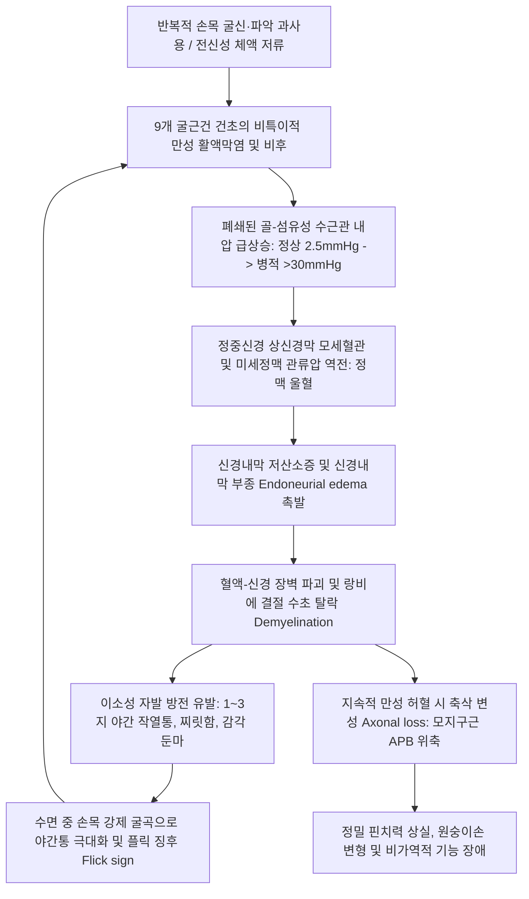

# 🖐️ [[수근관 증후군]] (Carpal Tunnel Syndrome, CTS)

> **핵심 3줄 요약 (Key Summary)**:
> - 📍 병소 부위 & 해부·병태생리: 손목 전면의 [[횡수근인대]](TCL, 굴근지대)와 8개 수근골궁 사이 터널 내에서 9개 굴근건 윤활막염 및 내압 급상승(정상 2.5 mmHg $\rightarrow$ 병적 >30 mmHg)으로 인해 [[정중신경]](Median nerve)의 허혈성 신경내막 부종 및 축삭 변성이 초래되는 가장 흔한 상지 신경포착 질환.
> - 🚩 전형적 임상 양상 & 3대 징후: 제1·2·3수지 및 4수지 요측의 찌릿한 작열통·감각둔마, 야간통(Nocturnal awakening), 손을 털면 일시 완화되는 플릭 징후(Flick sign), 진행 시 [[단무지외전근]](APB) 위축 및 원숭이손(Ape hand) 변형.
> - 🛠️ 핵심 감별 검사 & 한·양방 다각적 치료 전략: [[팔렌 검사]], Durkan 수근 압박 검사, 초음파 단면적(CSA ≥ 10 mm²), NCV 지연(원위 감각 >3.5ms, 운동 >4.2ms). 횡수근인대 척측 1/3 안전 구역 침도 미세 감압술, [[대릉]](PC7)·[[외관]](TE5) 2Hz 저주파 전침(뇌 1차 체성감각피질 S1 재조직화), 오공·봉약침 수력박리(Hydrodissection) 및 야간 중립위 부목 고정.
> - ⚠️ 응급 의뢰 레드플래그 & 악화 요인: 무지구근의 비가역적 급속 위축, 핀치력 완전 소실, 손목 강제 굴곡 자세 수면, 조절되지 않는 당뇨·갑상선 저하증 동반 시 수술적 감압(CTR) 의뢰 고려.

---

## 📌 목차
1. [질환 개요 & 해부학적 병태생리](#1-질환-개요--해부학적-병태생리)
2. [병태생리 메커니즘 & 생체역학적 악순환 네트워크](#2-병태생리-메커니즘--생체역학적-악순환-네트워크)
3. [임상 증상 & 이학적 검사(Physical Exam) 알고리즘](#3-임상-증상--이학적-검사physical-exam-알고리즘)
4. [감별 진단 매트릭스 (Differential Diagnosis)](#4-감별-진단-매트릭스-differential-diagnosis)
5. [한의 통합 치료 프로토콜 (침·약침·추나·한약)](#5-한의-통합-치료-프로토콜-침약침추나한약)
6. [양방 치료 & 병용·의뢰 기준 (Conventional Treatment & Referral)](#6-양방-치료--병용의뢰-기준-conventional-treatment--referral)
7. [재활 운동 & 생활습관 티칭 가이드](#6-재활-운동--생활습관-티칭-가이드)
8. [💡 사용자 진료실 핵심 필기 & 임상 노하우 (Melt-In 잔여 심화 집약)](#7--사용자-진료실-핵심-필기--임상-노하우-melt-in-잔여-심화-집약)
9. [출처 및 학술 참고 문헌 (References)](#8-출처-및-학술-참고-문헌-references)

---

## 1. 질환 개요 & 해부학적 병태생리

![[수근관_단면해부도_횡수근인대_정중신경.jpg|450]]
> [그림 1: ① 질환/병태생리 메디컬 일러스트 — 수근관 횡단면 해부도] 수근골(Hamate, Capitate, Trapezoid, Trapezium)이 이루는 골성 바닥과 횡수근인대(Flexor retinaculum), 9개 굴근건 및 최표층에서 압박받는 정중신경의 상대적 위치 관계.

* **질환 정의 및 개요**:
  * 수근관 증후군(Carpal Tunnel Syndrome, CTS)은 완관절 전면의 골-섬유성 터널인 수근관(Carpal tunnel) 내에서 다양한 원인으로 용적 감소 또는 내용물 팽창이 발생하여, 터널 내 최표층을 통과하는 [[정중신경]](Median nerve, C6-T1)이 기계적으로 압박되고 미세순환이 차단되어 수부 요측 3.5개 수지의 감각 이상, 작열통 및 모지구근(Thenar muscles) 쇠약·위축을 초래하는 상지 최다빈도 말초신경 포착 증후군이다.
* **해부학적 구조와 경계 (3D Boundaries)**:
  * **바닥 및 외벽 (Floor & Walls)**: 내측의 두상골(Pisiform) 및 유구골 갈고리(Hook of hamate), 외측의 주상골 결절(Tubercle of scaphoid) 및 대능형골 결절(Tubercle of trapezium) 등 8개 수근골이 오목한 U자형 골성 수근궁(Carpal arch)을 형성한다.
  * **천장 (Roof)**: 주상골-대능형골 결절에서 기시하여 두상골-유구골 갈고리에 부착하는 폭 약 2~3cm, 두께 약 2~4mm의 강인한 섬유성 결합조직인 **[[횡수근인대]](Transverse Carpal Ligament, TCL / 굴근지대 Flexor retinaculum)**로 폐쇄된다.
* **수근관 통과 구조물 (총 10개)**:
  * **힘줄 (9개)**: [[천지굴근]](FDS) 건 4개, [[심지굴근]](FDP) 건 4개, [[장모지굴근]](FPL) 건 1개 및 이들을 감싸는 활액초(Synovial sheaths / Radial & Ulnar bursae).
  * **신경 (1개)**: [[정중신경]](Median nerve). 횡수근인대 바로 밑에 위치하여 관내 압력 상승에 가장 먼저 직접적인 기계적 눌림과 허혈을 겪는다.
* **결정적 신경 해부학적 분지 및 주행 변이**:
  * **정중신경 수장피하지 (Palmar Cutaneous Branch of Median Nerve)**: 수근관 진입 약 3~5cm 근위부 전완 원위에서 본간으로부터 조기 분지하여, 횡수근인대 위쪽(표재층)을 통과하여 손바닥 중심부 및 엄지두덩 기저부 피부 감각을 지배한다. $\rightarrow$ **수근관 내부가 극심하게 압박되어 손가락 끝 감각이 완전히 소실되어도 손바닥 중심부 피부 감각은 정상 보존되는 결정적 해부학적 근거**가 된다.
  * **무지구근 반회 운동분지 (Recurrent Motor Branch)**: 횡수근인대 원위 외측(요골측) 경계 부근에서 분지하여 [[단무지외전근]](APB), [[무지대립근]](OP), [[단무지굴근]](FPB) 천두를 지배한다.
    * 해부학적 주행 변이: Extraligamentous(외측 주행, 약 50%), Subligamentous(인대 하 주행, 약 30%), Transligamentous(인대 관통 주행, 약 20%). 침도 시술이나 절개 감압 시 척측 1/3 안전 구역을 고수해야 하는 이유이다.
* **역학 및 유병 특성**:
  * 일반 인구 유병률 약 3~5%, 남녀 성비 1:3~1:5로 여성에서 압도적으로 호발한다.
  * 호발 연령은 40~60대이며, 컴퓨터 키보드·마우스 사용자, 조리사, 미용사, 진동공구 작업자뿐 아니라 임신, 폐경, 갑상선기능저하증, 당뇨병, 류마티스 관절염 등 체액 저류 및 결합조직 비후성 기저질환과 밀접하게 연동된다.

---

## 2. 병태생리 메커니즘 & 생체역학적 악순환 네트워크

![[수근관증후군_병태생리_정중신경압박도해.png|540]]
> [그림 2: ② 관련 해부 구조물 — 수근관 증후군 병태생리 도해] 횡수근인대 아래에서 압박받는 [[정중신경]] 및 제1~3수지와 제4수지 요측 절반의 감각 이상 지배 영역.

### 1) 미세혈류 역동학과 3단계 신경 손상 타임라인
* **정상 vs 병적 수근관 내압**: 정상 상태의 수근관 내압은 2.5~10 mmHg에 불과하나, CTS 환자는 안정 시에도 30~50 mmHg로 상승되어 있으며, 손목을 90도 굴곡하거나 신전할 경우 90~110 mmHg 이상으로 폭증한다.
* **허혈-부종-섬유화 악순환 (Ischemia-Edema Cycle)**:
  1. **초기 (모세혈관 울혈 및 저산소증)**: 조직압이 모세혈관 관류압(약 30 mmHg)을 넘어서면 정맥 환류가 차단되고, 신경외막에 부종이 발생하여 일시적 전도 차단(Neuropraxia)과 간헐적 저림이 나타난다.
  2. **중기 (신경내막 부종 및 탈수초화)**: 만성 압박으로 모세혈관 투과성이 증가하여 신경내막으로 단백질성 삼출액이 누출되고 부종이 고착화된다. 대형 유수 신경섬유의 미엘린초(Myelin sheath)가 손상되어 전도 속도가 영구 지연된다.
  3. **말기 (신경내막 섬유화 및 축삭 절손)**: 섬유아세포 증식으로 신경 내막 및 외막이 딱딱하게 섬유화되고, 원위부 축삭이 퇴행하는 왈러 변성(Wallerian degeneration)이 발생하여 무지구근 위축과 영구적 감각 상실에 이른다.

### 2) 주먹 쥠 동작의 생체역학적 역전 (Kinetic Chain Distortion)
* 정상적인 수부 운동형상학에서는 주먹을 강하게 쥘 때 굴근건의 과도한 활줄 현상(Bowstringing)을 방지하고 장력을 분산하기 위해 수근관절이 자연스럽게 15~20° 신전(Dorsiflexion)된다.
* 그러나 CTS 환자는 비후된 천지/심지굴근건의 용적 과다로 인해 주먹을 쥘 때 손목이 오히려 전방(Palmar flexion)으로 꺾이는 역학적 변위가 발생하며, 이는 횡수근인대 하부에서 정중신경을 지레 받침점 삼아 짓누르는 생체역학적 파괴를 초래한다.

---

## 3. 임상 증상 & 이학적 검사(Physical Exam) 알고리즘

### 1) 주요 임상 증상 및 단계별 진행
* **감각 증상**: 엄지, 검지, 중지 및 약지 요측 1/2의 전격성 찌릿함, 화끈거리는 작열통(Burning dysesthesia), 핀으로 찌르는 듯한 감각.
* **야간통 (Nocturnal Awakening) & 플릭 징후 (Flick Sign)**:
  * 수면 중 무의식적 손목 굴곡 자세와 수평와위 시 정맥압 상승으로 한밤중이나 새벽 2~4시에 손이 터질 듯이 저려 잠에서 깸.
  * 이때 손을 허공에 털거나 온수에 씻으면 정맥 혈류가 일시 재개되어 증상이 경감되는 플릭 징후(양성 예측도 >90%)가 나타남.
* **운동 마비 및 근위축 (Ape Hand Deformation)**:
  * 단추 잠그기, 젓가락질, 동전 집기 등 미세한 대립 핀치(Pinch grasp) 동작이 서툴러지고 물건을 손에서 자주 놓침.
  * 만성화 시 엄지두덩 외측의 [[단무지외전근]](APB)이 움푹 패여 평평해지는 **원숭이 손(Ape hand)** 기형 형성.
  ![[수근관증후군_모지구근위축_원숭이손변형.jpg|420]]
  > [그림 3: ① 병태생리·영상 — 만성 비치료 수근관 증후군 환자의 모지구근 위축] 양측 엄지두덩(Thenar eminence)의 현저한 근위축(화살표) 및 원숭이손 변형.

### 2) 필수 이학적 검사법
1. **[[팔렌 검사]](Phalen's Test)**:
   * 양 손등을 서로 맞대고 손목을 90도 완전 굴곡시킨 상태로 60초간 유지 $\rightarrow$ 60초 이내에 1~3수지로 저림이나 통증이 재현되면 양성 (민감도 68~88%, 특이도 80~90%).
   ![[수근관증후군_팔렌검사_이학적검사.jpg|400]]
   > [그림 4: ① 병태생리·영상 — 수근관 증후군 팔렌 검사(Phalen's Maneuver) 시연] 양 손등을 90도 굴곡 밀착하여 수근관 내압을 유발하는 이학적 검사.
2. **더칸 수근 압박 검사 (Durkan's Carpal Compression Test)**:
   * 검사자의 양 엄지로 환자의 횡수근인대 정중앙(손목 굴곡 주름 바로 원위부)을 30초간 4~5kgf 힘으로 직접 압박 $\rightarrow$ 증상 재현 시 양성 (민감도 87%, 특이도 90%로 가장 우수한 임상 검사).
3. **[[티넬 징후]](Tinel's Sign)**:
   * 손목 수근관 부위(대릉혈 근처)를 타진기로 톡톡 두드릴 때 1~3수지 끝으로 찌릿한 방전통이 뻗치는지 확인.
4. **엄지 대립 근력 평가 (Abductor Pollicis Brevis Test)**:
   * 손바닥을 천장으로 향하게 한 상태에서 엄지를 손바닥 면과 수직(90도)으로 들어 올리게 하고 검사자가 하방으로 누를 때 버티는 근력 저하 및 모지구근 외측 융기 소실 평가.

### 3) 영상 및 전기생리학적 정밀 검사
* **근전도 및 신경전도 검사 (EMG/NCV, 진단 표준)**:
  * 원위 감각 신경전도 잠시(Distal Sensory Latency, DSL) 지연 (> 3.5 ms).
  * 원위 운동 신경전도 잠시(Distal Motor Latency, DML) 지연 (> 4.2 ms).
* **근골격계 초음파 (Musculoskeletal Ultrasound)**:
  * 수근관 입구(주상골-두상골 라인)에서 정중신경 단면적(Cross-Sectional Area, CSA) 측정: **CSA ≥ 10 mm²** (중등도 13 mm², 중증 >15 mm²) 시 양성 확진. 신경내 저에코성 부종 및 횡수근인대 손바닥쪽 볼록 돌출(Palmar bowing) 확인.

---

## 4. 감별 진단 매트릭스 (Differential Diagnosis)

| 감별 질환 | 호발 병소 및 신경 | 주소증 차이점 | 손바닥 중심 감각 | 특이적 이학적 검사 소견 |
| :--- | :--- | :--- | :--- | :--- |
| **[[수근관 증후군]] (본 질환)** | 손목 횡수근인대 하부 ([[정중신경]]) | 1~3지 및 4지 요측 저림, 야간 손털기(Flick) | **정상 보존됨** (장측피지 상방 주행) | Phalen(+), Durkan(+), APB 위축 |
| **[[원회내근 증후군]]** | 전완 근위부 원회내근 간극 ([[정중신경]]) | 전완 전면 통증 동반, 주간 활동 시 악화 | **감각 둔마 동반** (수장피하지 포착) | 저항성 전완 회내 시 악화, Phalen(-) |
| **[[가이온관 증후군]]** | 손목 척골신경관 ([[척골신경]]) | 4지 척측 및 5지 저림, 골간근 위축 | 정상 | Froment sign(+), 갈퀴손 변형 |
| **[[흉곽출구 증후군]] (TOS)** | 사각근 간극/소흉근하 (상완신경총 하신경간) | 팔 전체의 무거움, 전완 내측 및 4~5지 저림 | 정상 또는 전완 내측 둔마 | Roos test(+), Adson test(+), Wright(+) |
| **경추 C6/C7 신경근증** | 경추 추간공 (C6/C7 디스크/골극) | 목 통증 동반, 기침 시 악화, 상완~전완 방사 | 분절성 감각 저하 | Spurling test(+), 건반사(삼두근) 저하 |

---

## 5. 한의 통합 치료 프로토콜 (침·약침·추나·한약)

![[티넬징후_2단계_수근관_정중신경직접타진.jpg|400]]
> [그림 5: ③ 치료·시술점 — 수근관 입구 대릉(PC7) 혈위 정중신경 타겟팅 및 이학적 검사 지점] 횡수근인대 감압 침도 자입 및 약침 수력박리(Hydrodissection) 주요 치료 랜드마크.

### 1) 침도 횡수근인대 미세 감압술 (Acupotomy)
* **해부학적 안전 자입로**: 완관절 원위 손목 주름 원위 1cm, 대릉(PC7) 혈위에서 **제4지(약지) 축선 방향으로 3~5mm 편위된 척측 지점**을 침도 진입점으로 설정 (정중신경 본간 및 요골측 무지구 회귀가지 완전 회피).
* **시술 방법**: 0.4×40mm 평인 침도를 건과 신경 주행 방향인 종축과 평행하게 자입하여 횡수근인대(TCL) 섬유를 미세 절개·박리(Stripping)함으로써 수근관 내압을 물리적으로 영구 감압.

### 2) 약침 요법 & 신경 수액박리술 (Hydrodissection)
* **신경 수액박리술 기전**: 정중신경과 비후된 횡수근인대 사이 결합조직 간극에 약침액 0.5~1.0cc를 주입하여 유착된 신경을 물리적으로 박리하고 신경 주위 미세 순환을 복원.
* **약침 제제 선택**:
  * **[[오공약침]]**: 신경성 부종과 전격성 저림이 극심한 급성기/아급성기에 탁월한 진통·소염 효과.
  * **[[봉약침]](Sweet BV 10%)**: 만성 굴근건초염 및 인대 비후부에 미량(0.1cc) 시술하여 결합조직 리모델링 및 무균성 염증 제거.
  * **자하거(태반) 약침**: 무지구근 위축 및 만성 축삭 손상 환자의 신경 재생 촉진.

### 3) 침구 치료 & 뇌 체성감각피질(S1) 재조직화 전침
* **표준 혈위**: 환측 [[대릉]](PC7), [[내관]](PC6), [[외관]](TE5), [[곡택]](PC3), [[합곡]](LI4), [[팔사]](EX-UE9).
* **2Hz 저주파 전침 (Brain Plasticity Mech)**:
  * 대릉(PC7) - 외관(TE5) 간 2Hz 연속파(20분) 통전.
  * 뇌 fMRI 연구(Maeda et al., Brain 2017)에 따르면, 2Hz 전침 자극은 말초 신경전도 속도 개선뿐만 아니라 대뇌 1차 체성감각피질(S1)에서 뭉개져 있던 검지(D2)와 중지(D3)의 감각 피질 지도 분리도(Cortical Separation)를 정상화하는 신경 가소성 회복을 실증함.

### 4) 추나 요법 & 수근궁 확장 기법 (Chuna)
* **수근궁 횡적 확장 수기 (Carpal Arch Spreading)**:
  * 시술자의 양 엄지로 환자의 두상골-유구골 갈고리와 주상골 결절-대능형골 결절을 각각 접촉하고 손목을 배굴시키면서 외측으로 부채꼴 형태로 벌려주는 신장 압박을 가하여 수근관 용적을 기계적으로 확장.

### 5) 한약물 요법
* **기체혈어 및 습담조체형 (급성 부종, 저림, 야간통)**: [[서경탕]](舒經湯), [[오적산]](五積散) 합 [[당귀수산]](當歸鬚散).
* **기혈양허 및 만성 신경위축형 (근위축, 무력감, 고령)**: [[보양환오탕]](補陽還五湯) 가미 (황기 40g 이상 증량, 지룡, 우슬 배합하여 미세 모세혈관 관류압 증대).
* **수족냉증 및 한습형**: [[당귀사역탕]](當歸四逆湯), [[황기계지오물탕]](黃芪桂枝五物湯).

---

## 6. 양방 치료 & 병용·의뢰 기준 (Conventional Treatment & Referral)

> 🎯 **이 섹션의 목적**: 환자가 **양방약을 이미 복용 중인 경우가 많다.** 한의원 1차 진료에서 양방 치료를 이해하고, 병용 가능·주의·금기를 판단하며, 언제 의뢰할지 결정한다.

* **약물 치료 (Medication)**:
  * 계열별 약물·용량·기간 — 국내 처방 관행 반영.
  * 작용 기전과 한의 치료와의 상호작용.
* **비약물 시술 (Procedures)**:
  * 주사·차단술·물리치료·보조기 등.
* **수술·시술 적응증 (Surgical Indication)**:
  * 언제 수술로 가는가 — 절대·상대 적응증, 수술 후 경과.
* **한의 병용 판단 (Combination Therapy)**:
  * 병용 가능 / 주의 / 금기. 복용 중 환자의 감량 타이밍·반동 현상.
* **양방·전문과 의뢰 기준 (Referral Criteria)**:
  * 응급 의뢰 트리거와 전문과 의뢰 기준(정형외과·신경외과·내과 등).

	(작성 필요)

---

## 7. 재활 운동 & 생활습관 티칭 가이드

### 1) 정중신경 활주 운동 (Median Nerve Gliding - Totten & Hunter)
- (1) 주먹 쥐기 (Fist)
- (2) 손가락 전체 신전 (Straight fingers)
- (3) 손목 뒤로 젖히기 (Wrist extension)
- (4) 엄지손가락 외전 (Thumb extension)
- (5) 전완 완전 회외 (Forearm supination, 손바닥이 천장을 봄)
- (6) 반대 손으로 엄지를 부드럽게 뒤로 신장
- 각 동작을 5초간 유지하며 하루 3~5회 반복하여 수근관 내에서 정중신경이 굴근건과 엉겨붙지 않고 활주하도록 유도.

### 2) 굴근건 활주 운동 (Tendon Gliding Exercises)
- Straight hand $\rightarrow$ Hook fist $\rightarrow$ Full fist $\rightarrow$ Table top $\rightarrow$ Straight fist의 5단계 동작을 통해 FDS와 FDP 건의 독립적 활주를 촉진.

### 3) 생활습관 및 보조기 티칭 (Ergonomics)
* **야간 손목 중립 부목 (Night Splinting, 필수 지침)**:
  * 수면 시 무의식적인 손목 굴곡(내압 100 mmHg 상승)을 방지하기 위해 손목을 중립위(0~5° 신전)로 지지하는 맞춤형 부목을 최소 4~8주간 착용하도록 티칭 (수근관 내압을 가장 낮은 2.5 mmHg로 유지하여 야간 각성 차단).
* **작업 환경 개선**: 버티컬 마우스 사용, 키보드 팜레스트 지지, 스마트폰 사용 시 거치대 활용.

---

## 8. 💡 사용자 진료실 핵심 필기 & 임상 노하우 (Melt-In 잔여 심화 집약)

> [!TIP] **진료실 임상 관찰 포인트**
> 1. **손바닥 중심 감각 보존 여부 (정중신경 장측피지의 가치)**:
>    - 손가락 1~3지 끝이 저리다고 할 때 반드시 손바닥 정중앙(노궁혈 부근)을 긁어보라. 손바닥 중심 감각이 완전히 정상이라면 100% 수근관 증후군이다. 만약 손바닥 중심까지 감각이 둔하다면 수근관보다 상방에서 정중신경 본간이 눌리는 **원회내근 증후군**이거나 **경추 6/7번 신경근병증**이다.
> 2. **주먹 쥘 때의 손목 각도 관찰**:
>    - 환자에게 주먹을 꽉 쥐어보라고 했을 때 손목이 위로 살짝 젖혀지지 않고 아래로 꺾인다면, 굴근건초의 활액막염이 극도로 진행되어 관내 여유 공간이 완전히 소실되었음을 의미하는 위험 신호이다.
> 3. **무지구근 위축(원숭이손) 발견 시 솔직한 티칭**:
>    - 이미 단무지외전근(APB)의 함몰이 뚜렷하다면 축삭 변성이 상당히 진행된 상태이다. 보존적 한의 치료로 저림과 통증은 잡을 수 있으나 근육 볼륨이 회복되는 데는 최소 6개월~1년 이상의 장기 치료가 필요함을 설명하고, 핀치력이 전혀 없는 완전 마비 단계라면 신경전도 검사 결과에 따라 외과적 유리술(CTR)을 의뢰할 수 있음을 투명하게 고지해야 신뢰를 얻는다.
> 4. **초음파 유도하 D5W 신경박리술 최신 지견 활용**:
>    - 2026년 최신 임상연구(Muscle & Nerve, PMID: 42206562)에 따르면 5% 포도당수(D5W)를 이용한 신경주위 수액박리술은 스테로이드 주사와 대등한 12개월 장기 치료 효과를 보이며, 특히 치료 후 3개월에 최대 호전을 나타낸다. 스테로이드의 힘줄 파열 부작용이나 당뇨 환자의 혈당 급상승을 우려하는 환자에게 비스테로이드 한의 약침/수액박리의 강력한 근거 논리로 활용할 수 있다.

---

## 9. 출처 및 학술 참고 문헌 (References)

1. American Academy of Orthopaedic Surgeons (AAOS) & American Society for Surgery of the Hand (ASSH). Management of Carpal Tunnel Syndrome: Evidence-Based Clinical Practice Guideline. *J Am Acad Orthop Surg*. 2025;33(7):e363-e372. [PMID: 39637428](https://pubmed.ncbi.nlm.nih.gov/39637428/)
   - [연구 요약]: 경도~중등도 수근관 증후군에서 야간 손목 부목 착용의 강력 권고와 초음파 CSA 진단 기준, 수술 적응증을 체계화한 최신 국제 임상진료지침.
2. Maeda Y, Kim H, Kettner N, et al. Rewiring the primary somatosensory cortex in carpal tunnel syndrome with acupuncture. *Brain*. 2017;140(4):914-927. [PMID: 28334999](https://pubmed.ncbi.nlm.nih.gov/28334999/)
   - [연구 요약]: 수근관 증후군 환자 대상 fMRI 연구로, 대릉·외관 2Hz 전침 치료가 말초 전도 속도 개선과 함께 대뇌 1차 체성감각피질(S1)의 손가락 감각 분리도(D2/D3 Separation)를 정상화하는 뇌 신경 가소성 회복 기전을 최초 규명.
3. Muscle & Nerve. 2026;74(2):374-382. [PMID: 42206562](https://pubmed.ncbi.nlm.nih.gov/42206562/)
   - [연구 요약]: 양측성 CTS 환자 대상 5% 포도당수(D5W) vs 스테로이드(CS) 초음파 유도 신경주위 주사 12개월 추적 RCT로, D5W가 스테로이드와 대등한 증상 완화(3개월 시점 최대)를 보이며 합리적 비스테로이드 대안임을 입증.
4. Zhang C, et al. Acupuncture for carpal tunnel syndrome: A systematic review and meta-analysis of randomized controlled trials. *Front Neurosci*. 2023;17:1134262. [PMID: 36908786](https://pubmed.ncbi.nlm.nih.gov/36908786/)
   - [연구 요약]: CTS 침 치료 RCT 메타분석으로 기능 점수(BCTQ), 통증(VAS) 및 신경전도속도(SNCV)에서 통계적으로 유의한 우월성을 입증.
