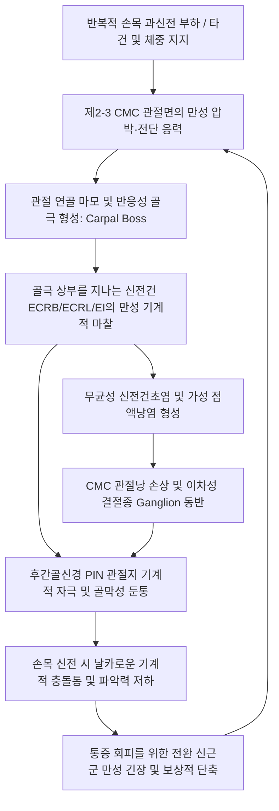

---
aliases:
  - 수근부 골융기
  - 수근골 융기
  - Carpal Boss
  - Carpe Bossu
  - 손등 뼈혹
  - 제2-3 수근중수관절 골극
tags:
  - 이론
  - 근골격계질환
  - 상지질환
  - 수부질환
  - 건초염
  - 한의치료
categories:
  - 근골격계 질환
  - 상지
created: 2024-01-21
updated: 2026-09-24
title: 수근부 골융기
date: 2026-09-24
출처: "PMID: 39347329"
---

# 수근부 골융기 (Carpal Boss / Carpe Bossu)

> **상위 분류**: [[근골격계 질환]] > [[상지 질환]] > [[수부 질환]]
> **핵심 키워드**: 제2-3 수근중수관절(CMC joint), 수근골 융기(Carpal Boss), [[단요측수근신근]](ECRB), [[장요측수근신근]](ECRL), [[시지신근]](EI), 수근골 배측 충돌, [[결절종]](Ganglion cyst) 감별

---

## 1. 질환 개요 & 해부학적 병태생리

- **개념 정의**:
  - 수근부 골융기(Carpal Boss, 프랑스어로 'Carpe Bossu'에서 유래)는 제2 또는 제3 **수근중수관절(Carpometacarpal joint, CMC joint)**의 배측 경계면에 발생하는 무통성 또는 유통성의 단단한 골성 돌출 병변이다.
  - 해부학적으로는 제2·3 중수골 기저부(Base of 2nd/3rd metacarpal)와 수근골인 유두골(Capitate) 또는 소다각골(Trapezoid) 사이에 선천적인 부골(Accessory ossicle, Os styloideum)이 존재하거나, 만성적인 기계적 마찰과 관절 불안정성에 대한 반응성 퇴행성 골극(Osteophyte)이 과형성되면서 나타난다.
- **해부학적 구조 & 영상 해부**:
  ![[Pasted image 20240121052621.png|500]]
  > [그림 1: ① 병태생리·영상 — 수근부 골융기(Carpal Boss) 3D CT 및 시상단면 병태 해부도] 제2, 3 중수골 기저부와 소다각골(Trapezoid) 접합부에 발생한 골극(Carpal boss)과 그 상부를 통과하며 마찰·흥분된 신전건(Extensor indicis/ECRB) 및 관절낭 염증.
- **역학 및 호발군**:
  - **호발 연령 및 성별**: 20대에서 50대 사이의 활동기 성인에서 흔하며, 남녀 발생 비율은 유사하거나 여성에서 약간 더 높은 빈도로 보고된다.
  - **호발 부위**: 전체 수근부 골융기의 약 85% 이상이 **제3 중수골 기저부와 유두골 사이**에 발생하며, 약 15%는 제2 중수골 기저부와 소다각골 접합부에서 관찰된다.
  - **직업적 특성**: 손목을 뒤로 젖히고 바닥을 강하게 지지하거나(체조, 요가, 레슬링), 라켓을 쥐고 반복적인 타격 충격을 받는 운동선수, 골프 선수, 손목을 지속적으로 굴신하는 악기 연주자 및 수작업 노동자.

---

## 2. 병태생리 메커니즘 & 생체역학적 악순환 네트워크

- **메커니즘 설명**:
  - **골극 형성 (Osteophyte Formation)**: 제2·3 CMC 관절은 운동성이 거의 없는 고정 관절(Amphiarthrosis)로서, 손목 굴신 시 전완 신전근들의 강력한 견인력이 직접 전달된다. 반복적인 미세외상과 전단 응력(Shear stress)으로 인해 관절 연골이 마모되고, 이에 대한 인체 반응으로 골막 하 골기질 증식과 골극이 자라난다.
  - **신전건과의 마찰 및 건활액막염**: 골융기 바로 위를 지나는 주요 힘줄인 [[단요측수근신근]](ECRB), [[장요측수근신근]](ECRL), 및 제4구획의 [[시지신근]](EI) 건이 골극과 지속적으로 충돌하여 힘줄 비후 및 건초염(Tenosynovitis)이 유발된다.
  - **건하 점액낭염 및 이차성 결절종 (Overlying Ganglion Cyst)**: 골극과 힘줄 사이의 마찰을 완화하기 위해 인체는 완충용 가성 점액낭을 형성하며, CMC 관절낭 손상액이 누출되어 골극 상부에 결절종이 2차적으로 동반되는 경우가 흔하다.
  - **관련 해부 구조물**:
    ![[Pasted image 20240115042232.png|450]]
    > [그림 2: ② 관련 해부 구조물 — 수근중수(CMC) 관절 배측 힘줄 부착부 해부도] 골융기 병변 부위에 직접 정지하는 [[장요측수근신근]](ECRL), [[단요측수근신근]](ECRB)과 주변 [[척측수근신근]](ECU), [[장무지외전근]](APL)의 해부학적 관계.

---

## 3. 임상 증상 & 이학적 검사(Physical Exam) 알고리즘

### 임상 증상
- **단단한 뼈혹 촉지**: 손등 중앙 관절선 부위(제2·3 중수골 기저부)에 쌀알에서 도토리 크기의 단단하고 뼈와 일체형으로 고정된 결절이 만져짐.
- **국소 압통 및 마찰통**: 돌출 부위를 손가락으로 꾹 누르면 골막성 둔통이 발생하며, 손목을 굴곡하거나 신전할 때 힘줄이 덜컥거리며 넘어가는 느낌(Snapping) 발생.
- **부하 시 악화**: 푸시업 자세처럼 손바닥으로 바닥을 짚고 체중을 실을 때, 무거운 물건을 들어 올릴 때 극심한 찌릿함 유발.
- **연부조직 부종 및 열감**: 급성 마찰이나 과사용 후에는 골융기 상부 피부가 붓고 미세한 열감이 동반됨.

### 이학적 검사 및 영상 평가 알고리즘
1. **수직 직접 압박 검사 (Direct Compression Test)**:
   - 제2·3 중수골 기저부 골극 부위를 검사자의 엄지로 수직 압박하여 환자의 주소 통증 재현 여부 확인.
2. **손목 과신전 스트레스 검사 (Hyperflexion / Hyperextension Test)**:
   - 손목을 수동적으로 최대로 젖히거나 구부릴 때 신전건이 골극 위에서 당겨지며 발생하는 충돌통 평가.
3. **저항 신전 부하 검사**:
   - 환자에게 중지 손가락을 펴도록 하고 저항을 가할 때 제3 중수골 기저부에 통증이 유발되면 ECRB 마찰성 건병증 확인.
4. **투광 검사 (Transillumination Test)**:
   - 어두운 방에서 펜라이트를 돌출부에 밀착시켜 빛이 투과되면 단순 결절종, 빛이 차단되면 골융기로 판별.
5. **특수 사위 촬영 (X-ray - Carpal Boss View)**:
   - 손목을 **30도 회외(Supination)**시키고 약간 척측 편위한 상태에서 측면 X-ray를 촬영하면 제2·3 중수골 기저부와 유두골 사이에 뾰족하게 솟아오른 배측 골극(Os styloideum)을 명확히 관찰 가능.
6. **근골격계 초음파 (Musculoskeletal Ultrasound)**:
   - CMC 관절 배측 피질골 파열, 골극 크기, 골극 위를 덮고 있는 ECRB 건의 비후 및 활액 삼출액을 실시간 평가.

---

## 4. 감별 진단 매트릭스 (Differential Diagnosis)

| 질환명 | 촉진 성상 | 영상학적 특징 (X-ray/초음파) | 주요 감별 포인트 |
| :--- | :--- | :--- | :--- |
| **수근부 골융기 (Carpal Boss)** | 단단함(Hard), 뼈에 고정되어 움직이지 않음 | CMC 관절 배측의 뾰족한 골극, Os styloideum 확인 | 완전한 골성 경도, 30도 사위상에서 뼈 돌출 확인 |
| **단독 결절종 (Dorsal Ganglion)** | 탄력적(Elastic) 또는 말랑함, 파동감 | 경계가 명확한 무에코성(Anechoic) 낭종 음영 | 뼈 돌출 없음, 펜라이트 투광 검사 양성 |
| **골융기 동반 결절종** | 기저부는 단단하고 표면은 탄력적 | 골극 상부에 결절종 낭액 저류 동반 | 골극과 낭종의 융합 병변, 잦은 재발 |
| **신전건초염 (Tenosynovitis)** | 힘줄 주행로를 따르는 선형 부종 | 건초 내 활액 저류 및 도플러 혈류 증가 | 특정 국소 뼈혹보다는 힘줄 전체의 염발음 |
| **주상월상 관절 불안정성** | 주상골 결절 및 월상골 부위 압통 | X-ray상 Terry-Thomas sign (관절 간격 벌어짐) | 손목의 비정상적 클릭음 및 회전 불안정 |

---

## 5. 한의 통합 치료 프로토콜 (침·약침·추나·한약)

![[수근부_신전건_구획_해부도해_Wrist_extensor_compartments.png|400]]
> [그림 3: ③ 치료·시술점 — 손목 등쪽 제2구획(ECRL/ECRB) 및 제4구획 신전건초 감압 침구·약침 시술 경로 도해] 골융기 상부 신전건초염 및 관절낭 염증을 표적하는 양계·양지 혈위 자입점.

### 1) 침구 치료
- **골극 주변 감압 침술**:
  - 뼈혹 자체를 수직으로 깊게 찌르는 것은 피하고, 골융기의 상·하·좌·우 경계부 건막 및 관절낭 부착부를 향해 침을 15~30도 사자로 자입하여 건막 장력을 감압(Decompression).
- **주요 배합 혈자리**:
  - [[양계]], [[양지]], [[양곡]]: 수근관절 배측의 3대 요혈로 완관절 내압을 낮추고 활액 흡수를 촉진.
  - [[합곡]], [[중저]]: 수부 기혈 순환을 도모하고 골간근의 긴장을 해소.
  - [[곡지]], [[수삼리]]: 전완 신전근 복부의 힘줄견인점을 치료하여 정지부로 가해지는 견인력 차단.
- **전침 요법**: 골융기 양측 혈자리에 저주파(2Hz) 통전을 시행하여 골막 신경의 과흥분을 차단하고 국소 미세혈류를 개선.

### 2) 약침 치료 (Pharmacopuncture)
- **신바로약침 / 중성어혈약침**:
  - 골극 주변 건막 및 활액낭 부위에 0.3~0.5cc 주입하여 무균성 마찰성 염증과 부종을 신속히 제거.
- **봉약침 (Sweet BV)**:
  - 만성화된 골융기 주위 활액막염 및 퇴행성 인대 비후 부위에 0.1cc씩 소량 시술하여 국소 면역 조절 및 강력한 진통 작용 유도.
- **소염약침**: 급성 과사용으로 인해 피부 발적과 열감이 동반된 건초염에 적용.

### 3) 추나 요법 & 관절 가동술 (Chuna & Mobilization)
- **수근골 전후방 활주 기법 (Carpal AP Gliding)**:
  - 시술자의 양손으로 요척골 원위부를 고정하고, 제2-3중수골 기저부를 파지하여 장축 견인 후 배-수장측 전후방 활주를 적용하여 CMC 관절 간격을 확보하고 충돌을 해소.
- **전완 신전근군 근막 이완술 (Myofascial Release)**:
  - 지신근(EDC) 및 ECRB의 근복(전완 배면 상부 1/3)에 허혈성 압박과 스트리핑을 적용하여 원위부 건으로 가해지는 견인 장력을 완화.

### 4) 한약 처방 (Herbal Medicine)
- **서경탕(舒經湯)**: 기혈 순환을 촉진하고 관절과 건막의 굳은 유착을 풀어주는 수부 완관절 질환의 기본 처방.
- **오적산(五積散)**: 찬 환경이나 한습에 의해 관절이 시리고 굳어지는 만성 골비증 치료.
- **독활기생탕(獨活寄生湯)**: 간신 부족으로 인한 퇴행성 관절염 및 인대 약화가 동반된 고령 환자의 골극성 관절통에 보간신(補肝腎), 강근골(强筋骨) 효능 발휘.

---

## 6. 재활 운동 & 생활습관 티칭 가이드

### 재활 운동
1. **수근 굴곡 신장 운동**:
   - 팔꿈치를 펴고 반대 손으로 아픈 쪽 손등을 지그시 눌러 신전근을 부드럽게 늘려줌 (20초 유지, 3회).
2. **건 활주(Tendon Gliding) 운동**:
   - 손가락을 펴고 구부리는 단계별 활주 운동(Straight → Hook → Full fist)을 통해 골극 상부를 지나는 힘줄의 유착을 예방.
3. **등척성 손목 안정화 운동**:
   - 통증이 없는 중립 각도에서 책상 바닥을 가볍게 누르는 등척성 수축 운동 시행.

### 생활습관 지도
- **바닥 짚기 동작 제한**: 바닥에 손바닥을 대고 일어나는 동작은 CMC 관절 배측에 극심한 압박력을 주므로, 주먹을 쥐고 짚거나 손바닥 지지 패드 또는 푸시업 바 사용.
- **손목 보호대 착용**: 급성 통증기에는 손목 신전을 10~15도 중립 상태로 고정해 주는 네오프렌 손목 스트랩을 착용하여 건의 과도한 골극 마찰을 억제.
- **작업 환경 개선**: 컴퓨터 타이핑 시 팜레스트를 활용하여 손목이 뒤로 꺾이지 않도록 중립 각도 유지.

---

## 7. 💡 사용자 진료실 핵심 필기 & 임상 노하우 (Melt-In 잔여 심화 집약)

> [!TIP] **진료실 임상 관찰 포인트**
> 1. **실전 문진 및 감별 비결**:
>    - "낭, 건초, 유리체의 퇴행성 결과물로 영상 검사 시에 확인 가능하다."
>    - "손등에 생기며, 신전근 장애에서 반드시 고려하라."
>    - "환자가 손등에 뼈혹이 만져진다고 내원했을 때, 결절종인지 골융기인지 헷갈린다면 손목을 완전히 굽히게 한 뒤 만져보라!"
>      - 손목을 굽혔을 때 혹이 더 뾰족하고 단단하게 만져지면 십중팔구 **수근부 골융기(Carpal Boss)**.
>      - 반대로 손목을 움직여도 말랑거리거나 형태가 변하면 **단순 결절종**.
> 2. **환자 안심 및 상담 스크립트**:
>    - "환자분 손등에 만져지는 단단한 멍울은 뼈혹(수근골 융기)으로, 손목 관절을 오래 사용하면서 뼈와 뼈가 부딪쳐 자라난 퇴행성 굳은살 같은 뼈입니다. 악성 종양이 아니니 전혀 겁내실 필요가 없습니다."
>    - "뼈 자체가 아픈 것이 아니라, 튀어나온 뼈혹 위로 손가락과 손목을 움직이는 힘줄들이 지나가면서 지속적으로 긁히고 마찰되어 염증이 생기는 것입니다."
>    - "뼈를 깎아내는 수술을 하지 않더라도, 힘줄의 긴장을 침으로 풀어주고 마찰 부위의 염증을 약침으로 가라앉혀 주면 힘줄이 부드럽게 지나다니게 되어 통증 없이 편안하게 쓰실 수 있습니다."
> 3. **치료 시술 팁**:
>    - 골극 자체의 뼈를 침으로 강하게 자극하면 환자가 매우 날카로운 통증을 느끼므로, 반드시 골극의 **외곽 테두리(건막과 인대가 닿는 부착부)**를 향해 사자로 접근하여 부드럽게 감압 자침해야 치료 만족도가 극대화된다.

---

## 8. 출처 및 학술 참고 문헌 (References)

1. Krishnamurthy HA, Gowda H, Parameshwara PB et al. (2024). Carpal Boss: A Case Series of a Radiological Enigma in Dorsal Wrist Pathology. *Cureus*, 16(9):e69784. [PMID: 39347329](https://pubmed.ncbi.nlm.nih.gov/39347329/)
   - [연구 요약]: 제2, 3 수근중수관절(CMC) 배측에 호발하는 Carpal Boss(수근골 융기)의 임상적 및 방사선학적 특징을 분석하여, 신전건 만성 마찰 및 결절종 동반 시 국소 배측 통증을 유발하는 병태생리를 규명함.
2. Bo Eissa AN, Almulhum AK, Alsaeed MN et al. (2024). A rare case of carpal boss lesion with an overlying ganglion cyst: case report and literature review. *J Surg Case Rep*, 2024(5):rjae285. [PMID: 38706485](https://pubmed.ncbi.nlm.nih.gov/38706485/)
   - [연구 요약]: Carpal Boss 병변 상부에 동반된 배측 결절종 증례를 보고하며, ECRB/ECRL 정지부 골극과 힘줄 간 반복 충돌 및 건초염과의 감별 진단 및 보존적 치료 중요성을 강조함.
3. Agarwal A, Murray TE, Cresswell M et al. (2024). Dorsal Wrist Carpal Boss Impingement-Dynamic Ultrasound to the Rescue! *Indian J Radiol Imaging*, 34(3):477-480. [PMID: 38106849](https://pubmed.ncbi.nlm.nih.gov/38106849/)
   - [연구 요약]: 수근골 배측 충돌 증후군에서 동적 초음파(Dynamic Ultrasound)를 활용하여 수근신근건(ECRB/ECRL)과 CMC 골극 사이의 동적 마찰 및 건활액막염을 실시간으로 감별하고 타겟 약침/주사 시술 경로를 제시함.

<!-- 보관 태그(1회용·링크오류, 필요시 복원): 골증식증 -->
