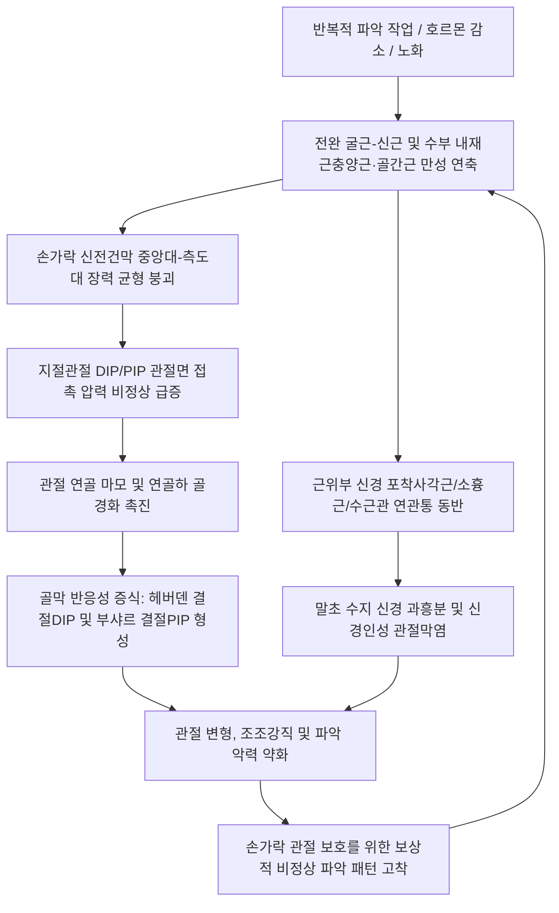

# 수부관절 통증(손가락 통증) (Hand & Finger Joint Pain)

> **상위 분류**: [[근골격계 질환]] > [[상지 질환]] > [[수부 질환]]
> **핵심 키워드**: 원위지절(DIP), 근위지절(PIP), 중수수지(MCP), 헤버덴 결절(Heberden), 부샤르 결절(Bouchard), 조조강직, 신전건막(Extensor hood), 충양근·골간근, 류마티스 관절염(RA) 감별

---

## 1. 질환 개요 & 해부학적 병태생리

- **개념 정의**:
  - 수부관절 통증(손가락 통증)은 원위지절간관절(DIP), 근위지절간관절(PIP), 중수수지관절(MCP), 그리고 엄지의 수근중수관절(1st CMC)을 구성하는 관절 연골, 활막, 관절낭, 측부인대 및 이들을 구동하는 외재근·내재근 건 복합체의 병리적 손상으로 인해 발생하는 통증 증후군이다.
  - 수부 관절은 단순한 경첩(Hinge) 구조가 아니라, 전완에서 내려오는 긴 힘줄들([[지신근]], [[천지굴근]], [[심지굴근]])과 손바닥 및 중수골 사이의 정밀한 내재근들(충양근, 골간근)이 고도의 장력 균형을 이루는 복합 생체역학 시스템이다.
- **해부학적 구조 & 영상 해부**:
  ![[Pasted image 20240115035843.png|450]]
  > [그림 1: ① 병태생리·영상 — 손가락 신전기구 및 내재근-힘줄 복합체 해부도] 충양근(Lumbrical), 골간근(Interossei), 지신근건(EDC), 천지굴근(FDS), 심지굴근(FDP)의 정지부 및 중앙대(Central band)·측도대(Lateral band)의 3차원적 역학 구조.
- **호발 대상 및 역학**:
  - **연령 및 성별**: 50대 이상 폐경 후 여성에서 폭발적으로 증가하며(여성 대 남성 비 약 3:1), 호르몬(에스트로겐) 감소가 관절 연골 및 콜라겐 유지력 저하와 밀접히 연관된다.
  - **호발 관절 순위**:
    1. 원위지절간관절 (DIP 관절 - 헤버덴 결절)
    2. 엄지 수근중수관절 (1st CMC 관절)
    3. 근위지절간관절 (PIP 관절 - 부샤르 결절)
  - **직업적 유발 요인**: 손가락 끝으로 집거나 쥐는 동작을 반복하는 주부, 조리사, 수예·공예가, 미용사, 악기 연주자, 농업 및 제조업 종사자.

---

## 2. 병태생리 메커니즘 & 생체역학적 악순환 네트워크

- **메커니즘 설명**:
  - **근육-힘줄 복합체 단축과 관절 연골 마찰 기전**: 손가락을 펴고 굽히는 근육과 힘줄이 만성 과로, 긴장, 허혈로 인해 탄력성을 잃고 단축(Contracture)되면, 관절낭과 정지부 골막을 지속적으로 잡아당겨 견인성 골막통을 유발하고 연골간 압력을 수 배 이상 증가시켜 연골 마모와 골극 형성을 가속한다.
  - **내재근과 신전 기구의 다원적 병태**: 충양근(FDP에서 기원하여 측도대에 부착)과 골간근(중수골 사이에서 기원하여 신전건막 정지)이 단축되면 측도대와 중앙대의 장력 분배가 무너져 PIP/DIP 관절의 비정상 회전 모멘트가 발생하고 연골 마모가 촉진된다.
  - **신경 포착으로 인한 신경 과흥분**: 상완신경총([[전사각근]], [[소흉근]]), 주관절 터널, 수근관 부위의 미세 신경 압박은 말초 수지 신경의 축삭 수송 장애와 역행성 신경인성 염증을 초래하여 관절 통각 수용기를 감작시킨다.
  - **관련 해부 구조물**:
    ![[Intrinsic_muscles_of_hand_anatomy.jpg|500]]
    > [그림 2: ② 관련 해부 구조물 — 수부 내재근(Intrinsic Muscles) 장측 및 배측 해부도] 무지구근, 소지구근, 충양근, 장측 골간근, 배측 골간근의 전면 및 후면 입체 배열.

---

## 3. 임상 증상 & 이학적 검사(Physical Exam) 알고리즘

### 임상 증상
- **관절 결절 및 변형**:
  - **헤버덴 결절 (Heberden's nodes)**: DIP 관절 배외측에 단단한 골극성 융기 발생, 손가락 끝마디가 굵어지고 삐뚤어짐.
  - **부샤르 결절 (Bouchard's nodes)**: PIP 관절 배외측의 골성 비후.
- **조조 강직 (Morning stiffness)**: 아침에 일어났을 때 손가락 관절이 뻣뻣하여 잘 쥐어지지 않으며, 대개 30분 이내에 활동하면서 풀림 (퇴행성 골관절염 특성).
- **동작통 및 악력 저하**: 캔 뚜껑을 따거나 걸레를 짤 때 관절이 시큰거리고 힘이 들어가지 않음.
- **점액낭포 (Mucous cyst)**: DIP 관절 배측 헤버덴 결절 바로 인접부에 투명한 젤리 같은 낭종이 형성되어 손톱 성장을 방해(손톱 고랑 변형).

### 이학적 검사 및 영상 평가 알고리즘
1. **수지 관절 4방향 촉진 검사 (Four-finger Palpation)**:
   - 검사자의 엄지와 검지로 지절관절 측면(측부인대)과 배측·장측을 4방향에서 정밀 촉진하여 활막 종창과 골극 압통을 감별.
2. **엄지 수근중수관절 마찰음 검사 (Grind Test - 1st CMC)**:
   - 엄지 중수골을 수직으로 압박하면서 비틀 때 염발음(Crepitus)과 날카로운 통증 발생 여부 확인.
3. **수지 신전-굴곡 저항 검사**:
   - 개별 손가락에 대해 FDS, FDP, 지신근의 저항 운동을 시행하여 힘줄정지부 통증 평가.
4. **근위부 신경 포착 스크리닝**:
   - 사각근 간극, 소흉근, 수근관 부위를 전수 확인하여 상위 신경 포착 여부 선별.
5. **단순 방사선 검사 (X-ray)**:
   - 관절강 협착, 연골하 골경화, 골극 형성, 진행기 갈매기 날개 모양 변형(Gull-wing sign) 관찰.
6. **근골격계 초음파 (Musculoskeletal Ultrasound)**:
   - 관절 연골 두께, 활막염(Synovitis) 혈류 활성도, 점액낭포 유무 정밀 진단.

---

## 4. 감별 진단 매트릭스 (Differential Diagnosis)

| 감별 항목 | 퇴행성 골관절염 (OA) | 류마티스 관절염 (RA) | 건선성 관절염 (PsA) | 통풍성 관절염 (Gout) |
| :--- | :--- | :--- | :--- | :--- |
| **호발 관절** | **DIP 관절**, PIP, 1st CMC | **MCP 관절**, PIP, 완관절 | DIP 관절, 전 수지 관절 | 1st MTP, 손가락 관절 |
| **조조 강직** | **30분 미만** (활동 시 완화) | **1시간 이상 지속** | 30~60분 지속 | 급성 발작 시 극심 |
| **관절 성상** | 단단한 뼈혹(헤버덴/부샤르 결절) | 푹신한 활막 비후, 열감, 대칭성 종창 | 소시지 수지(Dactylitis), 손톱 함몰 | 극심한 발적, 열감, 통풍 결절 |
| **DIP 침범** | **매우 흔함 (특징적)** | 거의 침범하지 않음 | 흔함 (손톱 병변 동반) | 드물게 침범 |
| **혈액 검사** | RF/Anti-CCP 음성, ESR 정상 | **RF 양성, Anti-CCP 양성, ESR 상승** | 자가항체 음성, HLA-B27 연관 | 요산(Uric acid) 수치 상승 |

---

## 5. 한의 통합 치료 프로토콜 (침·약침·추나·한약)

![[Dorsal_interossei_hand_anatomy.png|350]]
> [그림 3: ③ 치료·시술점 — 손가락 관절 통증 완화를 위한 배측 골간근 및 팔사혈(八邪) 자침·약침 시술점 해부도] 중수골 사이 공간에서 손가락 관절의 안정성과 외전을 제어하는 배측 골간근 및 지절관절 감압 취혈 목표점.

### 1) 침구 치료
- **국소 절간혈 및 압통점 자침**:
  - **아시혈(阿是穴)**: DIP, PIP 관절낭 배외측 및 측부인대 부착부에 0.20~0.25mm 호침으로 15도 사자 자입하여 관절낭 내압 감압.
  - **[[팔사]](八邪)**: 손가락 사이 4개 혈자리에 자침하여 내재근(골간근, 충양근)의 연축을 직접 해소.
  - **[[십선]](十宣)** 또는 **정혈(井穴)**: 급성기 관절 열감과 작열통이 심할 때 미세 사혈하여 청열소종(淸熱消腫).
- **원위부 경락 조절 혈자리**:
  - [[합곡]], [[노궁]], [[어제]]: 수부 전반의 기혈 순환 촉진.
  - [[양지]], [[양계]], [[대릉]], [[신문]]: 완관절 횡주름의 수혈로 신전근 및 굴곡근 장력 분산.
  - [[수삼리]], [[곡지]]: 전완 신전근 복부의 긴장 밴드를 제거하여 손가락으로 전달되는 견인력 차단.

### 2) 약침 치료 (Pharmacopuncture)
- **신바로약침 / 중성어혈약침**: 관절낭 주위 및 내재근 부착부에 0.2~0.3cc 미세 분주하여 연골하 골막 염증과 관절 활액낭염을 진정.
- **봉약침 (Sweet BV)**: 헤버덴/부샤르 결절의 만성 골비증에 0.1cc 미량 시술하여 국소 혈류 증진, 면역 조절 및 관절 강직 완화.
- **자하거(태반) 약침**: 간신기허형 만성 퇴행성 관절염 환자에게 투여하여 연골 영양 공급 및 관절 마모 억제.

### 3) 추나 요법 & 수지 가동술 (Chuna & Joint Mobilization)
- **수지 절간 견인-활주 기법**: 각 손가락 마디를 장축 견인하면서 미세 전후·측방 활주를 적용하여 관절 내압을 낮추고 활액 분비를 촉진.
- **내재근 및 전완 굴근군 근막 이완**: 중수골간 공간(골간근) 및 전완 천지/심지굴근 복부를 지압 스트리핑하여 말초 견인 장력 제거.

### 4) 한약 처방 (Herbal Medicine)
- **대방풍탕(大防風湯)**: 간신 부족과 기혈 허약으로 손가락 관절이 변형되고 굳어지는 만성 골비증의 기본 처방.
- **독활기생탕(獨活寄生湯)**: 풍한습비로 인해 손가락이 시리고 쑤시며 궂은날 통증이 악화되는 관절염 치료.
- **계지가출부탕(桂枝加朮附湯)**: 냉성 부종과 조조강직이 뚜렷한 손가락 관절통에 온경산한(溫經散寒) 효과.
- **서경탕(舒經湯)**: 기체어혈로 인해 손가락 굴신이 뻣뻣하고 당기는 증상 완화.

---

## 6. 재활 운동 & 생활습관 티칭 가이드

### 재활 운동
1. **손가락 관절 능동 가동 운동**:
   - 따뜻한 물(38~40℃)에 손을 담그고 주먹을 부드럽게 쥐었다 펴는 동작을 10분간 시행 (조조강직 해소).
2. **내재근 스트레칭 (Lumbrical Stretch / Table top)**:
   - MCP 관절은 90도 굴곡하고, PIP 및 DIP 관절은 완전히 펴는 테이블탑 자세를 통해 충양근과 골간근을 신장.
3. **고무줄 손가락 벌림 운동**:
   - 손가락 끝에 가벼운 탄력 밴드를 걸고 바깥으로 벌려주는 손가락 신전근 강화 훈련.

### 관절 보호 원칙 (Joint Protection Principles)
- **지렛대 원리 활용**: 작은 손가락 관절 대신 큰 관절(손바닥, 팔뚝)을 활용하여 물건을 지탱 (예: 냄비를 들 때 손가락으로 손잡이를 쥐지 말고 양손 바닥으로 받치기).
- **두꺼운 손잡이 도구 사용**: 볼펜, 식기, 칫솔 손잡이에 실리콘 폼 튜브를 끼워 손가락 관절의 과도한 굴곡 압력을 분산.
- **온열 파라핀 요법**: 온열 파라핀 배스(Paraffin bath)를 1일 1~2회 적용하여 수부 심부 미세 순환을 개선하고 인대 유연성 확보.

---

## 7. 💡 사용자 진료실 핵심 필기 & 임상 노하우 (Melt-In 잔여 심화 집약)

> [!TIP] **진료실 임상 관찰 포인트**
> 1. **실전 문진 및 힘줄 정지부 추적 요령**:
>    - "수부의 국소적 통증 범위를 보고 어떤 힘줄이 정지하는지를 먼저 확인하라!"
>    - "DIP 끝마디 바닥은 [[심지굴근]](FDP), PIP 중간마디 바닥은 [[천지굴근]](FDS), 엄지 끝마디는 [[장무지굴근]](FPL)의 정지점이다."
>    - "손가락 관절염은 [[천지굴근]] 하나만의 문제가 아니라 여러 내재근(충양근, 골간근)과 신전근 복합체의 장력 붕괴로 발생한다."
>    - "손가락 통증 치료 시 반드시 근위부 신경포착([[전사각근]], [[소흉근]], 경추 협척)을 함께 치료해야 신경 과흥분이 가라앉아 치료 효과가 지속된다."
> 2. **류마티스 감별 체크리스트**:
>    - 환자가 "아침에 손이 굳어서 주먹이 안 쥐어진다"고 호소할 때, 강직이 **30분 이내에 풀리는지(퇴행성)** 아니면 **점심때까지 1시간 이상 지속되는지(류마티스)**를 가장 먼저 문진한다.
>    - 끝마디(DIP)만 튀어나왔다면 안심시키고(헤버덴 결절), 손바닥과 손가락이 만나는 MCP 마디가 푹신하게 부어 있다면 즉시 류마티스 인자(RF) 및 Anti-CCP 검사를 의뢰한다.
> 3. **환자 티칭 스크립트**:
>    - "환자분, 손가락 끝마디가 굵어지고 튀어나오는 것은 손가락을 평생 부지런히 사용하시면서 연골을 보호하기 위해 뼈가 굳은살처럼 자라난 '헤버덴 결절'입니다."
>    - "이 뼈혹은 류마티스 관절염처럼 전신으로 번지거나 뼈를 녹이는 무서운 병이 아니니 안심하셔도 됩니다."
>    - "통증의 근본 원인은 팔뚝과 손바닥에서 손가락을 잡아당기는 힘줄과 잔근육들이 뻣뻣하게 굳어서 관절을 강하게 짓누르기 때문입니다. 침과 약침으로 힘줄의 긴장을 풀어 관절에 가해지는 압력을 줄여주면 붓기와 통증이 가라앉아 편안하게 일상생활을 하실 수 있습니다."

---

## 8. 출처 및 학술 참고 문헌 (References)

1. Kloppenburg M, Namane M, Cicuttini F (2025). Osteoarthritis. *Lancet*, 405(10477):523-538. [PMID: 39755397](https://pubmed.ncbi.nlm.nih.gov/39755397/)
   - [연구 요약]: 손가락 원위지절(DIP, 헤버덴 결절) 및 근위지절(PIP, 부샤르 결절), 수근중수관절(CMC) 골관절염의 최신 분자 기전, 연골 파괴와 골극 형성, 내재근-힘줄 단위의 역학적 부하 및 비약물·보존적 다학제 치료 가이드라인을 집대성함.
2. Straatman L, Hutter M, Mudathir R et al. (2026). Structural and clinical disease severity in thumb osteoarthritis: A pilot study integrating imaging analysis and pain mechanisms. *J Hand Ther*, 39(1):45-53. [PMID: 40537392](https://pubmed.ncbi.nlm.nih.gov/40537392/)
   - [연구 요약]: 수부 관절염 환자에서 단순 관절 연골 마모 정도보다 힘줄-인대 복합체의 긴장도, 골막 신경 감작 및 통증 전달 기전이 임상적 통증 강도와 손 기능 제한에 더 결정적인 영향을 미침을 실증함.
3. Sudoł-Szopińska I, et al. (2026). Limited discriminatory value of RAMRIS findings between RA and hand osteoarthritis: a cross-sectional MRI study. *Rheumatol Int*, 46(2):189-197. [PMID: 41689640](https://pubmed.ncbi.nlm.nih.gov/41689640/)
   - [연구 요약]: 류마티스 관절염(RA)과 퇴행성 손관절염(Hand OA) 간의 MRI 소견을 비교 분석하여, 활막염과 골미란의 중첩 양상 속에서 DIP 침범 여부와 조조강직 지속 시간, 혈청학적 지표의 종합적 감별 진단 중요성을 규명함.
