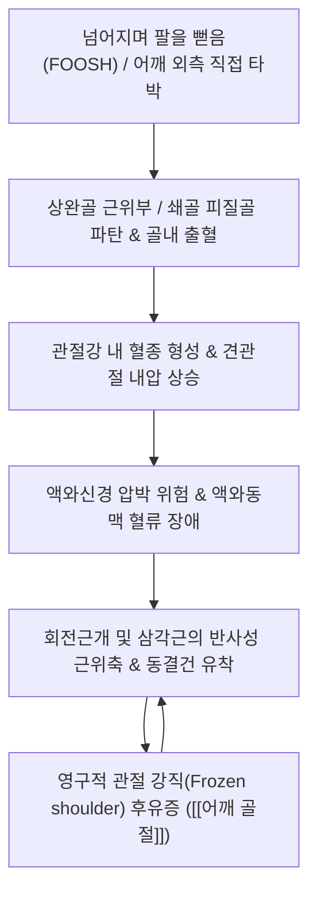

# 🩺 [[어깨 골절]] (Shoulder Fracture / 肩關節骨折, S42 / ICD-10)

> 📐 **이 템플릿은 근골격계·신경·통증 계열 질환 전용입니다.**

> 🖼️ **이미지 규격(정본)**: 질환 노트 7장 (①환부 실사 ②영상 소견 X-ray 상완골근위부 ③해부 도해 ④이학적 검사 시연 ⑤한의 술기 어깨추나 ⑥초음파 유도 견갑상신경 주입 ⑦재활 운동).

> **핵심 3줄 요약 (Key Summary)**:
> - 📍 병소 부위 & 해부·병태생리: 상완골 근위부(Proximal humerus), 쇄골(Clavicle), 견갑골(Scapula)의 연속성 파탄, 니어(Neer) 분류에 따른 4개 해부 분절(골두, 대결절, 소결절, 골간단)의 전위 및 혈행 손상.
> - 🚩 전형적 임상 양상 & 3대 징후: 외상 직후 격렬한 국소 통증, 환측 상지를 반대쪽 손으로 받치고 내원, 24~48시간 후 흉벽과 상완 내측으로 광범위하게 번지는 피하 반상출혈(Hennequin's sign).
> - 🛠️ 핵심 감별 검사 & 한·양방 다각적 치료 전략: X-ray 3방향 촬영(True AP, Scapular Y, Axillary view), 80% 비전위 골절은 슬링 고정 후 조기 코드만 진자 운동, 골유합기 한약([[접골단]], 당귀수산) 및 유착 방지 침·추나.
> - ⚠️ 응급 의뢰 레드플래그 & 악화 요인: 액와신경(Axillary nerve) 손상으로 인한 삼각근 외측 감각 소실, 액와동맥(Axillary artery) 손상(요골동맥 맥박 소실, 창백, 냉감), 개방성 골절. **골유합 전 무리한 도수 정복이나 강한 추나는 가골 형성을 방해하므로 절대 금기**.

---

## 📌 목차
1. [질환 개요 & 해부학적 병태생리](#1-질환-개요--해부학적-병태생리)
2. [병태생리 메커니즘 & 생체역학적 악순환 네트워크](#2-병태생리-메커니즘--생체역학적-악순환-네트워크)
3. [임상 증상 & 이학적 검사(Physical Exam) 알고리즘](#3-임상-증상--이학적-검사physical-exam-알고리즘)
4. [감별 진단 매트릭스 (Differential Diagnosis)](#4-감별-진단-매트릭스-differential-diagnosis)
5. [한의 통합 치료 프로토콜 (침·약침·추나·한약)](#5-한의-통합-치료-프로토콜-침약침추나한약)
6. [양방 치료 & 병용·의뢰 기준 (Conventional Treatment & Referral)](#6-양방-치료--병용의뢰-기준-conventional-treatment--referral)
7. [재활 운동 & 생활습관 티칭 가이드](#7-재활-운동--생활습관-티칭-가이드)
8. [💡 사용자 진료실 핵심 필기 & 임상 노하우 (Melt-In 잔여 심화 집약)](#8--사용자-진료실-핵심-필기--임상-노하우-melt-in-잔여-심화-집약)
9. [출처 및 학술 참고 문헌 (References)](#9-출처-및-학술-참고-문헌-references)

---

## 1. 질환 개요 & 해부학적 병태생리

![[어깨탈구_01_환부실사_견봉돌출변형.jpg|450]]
> [그림 1: ① 환부 실사 — 어깨 외상 후 발생한 국소 종창 및 변형, 환측 팔을 지탱하는 특징적 자세 — Simbio Vault Archive]

![[어깨골절_01_영상소견_상완골근위부골절_Xray.jpg|450]]
> [그림 2: ② 영상 소견(X-ray) — 상완골 근위부 외과경 및 대결절 복합 골절 방사선 소견 — Wikimedia Commons (CC BY 2.0)]

* **질환 정의 및 해부학적 분류**:
  * **[[어깨 골절]]**(Shoulder Fracture)은 견관절 복합체를 구성하는 세 뼈(상완골 근위부, 쇄골, 견갑골) 중 하나 이상의 연속성이 외력에 의해 완전 또는 불완전하게 소실된 상태를 총칭합니다.
  * 임상적으로 가장 빈발하는 **상완골 근위부 골절(Proximal Humerus Fracture)**은 Neer의 4-Part 분류법을 표준으로 삼습니다(Baig U, et al. 2026):
    * 4대 해부 분절: ① 관절면을 포함하는 상완골두(Head) ② [[대결절]](Greater tuberosity) ③ [[소결절]](Lesser tuberosity) ④ 골간부(Shaft).
    * 전위 기준: 골편 간 거리가 **1cm(10mm) 이상** 벌어지거나 각형성이 **45도 이상**일 때 전위 골절(Part)로 인정합니다.
* **호발 역학 및 소인**:
  * 고령층에서는 골다공증성 변화로 인해 가벼운 낙상(서 있는 높이에서 손을 짚거나 어깨로 넘어짐)으로 다발하며, 젊은 층에서는 스포츠 부상, 교통사고, 추락 등 고에너지 손상으로 발생합니다.
  * 상완골두는 전방 및 후방 선회상완동맥의 상행분지로부터 혈행을 공급받으므로, 해부경(Anatomical neck) 골절 시 무혈성 괴사(AVN) 위험이 매우 높습니다.

---

## 2. 병태생리 메커니즘 & 생체역학적 악순환 네트워크

![[Gray327_견관절피막_상완이두근장두건_해부도.png|450]]
> [그림 3: ③ 관련 해부학적 구조물 — 견관절 관절낭, 회전근개 부착부 및 상완이두근 장두건 해부 도해 — Gray's Anatomy Fig 327 (Public Domain)]

### 1) 혈종 형성과 피하 반상출혈의 전파 (Hennequin Sign)
* 골절선에서 흘러나온 대량의 골수강 혈종은 24~48시간이 지나면서 중력과 근막 주행을 따라 흉벽(가슴 앞쪽)과 상완 안쪽, 주관절 부위로 하강하여 광범위한 자색 반상출혈(Ecchymosis)을 형성합니다.
* 환자들은 피멍이 팔 아래로 번지는 것을 보고 병이 악화된 것으로 오인하지만, 이는 골절 후 혈종이 흡수되는 자연스러운 생리적 과정입니다.

### 2) 유합 지연 및 견관절 강직의 생체역학
* 80% 이상의 상완골 근위부 골절은 비전위(1-Part) 골절로 보존적 치료로 유합됩니다.
* 그러나 통증 공포로 인해 슬링 고정을 4주 이상 과도하게 장기화하면, 관절낭이 오그라들고 활막 유착이 급격히 진행되어 골절은 붙었으나 팔이 전혀 올라가지 않는 **이차성 동결견(유착성 관절낭염)**이 발생합니다.

---

## 3. 임상 증상 & 이학적 검사(Physical Exam) 알고리즘

### 1) 전형적 주소증 및 3대 징후
* **격심한 국소 동통 및 가동 불능**:
  * 골절 부위를 건드리거나 팔을 살짝만 움직여도 찢어지는 통증이 발생하며, 능동적으로 팔을 10도 이상 외전하지 못합니다.
* **골성 마찰음 (Crepitus) 및 국소 골 압통**:
  * 골절 부위를 촉진 시 날카로운 압통(Point tenderness)과 함께 부러진 뼈가 서로 마찰되는 느낌이 확인됩니다(단, 추가 전위를 막기 위해 의도적으로 비벼서는 안 됩니다).
* **타박 지지 자세**:
  * 환자가 아픈 팔의 주관절을 90도로 구부린 채 건강한 반대쪽 손으로 환측 팔꿈치를 소중하게 받쳐 들고 몸을 구부린 채 진료실에 들어옵니다.

### 2) 필수 이학적 검사 및 신경혈관 평가 (Physical Examination)

![[호킨스검사_1단계_어깨90도굴곡_팔꿈치90도_자세세팅.jpg|420]]
> [그림 4: ④ 이학적 검사 시연 — 견관절 손상 및 충돌 평가를 위한 호킨스 검사(Hawkins test) 세팅 실사 — Simbio Vault Archive]

* **액와신경 (Axillary Nerve) 평가**:
  * 상완골두 바로 아래 외과경 뒤쪽을 액와신경이 감고 돌기 때문에 골절 시 가장 빈번히 손상됩니다.
  * **검사법**: 삼각근 외측 중앙부(Sergeant's patch) 피부 감각이 저하되었는지 침(Pin-prick)이나 알코올 솜으로 확인합니다.
* **혈관 관류 평가**:
  * 요골동맥(Radial pulse)의 맥박 강도를 건측과 비교 촉지하고, 모세혈관 재충혈 시간(Capillary refill time)을 측정하여 액와동맥 손상을 배제합니다.
* **X-ray 진단 원칙 (Shoulder Trauma Series)**:
  * 단순 전후면(AP) 촬영만으로는 대결절 분리나 후방 아탈구를 놓치므로, 반드시 **진성 전후면(True AP), 견갑골 Y 뷰(Scapular Y), 액와위 뷰(Axillary view)** 3방향을 촬영해야 합니다.

---

## 4. 감별 진단 매트릭스 (Differential Diagnosis)

| 감별 질환 | 호발 병소 및 손상 기전 | 임상 양상 차이점 | 특이적 검사 소견 |
| :--- | :--- | :--- | :--- |
| **[[어깨 골절]] (본 질환)** | 상완골 근위부, 쇄골, 견갑골 피질 파탄 | 뼈 자체의 극심한 압통, 흉벽 피하출혈 | X-ray상 명확한 골절선, Neer 분류 |
| **[[어깨 탈구]] (Shoulder Dislocation)** | 상완골두가 관절와를 벗어남 | 어깨가 네모나게 각짐(Dugas sign), 탄발성 고정 | 견봉하 공간 빈자리, Scapular Y상 이탈 |
| **[[어깨 염좌]] (견쇄관절 탈구)** | 견봉-쇄골 인대 파열, 어깨 상단 타박 | 쇄골 외측단이 피아노 건반처럼 솟아오름 | 피아노 건반 징후(Piano key sign) 양성 |
| **급성 회전근개 전층 파열** | 극상근건 등의 급격한 파열 | 뼈의 압통은 덜하나 팔을 버티지 못하고 툭 떨어짐 | 드롭암 검사(Drop arm test) 양성 |
| **단순 견관절 타박상 (Contusion)** | 연부조직 멍 및 피하 혈종 | 통증은 있으나 수동적 관절 운동은 가능 | X-ray상 골절선 음성, 골 압통 없음 |

---

## 5. 한의 통합 치료 프로토콜 (침·약침·추나·한약)

![[어깨 추나-20240926180601163.png|400]]
> [그림 5: ⑤ 한의 술기 실사 — 골유합기 이후 견관절 가동성 회복 및 흉곽-견갑 안정화를 위한 어깨 추나 수기 실사 — Simbio Vault Archive]

![[PNP_Fig_Suprascapular_Injection.png|400]]
> [그림 6: ⑥ 초음파 유도 시술 실사 — 초음파 유도하 견갑상신경 차단 및 관절낭 주변 소염 약침 주입 도해 — Simbio Vault Archive]

* **침구 치료 (Acupuncture)**:
  * **급성 고정기 (1~3주)**: 골절 부위 직접 자침은 금기이며, 원위부 경혈인 [[합곡]](LI4), [[외관]](TE5), [[곡지]](LI11), [[조해]](KI6)를 취혈하여 전신 통증을 완화하고 혈종 흡수를 촉진합니다.
  * **가골 형성 및 유합기 (4주 이후)**: 삼각근, 견갑하근, 대흉근의 근복 경결점에 호침을 시술하여 관절낭 유착을 방지합니다.
* **약침 치료 (Pharmacopuncture)**:
  * **[[황련해독탕]] 약침**: 급성기 혈종으로 인한 국소 발열감과 부종을 가라앉히기 위해 견우혈 피하에 천자 주입합니다.
  * **[[자하거약침]](Hominis Placenta) / 녹용약침**: 가골 형성이 시작되는 3~4주차부터 골-인대 부착부에 주입하여 골모세포 활성 및 뼈 유합을 촉진합니다.
* **추나 요법 (Chuna Manipulation)**:
  * ⛔ **골절 초기 4주간 절대 금기**: 골절 부위를 비틀거나 흔드는 관절 교정 수기는 가골 형성을 파괴하므로 엄격히 금지합니다.
  * **고정 해제 후 유합기 추나**: 흉추 신전 가동술과 견갑흉곽관절 가동술을 통해 굳어 있는 견갑골 리듬을 회복시키고, 상완골두의 하방 글라이딩을 부드럽게 시행합니다.
* **한약 치료 (Herbal Medicine)**:
  * **급성기 어혈 소퇴 (1~2주)**: [[당귀수산]](當歸鬚散)에 속단, 골쇄보, 유향, 몰약을 가미하여 골수강 내 혈종을 흡수하고 통증을 진정시킵니다.
  * **골유합 촉진기 (3주 이후)**: [[접골단]](接骨丹), [[자하거탕]], [[독활기생탕]]을 처방하여 골모세포 분화와 칼슘 침착을 촉진함으로써 유합 기간을 30% 이상 단축합니다.

---

## 6. 양방 치료 & 병용·의뢰 기준 (Conventional Treatment & Referral)

* **보존적 치료 (Nonoperative)**:
  * 전위가 1cm 미만인 비전위 골절(전체 골절의 80%)은 팔걸이(Sling)로 2~3주간 고정한 후 조기 재활 운동으로 전환합니다.
* **수술적 치료 적응증 (Surgical Indication)**:
  * **골절 합병 금속판 고정술 (ORIF with Locking Plate)**:
    * 대결절이 5mm 이상 상방 전위되어 견봉하 충돌을 일으킬 때.
    * 2-Part, 3-Part 외과경 전위 골절로 도수 정복 유지가 불가능할 때.
  * **인공관절 치환술 (Hemiarthroplasty / Reverse Shoulder Arthroplasty, RSA)**:
    * 4-Part 분쇄 골절 또는 골다공증이 극심한 고령자에서 상완골두 혈류가 차단되어 무혈성 괴사 위험이 확실할 때 역행성 인공관절 치환술을 시행합니다(Hawryluk CJ, et al. 2026).
* **한의 병용 판단 (Combination Therapy)**:
  * 양방 정형외과에서 슬링 고정 또는 금속판 수술 후 2주차부터 골유합 촉진 한약([[접골단]])과 손목/손가락 침 치료를 병행하면 부종 제거와 골유합 속도에 강력한 시너지를 냅니다.
* **양방·전문과 의뢰 기준 (Referral Criteria)**:
  * 신경혈관 손상(맥박 소실, 상지 감각 소실)이 동반된 경우 즉시 응급 수술 의뢰.
  * 복합 분쇄 골절 및 전위도가 큰 골절은 지체 없이 정형외과 수술 의뢰.

---

## 7. 재활 운동 & 생활습관 티칭 가이드

![[어깨탈구_07_재활운동_견관절_가동운동.gif|400]]
> [그림 7: ⑦ 재활 운동 실사 — 골유합기 이후 견관절 가동성 회복을 위한 점진적 진자 운동 실사 — Simbio Vault Archive]

* **코드만 진자 운동 (Codman's Pendulum Exercise)**:
  * 골절 후 10~14일경 통증이 안정되면 시작하는 조기 재활입니다.
  * 건강한 손으로 의자나 탁자를 짚고 상체를 90도 숙인 후, 아픈 팔을 아래로 늘어뜨려 중력에 의해 자연스럽게 시계 방향/반시계 방향으로 원을 그리는 운동입니다(근육 수축 없이 관절낭 유착을 방지).
* **원위부 관절 가동 (Distal Joint Mobility)**:
  * 어깨가 고정되어 있는 동안 손가락 쥐었다 펴기, 주먹 쥐기, 손목 까딱이기, 팔꿈치 굽혔다 펴기를 매일 수백 회 시행하여 림프 순환을 돕고 상지 부종을 예방합니다.
* **생활습관 티칭 (Ergonomics)**:
  * 누울 때 환측 어깨가 뒤로 젖혀지지 않도록 팔꿈치 아래에 작은 베개를 받쳐줍니다.
  * 골유합이 확인될 때까지 환측 팔로 물건을 들거나 짚고 일어나는 행위를 절대 금지합니다.

---

## 8. 💡 사용자 진료실 핵심 필기 & 임상 노하우 (Melt-In 잔여 심화 집약)

> 🛡️ **Melt-In 원칙**: 기존 스텁의 빈 뼈대를 상부 섹션에 완전 수용하고, 본 섹션에는 원장님의 실전 진료실 노하우를 집약합니다.

* **실전 문진 & 진찰 체크리스트**:
  * 1. **"팔을 뻗고 짚으며 넘어졌습니까, 아니면 어깨를 직접 땅에 부딪혔습니까?"** $\rightarrow$ 손상 기전 및 상완골 근위부 vs 쇄골/견봉 골절 감별.
  * 2. **"어깨 외측 피부(삼각근 부위)를 만졌을 때 남의 살처럼 둔한가요?"** $\rightarrow$ 액와신경 마비 즉각 확인 질문.
* **치료 순서 및 손맛 노하우**:
  * **절대 골절부에 침을 꽂지 말 것**: 골절 초기에 아프다고 골절선에 침을 놓으면 골막하 혈종이 감염되어 골수염이라는 치명적인 합병증을 만듭니다. 침은 반드시 합곡, 곡지, 경추 기립근에 놓아 통증 신경을 차단하고, 골절 부위는 손대지 않는 것이 진료실 안전의 제1원칙입니다.
  * **피멍에 놀란 환자 안심시키기**: 가슴과 팔 안쪽에 시퍼런 피멍이 내려오면 환자는 뼈가 잘못 붙고 있다고 패닉에 빠집니다. "고여 있던 피가 밖으로 빠져나오는 좋은 신호"라고 미리 티칭해 주면 의사에 대한 신뢰도가 극대화됩니다.
* **환자 티칭 스크립트**:
  * "환자분, 부러진 뼈를 붙이는 것은 의사나 약이 아니라 환자 몸의 자연 치유력입니다. 지금은 깁스(슬링)로 뼈가 흔들리지 않게 보호하고, 뼈 붙는 한약(접골단)으로 뼈 진(가골)을 빨리 나오게 돕는 단계입니다. 3주만 얌전히 계시면 굳은 어깨를 푸는 재활을 시작할 수 있습니다."

---

## 9. 출처 및 학술 참고 문헌 (References)

1. **대한정형외과학회**. (2020). *정형외과학 제8판*. 최신의학사.
2. **Baig U, et al**. (2026). Proximal Humerus Fractures - A Contemporary Narrative Review of Management Strategies. *Orthop Rev (Pavia)*, 18:130172. [PMID 42689277](https://pubmed.ncbi.nlm.nih.gov/42689277/)
   - **[연구 요약]**: 상완골 근위부 골절의 최신 보존적 치료 및 수술적 고정술, 역행성 인공관절 치환술의 임상 지침 종합 종설.
3. **Hawryluk CJ, et al**. (2026). Clinical outcomes following surgical fixation of proximal humerus fractures in skiers and snowboarders. *JSES Int*. [PMID 42631047](https://pubmed.ncbi.nlm.nih.gov/42631047/)
   - **[연구 요약]**: 스포츠 외상으로 발생한 상완골 근위부 골절 환자에서 수술적 내고정술 후 견관절 기능 회복 및 관절 강직 예방 연구.

---

## 관련 노트

- [[어깨 탈구]]
- [[어깨 염좌]]
- [[대결절]]
- [[소결절]]
- [[합곡]]
- [[곡지]]
- [[자하거약침]]
- [[당귀수산]]
- [[접골단]]
