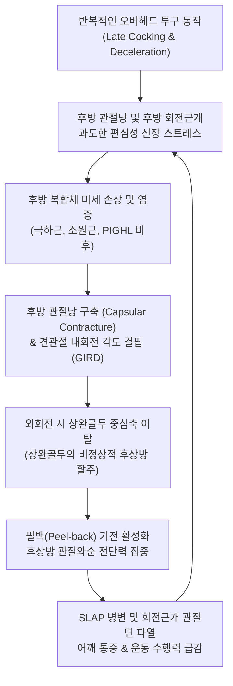

# 🩺 어깨 내회전 결핍 증후군 (Glenohumeral Internal Rotation Deficit, GIRD)

> **핵심 3줄 요약 (Key Summary)**:
> - 📍 **병소 부위 & 해부·병태생리**: 투구 동작이나 오버헤드 스포츠 동작의 반복으로 인해 견관절의 후방 관절낭(Posterior Capsule) 및 후방 [[회전근개]]([[극하근]], [[소원근]])이 비후·단축되어 건측 대비 내회전(IR) 가동범위가 유의하게 소실되는 생체역학적 기능 이상 증후군이다.
> - 🚩 **전형적 임상 양상**: 90도 외전 위치에서 건측 대비 내회전 각도가 18°~20° 이상 감소하거나 양측 총 가동호(Total Arc of Motion, TROM) 차이가 5°를 초과하며, 후상방 견관절 통증 및 투구 속도 저하, 릴리스 포인트 불안정이 동반된다.
> - 🛠️ **핵심 검사 & 치료 전략**: 견갑골을 전방에서 압박 고정한 정밀 수동 회전각 측정 및 호킨스·오브라이언 검사로 감별하고, 후방 관절낭·극하근·소원근의 침·약침 자침 및 관절 후방 활주(Posterior Glide) 추나 기법, 슬리퍼 스트레칭을 결합하여 가동성을 복원한다.
> - ⚠️ **응급 의뢰 레드플래그**: 급성 외상 후 발생한 어깨 관절와순의 완전 파열(SLAP Type II~IV), 견관절의 급성 탈구 및 불완전 정복, 심각한 회전근개 전층 파열로 인한 근력 마비(Drop Arm 징후 양성), 관절내 급성 감염 징후.

---

## 📌 목차
1. [질환 개요 & 해부학적 병태생리](#1-질환-개요--해부학적-병태생리)
2. [병태생리 메커니즘 & 생체역학적 악순환 네트워크](#2-병태생리-메커니즘--생체역학적-악순환-네트워크)
3. [임상 증상 & 이학적 검사(Physical Exam) 알고리즘](#3-임상-증상--이학적-검사physical-exam-알고리즘)
4. [감별 진단 매트릭스 (Differential Diagnosis)](#4-감별-진단-매트릭스-differential-diagnosis)
5. [한의 통합 치료 프로토콜 (침·약침·추나·한약)](#5-한의-통합-치료-프로토콜-침약침추나한약)
6. [양방 치료 & 병용·의뢰 기준 (Conventional Treatment & Referral)](#6-양방-치료--병용의뢰-기준-conventional-treatment--referral)
7. [재활 운동 & 생활습관 티칭 가이드](#7-재활-운동--생활습관-티칭-가이드)
8. [💡 사용자 진료실 핵심 필기 & 임상 노하우 (Melt-In 잔여 심화 집약)](#8--사용자-진료실-핵심-필기--임상-노하우-melt-in-잔여-심화-집약)
9. [출처 및 학술 참고 문헌 (References)](#9-출처-및-학술-참고-문헌-references)

---

## 1. 질환 개요 & 해부학적 병태생리

**어깨 내회전 결핍 증후군(Glenohumeral Internal Rotation Deficit, 이하 GIRD)**은 야구 투수, 배구, 배드민턴, 테니스 등 팔을 머리 위로 강하게 휘두르는 오버헤드(Overhead) 스포츠 선수 및 일반인에게 빈발하는 견관절 기능 부전 증후군이다. 해부학적으로 견관절(Glenohumeral Joint)은 인체 관절 중 가장 넓은 가동범위를 갖는 구와관절(Ball-and-socket joint)로, 관절와의 면적이 상완골두 접촉면의 약 25~30%에 불과하여 관절와순(Glenoid Labrum)과 주변 인대(상·중·하 상완와인대) 및 회전근개 건에 의해 동적·정적 안정성을 유지한다.

반복적인 코킹(Late Cocking) 및 감속(Deceleration) 단계에서 견관절 후방 복합체에는 극심한 전단력과 신장 스트레스가 가해진다. 이러한 미세 외상이 누적되면 **후하방 관절낭(Posterior-Inferior Glenohumeral Ligament, PIGHL)**과 후방 [[회전근개]]([[극하근]], [[소원근]])에 섬유성 비후(Hypertrophy)와 반흔 구축(Contracture)이 발생한다. 이로 인해 상완골두를 중심에 안정적으로 유지하지 못하고 상완골두가 외회전 시 후상방(Posterosuperior)으로 비정상적 활주(Translation)를 일으켜 관절와순 후상방 마모 및 내적 충돌을 유발한다.

![[관절낭패턴_견관절_관절낭_및_오훼상완인대_해부도해.png]]
> [그림 1: ① 병태생리·해부 — 견관절 관절낭 및 오훼상완인대 해부도해]

---

## 2. 병태생리 메커니즘 & 생체역학적 악순환 네트워크

GIRD의 병태생리는 단순한 근육 긴장을 넘어 골성 적응(Bony Adaptation)과 연부조직 구축(Soft-tissue Contracture)이 복합적으로 얽혀 있다. 유소년기부터 투구를 지속한 선수의 경우 상완골 후염각(Humeral Retroversion)이 증가하여 생리적으로 외회전은 커지고 내회전은 줄어드는 적응을 보인다. 그러나 병적인 GIRD는 후방 관절낭 및 관절와순 복합체의 비가역적 구축이 주원인이다.

투구의 감속기(Follow-through) 동안 후방 회전근개는 초당 수천 도에 달하는 내회전 속도를 편심성 수축(Eccentric Contraction)으로 제어해야 한다. 이 과부하가 만성화되면 염증 반응과 함께 제1형 콜라겐 침착이 일어나 후방 관절낭이 뻣뻣해진다. 뻣뻣해진 후방 관절낭은 팔을 90도 외전 및 최대 외회전하는 코킹 후기 단계에서 상완골두를 전하방 중심축에서 밀어내어 **후상방으로 이동**시킨다. 이 현상을 **'필백 현상(Peel-back Mechanism)'**이라 부르며, 상완이두근 장두건(LHBT) 부착부와 후상방 관절와순을 박리시켜 [[SLAP 병변]](Superior Labrum Anterior to Posterior) 및 후방 내적 충돌 증후군(Posterosuperior Internal Impingement)으로 진행하는 악순환을 형성한다.

---

## 3. 임상 증상 & 이학적 검사(Physical Exam) 알고리즘

### 1) 임상 증상
환자는 일상적인 거상 동작보다는 머리 위로 팔을 넘겨 스윙하거나 투구할 때 어깨 심부의 뻐근한 통증을 호소한다. 특히 투구 코킹 말기나 릴리스 순간에 후상방 또는 견봉 하부에서 찌르는 듯한 통증을 느끼며, 공의 릴리스 포인트가 흔들리고 구속이 저하되는 양상을 보인다. 일상생활에서는 등 뒤로 손을 올리는 동작(예: 벨트 매기, 지퍼 올리기, 열중쉬어 자세) 시 뚜렷한 제한과 결림을 호소한다.

### 2) 이학적 검사 알고리즘
- **총 가동호(Total Arc of Motion, TROM) 및 내회전(IR) 정밀 측정**:
  환자를 앙와위(Supine)로 눕히고 견관절을 90도 외전, 주관절 90도 굴곡 상태로 세팅한다. 검사자의 한 손으로 오훼돌기와 쇄골, 견봉을 전방에서 견고하게 눌러 견갑골(Scapula)의 대상성 전방 경사(Anterior Tilt) 및 거상을 완벽히 차단한 후, 다른 손으로 전완을 잡고 수동 내회전 및 외회전 각도를 측정한다.
  - **병적 GIRD 판정 기준**: 건측 대비 환측의 내회전 각도 결핍이 **18°~20° 이상**이거나, 양측 TROM(외회전 각도 + 내회전 각도)을 합산했을 때 환측의 TROM이 건측보다 **5° 이상 감소**한 경우 병적 GIRD로 진단한다.
- **수평 내전 검사(Horizontal Adduction Test)**: 견관절 90도 굴곡 상태에서 반대측 어깨 방향으로 수평 내전 시 후방 관절낭 및 극하근의 팽팽한 당김과 관절와 후방의 압통을 확인한다.
- **호킨스-케네디 검사([[호킨스 검사]]) & 니어 검사([[니어 검사]])**: 후방 관절낭 단축에 이차적으로 동반된 전상방 견봉하 충돌 증후군을 배제·확인한다.
- **오브라이언 검사(O'Brien Active Compression Test)**: 내회전 및 회내 상태에서 하방 압박 시 통증이 유발되고 외회전/회외 시 통증이 감소하면 동반된 [[SLAP 병변]]을 강력히 시사한다.

![[어깨내회전결핍증후군_03_이학적검사_내회전각도측정_실사.jpg]]
> [그림 2: ② 이학적 검사 — 견관절 90도 외전 상태에서의 능동·수동 내회전(IR) 각도 정밀 측정 실사]

![[호킨스검사_1단계_어깨90도굴곡_팔꿈치90도_자세세팅.jpg]]
> [그림 3: ② 이학적 검사 — 후방 관절낭 구축에 동반된 견봉하 충돌 증후군 감별을 위한 호킨스-케네디 검사]

---

## 4. 감별 진단 매트릭스 (Differential Diagnosis)

| 감별 질환 | 호발 연령/기전 | 주요 증상 및 통증 부위 | TROM / ROM 양상 | 특이 이학적 검사 및 감별점 |
| :--- | :--- | :--- | :--- | :--- |
| **GIRD** | 10~30대 오버헤드 선수 | 후상방 어깨 통증, 투구 속도 저하 | **내회전만 선택적 소실** (TROM 차이 >5°), 외회전은 정상 또는 증가 | 견갑골 고정 수동 IR 측정 시 건측 대비 ≥18° 결핍 |
| **[[회전근개 파열]]** | 40대 이상, 퇴행성/외상 | 야간통, 삼각근 부위 방사통 | 능동 ROM 제한, 수동 ROM은 정상 유지 | Drop arm test (+), Empty can test (+), 근력 저하 현저 |
| **[[견관절 충돌증후군]]** | 30~50대, 직업적 반복 거상 | 팔을 60°~120° 외전 시 통증(통증호) | 전반적 외전 시 궤적 통증 | Neer test (+), Hawkins-Kennedy test (+), 관절낭 구축 없음 |
| **[[SLAP 병변]]** | 20~30대 투구/낙상 손상 | 투구 시 어깨 심부의 '딸깍(Clicking)'음 | 외회전 및 거상 시 통증 유발 | O'Brien test (+), Crank test (+), Speed test (+) |
| **[[유착성 관절낭염]]** | 50대 호발, 특발성/당뇨 | 모든 방향의 극심한 운동 제한 | **전 방향(외회전·내회전·외전) 능동/수동 모두 심각한 제한** | 관절낭 패턴(외회전 > 외전 > 내회전 순 제한) |

![[SLAP병변_제2형_어깨_MRI_소견.jpg]]
> [그림 4: ① 영상 감별 — GIRD 만성화로 인한 후상방 관절와순 파열(SLAP Type II) 어깨 MRI 소견]

### ⚠️ 응급 의뢰 및 정밀 진단 레드플래그
- **급성 SLAP Type II~IV 파열 및 관절와순 분리**: 투구 중 심한 '뚝' 소리와 함께 견관절이 빠지는 듯한 무력감이 발생하고 관절강 내 혈관절증(Hemarthrosis)이 의심될 때.
- **불안정성 동반 전방 탈구/아탈구**: 관절와순의 전하방 결손(Bankart lesion)이 병발하여 팔을 외전-외회전할 때 심한 불안(Apprehension)을 나타내는 경우.
- **액와신경(Axillary nerve) 또는 견갑상신경(Suprascapular nerve) 마비**: 극하근의 급격한 위축(Infraspinatus atrophy) 또는 외측 삼각근 감각 저하 발생 시.

---

## 5. 한의 통합 치료 프로토콜 (침·약침·추나·한약)

### 1) 침구 치료 (Acupuncture)
- **주요 혈위**: [[견우]](LI15), [[견료]](TE14), [[노유]](SI10), [[천종]](SI11), [[견정(소장경)]](SI9), [[비노]](LI14), [[곡지]](LI11), [[후계]](SI3).
- **자침 기법**:
  - **후방 관절낭 및 [[소원근]]·[[극하근]] 심부 자침**: 견봉 후외측 각(Posterolateral acromial angle) 하방 1.5cm 지점인 [[노유]] 및 [[천종]] 부위에서 상완골두 후방 및 관절와연을 향해 40~50mm 심자(0.30×50mm 호침 사용)하여 구축된 후방 관절낭 섬유를 직접 자극, 침관을 통한 염전(Twisting) 및 저주파 전침(2~4Hz, Mixed 모드)을 15분간 적용하여 유착 완화와 혈류 개선을 촉진한다.
  - **견갑골 안정화근 자침**: 능형근, 전거근 경결점 자침으로 견흉관절(ST joint)의 이상 운동증(Scapular Dyskinesis)을 정상화한다.

### 2) 약침 치료 (Pharmacopuncture)
- **신바로약침 / 중성어혈약침**: 후방 관절낭 부착부와 견갑상신경 포착 호발점인 견갑절흔(Suprascapular notch) 및 극하근 TP에 0.5~1.0cc씩 총 2.0cc를 분할 주입하여 만성 허혈성 건병증과 미세 염증을 소퇴시킨다.
- **봉약침(BV 1:10,000~1:30,000)**: 만성화된 후방 관절낭 구축 및 인대 비후 부위에 주입하여 국소 염증 매개 물질 분해와 조직 재생 반응을 유도한다.

### 3) 추나 요법 (Chuna Manual Therapy)
- **견관절 후방 활주 관절가동 추나(Posterior Glide Mobilization)**: 환자를 앙와위로 눕히고 견관절을 90도 굴곡 및 약간의 내회전 상태로 유지한 후, 한의사의 체중을 실어 상완골 장축을 따라 후하방으로 부드러운 진동성 압박(Grade III~IV)을 30초씩 3~5회 적용하여 후방 관절낭을 선택적으로 신장한다.
- **견흉관절 가동 추나(Scapular Mobilization)**: 측와위 자세에서 견갑골 내측연과 하각을 파지하고 상방회전, 후방경사, 외전을 유도하여 견갑골의 활주성을 확보한다.

![[어깨탈구_05_술기실사_견관절_도수평가및가동.jpg]]
> [그림 5: ③ 한의 수기/술기 — 견관절 후방 관절낭 및 회전근개 긴장도 평가와 관절 가동술 술기 실사]

![[어깨 추나-20240926180601163.png]]
> [그림 6: ③ 한의 추나 — 견관절 후방 관절낭 이완 및 후방 활주(Posterior Glide) 관절가동 추나 기법]

![[어깨 추나-20240926180955085.png]]
> [그림 7: ③ 한의 추나 — 견갑골 가동화(Scapular Mobilization) 및 견흉관절 정렬 교정 추나 기법]

### 4) 한약 치료 (Herbal Medicine)
- **[[서경탕]](舒經湯)**: 기혈어체(氣血瘀滯)로 인한 상지 관절통의 기본 처방으로, 강황, 당귀, 해동피 등이 배오되어 어깨 후방의 혈행 장애와 연부조직 경결을 해소한다.
- **[[대강활탕]](大羌活湯) / [[오적산]](五積散)**: 한습(寒濕)과 담음이 결합하여 관절낭이 차고 굳어진 만성 어깨 강직성 통증에 투여한다.
- **독활기생탕(獨活寄生湯)**: 오랜 투구 이력으로 간신부족(肝腎不足) 및 관절 연골의 퇴행성 마모가 동반된 만성기 선수에게 근골을 보강할 목적으로 활용한다.

---

## 6. 양방 치료 & 병용·의뢰 기준 (Conventional Treatment & Referral)

### 1) 약물 치료 및 보존적 요법
- **진통소염제 (NSAIDs)**: Aceclofenac 100mg bid 또는 Meloxicam 7.5~15mg qd를 급성 통증기 1~2주간 단기 복용하여 후방 활액막염 및 관절낭 염증을 억제한다.
- **물리치료**: 온열요법, 심부투열치료(Microwave, Ultrasound) 및 전문 도수치료(Manual Therapy)를 통한 후방 연부조직 이완.

### 2) 주사 요법 (Injections)
- **관절강 내/견봉하 스테로이드 주사(Triamcinolone 20~40mg)**: 통증이 심해 스트레칭 치료가 불가능한 급성 악화기에 한해 국소 염증 억제를 위해 고려할 수 있으나, 회전근개 건 섬유의 위축 위험이 있으므로 반복 시술은 엄격히 제한한다.

### 3) 수술적 치료 적응증 (Surgical Indication)
- 3~6개월 이상의 적극적인 비수술적 보존 치료(한의 치료, 후방 관절낭 스트레칭, 견갑 안정화 운동)에도 불구하고 내회전 결핍이 호전되지 않고 통증이 지속되는 경우.
- 심각한 관절경적 병변(SLAP 복합 파열, 광범위 회전근개 관절면 부분파열)이 동반되어 구조적 불안정성이 초래된 경우 **관절경하 후방 관절낭 유리술(Arthroscopic Posterior Capsular Release)** 및 관절와순 봉합술을 시행한다.

### 4) 한의 병용 및 의뢰 기준
- **병용 요법**: 양방의 진통소염제 복용 중에도 한의 침·약침·추나 치료를 병행하면 관절낭의 기계적 유착 박리 및 신경 기능 회복에 상승효과를 나타낸다.
- **의뢰 기준**: 관절 마찰음과 함께 지속적인 잠김(Locking) 현상이 있거나, 외상성 손상 후 심한 근력 약화가 관찰되면 정형외과 MRI 정밀 검사를 의뢰한다.

---

## 7. 재활 운동 & 생활습관 티칭 가이드

### 1) 슬리퍼 스트레칭 (Sleeper Stretch)
- **방법**: 환측 어깨를 바닥에 대고 옆으로 누운 상태에서 어깨와 팔꿈치를 각각 90도로 굴곡시킨다. 건측 손으로 환측 손목을 잡고 바닥 쪽을 향해 지그시 내회전 방향으로 누른다.
- **주의점**: 견갑골이 뒤로 넘어가거나 상완골두가 전방으로 돌출(Anterior Translation)되지 않도록 몸통을 수직보다 약간 전방으로 기울여 견갑골을 바닥에 고정해야 한다. 30초 유지, 5회 반복, 일 3회 시행한다.

### 2) 교차 신전 스트레칭 (Cross-body Stretch)
- 바로 서거나 앉은 자세에서 환측 팔을 가슴 앞을 지나 반대쪽 어깨 방향으로 수평 내전시킨다. 이때 반대쪽 손으로 환측 팔꿈치를 몸 쪽으로 당기되, 검사대나 벽에 견갑골 외측연을 밀착시켜 견갑골이 따라 돌아가지 않도록 엄격히 통제한다.

### 3) 견갑골 이상운동증 교정 및 회전근개 강화
- **전거근 및 하부 승모근 강화**: Push-up plus, Y-raise 운동을 통해 견갑골의 후방 경사(Posterior tilt)와 상방 회전을 회복시킨다.
- **후방 회전근개 편심성 강화**: 탄력 밴드를 이용한 외회전 근력 운동을 통해 감속기 충격을 흡수할 수 있는 동적 근력을 확보한다.

![[어깨탈구_07_재활운동_견관절_가동운동.gif]]
> [그림 8: ④ 재활 운동 — 1950년대 병상에서 간호사가 시행하던 견관절 처치·재활 장면(흑백 역사 사진) (⚠️ 확인 필요: 슬리퍼 스트레칭 시연이 아님 — 재조달 대기)]

---

## 8. 💡 사용자 진료실 핵심 필기 & 임상 노하우 (Melt-In 잔여 심화 집약)

- **Total Arc of Motion(TROM) 개념의 절대적 중요성**:
  - 단순히 내회전(IR) 각도만 보면 안 된다. 투수들은 골성 적응(상완골 후염)으로 인해 외회전이 110°~120°까지 늘어나고 내회전이 40°~50°로 줄어들 수 있다.
  - 건측의 ER 90° + IR 60° = TROM 150°이고, 환측의 ER 110° + IR 40° = TROM 150°라면 총 가동호가 유지되므로 이는 **생리적 적응(Physiological GIRD)**이며 치료 대상이 아니다.
  - 반면 환측의 ER 100° + IR 35° = TROM 135°로 건측 대비 15°가 결손되어 있다면 이는 치료가 필요한 **병적 GIRD(Pathologic GIRD)**이다.
- **후방 관절낭 자침의 핵심 타깃 포인트**:
  - [[노유]](SI10) 혈에서 견봉 후연 바로 아래, 상완골두와 관절순 후상방 경계면 사이의 함요처를 정확히 촉지한다.
  - 침첨을 오훼돌기(Coracoid process) 방향을 향해 4~5cm 전하방으로 사자(Oblique-deep insertion)하면 뻑뻑한 관절낭 섬유를 뚫는 저항감(득기감)이 손끝에 전달된다. 이 부위에 호침 전침 혹은 중성어혈약침을 0.5cc 직입하면 시술 직후 즉각적인 내회전 각도 증가(10°~15°)를 체감할 수 있다.
- **투구수 조절 및 감속기 지도**:
  - 증상이 소퇴할 때까지 불펜 피칭을 중단하고 롱토스(Long-toss) 프로그램으로 전환해야 하며, 피칭 후 즉시 15분간 아이싱과 슬리퍼 스트레칭을 루틴화하도록 지도한다.

---

## 9. 출처 및 학술 참고 문헌 (References)

1. Jiménez-Del-Barrio S, et al. (2022). Efficacy of Conservative Therapy in Overhead Athletes with Glenohumeral Internal Rotation Deficit: A Systematic Review and Meta-Analysis. *Phys Ther Sport*, 59:131-145. [PMID 36614805](https://pubmed.ncbi.nlm.nih.gov/36614805/)
2. Minhaj Z, et al. (2024). Glenohumeral Internal Rotation Deficit and Risk of Upper Extremity Injury in Overhead Athletes: Systematic Review. *Curr Sports Med Rep*, 23(6):195-202. [PMID 38897400](https://pubmed.ncbi.nlm.nih.gov/38897400/)
3. Gouveia K, et al. (2021). Glenohumeral Internal Rotation Deficit in the Adolescent Overhead Athlete: A Systematic Review and Meta-Analysis. *Am J Sports Med*, 50(10):2841-2851. [PMID 34173779](https://pubmed.ncbi.nlm.nih.gov/34173779/)

---

## 관련 노트

- [[회전근개 파열]]
- [[견관절 충돌증후군]]
- [[SLAP 병변]]
- [[유착성 관절낭염]]
- [[호킨스 검사]]
- [[니어 검사]]
