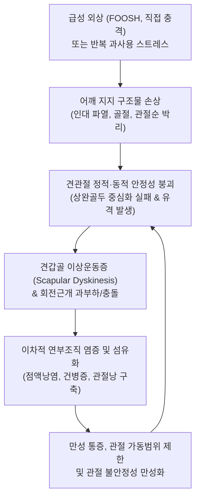

# 🩺 어깨 손상 (Overview of Shoulder Injuries)

> **핵심 3줄 요약 (Key Summary)**:
> - 📍 **병소 부위 & 해부·병태생리**: 어깨 복합체(견관절, 견봉쇄골관절, 흉쇄관절, 견흉관절)의 외상(직접 충격, 낙상) 및 과사용(반복적 거상·투구)으로 인해 발생하는 골절, 탈구, 염좌, 회전근개 파열, 관절와순 손상을 포괄하는 1차 진료 감별 및 초기 트리아지 총론이다.
> - 🚩 **전형적 임상 양상**: 수상 직후 견봉 하부 함몰 및 견봉돌출 변형(탈구), 쇄골 외측단 계단상 변형(AC 분리), 팔을 전혀 들어 올리지 못하는 가성 마비(근위부 골절 또는 급성 회전근개 완전 파열), 국소 부종과 반상출혈이 관찰된다.
> - 🛠️ **핵심 검사 & 치료 전략**: 신경혈관 손상(액와신경·요골동맥) 유무의 즉각적 확인과 단순 X-ray(AP, True AP, Scapular Y-view, Axillary view) 감별을 선행하며, 응급 수술 적응증 배제 후 비수술적 적응증에 대해 침·약침·추나 및 점진적 재활 운동을 단계별로 적용한다.
> - ⚠️ **응급 의뢰 레드플래그**: 개방성 골절 및 혈관 손상(요골동맥 맥박 소실, 창백, 냉감), 액와신경 마비(삼각근 감각 소실 및 마비), 정복되지 않는 급성 견관절 탈구, 신경총 손상 동반 의심, 급격히 진행하는 구획증후군 의심 소견.

---

## 📌 목차
1. [질환 개요 & 해부학적 병태생리](#1-질환-개요--해부학적-병태생리)
2. [병태생리 메커니즘 & 생체역학적 악순환 네트워크](#2-병태생리-메커니즘--생체역학적-악순환-네트워크)
3. [임상 증상 & 이학적 검사(Physical Exam) 알고리즘](#3-임상-증상--이학적-검사physical-exam-알고리즘)
4. [감별 진단 매트릭스 (Differential Diagnosis)](#4-감별-진단-매트릭스-differential-diagnosis)
5. [한의 통합 치료 프로토콜 (침·약침·추나·한약)](#5-한의-통합-치료-프로토콜-침약침추나한약)
6. [양방 치료 & 병용·의뢰 기준 (Conventional Treatment & Referral)](#6-양방-치료--병용의뢰-기준-conventional-treatment--referral)
7. [재활 운동 & 생활습관 티칭 가이드](#7-재활-운동--생활습관-티칭-가이드)
8. [💡 사용자 진료실 핵심 필기 & 임상 노하우 (Melt-In 잔여 심화 집약)](#8--사용자-진료실-핵심-필기--임상-노하우-melt-in-잔여-심화-집약)
9. [출처 및 학술 참고 문헌 (References)](#9-출처-및-학술-참고-문헌-references)

---

## 1. 질환 개요 & 해부학적 병태생리

**어깨 손상(Shoulder Injuries)**은 1차 의료기관 진료실 및 응급실에서 가장 흔하게 접하는 상지 근골격계 손상군이다. 해부학적으로 '어깨'는 단일 관절이 아닌 견관절(Glenohumeral, GH joint), 견봉쇄골관절(Acromioclavicular, AC joint), 흉쇄관절(Sternoclavicular, SC joint), 견흉관절(Scapulothoracic, ST articulation)의 4대 관절 복합체로 구성되어 있어 인체 관절 중 가장 광범위한 가동성을 자랑하는 대신 본질적인 구조적 취약성을 내포한다.

외상성 기전으로는 팔을 짚고 넘어지는 낙상(FOOSH: Fall On Outstretched Hand), 어깨 외측으로의 직접적 타격, 교통사고, 스포츠 충돌 손상이 대표적이며, 이에 따라 **[[어깨 골절]](쇄골 골절, 상완골 근위부 골절)**, **[[어깨 염좌]](견봉쇄골인대 손상, 오훼쇄골인대 손상)**, **[[어깨 탈구]](전방 탈구, 후방 탈구)**가 발생한다. 반면 투구, 수영, 라켓 스포츠 등에서 발생하는 비외상성 과사용 손상으로는 [[회전근개 증후군]], [[회전근개 파열]], [[SLAP 병변]], [[어깨 내회전 결핍 증후군]] 등이 유발된다.

![[어깨골절_01_영상소견_상완골근위부골절_Xray.jpg]]
> [그림 1: ① 영상 소견 — 상완골 근위부 골절(Proximal Humerus Fracture) 단순 방사선 X-ray]

![[어깨손상_01_영상소견_견봉쇄골관절_분리탈구_Xray.png]]
> [그림 2: ① 영상 소견 — 견봉쇄골관절(AC Joint) 분리 및 인대 손상(Rockwood Type III) X-ray]

---

## 2. 병태생리 메커니즘 & 생체역학적 악순환 네트워크

어깨 복합체의 손상은 단일 인대나 힘줄의 파열에 그치지 않고 어깨 복합체의 동적 짝힘(Force Couple)과 정적 지지기전을 연쇄적으로 붕괴시킨다. 전방 탈구나 강한 견인력에 의해 관절낭과 관절순이 파열되면(Bankart lesion), 상완골두가 관절와 중심에 유지되지 못하고 아탈구가 반복된다. 이 과정에서 상완골두 후외측이 관절와 전하연에 충돌하여 함몰 골절(Hill-Sachs lesion)을 일으킨다.

또한 쇄골 골절이나 AC 관절 분리가 발생하면 상지 전체를 흉곽에 매달아 지지하는 골성 지주대(Bony strut)가 무너져 견갑골이 전하방으로 하강·전방경사되는 **견갑골 이상운동증(Scapular Dyskinesis)**이 초래된다. 견갑골의 정렬 불량은 견봉하 공간을 협소화시켜 이차적인 회전근개 충돌 및 마모성 파열을 촉진하는 악순환을 유발한다.

![[어깨탈구_01_Xray_전방탈구소견.png]]
> [그림 3: ① 병태 영상 — 견관절의 가장 흔한 외상성 손상인 전방 탈구(Anterior Dislocation) X-ray]

---

## 3. 임상 증상 & 이학적 검사(Physical Exam) 알고리즘

### 1) 임상 증상
- **외상성 어깨 손상**: 외상 직후 극심한 통증과 함께 팔을 몸통에 붙이고 건측 손으로 받치는 전형적 자세를 취한다. 견관절 전방 탈구 시 견봉이 각이지게 튀어나오고 상완골두가 전하방으로 전위되어 만져지는 '견봉돌출(Epaulet sign)' 변형이 나타난다. AC 관절 손상 시 쇄골 외측단이 피하로 돌출되는 계단상 변형(Step-off deformity)이 관찰된다.
- **비외상성 과사용 손상**: 특정 각도(외전 60~120°)에서의 동통호(Painful arc), 야간통, 머리 빗기나 옷 입기 등 거상 동작에서의 무력감을 호소한다.

### 2) 이학적 검사 단계별 알고리즘
1. **신경혈관 스크리닝(최우선 필수)**:
   - 삼각근 외측 피부 감각 평가(액와신경, Axillary nerve 검사).
   - 요골동맥 맥박 및 모세혈관 재충혈 시간(CRT) 확인(쇄골하동맥 및 액와동맥 손상 배제).
2. **외상성 변형 확인 및 촉진**:
   - 쇄골 전체 주행로, 견봉쇄골관절, 결절간구(Bicipital groove), 견봉 외측연 압통점 확인.
   - AC 관절 피아노 건반 징후(Piano key sign): 돌출된 쇄골 외측단을 아래로 누를 때 건반처럼 내려갔다 튀어오르는지 확인.
3. **불안정성 및 관절와순 특수 검사**:
   - 전방 불안정성: 불안 검사(Apprehension test) 및 정복 검사(Relocation test).
   - 관절와순 손상: 오브라이언 검사(O'Brien test), 크랭크 검사(Crank test).
4. **회전근개 평가**:
   - 극상근: 엠프티 캔 검사([[엠프티 캔 검사]]) 및 풀 캔 검사([[풀 캔 검사]]).
   - 견갑하근: 복부 압박 검사(Belly-press test) 및 리프트 오프 검사(Lift-off test).

![[어깨탈구_01_환부실사_견봉돌출변형.jpg]]
> [그림 4: ② 임상 소견 — 급성 견관절 탈구 시 견봉이 돌출되고 삼각근 둥근 윤곽이 소실된 견봉돌출 변형 환부 실사]

---

## 4. 감별 진단 매트릭스 (Differential Diagnosis)

| 손상 유형 | 호발 기전 | 시진 및 촉진 특징 | 표준 영상 소견 | 1차 진료 관리 방향 |
| :--- | :--- | :--- | :--- | :--- |
| **[[쇄골 골절]]** | 어깨 외측 직접 낙상 | 쇄골 중/외 1/3 부위 팽륭, 골마찰음(Crepitus) | Clavicle AP, 15° 앙각 촬영 골절선 확인 | 단순 전위는 8자 붕대/슬링, 개방성/분쇄 골절은 수술 의뢰 |
| **[[견봉쇄골관절 손상]]** | 어깨 상단 낙상 충격 | 쇄골 외측단 돌출, Piano key sign (+) | 양측 AC Joint 방사선(부하 촬영 비교) | Rockwood I~II 보존치료, IV~VI 수술 의뢰 |
| **[[어깨 탈구]]** | 외전·외회전 강한 외력 | 견봉 각형 변형, 상완골두 전하방 전위 | True AP, Axillary view 관절와 분리 확인 | 신경혈관 확인 후 즉시 무혈성 도수정복, 실패 시 응급실 전원 |
| **[[회전근개 급성 파열]]** | 낙상 또는 무거운 물건 견인 | 수동 거상 가능, 능동 유지 불가(Drop arm +) | 어깨 초음파 또는 MRI 건 단열 확인 | 3주 이상 무력감 지속 시 정형외과 수술적 봉합 의뢰 |
| **[[상완골 근위부 골절]]** | 고령자 골다공증 낙상 | 광범위 흉벽 반상출혈, 거상 절대 불가 | Shoulder series X-ray Neer 4-part 분류 | 비전위 골절 슬링 고정, 3~4분절 골절 수술 의뢰 |

![[SLAP병변_제2형_어깨_MRI_소견.jpg]]
> [그림 5: ① 영상 감별 — 견관절 손상 후 동반될 수 있는 상부 관절와순 파열(SLAP Type II) 어깨 MRI 소견]

### ⚠️ 응급 의뢰 레드플래그
- **요골동맥 맥박 소실, 상지 청색증 또는 창백감**: 액와동맥/쇄골하동맥 파열 또는 압박 응급.
- **액와신경 및 완신경총 마비**: 삼각근 감각 소실, 수근관절 수근하수(Wrist drop) 등 복합 신경 손상.
- **도수 정복에 실패한 탈구 및 관절강 내 연부조직 감돈**.
- **피부를 뚫고 나온 개방성 골절(Open fracture)**.

---

## 5. 한의 통합 치료 프로토콜 (침·약침·추나·한약)

### 1) 침구 치료 (Acupuncture)
- **주요 혈위**: [[견우]](LI15), [[견료]](TE14), [[노유]](SI10), [[견정(소장경)]](SI9), [[거골]](LI16), [[천종]](SI11), [[곡지]](LI11), [[후계]](SI3).
- **시술 기법**:
  - 급성 손상 직후(수상 48~72시간 이내): 손상 부위 직접 자침은 피하고, 원위 취혈인 [[후계]], [[곡지]], [[조구]](ST38)를 활용한 동씨침법(動氣鍼法)으로 어깨를 조심스럽게 능동 유동하여 진통을 유도한다.
  - 아급성기 및 만성기: 견봉하 공간 및 회전근개 부착부에 0.30×40mm 호침을 사자하고, 저주파 전침(2Hz)을 적용하여 국소 혈류 개선 및 손상 조직 치유를 유도한다.

### 2) 약침 치료 (Pharmacopuncture)
- **중성어혈약침**: 급성 외상 후 조직 내 혈종 및 염증 부종이 심한 경우 견관절 주위 압통점에 0.5~1.0cc 주입하여 혈종 흡수를 촉진한다.
- **신바로약침 / 황련해독탕 약침**: 염증 반응이 극심한 견봉하 활액낭염 및 건병증 부위에 주입하여 신경 염증 물질(TNF-α, IL-6)을 억제한다.
- **태반약침(자하거) / 봉약침(BV)**: 만성기 인대 이완 및 회전근개 건 섬유 퇴행성 병소에 주입하여 콜라겐 합성을 자극한다.

### 3) 추나 요법 (Chuna Manual Therapy)
- **급성기 고정 후 가동화 추나**: 관절낭의 구축을 방지하기 위해 경골 활주(Joint play) 기법과 통증이 없는 범위 내에서의 부드러운 장축 견인(Long-axis traction)을 적용한다.
- **견갑흉곽관절 가동 추나**: 손상 후 발생하는 견갑골의 전방 경사와 회전 제한을 해결하기 위해 견갑골 가동 기법을 시행하여 어깨 복합체의 짝힘을 복원한다.

![[어깨탈구_05_술기실사_견관절_도수평가및가동.jpg]]
> [그림 6: ③ 한의 수기/술기 — 견관절 외상 후 아급성기 관절 가동성 및 연부조직 긴장도 도수 평가 술기 실사]

![[어깨 추나-20240926180601163.png]]
> [그림 7: ③ 한의 추나 — 손상 후 관절 정렬 회복 및 활주성 복원을 위한 견관절 가동화 추나 기법]

### 4) 한약 치료 (Herbal Medicine)
- **급성 외상기**: **[[당귀수산]](當歸鬚散)**을 처방하여 타박, 염좌, 골절 초기 어혈(瘀血)을 제거하고 부종을 완화한다.
- **아급성 회복기**: **[[서경탕]](舒經湯)** 또는 **[[오적산]](五積散)**을 활용하여 기혈 순환을 돕고 관절 경직을 예방한다.
- **만성 조직 결손기**: **대보원전(大補元煎)**이나 **신통축어탕(身痛逐瘀湯)**을 처방하여 손상된 건과 인대의 결합조직 합성을 촉진한다.

---

## 6. 양방 치료 & 병용·의뢰 기준 (Conventional Treatment & Referral)

### 1) 약물 및 보존 치료
- **진통소염제(NSAIDs)**: Aceclofenac 100mg bid, Celecoxib 200mg qd 처방을 통한 급성 통증 조절.
- **고정 장치**: 단순 염좌 및 안정형 골절의 경우 팔걸이(Sling) 또는 어깨 고정기(Shoulder immobilizer)를 1~3주간 적용하되, 장기 고정으로 인한 동결견(오십견) 합병증을 방지하기 위해 조기 진자 운동을 병행한다.

### 2) 주사 및 수술 적응증
- **견봉하/관절강 내 주사**: 극심한 염증성 통증 시 Triamcinolone 국소 주사를 시행할 수 있으나, 건 파열 위험이 있으므로 급성 건파열 의심 시에는 피해야 한다.
- **수술적 치료 적응증**:
  - 분쇄 상완골 골절, 전위가 심한 쇄골 골절, Rockwood Type IV~VI의 고도 견봉쇄골관절 손상.
  - 급성 외상성 전층 회전근개 파열(특히 활동적 연령층에서 조기 수술 권장).
  - 재발성 탈구 및 심한 관절와 골결손(Bone loss >20%).

### 3) 한의 병용 및 상호작용
- 골절이나 수술 후 회복기 환자에서 침·뜸·한약 치료를 병용하면 뼈 유합 기간을 단축시키고 수술 후 연부조직 유착 및 관절 강직을 예방하는 데 탁월한 효과를 나타낸다.

---

## 7. 재활 운동 & 생활습관 티칭 가이드

### 1) 코드만 진자 운동 (Codman Pendulum Exercise)
- 상체를 90도 숙이고 건측 손으로 테이블을 지지한 후, 환측 팔을 중력에 의해 자연스럽게 늘어뜨린다.
- 몸통의 반동을 이용하여 시계 방향, 반시계 방향, 전후, 좌우로 원을 그리듯 부드럽게 흔든다(관절낭 내 압력 감소 및 조기 윤활액 순환). 통증 없이 하루 3회, 5분씩 시행한다.

### 2) 견갑골 안정화 및 벽 슬라이드 (Wall Slide)
- 팔꿈치를 벽에 대고 천천히 위로 밀어 올리며 전거근과 하부 승모근을 활성화하여 견갑골의 상방 회전을 유도한다.

### 3) 회전근개 등척성 수축 운동
- 고정기 착용 중에도 벽이나 문틀을 이용하여 팔을 밀거나 당기는 등척성(Isometric) 내회전·외회전 수축을 시행하여 근위축을 방지한다.

![[어깨탈구_07_재활운동_견관절_가동운동.gif]]
> [그림 8: ④ 재활 운동 — 어깨 손상 회복기 관절 가동범위 점진적 회복을 위한 진자 운동(Codman exercise)]

---

## 8. 💡 사용자 진료실 핵심 필기 & 임상 노하우 (Melt-In 잔여 심화 집약)

- **1차 진료실 '가성 마비(Pseudoparalysis)' 감별 요령**:
  - 팔을 들어 올리지 못한다고 해서 모두 회전근개 완전 파열이나 신경 마비가 아니다.
  - 급성기 심한 통증으로 인한 억제성 가성 마비인지, 실제 건 단열에 의한 마비인지는 **수동 거상(Passive elevation)**을 해보면 알 수 있다.
  - 한의사가 환자의 팔을 수동으로 끝까지 올려주었을 때 그 위치를 스스로 유지할 수 있으면 가성 마비(단순 염좌·부분 파열)이고, 지지 손을 떼자마자 팔이 뚝 떨어지면(Drop arm sign 양성) 완전 파열 또는 액와신경 마비이므로 즉시 MRI 정밀 검사를 의뢰해야 한다.
- **고정 기간의 딜레마 극복**:
  - 어깨는 3주만 고정해도 유착성 관절낭염(오십견)이 발생하기 가장 쉬운 관절이다.
  - 전방 탈구 최초 정복 후에도 1~2주 이상의 장기 고정은 재발률을 낮추지 못한다는 현대 연구가 정설이므로, 통증이 경감되는 즉시 2주 차부터 코드만 진자 운동과 수동 외회전 운동(중립 위치까지)을 적극적으로 티칭해야 관절 구축을 막을 수 있다.
- **약침 자침 포인트의 임상적 팁**:
  - 결절간구의 상완이두근 장두건 압통점과 견봉 후외측 함요처에 중성어혈약침을 0.3~0.5cc씩 자입하면 수상 후 발생하는 관절강 내 압력 상승과 뻐근한 심부 팽만감을 즉각적으로 해소해 줄 수 있다.

---

## 9. 출처 및 학술 참고 문헌 (References)

1. Doyle J, Bellamy M, Fowler K, Keiller H, Gunasekera R, Funk L. (2026). Shoulder injuries in rugby union: a systematic review and meta-analysis. *Arch Orthop Trauma Surg*, 146(1):273. [PMID 42527622](https://pubmed.ncbi.nlm.nih.gov/42527622/)

2. Kibler WB, Sciascia A. (2026). Role of Scapular Dyskinesis in Shoulder Injuries and Rehabilitation Approaches: Commentary. *J Athl Train*, 61(2):112-118. [PMID 42483743](https://pubmed.ncbi.nlm.nih.gov/42483743/)

3. Ali A, Andrade S, Viswanath O, Ganti L. (2026). Swimming-related shoulder injuries: A Bibliometric Analysis of Global Research Trends. *Orthop Rev (Pavia)*, 18:167319. [PMID 42688900](https://pubmed.ncbi.nlm.nih.gov/42688900/)

---

## 관련 노트

- [[어깨 골절]]
- [[어깨 염좌]]
- [[어깨 탈구]]
- [[회전근개 증후군]]
- [[회전근개 파열]]
- [[SLAP 병변]]
- [[어깨 내회전 결핍 증후군]]
- [[유착성 관절낭염]]
