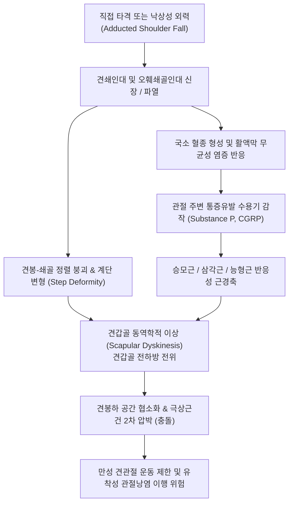

# 🩺 어깨 염좌 (Shoulder Sprain / Acromioclavicular & Glenohumeral Joint Sprain)

> **핵심 3줄 요약 (Key Summary)**:
> - 📍 **병소 부위 & 해부·병태생리**: 어깨 복합체를 안정화하는 [[견쇄관절]](Acromioclavicular joint)의 견쇄인대(AC ligament) 및 오훼쇄골인대(CC ligament, 원추인대·능형인대) 또는 관절와상완관절낭의 급인성 과신전·외력에 의한 섬유 단열 및 아탈구.
> - 🚩 **전형적 임상 양상**: 어깨 외측/상부의 국소적 급성 동통, 수평 내전(Cross-body adduction) 및 능동적 거상 시 통증 악화, 쇄골 원위부의 돌출 및 피아노 건반 징후(Piano key sign) 양성.
> - 🛠️ **핵심 검사 & 치료 전략**: Rockwood 분류(Type I~VI) 기반 방사선 양측 스트레스 뷰 감별, 급성기 RICE·슬링 고정 후 침·황련해독탕/자하거 약침을 통한 무균성 염증 제어 및 2~3단계 견갑흉곽/견관절 추나 가동술·재활.
> - ⚠️ **응급 의뢰 레드플래그**: Rockwood IV~VI형(쇄골의 후방 승모근 관통, 100% 이상 완전 상방 전위, 오훼돌기하 하방 탈구), 쇄골하 동정맥 박동 소실, 완신경총 마비 징후, 쇄골 개방성 골절 의심 소견 시 즉각 정형외과 응급 의뢰.

---

## 📌 목차
1. [질환 개요 & 해부학적 병태생리](#1-질환-개요--해부학적-병태생리)
2. [병태생리 메커니즘 & 생체역학적 악순환 네트워크](#2-병태생리-메커니즘--생체역학적-악순환-네트워크)
3. [임상 증상 & 이학적 검사(Physical Exam) 알고리즘](#3-임상-증상--이학적-검사physical-exam-알고리즘)
4. [감별 진단 매트릭스 (Differential Diagnosis)](#4-감별-진단-매트릭스-differential-diagnosis)
5. [한의 통합 치료 프로토콜 (침·약침·추나·한약)](#5-한의-통합-치료-프로토콜-침약침추나한약)
6. [양방 치료 & 병용·의뢰 기준 (Conventional Treatment & Referral)](#6-양방-치료--병용의뢰-기준-conventional-treatment--referral)
7. [재활 운동 & 생활습관 티칭 가이드](#7-재활-운동--생활습관-티칭-가이드)
8. [💡 사용자 진료실 핵심 필기 & 임상 노하우 (Melt-In 잔여 심화 집약)](#8--사용자-진료실-핵심-필기--임상-노하우-melt-in-잔여-심화-집약)
9. [출처 및 학술 참고 문헌 (References)](#9-출처-및-학술-참고-문헌-references)

---

## 1. 질환 개요 & 해부학적 병태생리

어깨 염좌(Shoulder Sprain)는 임상적으로 어깨 복합체(Shoulder Complex)를 구성하는 지지 인대와 관절낭 조직이 외력(직접 타격 또는 낙상 시 팔을 짚는 간접 외력)에 의해 신장되거나 부분/완전 파열된 병태를 총칭한다. 임상에서 마주하는 외상성 어깨 염좌의 80% 이상은 [[견쇄관절]](Acromioclavicular joint, AC joint) 손상에 해당하며, 나머지는 흉쇄관절(SC joint) 염좌 또는 상완관절와관절(GH joint) 관절낭 인대 복합체(Glenohumeral ligaments)의 급성 염좌이다.

![[어깨염좌_01_영상소견_견쇄관절탈구_Xray.png]]
> [그림 1: ① 병태생리·영상 — 견쇄관절 손상에 따른 쇄골 원위부 전위 방사선 소견 (Wikimedia Commons, CC BY 2.5)]

견쇄관절은 견봉(Acromion)과 쇄골 원위부(Distal clavicle)를 연결하는 평면 활액 관절로, 수평 안정성을 제공하는 견쇄인대(상·하·전·후 견쇄인대)와 수직 안정성을 제공하는 강력한 [[오훼쇄골인대]](Coracoclavicular ligament: 외측 능형인대 Trapezoid + 내측 원추인대 Conoid)로 지지된다. 직접적으로 어깨의 외측 상방(외측 견봉부)에 낙상 충격이 가해지면 견봉은 하방 및 내측으로 밀려 내려가지만, 쇄골은 승모근(Trapezius)과 흉쇄유돌근(SCM)의 지지로 원래 위치를 유지하려 하므로 상대적으로 견쇄관절의 분리 및 인대 손상이 일어난다(Pallis et al., 2012).

임상적으로 가장 널리 쓰이는 Rockwood 분류 체계는 손상 정도를 6단계로 구분한다:
1. **Type I**: 견쇄인대의 경미한 염좌(미세 섬유 손상), 오훼쇄골인대 정상, X-ray상 정상 관절 정렬.
2. **Type II**: 견쇄인대 완전 파열, 오훼쇄골인대 부분 염좌, 쇄골 원위부가 견봉에 비해 50% 미만 경미하게 상방 전위.
3. **Type III**: 견쇄인대 및 오훼쇄골인대 모두 완전 파열, 쇄골이 25~100% 상방 전위되며 뚜렷한 '계단 변형(Step deformity)' 관찰.
4. **Type IV**: 쇄골 원위부가 후방으로 전위되어 승모근 근막을 관통.
5. **Type V**: Type III의 극단적 형태로, 삼각근 및 승모근 부착부가 박리되며 쇄골이 정상 오훼쇄골 간격 대비 100~300% 심하게 상방 전위.
6. **Type VI**: 쇄골 원위부가 견봉하 또는 오훼돌기 하방으로 전위된 극히 드문 형태.

이 중 Type I과 II는 보존적 한의 치료의 절대적 적응증이며, Type III는 환자의 연령, 노동/스포츠 요구도에 따라 보존 치료 우선 전략이 권장된다(Moyal et al., 2025).

---

## 2. 병태생리 메커니즘 & 생체역학적 악순환 네트워크

![[관절낭패턴_견관절_관절낭_및_오훼상완인대_해부도해.png]]
> [그림 2: ② 관련 해부 구조물 — 견관절 관절낭 및 오훼상완인대·견쇄인대 복합 구조 해부도해 (Simbio Archive)]

견쇄관절 및 견관절낭 인대의 손상은 단순한 국소 결합조직 파열에 그치지 않고, 상지대 전체의 운동학적 사슬(Kinetic chain)을 붕괴시킨다. 쇄골은 견갑골을 흉곽으로부터 적절한 외측 거리에 유지시키는 일종의 '버팀목(Strut)' 역할을 하므로, 인대 복합체가 손상되어 수평/수직 안정성이 소실되면 견갑골은 전하방으로 전방 경사(Anterior tilting) 및 내회전된다.

![[견관절낭_해부도_인대구조.png]]
> [그림 3: ② 관련 해부 구조물 — 관절와순 및 관절낭 복합체 인대 지지망 해부 (Simbio Archive)]

이로 인해 견봉하 공간(Subacromial space)이 협소화되어 2차적인 [[견봉하 충돌 증후군]] 및 [[회전근개 건염]](극상근건 압박)이 유발된다. 또한 견갑골의 비정상적 운동(Scapular dyskinesis)은 상부 [[승모근]]과 견갑거근의 과긴장 및 통증유발점(TrP) 형성을 초래하며 만성 경견완 증후군으로 이행되는 악순환을 형성한다.

---

## 3. 임상 증상 & 이학적 검사(Physical Exam) 알고리즘

### 3.1 주요 자각 증상
- **국소 압통 및 종창**: 견쇄관절 상면에 극심한 압통이 확인되며, 손상 후 수 시간 내에 반상출혈(Ecchymosis) 및 부종이 발생한다.
- **수평 내전 시 격통**: 환측 팔을 반대편 어깨 쪽으로 가로지르는 동작(Cross-body adduction) 시 견쇄관절 면이 맞물려 압박되면서 날카로운 통증이 유발된다.
- **상지 거상 곤란**: 90도 이상의 외전이나 굴곡 거상 시 쇄골의 정상 축회전이 제한되어 가동 범위 끝에서 심한 통증이 발생한다.
- **계단 변형(Step deformity)**: Type II 이상에서는 피부 아래로 쇄골 원위부가 불거져 계단 형태의 단차가 육안으로 관찰된다.

### 3.2 핵심 이학적 검사법

![[호킨스검사_1단계_어깨90도굴곡_팔꿈치90도_자세세팅.jpg]]
> [그림 4: ③ 이학적 검사 — 견봉하 충돌 및 견쇄관절 스트레스 유발을 위한 검사 세팅 (Simbio Archive)]

1. **피아노 건반 징후 (Piano Key Sign)**:
   - 튀어나온 쇄골 원위부를 검사자의 엄지손가락으로 아래로 누르면 피아노 건반처럼 쑥 내려갔다가, 손을 떼면 인대의 수직 지지력 상실로 인해 다시 튀어 올라오는 징후. Type III 이상에서 전형적 양성.
2. **수평 내전 검사 (Cross-Body Adduction Test / Scarf Test)**:
   - 환자의 어깨를 90도 굴곡한 상태에서 수평으로 반대쪽 가슴 방향으로 수동 내전시킨다. 견쇄관절 부위에 국소적 통증이 재현되면 양성(민감도 77%, 특이도 79%).
3. **능동 압박 검사 (O'Brien Test)**:
   - 견관절 90도 굴곡, 10~15도 내전 상태에서 첫째, 엄지를 아래로 향하게(내회전) 하고 하방 저항을 가했을 때 통증 발생; 둘째, 손바닥을 위로 향하게(외회전) 했을 때 통증 완화 여부를 평가. 통증이 어깨 '꼭대기(Top)'에 국한되면 견쇄관절 병변, 관절 깊숙한 곳이면 SLAP 병변 시사.
4. **Paxinos 검사 (Paxinos Sign)**:
   - 검사자가 뒤에서 엄지손가락을 견봉 후외측에 대고, 검지와 중지를 쇄골 원위부 상면에 올려 서로 맞당기듯 압박. 견쇄관절에 유의한 통증 유발 시 양성.

---

## 4. 감별 진단 매트릭스 (Differential Diagnosis)

| 감별 질환 | 호발 연령/원인 | 압통 및 병변 부위 | 특이적 이학적 검사 | 방사선/초음파 감별 소견 |
| :--- | :--- | :--- | :--- | :--- |
| **어깨 염좌 (견쇄관절)** | 10~30대 스포츠/낙상 | 쇄골 원위부 관절면 | Cross-body test (+), Piano key (+) | 쇄골 상방 전위, 오훼쇄골 간격 확장 |
| **[[쇄골 골절]]** | 전 연령 낙상/외상 | 쇄골 골간부(중간 1/3) | 골편 마찰음(Crepitus), 골 타진통 (+) | 쇄골 피질골 불연속성 골절선 관찰 |
| **[[회전근개 파열]]** | 40대 이상/퇴행+외상 | 대결절 부위, 극상근건 | Drop arm test (+), Empty can test (+) | 초음파/MRI상 건의 불연속 및 퇴행 |
| **[[견관절 탈구]]** | 젊은 층, 외전/외회전 외상 | 상완골두 하방/전방 전위 | Sulcus sign (+), Apprehension test (+) | Glenohumeral joint 완전 분리 (방카르트/힐삭스) |
| **[[견봉하 충돌 증후군]]** | 중장년 반복적 오버헤드 | 견봉 전외측 하부 | Neer test (+), Hawkins-Kennedy test (+) | 견봉 오구돌기 돌출, 견봉하 점액낭 비후 |

---

## 5. 한의 통합 치료 프로토콜 (침·약침·추나·한약)

어깨 염좌의 한의 치료는 손상 급성기(1~7일)의 무균성 혈종 및 염증 제어, 아급성기(2~4주)의 인대 섬유 유합 및 관절 안정성 복원, 만성기(4주 이후)의 견갑-상완 리듬 회복의 3단계로 진행한다.

![[어깨 추나-20240926180601163.png]]
> [그림 5: ⑤ 한의 통합 치료 — 견갑흉곽관절 및 견관절 가동성 회복을 위한 한의 추나 기법 (Simbio Archive)]

### 5.1 침치료 & 전침 프로토콜
- **주요 경혈**: 견우(LI15), 견료(TE14), 거골(LI16), 견정(GB21), 노회(TE13), 곡지(LI11), 천종(SI11).
- **국소 침술**: 쇄골 원위부와 견봉 사이 견쇄관절낭 주변 연부조직에 0.25×40mm 호침을 사자(Oblique insertion)하여 심부 인대 부착부의 혈류 개선을 촉진.
- **전침(Electroacupuncture)**: 견우-거골, 견료-노회 쌍으로 연결하여 2Hz 연속파(급성 염증 진통) 또는 2/100Hz 혼합파(근경련 억제)를 15분간 적용.

![[어깨탈구_05_술기실사_견관절_도수평가및가동.jpg]]
> [그림 6: ⑤ 한의 통합 치료 — 견관절 관절낭 이완 및 조절 도수 평가 기법 (Simbio Archive)]

### 5.2 약침 요법
- **급성기 염증 제어**: **황련해독탕 약침** 또는 **중성어혈(Neutral Blood Stasis) 약침** 1.0~2.0cc를 견쇄관절낭 및 오훼쇄골인대 부착점(쇄골 하면 외측 1/3)에 분할 주입하여 급성 삼출액 흡수 촉진.
- **인대 재생 및 건 강화기**: **자하거(Placenta) 약침** 또는 **녹용·신바로 약침**을 오훼쇄골인대 기시부와 견봉하 공간에 주입하여 콜라겐 섬유 재배열과 조직 유합을 가속화.

### 5.3 추나치료 (Chuna Manual Therapy)
- **급성기(Rockwood I~II)**: 견쇄관절 자체의 직접적 과가동(HVLA)은 절대 금기. 주변부 흉쇄유돌근, 상부 승모근, 쇄골하근, 소흉근에 대한 근막이완기법(JS 신연기법)을 적용하여 쇄골을 상방으로 견인하는 비정상적 근긴장을 해소.
- **아급성/회복기**: 흉추 후만 교정 및 견갑흉곽관절 가동술(Scapulothoracic mobilization). 쇄골 원위부 하방 활주 유도 및 견갑골 후인-하강 패턴 정상화.

### 5.4 한약 변증 처방
- **기체어혈(氣滯瘀血, 급성 외상기)**: 당귀수산(當歸鬚散), 활혈통기산(活血通氣散) — 국소 어혈 제거, 부종 감소.
- **경락어체(經絡瘀滯, 아급성기 통증 잔여)**: 서경탕(舒經湯), 오적산(五積散) 가미방 — 견비통 완화, 연부조직 이완.
- **간신부족·기혈허약(肝腎不足·氣血虛弱, 인대 이완 및 만성 통증)**: 독활기생탕(獨活寄生湯), 대방풍탕(大防風湯) — 인대 및 관절 연골 강화, 조직 재생 촉진.

---

## 6. 양방 치료 & 병용·의뢰 기준 (Conventional Treatment & Referral)

### 6.1 약물 및 보존 요법
- **약물 치료**: 경구 NSAIDs(Aceclofenac 100mg bid, Celecoxib 200mg qd) 및 근이완제(Thiocolchicoside, Eperisone)를 급성기 5~10일간 단기 투여.
- **고정 요법**: 팔걸이(Sling) 또는 Kenny-Howard 보조기를 1~2주간 착용하여 상지 무게가 견쇄관절을 하방 견인하지 않도록 지지.

### 6.2 수술적 치료 적응증
- **절대적 수술 적응증**: Rockwood Type IV, V, VI (피부 관통 위험, 심한 근막 파열, 신경혈관 압박 위험).
- **상대적 수술 적응증**:
  - Rockwood Type III 환자 중 프로 오버헤드 운동선수, 무거운 짐을 드는 육체노동자.
  - 3~6개월 이상의 적극적 보존적 치료에도 만성 동통 및 견관절 기능 부전이 지속되는 경우(오훼쇄골인대 재건술 시행, Boufadel et al., 2026).

### 6.3 양방·전문과 의뢰 기준 (Referral Criteria)
- 쇄골 원위부의 심한 피부 팽팽함(Skin tenting) 및 천공 절박 소견.
- 요골동맥 박동 감약, 상지 저림 및 완신경총 마비 징후 동반.
- 방사선 사진상 Rockwood Type IV 이상 또는 쇄골 골절 동반 확인 시 즉각 정형외과 의뢰.

---

## 7. 재활 운동 & 생활습관 티칭 가이드

![[어깨탈구_07_재활운동_견관절_가동운동.gif]]
> [그림 7: ⑦ 재활 운동 — 급성기 이후 회복을 위한 견관절 무부하 시계추 및 가동 운동 (Simbio Archive)]

### 7.1 단계별 재활 운동
1. **1단계: 무부하 가동성 회복 (1~2주차)**
   - **코드만 진자 운동(Codman Pendulum Exercise)**: 체중을 앞으로 숙이고 환측 팔을 늘어뜨려 중력을 이용한 전후·좌우·원형 흔들기(직경 15~20cm)를 1회 2분, 일 3회 시행.
2. **2단계: 견갑골 안정화 및 등척성 운동 (2~4주차)**
   - **견갑골 후인 운동(Scapular Retraction)**: 가슴을 펴고 양 견갑골을 척추 쪽으로 모아 5초간 유지.
   - **등척성 회전근개 수축**: 벽을 이용하여 외회전·내회전 등척성 저항 운동(통증 역치 이하).
3. **3단계: 동적 저항 운동 및 기능 회복 (4주 이후)**
   - 세라밴드(Theraband)를 이용한 회전근개 강화 및 Y-to-W 운동을 통해 하부 승모근 및 전거근 활성화.

### 7.2 생활습관 티칭
- **수면 자세**: 급성기에는 환측을 아래로 하고 자는 측와진(Side-lying)을 엄금하며, 앙와위(바로 눕기) 시 팔꿈치 아래에 베개를 받쳐 견관절이 뒤로 처지지 않게 유지.
- **물건 들기 제한**: 수상 후 최소 3주간은 1kg 이상의 물건을 몸에서 멀리 뻗어 드는 동작 금지.

---

## 8. 💡 사용자 진료실 핵심 필기 & 임상 노하우 (Melt-In 잔여 심화 집약)

- **피아노 건반 징후에 집착하지 마라**: 급성기 환자는 통증과 방어성 근경축(Muscular guarding)이 극심하여 쇄골을 눌러도 잘 내려가지 않는 경우가 많다. 억지로 세게 누르면 미세 파열된 섬유가 더 찢어질 수 있으므로, 압통점 확인과 Cross-body adduction test로 선별하는 것이 안전하다.
- **승모근 TrP와의 관계**: 견쇄관절 손상 환자의 대다수는 상부 승모근(Upper trapezius)과 견갑거근에 심한 위성 통증유발점(Satellite TrP)을 동반한다. 관절낭 자체만 치료해서는 견갑골의 거상 자세가 풀리지 않으므로, 견정(GB21)과 견갑내측연의 연부조직 이완을 병행해야 치료 기간이 반으로 단축된다.
- **Rockwood III형의 치료 전략**: 과거에는 III형도 적극 수술을 권했으나, 최근 장기 추적 연구에서는 수술군과 보존치료군 사이에 최종 관절 기능과 통증 점수에서 유의한 차이가 없다는 보고가 지배적이다(Boufadel et al., 2026). 따라서 6~8주간의 적극적 한의 보존 치료(약침+추나+슬링)를 1차 선택으로 제시하는 것이 환자 만족도가 매우 높다.

---

## 9. 출처 및 학술 참고 문헌 (References)

- **Moyal H, et al. (2025)**. Acromioclavicular and sternoclavicular joint injuries in contact sports: a narrative review of conservative and surgical treatments. *Annals of joint*. [PMID 40791903](https://pubmed.ncbi.nlm.nih.gov/40791903/)
  - **[연구 요약]**: 접촉성 스포츠에서 호발하는 견쇄관절 및 흉쇄관절 손상의 보존적 치료와 수술적 치료에 대한 서술적 고찰. 록우드 I~II형은 조기 보존적 안정 및 단계적 관절 가동 운동이 표준이며, III형의 경우 환자의 스포츠 활동도에 따른 맞춤형 결정이 권장됨.
- **Pallis M, et al. (2012)**. Epidemiology of acromioclavicular joint injury in young athletes. *Am J Sports Med*. [PMID 22707749](https://pubmed.ncbi.nlm.nih.gov/22707749/)
  - **[연구 요약]**: 젊은 운동선수에서 발생하는 견쇄관절 손상의 역학적 특성을 분석한 전향적 연구. 어깨 외측에 가해지는 직접 외력이 주요 기전이며, 보존적 치료를 통한 조기 기능 회복 프로토콜의 중요성을 입증함.
- **Boufadel P, et al. (2026)**. Mid- to Long-term Outcomes of Coracoclavicular Ligament Reconstruction for Acromioclavicular Joint Dislocations: A Systematic Review of Studies With Minimum 5-Year Follow-up. *Am J Sports Med*. [PMID 42528213](https://pubmed.ncbi.nlm.nih.gov/42528213/)
  - **[연구 요약]**: 견쇄관절 탈구에 대한 오훼쇄골인대 재건술의 5년 이상 중장기 추적 관찰 결과를 종합한 체계적 문헌고찰. 만성 탈구 및 고도 전위 환자에서의 수술적 적응증과 합병증 발생률을 분석함.

---

## 관련 노트

- [[견관절 탈구]]
- [[쇄골 골절]]
- [[회전근개 파열]]
- [[견봉하 충돌 증후군]]
- [[견쇄관절]]
- [[오훼쇄골인대]]
